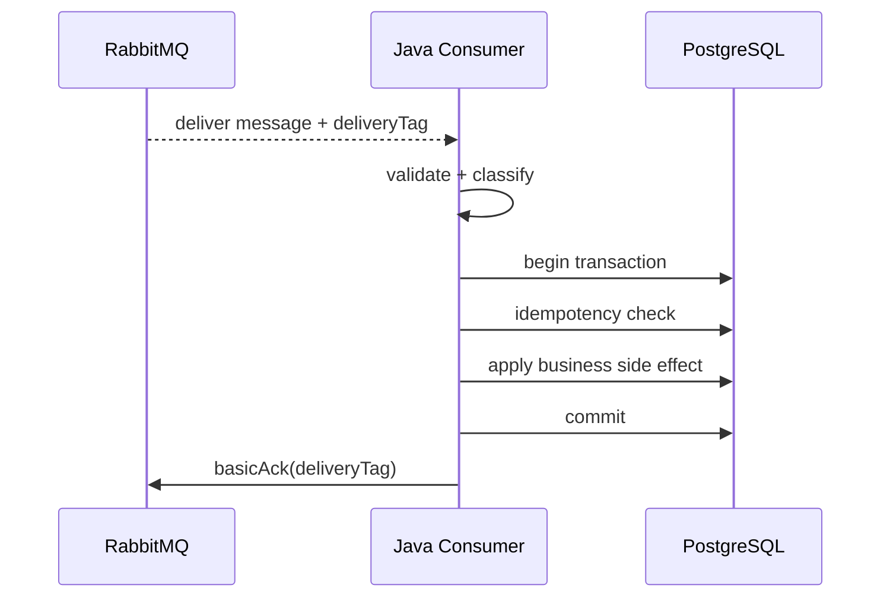
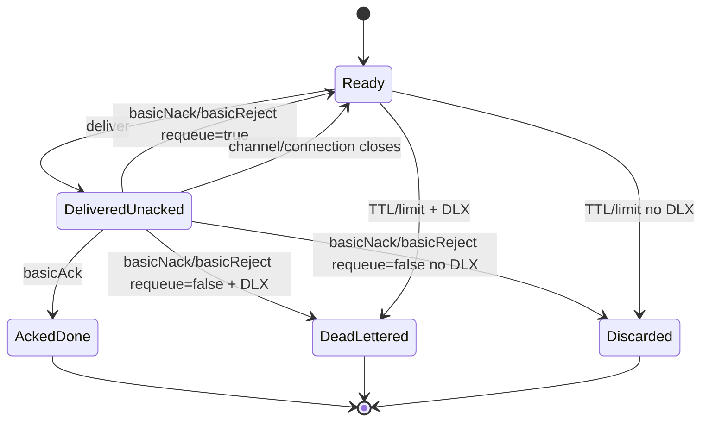
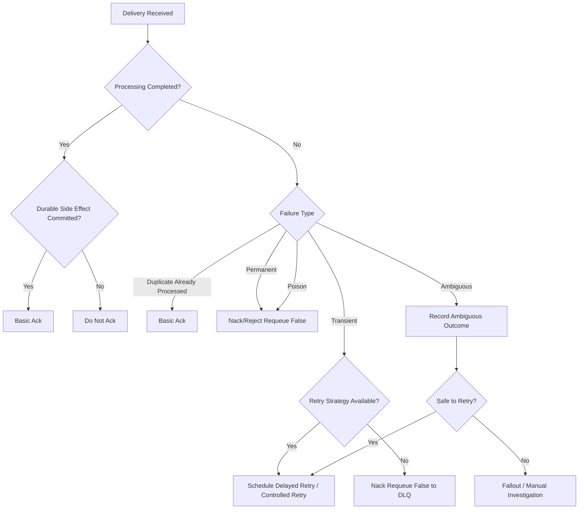

# Acknowledgement, Nack, Reject, and Redelivery

## 1. Core idea

Acknowledgement adalah mekanisme consumer memberi tahu RabbitMQ bahwa delivery sudah berhasil diterima dan diproses dengan outcome tertentu.

Dalam production system, ack/nack/reject bukan detail kecil API.

Ia adalah boundary ownership:

```text
Before ack: RabbitMQ still owns responsibility to redeliver if consumer fails.
After ack: application has accepted responsibility and RabbitMQ can delete/retire that delivery.
```

Maka setiap consumer harus menjawab:

```text
When do we ack?
When do we nack?
When do we reject?
When do we requeue?
When do we dead-letter?
```

Wrong ack discipline menyebabkan:

- message loss;
- duplicate business effect;
- retry storm;
- unacked message buildup;
- queue starvation;
- ordering surprises;
- DLQ pollution;
- hidden data inconsistency.

---

## 2. The four common outcomes

Setelah consumer menerima delivery, outcome umum adalah:

```text
1. Ack
2. Nack with requeue=true
3. Nack with requeue=false
4. Reject with requeue true/false
```

High-level meaning:

```text
ack                  -> done, remove from queue responsibility
nack requeue=true    -> not done, put back for redelivery
nack requeue=false   -> not done, do not requeue; dead-letter or discard depending queue config
reject requeue=true  -> reject one delivery and requeue
reject requeue=false -> reject one delivery and dead-letter/discard
```

In enterprise systems, this must map to failure classification:

```text
success             -> ack
known duplicate     -> ack
transient failure   -> controlled retry, usually not blind requeue
permanent failure   -> dead-letter/fallout, no requeue loop
ambiguous outcome   -> record and reconcile, avoid blind ack or blind retry
```

---

## 3. Manual ack vs auto ack

### 3.1 Auto ack

Auto ack means RabbitMQ considers the delivery successful once it is sent to the consumer.

Risk:

```text
message delivered -> consumer crashes before processing -> message lost
```

Auto ack can be acceptable for:

- telemetry where loss is acceptable;
- ephemeral notification where loss is acceptable;
- non-critical cache warmup;
- low-value best-effort stream of tasks;
- tests or demos.

Auto ack is dangerous for:

- CPQ quote state transitions;
- order management commands;
- payment/billing-related messages;
- provisioning/fulfillment messages;
- audit-relevant workflow events;
- customer-impacting notifications;
- integration messages requiring traceability.

### 3.2 Manual ack

Manual ack means consumer explicitly decides when processing is done.

Default production rule:

```text
Use manual ack for business-relevant messages.
```

Ack after:

- validation succeeded;
- idempotency checked;
- business side effect committed;
- retry/DLQ decision made;
- failure state recorded if needed.

---

## 4. Delivery tag

Delivery tag identifies a delivery on a channel.

Properties:

- generated by broker;
- monotonically increasing per channel;
- scoped to channel;
- used by `basicAck`, `basicNack`, `basicReject`;
- not a message ID;
- not stable across redelivery;
- must be acknowledged on the same channel where it was delivered.

Bad use:

```text
Use deliveryTag as idempotency key.
```

Correct use:

```text
Use deliveryTag only to tell RabbitMQ which delivery outcome is being reported.
```

Message identity should be:

- message ID;
- command ID;
- event ID;
- outbox ID;
- business operation ID.

---

## 5. Same-channel rule

Delivery must be acked/nacked/rejected on the same channel where it was delivered.

Risky pattern:

```text
consumer callback receives delivery on channel A
processing is passed to thread B
thread B uses channel C to ack deliveryTag from channel A
```

This can close the channel with an unknown delivery tag error.

Safe patterns:

1. Process and ack on the same consumer channel/thread model.
2. Pass an acknowledgement callback bound to the original channel.
3. Serialize ack operations per channel.
4. Avoid sharing channel across arbitrary worker threads.
5. Use a framework abstraction that preserves channel ownership.

Rule:

```text
Delivery tag has no meaning outside its original channel.
```

---

## 6. Ack after durable processing

Recommended default sequence:



This produces at-least-once behavior:

```text
If consumer crashes before ack, RabbitMQ can redeliver.
If business commit already happened, idempotency must absorb duplicate.
```

This is usually the right trade-off for important messages.

---

## 7. Ack before processing

Ack-before-processing trades reliability for lower broker responsibility.

Sequence:

```text
receive -> ack -> process
```

If process fails after ack:

```text
RabbitMQ will not redeliver.
```

This is effectively at-most-once consumption.

Use only when:

- loss is acceptable;
- processing is best-effort;
- another durable system already owns the task;
- message is only a hint;
- business explicitly accepts missing side effect.

For mission-critical quote/order flows, ack-before-processing is usually a design smell.

---

## 8. Ack lost scenario

Failure window:

```text
consumer commits DB
consumer sends ack
network fails before broker receives ack
broker redelivers
```

or:

```text
consumer sends ack
broker processes ack
connection fails before consumer knows
```

Consumer cannot always know whether ack reached broker.

Correct response:

```text
Design consumer idempotently.
```

Do not try to solve this with fragile in-memory state.

The broker and application are distributed peers. There will always be uncertainty around connection failure.

---

## 9. Consumer crash scenarios

### 9.1 Crash before processing

```text
message delivered
consumer crashes immediately
message unacked
RabbitMQ redelivers
```

Usually safe if consumer is idempotent.

### 9.2 Crash during processing before DB commit

```text
message delivered
DB transaction open
consumer crashes
transaction rolls back
message redelivered
```

Usually safe.

### 9.3 Crash after DB commit before ack

```text
message delivered
DB commit succeeds
consumer crashes before ack
message redelivered
duplicate processing risk
```

Requires idempotency.

### 9.4 Crash after external call before recording result

```text
message delivered
external call succeeds
consumer crashes before DB records result
message redelivered
external call may happen again
```

Requires external idempotency key or reconciliation.

---

## 10. Broker crash and connection failure

If connection fails:

- channels on that connection are closed;
- unacked deliveries are requeued/redelivered when possible;
- client may need to reconnect;
- auto recovery may recreate connection/channel/consumer;
- in-flight acknowledgement state can be uncertain.

Consumer design must assume:

```text
connection failure can produce redelivery.
```

If queue is durable and message persistent/replicated as needed, RabbitMQ helps preserve broker-side state. But the application still must handle duplicate deliveries and uncertain side effects.

---

## 11. Nack vs reject

### 11.1 Reject

`basic.reject` rejects a single delivery.

It supports:

```text
requeue=true
requeue=false
```

But it does not support bulk negative acknowledgement.

### 11.2 Nack

`basic.nack` is RabbitMQ's extension that supports negative acknowledgement and can operate on multiple unacked deliveries with the `multiple` flag.

It supports:

```text
multiple=true/false
requeue=true/false
```

Practical rule:

```text
Use basicNack when you need RabbitMQ's negative acknowledgement semantics, especially bulk behavior.
Use basicReject for simple single-message rejection when intentionally chosen.
```

Most teams standardize on one abstraction to avoid inconsistent behavior.

---

## 12. Requeue true

`requeue=true` tells RabbitMQ to put the message back for another delivery.

Use with caution.

It can be acceptable for:

- short transient failure;
- consumer shutdown before processing;
- temporary local resource issue;
- controlled retry system that prevents hot loop.

It is dangerous for:

- invalid payload;
- unsupported schema version;
- permanent business rule failure;
- deterministic code bug;
- downstream always rejecting;
- missing entity that will not appear;
- tenant/permission mismatch;
- poison message.

Bad pattern:

```java
catch (Exception e) {
    channel.basicNack(deliveryTag, false, true);
}
```

This can create an infinite redelivery loop.

---

## 13. Requeue false

`requeue=false` tells RabbitMQ not to place the delivery back into the original queue.

If the queue has a dead-letter exchange configured, the message will be dead-lettered.

If no DLX is configured, message can be discarded.

Therefore:

```text
nack/reject requeue=false must be paired with verified DLX/DLQ policy for important messages.
```

Use for:

- permanent failure;
- poison message;
- invalid contract;
- unsupported version;
- retry exhausted;
- manual fallout flow;
- message that should not block live queue.

---

## 14. Dead-lettering outcome

When message is rejected/nacked with `requeue=false`, expired, or exceeds configured limits, RabbitMQ can dead-letter it to another exchange if configured.

Dead-lettering is not magic recovery.

It is controlled failure isolation:

```text
live queue -> failure decision -> DLX -> DLQ/fallout/parking lot
```

DLQ must have:

- owner;
- alert;
- retention policy;
- replay process;
- payload privacy rules;
- triage procedure;
- dashboard;
- severity rules.

A DLQ without ownership is just delayed data loss.

---

## 15. Multiple ack

`basicAck(deliveryTag, multiple=true)` acknowledges all unacknowledged deliveries up to and including the delivery tag on the same channel.

This can improve efficiency but is risky.

Safe only when:

- processing order is strictly controlled;
- all prior deliveries are definitely complete;
- ack batching is intentionally implemented;
- concurrency does not allow later message to complete before earlier message;
- failure handling is well-tested.

Risk:

```text
Message 1 still processing
Message 2 completes
basicAck(tag2, multiple=true)
Message 1 is accidentally acked
Message 1 later fails
RabbitMQ will not redeliver
```

Rule:

```text
Avoid multiple ack in concurrent consumers unless the completion ordering is guaranteed.
```

---

## 16. Multiple nack

`basicNack(deliveryTag, multiple=true, requeue=...)` rejects all unacked deliveries up to deliveryTag on the same channel.

Useful for:

- batch rollback;
- channel-level shutdown;
- bulk failure when all in-flight messages are known unsafe.

Dangerous when:

- messages have independent outcomes;
- some were already processed successfully;
- some have external side effects;
- consumer uses parallel processing;
- ack state is not tracked accurately.

Rule:

```text
Bulk nack is an advanced operation. Use only with explicit in-flight ownership tracking.
```

---

## 17. Redelivery flag

RabbitMQ can mark a delivery as redelivered when it is being delivered again after requeue/redelivery.

Meaning:

```text
This delivery may have been seen before.
```

Important nuance:

```text
redelivered=true means possible previous delivery.
redelivered=false means RabbitMQ does not consider it redelivery.
```

Do not use it as the only duplicate detector because:

- duplicate publish can produce separate messages;
- manual replay may create new publish;
- shovel/federation may create new copies;
- message identity belongs in message metadata, not delivery state.

Use redelivery flag for:

- logging;
- metrics;
- retry diagnosis;
- alerting on redelivery storm;
- deciding to inspect inbox table eagerly.

---

## 18. Automatic requeue on channel/connection close

When a channel or connection closes before unacked deliveries are acked, RabbitMQ will requeue/redeliver those deliveries where possible.

Common triggers:

- application crash;
- network failure;
- unknown delivery tag protocol exception;
- consumer timeout;
- broker failover;
- Kubernetes pod termination;
- channel closed due to application error.

This behavior protects against lost work, but creates duplicate processing risk.

Therefore:

```text
automatic requeue is useful only when consumers are idempotent.
```

---

## 19. Consumer acknowledgement timeout

RabbitMQ has consumer delivery acknowledgement timeout behavior, with version-specific details and queue-type applicability depending on RabbitMQ version.

Operational meaning:

```text
If a consumer holds a delivery unacked beyond configured timeout, RabbitMQ can close the channel and requeue deliveries.
```

Potential causes:

- consumer hung;
- DB query stuck;
- external call no timeout;
- too high prefetch;
- CPU throttling;
- worker deadlock;
- infinite loop;
- large message processing;
- debugger attached in non-production;
- downstream outage.

Review questions:

- Is timeout configured globally or per queue?
- Is the queue type affected by this setting in the deployed RabbitMQ version?
- Are long-running jobs modeled correctly?
- Should work be split into smaller messages?
- Is progress persisted?
- Are external call timeouts bounded?

Do not fix timeout incidents only by increasing timeout. First understand why the consumer holds messages unacked too long.

---

## 20. Unacked messages

Unacked messages are delivered to consumers but not yet acked/nacked/rejected.

Healthy unacked count depends on:

```text
consumer_count * prefetch_count
```

Potential issue if unacked grows or stays high:

- consumer processing is slow;
- consumer hung;
- DB/downstream bottleneck;
- prefetch too high;
- ack never called;
- channel blocked by worker model;
- consumer thread pool saturated;
- message processing time increased;
- consumer crashed but broker has not detected connection failure yet.

Debug path:

```text
1. Check consumer count.
2. Check prefetch.
3. Check processing latency.
4. Check DB/downstream latency.
5. Check consumer logs after receive before ack.
6. Check thread dumps if Java process is alive.
7. Check connection/channel state.
8. Check recent deployments.
```

---

## 21. Redelivery storm

Redelivery storm occurs when the same failing messages are repeatedly delivered and requeued quickly.

Symptoms:

- high redelivery rate;
- repeated identical errors;
- queue depth not decreasing;
- CPU/log spikes;
- DB/downstream pressure;
- low useful throughput;
- same message IDs appear repeatedly;
- consumer utilization high but business progress low.

Common cause:

```text
catch Exception -> nack requeue=true
```

Mitigations:

- classify failures;
- use bounded retry;
- delay retry;
- use DLX/DLQ after retry exhaustion;
- isolate poison messages;
- stop consumers if they are amplifying downstream outage;
- add circuit breaker for downstream dependency;
- use backoff and jitter.

---

## 22. Ordering impact

Ack/nack/requeue affects ordering.

Cases:

### 22.1 Multiple consumers

Messages can complete out of order because consumers process in parallel.

### 22.2 Requeue

Requeued message may not return to the exact original position under concurrent deliveries.

### 22.3 Retry queue

Moving message to retry queue breaks original queue ordering.

### 22.4 DLQ/replay

Replay later can introduce old messages into current business state.

### 22.5 Multiple ack

Incorrect multiple ack can mark earlier unfinished deliveries as done.

Rule:

```text
If business requires strict ordering, ack/retry/concurrency design must be reviewed together.
```

---

## 23. Prefetch interaction

Prefetch controls how many unacked deliveries can be outstanding.

Ack discipline affects prefetch:

```text
No ack -> prefetch window fills -> broker stops delivering more messages to that consumer.
```

High prefetch with slow processing causes:

- many unacked messages;
- long redelivery batch on crash;
- uneven distribution;
- memory pressure in consumer;
- longer time before poison message reaches DLQ;
- more duplicate work after pod termination.

Low prefetch causes:

- safer in-flight control;
- lower memory pressure;
- potentially lower throughput;
- better fairness for slow consumers.

Senior review:

```text
Prefetch is part of acknowledgement strategy, not isolated performance config.
```

---

## 24. Java client implementation pattern

Basic shape:

```java
DeliverCallback deliverCallback = (consumerTag, delivery) -> {
    long tag = delivery.getEnvelope().getDeliveryTag();
    try {
        ConsumerResult result = handler.handle(delivery);

        switch (result.outcome()) {
            case SUCCESS, DUPLICATE_SUCCESS -> channel.basicAck(tag, false);
            case TRANSIENT_FAILURE -> retryStrategy.retryOrDeadLetter(channel, delivery, tag);
            case PERMANENT_FAILURE -> channel.basicNack(tag, false, false);
            case AMBIGUOUS -> ambiguityHandler.recordAndDecide(channel, delivery, tag);
        }
    } catch (Throwable t) {
        failureHandler.handleUnexpected(channel, delivery, tag, t);
    }
};
```

Important:

- do not catch everything and blindly requeue;
- do not ack in `finally`;
- do not use delivery tag outside its channel;
- do not mix channel usage across uncontrolled threads;
- do not swallow ack/nack failures;
- record final decision.

---

## 25. Transaction boundary pattern

Common safe pattern:

```java
try {
    transactionTemplate.execute(status -> {
        inboxService.claim(messageId, consumerName);
        domainService.applyCommand(command);
        inboxService.markProcessed(messageId, consumerName);
        return null;
    });

    channel.basicAck(deliveryTag, false);
} catch (DuplicateAlreadyProcessed e) {
    channel.basicAck(deliveryTag, false);
} catch (PermanentMessageException e) {
    channel.basicNack(deliveryTag, false, false);
} catch (TransientDependencyException e) {
    retryStrategy.scheduleRetryOrNack(delivery, deliveryTag);
}
```

Key point:

```text
DB transaction does not include RabbitMQ ack.
```

So the post-commit/pre-ack duplicate window remains.

That is why inbox/idempotency is required.

---

## 26. Ack failure handling

`basicAck` can fail if:

- channel is closed;
- connection is lost;
- delivery tag invalid;
- ack attempted on wrong channel;
- broker node unavailable;
- client is shutting down.

If ack fails after DB commit:

```text
Do not rollback the committed business transaction.
Expect redelivery and rely on idempotency.
```

Log with:

- message ID;
- delivery tag;
- channel identifier if available;
- consumer name;
- business entity ID;
- transaction outcome;
- correlation ID.

---

## 27. Nack failure handling

`basicNack` can also fail due to channel/connection issue.

If nack fails:

- broker may later requeue unacked delivery automatically due connection close;
- if connection remains but channel state unclear, inspect channel error;
- avoid assuming DLQ happened;
- emit metric/log;
- rely on broker/client recovery and observability.

If failure was permanent but nack failed due connection loss, message may redeliver.

Consumer must classify it again and eventually DLQ/reject safely.

---

## 28. Retry via nack requeue=true vs retry topology

Blind requeue is usually not a good retry strategy.

Better retry strategies:

- delayed exchange retry;
- TTL retry queue + DLX back to live exchange;
- application-managed retry with outbox/table;
- parking lot queue after retry exhaustion;
- quorum queue delivery limit if applicable;
- external workflow/fallout process.

Why not immediate requeue?

```text
It retries too fast, preserves no backoff, amplifies outages, and can starve good messages.
```

Use `requeue=true` mainly for:

- controlled shutdown before processing;
- very short local transient condition;
- framework-level recovery where retry storm is impossible or bounded.

---

## 29. Dead-letter safety checklist

Before using `nack(false, false)` or `reject(false)` for important messages, verify:

- source queue has DLX configured;
- DLX exists and is durable;
- DLX routes to expected DLQ;
- DLQ exists and is durable;
- DLQ has alerting;
- DLQ has owner;
- DLQ payload is privacy-safe;
- x-death header is preserved;
- replay tooling exists;
- replay cannot cause duplicate damage;
- DLQ retention is known;
- parking lot/fallout is defined for exhausted retry.

Without this, `requeue=false` can become silent discard depending configuration.

---

## 30. Consumer shutdown and ack discipline

Graceful shutdown sequence:

```text
1. Stop accepting new deliveries if possible.
2. Cancel consumer or close channel intentionally.
3. Allow in-flight messages to finish within timeout.
4. Ack completed messages.
5. Do not ack incomplete messages.
6. Let incomplete messages redeliver safely.
7. Close channel/connection.
```

Kubernetes concerns:

- termination grace period;
- preStop hook;
- readiness false before shutdown;
- liveness should not kill slow but healthy consumer;
- prefetch must not exceed drain capacity;
- thread pool must stop cleanly;
- external calls need timeouts.

Bad shutdown:

```text
SIGTERM -> process exits immediately -> many unacked redeliveries -> duplicate load spike
```

---

## 31. Long-running jobs

RabbitMQ delivery acknowledgement is not a perfect fit for very long-running jobs unless carefully designed.

Risks:

- long unacked duration;
- consumer ack timeout;
- redelivery after worker restart;
- poor progress visibility;
- large duplicate work;
- inability to cancel cleanly;
- lock/resource held too long.

Better pattern:

```text
message creates durable job row
ack message after job row is committed
separate job worker processes job with progress, cancellation, retry, timeout
```

This transfers responsibility from RabbitMQ delivery to application job state.

Use this for:

- pricing batch;
- order decomposition batch;
- long fulfillment workflow;
- file generation;
- integration reconciliation;
- large import/export task.

---

## 32. Message state machine

A useful mental model:

```text
READY -> DELIVERED_UNACKED -> ACKED_DONE
                         -> NACK_REQUEUE -> READY
                         -> NACK_NO_REQUEUE -> DLQ/DISCARD
                         -> CHANNEL_CLOSED -> READY/REDELIVER
                         -> EXPIRED/LIMIT -> DLQ/DISCARD
```

Mermaid:



---

## 33. Production debugging: message stuck unacked

Symptom:

```text
Ready stable, unacked high, processing not completing.
```

Check:

- consumer logs after receive;
- thread dump;
- DB query wait;
- downstream timeout;
- deadlock;
- executor queue saturation;
- missing ack path;
- exception swallowed;
- delivery acknowledgement timeout logs;
- prefetch too high;
- deployment rollout stuck;
- CPU throttling/OOM.

Immediate safe actions:

- avoid purging queue blindly;
- do not kill all consumers without understanding duplicate impact;
- scale consumers only if downstream can handle it;
- reduce traffic/publish rate if possible;
- isolate poison messages if identified;
- capture message IDs and correlation IDs.

---

## 34. Production debugging: message redelivered repeatedly

Symptom:

```text
same message ID appears repeatedly in logs
redelivery rate high
DLQ may or may not increase
```

Check:

- `nack(requeue=true)` path;
- consumer exception classification;
- contract validation failure;
- DB constraint failure;
- external dependency failure;
- consumer timeout;
- channel closure;
- wrong ack channel;
- deployment restarts;
- poison message.

Fix path:

```text
1. Stop hot loop if it is harming system.
2. Identify message and failure class.
3. If permanent, route to DLQ/fallout.
4. If transient, apply delayed bounded retry.
5. If duplicate, make consumer ack duplicate success.
6. Add missing metric/log/checklist.
```

---

## 35. Production debugging: lost message suspicion

Symptom:

```text
producer says published, consumer did not produce side effect
```

Check in order:

- publisher confirm success?
- mandatory return/unroutable?
- exchange/binding/routing key correct?
- queue depth/ready/unacked?
- consumer auto ack?
- consumer ack before processing?
- consumer logs by correlation ID?
- DB transaction rollback?
- DLQ/retry queue?
- manual purge/replay?
- broker restart/failover timing?
- monitoring gap?

Ack/nack part of diagnosis:

```text
If auto ack or early ack is used, broker cannot redeliver after consumer failure.
```

---

## 36. Metrics for ack discipline

Expose:

```text
consumer.deliveries.total
consumer.ack.total
consumer.nack.total
consumer.reject.total
consumer.nack.requeue_true.total
consumer.nack.requeue_false.total
consumer.redelivered.total
consumer.unacked.current
consumer.processing.duration
consumer.ack.latency_after_commit
consumer.ack.failure.total
consumer.nack.failure.total
consumer.dlq.routed.total
consumer.retry.scheduled.total
consumer.duplicate.acked.total
consumer.poison.routed.total
```

Useful ratios:

```text
redelivery_rate / delivery_rate
nack_requeue_true_rate / delivery_rate
dlq_rate / delivery_rate
duplicate_ack_rate / delivery_rate
unacked / (consumer_count * prefetch)
```

Alert candidates:

- redelivery rate spike;
- unacked saturation;
- nack requeue true spike;
- DLQ spike;
- ack failure spike;
- no ack activity while deliveries continue;
- consumer timeout channel closures.

---

## 37. Logging checklist

Every final outcome log should include:

- message ID;
- delivery tag;
- redelivered flag;
- queue;
- exchange;
- routing key;
- consumer tag;
- consumer name;
- correlation ID;
- causation ID;
- tenant ID if applicable;
- business entity ID;
- outcome: ACK/NACK/REJECT/RETRY/DLQ;
- failure classification;
- retry count;
- sanitized exception.

Avoid:

- logging full payload with PII;
- logging only delivery tag;
- logging ack success without business context;
- hiding nack/reject decisions inside generic error logs.

---

## 38. Internal verification checklist

Verify with CSG/team:

- Are consumers using manual ack or auto ack?
- Where exactly is ack called relative to DB commit?
- Are acks/nacks executed on the same channel as delivery?
- Is channel used by multiple threads?
- Is `multiple=true` used anywhere?
- Is `nack(requeue=true)` used? Under what conditions?
- Is every `requeue=false` path backed by DLX/DLQ?
- Are consumer acknowledgement timeouts configured?
- Are timeout settings version/queue-type appropriate?
- Are redelivery metrics visible?
- Are unacked messages alerted?
- Is DLQ ownership clear?
- Is replay safe and approved?
- Are Kubernetes shutdown hooks aligned with ack discipline?
- Is prefetch tuned for drain and duplicate risk?
- Are external calls recorded before ack?
- Are ack/nack failures logged and measured?

---

## 39. Ack/nack PR review checklist

### Ack timing

- Does ack happen after durable side effect?
- Does duplicate success ack safely?
- Does ack occur in `finally` accidentally?
- Does async handoff ack too early?

### Failure handling

- Are transient and permanent failures separated?
- Does poison message avoid requeue loop?
- Is ambiguous external outcome handled?
- Is retry bounded?

### Channel correctness

- Is delivery tag acked on same channel?
- Is channel shared across threads safely?
- Are ack/nack exceptions handled?
- Is multiple ack/nack avoided or justified?

### DLQ

- Is DLX configured?
- Is DLQ monitored?
- Is replay safe?
- Is payload privacy handled?

### Operations

- Are redelivery/unacked metrics available?
- Is graceful shutdown implemented?
- Does prefetch match processing time and shutdown window?
- Are consumer timeout logs monitored?

---

## 40. Common anti-patterns

### 40.1 Ack in finally

```java
try {
    process(message);
} finally {
    channel.basicAck(tag, false);
}
```

This acks failed processing.

### 40.2 Catch all and requeue true

```java
catch (Exception e) {
    channel.basicNack(tag, false, true);
}
```

This creates retry storms.

### 40.3 Ack before async processing

```java
executor.submit(() -> process(message));
channel.basicAck(tag, false);
```

This loses work if async task fails.

### 40.4 Wrong channel ack

```text
delivery on channel A, ack on channel B
```

This can close channel and redeliver.

### 40.5 Multiple ack with parallel processing

```text
acks unfinished earlier messages accidentally
```

### 40.6 No DLQ with requeue=false

```text
permanent failure becomes discard risk
```

---

## 41. Java abstraction design

A clean internal abstraction can reduce mistakes.

Example model:

```java
sealed interface ConsumerOutcome {
    record Ack() implements ConsumerOutcome {}
    record DuplicateAck() implements ConsumerOutcome {}
    record Retry(String reason) implements ConsumerOutcome {}
    record DeadLetter(String reason) implements ConsumerOutcome {}
    record Ambiguous(String reason) implements ConsumerOutcome {}
}
```

Then one component maps outcome to AMQP action:

```text
Ack/DuplicateAck -> basicAck
Retry -> delayed retry or bounded retry topology
DeadLetter -> basicNack requeue=false
Ambiguous -> record + controlled decision
```

This avoids scattering `basicAck/basicNack/basicReject` across business logic.

---

## 42. Mermaid: ack decision model



---

## 43. Senior engineer heuristics

1. Ack is an ownership transfer.
2. Auto ack means loss is acceptable.
3. Manual ack means application owns correctness.
4. Delivery tag is not identity.
5. Ack on the same channel.
6. Ack after durable side effect.
7. Redelivery is normal under failure.
8. Requeue true is not a retry strategy by itself.
9. Requeue false requires verified DLQ behavior.
10. Multiple ack/nack is dangerous with concurrency.
11. Unacked growth is a symptom, not a root cause.
12. Consumer timeout is often a design signal.
13. Ack failure after commit is handled with idempotency, not rollback.
14. DLQ without owner is delayed incident.
15. Every ack/nack decision should be observable.

---

## 44. References

- RabbitMQ Consumer Acknowledgements and Publisher Confirms: https://www.rabbitmq.com/docs/confirms
- RabbitMQ Consumers: https://www.rabbitmq.com/docs/consumers
- RabbitMQ Negative Acknowledgements: https://www.rabbitmq.com/docs/nack
- RabbitMQ Consumer Prefetch: https://www.rabbitmq.com/docs/consumer-prefetch
- RabbitMQ Reliability Guide: https://www.rabbitmq.com/docs/reliability
- RabbitMQ Dead Lettering: https://www.rabbitmq.com/docs/dlx
- RabbitMQ Java Client API Guide: https://www.rabbitmq.com/client-libraries/java-api-guide

---

## 45. Closing mental model

Ack/nack/reject is not error handling syntax.

It is the protocol-level expression of application responsibility.

The core invariant:

```text
Never ack before the application can survive losing broker ownership of the message.
```

The second invariant:

```text
Never requeue a message unless another attempt has a realistic chance to succeed safely.
```

A senior engineer reviews ack discipline by tracing every failure boundary:

```text
before processing
before DB commit
after DB commit before ack
during external call
after external call before recording result
during channel failure
during Kubernetes shutdown
during broker failover
during retry/replay
```

If those paths are explicit, observable, and idempotent, the consumer is production-ready.
