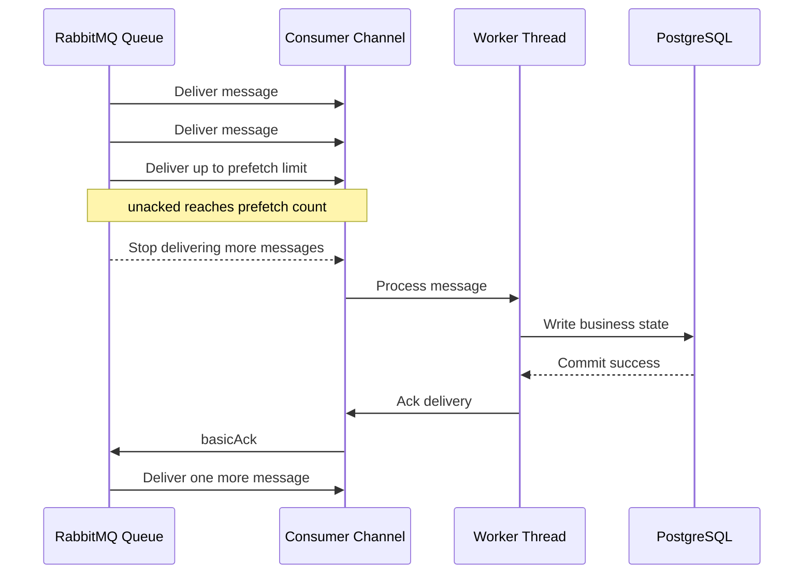
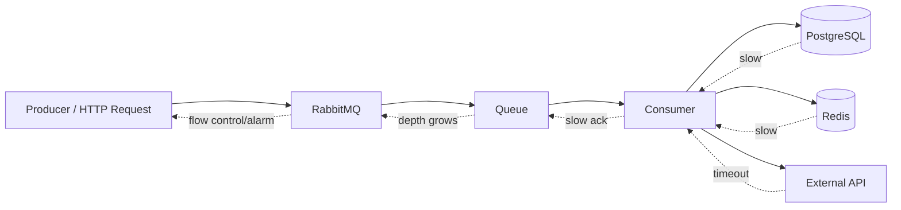

# Prefetch, Backpressure, and Consumer Concurrency

## 1. Core idea

Prefetch adalah batas jumlah message yang boleh dikirim RabbitMQ ke consumer tetapi belum di-ack.

Dalam production system, prefetch bukan sekadar angka tuning.

Prefetch adalah **in-flight control**.

```text
ready messages      -> masih di queue, belum dikirim ke consumer
unacked messages    -> sudah dikirim ke consumer, belum selesai secara broker perspective
acked messages      -> sudah selesai, RabbitMQ boleh menghapus tanggung jawab delivery
```

Jika prefetch terlalu besar:

- memory consumer bisa naik;
- satu consumer bisa menahan terlalu banyak work;
- message lambat terlihat seperti sudah "hilang" dari ready queue;
- rolling restart bisa menghasilkan redelivery burst;
- ordering makin sulit dipahami;
- downstream PostgreSQL/API bisa overload;
- debugging menjadi kabur karena message sudah keluar dari queue tapi belum selesai.

Jika prefetch terlalu kecil:

- throughput rendah;
- network roundtrip overhead lebih terasa;
- consumer idle padahal masih banyak capacity;
- CPU/thread pool tidak terpakai optimal;
- queue depth meningkat walaupun consumer sebenarnya sehat.

Prefetch adalah trade-off antara:

```text
throughput
fairness
latency
memory
ordering
redelivery cost
downstream pressure
shutdown safety
```

---

## 2. Why prefetch exists

Tanpa prefetch limit, broker bisa mengirim message jauh lebih cepat daripada consumer memprosesnya.

Akibatnya:

```text
Broker: "I delivered the messages."
Consumer: "I have thousands of messages buffered in memory."
Database: "I cannot handle this concurrency."
User: "Why is the queue empty but the business process is stuck?"
```

Prefetch memaksa broker berhenti mengirim delivery baru ketika jumlah unacked sudah mencapai batas.

Contoh:

```text
prefetch = 10
consumer receives 10 messages
consumer has not acked any
RabbitMQ stops sending more to that consumer
consumer acks 1
RabbitMQ can send 1 more
```

Dalam RabbitMQ Java client, mekanisme ini biasanya dikonfigurasi dengan `basicQos` sebelum `basicConsume`.

```java
channel.basicQos(20);
channel.basicConsume(queueName, false, consumer);
```

`false` pada `basicConsume` berarti manual acknowledgement. Prefetch paling berguna ketika consumer memakai manual ack, karena broker bisa membatasi jumlah delivery yang belum diakui selesai.

---

## 3. AMQP QoS vs RabbitMQ consumer prefetch

AMQP 0-9-1 mengenal `basic.qos` sebagai quality-of-service control. Namun RabbitMQ memiliki behavior penting: prefetch count pada umumnya diterapkan per consumer, bukan semata-mata sebagai satu limit global channel seperti interpretasi AMQP yang paling sederhana.

RabbitMQ documentation menjelaskan bahwa consumer prefetch adalah extension terhadap channel prefetch mechanism, dan `basic.qos` membatasi jumlah unacknowledged deliveries yang boleh outstanding. RabbitMQ juga berhenti mengirim delivery baru ketika outstanding deliveries mencapai configured count sampai ada message yang diack. Lihat referensi resmi: [RabbitMQ Consumer Prefetch](https://www.rabbitmq.com/docs/consumer-prefetch) dan [Consumer Acknowledgements and Publisher Confirms](https://www.rabbitmq.com/docs/confirms).

Practical implication:

```text
1 channel + multiple consumers can behave differently depending qos global flag
multiple channels + one consumer per channel is simpler to reason about
```

Untuk senior backend engineer, aturan praktisnya:

```text
Prefer simple ownership:
one consumer abstraction owns one channel and one prefetch policy.
```

Hindari desain di mana banyak logical consumer berbagi satu channel tanpa alasan kuat, karena observability dan failure boundary menjadi kabur.

---

## 4. Key terms

### 4.1 Ready messages

Ready messages adalah message yang masih berada di queue dan siap dikirim ke consumer.

```text
High ready count usually means:
- producer faster than consumer;
- consumer down;
- prefetch too low;
- downstream slow;
- routing is correct but processing cannot keep up.
```

### 4.2 Unacked messages

Unacked messages adalah message yang sudah dikirim ke consumer tetapi belum di-ack/nack/reject.

```text
High unacked count usually means:
- consumer received messages but processing is slow;
- consumer thread pool blocked;
- DB/API dependency slow;
- ack path broken;
- prefetch too high;
- consumer process hung;
- deployment/shutdown did not drain cleanly.
```

### 4.3 Prefetch count

Prefetch count adalah max outstanding unacked delivery per consumer/channel scope sesuai konfigurasi.

```text
prefetch = 1     -> strict-ish fairness, lower throughput, useful for long-running jobs/order-sensitive flow
prefetch = 10    -> common starting point for moderate work
prefetch = 100   -> possible for fast small messages, risky for slow DB/API tasks
prefetch = 0     -> unlimited in AMQP meaning, dangerous for most production consumers
```

### 4.4 Consumer utilization / consumer capacity

Consumer utilization/capacity adalah sinyal apakah queue dapat segera deliver message ke consumer. Jika rendah, consumer tidak mampu menyerap work secepat message tersedia.

Penyebab umum:

- consumer tidak cukup banyak;
- prefetch terlalu rendah;
- consumer lambat;
- consumer blocked oleh DB/API;
- network latency tinggi;
- consumer ack lambat.

RabbitMQ documentation tentang consumers membahas consumer capacity sebagai indikator kemampuan queue mengirim message ke consumer. Lihat [RabbitMQ Consumers](https://www.rabbitmq.com/docs/consumers).

### 4.5 Backpressure

Backpressure adalah mekanisme tekanan balik ketika komponen downstream tidak mampu mengikuti upstream.

Dalam RabbitMQ-based system, backpressure bisa muncul di banyak lapisan:

```text
HTTP request rate
  -> publisher rate
    -> broker queue depth
      -> consumer delivery rate
        -> consumer thread pool
          -> PostgreSQL connection pool
            -> external API
              -> business state transition
```

RabbitMQ juga memiliki broker-side flow control untuk mencegah runaway memory growth pada publishing connections. Lihat [RabbitMQ Flow Control](https://www.rabbitmq.com/docs/flow-control).

---

## 5. Mental model: queue depth vs unacked

Jangan hanya melihat queue depth.

Queue depth bisa rendah karena message sudah dikirim ke consumer, tetapi belum selesai diproses.

```text
Case A: ready=10_000, unacked=0
Meaning: consumer likely down, paused, or not bound correctly.

Case B: ready=0, unacked=10_000
Meaning: RabbitMQ delivered messages, but consumers are slow/hung or prefetch too high.

Case C: ready=50_000, unacked=5_000
Meaning: consumer is processing, but producer rate > consumer completion rate.

Case D: ready=0, unacked=0
Meaning: no backlog, or topology/routing may be wrong if expected messages are missing.
```

Production debugging harus selalu melihat minimal:

```text
ready
unacked
publish rate
deliver rate
ack rate
redelivery rate
consumer count
consumer utilization/capacity
consumer logs
DB/API latency
```

---

## 6. Lifecycle with prefetch



Prefetch controls delivery window, not business correctness.

Even with perfect prefetch, consumer tetap harus:

- idempotent;
- ack setelah durable side effect;
- handle duplicate;
- handle crash;
- handle retry/DLQ;
- expose processing metrics.

---

## 7. Consumer concurrency model

Concurrency di RabbitMQ consumer biasanya muncul dari kombinasi:

```text
number of service replicas
x consumers per replica
x prefetch per consumer
x worker threads per consumer
```

Total possible in-flight messages:

```text
in_flight_capacity = replicas * consumers_per_replica * prefetch_per_consumer
```

Contoh:

```text
replicas = 8
consumers per replica = 4
prefetch = 50

in_flight = 8 * 4 * 50 = 1600 messages
```

Angka 1600 mungkin terlihat kecil untuk RabbitMQ, tetapi bisa sangat besar untuk downstream:

```text
PostgreSQL connection pool = 40
external API allowed concurrency = 100
business lock contention = high
message processing avg = 2 seconds
```

Maka consumer concurrency harus ditentukan dari bottleneck downstream, bukan dari RabbitMQ saja.

---

## 8. Java/JAX-RS backend impact

Dalam service Java/JAX-RS, RabbitMQ consumer sering berjalan sebagai background component di dalam aplikasi yang sama dengan HTTP API.

Ini menciptakan shared resource risk:

```text
HTTP request thread pool
RabbitMQ consumer worker pool
PostgreSQL connection pool
Redis connection pool
HTTP client pool
CPU
heap
```

Jika consumer concurrency terlalu agresif:

- API latency naik;
- DB pool habis;
- transaction timeout meningkat;
- GC pressure naik;
- pod CPU throttling;
- shutdown lebih lama;
- duplicate redelivery saat pod kill;
- DLQ spike karena dependency timeout.

Untuk service yang menjalankan JAX-RS API dan RabbitMQ consumer dalam process yang sama, review harus menanyakan:

```text
Is consumer workload isolated from HTTP workload?
Is DB pool shared?
Is thread pool shared?
Can consumer traffic starve API traffic?
Can API traffic starve consumer ack path?
```

---

## 9. PostgreSQL/MyBatis/JDBC impact

Consumer RabbitMQ enterprise biasanya melakukan operasi database:

- insert/update business row;
- transition order state;
- write inbox row;
- write audit event;
- update retry status;
- call mapper via MyBatis/JDBC;
- lock aggregate row;
- publish follow-up event via outbox.

Prefetch yang terlalu tinggi dapat membuat banyak message memegang DB connection secara bersamaan.

Danger pattern:

```text
prefetch = 200
consumer threads = 100
DB pool = 30
message processing requires DB transaction
```

Hasilnya:

```text
70 worker threads wait for connection
message remains unacked
pod memory grows
shutdown drain slow
redelivery burst during restart
```

Lebih buruk jika message memproses aggregate yang sama:

```text
100 messages for same order_id
all workers try to update same order state
row lock contention
transaction timeout
retry storm
out-of-order state transition
```

Practical rule:

```text
Consumer concurrency must be <= downstream safe concurrency.
```

Downstream safe concurrency harus mempertimbangkan:

- DB connection pool;
- query latency;
- row lock contention;
- transaction timeout;
- external API rate limit;
- CPU cost;
- heap cost;
- idempotency table contention.

---

## 10. Redis impact

Jika Redis digunakan untuk dedup, lock, cache invalidation, atau rate limiting, consumer concurrency juga menekan Redis.

Risiko:

- lock expiry sebelum processing selesai;
- dedup key race;
- cache invalidation storm;
- Redis connection pool exhaustion;
- retry storm memperbesar Redis traffic;
- Redis latency menyebabkan unacked buildup.

Review pertanyaan:

```text
Does each message touch Redis?
Is Redis used before or after DB transaction?
What happens when Redis is slow?
Can Redis failure cause message requeue loop?
Is lock TTL longer than worst-case processing time?
```

---

## 11. Kafka/CDC interaction impact

Dalam arsitektur hybrid, RabbitMQ consumer kadang:

- menerima command dari RabbitMQ;
- menulis PostgreSQL;
- outbox/CDC mem-publish event ke Kafka;
- mengirim task lanjutan ke RabbitMQ.

Prefetch yang terlalu tinggi dapat mempercepat command ingestion tetapi membuat event downstream terlambat atau tidak terurut.

Example failure:

```text
RabbitMQ consumers process 500 order commands concurrently.
PostgreSQL writes succeed slowly.
CDC connector lags.
Kafka event consumers see delayed/inconsistent downstream state.
```

Correctness question:

```text
Is business system optimized for command completion rate or for end-to-end propagation latency?
```

---

## 12. Prefetch tuning by workload type

### 12.1 Fast CPU-light message

Example:

- parse small JSON;
- update cache;
- write small audit row;
- no external API;
- low DB contention.

Possible starting point:

```text
prefetch: 20-100 per consumer
consumer threads: bounded by CPU and DB pool
```

Risk:

- too much batching hides latency spikes;
- redelivery burst during restart;
- memory growth if payload large.

### 12.2 DB-heavy message

Example:

- order state transition;
- multiple MyBatis mapper calls;
- row locking;
- transaction boundary;
- outbox insert.

Possible starting point:

```text
prefetch: 1-20 per consumer
consumer threads: <= DB pool budget
```

Risk:

- DB pool exhaustion;
- lock contention;
- transaction timeout;
- duplicate state transition.

### 12.3 External API-heavy message

Example:

- call fulfillment API;
- call billing system;
- call customer notification provider;
- call legacy integration endpoint.

Possible starting point:

```text
prefetch: small
consumer threads: bounded by external rate limit
retry: delayed, not immediate requeue
```

Risk:

- dependency outage creates unacked growth;
- immediate retry creates storm;
- external timeout holds worker thread;
- rate limit errors flood DLQ.

### 12.4 Long-running task

Example:

- pricing recalculation;
- batch validation;
- document generation;
- order decomposition.

Possible starting point:

```text
prefetch: 1
single active consumer if strict ordering needed
separate worker deployment if task is heavy
```

Risk:

- long unacked duration;
- pod termination redelivers work;
- cancellation not handled;
- progress not observable.

### 12.5 Ordering-sensitive workload

Example:

- per-order state transitions;
- quote revision events;
- lifecycle commands for same aggregate.

Possible starting point:

```text
prefetch: 1 for strict queue-level ordering
or route by aggregate to constrained processing lane
or use single active consumer where appropriate
```

Risk:

- multiple consumers break order;
- retry queue changes order;
- redelivery changes perceived sequence;
- priority queue changes order.

---

## 13. Consumer fairness

Fairness berarti RabbitMQ mendistribusikan work secara wajar ke consumer yang tersedia.

Tanpa prefetch, atau dengan prefetch terlalu tinggi, satu consumer bisa menerima banyak message sekaligus meskipun consumer lain idle.

Example:

```text
Consumer A connects first.
Prefetch = 1000.
Queue has 1000 messages.
Consumer A receives all 1000.
Consumer B starts later and receives none.
```

Dengan prefetch lebih kecil:

```text
Consumer A prefetch = 10
Consumer B prefetch = 10
Queue distributes more evenly as acks happen.
```

Fairness matters untuk:

- horizontal scaling;
- rolling deployment;
- long-running tasks;
- heterogeneous pod performance;
- avoiding hot consumer.

---

## 14. Backpressure chain

Backpressure tidak selalu terlihat di RabbitMQ lebih dulu.



Common chain:

```text
PostgreSQL slow
  -> consumer processing slow
  -> ack rate drops
  -> unacked rises
  -> ready rises after prefetch window full
  -> queue depth alert fires
  -> publisher continues
  -> broker memory/disk pressure
  -> connection blocked / alarm
```

Correct response bukan langsung menaikkan consumer replicas.

Pertama cari bottleneck:

```text
Is DB slow?
Is external API slow?
Is consumer CPU throttled?
Is prefetch too high?
Is retry storm happening?
Is one poison message blocking a lane?
```

---

## 15. RabbitMQ flow control and resource alarms

RabbitMQ memiliki flow control untuk menekan publisher ketika broker tidak mampu mengikuti publish rate tanpa risiko resource growth. RabbitMQ documentation menyebut flow control sebagai back pressure mechanism pada publishing connections untuk menghindari runaway memory usage growth. Lihat [RabbitMQ Flow Control](https://www.rabbitmq.com/docs/flow-control).

RabbitMQ juga memiliki memory dan disk alarms. Dokumentasi resmi menjelaskan bahwa saat alarm memory/disk aktif, connections yang melakukan publish dapat diblokir sampai kondisi pulih. Lihat [Memory and Disk Alarms](https://www.rabbitmq.com/docs/alarms), [Memory Threshold and Limit](https://www.rabbitmq.com/docs/memory), dan [Free Disk Space Alarms](https://www.rabbitmq.com/docs/disk-alarms).

Implication for Java publisher:

```text
Publisher may appear slow or stuck.
Confirm latency may increase.
Publish operation may block depending client behavior.
HTTP request that publishes synchronously may time out.
Outbox poller may lag.
```

Consumer tuning dan broker flow control saling terkait:

```text
slow consumer -> queue growth -> broker pressure -> publisher blocked
```

---

## 16. Anti-pattern: prefetch as magic throughput knob

Bad reasoning:

```text
Queue depth high, increase prefetch.
```

Better reasoning:

```text
Queue depth high because what rate mismatch?
- publish rate > ack rate?
- consumer count low?
- consumer capacity low?
- DB latency high?
- retries dominating?
- message processing time increased?
- prefetch too low?
```

Prefetch only helps if consumer has unused processing capacity.

Jika bottleneck adalah database, external service, lock contention, CPU throttling, atau poison message, menaikkan prefetch hanya memindahkan backlog dari RabbitMQ ke consumer memory.

---

## 17. Anti-pattern: unlimited prefetch

`prefetch = 0` berarti unlimited.

Dalam production enterprise system, unlimited prefetch hampir selalu buruk kecuali ada alasan sangat spesifik dan terukur.

Risiko:

- consumer heap growth;
- huge unacked count;
- poor fairness;
- slow shutdown;
- large redelivery burst;
- message processing invisibility;
- downstream overload;
- incident recovery lebih sulit.

Review rule:

```text
Any unlimited prefetch must require explicit architecture justification.
```

---

## 18. Anti-pattern: consumer concurrency bigger than DB capacity

Misconfiguration umum:

```text
Kubernetes replicas: 10
consumers per replica: 5
prefetch: 50
worker threads per replica: 50
DB pool per replica: 20
```

Total:

```text
consumers = 50
in-flight deliveries = 2500
worker threads = 500
DB connections possible = 200
```

Jika setiap message butuh DB transaction, sebagian besar work hanya menunggu DB connection.

Symptom:

- high unacked;
- low ack rate;
- DB pool wait high;
- consumer logs show timeout;
- pod memory grows;
- rolling deployment causes duplicate storm.

Corrective actions:

- reduce prefetch;
- reduce worker concurrency;
- separate consumer deployment from API deployment;
- increase DB pool only if database can handle it;
- shard by aggregate/tenant only if needed;
- add rate limiting;
- fix slow queries/locks.

---

## 19. Anti-pattern: immediate requeue under dependency outage

If external dependency is down:

```text
consumer receives message
calls dependency
fails immediately
nack requeue=true
same or another consumer receives again
fails again
repeat thousands of times
```

Symptoms:

- redelivery rate spikes;
- CPU wasted;
- logs flood;
- dependency hammered;
- queue appears active but no progress;
- DLQ may not grow because messages keep requeueing.

Better design:

```text
transient failure -> delayed retry
permanent failure -> DLQ / parking lot
dependency outage -> circuit breaker + delayed retry
```

Prefetch cannot fix requeue loop. Retry topology must fix it.

---

## 20. Prefetch and ordering

Ordering-sensitive system must be careful.

```text
prefetch > 1 means consumer can hold multiple messages concurrently.
multiple consumers means queue-level delivery order is not same as processing completion order.
retry/delayed retry means later message may finish before earlier failed message.
```

Example:

```text
M1: order APPROVED
M2: order ACTIVATED

Consumer receives M1 and M2.
M1 is slow due to DB lock.
M2 finishes first.
Business state becomes invalid.
```

Solutions depend on requirement:

- strict single queue ordering: one consumer, prefetch 1;
- per-aggregate ordering: route by aggregate key to lane/queue;
- state-machine guard: reject invalid transition until prerequisite exists;
- idempotent transition: make event application conditional;
- use single active consumer if appropriate;
- use RabbitMQ Stream/Kafka if replayed ordered log is the actual requirement.

---

## 21. Prefetch and graceful shutdown

Kubernetes rolling update sends termination signal.

If consumer holds many unacked messages:

```text
pod gets SIGTERM
consumer stops accepting new work?
in-flight messages still processing
termination grace period expires
pod killed
unacked messages redelivered
some side effects may have committed
new consumer processes duplicates
```

Shutdown-safe consumer should:

1. Stop consuming/cancel consumer.
2. Stop accepting new deliveries.
3. Finish in-flight messages within grace period.
4. Ack successful messages.
5. Nack/requeue or let unacked redeliver if not completed.
6. Close channel/connection cleanly.

High prefetch makes graceful drain harder.

Rule:

```text
termination_grace_period must be compatible with max in-flight processing time.
```

---

## 22. Kubernetes scaling impact

When HPA scales consumer pods:

```text
new replicas create new connections/channels
new consumers start receiving messages
prefetch windows multiply
DB/API load increases suddenly
```

Example:

```text
prefetch = 50
consumers per pod = 4
pods before = 5
pods after = 20

in-flight before = 5 * 4 * 50 = 1000
in-flight after  = 20 * 4 * 50 = 4000
```

Scaling can reduce queue depth while increasing downstream failure.

HPA should consider:

- queue depth;
- ack rate;
- processing latency;
- DB pool wait;
- external API error rate;
- redelivery rate;
- DLQ rate;
- CPU throttling;
- memory usage.

Do not scale consumers solely on queue depth without downstream guardrails.

---

## 23. Sizing formulas

### 23.1 Required throughput

```text
required_ack_rate >= publish_rate + backlog_drain_rate
```

If publish rate is 500 msg/s and backlog must drain 50,000 messages in 10 minutes:

```text
backlog_drain_rate = 50,000 / 600 = 83 msg/s
required_ack_rate = 500 + 83 = 583 msg/s
```

### 23.2 Consumer throughput

```text
consumer_throughput = concurrency / avg_processing_time_seconds
```

If one message takes 200 ms average:

```text
1 worker ≈ 5 msg/s
100 workers ≈ 500 msg/s if downstream can sustain it
```

### 23.3 In-flight capacity

```text
in_flight = replicas * consumers_per_replica * prefetch
```

In-flight should be large enough to keep workers busy, but not so large that shutdown, redelivery, and memory become unsafe.

### 23.4 DB-bound concurrency budget

```text
consumer_db_concurrency <= safe_db_pool_budget
```

If service DB pool is 50 and HTTP API needs 30 reserved connections:

```text
consumer safe budget <= 20
```

That budget must be shared across replicas.

---

## 24. Practical tuning procedure

Start with measurements, not guesses.

### Step 1: classify workload

```text
CPU-bound?
DB-bound?
external API-bound?
ordering-sensitive?
long-running?
small fast message?
large payload?
```

### Step 2: establish baseline

Measure:

```text
publish rate
ack rate
processing latency p50/p95/p99
ready messages
unacked messages
redelivery rate
consumer utilization/capacity
DB pool wait
external API latency
CPU/memory
GC
```

### Step 3: set conservative prefetch

Start safe:

```text
long-running / ordering-sensitive: 1
DB-heavy: 5-20
fast lightweight: 20-100
```

These are not universal defaults. They are starting points for measurement.

### Step 4: adjust one variable at a time

Do not change all at once:

```text
prefetch
consumer replicas
consumers per replica
worker thread count
DB pool
retry policy
```

### Step 5: watch saturation points

Saturation signs:

```text
ack rate no longer improves
DB latency rises
external errors rise
CPU throttling appears
unacked grows
redelivery rises
DLQ rises
```

### Step 6: document decision

Every production prefetch value should have explanation:

```text
why this value?
what throughput target?
what downstream capacity?
what shutdown impact?
what ordering requirement?
what alert threshold?
```

---

## 25. Observability dashboard for prefetch/concurrency

Minimum dashboard widgets:

```text
Queue:
- ready messages
- unacked messages
- total messages
- publish rate
- deliver rate
- ack rate
- redelivery rate
- consumer count
- consumer utilization/capacity

Consumer app:
- processing duration p50/p95/p99
- success/failure count
- ack/nack/reject count
- in-flight processing count
- worker queue depth
- thread pool active/queued
- DB pool active/wait
- external dependency latency
- duplicate detected count

Broker:
- connection count
- channel count
- memory usage
- disk usage
- flow control status
- alarm status
```

Correlation required:

```text
RabbitMQ queue metrics + application processing metrics + database metrics
```

RabbitMQ metrics alone rarely explain root cause.

---

## 26. Debugging scenarios

### 26.1 Queue ready increasing, unacked low

Likely causes:

- consumer down;
- consumer not bound;
- permission problem;
- prefetch extremely low;
- consumer capacity low;
- routing mismatch;
- consumer cancelled;
- consumer error before basicConsume.

Check:

```text
consumer count
bindings
consumer logs
auth/permission errors
queue consumer utilization
connection/channel status
```

### 26.2 Unacked increasing, ready low

Likely causes:

- prefetch too high;
- consumer hung;
- DB/API slow;
- worker pool exhausted;
- ack not called;
- ack attempted on wrong channel;
- long-running tasks;
- shutdown drain issue.

Check:

```text
consumer stack traces
thread pool metrics
DB pool metrics
ack logs
processing latency
pod CPU/memory
```

### 26.3 Ready and unacked both increasing

Likely causes:

- producer rate exceeds consumer completion rate;
- downstream dependency degraded;
- retry storm;
- insufficient consumer replicas;
- poison messages causing slow path;
- broker resource pressure.

Check:

```text
publish vs ack rate
redelivery rate
DLQ/retry queues
DB/API health
broker alarm status
recent deployment/config change
```

### 26.4 Redelivery spike after deployment

Likely causes:

- pods killed before in-flight messages completed;
- prefetch too high for termination grace period;
- consumer did not stop consuming before shutdown;
- processing not idempotent;
- deployment caused connection loss.

Check:

```text
Kubernetes termination logs
preStop hook
grace period
consumer shutdown path
redelivered flag logs
idempotency behavior
```

### 26.5 Consumer utilization low despite many consumers

Likely causes:

- consumer prefetch exhausted;
- consumers slow to ack;
- network latency;
- single active consumer enabled;
- queue leader/node issue;
- queue type/storage pressure;
- consumer channel blocked/closed.

Check:

```text
unacked count
ack rate
consumer processing latency
single active consumer setting
node metrics
channel exceptions
```

---

## 27. Implementation pattern: bounded consumer executor

Bad pattern:

```java
@Override
public void handleDelivery(String consumerTag,
                           Envelope envelope,
                           AMQP.BasicProperties properties,
                           byte[] body) {
    executor.submit(() -> process(body));
    channel.basicAck(envelope.getDeliveryTag(), false); // wrong: ack before processing
}
```

This acks before durable processing. If the worker later fails, RabbitMQ will not redeliver.

Better pattern:

```java
@Override
public void handleDelivery(String consumerTag,
                           Envelope envelope,
                           AMQP.BasicProperties properties,
                           byte[] body) {
    executor.submit(() -> {
        long tag = envelope.getDeliveryTag();
        try {
            processInTransaction(body, properties);
            channel.basicAck(tag, false);
        } catch (TransientDependencyException e) {
            channel.basicNack(tag, false, false); // route to retry/DLX, not immediate loop
        } catch (PermanentBusinessException e) {
            channel.basicReject(tag, false); // DLQ/parking lot depending topology
        } catch (Exception e) {
            channel.basicNack(tag, false, false);
        }
    });
}
```

But there is a serious Java client concern: channel thread-safety. RabbitMQ Java `Channel` should not be casually shared across threads for concurrent operations. A robust implementation uses a controlled ack executor, channel-per-consumer model, or a framework abstraction that serializes channel operations.

Internal verification is required for the actual client pattern used by the team.

---

## 28. Implementation pattern: consumer concurrency ownership

A clean design should make concurrency explicit:

```text
RabbitConsumerContainer
  - owns Connection
  - creates N ConsumerWorkers

ConsumerWorker
  - owns Channel
  - declares/validates queue binding if allowed
  - sets basicQos(prefetch)
  - starts basicConsume
  - processes delivery through bounded executor or same thread
  - acks/nacks on owned channel
```

Configuration example:

```yaml
rabbitmq:
  consumers:
    order-command-consumer:
      queue: q.order.command
      concurrency: 4
      prefetch: 10
      maxProcessingSeconds: 30
      retryStrategy: delayed-dlx
      shutdownDrainSeconds: 45
```

The point is not the exact YAML format. The point is that concurrency, prefetch, retry, and shutdown must be reviewable.

---

## 29. Production failure modes

### 29.1 Consumer heap explosion

Cause:

```text
prefetch high + large payload + slow processing
```

Detection:

```text
high unacked
consumer memory growth
GC pressure
pod OOMKilled
```

Mitigation:

```text
reduce prefetch
limit payload size
stream payload via object storage reference if appropriate
increase heap only after fixing in-flight control
```

### 29.2 Database pool starvation

Cause:

```text
consumer threads exceed DB pool budget
```

Detection:

```text
DB pool wait time high
SQL timeout
unacked rising
API latency rising if pool shared
```

Mitigation:

```text
reduce consumer concurrency
separate DB pool for consumers
reserve API capacity
optimize queries/locks
```

### 29.3 Redelivery storm

Cause:

```text
consumer crash/restart with high unacked
or immediate nack requeue loop
```

Detection:

```text
redelivery rate spike
same message IDs repeated
consumer logs repeat same failure
```

Mitigation:

```text
delayed retry
DLQ poison messages
idempotency
reduce prefetch
fix shutdown
```

### 29.4 Queue starvation

Cause:

```text
one message type dominates queue
priority queue misuse
long-running task mixed with short task
```

Detection:

```text
old messages remain ready
business SLA missed for some types
distribution skew by routing key/type
```

Mitigation:

```text
separate queues
per-priority queue carefully
fair dispatch tuning
avoid mixing long/short work in same queue
```

### 29.5 False scale-out success

Cause:

```text
adding consumers reduces ready depth but increases DB/API failures
```

Detection:

```text
queue looks better
business completion rate not better
DLQ/retry increases
DB/external error increases
```

Mitigation:

```text
scale bottleneck, not symptom
add downstream guardrail metrics to autoscaling
```

---

## 30. CPQ/order management examples

These examples are conceptual. Do not assume they match internal CSG topology.

### 30.1 Quote pricing task

Characteristics:

```text
CPU + DB + external pricing rule lookup
may be long-running
may require idempotency per quote revision
```

Possible tuning:

```text
moderate/low prefetch
bounded worker pool
status table for progress
retry for transient pricing dependency
DLQ for invalid quote payload
```

### 30.2 Order state transition command

Characteristics:

```text
ordering-sensitive per order_id
DB transaction required
duplicate command dangerous
```

Possible tuning:

```text
low prefetch
idempotency key
state transition guard
per-aggregate ordering strategy
avoid broad parallel processing of same order
```

### 30.3 Notification task

Characteristics:

```text
external provider rate limit
retryable transient errors
duplicate notification risk
```

Possible tuning:

```text
prefetch based on provider rate limit
delayed retry
dedup notification key
parking lot after retry limit
```

### 30.4 Fallout remediation task

Characteristics:

```text
human-visible operational workflow
must preserve diagnostic context
manual replay likely
```

Possible tuning:

```text
low/moderate concurrency
strong metadata
DLQ/parking lot with reason
operator dashboard
```

---

## 31. Internal verification checklist

Verify in actual CSG/team systems:

- What is the prefetch value per consumer?
- Is prefetch configured explicitly or inherited from framework default?
- Is prefetch per consumer, per channel, or global in the actual client abstraction?
- How many service replicas run each consumer?
- How many consumers are started per pod/process?
- What is total theoretical in-flight delivery count?
- Is consumer processing synchronous or delegated to a worker executor?
- Are ack/nack operations executed on the correct channel/thread model?
- What is the consumer thread pool size?
- Is the thread pool bounded?
- Is the queue inside the executor bounded?
- Is DB connection pool shared with JAX-RS API traffic?
- Is Redis connection pool shared?
- Is external API client pool shared?
- Does consumer concurrency exceed downstream safe capacity?
- What is the termination grace period in Kubernetes?
- Does shutdown cancel consumers before closing channel?
- Does shutdown drain in-flight messages?
- What happens to unacked messages during rollout?
- Does HPA scale on queue depth only?
- Are DB latency, ack rate, redelivery rate, and DLQ rate included as guardrails?
- Are ready/unacked/publish/deliver/ack metrics visible per queue?
- Is consumer utilization/capacity monitored?
- Are redelivery spikes correlated with deployments?
- Are long-running tasks mixed with short tasks in the same queue?
- Are ordering-sensitive messages processed concurrently?
- Are poison messages isolated or repeatedly requeued?
- Does retry strategy use immediate requeue or delayed retry?
- Is there a documented prefetch tuning rationale?

---

## 32. PR review checklist

For any PR that changes consumer behavior, ask:

### Prefetch and concurrency

- What is the prefetch value?
- What is the total in-flight capacity after deployment?
- How many replicas will run this consumer?
- How many consumers per replica?
- Is the worker executor bounded?
- Does the PR change processing time per message?

### Correctness

- Is the consumer idempotent?
- Is ack done after durable side effect?
- Is nack/reject policy explicit?
- Does retry preserve or intentionally relax ordering?
- What happens on duplicate delivery?

### Downstream safety

- Does each message use PostgreSQL?
- Does each message call Redis?
- Does each message call external APIs?
- Is there a rate limit?
- Can consumer traffic starve HTTP API traffic?

### Shutdown and deployment

- What happens during rolling update?
- Is in-flight work drained?
- Is termination grace period sufficient?
- Are redeliveries expected and safe?

### Observability

- Are processing latency, ack/nack count, failure count, and in-flight count measured?
- Are queue ready/unacked and consumer capacity visible?
- Is redelivery rate alerted?
- Can a specific message ID/correlation ID be traced?

---

## 33. Senior engineer heuristics

Useful heuristics:

```text
1. Prefetch should be big enough to keep workers busy, not big enough to hide backlog.
2. Queue depth is not processing backlog; ready + unacked + retry + DLQ is closer.
3. Consumer scale should be limited by downstream capacity, not broker enthusiasm.
4. Unacked is work in limbo: delivered, not yet safely finished.
5. High prefetch makes shutdown and redelivery more expensive.
6. Ordering-sensitive workloads need low concurrency or partitioned ordering design.
7. Immediate requeue is rarely a good retry strategy under outage.
8. Tuning without DB/API metrics is guesswork.
9. A fast consumer that creates invalid state is worse than a slow consumer.
10. RabbitMQ can distribute work; it cannot make non-idempotent business logic safe.
```

---

## 34. Common interview/review questions

Use these to test understanding:

1. What is the difference between ready and unacked messages?
2. Why can a queue look empty while business processing is stuck?
3. What happens when prefetch is reached?
4. Why is unlimited prefetch dangerous?
5. How do replicas, consumers per replica, and prefetch multiply in-flight work?
6. How does prefetch interact with PostgreSQL connection pool?
7. How does prefetch interact with graceful shutdown?
8. Why can increasing consumer replicas make incidents worse?
9. How would you debug unacked messages increasing?
10. What metrics must be viewed together with queue depth?

---

## 35. Source references

Use official documentation as primary reference:

- [RabbitMQ Consumer Prefetch](https://www.rabbitmq.com/docs/consumer-prefetch)
- [RabbitMQ Consumer Acknowledgements and Publisher Confirms](https://www.rabbitmq.com/docs/confirms)
- [RabbitMQ Consumers](https://www.rabbitmq.com/docs/consumers)
- [RabbitMQ Flow Control](https://www.rabbitmq.com/docs/flow-control)
- [RabbitMQ Memory and Disk Alarms](https://www.rabbitmq.com/docs/alarms)
- [RabbitMQ Memory Threshold and Limit](https://www.rabbitmq.com/docs/memory)
- [RabbitMQ Free Disk Space Alarms](https://www.rabbitmq.com/docs/disk-alarms)

---

## 36. Final takeaway

Prefetch and concurrency are not isolated performance knobs.

They define how much unfinished business work your system allows at once.

For enterprise Java/JAX-RS systems, the safe design question is not:

```text
How many messages can RabbitMQ deliver?
```

The real question is:

```text
How many messages can our application, database, dependencies, and business invariants safely complete concurrently?
```
