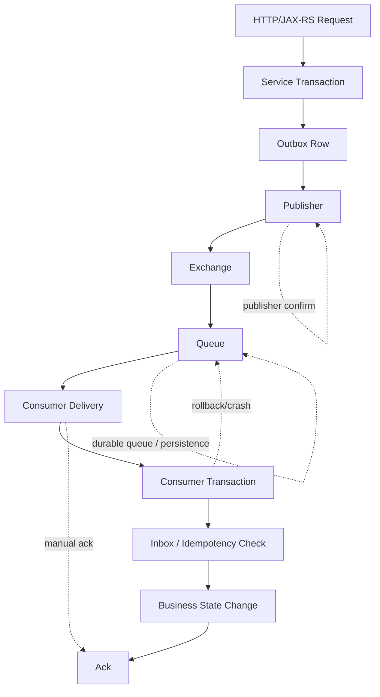
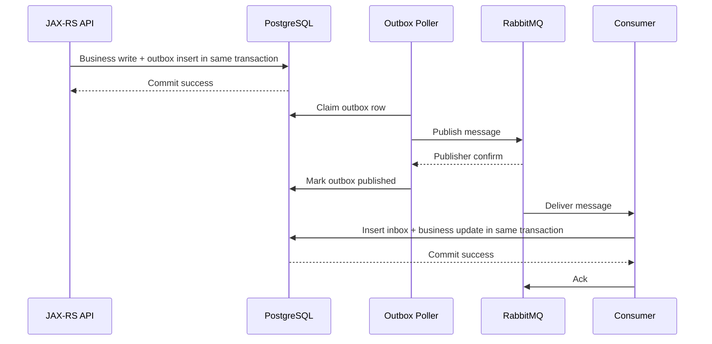

# Delivery Semantics

## 1. Core idea

Delivery semantics menjawab pertanyaan:

```text
Under failure, is a message allowed to be lost?
Under failure, is a message allowed to be duplicated?
Under failure, can the business effect happen more than once?
```

Dalam RabbitMQ production system, delivery semantics bukan hanya fitur broker.

Ia adalah hasil gabungan dari:

```text
publisher behavior
exchange/queue durability
message persistence
broker replication
publisher confirms
consumer acknowledgement
retry/DLQ topology
consumer idempotency
PostgreSQL transaction boundary
outbox pattern
inbox pattern
operational replay procedure
```

RabbitMQ bisa membantu reliability, tetapi tidak otomatis memberikan business-level exactly-once.

Senior engineer harus membedakan:

```text
message delivered once
message processed once
business effect applied once
external side effect performed once
```

Keempatnya tidak sama.

---

## 2. The three practical delivery semantics

### 2.1 At-most-once

At-most-once berarti message diproses nol atau satu kali.

```text
Duplicate avoided, loss possible.
```

Typical behavior:

- auto ack;
- ack before processing;
- no publisher confirm;
- non-persistent message;
- non-durable queue;
- best-effort delivery;
- tolerate message loss.

Suitable for:

- low-value telemetry;
- ephemeral notification;
- cache warming;
- non-critical signal;
- debug/temporary processing.

Dangerous for:

- order command;
- payment/billing task;
- fulfillment task;
- approval workflow;
- audit event;
- compliance evidence.

### 2.2 At-least-once

At-least-once berarti message tidak boleh hilang selama komponen reliability dikonfigurasi benar, tetapi duplicate bisa terjadi.

```text
Loss minimized, duplicate possible.
```

Typical behavior:

- durable exchange;
- durable queue;
- persistent message;
- publisher confirm;
- manual consumer acknowledgement;
- ack after durable processing;
- retry/DLQ;
- idempotent consumer.

RabbitMQ reliability guide menyatakan bahwa penggunaan acknowledgements memberikan at-least-once delivery, sedangkan tanpa acknowledgements message loss mungkin terjadi dan hanya at-most-once yang dapat dijamin. Lihat [RabbitMQ Reliability Guide](https://www.rabbitmq.com/docs/reliability).

Suitable for:

- command processing;
- order state transition;
- integration task;
- durable business event distribution;
- background jobs;
- notification task with dedup;
- fallout remediation.

### 2.3 Effectively-once

Effectively-once berarti broker/application mungkin mengirim duplicate, tetapi business effect dibuat idempotent sehingga hasil akhirnya seolah-olah hanya terjadi sekali.

```text
Duplicate delivery possible, duplicate business effect prevented.
```

Mechanisms:

- idempotency key;
- inbox table;
- processed message table;
- unique constraint;
- state transition guard;
- outbox pattern;
- deduplication before side effect;
- idempotent external API call if possible;
- replay-safe handler.

Effectively-once adalah target realistis untuk enterprise RabbitMQ system.

---

## 3. Exactly-once illusion

Exactly-once sering menjadi kata yang menyesatkan.

Dalam distributed system, terdapat beberapa boundary:

```text
producer process
RabbitMQ broker
consumer process
PostgreSQL database
Redis cache
external API
Kafka/CDC downstream
human workflow
```

Tidak ada satu komponen yang bisa secara ajaib menjamin semua boundary tersebut terjadi exactly once.

Contoh:

```text
Consumer writes order status to PostgreSQL.
PostgreSQL commit succeeds.
Consumer crashes before ack.
RabbitMQ redelivers message.
```

Dari sisi RabbitMQ, redelivery benar.

Dari sisi business, duplicate state transition bisa salah jika consumer tidak idempotent.

Therefore:

```text
RabbitMQ can provide reliable redelivery.
Application must provide idempotent processing.
Database must enforce business invariants.
```

---

## 4. Delivery semantics stack



Delivery semantics is only as strong as the weakest link.

If any of these are missing, semantics degrade:

- no confirm;
- no durable queue;
- non-persistent message;
- auto ack;
- ack before DB commit;
- no idempotency;
- retry loop without DLQ;
- replay without dedup.

---

## 5. RabbitMQ primitives and what they actually guarantee

### 5.1 Durable exchange

A durable exchange survives broker restart.

It does not guarantee:

- message persistence by itself;
- queue durability;
- consumer processing success;
- business idempotency.

### 5.2 Durable queue

A durable queue survives broker restart.

It does not guarantee message survives unless the message itself is persistent and properly handled by broker storage semantics.

### 5.3 Persistent message

A persistent message asks broker to persist message to disk for durable queues.

It does not guarantee:

- publisher knows persistence succeeded unless publisher confirms are used;
- duplicate will not occur;
- consumer side effect is idempotent.

RabbitMQ publisher confirm documentation explains confirms as a way for publishers to know messages have reached the broker. Lihat [RabbitMQ Publisher Confirms Tutorial](https://www.rabbitmq.com/tutorials/tutorial-seven-java) dan [Consumer Acknowledgements and Publisher Confirms](https://www.rabbitmq.com/docs/confirms).

### 5.4 Publisher confirm

Publisher confirm tells publisher that broker accepted responsibility for the published message.

It does not guarantee:

- consumer processed message;
- no duplicate publish;
- DB transaction was coordinated with publish;
- message was semantically valid.

### 5.5 Mandatory flag / return listener

Mandatory publishing helps detect unroutable messages.

It does not guarantee:

- route target queue has healthy consumers;
- message will be processed;
- topology is semantically correct.

### 5.6 Manual consumer ack

Manual ack lets consumer acknowledge only after processing.

It does not guarantee:

- handler is idempotent;
- DB commit happened before ack unless code enforces it;
- external API side effect is not duplicated.

### 5.7 Quorum queue replication

Quorum queue improves queue availability and data safety using replication and Raft-based consensus.

It does not remove need for:

- publisher confirms;
- manual ack;
- idempotency;
- retry/DLQ;
- operational monitoring.

### 5.8 RabbitMQ Stream retention/replay

RabbitMQ Stream can retain messages for replay-like workloads.

It does not automatically provide business exactly-once. Consumers still need offset discipline, idempotency, and consistent side-effect handling.

---

## 6. Where messages can be lost

### 6.1 Producer creates message but crashes before publish

```text
HTTP request accepted
business row committed
producer process crashes before publish
```

Without outbox, message is lost.

Mitigation:

```text
transactional outbox
business row + outbox row in same PostgreSQL transaction
polling publisher
publisher confirm before mark published
```

### 6.2 Publish sent but broker did not persist

```text
producer sends message
network/broker fails
producer assumes success
```

Mitigation:

```text
publisher confirms
confirm timeout handling
retry publish with duplicate tolerance
```

### 6.3 Message unroutable

```text
producer publishes to exchange
no binding matches routing key
message is dropped unless mandatory/alternate exchange used
```

Mitigation:

```text
mandatory flag + return listener
alternate exchange
topology validation
integration tests
```

### 6.4 Broker restart with non-durable topology/message

```text
exchange/queue non-durable
message transient
broker restarts
message/topology gone
```

Mitigation:

```text
durable exchange
durable queue
persistent message
publisher confirms
```

### 6.5 Consumer auto-ack before processing

```text
broker delivers message
auto ack immediately considers it done
consumer crashes before processing
message lost
```

Mitigation:

```text
manual ack
ack after durable side effect
```

### 6.6 Consumer ack before DB commit

```text
consumer receives message
consumer acks
DB transaction fails
RabbitMQ will not redeliver
```

Mitigation:

```text
commit first
ack after commit
idempotency for crash before ack
```

---

## 7. Where duplicates can happen

### 7.1 Producer retries after uncertain publish

```text
publisher sends message
broker receives and persists
confirm response lost
publisher times out
publisher retries
same message published twice
```

Mitigation:

```text
producer message ID
idempotency key
consumer dedup
outbox publish state
unique constraints
```

### 7.2 Consumer crashes after DB commit before ack

```text
consumer processes message
PostgreSQL commit succeeds
consumer crashes before ack
RabbitMQ redelivers
```

Mitigation:

```text
inbox table
processed_message unique constraint
idempotent state transition
ack after detecting duplicate as already processed
```

### 7.3 Ack lost or channel closes

```text
consumer sends ack
connection/channel closes before broker observes it
broker redelivers
```

Mitigation:

```text
idempotent consumer
processed message ledger
safe duplicate handling
```

### 7.4 Manual replay

```text
operator replays DLQ/parking lot messages
some messages were already processed through repair path
```

Mitigation:

```text
replay tool preserves message ID
consumer dedup remains active
operator dry-run/replay audit
```

---

## 8. Delivery semantics matrix

| Producer | Queue/Message | Consumer | Business effect | Result |
|---|---|---|---|---|
| No confirm | Non-durable/transient | Auto ack | Non-idempotent | At-most-once, high loss risk |
| Confirm | Durable/persistent | Auto ack | Non-idempotent | Publish safer, consume loss risk |
| Confirm | Durable/persistent | Manual ack after processing | Non-idempotent | At-least-once delivery, duplicate business risk |
| Outbox + confirm | Durable/persistent | Manual ack after DB commit | Inbox/idempotent | Effectively-once business effect |
| Outbox + confirm | Quorum queue/persistent | Manual ack + retry/DLQ | Inbox/idempotent | Strong practical reliability with duplicate tolerance |

---

## 9. At-most-once design

At-most-once is not always wrong.

It is wrong when chosen accidentally.

Acceptable at-most-once examples:

```text
best-effort metrics aggregation
non-critical cache warming
short-lived UI hint
optional notification where missing one message is acceptable
```

Design characteristics:

- auto ack acceptable;
- no retry necessary;
- message loss accepted;
- duplicate may still occur in some edge cases, but not central concern;
- no business invariant depends on message.

Review requirement:

```text
Document why loss is acceptable.
```

If the team cannot clearly state business impact of loss, do not use at-most-once.

---

## 10. At-least-once design

At-least-once should be the default assumption for important RabbitMQ flows.

Required components:

```text
durable topology
persistent message
publisher confirm
manual ack
ack after durable processing
retry/DLQ strategy
idempotent consumer
observability
```

At-least-once means:

```text
The system prefers duplicate over loss.
```

This is usually correct for enterprise workflows because duplicate can be detected and neutralized, while lost message may create invisible inconsistency.

Example:

```text
Better to receive duplicate "activate order" command and ignore it as already activated
than to lose the activation command entirely.
```

---

## 11. Effectively-once design

Effectively-once is built on top of at-least-once.

Core strategy:

```text
1. Allow RabbitMQ to redeliver.
2. Detect duplicate message/business command.
3. Ensure side effect is applied once.
4. Ack duplicate after confirming it is already handled.
```

Example with inbox:

```sql
CREATE TABLE message_inbox (
    message_id        VARCHAR(128) PRIMARY KEY,
    message_type      VARCHAR(128) NOT NULL,
    aggregate_id      VARCHAR(128),
    status            VARCHAR(32) NOT NULL,
    received_at       TIMESTAMP NOT NULL,
    processed_at      TIMESTAMP,
    last_error        TEXT
);
```

Consumer logic:

```text
begin transaction
insert message_id into inbox
  if duplicate key:
      check status
      if processed: commit and ack
      if processing/stale: apply recovery policy
apply business transition with guard
mark inbox processed
commit transaction
ack message
```

Business guard example:

```sql
UPDATE orders
SET status = 'ACTIVATED'
WHERE order_id = :orderId
  AND status = 'APPROVED';
```

If update count is zero, handler must determine:

```text
already activated? -> idempotent success
invalid transition? -> business error / DLQ / compensation
missing prerequisite? -> retry or wait depending semantics
```

---

## 12. Outbox + inbox as reliability pair

Outbox protects publish side.

Inbox protects consume side.



This design accepts duplicate publish and duplicate delivery but prevents duplicate business effect.

Failure windows become recoverable:

| Failure | Recovery |
|---|---|
| API commits DB but crashes before publish | Outbox poller publishes later |
| Publisher confirm lost | Outbox retry may duplicate; consumer inbox dedups |
| Consumer commits DB but crashes before ack | RabbitMQ redelivers; inbox detects processed |
| DLQ replay duplicates old message | Inbox/business guard neutralizes |

---

## 13. Java/JAX-RS transaction boundary

In a JAX-RS service, common pattern:

```text
HTTP POST /orders/{id}/submit
  -> validate request
  -> begin DB transaction
  -> update order state
  -> insert outbox row
  -> commit
  -> return 202 Accepted or 200 depending API contract
```

Bad pattern:

```text
begin DB transaction
update order
publish RabbitMQ message directly
commit DB
```

Failure:

```text
publish succeeds
DB commit fails
consumer processes event for state that does not exist
```

Another bad pattern:

```text
commit DB
publish RabbitMQ message directly
```

Failure:

```text
DB commit succeeds
publish fails
message lost unless repair job exists
```

Better:

```text
commit DB + outbox atomically
publish asynchronously from outbox
```

---

## 14. PostgreSQL/MyBatis/JDBC correctness

Delivery semantics often fail at the database boundary.

Questions:

```text
Is the database transaction committed before ack?
Is inbox insert in the same transaction as business update?
Is idempotency enforced with unique constraint?
Does MyBatis mapper participate in the intended transaction?
Are retries safe after serialization/deadlock errors?
Does handler distinguish duplicate from invalid state?
```

Important PostgreSQL tools:

- unique constraint for message ID/idempotency key;
- transaction isolation suitable for state transition;
- conditional update for state machine guard;
- `SELECT ... FOR UPDATE` when aggregate locking is needed;
- `SKIP LOCKED` for outbox polling;
- deadlock/serialization retry at transaction level;
- audit table for business effect evidence.

---

## 15. External side effects

External calls are harder than database writes.

Example:

```text
consumer calls payment/fulfillment/notification API
external call succeeds
consumer crashes before writing local record or ack
message redelivered
external call may happen again
```

Mitigations:

- external API idempotency key;
- local attempt table;
- call external API after reserving idempotency record;
- reconciliation job;
- outbox toward external integration service;
- explicit compensation/manual review;
- do not ack before durable local record.

Rule:

```text
Any non-idempotent external side effect must be treated as a high-risk boundary.
```

---

## 16. Redis and delivery semantics

Redis may support delivery semantics but should not be the only correctness store for critical business effects unless explicitly justified.

Possible Redis usage:

- short-lived dedup for non-critical messages;
- rate limit;
- lock;
- cache invalidation;
- processing guard for low-risk tasks.

Risks:

- key expiry before message redelivery;
- Redis flush/failover losing dedup state;
- lock expiry during long processing;
- Redis write succeeds but DB transaction fails;
- Redis unavailable causing retry loop.

For critical order/quote state transitions, prefer PostgreSQL-backed idempotency/inbox with durable constraints.

---

## 17. Retry and DLQ interaction

Retry strategy changes delivery semantics.

Immediate requeue:

```text
nack requeue=true
```

Risk:

- redelivery storm;
- CPU waste;
- dependency hammering;
- ordering disturbance;
- no durable retry count unless tracked.

Delayed retry:

```text
nack/reject false -> DLX/retry exchange -> retry queue with TTL -> original exchange
```

Benefit:

- dependency gets recovery time;
- retry count visible via headers/x-death;
- poison message can be parked after limit.

DLQ:

```text
message cannot be processed safely now
store for inspection/replay/repair
```

Effectively-once requires replay-safe handler.

Manual replay without idempotency can violate business correctness.

---

## 18. Replay limitation

Classic RabbitMQ queues are not event logs.

Once a message is consumed and acked, it is gone from that queue.

Replay options:

- DLQ replay;
- parking lot replay;
- outbox table replay;
- audit/event table replay;
- re-publish from source system;
- RabbitMQ Stream if replay is core requirement;
- Kafka if long-term replay/event backbone is core requirement.

Decision question:

```text
Do we need reliable work delivery, or do we need durable historical event replay?
```

If replay is central, plain queue semantics may be wrong abstraction.

---

## 19. Ordering and delivery semantics

At-least-once can break perceived order due to redelivery/retry.

Example:

```text
M1 fails and goes to delayed retry
M2 succeeds immediately
M1 later returns
```

Business state may see M2 before M1.

Possible solutions:

- per-aggregate ordering lane;
- state transition guard;
- reject invalid transition to retry until prerequisite arrives;
- single active consumer;
- stream/log abstraction;
- workflow state machine;
- design messages as idempotent facts, not imperative blind commands.

Delivery semantics and ordering must be designed together.

---

## 20. Security and privacy implications

Reliability mechanisms retain messages longer.

This affects privacy/security:

```text
DLQ retains failed payloads
retry queues retain messages
outbox table stores payloads
inbox table may store payloads
logs may include headers/payload
manual replay tools expose sensitive data
```

Review:

- does payload contain PII?
- do headers contain tenant/user/customer data?
- is payload encrypted or redacted if required?
- who can read DLQ?
- how long are outbox/inbox rows retained?
- is replay audited?
- are correlation IDs safe to log?

Delivery semantics cannot be separated from retention and access control.

---

## 21. Observability for delivery semantics

Required metrics/logs:

```text
publisher:
- publish attempt count
- publish success/confirm count
- publish confirm latency
- publish timeout/failure count
- returned/unroutable message count
- outbox pending count
- outbox retry count

broker:
- queue ready
- queue unacked
- publish rate
- deliver rate
- ack rate
- redelivery rate
- DLQ depth
- retry queue depth
- connection/channel errors

consumer:
- processing success/failure count
- ack/nack/reject count
- duplicate detected count
- idempotency conflict count
- processing latency
- DB transaction failure count
- external side effect failure count
```

Logs must include:

```text
message_id
correlation_id
causation_id
routing_key
queue
consumer_name
attempt/retry_count
business aggregate id
redelivered flag
```

Without these, delivery semantics cannot be proven during incident review.

---

## 22. Production debugging: suspected lost message

When someone says "RabbitMQ lost my message", do not assume broker loss.

Debug path:

```text
1. Was message created by application?
2. Was it written to outbox?
3. Did outbox publisher pick it up?
4. Did publisher receive confirm?
5. Was message returned as unroutable?
6. Did exchange route to expected queue?
7. Did queue receive it?
8. Was it delivered to consumer?
9. Did consumer ack it?
10. Did consumer write business state?
11. Did consumer crash before/after ack?
12. Did message go to retry/DLQ?
13. Was it manually replayed or discarded?
```

Evidence sources:

- application logs;
- outbox table;
- RabbitMQ Management UI;
- RabbitMQ metrics;
- consumer logs;
- inbox table;
- business table;
- DLQ/retry queue;
- tracing system;
- deployment/incident timeline.

Most "lost message" investigations become one of:

```text
never published
unroutable
published without confirm
acked before processing
processed but state rejected
sent to DLQ
duplicate ignored
wrong environment/vhost/queue
```

---

## 23. Production debugging: suspected duplicate message

Debug path:

```text
1. Does message have stable message_id/idempotency key?
2. Was it published twice?
3. Did publisher retry after confirm timeout?
4. Did consumer crash after DB commit before ack?
5. Was ack lost due to channel/connection close?
6. Was message replayed manually?
7. Did retry topology re-publish with new ID?
8. Did upstream send duplicate command?
9. Did outbox poller claim row twice?
10. Did inbox detect duplicate?
```

Expected posture:

```text
Duplicate delivery should be normal.
Duplicate business effect should be prevented.
```

If duplicate delivery creates duplicate business effect, the system has a correctness gap.

---

## 24. Decision framework by message type

### 24.1 Command message

Example:

```text
SubmitQuoteCommand
ActivateOrderCommand
StartFulfillmentCommand
```

Recommended semantics:

```text
at-least-once delivery
effectively-once business effect
idempotency key required
state transition guard required
DLQ required
```

### 24.2 Domain event

Example:

```text
QuoteApprovedEvent
OrderActivatedEvent
FulfillmentFailedEvent
```

Recommended semantics:

```text
outbox publish
at-least-once delivery to subscribers
consumer idempotency
versioned contract
replay strategy documented
```

### 24.3 Background task

Example:

```text
RecalculatePricingTask
GenerateDocumentTask
SendNotificationTask
```

Recommended semantics:

```text
at-least-once delivery
idempotent job execution
retry with limit
parking lot for poison tasks
progress/status tracking if long-running
```

### 24.4 Integration message

Example:

```text
SendOrderToDownstreamSystem
SyncCustomerData
NotifyLegacyOSS
```

Recommended semantics:

```text
at-least-once
dedup with external correlation/idempotency key
reconciliation process
operator-visible DLQ
manual replay audit
```

### 24.5 Notification message

Example:

```text
SendEmail
SendSMS
PublishUserNotification
```

Recommended semantics depends on duplicate tolerance:

```text
critical notification -> idempotency/dedup required
low-value notification -> at-most-once may be acceptable if documented
```

---

## 25. CPQ/order management examples

These examples are conceptual and require internal verification.

### 25.1 Quote approved event

Risk:

```text
event lost -> downstream never updates quote/order pipeline
duplicate event -> downstream duplicate task or duplicate notification
```

Recommended:

```text
outbox from quote transaction
persistent message
publisher confirm
subscriber inbox
event versioning
```

### 25.2 Activate order command

Risk:

```text
lost command -> order stuck
duplicate command -> repeated activation/fulfillment
out-of-order command -> invalid state
```

Recommended:

```text
idempotency key
order state guard
manual ack after DB commit
DLQ for invalid command
retry for transient dependency
```

### 25.3 Fulfillment integration task

Risk:

```text
external system call succeeds but local ack fails
duplicate redelivery calls external system twice
```

Recommended:

```text
external idempotency key
local attempt ledger
reconciliation job
operator-visible retry/DLQ
```

### 25.4 Fallout task

Risk:

```text
message buried in retry loop
operator cannot see failed business context
manual replay creates duplicate effect
```

Recommended:

```text
parking lot queue
rich metadata
replay audit
idempotent repair action
```

---

## 26. Internal verification checklist

Verify in actual CSG/team systems:

- What delivery semantics are documented per RabbitMQ flow?
- Which flows are at-most-once by design?
- Which flows require at-least-once?
- Which flows require effectively-once business effect?
- Are exchange and queue durable for critical flows?
- Are messages persistent for critical flows?
- Are publisher confirms enabled?
- Are confirm timeouts handled?
- Is mandatory flag or alternate exchange used for unroutable messages?
- Is publish performed directly inside request transaction or via outbox?
- Does outbox store stable message ID?
- Can outbox retry duplicate publish safely?
- Are consumers using manual ack?
- Is ack done after DB commit?
- Are consumers idempotent?
- Is inbox/processed message table used?
- Is idempotency enforced by unique constraint?
- Are external side effects idempotent?
- Is retry strategy delayed or immediate requeue?
- Is DLQ configured for critical queues?
- Is manual replay process documented?
- Does replay preserve message ID/correlation ID?
- Are duplicate detection metrics available?
- Are lost-message investigations supported by trace/outbox/inbox evidence?
- Are message payloads retained in outbox/inbox/DLQ?
- Is sensitive data retention approved?
- Are RabbitMQ Stream/Kafka used where replay is required?

---

## 27. Delivery semantics decision checklist

For every new message flow, answer:

### Business impact

- What happens if this message is lost?
- What happens if this message is duplicated?
- What happens if this message is delayed?
- What happens if this message is processed out of order?
- What is the customer/business impact?

### Producer side

- Is the message created inside a DB transaction?
- Is outbox needed?
- Is publisher confirm enabled?
- What happens on confirm timeout?
- Can publisher retry safely?
- Is message ID stable across retries?

### Broker side

- Is exchange durable?
- Is queue durable?
- Is message persistent?
- Is queue classic/quorum/stream?
- Is DLX configured?
- Is retry topology documented?
- Is unroutable message detected?

### Consumer side

- Is manual ack used?
- Is ack after durable side effect?
- Is consumer idempotent?
- Is inbox used?
- Are state transitions guarded?
- Are external calls idempotent?
- What happens on crash after commit before ack?

### Operations

- Can we detect lost-message suspicion?
- Can we detect duplicate processing?
- Can we replay safely?
- Can we audit processing outcome?
- Are DLQ and retry queues monitored?
- Are privacy implications handled?

---

## 28. PR review checklist

For any PR touching RabbitMQ delivery semantics:

- Does it change producer reliability?
- Does it add/remove publisher confirms?
- Does it change message persistence?
- Does it change queue durability/type?
- Does it change ack timing?
- Does it introduce auto ack?
- Does it change retry/DLQ behavior?
- Does it change message ID/idempotency key?
- Does it introduce external side effect?
- Does it include inbox/outbox where needed?
- Does it include duplicate handling test?
- Does it include crash-window reasoning?
- Does it include replay behavior?
- Does it update dashboard/alerting?
- Does it update runbook?
- Does it document chosen semantics?

Reject or block the PR if:

```text
critical message flow has no clear loss/duplicate story
ack happens before durable processing
publisher assumes success without confirm/outbox
consumer side effect is non-idempotent
manual replay can create duplicate business effect
```

---

## 29. Testing delivery semantics

Minimum tests for critical flows:

### Publisher tests

- publish success with confirm;
- confirm timeout leads to retry;
- unroutable message detected;
- outbox row remains pending if publish fails;
- duplicate publish uses same message ID.

### Consumer tests

- duplicate message does not duplicate business effect;
- crash after DB commit before ack causes safe redelivery;
- transient failure goes to retry;
- permanent failure goes to DLQ;
- invalid state transition handled correctly;
- external side effect idempotency key propagated.

### Integration/chaos tests

- broker restart;
- consumer crash;
- DB transaction rollback;
- channel close before ack;
- redelivery after deployment;
- DLQ replay;
- outbox poller restart.

Use Testcontainers or equivalent integration setup for local/CI validation where possible.

---

## 30. Senior engineer heuristics

```text
1. RabbitMQ reliability is not business correctness.
2. At-least-once means duplicates are not bugs; duplicate side effects are bugs.
3. Exactly-once across broker + DB + external APIs is usually an illusion.
4. Outbox fixes producer/database atomicity gap.
5. Inbox fixes consumer duplicate processing gap.
6. Ack timing defines ownership transfer.
7. Publisher confirm defines broker acceptance, not consumer success.
8. Durable queue without persistent message is incomplete reliability.
9. Persistent message without confirm leaves publisher uncertainty.
10. Replay without idempotency is a loaded gun.
```

---

## 31. Common interview/review questions

1. What is the difference between at-most-once and at-least-once?
2. Why does at-least-once require idempotency?
3. Can publisher confirms prevent duplicate publish?
4. What happens if consumer commits DB then crashes before ack?
5. What happens if consumer acks then DB commit fails?
6. Why does outbox exist?
7. Why does inbox exist?
8. What does durable queue guarantee and not guarantee?
9. Why is exactly-once usually misleading?
10. How would you investigate suspected message loss?
11. How would you investigate duplicate order activation?
12. Why can DLQ replay be dangerous?

---

## 32. Source references

Use official documentation as primary reference:

- [RabbitMQ Reliability Guide](https://www.rabbitmq.com/docs/reliability)
- [RabbitMQ Consumer Acknowledgements and Publisher Confirms](https://www.rabbitmq.com/docs/confirms)
- [RabbitMQ Publisher Confirms Tutorial for Java](https://www.rabbitmq.com/tutorials/tutorial-seven-java)
- [RabbitMQ Queues](https://www.rabbitmq.com/docs/queues)
- [RabbitMQ Quorum Queues](https://www.rabbitmq.com/docs/quorum-queues)
- [RabbitMQ Dead Letter Exchanges](https://www.rabbitmq.com/docs/dlx)
- [RabbitMQ Consumer Prefetch](https://www.rabbitmq.com/docs/consumer-prefetch)

---

## 33. Final takeaway

Delivery semantics is a system property, not a checkbox in RabbitMQ.

For serious enterprise Java/JAX-RS systems, the practical target is usually:

```text
at-least-once delivery + effectively-once business effect
```

That requires:

```text
outbox on producer side
publisher confirm to broker
persistent durable topology
manual ack after durable processing
inbox/idempotency on consumer side
retry/DLQ for failure isolation
observability for proof
```

The mature question is not:

```text
Does RabbitMQ guarantee delivery?
```

The mature question is:

```text
Can we prove what happens when publish, broker, consumer, database, and external dependencies fail at any boundary?
```
