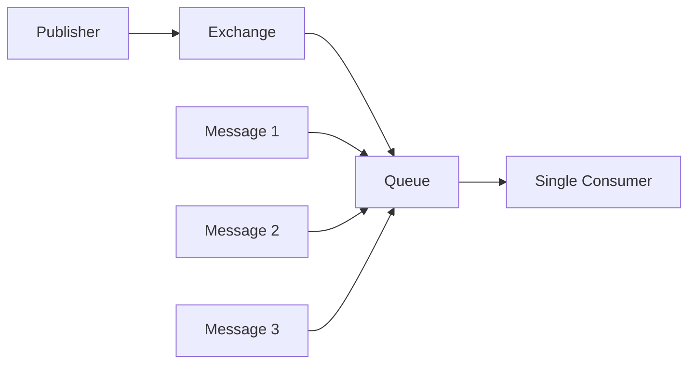
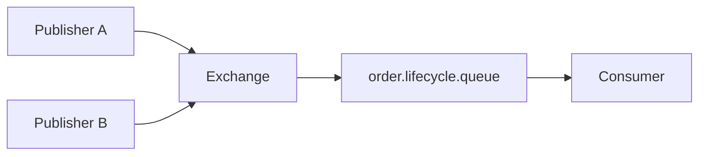
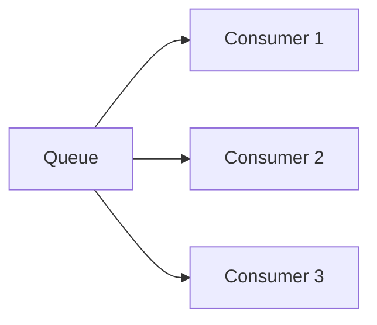
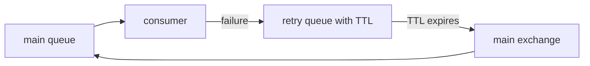
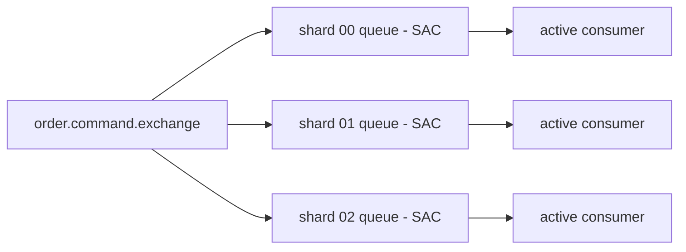
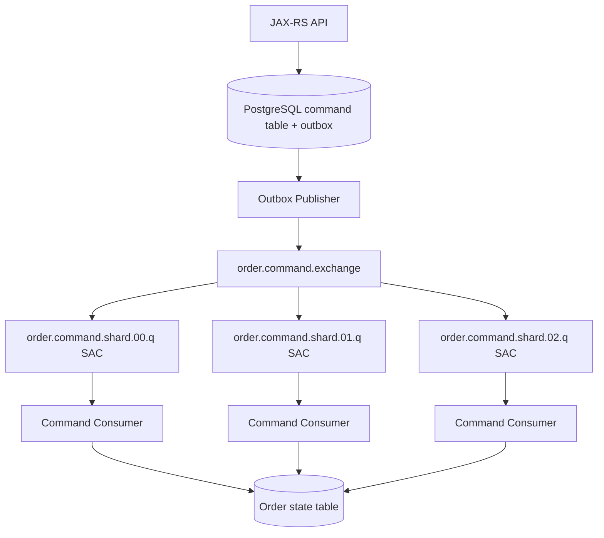

# Ordering Guarantees

## 1. Core idea

Ordering guarantee menjawab pertanyaan:

```text
Jika message A dipublish sebelum message B, apakah consumer pasti memproses A sebelum B?
```

Jawaban senior engineer hampir selalu:

```text
Tergantung scope ordering-nya.
```

RabbitMQ queue secara konseptual menyimpan message dalam urutan enqueue. Tetapi production ordering bukan hanya urutan queue.

Ordering aktual dipengaruhi oleh:

```text
publisher concurrency
exchange routing
queue type
queue count
consumer count
prefetch
manual ack
nack/requeue
redelivery
retry topology
priority queue
single active consumer
consumer processing model
PostgreSQL transaction ordering
Kubernetes replica scaling
broker failover
manual replay
```

Kesalahan umum adalah menganggap:

```text
RabbitMQ queue is FIFO
therefore my business workflow is ordered
```

Itu terlalu sederhana.

Dalam enterprise Java/JAX-RS system, ordering harus didefinisikan sebagai business property, bukan hanya broker property.

Contoh yang benar:

```text
For each orderId, state transition messages must be applied in sequence.
Across different orderId values, parallel processing is allowed.
```

Contoh yang salah:

```text
All order messages must always be ordered globally.
```

Global ordering biasanya mahal, rapuh, dan membatasi throughput.

---

## 2. Why ordering exists

Ordering penting ketika message mewakili perubahan state.

Contoh dalam CPQ/order management:

```text
QuoteCreated -> QuotePriced -> QuoteApproved -> QuoteConvertedToOrder
OrderSubmitted -> OrderValidated -> OrderDecomposed -> OrderSentToFulfillment
OrderFalloutRaised -> OrderFalloutResolved
```

Jika message diproses out-of-order:

```text
OrderApproved processed before OrderCreated
FulfillmentStarted processed before OrderValidated
PriceAdjustment processed after QuoteAccepted
Cancellation processed before Submission
```

maka sistem bisa menghasilkan:

```text
invalid state transition
stale projection
incorrect downstream command
duplicate fulfillment
false customer notification
manual repair
incident
```

Ordering bukan sekadar masalah teknis. Ordering adalah business invariant.

---

## 3. RabbitMQ ordering baseline

Baseline paling sederhana:

```text
one publisher
one exchange
one queue
one consumer
manual ack after processing
no redelivery
no retry queue
no priority
no parallel processing
```

Dalam kondisi ini, processing order relatif mudah dipahami.



Tetapi production jarang sesederhana ini.

Begitu ada:

```text
multiple publishers
multiple consumers
prefetch > 1
async processing inside consumer
retry/DLQ
manual replay
priority
multiple queues
Kubernetes horizontal scaling
```

maka urutan business effect dapat berubah.

---

## 4. Queue ordering vs processing ordering

Ada tiga level ordering yang harus dibedakan.

### 4.1 Enqueue ordering

Urutan message masuk ke queue.

```text
Q contains: M1, M2, M3
```

### 4.2 Delivery ordering

Urutan broker mengirim delivery ke consumer.

```text
Consumer receives: M1, M2, M3
```

### 4.3 Commit ordering

Urutan business effect benar-benar committed ke PostgreSQL atau sistem downstream.

```text
DB commits: M2, M1, M3
```

Problem senior engineer biasanya bukan hanya delivery order, tetapi commit order.

Consumer bisa menerima M1 lebih dulu, tetapi M2 selesai lebih cepat karena:

```text
processing time berbeda
external service latency berbeda
thread pool parallelism
DB lock contention
retry M1
consumer crash setelah M1 diproses tetapi sebelum ack
```

Karena itu, ordering harus dikunci di tempat yang benar:

```text
broker topology
consumer concurrency
aggregate-level state transition
PostgreSQL constraint/version check
idempotency logic
```

---

## 5. When RabbitMQ preserves useful order

RabbitMQ dapat memberi ordering yang berguna ketika constraint berikut terpenuhi:

```text
single logical queue for the ordered stream
single active consumer or one consumer only
consumer processes synchronously/sequentially
prefetch is controlled
ack happens after processing
no requeue loop
no priority queue
no delayed retry topology that changes order
no manual replay mixed into live traffic
publisher order is deterministic
```

Jika salah satu constraint dilanggar, ordering masih mungkin cukup baik untuk use case tertentu, tetapi tidak boleh diasumsikan strict.

---

## 6. Single queue ordering

Single queue memberi satu tempat serialization.



Tetapi single queue hanya menyelesaikan sebagian masalah.

Jika dua publisher publish concurrently, urutan arrival ke broker bisa berbeda dari urutan business event di database.

Contoh:

```text
T1: Service A commits OrderValidated
T2: Service B commits OrderCancelled
T3: Service B publishes OrderCancelled
T4: Service A publishes OrderValidated
```

Queue order menjadi:

```text
OrderCancelled
OrderValidated
```

Padahal business timestamp bisa mengharapkan sebaliknya atau justru cancellation harus menang.

Pelajaran:

```text
Queue order is not automatically domain order.
```

Domain order harus didukung oleh:

```text
event version
aggregate version
state transition guard
createdAt/publishedAt semantics
source-of-truth state read
```

---

## 7. Single consumer ordering

Jika satu queue dikonsumsi satu consumer dan consumer memproses satu message per waktu, processing order lebih mudah dijaga.

```text
queue -> consumer -> process -> commit -> ack -> next delivery
```

Kelebihan:

```text
simple ordering model
easier debugging
less duplicate interleaving
safer for strict state transition
```

Kekurangan:

```text
throughput terbatas
slow message blocks following messages
poison message can stop progress
horizontal scaling sulit
latency tail tinggi
```

Cocok untuk:

```text
low-volume critical ordering flow
per-aggregate serialization worker
control-plane commands
state machine transition executor
```

Tidak cocok untuk:

```text
high-volume independent tasks
event fanout besar
IO-bound parallel processing
bulk integration jobs
```

---

## 8. Multiple consumers ordering risk

Multiple consumers meningkatkan throughput, tetapi merusak strict processing order.



Contoh:

```text
M1 delivered to C1
M2 delivered to C2
M3 delivered to C3

C2 commits first
C3 commits second
C1 commits last
```

Delivery order:

```text
M1 -> M2 -> M3
```

Commit order:

```text
M2 -> M3 -> M1
```

Jika message berbeda aggregate, ini biasanya aman.

Jika message aggregate yang sama, ini bisa fatal.

Rule praktis:

```text
Multiple consumers are safe only if messages are independent or consumer logic protects ordering at aggregate level.
```

---

## 9. Prefetch ordering impact

Prefetch menentukan berapa banyak unacked delivery boleh outstanding.

Jika prefetch tinggi, broker bisa mengirim beberapa message ke consumer yang sama sebelum message pertama selesai.

```text
prefetch = 10
consumer receives M1..M10
consumer processes them in internal thread pool
M7 commits before M1
```

Prefetch tinggi aman jika:

```text
processing order tidak penting
consumer processing tetap sequential
message independent
idempotency kuat
```

Prefetch tinggi berbahaya jika:

```text
consumer memproses parallel
message satu aggregate
state transition harus sequential
retry/requeue bisa terjadi
DB lock contention tinggi
```

Untuk strict ordering:

```text
prefetch = 1
single active consumer
no internal parallelism
```

Namun ini bukan default terbaik untuk semua flow. Untuk work queue independen, prefetch > 1 bisa sangat membantu throughput.

---

## 10. Redelivery ordering impact

Redelivery terjadi saat message sudah delivered tetapi belum acknowledged, lalu broker harus mengirim ulang.

Penyebab:

```text
consumer crash
connection lost
channel closed
nack/reject with requeue
consumer timeout
node failure/failover
```

Contoh:

```text
M1 delivered
M2 delivered
M1 processing fails and is requeued
M2 succeeds
M3 succeeds
M1 redelivered later
```

Business effect bisa menjadi:

```text
M2 -> M3 -> M1
```

Redelivery membuat ordering tidak lagi murni FIFO.

Rule penting:

```text
If redelivery is possible, out-of-order handling must be possible.
```

Karena at-least-once delivery selalu membuka peluang redelivery, consumer state transition harus robust.

---

## 11. Requeue ordering impact

`basic.nack(requeue=true)` atau `basic.reject(requeue=true)` terlihat sederhana, tetapi production impact-nya besar.

Masalah utama:

```text
message bisa kembali ke queue
message bisa segera dikirim lagi
message bisa mendahului atau tertinggal dari message lain tergantung queue state
redelivery loop bisa terjadi
consumer lain bisa memproses message berikutnya lebih dulu
```

Anti-pattern:

```java
try {
    handle(delivery);
    channel.basicAck(tag, false);
} catch (Exception e) {
    channel.basicNack(tag, false, true); // dangerous as default
}
```

Kenapa berbahaya:

```text
transient failure bisa berubah menjadi hot loop
poison message terus diproses ulang
ordering rusak
broker dan downstream service tertekan
log meledak
DLQ tidak pernah dipakai
```

Lebih aman:

```text
classify failure
increment retry metadata
send to retry topology or DLQ
nack/reject without blind requeue
```

---

## 12. Priority queue ordering impact

Priority queue secara sengaja mengubah FIFO.

Jika priority digunakan, maka message berpriority tinggi dapat diproses sebelum message yang lebih dulu masuk.

Cocok untuk:

```text
operational task prioritization
customer-impacting repair task
urgent notification
control command
```

Berbahaya untuk:

```text
strict state transition
per-order lifecycle
financial adjustment sequence
event projection that assumes chronological order
```

Priority queue juga dapat menciptakan starvation:

```text
low priority messages never get processed because high priority traffic keeps arriving
```

Checklist sebelum menggunakan priority:

```text
Apakah order memang boleh dilanggar?
Apakah starvation acceptable?
Apakah priority count dibatasi?
Apakah metrics per priority tersedia?
Apakah retry/DLQ behavior sudah diuji?
```

---

## 13. Retry queue ordering impact

Retry topology hampir selalu memengaruhi ordering.

Contoh TTL retry:



Scenario:

```text
M1 fails and goes to retry for 5 minutes
M2 succeeds immediately
M3 succeeds immediately
M1 returns later
```

Processing order:

```text
M2 -> M3 -> M1
```

Karena itu, delayed retry tidak kompatibel dengan strict total order.

Jika business membutuhkan per-aggregate order, opsi lebih aman:

```text
pause aggregate processing until failed message resolved
store sequence gap in DB
route by aggregate shard
use single active consumer per shard
put failed aggregate into repair state
separate ordered command executor from unordered task queue
```

---

## 14. DLQ and manual replay ordering impact

DLQ menyimpan message yang gagal permanen atau melebihi retry.

Manual replay dari DLQ ke main queue sering dilakukan saat incident recovery.

Risiko:

```text
old message enters live stream
old state transition applies after newer state
duplicate external command sent
customer notification repeated
projection rollback-like effect
```

Manual replay harus punya guard:

```text
idempotency check
aggregate version check
current state validation
operator approval
replay batch limit
dry-run mode if possible
clear audit trail
```

Replay bukan hanya operasi queue. Replay adalah operasi business.

---

## 15. Quorum queue ordering considerations

Quorum queue memberi durability dan replication berbasis leader/follower model.

Ordering tetap harus dipahami dari sisi queue dan consumer.

Hal yang perlu diperhatikan:

```text
leader failover can cause redelivery
unacked messages can be delivered again
consumer must be idempotent
poison handling/delivery limit can move messages out of normal flow
throughput/latency profile differs from classic queue
```

Quorum queue membantu data safety, tetapi tidak menghilangkan kebutuhan idempotency atau ordering guard.

Rule:

```text
Quorum improves replicated durability, not business-level exactly-once ordering.
```

---

## 16. RabbitMQ Stream ordering considerations

RabbitMQ Stream berbeda dari queue biasa.

Stream lebih cocok ketika:

```text
retention matters
replay matters
offset matters
high-throughput append matters
consumers need independent positions
```

Ordering biasanya dipahami per stream atau per partition/super stream.

Jika stream dipartisi:

```text
global order across partitions is not guaranteed
per-partition order is the useful guarantee
```

Untuk domain seperti order management:

```text
partition key should usually be aggregate id, order id, quote id, customer id, or tenant+aggregate id
```

Jika key salah, message satu aggregate bisa masuk partition berbeda dan ordering rusak.

---

## 17. Per-aggregate ordering

Per-aggregate ordering adalah model yang paling realistis untuk enterprise domain.

Daripada meminta global order:

```text
all messages ordered globally
```

lebih baik:

```text
messages for same orderId ordered
messages for different orderId can run in parallel
```

Contoh:

```text
order-123: Created -> Validated -> Decomposed
order-456: Created -> Cancelled
```

Keduanya boleh parallel.

Pattern umum:

```text
route by aggregate key
shard queue by aggregate hash
single active consumer per shard
aggregate version in message
PostgreSQL optimistic locking
state transition guard
```

---

## 18. Message group pattern

RabbitMQ AMQP 0-9-1 tidak memiliki konsep message group bawaan seperti beberapa broker lain.

Namun message group bisa dirancang dengan kombinasi:

```text
routing key contains aggregate group
consistent hash exchange plugin if used
fixed shard queues
single active consumer per shard
consumer-side per-key serialization
DB-level version guard
```

Contoh topology:

```text
exchange: order.command.x
routing key: tenantA.order.123.command.submit
hash key: orderId
queues:
  order.command.shard.00.q
  order.command.shard.01.q
  order.command.shard.02.q
```

Important:

```text
Message group is a design pattern, not magic.
```

Harus diverifikasi di topology dan code.

---

## 19. Single Active Consumer

Single Active Consumer membantu memastikan hanya satu consumer aktif menerima message dari queue pada satu waktu.

Manfaat:

```text
stronger queue-level processing order
safe failover to standby consumer
less accidental parallel processing
useful for ordered command executor
```

Trade-off:

```text
throughput limited by one active consumer
standby consumers idle
slow processing blocks queue
poison message can stop progress
scaling requires sharding into multiple queues
```

Pattern production:

```text
N shard queues
single active consumer enabled per shard
multiple pod replicas can subscribe
only one active consumer per shard at a time
```



Ini memberi kompromi:

```text
ordered per shard
parallel across shards
controlled failover
```

---

## 20. Publisher-side ordering

Ordering tidak hanya masalah consumer.

Publisher bisa merusak urutan jika:

```text
multiple threads publish events for same aggregate
multiple service instances publish related messages
outbox poller mengambil rows tanpa deterministic order
publisher retry publishes older event after newer event
confirm timeout causes duplicate publish later
```

Outbox harus memperhatikan ordering:

```sql
SELECT *
FROM outbox
WHERE status = 'NEW'
ORDER BY aggregate_id, aggregate_version
FOR UPDATE SKIP LOCKED
LIMIT 100;
```

Namun query seperti itu belum otomatis benar. Jika banyak poller berjalan paralel, aggregate yang sama bisa diproses oleh poller berbeda.

Untuk ordering-sensitive outbox:

```text
lock per aggregate
partition outbox polling by aggregate hash
publish in aggregate_version order
prevent publishing version N+1 before N
mark blocked aggregate if version N fails
```

---

## 21. PostgreSQL/MyBatis/JDBC ordering guard

Broker ordering tidak cukup. PostgreSQL harus ikut menjaga state correctness.

Guard yang umum:

### 21.1 Aggregate version

```sql
UPDATE orders
SET status = 'VALIDATED', version = version + 1
WHERE order_id = #{orderId}
  AND version = #{expectedVersion}
  AND status = 'SUBMITTED';
```

Jika affected rows = 0:

```text
message duplicate
message stale
message out-of-order
invalid state transition
```

Consumer tidak boleh asal ack tanpa klasifikasi.

### 21.2 Processed message table

```sql
INSERT INTO processed_message(message_id, consumer_name, processed_at)
VALUES (#{messageId}, #{consumerName}, now())
ON CONFLICT DO NOTHING;
```

### 21.3 State transition table

```text
order_state_transition
- order_id
- from_state
- to_state
- message_id
- event_version
- created_at
```

Membantu audit ordering.

### 21.4 Unique command key

```text
tenant_id + command_id
order_id + command_type + idempotency_key
```

Mencegah duplicate command menghasilkan duplicate side effect.

---

## 22. Java/JAX-RS backend implications

Dalam JAX-RS service, ordering concern sering muncul saat HTTP request diterjemahkan menjadi command message.

Contoh:

```text
POST /orders/{id}/submit
POST /orders/{id}/cancel
POST /orders/{id}/amend
```

Jika request masuk hampir bersamaan:

```text
submit and cancel race
cancel and amend race
approval and price recalculation race
```

API layer perlu memutuskan:

```text
Apakah request diterima async tanpa validasi state kuat?
Apakah service layer menulis command row dulu?
Apakah command sequence ditentukan di DB?
Apakah RabbitMQ hanya membawa command id?
Apakah consumer membaca current state sebelum execute?
```

Pattern yang lebih aman:

```text
JAX-RS validates basic request
service layer creates command record with idempotency key
DB transaction commits command + outbox
publisher emits command message
consumer loads command and aggregate state
consumer applies guarded transition
ack after commit
```

---

## 23. Microservices and distributed consistency

Distributed system tidak punya satu global clock yang aman untuk business ordering.

Message timestamp bisa berbeda karena:

```text
clock skew
network delay
publisher retry
outbox lag
consumer lag
cross-region latency
manual replay
```

Karena itu, ordering antar service harus berbasis:

```text
aggregate version
causation id
correlation id
state machine guard
source-of-truth read
idempotency
contracted event semantics
```

Event consumer tidak boleh mengasumsikan:

```text
If I receive Event B after Event A, then B is newer in business sense.
```

Lebih aman:

```text
Event contains aggregateVersion.
Consumer applies only if version advances expected state.
Otherwise classify as duplicate, stale, gap, or conflict.
```

---

## 24. Kubernetes scaling impact

Kubernetes dapat merusak ordering secara tidak sengaja melalui scaling.

Contoh:

```yaml
replicas: 5
```

Jika semua pod consume queue yang sama:

```text
consumer count = 5
processing order is parallel
strict queue order is gone at commit level
```

Rolling update juga dapat menyebabkan:

```text
pod receives message
pod starts shutdown
message not acked
message redelivered to new pod
newer message already processed by another pod
```

Checklist Kubernetes:

```text
Apakah flow ordering-sensitive?
Apakah HPA boleh scale consumer?
Apakah preStop drain benar?
Apakah graceful shutdown menunggu in-flight message?
Apakah consumer replicas dikontrol?
Apakah single active consumer digunakan?
Apakah queue dishard untuk parallel ordered processing?
```

---

## 25. AWS/Azure/on-prem/hybrid impact

Ordering juga dipengaruhi deployment environment.

### 25.1 Cloud managed broker

Perlu cek:

```text
broker failover behavior
maintenance window
node restart behavior
client reconnect behavior
queue type support
observability around redelivery after failover
```

### 25.2 Kubernetes self-managed

Perlu cek:

```text
pod disruption
statefulset rolling restart
storage latency
network partition
anti-affinity
quorum queue leader movement
```

### 25.3 On-prem/hybrid

Perlu cek:

```text
WAN latency
firewall interruptions
certificate expiry
cross-site broker connection
manual replay after outage
clock skew between sites
```

Ordering-sensitive flows harus diuji terhadap failover, bukan hanya happy path.

---

## 26. Ordering failure modes

| Failure mode | Symptom | Likely cause | Risk |
|---|---|---|---|
| Out-of-order state transition | DB update rejected or invalid state | Multiple consumers, retry, redelivery | Business inconsistency |
| Duplicate older event | Same message processed again | Redelivery after crash | Duplicate side effect |
| Stale projection | Read model shows old state | Event processed late | Customer/API confusion |
| Retry inversion | Later messages processed before failed earlier one | Delayed retry topology | State conflict |
| Replay inversion | DLQ message replayed into live flow | Manual replay | Regression-like effect |
| Priority starvation | Low priority never processed | Priority queue misuse | SLA violation |
| Shard misrouting | Same aggregate processed in different queue | Bad routing key/hash | Broken per-aggregate order |
| Poller inversion | Outbox publishes newer before older | Parallel pollers | Event inconsistency |

---

## 27. How to detect ordering failures

Observable signals:

```text
invalid state transition count
optimistic lock conflict rate
stale event discard count
aggregate version gap count
duplicate message count
redelivery rate
DLQ count for state conflict
manual replay audit
consumer processing latency by aggregate
outbox lag by aggregate
```

Log fields required:

```text
messageId
correlationId
causationId
aggregateId
aggregateVersion
routingKey
queue
consumerName
redelivered
retryCount
xDeathCount
currentState
expectedState
transitionResult
```

Without these fields, ordering debugging becomes guesswork.

---

## 28. Debugging ordering issue

Use this sequence.

### Step 1: Identify aggregate

```text
Which quoteId/orderId/customerId is affected?
```

### Step 2: Build message timeline

Collect:

```text
createdAt
publishedAt
enqueuedAt if available
deliveredAt
processingStartedAt
committedAt
ackedAt
redelivered flag
retry count
```

### Step 3: Compare business version

```text
Expected aggregate version sequence?
Actual processed sequence?
Missing version?
Duplicate version?
Stale version?
```

### Step 4: Inspect topology

```text
Was there one queue or many?
How many consumers?
Prefetch?
Retry queue?
Priority?
Manual replay?
Single active consumer?
```

### Step 5: Inspect deployment activity

```text
Was there rollout?
HPA scale event?
Broker failover?
Connection loss?
Consumer crash?
```

### Step 6: Decide repair

```text
ignore stale duplicate
replay missing message
manually repair aggregate state
rebuild projection
quarantine affected aggregate
patch consumer transition guard
```

---

## 29. Design patterns for ordering

### 29.1 Strict low-volume order

```text
single queue
single active consumer
prefetch 1
sequential consumer
state transition guard
```

Use for:

```text
critical state machine commands
low-volume control flow
approval transition executor
```

### 29.2 Per-aggregate ordered parallelism

```text
route by aggregate hash
N shard queues
single active consumer per shard
aggregate version check
```

Use for:

```text
order lifecycle
quote lifecycle
customer account updates
```

### 29.3 Unordered high-throughput tasks

```text
work queue
many consumers
prefetch tuned
idempotency key
no strict order assumption
```

Use for:

```text
email notification
report generation
cache refresh
non-critical integration job
```

### 29.4 Projection with gap detection

```text
event contains aggregateVersion
consumer tracks lastAppliedVersion
if version == last + 1: apply
if version <= last: discard duplicate/stale
if version > last + 1: park and wait/reconcile
```

Use for:

```text
read model
search index projection
audit projection
```

---

## 30. Anti-patterns

### 30.1 Assuming FIFO with multiple consumers

```text
Queue is FIFO, so five consumers are still ordered.
```

Wrong at commit level.

### 30.2 Blind requeue

```text
nack(requeue=true) for every exception
```

Creates redelivery loop and ordering inversion.

### 30.3 Retry queue for strict sequence

Delayed retry lets later messages pass earlier failed messages.

### 30.4 Manual replay without state guard

Old messages can apply after newer state.

### 30.5 Using priority for lifecycle events

Priority intentionally violates FIFO.

### 30.6 Global ordering requirement without business justification

Global ordering kills throughput and usually hides a need for aggregate-level consistency.

---

## 31. Example: Order lifecycle command executor

A safer model:



Message metadata:

```json
{
  "messageId": "msg-...",
  "commandId": "cmd-...",
  "aggregateType": "Order",
  "aggregateId": "order-123",
  "aggregateVersion": 12,
  "commandType": "SubmitOrder",
  "correlationId": "corr-...",
  "causationId": "http-request-..."
}
```

Consumer rule:

```text
apply only if current state allows transition
apply only if command not processed
commit DB
ack message
```

---

## 32. Example MyBatis guard

```java
public void handle(OrderCommandMessage message) throws IOException {
    try {
        transactionTemplate.executeWithoutResult(tx -> {
            boolean firstTime = inboxMapper.insertIfAbsent(
                message.messageId(),
                "order-command-consumer"
            ) == 1;

            if (!firstTime) {
                return;
            }

            int updated = orderMapper.transition(
                message.orderId(),
                message.expectedVersion(),
                message.expectedState(),
                message.targetState()
            );

            if (updated != 1) {
                throw new OutOfOrderOrStaleMessageException(message.messageId());
            }
        });

        channel.basicAck(message.deliveryTag(), false);
    } catch (OutOfOrderOrStaleMessageException e) {
        // classify: stale duplicate, gap, invalid command, or poison
        channel.basicReject(message.deliveryTag(), false);
    } catch (Exception e) {
        // send to controlled retry topology, not blind requeue
        channel.basicNack(message.deliveryTag(), false, false);
    }
}
```

Key point:

```text
Ordering correctness is enforced at DB state transition, not assumed from broker delivery.
```

---

## 33. Internal verification checklist

Verify in CSG/team context:

```text
Which flows require ordering?
Is ordering global, per tenant, per quote, per order, per customer, or per workflow?
Which queues have multiple consumers?
What is prefetch per consumer?
Are consumers internally parallel?
Are Kubernetes replicas allowed to scale freely?
Is single active consumer used anywhere?
Are queues sharded by aggregate?
How is aggregate key represented in routing key/header/payload?
Does message contain aggregate version?
Does DB enforce state transition order?
Does outbox publish per aggregate in deterministic order?
Can retry topology reorder messages?
Can DLQ replay introduce old messages into live processing?
Are priority queues used for lifecycle messages?
What metrics detect stale/out-of-order events?
Are ordering incidents documented?
Who owns repair when ordering fails?
```

---

## 34. PR review checklist

Ask these questions before approving RabbitMQ-related PRs.

### 34.1 Ordering requirement

```text
Does this flow require ordering?
What is the ordering scope?
What happens if messages arrive out-of-order?
```

### 34.2 Topology

```text
How many queues?
How many consumers?
Is single active consumer needed?
Is sharding needed?
Is routing key deterministic?
```

### 34.3 Consumer behavior

```text
Is processing sequential or parallel?
What is prefetch?
When does ack happen?
What happens on failure?
Is blind requeue avoided?
```

### 34.4 Retry/DLQ

```text
Can retry reorder messages?
Can DLQ replay violate state?
Is replay guarded by idempotency and version checks?
```

### 34.5 Database correctness

```text
Is there aggregate version?
Is there optimistic lock?
Is invalid transition rejected?
Are duplicates detected?
```

### 34.6 Observability

```text
Can we see aggregateId and aggregateVersion in logs?
Can we detect stale/gap/duplicate events?
Can we reconstruct timeline after incident?
```

---

## 35. Decision matrix

| Requirement | Recommended model | Avoid |
|---|---|---|
| Strict global order | Single queue + one consumer | High consumer concurrency |
| Per-order order | Sharded queues by orderId + SAC | Random routing |
| High-throughput independent task | Work queue + many consumers | Artificial global order |
| Event projection | Versioned event + gap detection | Blind apply by arrival order |
| Retry-sensitive ordered flow | Park aggregate or controlled retry | Delayed retry without state guard |
| Urgent operational job | Priority queue if order not important | Priority for lifecycle transitions |
| Replayable ordered stream | RabbitMQ Stream partitioned by key | Queue treated as long-term log |

---

## 36. Production readiness summary

A RabbitMQ ordering design is production-ready only if it answers:

```text
What is the ordering scope?
Where is order enforced?
Where can order break?
How do we detect out-of-order processing?
How do we repair affected aggregates?
How do retries interact with order?
How does Kubernetes scaling interact with order?
How does DB state protect correctness?
```

Senior rule:

```text
Do not rely on broker FIFO to protect business state.
Use broker ordering as one layer, then enforce domain correctness in consumer and database.
```

---

## 37. References for further internal study

Use these as external reference anchors, then verify against the RabbitMQ version and deployment used internally:

```text
RabbitMQ Queues documentation
RabbitMQ Consumer Acknowledgements and Publisher Confirms
RabbitMQ Consumer Prefetch documentation
RabbitMQ Single Active Consumer documentation
RabbitMQ Priority Queues documentation
RabbitMQ Quorum Queues documentation
RabbitMQ Streams documentation
RabbitMQ Reliability Guide
```
