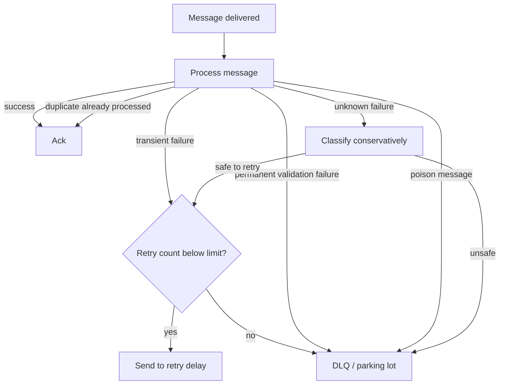
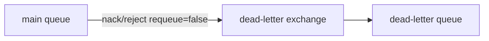
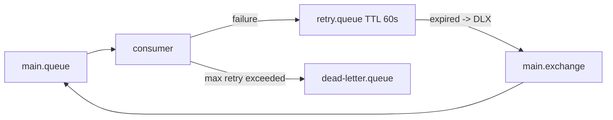
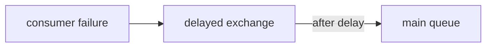

# Retry and Dead-Letter Strategy

## 1. Core idea

Retry strategy menjawab pertanyaan:

```text
Jika consumer gagal memproses message, apa yang harus terjadi berikutnya?
```

Dead-letter strategy menjawab pertanyaan:

```text
Jika message tidak bisa diproses dengan aman, ke mana message harus dipindahkan agar tidak merusak sistem utama?
```

Dalam RabbitMQ production system, retry bukan sekadar:

```java
catch (Exception e) {
    basicNack(tag, false, true);
}
```

Itu sering menjadi sumber incident.

Retry strategy harus mengontrol:

```text
failure classification
retry count
retry delay
backoff
poison message isolation
DLQ ownership
manual replay
observability
idempotency
ordering impact
business repair procedure
```

Rule senior engineer:

```text
Every retry strategy is also a failure amplification strategy unless bounded, observable, and idempotent.
```

---

## 2. Why retry exists

Distributed systems gagal secara normal.

Consumer RabbitMQ bisa gagal karena:

```text
PostgreSQL transient lock timeout
PostgreSQL connection pool exhausted
external API timeout
downstream service unavailable
validation error
schema mismatch
bug in consumer code
permission issue
TLS issue
Redis unavailable
network partition
CPU throttling in Kubernetes
pod shutdown during processing
broker failover
```

Beberapa failure layak retry.

Beberapa failure tidak boleh retry tanpa batas.

Beberapa failure harus langsung DLQ.

Beberapa failure butuh human intervention.

---

## 3. Failure classification

Retry strategy dimulai dari klasifikasi failure.

| Failure type | Example | Retry? | Target |
|---|---|---:|---|
| Transient infrastructure | DB timeout, network timeout, temporary downstream unavailable | Yes | Retry with delay/backoff |
| Backpressure | DB pool exhausted, downstream rate limit | Yes, delayed | Retry with longer delay or throttle |
| Permanent validation | Missing required field, invalid enum, impossible command | No | DLQ/parking lot |
| Contract/schema mismatch | Unknown version, incompatible payload | Usually no | DLQ + producer/contract fix |
| Poison message | Always fails due to data bug | Bounded retry only | Parking lot |
| Consumer bug | Null pointer due to code defect | Maybe after deploy fix | DLQ/parking lot, replay later |
| Duplicate message | Already processed | No failure | Ack safely |
| Stale/out-of-order | Version conflict, invalid state transition | Depends | Park, DLQ, or reconcile |
| Security/permission | Cannot access queue/resource | No blind retry | Incident/security fix |

A consumer should not treat all exceptions equally.

---

## 4. The retry decision tree



The important move:

```text
Failure must be classified before deciding ack/nack/retry/DLQ.
```

---

## 5. RabbitMQ dead-lettering mental model

Dead-lettering means RabbitMQ republishes a message from a queue to a configured dead-letter exchange when a dead-letter condition occurs.

Common dead-letter causes:

```text
message rejected/nacked with requeue=false
message expires due to TTL
queue length limit exceeded
quorum queue delivery limit exceeded if configured
```

A DLX is an exchange.

A DLQ is just a queue bound to that exchange.



This distinction matters:

```text
DLX routes.
DLQ stores.
Binding determines where dead-lettered messages land.
```

---

## 6. DLQ is not a trash bin

A DLQ is an operational holding area.

It must answer:

```text
Who owns this DLQ?
What messages are allowed here?
What alert fires when it grows?
What data is sensitive inside it?
How long is it retained?
Who can replay it?
How is replay audited?
How is replay made idempotent?
What is the customer impact of messages in this DLQ?
```

Anti-pattern:

```text
Everything fails into one giant shared DLQ and nobody owns it.
```

Better:

```text
DLQ per domain/service/flow
clear owner
clear runbook
clear replay rules
clear retention
clear dashboard
```

---

## 7. Poison message

A poison message is a message that repeatedly fails and cannot make progress without change.

Causes:

```text
bad payload
missing required field
unknown schema version
invalid state transition
consumer bug
unexpected null
referenced entity does not exist
external system rejects permanently
```

Poison message danger:

```text
blocks ordered queue
creates retry storm
keeps consuming CPU/DB/API capacity
fills logs
hides other messages
creates alert fatigue
```

Poison messages must be isolated.

```text
retry a bounded number of times
then move to DLQ or parking lot
```

---

## 8. Retry count

Every retry strategy needs a retry count.

Possible sources:

```text
x-death header from RabbitMQ dead-lettering
custom header such as x-retry-count
inbox/retry table in PostgreSQL
quorum queue delivery count/delivery limit
application retry metadata in payload
```

Be careful with custom headers.

If a message is dead-lettered and republished by RabbitMQ, headers may accumulate in ways that must be tested.

Recommended internal standard:

```text
messageId: stable across retries
correlationId: stable across flow
retryAttempt: explicit application-level value if republishing manually
x-death: broker-level diagnostic, not sole business source of truth
firstFailedAt
lastFailedAt
lastErrorCode
lastErrorClass
```

---

## 9. Retry delay

Immediate retry is often harmful.

If DB is down for 60 seconds, immediate retry creates:

```text
fast failure loop
high CPU
high DB connection churn
redelivery rate spike
log explosion
queue churn
same outage amplified
```

Delayed retry allows time for recovery.

Delay strategies:

```text
fixed delay
incremental delay
exponential backoff
exponential backoff with max cap
jittered backoff
manual retry only
```

Example:

```text
attempt 1 -> 10 seconds
attempt 2 -> 1 minute
attempt 3 -> 5 minutes
attempt 4 -> 30 minutes
attempt 5 -> parking lot
```

---

## 10. Retry topology option 1: blind requeue

```java
channel.basicNack(tag, false, true);
```

This means:

```text
message is not acknowledged
broker can requeue it
message can be delivered again
```

Use carefully.

Acceptable for:

```text
very short transient issue
rare error
consumer shutdown handoff
controlled requeue during graceful stop
```

Bad as default because:

```text
no delay
no retry limit
can create hot loop
can reorder
can starve queue
can overload downstream
```

Rule:

```text
Do not use requeue=true as generic retry strategy.
```

---

## 11. Retry topology option 2: TTL retry queue

TTL retry uses a delay queue. Message waits in retry queue until TTL expires, then dead-letters back to main exchange/queue.



Common topology:

```text
main exchange -> main queue
main queue dead-letter -> retry exchange
retry queue has message TTL
retry queue dead-letter -> main exchange
max retries exceeded -> final DLQ/parking lot
```

Benefits:

```text
no plugin required
simple broker-side delay
clear queue visibility
```

Risks:

```text
ordering changes
TTL behavior must be tested
x-death parsing complexity
multiple retry delays require multiple queues or republish logic
large retry queue can hide backlog
```

---

## 12. Retry topology option 3: delayed message exchange plugin

If the RabbitMQ delayed message exchange plugin is used, publisher can delay messages via exchange-level mechanism.

Conceptual flow:



Benefits:

```text
more flexible per-message delay
less retry queue sprawl
cleaner exponential backoff implementation
```

Risks:

```text
plugin dependency
must verify plugin availability in target environment
operational semantics must be tested
managed broker may not support plugin
internal standards may disallow it
```

Internal verification is mandatory before designing around this.

---

## 13. Retry topology option 4: application republish

Consumer catches failure and republishes a new retry message with updated headers.

```text
consume main message
classify failure
publish retry message with retryAttempt+1 and delay/routing
ack original only after retry publish confirm
```

Critical rule:

```text
Never ack original before retry message is safely published.
```

Otherwise failure window:

```text
consumer fails
original already acked
retry message not published
message lost
```

Safer sequence:

```text
process fails
publish retry message
wait for publisher confirm
ack original
```

But this creates duplicate risk if confirm or ack outcome is uncertain.

Therefore:

```text
messageId/idempotency must remain stable
consumer must handle duplicates
retry publish must be observable
```

---

## 14. Retry topology option 5: PostgreSQL-backed retry/inbox state

For high correctness flows, retry state can live in PostgreSQL.

Pattern:

```text
message delivered
consumer inserts/updates inbox row
consumer records failure and next_attempt_at
ack message
scheduler republishes eligible retry command later
```

Benefits:

```text
auditable retry state
queryable by aggregate/customer/tenant
supports manual repair
supports idempotency and business status
can coordinate with state machine
```

Risks:

```text
more application complexity
requires scheduler/poller
must handle publish confirm
must avoid duplicate scheduled retry
requires cleanup/retention
```

Good for:

```text
order workflow
integration fallout
human repair
business-critical command processing
```

---

## 15. Parking lot queue

A parking lot queue stores messages that should not keep retrying automatically.

Use when:

```text
retry limit exceeded
message requires human investigation
consumer bug needs fix before replay
schema incompatibility requires producer fix
data repair needed
external downstream rejects permanently
```

Parking lot queue should preserve diagnostic metadata:

```text
original exchange
original routing key
original queue
messageId
correlationId
aggregateId
tenantId
retry count
x-death
last error
stack trace hash
failedAt
consumer version
```

Replay from parking lot must be controlled.

```text
operator selects messages
system validates current state
message is republished with audit record
replay is rate-limited
replay is idempotent
```

---

## 16. DLQ vs parking lot

| Concept | Purpose | Typical owner | Replay? |
|---|---|---|---|
| DLQ | Technical dead-letter destination | Service/team owning consumer | Sometimes |
| Parking lot | Investigative/manual repair holding area | Backend + SRE + domain owner | Controlled |
| Retry queue | Delayed automatic retry | Application/platform | Automatic |
| Error table | Business failure/audit state | Application/domain | Via workflow |

In some teams DLQ and parking lot are the same. That is acceptable only if ownership and replay rules are explicit.

---

## 17. x-death header

RabbitMQ adds `x-death` metadata when messages are dead-lettered.

It can help determine:

```text
which queue dead-lettered the message
why it was dead-lettered
how many times it passed through dead-lettering
which exchange/routing key was involved
```

But do not build fragile business logic on undocumented assumptions about complex header shape across all topology variants.

Recommended approach:

```text
Use x-death for diagnostics and retry counting where standardized internally.
Use explicit application retry metadata when correctness depends on it.
Test header behavior with the exact RabbitMQ version and topology.
```

---

## 18. Retry and idempotency

Retry means duplicate processing is possible.

Always assume:

```text
same message can be delivered again
same retry can be published twice
ack can be lost
consumer can crash after DB commit
publisher confirm can be ambiguous
manual replay can duplicate old work
```

Required defenses:

```text
stable messageId
idempotency key
inbox table
processed message table
unique command key
state transition guard
external side-effect deduplication if possible
```

Retry without idempotency is just repeated damage.

---

## 19. Retry and PostgreSQL transaction boundary

Consumer transaction should be designed around ack timing.

Safer baseline:

```text
receive message
start DB transaction
check inbox/idempotency
apply business change or record failure
commit DB transaction
ack message
```

For retry publish:

```text
receive message
classify failure
publish retry/dead-letter path safely
ack original only after retry path is durable enough
```

If using PostgreSQL-backed retry:

```text
receive message
record failed attempt and next_attempt_at in DB
commit
ack original
scheduler handles future retry
```

Failure windows must be explicit.

---

## 20. Retry and ordering

Retry can break ordering.

Example:

```text
M1 fails and waits in retry queue for 5 minutes
M2 succeeds now
M3 succeeds now
M1 returns later
```

If M1/M2/M3 are same aggregate lifecycle messages, state may break.

Options:

```text
allow out-of-order and use state guard
pause aggregate until M1 resolved
park aggregate-specific flow
use per-aggregate sequence gap detection
use single active consumer and avoid delayed retry for ordered flow
use workflow state table rather than pure queue order
```

Do not hide this trade-off.

---

## 21. Retry and external side effects

External calls are dangerous under retry.

Example:

```text
consumer calls fulfillment API
fulfillment succeeds
consumer crashes before DB commit/ack
message redelivered
consumer calls fulfillment again
```

Mitigations:

```text
external idempotency key
outbox to downstream integration service
store side-effect attempt before call
reconciliation job
consumer checks current state before retrying
manual repair for uncertain side effects
```

For payment, fulfillment, provisioning, or customer notification flows, retry policy must be reviewed with domain owner.

---

## 22. Retry and JAX-RS API semantics

If HTTP request triggers async RabbitMQ work, API response must not promise final success too early.

Better:

```http
202 Accepted
Location: /operations/{operationId}
```

The operation status can represent:

```text
PENDING
PROCESSING
RETRYING
FAILED_NEEDS_ATTENTION
COMPLETED
CANCELLED
```

This is better than:

```http
200 OK
```

when actual work can still fail in RabbitMQ consumer later.

For enterprise UX and support, expose retry/failure state somewhere safe.

---

## 23. Retry and Kubernetes

Kubernetes can trigger retries indirectly.

Events:

```text
pod terminated during processing
rolling deployment
HPA scale down
node drain
OOMKilled
CPU throttling causing timeout
secret rotation causing reconnect
network policy update
```

Consumer must handle:

```text
graceful shutdown
in-flight drain
ack only after commit
nack/requeue only for shutdown handoff if safe
avoid killing pod before processing finishes
visibility into redelivery after rollout
```

Checklist:

```text
terminationGracePeriodSeconds large enough?
preStop hook stops new consumption?
consumer cancellation handled?
in-flight messages drained?
readiness set false before shutdown?
retry spike after deployment monitored?
```

---

## 24. Retry in cloud/on-prem/hybrid

### 24.1 AWS/Azure managed/self-managed

Verify:

```text
plugin support for delayed exchange
DLX/DLQ policy management
broker maintenance/failover behavior
metrics for dead-lettering/retry
backup/snapshot expectation
message retention implications
```

### 24.2 On-prem/hybrid

Verify:

```text
network outage retry behavior
cross-site latency
certificate expiry failure mode
firewall/proxy interruption
manual replay after prolonged outage
operator access to DLQ
```

Hybrid retry can produce large backlog after connectivity returns. Rate-limited replay matters.

---

## 25. Observability for retry/DLQ

Minimum metrics:

```text
retry queue depth by queue
DLQ depth by queue
parking lot depth
redelivery rate
nack/reject rate
failure classification count
retry attempt distribution
oldest message age in retry queue
oldest message age in DLQ
manual replay count
replay success/failure count
consumer error rate by exception class
x-death count distribution
```

Minimum logs:

```text
messageId
correlationId
aggregateId
tenantId
queue
exchange
routingKey
retryAttempt
failureClass
failureCode
redelivered
xDeathSummary
nextRetryAt
finalDisposition
```

Alert examples:

```text
DLQ depth > 0 for critical flow
DLQ depth increasing for 5 minutes
retry queue oldest age > expected max
redelivery rate spikes after deployment
parking lot message age > SLA
manual replay failure > 0
```

---

## 26. Retry storm

A retry storm happens when many messages fail and retry aggressively.

Symptoms:

```text
high redelivery rate
high CPU
consumer logs explode
DB/downstream overloaded
queue depth oscillates
retry queue grows fast
DLQ spike
publisher/consumer latency rises
```

Causes:

```text
blind requeue=true
no retry delay
no retry limit
shared downstream outage
bad deployment causing all messages to fail
schema change breaks consumer
external API rate limit
```

Immediate mitigation:

```text
pause consumers if safe
stop bad deployment
increase retry delay
rate-limit replay
move poison messages to parking lot
protect downstream dependency
communicate impact
```

Long-term fix:

```text
bounded retry
failure classification
circuit breaker
backoff with jitter
DLQ ownership
consumer canarying
contract tests
```

---

## 27. Manual replay

Manual replay is a production operation.

It should not be:

```text
select all from DLQ and publish everything back
```

Safe replay process:

```text
identify affected flow
sample messages
classify root cause
confirm consumer fix or data repair
validate current aggregate state
select bounded batch
republish with audit record
rate-limit replay
monitor success/failure
stop if DLQ grows again
```

Replay metadata:

```text
replayedBy
replayedAt
replayReason
sourceQueue
sourceMessageId
newMessageId if changed
originalMessageId if preserved
approvalTicket
```

For business-critical flows, replay must be tied to incident/change ticket.

---

## 28. Automated replay

Automated replay can be useful for known transient issues.

But it needs guardrails:

```text
max attempts
max total age
max batch size
rate limit
failure classification allowlist
circuit breaker
idempotency check
observability
kill switch
```

Good candidates:

```text
temporary HTTP 503 from downstream
timeout from dependency
DB deadlock/serialization failure
rate limit response with retry-after
```

Bad candidates:

```text
schema validation error
unknown enum
invalid state transition
permission denied
PII/compliance failure
business rule violation
```

---

## 29. Retry configuration example

Example policy per flow:

| Flow | Attempts | Delay | Final destination | Notes |
|---|---:|---|---|---|
| Cache invalidation | 3 | 10s, 30s, 2m | DLQ | Can rebuild cache |
| Notification | 5 | exponential capped | Parking lot | Avoid duplicate customer messages |
| Fulfillment command | 3 | 1m, 5m, 30m | Manual repair | External idempotency required |
| Projection update | 10 | incremental | DLQ/rebuild projection | Can rebuild from source if available |
| Order state command | 0-2 | controlled | Parking lot | Ordering and state guard critical |

No single retry policy fits all queues.

---

## 30. Consumer pseudo-code

```java
public void onDelivery(Delivery delivery) throws IOException {
    long tag = delivery.getEnvelope().getDeliveryTag();
    MessageEnvelope message = deserialize(delivery);

    try {
        ProcessingResult result = transactionTemplate.execute(status -> {
            if (inboxRepository.alreadyProcessed(message.messageId(), CONSUMER_NAME)) {
                return ProcessingResult.duplicate();
            }

            return handler.handle(message);
        });

        if (result.isSuccess() || result.isDuplicate()) {
            channel.basicAck(tag, false);
            return;
        }

        FailureDecision decision = failureClassifier.classify(result.failure(), message);
        routeFailure(delivery, message, decision);
        channel.basicAck(tag, false);

    } catch (TransientInfrastructureException e) {
        FailureDecision decision = failureClassifier.retry(e, message);
        routeFailure(delivery, message, decision);
        channel.basicAck(tag, false);

    } catch (PermanentMessageException e) {
        routeFailure(delivery, message, FailureDecision.deadLetter(e));
        channel.basicAck(tag, false);

    } catch (Throwable t) {
        // Conservative default: do not hot-loop.
        routeFailure(delivery, message, FailureDecision.deadLetter(t));
        channel.basicAck(tag, false);
    }
}
```

Important:

```text
This is conceptual pseudo-code.
Actual implementation must ensure retry/DLQ publish is confirmed before acking original.
```

---

## 31. Retry publish safety

If application manually republishes to retry/DLQ, sequence matters.

Unsafe:

```text
ack original
publish retry
```

If process dies between steps, message is lost.

Safer:

```text
publish retry/DLQ
wait for publisher confirm
ack original
```

Still possible:

```text
publish confirmed
process dies before ack
original redelivered
retry copy also exists
```

Therefore:

```text
stable messageId
idempotent consumer
retry deduplication
observability
```

There is no free lunch.

---

## 32. Retry topology review checklist

Before approving a retry topology, answer:

```text
What failures are retryable?
What failures are not retryable?
What is max retry count?
What delay/backoff is used?
Where is retry count stored?
Does retry preserve messageId?
Does retry preserve correlationId/causationId?
What happens after retry limit?
Who owns DLQ?
Who owns parking lot?
How is replay performed?
How is replay audited?
Can retry reorder messages?
Can retry duplicate external calls?
Is consumer idempotent?
What metrics and alerts exist?
How is retry storm prevented?
```

---

## 33. DLQ review checklist

```text
Is DLX configured explicitly?
Is DLQ bound with correct routing key?
Is DLQ durable?
Is DLQ access restricted?
Is DLQ monitored?
Is DLQ retention defined?
Is payload allowed to contain PII?
Are DLQ messages searchable by correlationId/aggregateId?
Is there a runbook?
Is replay safe?
Is replay rate-limited?
Is replay permission controlled?
```

---

## 34. Java/JAX-RS implementation review checklist

```text
Does consumer classify exceptions?
Does consumer avoid blind requeue=true?
Does consumer ack only after durable handling?
Does consumer publish retry/DLQ with confirms if manually republishing?
Does retry preserve message metadata?
Does message include idempotency key?
Does DB transaction protect side effects?
Does external call use idempotency key?
Does API expose async status when work can retry/fail later?
Does log include retryAttempt and failureClass?
```

---

## 35. PostgreSQL/MyBatis review checklist

```text
Is inbox table used for deduplication?
Is retry state stored in DB where needed?
Is failure recorded transactionally?
Is state transition guarded?
Is duplicate command prevented by unique key?
Is outbox used for retry/replay publication when appropriate?
Does scheduler use SKIP LOCKED safely?
Is retry table cleaned up?
Is old DLQ/retry data retained per policy?
```

---

## 36. Kubernetes/platform review checklist

```text
Can rollout create redelivery spike?
Can OOMKilled create duplicate processing?
Is graceful shutdown implemented?
Are retry queues visible in dashboard?
Are DLQ alerts routed to owning team?
Are secrets/cert failures classified separately?
Can platform pause consumers safely?
Is there a runbook to drain/replay/rate-limit?
```

---

## 37. Internal verification checklist

Verify in CSG/team context:

```text
Current retry topology per queue
DLX and DLQ configuration
Retry queue naming convention
Parking lot queue usage
Delayed exchange plugin usage if any
TTL retry usage if any
Quorum queue delivery limit usage if any
Retry count source: x-death, custom header, DB table, or queue config
Manual replay process
Replay authorization
Replay audit trail
DLQ dashboard and alerts
Retry storm incidents
Consumer exception classification
Idempotency/inbox implementation
External idempotency for downstream calls
PII policy for DLQ/retry queues
Ownership of each DLQ
Runbook maturity
```

---

## 38. Production-ready retry principles

A production-grade RabbitMQ retry strategy follows these principles:

```text
classify failures
retry only retryable failures
bound retry count
use delay/backoff
avoid blind requeue loops
isolate poison messages
preserve metadata
make consumers idempotent
observe retry and DLQ depth
make replay controlled and audited
protect ordering-sensitive flows
protect downstream dependencies
```

The most important rule:

```text
Retry is not correctness.
Retry only buys another chance. Correctness comes from idempotency, state guards, durable transaction boundaries, and operational discipline.
```

---

## 39. References for further internal study

Use these as external reference anchors, then verify against the RabbitMQ version, queue type, plugins, and deployment used internally:

```text
RabbitMQ Dead Letter Exchanges documentation
RabbitMQ Time-To-Live and Expiration documentation
RabbitMQ Consumer Acknowledgements and Publisher Confirms
RabbitMQ Negative Acknowledgements documentation
RabbitMQ Quorum Queues documentation
RabbitMQ Priority Queues documentation
RabbitMQ Reliability Guide
RabbitMQ Delayed Message Exchange plugin documentation if used
```
