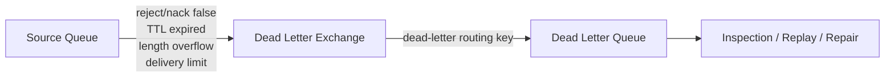
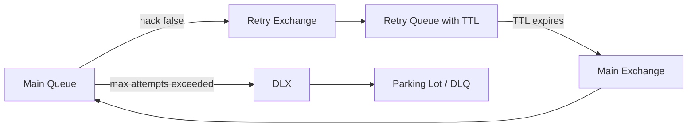
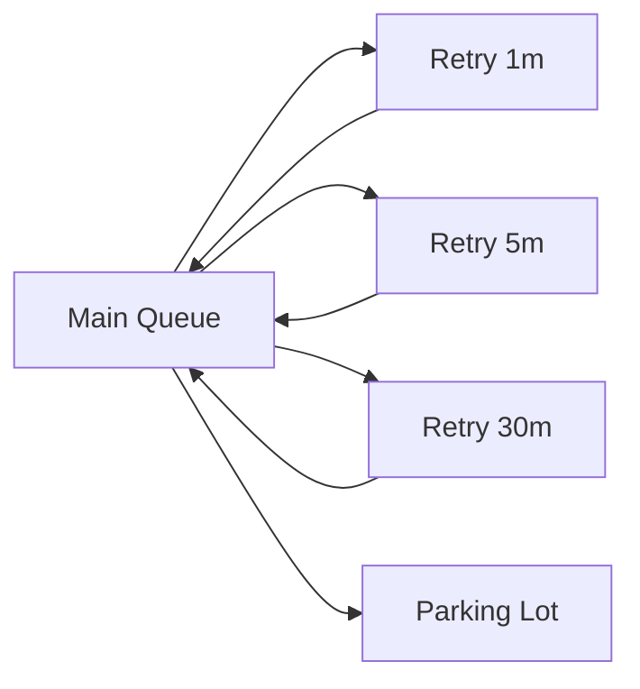

# TTL, Expiration, and Dead Lettering

## 1. Core idea

TTL dan expiration menjawab pertanyaan:

```text
Berapa lama message atau queue boleh hidup sebelum dianggap tidak lagi valid?
```

Dead-lettering menjawab pertanyaan:

```text
Jika message keluar dari jalur normal processing, ke mana message harus dipindahkan?
```

Dalam RabbitMQ production system, TTL dan DLX sering dipakai untuk:

```text
message expiry
retry delay
queue cleanup
overflow control
poison message isolation
parking lot flow
manual replay preparation
```

Tetapi TTL/DLX bukan sekadar konfigurasi tambahan.

TTL dan DLX mengubah lifecycle message.

Mereka memengaruhi:

```text
correctness
ordering
retry timing
message loss semantics
observability
replay safety
DLQ privacy
publisher expectation
consumer debugging
```

Rule senior engineer:

```text
TTL is a lifecycle rule, not just a timer.
DLX is a controlled failure path, not a trash bin.
```

---

## 2. Why TTL exists

TTL ada karena tidak semua message valid selamanya.

Contoh:

```text
quote recalculation request may expire after newer quote version exists
pricing cache rebuild task may expire after cache already refreshed
notification task may expire after order state changed
approval reminder may expire after approval completed
integration retry may become invalid after downstream state manually repaired
temporary reply queue should disappear after client disconnects
```

Tanpa TTL, queue bisa menjadi tempat penumpukan message lama yang:

```text
no longer relevant
no longer safe
no longer actionable
no longer compliant
no longer useful to replay
```

Namun TTL tidak boleh dipakai untuk menyembunyikan masalah consumer.

Bad pattern:

```text
Consumer lambat → set TTL pendek → message hilang → dashboard terlihat bersih.
```

Correct pattern:

```text
TTL digunakan karena business validity window jelas.
Consumer slowness tetap harus diamati dan ditangani.
```

---

## 3. TTL concepts in RabbitMQ

Ada dua kategori TTL utama:

```text
message TTL
queue TTL / queue expiration
```

### 3.1 Message TTL

Message TTL menentukan berapa lama message boleh berada di queue.

Jika message tinggal di queue lebih lama dari TTL, message akan expired.

Expired message:

```text
will not be delivered to consumers
will not be returned by basic.get
may be discarded
may be dead-lettered if DLX is configured
```

Message TTL bisa dikonfigurasi melalui:

```text
queue policy
queue declaration argument
per-message expiration property
```

### 3.2 Queue TTL / queue expiration

Queue TTL menentukan berapa lama queue boleh tidak digunakan sebelum queue otomatis dihapus.

Ini berbeda dari message TTL.

Queue expiration cocok untuk:

```text
temporary queues
exclusive callback queues
short-lived reply queues
non-durable transient classic queues
```

Queue expiration tidak cocok untuk:

```text
business queue durable
order processing queue
approval task queue
integration command queue
DLQ
parking lot queue
```

---

## 4. Message TTL vs queue TTL

| Concern | Message TTL | Queue TTL |
|---|---|---|
| Mengatur umur apa? | Message di dalam queue | Queue object |
| Jika expired | Message tidak diproses normal | Queue dihapus |
| Cocok untuk | Retry delay, stale task, temporary validity | Temporary queue, callback queue |
| Berisiko jika salah | Message hilang/masuk DLQ tanpa diproses | Queue hilang bersama message |
| Biasanya untuk durable business queue? | Bisa, jika business-validity jelas | Hampir selalu tidak |

Mental model:

```text
message TTL = expiry of work/data
queue TTL   = expiry of container
```

---

## 5. Per-queue message TTL

Per-queue message TTL berarti semua message di queue memiliki batas umur yang sama.

Contoh policy-style concept:

```bash
rabbitmqctl set_policy quote_task_ttl "^quote\.task\." \
  '{"message-ttl":600000}' \
  --apply-to queues
```

Artinya:

```text
message boleh berada di matching queue maksimal 600000 ms = 10 menit
```

Keuntungan policy:

```text
can be changed without redeploying application
can be reviewed by platform/SRE
can be applied consistently across queues
can be controlled by operator policy
```

Risiko hardcoded x-arguments:

```text
requires application redeploy to change
can drift across services
can conflict with policy
can hide broker topology rules inside app code
```

Senior preference:

```text
Use policy for broker lifecycle rules unless application-specific declaration is explicitly owned and reviewed.
```

---

## 6. Per-message expiration

Publisher juga bisa menentukan expiration per message.

Java-style concept:

```java
AMQP.BasicProperties props = new AMQP.BasicProperties.Builder()
    .contentType("application/json")
    .deliveryMode(2)
    .messageId(messageId)
    .correlationId(correlationId)
    .expiration("300000") // milliseconds as string
    .build();

channel.basicPublish(exchange, routingKey, true, props, payload);
```

Per-message expiration cocok jika setiap message punya validity window berbeda.

Contoh:

```text
quote pricing request expires when quote version becomes stale
payment reminder expires at due-date boundary
inventory reservation expires after reservation window
approval notification expires after SLA window
```

Namun per-message expiration punya risiko:

```text
publisher must compute expiry correctly
clock expectation must be understood
expired messages may still occupy resources until eligible for removal
business validity can become hidden in producer code
```

Checklist:

```text
Is expiration business-driven or technical?
Is the value documented?
Can operations see why message expired?
Is the same value used consistently by all producers?
What happens to expired messages?
```

---

## 7. TTL unit and value discipline

RabbitMQ TTL values are expressed in milliseconds.

Common production mistakes:

```text
setting 60 expecting seconds but meaning 60 milliseconds
setting 60000 expecting 60 minutes but meaning 60 seconds
setting value from config in seconds without conversion
using string expiration with invalid format
using extremely large TTL without business reason
using TTL 0 accidentally
```

Use explicit config naming:

```yaml
rabbitmq:
  quoteTaskMessageTtlMillis: 600000
  retryDelayMillis: 30000
  replyQueueExpiresMillis: 300000
```

Avoid ambiguous config:

```yaml
rabbitmq:
  ttl: 60
```

Better Java naming:

```java
Duration quoteTaskTtl = Duration.ofMinutes(10);
String expirationMillis = Long.toString(quoteTaskTtl.toMillis());
```

Rule:

```text
Never let raw TTL numbers travel through production code without units in the name.
```

---

## 8. Dead-lettering triggers

A message can be dead-lettered when it exits the normal queue path because of specific broker/consumer conditions.

Common triggers:

```text
consumer basic.reject with requeue=false
consumer basic.nack with requeue=false
message TTL expiration
queue length limit overflow
quorum queue delivery limit exceeded
```

Important distinction:

```text
queue expiration does not dead-letter all messages in the queue
```

If the queue itself expires, the queue is removed.

Do not confuse:

```text
message expired → message may be dead-lettered
queue expired   → queue removed; messages are not treated as normal DLX flow
```

---

## 9. Dead-letter exchange mental model

DLX is not a special queue.

DLX is a normal exchange used as the target when RabbitMQ dead-letters a message.

Flow:



This means DLX still follows normal RabbitMQ routing rules:

```text
exchange type matters
routing key matters
bindings matter
permissions matter
destination queue existence matters
```

If DLX routing is wrong, dead-lettered messages can become unroutable.

That is not a minor config bug.

It can become message loss depending on broker behavior and topology.

---

## 10. DLX configuration

DLX can be configured using queue policy or queue declaration arguments.

Recommended direction for enterprise systems:

```text
Prefer policies for dead-letter exchange and dead-letter routing key.
Use queue declaration arguments only if application owns topology explicitly and changes are controlled.
```

Policy-style concept:

```bash
rabbitmqctl set_policy quote_task_dlx "^quote\.task\." \
  '{"dead-letter-exchange":"quote.dlx","dead-letter-routing-key":"quote.task.dead"}' \
  --apply-to queues
```

Queue argument-style concept:

```java
Map<String, Object> args = new HashMap<>();
args.put("x-dead-letter-exchange", "quote.dlx");
args.put("x-dead-letter-routing-key", "quote.task.dead");

channel.queueDeclare("quote.task.pricing", true, false, false, args);
```

Risk of argument-style topology:

```text
hard to update without redeploy
can conflict across services
can hide operational policy inside app
can prevent platform-level remediation
```

---

## 11. DLX routing key behavior

When dead-lettering a message, RabbitMQ can use:

```text
explicit dead-letter routing key configured on source queue
original message routing key if no dead-letter routing key is configured
```

This matters.

Bad topology:

```text
source queue has DLX but no dead-letter-routing-key
DLX has bindings that do not match original routing key
message is dead-lettered but not routed to expected DLQ
```

Safer topology:

```text
source queue: quote.task.pricing
DLX: quote.dlx
DL routing key: quote.task.pricing.dead
DLQ binding: quote.task.pricing.dead → quote.task.pricing.dlq
```

Design rule:

```text
Do not rely on original routing key for DLX unless it is intentionally part of the DLQ routing model.
```

---

## 12. x-death header

When a message is dead-lettered, RabbitMQ records dead-letter history in headers.

The important AMQP 0-9-1 header is commonly seen as:

```text
x-death
```

It records information such as:

```text
queue
reason
count
exchange
routing-keys
time
```

Use cases:

```text
retry count detection
poison message diagnosis
manual replay decision
DLQ dashboard enrichment
root cause investigation
```

Example conceptual x-death inspection:

```java
@SuppressWarnings("unchecked")
List<Map<String, Object>> deaths =
    (List<Map<String, Object>>) properties.getHeaders().get("x-death");

long deathCount = deaths == null ? 0L : deaths.stream()
    .filter(d -> "quote.task.pricing.retry".equals(asString(d.get("queue"))))
    .map(d -> (Long) d.getOrDefault("count", 0L))
    .findFirst()
    .orElse(0L);
```

Do not treat `x-death` as a perfect business retry counter without review.

It is broker death history, not necessarily your business attempt count.

Better pattern:

```text
Use x-death for broker-level diagnosis.
Use explicit application retry metadata for business-level attempt semantics if required.
```

---

## 13. TTL-based retry topology

TTL is often used to implement delayed retry without immediate requeue.

Concept:



Typical topology:

```text
main exchange
main queue
retry exchange
retry queue with message TTL
retry queue DLX back to main exchange
final DLX
final DLQ / parking lot
```

This avoids immediate requeue loops.

But it introduces ordering risk.

Message A fails and goes to retry queue.

Message B behind it may be processed before A returns.

Therefore:

```text
TTL retry breaks strict ordering unless the entire flow is designed around that break.
```

---

## 14. Fixed-delay retry

Fixed-delay retry uses same retry delay each time.

Example:

```text
main queue → retry queue 30s → main queue → retry queue 30s → main queue
```

Good for:

```text
short transient failures
brief downstream timeout
small operational hiccups
simple processing tasks
```

Bad for:

```text
long outage
rate limiting
external API degradation
poison messages
business validation errors
```

Failure mode:

```text
If downstream is down for 1 hour and retry delay is 30s, the system creates repeated load spikes every 30s.
```

---

## 15. Multi-stage retry

Multi-stage retry uses multiple retry queues with different TTL values.

Example:

```text
retry.1m
retry.5m
retry.30m
parking-lot
```

Flow:



Advantages:

```text
simple to understand
visible in Management UI
natural operational checkpoints
can separate alerting by retry stage
```

Disadvantages:

```text
more topology objects
more bindings
more naming discipline required
routing errors become more likely
harder to change without migration
```

Use only when retry progression is worth the topology complexity.

---

## 16. Delayed message exchange vs TTL retry

RabbitMQ can support delayed messages via plugin if installed.

Compare:

| Concern | TTL retry queue | Delayed exchange plugin |
|---|---|---|
| Requires plugin | No | Yes |
| Visible retry queue | Yes | Not as normal delayed queue model |
| Operational familiarity | High | Depends on team |
| Variable delay per message | Awkward unless multiple queues | Natural |
| Ordering impact | Yes | Also possible |
| Internal support check | Required | Strongly required |

Rule:

```text
Do not assume delayed exchange exists. Verify plugin availability and platform support.
```

Internal verification checklist:

```text
Is rabbitmq_delayed_message_exchange installed?
Is it enabled in all environments?
Is it supported by managed broker/cloud provider?
Is it part of disaster recovery build?
Is it covered by observability and runbook?
```

---

## 17. Queue length limit

Queue length limit controls how many ready messages or bytes a queue may hold.

It can be set by:

```text
policy
operator policy
queue declaration arguments
```

Queue length limit is not about unacked messages.

It applies to ready messages.

Important metrics:

```text
messages_ready
message_bytes_ready
```

Use cases:

```text
protect broker memory/disk
protect low-priority task queues
bound temporary queues
limit runaway publisher impact
```

Danger:

```text
queue length limit can drop or reject messages
```

Never configure max length without deciding business semantics.

Question:

```text
If this queue is full, is it acceptable to drop oldest, reject newest, or dead-letter overflow?
```

---

## 18. Overflow behavior

When queue max length is reached, overflow behavior determines what happens.

Common options:

```text
drop-head
reject-publish
reject-publish-dlx
```

### 18.1 drop-head

Oldest ready message is dropped or dead-lettered.

Risk:

```text
oldest business work disappears first
publisher may not know
ordering assumptions collapse
```

Can be acceptable for:

```text
ephemeral telemetry
best-effort notification
low-value cache invalidation
```

Usually dangerous for:

```text
order command
quote approval
billing event
fulfillment task
customer-impacting integration
```

### 18.2 reject-publish

Newly published message is rejected when queue is full.

With publisher confirms, publisher can receive basic.nack.

This is useful when:

```text
producer must know broker cannot accept more
application can retry later
backpressure should propagate to publisher
```

### 18.3 reject-publish-dlx

Newly published message is rejected and dead-lettered if DLX configured.

This is useful when:

```text
newest rejected message must be inspected
producer should still know publish was rejected
operations need overflow evidence
```

Review carefully.

Overflow is a business decision disguised as broker config.

---

## 19. Expired message and DLX

If message TTL expires and source queue has DLX, the expired message is dead-lettered.

If no DLX is configured, the expired message is discarded.

This is one of the most important production distinctions.

```text
TTL + no DLX = expiry can become silent discard
TTL + DLX    = expiry becomes observable failure path
```

For business-critical flows, prefer:

```text
TTL with DLX
DLQ dashboard
expiry reason visible
manual replay policy
```

But for low-value temporary messages, discard may be acceptable.

Example:

```text
short-lived UI notification task
temporary reply message
best-effort cache refresh
```

Document it.

---

## 20. TTL and ordering

TTL can break ordering in subtle ways.

Scenario:

```text
Queue contains A, B, C.
A expires.
B remains valid.
C remains valid.
```

Consumer may receive B first.

Scenario with retry:

```text
A fails and moves to retry queue for 5 minutes.
B succeeds immediately.
A comes back later.
```

Now processing order is:

```text
B before A
```

If messages represent state transitions for same aggregate, this can be dangerous.

Example:

```text
OrderCreated
OrderCancelled
OrderFulfilled
```

If retry/TTL reorders them, consumer state machine may apply invalid transition.

Mitigation:

```text
per-aggregate ordering queue
single active consumer
state version check
idempotent transition guard
reject stale transition
saga state validation
```

---

## 21. TTL and PostgreSQL/MyBatis/JDBC

RabbitMQ TTL does not know database state.

A message can expire even if DB still needs the work.

A message can remain valid even if DB state has already moved on.

Consumer must validate current state.

Example consumer guard:

```java
@Transactional
public void handleQuotePricingTask(PricingTaskMessage message) {
    Quote quote = quoteMapper.findForUpdate(message.quoteId());

    if (quote == null) {
        throw new PermanentMessageException("Quote not found");
    }

    if (!quote.version().equals(message.quoteVersion())) {
        // Message is stale. Ack safely; do not retry.
        return;
    }

    if (!quote.status().canReprice()) {
        // Business-invalid now; ack or DLQ depending on audit needs.
        return;
    }

    pricingService.recalculate(quote);
}
```

Rule:

```text
TTL limits broker-side waiting time. It does not replace database-side state validation.
```

---

## 22. TTL and outbox

Outbox publisher can set message expiration based on business validity.

But be careful.

If outbox row sits unpublished for too long, publishing an almost-expired message may be useless.

Better pattern:

```text
business event valid until timestamp stored in outbox row
publisher checks validity before publish
publisher marks stale/skipped with reason
message expiration derived from remaining validity window
```

Outbox table example:

```sql
create table message_outbox (
  id uuid primary key,
  aggregate_type text not null,
  aggregate_id text not null,
  message_type text not null,
  payload jsonb not null,
  headers jsonb not null,
  valid_until timestamptz null,
  status text not null,
  attempt_count int not null default 0,
  created_at timestamptz not null default now(),
  published_at timestamptz null,
  skipped_at timestamptz null,
  skip_reason text null
);
```

Publisher logic:

```text
if valid_until != null and now >= valid_until:
    mark skipped: stale before publish
else:
    expiration = valid_until - now
    publish with expiration
```

This prevents stale work from being injected into RabbitMQ.

---

## 23. TTL and inbox

Inbox table helps distinguish:

```text
message expired before processing
message processed successfully
message processed then retried duplicate
message failed permanently
message parked for manual review
```

Consumer-side inbox fields:

```sql
create table message_inbox (
  message_id text primary key,
  message_type text not null,
  source_service text not null,
  aggregate_id text null,
  received_at timestamptz not null default now(),
  processed_at timestamptz null,
  status text not null,
  failure_reason text null,
  death_count int null,
  raw_headers jsonb null
);
```

This is useful when DLQ/replay is involved.

Without inbox, operators may not know whether replaying a DLQ message is safe.

---

## 24. TTL in Kubernetes

Kubernetes changes TTL risk profile because pods restart, scale, and terminate frequently.

Watch for:

```text
consumer rollout pauses consumption
HPA scales down workers
consumer pod stuck in CrashLoopBackOff
network policy blocks broker
CPU throttling slows processing
DB connection pool exhausted after rollout
```

If TTL is too short, routine deployment can expire messages.

Review:

```text
maximum rollout duration
consumer startup time
readiness probe delay
pod termination grace period
prefetch and in-flight drain
maintenance window impact
```

Rule:

```text
TTL must be longer than normal operational pauses unless expiry during maintenance is explicitly acceptable.
```

---

## 25. TTL in cloud/on-prem/hybrid systems

In cloud/on-prem/hybrid deployment, TTL interacts with latency and outage windows.

Examples:

```text
cross-region network delay
on-prem firewall outage
managed broker maintenance
VPN instability
hybrid integration downtime
certificate rotation window
```

If TTL is shorter than expected recovery time, messages expire before downstream can recover.

This may be intended.

But it must be documented.

Internal questions:

```text
What is acceptable business delay?
What is maximum expected broker/client outage?
Should expired messages be replayable?
Should expired messages become DLQ evidence?
Who owns replay after hybrid outage?
```

---

## 26. DLQ is not the same as parking lot

DLQ is a technical dead-letter destination.

Parking lot is an operationally controlled quarantine area.

| Concept | Purpose | Typical owner |
|---|---|---|
| Retry queue | Delay before another attempt | Application/platform |
| DLQ | Message left normal processing | Application owner |
| Parking lot | Human/manual review before replay/repair | Service owner + operations |
| Audit archive | Long-term evidence | Compliance/data governance |

Bad pattern:

```text
Every failed message goes to one shared DLQ named dead.queue.
```

Better pattern:

```text
per-domain/per-service DLQ
clear ownership
message type visible
failure reason visible
replay procedure documented
retention policy defined
```

---

## 27. DLQ replay risk

Replaying DLQ messages is dangerous if done blindly.

Questions before replay:

```text
Was the original failure fixed?
Is message still business-valid?
Was the side effect already applied?
Is consumer idempotent?
Will replay preserve ordering requirements?
Will replay overload downstream?
Does message contain PII that should no longer be processed?
Does replay need approval?
```

Safe replay should include:

```text
sample inspection
dry-run validation if possible
rate limit
batch size control
correlation ID preservation
replay reason
operator identity
audit log
rollback/repair plan
```

Replay is not just moving messages from DLQ to main queue.

Replay is a production change.

---

## 28. TTL failure modes

### 28.1 Silent expiry

```text
Message TTL expires and no DLX is configured.
```

Symptom:

```text
producer says published
consumer never sees message
queue depth remains low
no DLQ evidence
```

Detection:

```text
inspect TTL policies
check DLX configuration
correlate publish logs with consumer absence
check broker metrics for expired/dropped messages if available
```

### 28.2 Retry loop through TTL

```text
Message repeatedly cycles main queue → retry queue → main queue.
```

Symptom:

```text
same message ID appears repeatedly
x-death count increases
consumer logs same failure
retry queue oscillates
```

Fix:

```text
max retry count
parking lot after threshold
permanent failure classification
idempotent consumer
alert on retry count
```

### 28.3 Expired message still visible in queue stats

Some expired messages may remain counted until the broker has opportunity to remove them.

Symptom:

```text
queue depth seems high even though messages should be expired
consumers do not receive them
```

Response:

```text
verify TTL behavior
ensure consumers are online where applicable
avoid assuming queue count means valid work count
```

### 28.4 Queue expired unexpectedly

```text
x-expires applied to durable business queue by mistake
```

Symptom:

```text
queue disappears
bindings missing
publisher unroutable or messages lost
consumer fails on startup
```

Fix:

```text
remove queue expiration from business queues
restore topology from code/GitOps
review policy pattern
add topology drift alert
```

### 28.5 Overflow drops business messages

```text
max-length configured with default drop-head on critical queue
```

Symptom:

```text
old messages disappear during backlog
customers report missing processing
publisher may not see error
```

Fix:

```text
review overflow behavior
use reject-publish or reject-publish-dlx if producer must know
increase capacity or fix consumer bottleneck
```

---

## 29. Production debugging path: message expired suspicion

Use this path:

```text
1. Identify message ID / correlation ID / aggregate ID.
2. Confirm producer publish success and timestamp.
3. Confirm target exchange, routing key, and queue.
4. Inspect queue TTL policies and x-message-ttl.
5. Inspect per-message expiration property.
6. Inspect DLX and dead-letter-routing-key.
7. Inspect DLQ for x-death reason=expired.
8. Check queue length and overflow policy.
9. Check consumer downtime window.
10. Validate business state in PostgreSQL.
11. Decide: replay, repair, ignore stale, or incident.
```

Do not start by replaying.

Start by explaining why expiry happened.

---

## 30. Production debugging path: DLQ growing

Use this path:

```text
1. Identify which DLQ is growing.
2. Group messages by message type.
3. Group by x-death reason.
4. Group by source queue.
5. Check first failure timestamp and spike start.
6. Check consumer deployment changes.
7. Check schema/version mismatch.
8. Check DB/downstream availability.
9. Check retry topology and max attempts.
10. Check whether failures are transient or permanent.
11. Stop unsafe replay.
12. Fix root cause before bulk replay.
```

DLQ growth is not one symptom.

It can mean:

```text
bad deployment
schema breaking change
DB outage
permission error
poison message batch
routing misconfiguration
consumer idempotency bug
privacy/compliance block
```

---

## 31. Java/JAX-RS implication

For JAX-RS services, TTL should be visible in API semantics when request triggers async processing.

Example:

```http
POST /quotes/{quoteId}/pricing-jobs
Idempotency-Key: 1b7d...
```

Response:

```http
202 Accepted
Location: /quotes/{quoteId}/pricing-jobs/{jobId}
```

The API contract should clarify:

```text
accepted does not mean processed
job may expire if not processed within validity window
client should check status endpoint
expired job should map to explicit state, not silent disappearance
```

Status endpoint states:

```text
PENDING
PROCESSING
COMPLETED
FAILED_RETRYABLE
FAILED_PERMANENT
EXPIRED
PARKED
```

If RabbitMQ TTL expires the message, PostgreSQL job state should not remain `PENDING` forever.

Need reconciliation.

---

## 32. Reconciliation job

TTL/DLX systems often need reconciliation.

Example problem:

```text
Database says job=PENDING.
Message expired and moved to DLQ.
No consumer updated job status.
```

Reconciliation job can:

```text
find stale pending jobs
check outbox/inbox/DLQ evidence
mark expired
create repair task
alert owner
```

PostgreSQL query concept:

```sql
select id, aggregate_id, status, created_at
from async_job
where status in ('PENDING', 'PROCESSING')
  and created_at < now() - interval '30 minutes';
```

Rule:

```text
If RabbitMQ is the execution path, PostgreSQL should still be the authoritative state for business-visible workflow status.
```

---

## 33. Security and privacy concern

DLQ often stores the worst data from a privacy perspective:

```text
messages that failed validation
messages with unexpected payloads
messages that could not be processed
messages waiting for manual inspection
messages replayed by operators
```

Review:

```text
Does payload contain PII?
Do headers contain tenant/user/token data?
Who can read DLQ?
How long are DLQ messages retained?
Are DLQ messages exported to logs?
Are replay tools audited?
Can expired messages violate retention policy?
```

Rule:

```text
DLQ access should be at least as restricted as production database access for the same domain data.
```

---

## 34. Observability checklist

Dashboards should show:

```text
main queue ready count
main queue unacked count
retry queue ready count
DLQ ready count
publish rate
deliver rate
ack rate
nack/reject rate
redelivery rate
expired/dead-letter metrics if available
x-death reason grouping if exported
oldest message age
consumer utilization
```

Alerts:

```text
DLQ > 0 for critical queues
DLQ growth rate spike
retry queue age exceeds threshold
oldest message age exceeds TTL expectation
main queue near max-length
publisher basic.nack due to reject-publish
consumer redelivery loop detected
```

Log fields:

```text
message_id
correlation_id
causation_id
message_type
source_service
queue
routing_key
x_death_count
x_death_reason
retry_attempt
aggregate_id
tenant_id
```

---

## 35. Internal verification checklist

For each production queue:

```text
Queue name:
Owner service:
Business purpose:
Queue type:
Durable:
Message TTL:
Queue TTL / expires:
DLX:
Dead-letter routing key:
DLQ:
Retry queues:
Max length:
Max length bytes:
Overflow behavior:
Quorum delivery limit:
Policy source:
Operator policy:
Declared by app or GitOps:
Replay owner:
Retention requirement:
PII classification:
Dashboard link:
Alert link:
Runbook link:
```

Questions to ask internally:

```text
Which TTL values are business-driven vs technical?
Which queues discard expired messages silently?
Which queues dead-letter expired messages?
Which DLQs are actively monitored?
Who is allowed to replay?
How is replay audited?
What is the max safe replay rate?
How are stale DB workflow states reconciled?
```

---

## 36. PR review checklist

When reviewing RabbitMQ TTL/DLX changes, ask:

```text
Is TTL required? Why?
What unit is used?
Is TTL configured by policy or app argument?
What happens when message expires?
Is DLX configured?
Is dead-letter-routing-key explicit?
Is DLQ bound correctly?
Is queue expiry accidentally applied to durable business queue?
Is max-length configured?
What overflow behavior is used?
Will publisher know about reject-publish?
Does TTL break ordering?
Does TTL conflict with retry strategy?
Does consumer validate current DB state?
Is DLQ monitored?
Is replay documented and rate-limited?
Is PII safe in DLQ?
Is there reconciliation for business-visible jobs?
```

Reject the change if:

```text
critical messages can expire silently
queue expiry is applied to durable business queues without explicit reason
DLQ has no owner
replay is undefined
TTL is used to hide slow consumers
max-length drop-head is used on business-critical queues without sign-off
```

---

## 37. Common anti-patterns

### Anti-pattern 1: TTL as incident suppressor

```text
Queue grows during incident.
Team adds short TTL.
Queue looks healthy.
Customers lose processing.
```

Better:

```text
Fix consumer bottleneck.
Use DLQ for expired critical work.
Add visible business status.
```

### Anti-pattern 2: One global DLQ

```text
all.failed.messages
```

Problem:

```text
no ownership
mixed message contracts
mixed privacy levels
unsafe replay
hard triage
```

Better:

```text
per-domain/per-service DLQ with clear routing and ownership
```

### Anti-pattern 3: Blind DLQ replay

```text
Move all messages from DLQ back to main queue.
```

Problem:

```text
replays poison messages
duplicates side effects
overloads downstream
reintroduces ordering issues
```

Better:

```text
sample, classify, fix, rate-limit, audit, monitor
```

### Anti-pattern 4: DLX configured but not bound

```text
source queue has x-dead-letter-exchange
DLX has no binding for dead-letter routing key
```

Problem:

```text
dead-lettered messages become unroutable
```

Better:

```text
topology test verifies DLX routing path
```

### Anti-pattern 5: TTL retry without max attempts

```text
message loops forever through retry queue
```

Better:

```text
bounded attempts + parking lot + alert
```

---

## 38. Senior mental model

TTL, expiration, and DLX are lifecycle controls.

They should be designed with the same seriousness as API contracts or database constraints.

Remember:

```text
TTL says when work becomes invalid.
DLX says where failed work goes.
x-death says how the broker saw failure.
DLQ says what humans must be able to inspect.
Replay says whether the system can safely recover.
```

Good RabbitMQ systems make failure visible, bounded, and recoverable.

Bad RabbitMQ systems make failure disappear until customers notice.

---

## 39. Source references

Use these as primary references when validating implementation details against the RabbitMQ version used internally:

```text
RabbitMQ Time-to-Live and Expiration
https://www.rabbitmq.com/docs/ttl

RabbitMQ Dead Letter Exchanges
https://www.rabbitmq.com/docs/dlx

RabbitMQ Queue Length Limit
https://www.rabbitmq.com/docs/maxlength

RabbitMQ Consumer Acknowledgements and Publisher Confirms
https://www.rabbitmq.com/docs/confirms
```
