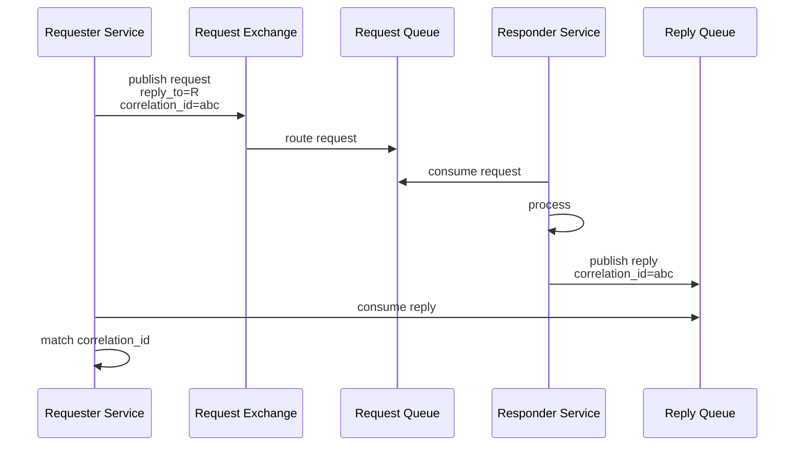
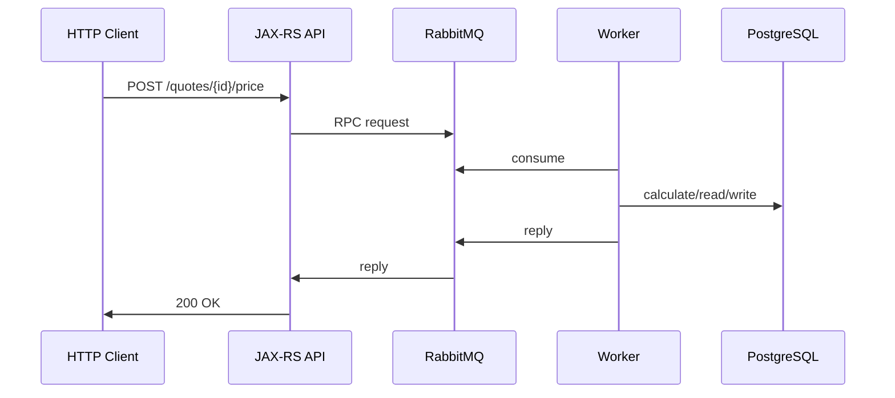

# Request-Reply and RPC Pattern

## 1. Core idea

Request-reply pattern menjawab pertanyaan:

```text
Bagaimana satu service mengirim request melalui RabbitMQ dan menerima response dari service lain?
```

RPC over RabbitMQ menjawab versi yang lebih spesifik:

```text
Bagaimana client memanggil remote operation seolah-olah synchronous function call, tetapi transport-nya message broker?
```

Dalam RabbitMQ, request-reply biasanya memakai:

```text
request queue
reply queue or Direct Reply-To
reply_to property
correlation_id property
timeout
duplicate reply handling
idempotent responder
```

Rule senior engineer:

```text
RPC over RabbitMQ is still distributed messaging. It does not remove latency, failure, duplicate, timeout, or backpressure problems.
```

---

## 2. Why request-reply exists

Request-reply kadang muncul karena service butuh response dari async worker.

Contoh:

```text
calculate quote price and return result
validate order feasibility against downstream system
reserve temporary resource
ask integration adapter to transform/enrich data
execute long-ish computation outside request service
```

RabbitMQ bisa mendukung pattern ini.

Namun pattern ini harus dipakai hati-hati.

Jika user-facing HTTP request menunggu RPC RabbitMQ sampai selesai, maka Anda membuat synchronous chain di atas asynchronous broker.

Itu bisa valid.

Tetapi harus sadar trade-off.

---

## 3. Basic request-reply flow



The critical contract:

```text
reply_to tells responder where to send reply
correlation_id tells requester which request the reply belongs to
```

Without correlation ID, requester cannot safely match replies to requests when multiple requests are in flight.

---

## 4. Request message properties

A request message should include at least:

```text
message_id
correlation_id
reply_to
content_type
message_type
message_version
created_at
source_service
tenant_id if applicable
traceparent if tracing is used
```

Example Java-style concept:

```java
String correlationId = UUID.randomUUID().toString();

AMQP.BasicProperties props = new AMQP.BasicProperties.Builder()
    .contentType("application/json")
    .deliveryMode(2)
    .messageId(UUID.randomUUID().toString())
    .correlationId(correlationId)
    .replyTo(replyQueueName)
    .headers(Map.of(
        "message_type", "quote.pricing.requested.v1",
        "source_service", "quote-api",
        "traceparent", traceparent,
        "tenant_id", tenantId
    ))
    .build();

channel.basicPublish(
    "quote.rpc.exchange",
    "quote.pricing.calculate",
    true,
    props,
    payload
);
```

Important:

```text
correlation_id is not necessarily message_id
message_id identifies this message
correlation_id links request and reply
causation_id can link reply to request message_id
```

---

## 5. Reply message properties

A reply message should include:

```text
message_id
correlation_id copied from request
causation_id = request message_id
content_type
message_type
message_version
status
error_code if failed
created_at
source_service
traceparent or linked trace context
```

Reply payload should be explicit.

Avoid ambiguous reply:

```json
{
  "result": null
}
```

Prefer explicit reply envelope:

```json
{
  "status": "FAILED",
  "errorCode": "QUOTE_VERSION_STALE",
  "message": "Quote version 17 is no longer current",
  "retryable": false
}
```

Or success:

```json
{
  "status": "SUCCEEDED",
  "quoteId": "Q-123",
  "quoteVersion": 18,
  "priceSummaryId": "PS-991"
}
```

---

## 6. Reply queue strategy

There are several reply queue strategies.

| Strategy | Description | Good for | Risk |
|---|---|---|---|
| Per-request queue | Create queue per call | Simple demos | Expensive, metadata churn |
| Per-client exclusive queue | One reply queue per requester instance | Normal RPC clients | Queue lifecycle/reconnect handling |
| Shared reply queue | Many requesters share a queue | Controlled internal framework | Correlation and isolation complexity |
| Direct Reply-To | No real reply queue | High client churn, many clients, low reply durability need | At-most-once reply semantics |
| Durable reply queue | Replies survive requester disconnect | Long-running tasks | Cleanup and stale reply complexity |

Senior default:

```text
Avoid per-request queues in production unless there is a very specific reason.
```

---

## 7. Direct Reply-To

Direct Reply-To is RabbitMQ-specific.

It allows request-reply without creating a dedicated reply queue.

Mental model:

```text
requester consumes special direct reply-to address
responder publishes reply to reply_to value
broker delivers reply directly to requester connection/channel path
no normal reply queue appears in Management UI
```

Benefits:

```text
less queue metadata churn
less queue create/delete overhead
fewer broker resources
useful for many clients or high connection churn
```

Limitations:

```text
reply is not durably buffered
reply can be lost
at-most-once reply semantics
not suitable if reply must survive requester disconnect
not suitable for high-throughput replies to same requester
```

Rule:

```text
Use Direct Reply-To only when losing a reply is acceptable and requester can retry safely.
```

That means the responder operation should be idempotent.

---

## 8. Dedicated callback queue

A conventional pattern is one callback queue per requester instance.

Example:

```text
quote-api.instance-42.reply
```

Properties may be:

```text
exclusive=true
auto-delete=true
non-durable
x-expires=some idle timeout
```

For long-running tasks, it may be:

```text
durable=true
exclusive=false
auto-delete=false
explicit retention/cleanup
```

Trade-off:

```text
Exclusive auto-delete queue is simple but replies can disappear after requester disconnects.
Durable reply queue buffers replies but needs cleanup, ownership, security, and stale reply handling.
```

Do not pick reply queue durability accidentally.

---

## 9. Correlation ID discipline

Correlation ID is mandatory for RPC.

Requester must maintain an in-flight map:

```text
correlation_id → pending promise/future/request context/deadline
```

When reply arrives:

```text
if correlation_id is known:
    complete corresponding request
else:
    discard or route to unknown-reply handler
```

Unknown replies can happen because:

```text
request timed out and client removed pending entry
duplicate reply arrives
old reply from previous requester instance arrives
buggy responder sent wrong correlation ID
reply queue was shared incorrectly
```

Do not crash reply consumer on unknown correlation ID.

Unknown reply is a signal, not necessarily fatal.

Log it with:

```text
correlation_id
message_id
reply_queue
source_service
message_type
created_at
```

---

## 10. Timeout is part of the contract

Every RPC request needs a deadline.

No timeout means:

```text
thread leak
future leak
HTTP request hang
connection pool exhaustion
memory leak
customer-facing latency incident
```

Timeout must define:

```text
how long requester waits
what response API returns
whether request may still complete later
whether requester retries
whether duplicate request is safe
whether responder must ignore stale work
```

Example config:

```yaml
rabbitmq:
  rpc:
    pricingRequestTimeoutMillis: 2500
    maxInFlightRequests: 500
    unknownReplyLogSampleRate: 0.1
```

Timeout should align with:

```text
HTTP gateway timeout
JAX-RS server timeout
thread pool limits
responder SLA
queue backlog expectations
business tolerance
```

---

## 11. Timeout does not cancel processing

If requester times out, the responder may still process request.

This is one of the most important RPC realities.

Timeline:

```text
T0 requester sends request
T1 responder receives request
T2 requester times out
T3 responder finishes work
T4 responder sends reply
T5 requester discards unknown/late reply
```

If responder changes database state, timeout does not undo it.

Therefore:

```text
RPC request must be idempotent
business operation must have request ID/idempotency key
state transition must reject duplicates
late reply must be safe
```

For JAX-RS, do not tell the caller:

```text
operation failed
```

when what actually happened is:

```text
operation status unknown
```

Better HTTP mapping:

```http
202 Accepted
Location: /operations/{operationId}
```

or:

```http
504 Gateway Timeout
```

with explicit statement:

```text
Processing status is unknown. Use operation status endpoint.
```

---

## 12. Duplicate request scenario

Duplicate processing can happen.

Example race:

```text
Responder sends reply.
Responder crashes before acking request.
RabbitMQ redelivers request.
Responder processes again.
Requester may receive duplicate replies.
```

This is why responder must be idempotent.

Responder-side idempotency table:

```sql
create table rpc_request_dedup (
  request_id text primary key,
  operation_type text not null,
  aggregate_id text not null,
  status text not null,
  result_payload jsonb null,
  error_payload jsonb null,
  created_at timestamptz not null default now(),
  completed_at timestamptz null
);
```

Responder flow:

```text
begin transaction
insert request_id if not exists
if already completed: return stored result
if in progress: decide wait/reject/return conflict
perform business change idempotently
store result
commit
publish reply
ack request
```

This is effectively inbox/idempotent consumer applied to RPC.

---

## 13. Duplicate reply scenario

Requester must handle duplicate replies.

If first reply completed pending request, second reply may arrive after pending entry removed.

Policy:

```text
unknown correlation ID → log and discard
known correlation ID completed → ignore duplicate
known correlation ID active → complete once atomically
```

Java-style concept:

```java
CompletableFuture<RpcReply> future = pending.remove(reply.getCorrelationId());

if (future == null) {
    log.warn("Unknown or duplicate RPC reply correlationId={}", reply.getCorrelationId());
    return;
}

future.complete(reply);
```

Do not complete the same request twice.

Do not treat duplicate reply as proof of duplicate business effect.

It is evidence to investigate.

---

## 14. Lost reply scenario

Reply can be lost because:

```text
requester disconnected
exclusive reply queue deleted
Direct Reply-To drop
reply queue expired
reply unroutable
responder failed before publish
responder published reply but publish was not confirmed
network failure
permission issue
```

Requester sees:

```text
timeout
```

Timeout does not distinguish:

```text
request never processed
request processed but reply lost
request processing slow
request stuck in queue
responder failed
reply unroutable
```

Therefore, for business-critical operations, use operation state persisted in database.

```text
message transport reply is convenience
business status endpoint is source of truth
```

---

## 15. Request ack timing

Responder has to decide when to ack request.

Bad pattern:

```java
basicAck(deliveryTag, false);
processRequest();
publishReply();
```

Risk:

```text
request lost if responder crashes after ack before processing
```

Better pattern:

```text
process idempotently
persist result/state
publish reply with confirms if needed
ack request
```

But even this has a crash window.

Scenario:

```text
business state committed
reply published
responder crashes before ack
request redelivered
```

This is why idempotency is required.

No ack ordering fully eliminates all distributed failure windows.

---

## 16. Reply publish reliability

If reply matters, responder should treat reply publishing seriously.

Questions:

```text
Is reply persistent?
Is reply queue durable?
Are publisher confirms enabled for reply?
Is mandatory flag used?
What happens if reply is unroutable?
Can requester recover through status endpoint?
```

For Direct Reply-To, reply durability is intentionally not the goal.

For durable reply queues, consider publisher confirms and mandatory flag.

Responder flow concept:

```text
process request
persist result
publish reply with correlation_id
wait for confirm or bounded timeout
ack request
```

If reply publish fails after business commit:

```text
requester may timeout
business operation may have succeeded
status endpoint or stored result must resolve ambiguity
```

---

## 17. Synchronous API over async broker

A JAX-RS endpoint can call RabbitMQ RPC and wait.

But this has consequences.



This turns RabbitMQ into a middle layer in a synchronous path.

Risk:

```text
queue backlog becomes HTTP latency
worker slowdown becomes API timeout
broker issue becomes customer-facing outage
retry can duplicate side effects
thread pool waits on broker
API autoscaling can cause RPC in-flight explosion
```

Use only when:

```text
latency is bounded
responder is highly available
operation is idempotent
backpressure is enforced
timeouts are explicit
fallback/status path exists
```

---

## 18. Prefer 202 for long-running work

For long-running operation, prefer asynchronous API contract.

HTTP request:

```http
POST /quotes/Q-123/pricing-jobs
Idempotency-Key: 6a2c8...
```

Response:

```http
202 Accepted
Location: /quotes/Q-123/pricing-jobs/J-9001
```

Then RabbitMQ handles background work.

Client polls:

```http
GET /quotes/Q-123/pricing-jobs/J-9001
```

This is often better than RabbitMQ RPC when:

```text
processing takes seconds/minutes
customer can tolerate async state
business status matters
operation may need retry/manual repair
responder depends on external system
workflow can be stuck/expired/parked
```

RabbitMQ RPC is not a replacement for async API design.

---

## 19. When RPC over RabbitMQ is acceptable

RPC can be acceptable when:

```text
operation is short
latency budget is clear
requester and responder are internal services
responder is horizontally scalable
operation is idempotent
response is small
failure maps cleanly to timeout/unknown status
reply loss is acceptable or recoverable
backpressure is controlled
team has observability and runbook
```

Examples:

```text
internal validation with bounded SLA
short computation delegated to worker pool
non-critical enrichment with fallback
control-plane request with small payload
```

Even then, document it.

---

## 20. When HTTP/gRPC is better

HTTP/gRPC is usually better when:

```text
requester needs immediate synchronous response
operation is naturally request/response
service discovery/load balancing already exists
standard status/error mapping matters
streaming response is needed
deadline propagation is first-class
traffic should be visible to API gateway/service mesh
```

RabbitMQ RPC adds:

```text
queueing semantics
broker dependency
reply routing complexity
correlation map
unknown timeout state
duplicate reply handling
harder debugging
```

If you need RPC, ask:

```text
Why not HTTP/gRPC?
What does RabbitMQ add here?
```

Valid RabbitMQ answers might be:

```text
workload needs buffering
responder availability is intermittent
request must be load-distributed to workers
requester should not know responder location
system already has queue-based task model
```

---

## 21. When Kafka is not a replacement for RabbitMQ RPC

Kafka is log-oriented, not request-reply broker-oriented.

You can build request-reply over Kafka, but it requires:

```text
request topic
reply topic
correlation ID
consumer group handling
reply partition strategy
timeout
duplicate handling
compaction/retention decisions
```

RabbitMQ is often more natural when:

```text
request should be distributed to one worker
reply should go to one requester
routing key matters
low-latency queue dispatch matters
request should not be replayed as a log event
```

But RabbitMQ RPC still needs correctness design.

---

## 22. Backpressure and in-flight limit

Requester must limit concurrent RPC calls.

Without limit:

```text
HTTP traffic spike creates thousands of pending RPC futures
reply queue grows
responder queue grows
JAX-RS threads block
memory grows
timeouts cascade
retry storm begins
```

Use:

```text
max in-flight RPC per instance
bounded executor
bulkhead per downstream operation
timeout
circuit breaker
rate limiter
queue depth guard
```

Java-style concept:

```java
if (!rpcLimiter.tryAcquire()) {
    throw new ServiceUnavailableException("RPC capacity exhausted");
}

try {
    return rpcClient.call(request, timeout);
} finally {
    rpcLimiter.release();
}
```

HTTP mapping:

```http
503 Service Unavailable
Retry-After: 5
```

Do not let RabbitMQ become an unbounded waiting room for synchronous requests.

---

## 23. Consumer prefetch for RPC responder

RPC responder prefetch controls how many requests each worker can hold unacked.

If prefetch is too high:

```text
one responder instance hoards requests
latency becomes uneven
shutdown duplicates more in-flight work
slow worker delays requests while others idle
```

If prefetch is too low:

```text
throughput may be underutilized
broker round-trip overhead increases
```

For RPC, start conservative:

```text
prefetch = worker concurrency
or prefetch = small multiple of concurrency
```

Tune based on:

```text
request processing time
CPU-bound vs IO-bound
DB connection pool
external API rate limit
response latency SLO
```

---

## 24. Consumer cancellation and requester cleanup

Requester reply consumer can be cancelled because:

```text
channel closed
connection dropped
reply queue deleted
permission revoked
broker failover
pod shutdown
```

On cancellation:

```text
fail all pending requests with unknown status
stop accepting new RPC calls
trigger reconnect/redeclare if applicable
surface health/readiness degraded
```

Do not leave pending futures waiting forever.

Responder consumer cancellation:

```text
stop accepting request deliveries
finish or abort in-flight work according to shutdown policy
ack/nack safely
publish replies if possible
```

In Kubernetes, hook this into graceful shutdown.

---

## 25. Kubernetes impact

RabbitMQ RPC in Kubernetes has specific failure modes:

```text
API pod terminated while waiting for replies
responder pod terminated after processing before ack
rolling update creates duplicate processing
HPA scales requester faster than responder
reply queue tied to pod identity disappears
DNS/LB reconnect changes connection path
CPU throttling causes timeout spikes
```

Review:

```text
terminationGracePeriodSeconds
preStop hook
readiness gate during RabbitMQ reconnect
pending request drain on shutdown
consumer cancellation handling
max in-flight during rollout
reply queue naming per pod instance
```

Rule:

```text
A pod lifecycle event must not become an uncontrolled RPC duplicate storm.
```

---

## 26. PostgreSQL consistency

RPC responder often touches PostgreSQL.

Never rely on RabbitMQ timeout as source of truth for DB state.

Pattern:

```text
request_id / idempotency_key
operation table
business transaction
stored result
reply after commit
status endpoint
```

Operation table example:

```sql
create table quote_operation (
  operation_id uuid primary key,
  quote_id text not null,
  operation_type text not null,
  idempotency_key text not null,
  status text not null,
  result jsonb null,
  error jsonb null,
  created_at timestamptz not null default now(),
  completed_at timestamptz null,
  unique (quote_id, operation_type, idempotency_key)
);
```

JAX-RS flow:

```text
create operation row
publish request
wait for reply optionally
if reply arrives: return result
if timeout: return 202/unknown with status link
```

This handles late completion cleanly.

---

## 27. Error mapping

Responder errors should be explicit.

Classify:

```text
VALIDATION_FAILED
NOT_FOUND
VERSION_CONFLICT
DOWNSTREAM_TIMEOUT
DOWNSTREAM_UNAVAILABLE
RATE_LIMITED
INTERNAL_ERROR
```

Reply should include:

```json
{
  "status": "FAILED",
  "errorCode": "VERSION_CONFLICT",
  "retryable": false,
  "message": "Quote version is stale"
}
```

Requester maps errors to HTTP carefully:

| RPC reply | HTTP mapping | Notes |
|---|---:|---|
| Business validation failed | 400/409 | Depends on API contract |
| Not found | 404 | If resource visible to caller |
| Version conflict | 409 | Good for state transition conflict |
| Downstream timeout | 202/504/503 | Depends whether processing may continue |
| Responder unavailable | 503 | Usually retryable |
| Request timeout unknown | 202 or 504 with status link | Do not claim rollback |

Avoid:

```text
RPC timeout → 500 Internal Server Error
```

That hides ambiguity.

---

## 28. Security considerations

RPC request/reply queues need permission design.

Check:

```text
who can publish request
who can consume request
who can publish reply
who can consume reply
whether reply queue name leaks service identity
tenant isolation
PII in reply payload
headers with actor/tenant/token data
```

For shared reply queues:

```text
one service might see another service's reply if permissions/topology are wrong
```

For Direct Reply-To:

```text
reply path does not appear as normal queue in Management UI
observability and audit expectations differ
```

Rule:

```text
RPC replies often contain direct business results; secure them like API responses.
```

---

## 29. Observability

Requester metrics:

```text
rpc_requests_sent_total
rpc_replies_received_total
rpc_timeouts_total
rpc_unknown_replies_total
rpc_duplicate_replies_total
rpc_in_flight
rpc_latency_ms
rpc_publish_failures_total
rpc_unroutable_requests_total
```

Responder metrics:

```text
rpc_requests_received_total
rpc_requests_processed_total
rpc_processing_latency_ms
rpc_business_failures_total
rpc_system_failures_total
rpc_replies_published_total
rpc_reply_publish_failures_total
rpc_request_redeliveries_total
```

Broker metrics:

```text
request queue depth
request queue unacked
reply queue depth if applicable
consumer count
redelivery rate
publish/deliver/ack rate
connection/channel count
```

Logs must include:

```text
correlation_id
request_message_id
reply_message_id
operation_id
quote_id/order_id if applicable
tenant_id
request_queue
reply_to
responder_service
status
error_code
latency_ms
```

---

## 30. Tracing

Distributed tracing should show:

```text
HTTP request span
RabbitMQ publish span
request queue wait span if measurable
responder consume span
DB span
reply publish span
reply consume span
HTTP response span
```

Trace context propagation:

```text
traceparent header
correlation_id
causation_id
message_id
source_service
```

Do not confuse:

```text
trace ID: observability correlation
correlation ID: message request/reply matching
business operation ID: domain-level operation identity
idempotency key: duplicate request protection
```

They may share values in some systems, but they have different meanings.

---

## 31. Request-reply in CPQ/order management context

Use cases where RabbitMQ request-reply might appear conceptually:

```text
quote pricing calculation
quote validation
order decomposition check
approval eligibility check
fulfillment feasibility query
integration adapter enrichment
```

Be careful with order/quote state.

If request-reply changes state, duplicate processing can violate invariants.

Examples:

```text
double price calculation writes two price summaries
duplicate order reservation creates duplicated downstream request
late approval reply applies to obsolete quote version
lost reply causes UI to retry and trigger duplicate command
```

Mitigation:

```text
quote/order version in message
operation ID
idempotency key
state transition guard
stored result
status endpoint
late reply handling
```

---

## 32. Internal verification checklist

For every RabbitMQ RPC/request-reply flow, verify:

```text
Requester service:
Responder service:
Request exchange:
Request routing key:
Request queue:
Reply mechanism: queue / Direct Reply-To / shared reply queue
Reply queue durability:
Reply queue exclusivity:
Reply queue auto-delete:
Reply queue expires:
Correlation ID standard:
Message ID standard:
Timeout value:
Max in-flight requests:
Publisher confirm for request:
Mandatory flag for request:
Reply publish reliability:
Responder ack timing:
Responder idempotency:
Duplicate reply handling:
Unknown reply handling:
Late reply handling:
Status endpoint:
Operation table:
DLQ for request queue:
Retry strategy:
Observability dashboard:
Alerting:
Runbook:
Security permissions:
PII classification:
```

Internal questions:

```text
Why RabbitMQ RPC instead of HTTP/gRPC?
What happens if requester times out but responder succeeds?
What happens if responder sends reply but crashes before ack?
What happens if reply is lost?
Can operation be safely retried?
Can reply be safely duplicated?
Can stale reply mutate current quote/order state?
```

---

## 33. PR review checklist

When reviewing RabbitMQ RPC code, ask:

```text
Is request-reply actually needed?
Is HTTP/gRPC more appropriate?
Is operation short and bounded?
Is timeout explicit?
Is max in-flight bounded?
Is correlation ID mandatory?
Does requester handle unknown replies?
Does requester handle duplicate replies?
Does responder preserve correlation ID?
Does responder ack after safe processing?
Is responder idempotent?
Is reply publish reliable enough?
Is Direct Reply-To acceptable given at-most-once replies?
Is reply queue lifecycle correct?
Is there a status endpoint for unknown outcomes?
Are errors classified explicitly?
Are metrics/logs/traces sufficient?
Is Kubernetes shutdown handled?
Is security permission least-privilege?
```

Reject or redesign if:

```text
RPC timeout is treated as guaranteed failure
operation is not idempotent
reply loss is unacceptable but Direct Reply-To is used
unbounded in-flight requests are allowed
reply queue is created per request in high-volume path
correlation ID is optional
unknown replies crash the client
JAX-RS thread pool can be exhausted by waiting for broker replies
```

---

## 34. Common anti-patterns

### Anti-pattern 1: RabbitMQ RPC as hidden HTTP

```text
Service A calls RabbitMQ RPC to Service B for every HTTP request.
No queueing benefit. No async benefit. More failure modes.
```

Better:

```text
Use HTTP/gRPC unless broker semantics add real value.
```

### Anti-pattern 2: No timeout

```text
Requester waits forever.
```

Better:

```text
bounded timeout + cleanup + status path
```

### Anti-pattern 3: Timeout means rollback

```text
Requester times out and tells client operation failed.
Responder later commits successfully.
```

Better:

```text
unknown status semantics + operation status endpoint
```

### Anti-pattern 4: Non-idempotent responder

```text
Redelivery causes duplicate business side effects.
```

Better:

```text
operation ID + idempotency table + stored result
```

### Anti-pattern 5: Per-request reply queue at scale

```text
Each API request declares and deletes a reply queue.
```

Better:

```text
per-client reply queue or Direct Reply-To when semantics fit
```

### Anti-pattern 6: Missing correlation ID

```text
Reply consumer assumes one request at a time.
```

Better:

```text
mandatory correlation ID + in-flight map
```

---

## 35. Decision framework

Use RabbitMQ request-reply only if the answers are acceptable.

```text
Does broker queueing provide value?
Is responder decoupling needed?
Can requester tolerate timeout ambiguity?
Can operation be idempotent?
Can duplicate replies be ignored safely?
Can lost replies be recovered through status query?
Is in-flight bounded?
Is queue backlog observable?
Is security model clear?
Is runbook available?
```

If most answers are no, use HTTP/gRPC or async 202 workflow.

---

## 36. Senior mental model

Request-reply over RabbitMQ is not wrong.

But it is frequently overused.

The strongest senior-level distinction:

```text
RabbitMQ is excellent at distributing work.
RabbitMQ is not magic for synchronous certainty.
```

If you use RPC over RabbitMQ, design for:

```text
timeout
duplicate request
duplicate reply
lost reply
late reply
request redelivery
reply unroutable
requester crash
responder crash
broker failover
queue backlog
idempotent state transition
```

Good request-reply design makes ambiguity explicit.

Bad request-reply design hides ambiguity behind a method call.

---

## 37. Source references

Use these as primary references when validating implementation details against the RabbitMQ version used internally:

```text
RabbitMQ Direct Reply-To
https://www.rabbitmq.com/docs/direct-reply-to

RabbitMQ Tutorial: Remote Procedure Call
https://www.rabbitmq.com/tutorials/tutorial-six-python

RabbitMQ Consumer Acknowledgements and Publisher Confirms
https://www.rabbitmq.com/docs/confirms

RabbitMQ Queues
https://www.rabbitmq.com/docs/queues
```
