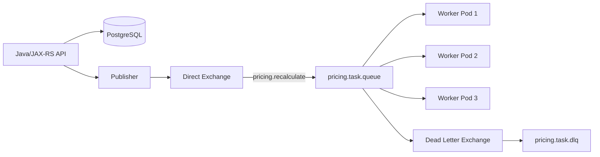
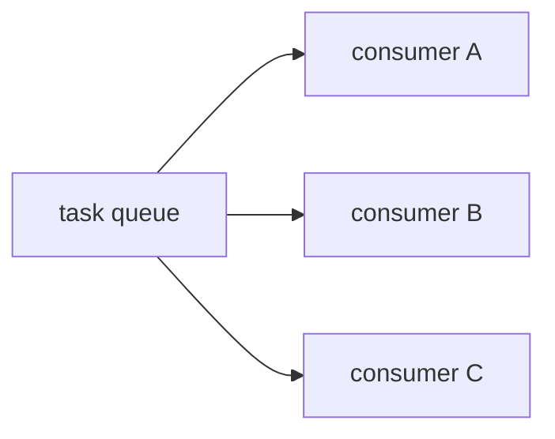
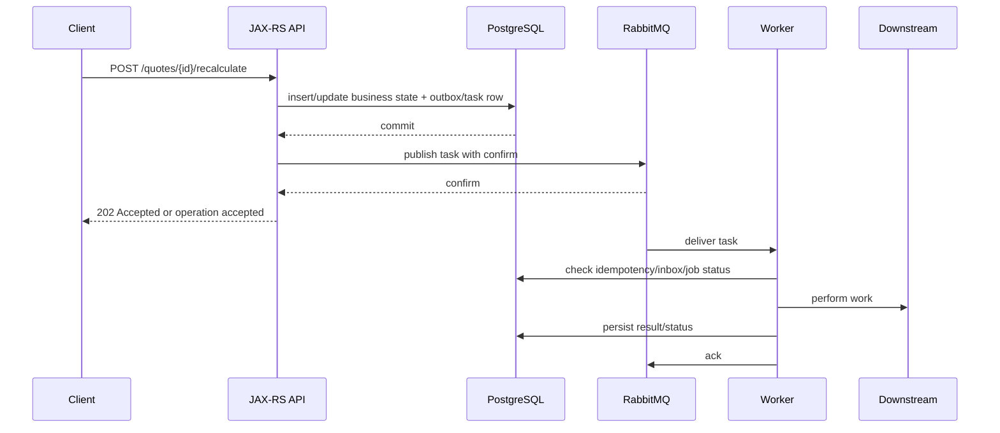
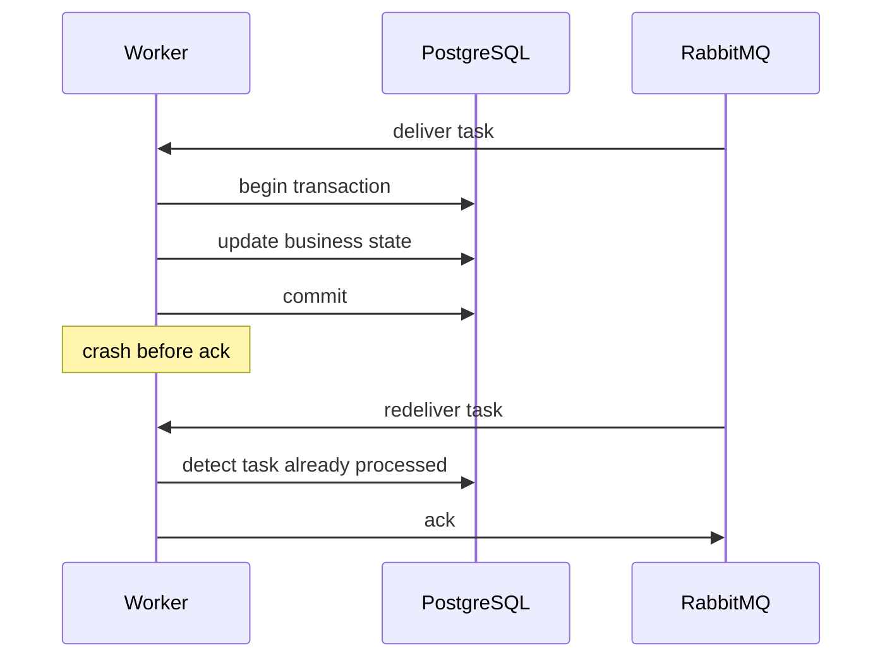
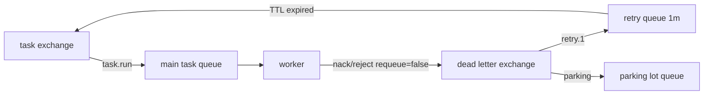

# Work Queue and Task Distribution Pattern

## 1. Core idea

Work queue pattern menjawab pertanyaan:

```text
Bagaimana satu pekerjaan asynchronous dibagikan ke salah satu worker yang tersedia?
```

Bukan ke semua consumer.

Bukan untuk event broadcast.

Bukan untuk event replay.

Work queue adalah pattern untuk membagi beban kerja.

```text
producer -> task queue -> one of many workers
```

Contoh mental model:

```text
Ada 10.000 pricing recalculation task.
Ada 20 worker pod.
Setiap task cukup diproses oleh satu worker.
RabbitMQ mendistribusikan task ke worker berdasarkan delivery availability, prefetch, dan acknowledgement.
```

Dalam RabbitMQ, work queue biasanya memakai:

```text
one durable queue
multiple competing consumers
manual acknowledgement
prefetch
retry/DLQ
idempotency key
worker metrics
```

Rule senior engineer:

```text
A work queue is not just a queue. It is a controlled execution boundary.
```

Jika execution boundary tidak jelas, queue akan berubah menjadi tempat menyembunyikan latency, overload, duplicate side effect, dan operational debt.

---

## 2. Why work queues exist

Work queue ada karena tidak semua pekerjaan cocok diselesaikan dalam request-response path.

Contoh pekerjaan yang sering cocok:

```text
send notification
calculate quote price asynchronously
generate document
sync downstream order status
call slow integration endpoint
rebuild cache
process fallout task
perform enrichment
run validation batch
publish derived event
```

Alasan utama memakai work queue:

```text
1. Decouple HTTP latency from background processing.
2. Smooth traffic spikes.
3. Limit concurrency against downstream systems.
4. Retry transient failures safely.
5. Distribute work across worker replicas.
6. Protect user-facing services from slow jobs.
7. Make work observable as queue depth and processing rate.
```

Namun work queue bukan magic.

Ia hanya memindahkan problem dari synchronous path ke asynchronous execution system.

Problem tetap ada:

```text
timeout
duplicate processing
partial failure
poison task
slow downstream
queue growth
worker crash
retry storm
out-of-order side effect
operator replay mistake
```

---

## 3. Work queue versus pub/sub

Perbedaan paling penting:

| Pattern | Tujuan | Delivery target |
|---|---|---|
| Work queue | Membagi pekerjaan | Satu worker memproses satu task |
| Pub/sub | Menyebar event | Banyak subscriber menerima copy event |
| Request-reply | Mendapat response | Requester menunggu reply |
| Event streaming | Retain dan replay event | Consumer membaca log berdasarkan offset |

Work queue:

```text
message A -> worker 1
message B -> worker 2
message C -> worker 3
```

Pub/sub:

```text
event A -> subscriber queue 1
event A -> subscriber queue 2
event A -> subscriber queue 3
```

Kesalahan umum:

```text
Menggunakan satu shared work queue untuk event yang seharusnya diterima semua service.
```

Akibatnya:

```text
hanya salah satu service menerima event
subscriber lain tidak pernah tahu event terjadi
data menjadi inconsistent
incident sulit ditelusuri karena topology terlihat "aktif" tetapi semantic salah
```

---

## 4. RabbitMQ primitives for work queue

Primitive minimal:

```text
exchange
routing key
queue
consumer
manual ack
prefetch
DLX/DLQ
```

Topology sederhana:



Biasanya work queue memakai direct exchange atau default exchange.

Namun untuk enterprise topology, direct exchange eksplisit lebih mudah direview daripada default exchange implicit.

Contoh naming:

```text
exchange: quote.task.x
queue: quote.pricing.recalculate.q
routing key: quote.pricing.recalculate
DLX: quote.task.dlx
DLQ: quote.pricing.recalculate.dlq
```

Internal team boleh punya convention berbeda.

Yang penting:

```text
name reveals ownership, purpose, and operational responsibility
```

---

## 5. Competing consumers

Competing consumers berarti beberapa consumer membaca dari queue yang sama.



Setiap message dikirim ke salah satu consumer.

Ini memberi horizontal scalability.

Namun juga membawa konsekuensi:

```text
processing order tidak dijamin secara global saat ada multiple consumers
side effect harus idempotent
worker harus aman terhadap duplicate delivery
prefetch harus dituning
DB/downstream capacity harus diperhitungkan
```

Rule:

```text
If you add consumer replicas, you also increase pressure on every downstream dependency.
```

Jika queue consumer memanggil PostgreSQL, Redis, HTTP downstream, atau external BSS/OSS system, scaling worker tidak boleh hanya dilihat dari RabbitMQ metric.

Harus dilihat dari seluruh execution chain.

---

## 6. Lifecycle of a task message

Task lifecycle yang sehat:



Critical points:

```text
1. Task creation must be durable.
2. Publish success must be known, or recovered via outbox.
3. Worker must not ack before durable side effect.
4. Duplicate delivery must not corrupt state.
5. Failure must go to retry or DLQ with enough metadata.
6. Job status must be observable outside RabbitMQ.
```

RabbitMQ tells you whether a message is queued, ready, unacked, dead-lettered, or redelivered.

RabbitMQ does not know whether your business job is semantically complete.

That belongs in your application state.

---

## 7. Task message contract

A task message should not be random JSON dumped into a queue.

Minimum recommended fields:

```json
{
  "messageId": "msg-123",
  "taskId": "task-456",
  "taskType": "quote.pricing.recalculate",
  "taskVersion": 1,
  "tenantId": "tenant-001",
  "quoteId": "quote-789",
  "requestedBy": "user-123",
  "requestedAt": "2026-07-11T10:15:30Z",
  "idempotencyKey": "quote-789:pricing:v7",
  "correlationId": "corr-abc",
  "causationId": "api-request-xyz",
  "attemptHint": 0,
  "payload": {
    "pricingMode": "FULL_RECALCULATION"
  }
}
```

Headers can carry operational metadata:

```text
message_type
task_type
message_version
correlation_id
causation_id
traceparent
tenant_id
source_service
created_at
retry_count
schema_version
```

Payload should carry business data.

Rule:

```text
Headers help route, trace, diagnose, and operate.
Payload expresses the business command/task.
```

Do not put sensitive data in headers casually.

Headers often appear in logs, dashboards, DLQ inspection tools, and troubleshooting exports.

---

## 8. Task granularity

Bad task design:

```text
processEverythingForCustomer(customerId)
```

Why bad:

```text
unclear duration
hard to retry safely
large blast radius
poor progress visibility
hard to cancel
hard to parallelize safely
```

Better task design:

```text
recalculateQuotePrice(quoteId, pricingVersion)
generateQuoteDocument(quoteId, templateVersion)
syncOrderStatus(orderId, downstreamSystem)
notifyApprovalRequired(approvalTaskId)
```

Good task has:

```text
bounded scope
clear owner
clear idempotency key
clear timeout expectation
clear retry policy
clear business state transition
clear observability signal
```

Rule:

```text
If a task cannot be named precisely, it probably cannot be operated precisely.
```

---

## 9. Durable queue and persistent messages

For production task queues, default assumption:

```text
durable queue
persistent message
publisher confirm
manual consumer ack
DLQ configured
```

Durable queue survives broker restart as a queue definition.

Persistent message can survive restart if it has been written durably according to broker guarantees.

Publisher confirm tells the publisher that the broker accepted the message according to its queue durability/replication path.

Do not confuse:

```text
durable queue != all messages are persistent
persistent message != business task completed
publisher confirm != consumer processed successfully
consumer ack != downstream side effect is correct
```

Each layer has its own guarantee.

---

## 10. Manual acknowledgement discipline

For task processing:

```text
manual ack is the default production choice
```

Basic rule:

```text
ack only after processing result is durably recorded
```

Unsafe:

```java
// unsafe pattern
channel.basicAck(deliveryTag, false);
processTask(payload);
```

If `processTask` crashes after ack, RabbitMQ will not redeliver.

Safer:

```java
try {
    processTaskInsideTransaction(payload);
    channel.basicAck(deliveryTag, false);
} catch (TransientException e) {
    channel.basicNack(deliveryTag, false, false); // send to retry/DLQ topology, depending binding
} catch (PermanentException e) {
    channel.basicReject(deliveryTag, false); // poison/final DLQ
}
```

But even this is simplified.

Real implementation needs:

```text
idempotency
retry classification
logging
metrics
trace propagation
failure headers
transaction boundary
shutdown handling
```

---

## 11. Ack timing and database transaction

Common worker transaction:

```text
1. receive message
2. begin DB transaction
3. insert inbox/processed-message record
4. load/update business state
5. write result/status
6. commit DB transaction
7. ack RabbitMQ delivery
```

Why ack after commit?

```text
If worker crashes before DB commit, RabbitMQ can redeliver.
If worker crashes after DB commit but before ack, RabbitMQ can redeliver, and idempotency must detect already-processed task.
```

This creates the classic at-least-once processing window.



Without idempotency, this window causes duplicate side effect.

With idempotency, this is normal.

---

## 12. Fair dispatch and prefetch

RabbitMQ can deliver multiple messages to a consumer before they are acknowledged.

Prefetch limits how many unacked messages a consumer can hold.

For work queue:

```text
low prefetch -> fairer distribution, lower in-flight risk, possibly lower throughput
high prefetch -> higher throughput, higher memory/in-flight risk, less fair distribution
```

Classic starting point:

```text
prefetch = small multiple of worker concurrency
```

Example:

```text
worker thread pool = 8
prefetch = 8 to 32
```

But there is no universal value.

Tuning depends on:

```text
processing latency
message size
DB transaction cost
downstream rate limit
worker CPU/memory
retry behavior
ordering requirements
```

Rule:

```text
Prefetch is not just a RabbitMQ setting. It is a concurrency contract with your downstream dependencies.
```

---

## 13. Worker concurrency model

Three different concurrency dimensions are often confused:

```text
consumer instances
worker threads
Kubernetes replicas
```

Example:

```text
10 pod replicas
2 consumers per pod
prefetch 20 per consumer
```

Maximum unacked messages:

```text
10 * 2 * 20 = 400 unacked deliveries
```

If each message can start a DB transaction, then your database may see up to 400 in-flight tasks, depending implementation.

This can overload:

```text
PostgreSQL connection pool
MyBatis transaction executor
Redis
HTTP downstream
external API
CPU
memory
```

Always compute total concurrency:

```text
total_inflight = replicas * consumers_per_replica * prefetch_per_consumer
```

Then compare to downstream capacity.

---

## 14. Long-running tasks

Long-running task is not automatically wrong.

But it changes the failure model.

Risks:

```text
consumer crash after partial work
broker sees message unacked for long time
Kubernetes rollout kills worker before completion
HTTP downstream times out
DB transaction held too long
operator cannot tell progress
retry duplicates expensive work
```

Better design:

```text
split task into smaller steps where possible
persist job status/progress
avoid long DB transaction
make each step idempotent
support cancellation via application state
use heartbeat/log progress metrics
avoid holding unacked messages for unbounded time
verify RabbitMQ consumer delivery acknowledgement timeout settings
```

Important distinction:

```text
RabbitMQ manages delivery acknowledgement.
Your application manages business job progress.
```

Do not rely on queue state as the only job status store.

---

## 15. Job timeout

RabbitMQ message delivery does not automatically mean your task has a business timeout.

You need explicit timeout model.

Common timeout layers:

```text
HTTP request timeout
worker processing timeout
external dependency timeout
business SLA timeout
message TTL
retry delay
deadline timestamp in payload
consumer acknowledgement timeout setting at broker/platform level
```

Recommended message field:

```json
{
  "deadlineAt": "2026-07-11T10:30:00Z"
}
```

Worker behavior:

```text
if now > deadlineAt:
    mark task expired/skipped/failed according to business rule
    ack message after durable status update
else:
    process task
```

Do not assume TTL solves business timeout.

TTL only controls message expiration before delivery or in queue, not semantic validity after a worker has started processing.

---

## 16. Job cancellation

RabbitMQ does not provide business-level cancellation of already delivered work.

If a task is unacked and worker is still processing, cancellation must be handled by application logic.

Typical pattern:

```text
1. Store job/task row in PostgreSQL.
2. Mark status = CANCEL_REQUESTED.
3. Worker periodically checks status.
4. Worker stops safely at cancellation checkpoint.
5. Worker writes final status = CANCELLED.
6. Worker ack message.
```

For short tasks, cancellation may be unnecessary.

For long tasks, cancellation must be designed.

Do not implement cancellation by deleting messages from a queue unless you fully understand impact.

Deleting/purging queue is operationally dangerous and affects all messages.

---

## 17. Idempotent job design

A task is idempotent if processing it more than once leads to the same valid business outcome.

Idempotency keys can be based on:

```text
taskId
business aggregate ID + operation type + version
external request ID
outbox event ID
message ID
```

Example:

```text
quoteId + pricingVersion + recalculationType
```

Idempotency table:

```sql
CREATE TABLE processed_task (
    task_id             VARCHAR(128) PRIMARY KEY,
    message_id          VARCHAR(128) NOT NULL,
    task_type           VARCHAR(128) NOT NULL,
    aggregate_id        VARCHAR(128),
    status              VARCHAR(32) NOT NULL,
    first_seen_at       TIMESTAMP NOT NULL,
    completed_at        TIMESTAMP,
    result_hash         VARCHAR(128),
    failure_reason      TEXT
);
```

Processing logic:

```text
if task_id already completed:
    ack duplicate
else if task_id processing and lease still valid:
    handle according to concurrency model
else:
    process under transaction
```

Rule:

```text
A retry-safe queue requires a duplicate-safe worker.
```

---

## 18. Business idempotency versus technical idempotency

Technical idempotency:

```text
same messageId was already processed
```

Business idempotency:

```text
same business operation was already applied
```

Business idempotency is usually stronger.

Example:

```text
Message A and message B have different messageId.
Both request "approve quote Q-123 as approval version 5".
```

Technical idempotency sees them as different.

Business idempotency sees them as the same operation.

For CPQ/order systems, business idempotency matters because duplicate command can create:

```text
duplicate order submission
duplicate downstream fulfillment request
duplicate notification
duplicate approval transition
duplicate billing side effect
incorrect quote state transition
```

---

## 19. Retry strategy for work queues

Retry design starts with classification:

```text
transient failure -> retry
permanent failure -> DLQ/parking lot
poison message -> isolate
business rejection -> mark failed and ack
```

Examples:

| Failure | Retry? | Notes |
|---|---:|---|
| PostgreSQL deadlock | Yes | bounded retry |
| HTTP 503 downstream | Yes | backoff |
| invalid payload schema | No | DLQ/poison |
| unknown quote ID | Depends | business state check |
| duplicate task | No | ack after idempotency check |
| tenant permission invalid | No | DLQ/security investigation |
| rate limit exceeded | Yes | delayed retry |

Avoid:

```text
nack with requeue=true for all exceptions
```

That can create immediate redelivery loop.

Safer pattern:

```text
consumer rejects/nacks without requeue
DLX routes to retry queue or DLQ
retry queue applies delay
message returns to main queue after delay
max attempts routes to parking lot
```

---

## 20. Retry topology for task queues

Example TTL retry topology:



For multiple attempts:

```text
main queue -> retry 10s -> main queue -> retry 1m -> main queue -> retry 5m -> parking lot
```

Important:

```text
x-death header must be inspected carefully
retry count must not rely only on mutable application header unless controlled
manual replay must preserve or intentionally reset retry metadata
```

---

## 21. Job timeout versus retry delay

Timeout and retry delay are different.

```text
processing timeout = max time a worker may spend processing one attempt
retry delay = time before another attempt is made
business deadline = latest time the task is still meaningful
```

Example:

```text
processing timeout: 30 seconds
retry delay: 2 minutes
business deadline: 15 minutes
max attempts: 5
```

If deadline has passed, worker should not keep retrying blindly.

Possible behavior:

```text
mark task EXPIRED
emit fallout event
notify operator
ack message
```

---

## 22. Job progress tracking

RabbitMQ queue depth is not job progress.

It only tells you messages are waiting or in-flight.

For user-facing or operational workflows, store progress in application DB:

```text
job_id
status
current_step
percent or milestone
last_error
attempt_count
started_at
updated_at
completed_at
```

Possible statuses:

```text
PENDING
QUEUED
PROCESSING
WAITING_RETRY
COMPLETED
FAILED
CANCEL_REQUESTED
CANCELLED
EXPIRED
PARKED
```

JAX-RS status endpoint:

```http
GET /jobs/{jobId}
```

Response:

```json
{
  "jobId": "job-456",
  "status": "PROCESSING",
  "currentStep": "CALL_PRICING_ENGINE",
  "attempt": 2,
  "updatedAt": "2026-07-11T10:20:00Z"
}
```

This is better than exposing queue internals to API clients.

---

## 23. 202 Accepted pattern for task submission

For JAX-RS APIs, async work often maps to HTTP `202 Accepted`.

Example:

```http
POST /quotes/Q-123/pricing-recalculation
Idempotency-Key: Q-123:pricing:v7
```

Response:

```http
202 Accepted
Location: /jobs/job-456
```

Body:

```json
{
  "jobId": "job-456",
  "status": "QUEUED",
  "correlationId": "corr-abc"
}
```

This tells the client:

```text
request was accepted
work is asynchronous
completion is not guaranteed yet
status can be checked separately
```

Do not return `200 OK` with language implying completion if only task enqueue succeeded.

---

## 24. Task prioritization

RabbitMQ supports priority queues, but priority is not free.

Priority can be useful for:

```text
urgent fallout tasks
customer-impacting remediation
manual operator replay
high-priority tenant class if contractually required
```

Risks:

```text
lower priority starvation
more queue internals overhead
unclear fairness
abuse by producers
harder capacity planning
```

Alternative:

```text
separate queues by priority
separate worker pools
explicit capacity allocation
rate limiting per class
```

Example:

```text
quote.task.high.q
quote.task.normal.q
quote.task.bulk.q
```

Rule:

```text
Priority is a production policy, not a random message property.
```

---

## 25. Queue starvation

Starvation occurs when some tasks wait indefinitely or too long.

Causes:

```text
priority abuse
large backlog of long-running tasks
single queue mixing latency classes
insufficient worker capacity
retry loop flooding main queue
slow downstream dependency
per-tenant noisy neighbor
```

Detection:

```text
oldest message age
queue depth by task type
processing latency percentile
time in status QUEUED
per-tenant backlog
retry rate
DLQ rate
```

Mitigation:

```text
split queues by workload class
limit producer rate
add worker capacity only if downstream can handle it
move poison/retry traffic away from main queue
set max attempts
implement per-tenant fairness if required
```

---

## 26. Per-task-type queue versus shared queue

Shared queue:

```text
quote.task.q receives many task types
```

Pros:

```text
simple topology
shared worker pool
lower queue count
```

Cons:

```text
harder isolation
harder scaling per task type
harder failure diagnosis
one bad task type can block others
retry policy may differ per task type
```

Per-task-type queue:

```text
quote.pricing.recalculate.q
quote.document.generate.q
quote.notification.send.q
```

Pros:

```text
clear ownership
separate scaling
separate retry/DLQ
clear metrics
better isolation
```

Cons:

```text
more topology objects
more operations overhead
more deployment/config management
```

Decision rule:

```text
Split queues when workload characteristics, ownership, SLA, retry policy, or failure blast radius differ.
```

---

## 27. Per-tenant queue caution

Per-tenant queue can improve isolation.

But it can explode topology size.

Possible use:

```text
large enterprise tenants
strict tenant isolation
contractual SLA separation
noisy-neighbor control
```

Risks:

```text
thousands of queues
policy management complexity
monitoring cardinality
uneven capacity
routing complexity
operator burden
```

Alternative:

```text
tenant-aware routing key
shared queue with fairness control
partition by tenant class
worker-level rate limiting
```

Internal verification:

```text
Do not assume tenant topology. Verify actual CSG tenant model with platform/backend team.
```

---

## 28. Worker implementation skeleton

Conceptual Java worker flow:

```java
public void handleDelivery(String consumerTag,
                           Envelope envelope,
                           AMQP.BasicProperties properties,
                           byte[] body) throws IOException {
    long tag = envelope.getDeliveryTag();
    String messageId = properties.getMessageId();
    String correlationId = properties.getCorrelationId();

    try {
        TaskMessage task = serializer.deserialize(body, TaskMessage.class);

        taskProcessor.processIdempotently(task, messageId, correlationId);

        channel.basicAck(tag, false);
    } catch (TransientTaskException e) {
        metrics.increment("task.failure.transient");
        channel.basicNack(tag, false, false);
    } catch (PermanentTaskException e) {
        metrics.increment("task.failure.permanent");
        channel.basicReject(tag, false);
    } catch (Exception e) {
        metrics.increment("task.failure.unknown");
        channel.basicNack(tag, false, false);
    }
}
```

Important:

```text
Do not copy this blindly.
Threading, channel ownership, shutdown handling, retry topology, and transaction management must match your client framework.
```

---

## 29. MyBatis/JDBC transaction pattern

Worker service method:

```java
@Transactional
public void processIdempotently(TaskMessage task, String messageId, String correlationId) {
    if (processedTaskMapper.exists(task.taskId())) {
        return;
    }

    processedTaskMapper.insertProcessing(task.taskId(), messageId, correlationId);

    Quote quote = quoteMapper.selectForUpdate(task.quoteId());

    Quote updated = pricingService.recalculate(quote, task.payload());

    quoteMapper.update(updated);

    processedTaskMapper.markCompleted(task.taskId());
}
```

Key points:

```text
selectForUpdate can protect aggregate-level transition
idempotency record prevents duplicate side effect
transaction commit happens before ack
ack failure after commit must be safe due to idempotency
```

Be careful with external calls inside DB transaction.

Usually avoid long external calls while holding database locks.

Better options:

```text
reserve state -> call external -> commit result with version check
or split workflow into smaller messages
or use saga/workflow state table
```

---

## 30. External dependency calls

Work queues often call downstream systems.

Examples:

```text
pricing engine
catalog service
order decomposition service
notification provider
OSS/BSS adapter
billing integration
```

Each call needs:

```text
timeout
retry policy
circuit breaker if appropriate
idempotency key if downstream supports it
correlation ID
error classification
rate limit awareness
```

Dangerous pattern:

```text
RabbitMQ retry + HTTP client retry + downstream retry + scheduler retry
```

This can multiply attempts.

Review effective attempts:

```text
effective_attempts = rabbit_attempts * http_client_attempts * downstream_retries
```

If RabbitMQ retries 5 times and HTTP client retries 3 times, one task may call downstream 15 times.

---

## 31. Worker shutdown in Kubernetes

Kubernetes can terminate pods during rollout, scaling, eviction, or node maintenance.

Worker shutdown must be graceful.

Desired behavior:

```text
stop accepting new deliveries
finish or safely stop in-flight work
ack completed messages
nack/reject unfinished messages according to strategy
close channel/connection cleanly
exit before terminationGracePeriodSeconds
```

Risky behavior:

```text
pod receives SIGTERM
JVM exits immediately
unacked messages redeliver
some side effects may have partially completed
duplicate processing occurs
```

Checklist:

```text
preStop hook if needed
terminationGracePeriodSeconds sufficient
consumer cancellation implemented
in-flight task counter
shutdown drain timeout
idempotency table
readiness goes false before draining
```

---

## 32. Horizontal scaling

Scaling workers increases consume capacity only if downstream can absorb it.

Scale-out checklist:

```text
queue depth high?
consumer utilization high?
unacked stable or exploding?
DB CPU/locks/connections healthy?
external downstream healthy?
DLQ/retry rate normal?
message processing latency high?
```

Scaling is unsafe when:

```text
downstream is already failing
retry storm is active
poison messages dominate
DB lock contention is root cause
messages are stuck unacked due to worker deadlock
```

In those cases, adding replicas can amplify damage.

---

## 33. Autoscaling caution

Autoscaling consumers based on queue depth can be useful.

But queue depth alone is incomplete.

Better signals:

```text
ready message count
oldest message age
processing latency
consumer utilization
retry rate
DLQ rate
downstream health
CPU/memory per pod
DB connection pool saturation
```

Autoscaling failure mode:

```text
queue grows because downstream is slow
HPA adds workers
workers increase downstream pressure
downstream gets slower
retry grows
queue grows more
```

This is a positive feedback loop.

Use scaling guardrails.

---

## 34. Observability for work queues

Broker metrics:

```text
messages ready
messages unacked
publish rate
deliver rate
ack rate
redelivery rate
consumer count
consumer utilization
DLQ depth
retry queue depth
oldest message age if available
```

Application metrics:

```text
task processing duration
task success count
task failure count by class
task retry count
task timeout count
task cancellation count
idempotency duplicate count
DB transaction duration
downstream call latency
job status distribution
```

Logs should include:

```text
taskId
messageId
correlationId
causationId
tenantId
quoteId/orderId if safe
taskType
attempt
routingKey
queueName
```

Trace should link:

```text
HTTP request -> publish -> consume -> DB update -> downstream call
```

---

## 35. Failure modes

### 35.1 Worker down

Symptoms:

```text
consumer count = 0
ready messages increasing
publish rate > deliver rate
no ack rate
```

Check:

```text
pod crashloop
auth/TLS failure
permission failure
queue name mismatch
vhost mismatch
network policy
connection error
```

### 35.2 Worker slow

Symptoms:

```text
queue depth increasing
consumer count > 0
unacked may be high
processing latency high
consumer utilization may be high
```

Check:

```text
DB latency
external downstream latency
CPU throttling
large messages
lock contention
prefetch too high
thread pool saturation
```

### 35.3 Poison task

Symptoms:

```text
same message repeatedly redelivered
retry queue cycling
DLQ grows with same error
processing logs show deterministic failure
```

Check:

```text
schema mismatch
missing business entity
invalid state transition
permission/tenant issue
code bug
bad deployment
```

### 35.4 Retry storm

Symptoms:

```text
retry queues high
main queue receives same failing messages repeatedly
redelivery rate high
downstream overloaded
DLQ eventually spikes
```

Check:

```text
max attempts
backoff delay
requeue=true usage
HTTP retry multiplication
consumer failure classification
```

### 35.5 Duplicate side effect

Symptoms:

```text
duplicate notification
duplicate downstream request
duplicate order state transition
same task processed twice after worker crash
```

Check:

```text
idempotency key
processed_task table
ack after commit
external idempotency key
redelivery logs
```

---

## 36. Debugging path: queue depth increasing

Use this sequence:

```text
1. Is publish rate higher than normal?
2. Are consumers connected?
3. Is deliver rate non-zero?
4. Is ack rate lower than deliver rate?
5. Are unacked messages growing?
6. Are workers slow or stuck?
7. Is DB/downstream latency high?
8. Is redelivery rate high?
9. Is retry/DLQ also growing?
10. Is this a capacity issue, dependency issue, poison issue, or topology issue?
```

Do not jump straight to scaling.

First classify the bottleneck.

---

## 37. Debugging path: unacked increasing

Unacked increasing usually means messages have been delivered but not acknowledged.

Possible causes:

```text
slow processing
worker deadlock
thread pool saturation
long DB transaction
external call hang
prefetch too high
manual ack missing on success path
exception path forgot nack/reject
consumer code blocked before ack
```

Check:

```text
thread dump
application logs
DB active queries
external dependency latency
consumer metrics
prefetch setting
code paths for ack/nack/reject
Kubernetes CPU throttling
```

---

## 38. Debugging path: task stuck in retry

Check:

```text
x-death header
retry count
original exception
message age
retry queue TTL
DLX routing key
main queue binding
whether retry returns to correct exchange/routing key
whether poison message should be parked
```

Common mistake:

```text
retry queue dead-letters back to wrong exchange or wrong routing key
```

Result:

```text
message disappears into unexpected queue
message becomes unroutable
message loops incorrectly
DLQ receives unexpected traffic
```

---

## 39. Debugging path: worker processing but no business result

Check:

```text
consumer logs show task start?
DB transaction committed?
status table updated?
idempotency table marked duplicate incorrectly?
external call succeeded?
exception swallowed?
ack sent before processing?
message payload maps to expected aggregate?
tenant/context resolved correctly?
```

RabbitMQ can confirm delivery and ack.

It cannot confirm business correctness.

Business correctness requires application data inspection.

---

## 40. Queue as workflow engine anti-pattern

RabbitMQ can move tasks.

It is not automatically a workflow engine.

Anti-pattern signs:

```text
business process state exists only as messages in queues
operator cannot see workflow state without reading broker internals
long-running saga has no state table
cancellation is implemented by purging queues
timeouts are implied by TTL only
manual replay is the only recovery mechanism
```

Better:

```text
store workflow/job state in PostgreSQL
use RabbitMQ for asynchronous step execution
emit events for state transitions
provide operator dashboard/status endpoint
make replay explicit and audited
```

---

## 41. CPQ and order management examples

Use these as conceptual examples only.

Do not assume CSG internal topology.

Possible work queue tasks:

```text
quote pricing recalculation
quote document generation
approval reminder notification
catalog enrichment
order decomposition
fallout remediation task
downstream order status synchronization
customer notification
billing integration call
```

Correctness concerns:

```text
quote state transition must be legal
pricing version must match expected version
approval task must not duplicate approval state
order submission must not be duplicated
fallout remediation must be auditable
notification duplication may be acceptable or unacceptable depending business rule
```

Internal verification is mandatory.

---

## 42. Design checklist

Before creating a work queue, answer:

```text
What task type is this?
Who owns the queue?
What service publishes tasks?
What service consumes tasks?
Is task creation durable?
Is publisher using confirm?
Is outbox needed?
What is the idempotency key?
What is max processing time?
What is retry policy?
What is DLQ policy?
What is parking lot policy?
What is manual replay process?
What is expected throughput?
What is expected message size?
What is downstream capacity?
What is prefetch?
How many worker replicas?
How is progress tracked?
How is cancellation handled?
How is failure alerted?
What is the runbook?
```

If these are not answered, the queue is not production-ready.

---

## 43. PR review checklist

For publisher code:

```text
[ ] Uses explicit exchange/routing key.
[ ] Uses durable topology where required.
[ ] Uses persistent message where required.
[ ] Uses publisher confirm or outbox.
[ ] Sets message_id/correlation_id/task_type/version.
[ ] Does not publish inside DB transaction unless design is intentional.
[ ] Handles publish failure.
```

For consumer code:

```text
[ ] Manual ack enabled.
[ ] Ack after durable processing.
[ ] Nack/reject policy is explicit.
[ ] No blind requeue=true loop.
[ ] Idempotency is implemented.
[ ] Retry classification exists.
[ ] Poison message path exists.
[ ] Metrics/logging/tracing exist.
[ ] Graceful shutdown exists.
```

For topology:

```text
[ ] Queue owner is clear.
[ ] Retry/DLQ configured.
[ ] Queue type is justified.
[ ] Prefetch/concurrency documented.
[ ] Alert thresholds defined.
[ ] Runbook exists.
```

---

## 44. Internal verification checklist

Verify in codebase:

```text
producer implementation
publisher confirm usage
outbox usage
message schema
task idempotency key
consumer ack/nack/reject logic
prefetch setting
worker thread pool
consumer shutdown behavior
retry/DLQ code path
manual replay tool
```

Verify in RabbitMQ:

```text
exchange name/type/durability
queue name/type/durability
binding/routing key
DLX/DLQ
retry queue TTL
policy/operator policy
consumer count
ready/unacked messages
redelivery rate
x-death headers in failed messages
```

Verify in Kubernetes/cloud/on-prem:

```text
worker replicas
resource requests/limits
terminationGracePeriodSeconds
readiness/liveness behavior
secret injection
network policy
broker endpoint
connection count
rolling deployment behavior
```

Verify with team:

```text
who owns task queue
what SLA applies
how replay is approved
how customer impact is communicated
how fallout is handled
what incident history exists
```

---

## 45. Senior engineer heuristics

Use these heuristics:

```text
A queue without an owner becomes an incident.
A task without idempotency becomes duplicate damage.
A retry without a limit becomes a storm.
A worker without metrics becomes a black box.
A queue without DLQ becomes a stuck pipeline.
A DLQ without replay rules becomes an archive of fear.
A high prefetch without downstream capacity becomes self-inflicted overload.
A 202 Accepted without status tracking becomes API dishonesty.
```

The work queue pattern is powerful because it creates a controlled asynchronous execution boundary.

It is dangerous when it is treated as a place to hide slow work.

---

## 46. Production readiness summary

A production-ready work queue has:

```text
clear task contract
clear owner
explicit topology
publisher reliability
manual ack discipline
bounded retry
DLQ/parking lot
idempotent worker
observable job status
consumer metrics
queue metrics
safe shutdown
capacity plan
replay runbook
security review
privacy review
```

Without these, the system may still work in development.

But it is not ready for mission-critical order/quote processing.

---

## 47. References for further reading

Use official RabbitMQ documentation as the primary source when validating implementation details:

```text
RabbitMQ Work Queues tutorial
RabbitMQ Consumers guide
RabbitMQ Consumer Acknowledgements and Publisher Confirms
RabbitMQ Consumer Prefetch guide
RabbitMQ Dead Lettering guide
RabbitMQ Queues guide
RabbitMQ Java Client API guide
```
