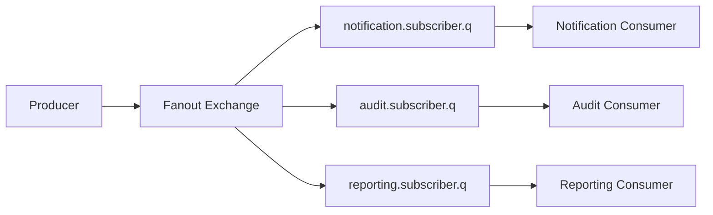
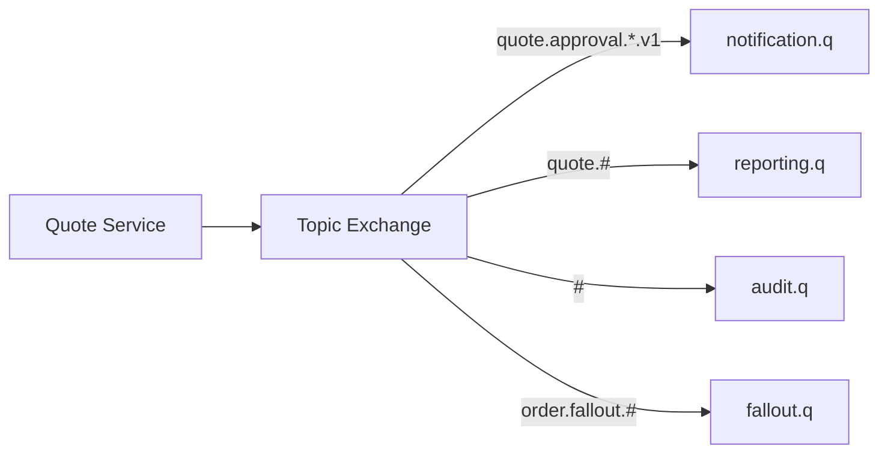
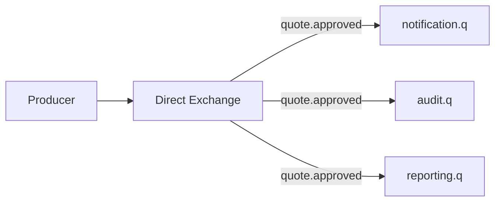
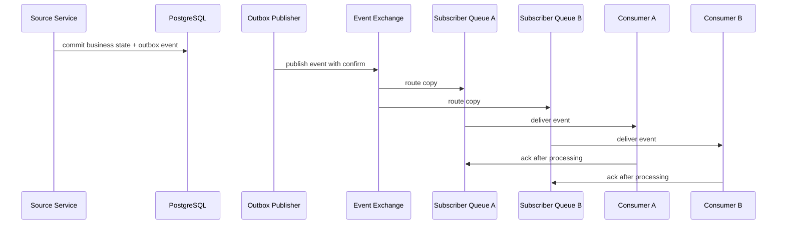
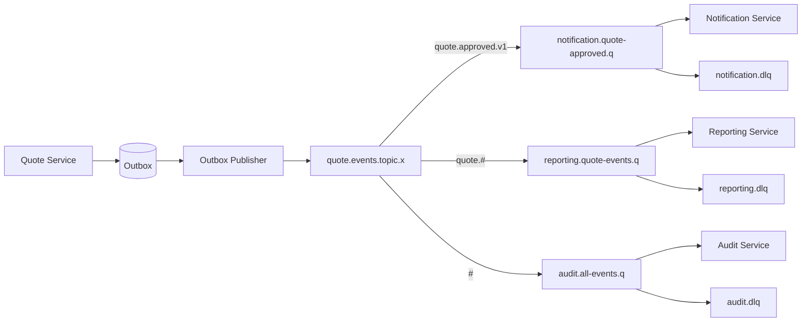

# Pub/Sub Event Distribution Pattern

## 1. Core idea

Pub/sub pattern menjawab pertanyaan:

```text
Bagaimana satu event dari producer dikirim ke banyak subscriber secara terisolasi?
```

Dalam RabbitMQ, pub/sub biasanya berarti:

```text
producer publishes event to exchange
exchange routes/copies event to multiple subscriber queues
each subscriber consumes from its own queue
```

Key idea:

```text
Each subscriber gets its own queue if it must receive its own copy of the event.
```

Bukan shared queue.

Jika dua service consume dari queue yang sama, mereka menjadi competing consumers.

Itu work queue, bukan pub/sub.

---

## 2. Why pub/sub exists

Pub/sub ada karena satu business event sering relevan untuk banyak service.

Contoh konseptual:

```text
quote.created
quote.price.calculated
quote.approval.requested
quote.approved
order.submitted
order.decomposed
order.fulfillment.started
order.fallout.detected
```

Subscriber berbeda bisa melakukan hal berbeda:

```text
notification service sends email
reporting service updates read model
audit service stores event trail
integration adapter notifies downstream system
cache service invalidates Redis entries
workflow service advances saga state
```

Producer tidak perlu tahu semua subscriber.

Subscriber tidak perlu mengubah producer setiap kali kebutuhan downstream berubah.

Namun decoupling ini hanya sehat jika contract, ownership, compatibility, retry, and observability jelas.

---

## 3. Pub/sub is not event streaming

RabbitMQ pub/sub distributes event copies to queues.

Kafka-like event streaming stores ordered logs with retention and consumer offsets.

RabbitMQ can have RabbitMQ Stream, but normal RabbitMQ queues are not the same as Kafka topics.

Comparison:

| Capability | RabbitMQ pub/sub with queues | Kafka/event log |
|---|---|---|
| Distribution | Copy to bound queues | Consumers read partitions |
| Replay | Limited/manual unless retained elsewhere | Native via offset and retention |
| Subscriber state | Queue state/ack | Consumer group offset |
| Routing | Exchange/binding/routing key | Topic/partition/key |
| Work distribution | Natural via competing consumers | Consumer group partition assignment |
| Long retention | Not typical for classic/quorum queues | Core model |

Rule:

```text
If you need long replay for many consumers, do not assume RabbitMQ queue pub/sub is enough.
```

Consider:

```text
RabbitMQ Stream
Kafka
outbox event table
event archive
CDC pipeline
```

---

## 4. Fanout exchange pattern

Fanout exchange broadcasts every message to every bound queue.



Good for:

```text
small number of subscribers
all subscribers need all events
simple broadcast
low routing complexity
```

Risk:

```text
uncontrolled fanout
subscriber receives irrelevant events
wasted processing
schema coupling across broad event set
harder access control per event category
```

Fanout is simple.

Simplicity is good only when the event domain is actually broad enough for all subscribers.

---

## 5. Topic exchange pattern

Topic exchange routes by routing key pattern.

Example routing keys:

```text
quote.created.v1
quote.approval.requested.v1
quote.approved.v1
order.submitted.v1
order.fallout.detected.v1
```

Bindings:

```text
notification.q -> quote.approval.*.v1
reporting.q -> quote.#
audit.q -> #
fulfillment.q -> order.submitted.v1
fallout.q -> order.fallout.#
```

Diagram:



Topic exchange is powerful.

It is also easy to abuse.

Dangerous binding:

```text
#
```

`#` may be valid for audit.

But for normal service integration, it can create accidental coupling and excessive traffic.

---

## 6. Direct exchange for event distribution

Direct exchange can also support pub/sub.

Multiple queues can bind with the same routing key.



This is useful when event types are explicit and exact-match routing is preferred.

Pros:

```text
less wildcard ambiguity
clear event-to-subscriber mapping
easier review
```

Cons:

```text
more bindings
less flexible taxonomy
can become verbose for many event variants
```

Use direct exchange when precision is more valuable than wildcard flexibility.

---

## 7. Per-subscriber queue

This is the most important rule:

```text
Every durable subscriber that must receive every event needs its own queue.
```

Correct:

```text
quote.events.x -> notification.quote-events.q
quote.events.x -> audit.quote-events.q
quote.events.x -> reporting.quote-events.q
```

Incorrect for pub/sub:

```text
quote.events.x -> quote.events.q
notification, audit, and reporting all consume quote.events.q
```

The incorrect version creates competing consumers.

Only one consumer gets each message.

This is a common production bug because everything appears connected but semantic delivery is wrong.

---

## 8. Subscriber isolation

Per-subscriber queue isolates:

```text
processing speed
retry behavior
DLQ ownership
deployment lifecycle
consumer outage
backlog
schema migration pace
operational responsibility
```

If reporting is slow, notification should not stop.

If audit DLQ grows, fulfillment should not lose events.

If one subscriber deploys a bad version, other subscribers should continue.

Subscriber isolation is the core reason pub/sub uses multiple queues.

---

## 9. Durable subscription versus temporary subscription

Durable subscription:

```text
durable queue
known queue name
consumer can be offline
messages accumulate
used for production service subscriber
```

Temporary subscription:

```text
exclusive or auto-delete queue
short-lived consumer
messages disappear when queue/connection goes away
used for debugging, ad-hoc tools, transient listeners
```

Use durable subscription for business-critical event consumers.

Use temporary subscription only when loss is acceptable.

Dangerous pattern:

```text
business-critical subscriber uses auto-delete queue accidentally
```

Result:

```text
consumer disconnects
queue disappears
future events are not stored for that subscriber
silent data gap
```

---

## 10. Event ownership

Every event needs an owner.

Owner defines:

```text
event meaning
schema
versioning policy
routing key
compatibility rules
deprecation timeline
source of truth
business invariant
```

Example:

```text
quote.approved.v1 is owned by Quote service/domain.
```

Subscriber owns what it does with the event.

Producer owns the event contract.

Platform may own broker topology mechanism.

Do not blur these ownership lines.

---

## 11. Event versus command

Event:

```text
Something happened.
```

Command:

```text
Please do something.
```

Examples:

| Message | Type | Owner |
|---|---|---|
| `quote.approved.v1` | Event | Quote domain |
| `generate.quote.document.v1` | Command/task | Document service or workflow owner |
| `order.submitted.v1` | Event | Order domain |
| `sync.order.to.downstream.v1` | Command/task | Integration/workflow owner |

Event names should be past tense:

```text
quote.created
quote.approved
order.submitted
```

Command/task names should be imperative or action-oriented:

```text
generate.document
sync.downstream
recalculate.pricing
```

Mixing these creates semantic confusion.

---

## 12. Event lifecycle

Typical event distribution lifecycle:



Important:

```text
source service publishes event after state change is durable
exchange copies event to subscriber queues
subscribers process independently
subscriber failure does not roll back producer state
subscriber retry does not block other subscribers
```

---

## 13. Outbox for event publishing

Event publication should normally be tied to business transaction through an outbox.

Bad pattern:

```text
update quote state
commit
publish quote.approved event
publish fails
```

Result:

```text
quote is approved in DB but subscribers never know
```

Outbox pattern:

```text
same DB transaction:
    update quote state
    insert outbox event quote.approved
publisher later publishes outbox event with confirm
marks outbox row published
```

This is essential for state-change events.

If event is purely telemetry or non-critical notification, requirements may differ.

But for quote/order domain events, assume outbox is needed unless proven otherwise.

---

## 14. Event schema

Minimum event fields:

```json
{
  "eventId": "evt-123",
  "eventType": "quote.approved",
  "eventVersion": 1,
  "occurredAt": "2026-07-11T10:15:30Z",
  "publishedAt": "2026-07-11T10:15:31Z",
  "tenantId": "tenant-001",
  "aggregateType": "Quote",
  "aggregateId": "Q-123",
  "aggregateVersion": 7,
  "correlationId": "corr-abc",
  "causationId": "cmd-xyz",
  "sourceService": "quote-service",
  "payload": {
    "quoteId": "Q-123",
    "approvalStatus": "APPROVED",
    "approvedBy": "user-123"
  }
}
```

Important distinctions:

```text
eventId identifies this event occurrence
aggregateId identifies business entity
aggregateVersion helps ordering/conflict checks
correlationId groups related operations
causationId points to triggering command/event
```

---

## 15. Headers versus payload

Recommended split:

Headers:

```text
event_type
event_version
correlation_id
causation_id
traceparent
tenant_id
source_service
content_type
schema_id if used
```

Payload:

```text
business facts
aggregate data
state transition details
```

Do not duplicate everything everywhere.

Do not put sensitive payload in headers unless required and approved.

Headers are often visible in tooling and logs.

---

## 16. Routing key design

Routing key should be stable and reviewable.

Examples:

```text
quote.created.v1
quote.pricing.calculated.v1
quote.approval.requested.v1
quote.approved.v1
quote.rejected.v1
order.submitted.v1
order.fallout.detected.v1
```

Avoid overly technical routing keys:

```text
serviceA.event1
foo.bar
update
process
message.v1
```

Better taxonomy:

```text
<domain>.<entity-or-capability>.<event-name>.<version>
```

or:

```text
<bounded-context>.<aggregate>.<event>.<version>
```

Use internal standard if one exists.

Internal verification is mandatory.

---

## 17. Versioning strategy

Versioning options:

```text
version in routing key
version in header
version in payload
schema ID in header
```

Example:

```text
routing key: quote.approved.v1
header: event_version=1
payload: eventVersion=1
```

This may seem redundant.

But it can be useful because:

```text
routing decides delivery
header helps middleware/tooling
payload helps consumer business logic and archive readers
```

Breaking change rule:

```text
Do not break existing subscribers silently.
```

Safer migration:

```text
publish v1 and v2 during transition
migrate subscribers
monitor v1 consumption
announce deprecation
remove v1 after agreed window
```

---

## 18. Backward and forward compatibility

Backward-compatible changes:

```text
add optional field
add new enum value only if consumers tolerate unknown values
add metadata header consumers ignore safely
increase payload detail without changing meaning
```

Breaking changes:

```text
rename required field
remove field
change type
change semantic meaning
change routing key unexpectedly
change event timing
change idempotency key meaning
```

Consumer should be tolerant where reasonable:

```text
ignore unknown fields
handle missing optional fields
validate required fields
reject poison schema failures to DLQ
```

Producer should not rely on consumer tolerance as excuse for poor governance.

---

## 19. Subscriber idempotency

Pub/sub event subscribers also need idempotency.

Duplicate event delivery can happen due to:

```text
publisher retry
consumer crash after DB commit before ack
manual replay
broker redelivery
operator intervention
outbox republish
```

Subscriber idempotency table:

```sql
CREATE TABLE consumed_event (
    subscriber_name     VARCHAR(128) NOT NULL,
    event_id            VARCHAR(128) NOT NULL,
    event_type          VARCHAR(128) NOT NULL,
    aggregate_id        VARCHAR(128),
    aggregate_version   BIGINT,
    consumed_at         TIMESTAMP NOT NULL,
    PRIMARY KEY (subscriber_name, event_id)
);
```

Important:

```text
Deduplicate per subscriber, not globally.
```

Each subscriber has different side effects.

---

## 20. Ordering in pub/sub

Ordering is subtle.

RabbitMQ queue can preserve order under certain conditions, but pub/sub design can still break semantic order.

Ordering can be affected by:

```text
multiple consumers per subscriber queue
prefetch > 1
redelivery
retry queues
priority queues
manual replay
multiple source services
multiple event exchanges
publisher concurrency
```

If subscriber requires per-aggregate ordering:

```text
use one queue/consumer lane per aggregate group if possible
use single active consumer where appropriate
use aggregateVersion to detect out-of-order events
buffer/retry out-of-order events carefully
consider Kafka/stream if ordering/replay is central
```

Rule:

```text
Never assume global event order in distributed microservices.
```

---

## 21. Slow subscriber problem

In pub/sub, one slow subscriber should not block other subscribers.

Per-subscriber queue helps.

Symptoms of slow subscriber:

```text
subscriber queue depth increasing
consumer utilization low or high depending bottleneck
ack rate lower than deliver rate
oldest message age increasing
DLQ/retry may grow
```

Causes:

```text
consumer down
consumer slow
DB/downstream slow
bad deployment
schema failure
poison message
prefetch too low or too high
resource limits
```

Mitigation:

```text
fix consumer
scale consumer if downstream allows
split workload
pause producer only if system-level risk exists
move poison messages to DLQ
replay after fix
```

Do not delete subscriber queue to "fix" backlog unless data loss is explicitly approved.

---

## 22. Replay limitation

Classic RabbitMQ pub/sub with queues is not a natural replay system.

Once a subscriber acks a message, RabbitMQ removes it from that queue.

To replay events, you need one of:

```text
outbox event table replay
event archive
DLQ/manual replay
RabbitMQ Stream
Kafka
CDC-based event log
backup restore in extreme cases
```

Manual replay must define:

```text
source of replayed event
target exchange/routing key
whether eventId is preserved or changed
whether idempotency is preserved
who approves replay
how customer impact is assessed
how replay is audited
```

Never replay production events casually.

---

## 23. Retry and DLQ per subscriber

Each subscriber should own its retry/DLQ behavior.

Why?

```text
notification retry policy differs from audit retry policy
reporting can lag longer than fulfillment
integration adapter may have downstream-specific backoff
one subscriber poison message should not affect others
```

Topology example:

```text
quote.events.x -> notification.quote-events.q -> notification retry/DLQ
quote.events.x -> audit.quote-events.q -> audit retry/DLQ
quote.events.x -> reporting.quote-events.q -> reporting retry/DLQ
```

Avoid shared DLQ for unrelated subscribers unless tooling can classify owner safely.

DLQ without owner becomes operational landfill.

---

## 24. Event distribution topology

Example:



Review questions:

```text
Who owns quote.events.topic.x?
Who can publish to it?
Who can bind to it?
Who approves new subscriber?
What event schema applies?
What is retention/replay strategy?
What happens when one subscriber is down?
```

---

## 25. Event ownership and access control

In enterprise systems, not every service should publish every event.

Access should reflect ownership:

```text
quote-service can publish quote.* events
order-service can publish order.* events
notification-service can consume selected quote/order events
reporting-service can consume reporting-approved event set
audit-service may consume broad event stream if approved
```

RabbitMQ permissions and topic permissions may help, depending configuration.

But security policy must be verified internally.

Do not assume topic authorization is enabled.

Internal verification:

```text
check users
check vhost
check configure/write/read permission
check topic permissions if used
check platform policy
```

---

## 26. Event schema governance

Event distribution without schema governance becomes accidental coupling.

Governance should define:

```text
schema owner
schema location
versioning rule
compatibility rule
deprecation process
consumer notification process
contract tests
example payloads
PII/data classification
```

Possible documentation forms:

```text
AsyncAPI
JSON Schema
Avro schema
Protobuf definition
internal MDX handbook
code-based contract tests
```

The exact tool matters less than whether teams actually use it.

---

## 27. Contract testing

Contract tests should catch:

```text
producer removed required field
producer changed field type
producer changed enum meaning
producer changed routing key
consumer cannot parse new event
consumer rejects unknown version incorrectly
```

Producer-side tests:

```text
published event matches schema
required headers exist
routing key matches event type/version
sample payloads are valid
```

Consumer-side tests:

```text
consumer accepts valid v1 event
consumer ignores unknown optional field
consumer rejects invalid required field to DLQ path
consumer deduplicates eventId
```

Contract testing is cheaper than production DLQ investigation.

---

## 28. Event timing and transaction boundary

Event should represent committed business fact.

Bad:

```text
publish quote.approved before DB commit
DB commit fails
subscribers believe quote approved
```

Bad:

```text
commit DB
publish event without outbox
publish fails
subscribers never learn quote approved
```

Better:

```text
commit DB state and outbox event together
publish from outbox with confirm
```

The event should not describe a state that can still roll back.

Exception may exist for provisional events, but then event name must make that explicit:

```text
quote.approval.requested
quote.approval.validation.started
```

Not:

```text
quote.approved
```

---

## 29. Event payload design: state versus delta

State event:

```json
{
  "quoteId": "Q-123",
  "status": "APPROVED",
  "version": 7,
  "approvedAt": "2026-07-11T10:15:30Z"
}
```

Delta event:

```json
{
  "quoteId": "Q-123",
  "fromStatus": "PENDING_APPROVAL",
  "toStatus": "APPROVED",
  "version": 7
}
```

State event pros:

```text
easier consumer projection
more self-contained
better for late subscribers if replay exists
```

Delta event pros:

```text
shows transition
smaller payload
useful for audit/business process
```

Often use both concepts carefully:

```text
event name describes transition
payload includes enough resulting state for consumers
```

---

## 30. Thin versus fat events

Thin event:

```json
{
  "quoteId": "Q-123",
  "eventType": "quote.approved"
}
```

Consumer must call source service for details.

Pros:

```text
small message
less duplicated data
source remains authoritative
```

Cons:

```text
adds synchronous dependency
creates thundering herd
source availability affects consumers
state may have changed by fetch time
```

Fat event:

```text
contains enough fields for consumers to act without callback
```

Pros:

```text
better decoupling
less callback pressure
more deterministic processing
```

Cons:

```text
larger message
more schema governance
privacy risk
field compatibility burden
```

Decision depends on domain, data sensitivity, and consumer needs.

---

## 31. Privacy and event payload

Events spread data.

Once an event is copied into many queues, DLQs, logs, archives, and dashboards, data exposure expands.

Review:

```text
Does payload contain PII?
Does header contain tenant/user identity?
Can DLQ be viewed by broad operator group?
Is event retained in outbox/archive?
Is replay tool audited?
Is payload logged by consumers?
Is encryption in transit enabled?
Is encryption at rest handled by deployment?
```

Rule:

```text
Do not publish data just because it might be useful someday.
```

Publish what the contract requires.

---

## 32. Consumer-side projection

Many pub/sub consumers build read models.

Example:

```text
reporting service consumes quote/order events
updates reporting tables
serves dashboard queries
```

Projection concerns:

```text
idempotency
out-of-order events
missing events
schema evolution
replay
backfill
reconciliation
aggregate version conflict
```

Recommended:

```text
store consumed event ID
store aggregate version
detect old event
detect gap if version sequence matters
provide reconciliation job
provide backfill source
```

RabbitMQ does not solve projection correctness by itself.

---

## 33. Cache invalidation subscriber

Redis cache invalidation via RabbitMQ pub/sub is common.

Example:

```text
quote.updated.v1 -> cache-invalidation.q -> delete quote:{id}
```

Risks:

```text
cache invalidation subscriber down
queue backlog causes stale cache
duplicate invalidation is fine
out-of-order invalidate/rebuild can produce stale write
TTL too long hides issue
```

Design:

```text
make invalidation idempotent
prefer delete over update if uncertain
include aggregate version if updating cache
monitor cache invalidation lag
use cache TTL as safety net
```

---

## 34. Notification subscriber

Notification consumers often tolerate duplicate less than engineers assume.

Duplicate event can create:

```text
duplicate email
duplicate SMS
duplicate customer communication
duplicate internal ticket
```

Use idempotency:

```text
notification_type + recipient + aggregate_id + event_id
```

Store notification send ledger:

```text
notification_id
event_id
recipient
channel
status
sent_at
provider_response
```

Do not rely only on RabbitMQ ack to prevent duplicate notifications.

---

## 35. Audit subscriber

Audit subscriber may intentionally bind broadly.

Example:

```text
audit.all-events.q binds to #
```

This can be valid.

But it has special requirements:

```text
high durability
clear retention
privacy review
access control
schema tolerance
high throughput capacity
DLQ policy
backfill/reconciliation
```

Audit consumer should be resilient to new event types.

But producer should still govern schema.

---

## 36. Integration subscriber

Integration adapter may consume events and call external systems.

Risks:

```text
external downtime
rate limits
duplicate outbound calls
out-of-order state sync
tenant-specific credentials
payload transformation errors
manual replay hazards
```

Required controls:

```text
idempotency key for downstream if supported
outbound request ledger
retry backoff
DLQ/parking lot
operator visibility
correlation ID
customer impact classification
```

For order management, integration subscriber can be high-risk because duplicate downstream call may create real-world side effect.

---

## 37. Event fanout and capacity

Every new subscriber adds work.

Even if producer cost stays similar, broker and system cost increases:

```text
more queue writes
more storage
more consumer traffic
more DLQ/retry topology
more monitoring cardinality
more schema compatibility burden
```

Before adding subscriber:

```text
What event does it need?
Can it filter precisely?
What throughput is expected?
What happens if it is down for 24 hours?
What is its DLQ policy?
Who owns its queue?
How will it handle replay?
```

New subscriber is an architecture change, not just a binding.

---

## 38. Cloud/Kubernetes/on-prem considerations

Pub/sub topology can increase queue count significantly.

In Kubernetes/self-managed broker:

```text
more queues may increase broker resource usage
more consumers increase connections/channels
subscriber rollouts cause reconnect bursts
DLQ/retry queues need monitoring
network policy must allow subscribers
```

In cloud-managed broker:

```text
broker instance sizing matters
connection limits matter
storage limits matter
maintenance window matters
metrics export matters
```

On-prem/hybrid:

```text
firewall and TLS certs matter
cross-region latency affects consumers
integration subscribers may bridge cloud/on-prem
operator ownership must be explicit
```

---

## 39. Observability for pub/sub

Broker-level per subscriber queue:

```text
ready messages
unacked messages
deliver rate
ack rate
redelivery rate
consumer count
consumer utilization
DLQ depth
retry depth
oldest message age
```

Producer-level:

```text
event publish rate by event type
publisher confirm latency
publish failure count
unroutable count
outbox lag
outbox unpublished count
```

Consumer-level:

```text
event processing duration
success/failure count by event type
schema rejection count
idempotent duplicate count
out-of-order count
DLQ count
retry count
```

Trace/log fields:

```text
eventId
eventType
eventVersion
aggregateId
aggregateVersion
correlationId
causationId
tenantId
sourceService
subscriberName
queueName
routingKey
```

---

## 40. Alerting strategy

Useful alerts:

```text
subscriber queue oldest message age exceeds threshold
subscriber queue depth exceeds threshold
consumer count is zero for durable subscriber
DLQ depth increases
retry queue depth increases
redelivery rate spikes
outbox lag grows
unroutable event detected
publisher confirm timeout spikes
```

Avoid only alerting on queue depth globally.

A queue depth of 10 may be severe for approval notification.

A queue depth of 10,000 may be normal for batch reporting.

Alert thresholds should reflect subscriber SLA.

---

## 41. Failure mode: wrong binding

Symptoms:

```text
producer publishes event
exchange publish succeeds
subscriber never receives
queue depth remains zero
other subscribers receive normally
```

Check:

```text
routing key exactly matches binding?
topic wildcard correct?
exchange name correct?
vhost correct?
queue bound to expected exchange?
binding deployed in environment?
producer using correct event version?
```

This is topology failure, not necessarily code failure.

---

## 42. Failure mode: shared queue by mistake

Symptoms:

```text
two services consume same queue
messages split between them
both services appear healthy
some events missing in each service
```

Root cause:

```text
work queue semantics accidentally used for pub/sub
```

Fix:

```text
create separate queue per subscriber
bind each queue to event exchange
replay missing events if source exists
repair data projections
```

This is one of the most important RabbitMQ pub/sub mistakes.

---

## 43. Failure mode: slow subscriber backlog

Symptoms:

```text
one subscriber queue grows
others are fine
producer is healthy
broker may eventually face storage pressure
```

Check:

```text
consumer count
application error logs
schema failures
DB/downstream latency
resource limits
DLQ/retry loop
oldest message age
```

Decision:

```text
scale subscriber if safe
pause subscriber if poison loop
fix deployment/config
move poison messages
consider replay/backfill after repair
```

---

## 44. Failure mode: schema break

Symptoms:

```text
DLQ spike after deployment
consumer deserialization errors
unknown enum errors
required field missing
routing key changed unexpectedly
```

Check:

```text
producer deployment timestamp
schema diff
event sample payload
consumer version
contract tests
backward compatibility rule
```

Mitigation:

```text
roll back producer if breaking
patch consumer if tolerant fix is safe
route poison messages to DLQ
replay after fix if safe
create compatibility test before redeploy
```

---

## 45. Failure mode: event lost suspicion

RabbitMQ investigation path:

```text
1. Was business state committed?
2. Was outbox event inserted?
3. Did outbox publisher attempt publish?
4. Was publisher confirm received?
5. Was message unroutable?
6. Was alternate exchange/return listener triggered?
7. Did exchange have correct bindings at publish time?
8. Did target subscriber queue receive message?
9. Was message consumed and acked?
10. Did consumer write its side effect?
```

Do not start by blaming RabbitMQ.

Most lost-event suspicions are actually:

```text
missing outbox row
wrong routing key
consumer ack before side effect
schema rejection
manual purge
wrong environment/vhost
projection bug
```

---

## 46. Production-safe debugging

Safe actions:

```text
inspect queue depth
inspect bindings
inspect recent logs by correlation ID
inspect DLQ message sample carefully
check outbox rows
check consumed_event rows
check consumer count
check deployment timeline
```

Dangerous actions:

```text
purge queue
delete binding
delete queue
manually ack/drop messages
mass replay without filter
change wildcard binding in production without review
increase consumer replicas during downstream outage
```

RabbitMQ operations can have irreversible business impact.

---

## 47. PR review checklist

For event producer:

```text
[ ] Event name is past-tense business fact.
[ ] Event owner is clear.
[ ] Event schema is documented.
[ ] Event versioning is explicit.
[ ] Outbox is used for state-change event.
[ ] Publisher confirm or equivalent reliability exists.
[ ] Required headers exist.
[ ] Routing key follows convention.
[ ] Privacy/data classification reviewed.
```

For event subscriber:

```text
[ ] Subscriber has its own queue.
[ ] Consumer is idempotent.
[ ] Retry/DLQ policy is owned by subscriber.
[ ] Schema validation failure path exists.
[ ] Processing is observable.
[ ] Slow subscriber impact is isolated.
[ ] Replay/backfill plan exists if needed.
```

For topology:

```text
[ ] Exchange type is justified.
[ ] Binding pattern is precise.
[ ] No accidental shared queue.
[ ] DLQ/retry topology exists per subscriber.
[ ] Alert thresholds reflect subscriber SLA.
[ ] Access control is reviewed.
```

---

## 48. Internal verification checklist

Verify in RabbitMQ Management UI or topology source:

```text
event exchange name/type
exchange durability
bindings per subscriber
routing key patterns
queue names per subscriber
queue durability/type
DLX/DLQ per subscriber
retry queues and TTL
alternate exchange if used
unroutable handling
```

Verify in producer code:

```text
outbox usage
publisher confirm
mandatory flag/return listener if required
event schema
event version
routing key construction
headers
correlation/trace propagation
```

Verify in consumer code:

```text
queue consumed by service
manual ack
idempotency table
schema validation
retry classification
DLQ behavior
logging/tracing
projection/state update transaction
```

Verify with platform/SRE/backend/integration team:

```text
who approves new event subscribers
who owns exchange
who owns queue
how replay is done
how schema changes are communicated
what event retention/archive exists
what incident history exists
```

---

## 49. CSG-specific caution

For CSG Quote & Order context, do not infer internal event names, queue names, routing keys, or topology from this cheatsheet.

This part provides architecture reasoning.

Actual implementation must be verified in:

```text
codebase
RabbitMQ Management UI
deployment manifests
Helm charts
RabbitMQ policies
platform documentation
integration diagrams
incident notes
team discussions
```

Mark unknowns explicitly.

Use:

```text
Internal verification checklist
```

Do not invent:

```text
exchange names
queue names
vhost names
retry topology
DLQ ownership
security policy
event schemas
message ownership
```

---

## 50. Senior engineer heuristics

Use these heuristics:

```text
Pub/sub requires per-subscriber queues.
A shared queue means competing consumers, not broadcast.
Event means fact, command means instruction.
Outbox protects event publication from DB/publish gap.
Subscriber isolation prevents one slow consumer from blocking others.
RabbitMQ queue pub/sub is not automatic replay.
Every event schema is an API contract.
Every new subscriber is an architecture change.
Every DLQ needs an owner and replay rule.
Every event carrying PII creates privacy blast radius.
```

Pub/sub is powerful when it decouples services around stable business facts.

It becomes dangerous when it distributes unstable payloads without ownership, compatibility, or observability.

---

## 51. Production readiness summary

A production-ready RabbitMQ pub/sub design has:

```text
clear event ownership
clear schema governance
versioning strategy
outbox-based state-change publishing
publisher reliability
per-subscriber durable queues
subscriber idempotency
per-subscriber retry/DLQ
precise routing keys/bindings
slow subscriber isolation
replay/backfill strategy
privacy review
metrics/logs/traces
alerting per subscriber SLA
runbook for backlog, DLQ, schema break, and replay
```

If these are missing, event distribution may still work initially.

But it will be fragile under real enterprise change: new subscribers, schema evolution, downtime, replay, tenant issues, privacy review, and production incidents.

---

## 52. References for further reading

Use official RabbitMQ documentation as the primary source when validating implementation details:

```text
RabbitMQ Exchanges guide
RabbitMQ AMQP 0-9-1 Model Explained
RabbitMQ Publish/Subscribe tutorial
RabbitMQ Routing tutorial
RabbitMQ Topics tutorial
RabbitMQ Consumers guide
RabbitMQ Consumer Acknowledgements and Publisher Confirms
RabbitMQ Dead Lettering guide
RabbitMQ Access Control guide
```
