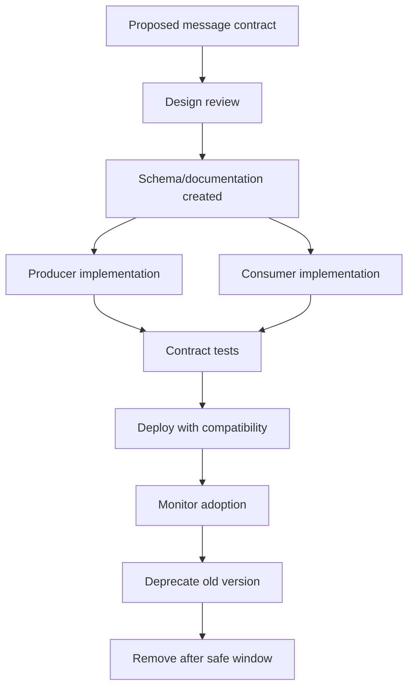
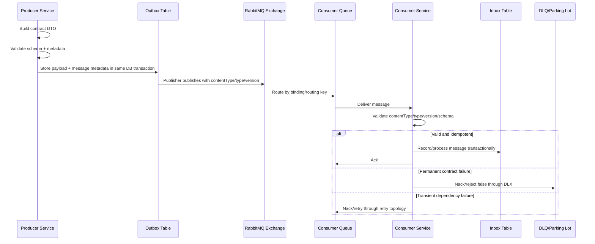

# Message Contract and Schema Governance

## 1. Core idea

RabbitMQ memindahkan message.

Tetapi sistem enterprise tidak gagal hanya karena broker down.

Sistem enterprise sering gagal karena producer dan consumer tidak lagi sepakat tentang arti message.

Message contract menjawab pertanyaan:

```text
Ketika service A publish message ke RabbitMQ, apa janji data yang diterima service B?
```

Contract bukan sekadar JSON shape.

Contract mencakup:

```text
message type
business meaning
producer ownership
consumer expectation
required fields
optional fields
field semantics
schema version
compatibility rule
routing expectation
idempotency key
correlation metadata
privacy classification
retry/DLQ expectation
lifecycle/deprecation rule
```

Dalam RabbitMQ, broker tidak memvalidasi business schema secara default.

RabbitMQ hanya tahu:

```text
exchange
routing key
headers
properties
payload bytes
queue delivery
ack/nack/reject
```

Artinya:

```text
Schema governance is an application and team discipline, not something RabbitMQ automatically guarantees.
```

Senior engineer harus melihat message sebagai public API antar service.

Jika REST API butuh contract, async message juga butuh contract.

Bahkan lebih berbahaya: async breakage sering tidak langsung terlihat di request-response path.

---

## 2. Why message contract exists

Tanpa message contract, RabbitMQ system mudah berubah menjadi distributed guesswork.

Failure pattern umum:

```text
producer menambah required field baru
consumer lama tidak tahu field tersebut
consumer gagal parse
message masuk retry loop
DLQ naik
business process stuck
incident terjadi jauh dari PR yang menyebabkan perubahan
```

Atau:

```text
producer mengubah arti status APPROVED
consumer menganggap APPROVED berarti final approval
service downstream memulai fulfillment terlalu awal
business state menjadi salah
```

Atau:

```text
field amount berubah dari cents menjadi decimal major unit
pricing calculation downstream salah
invoice salah
manual repair diperlukan
```

Message contract ada untuk mencegah perubahan kecil di payload menjadi production incident.

Untuk CPQ/order management, message contract sangat penting karena message sering membawa state transition:

```text
quote.created
quote.updated
quote.price.calculated
quote.approval.requested
quote.approved
order.submitted
order.decomposed
order.fulfillment.started
order.fallout.detected
```

Setiap event seperti ini punya konsekuensi bisnis.

Contract harus menjawab:

```text
Apakah event ini fakta yang sudah terjadi?
Apakah command ini instruksi yang boleh gagal?
Apakah retry aman?
Apakah duplicate aman?
Apakah consumer lama masih kompatibel?
```

---

## 3. RabbitMQ does not make weak contracts safe

RabbitMQ menyediakan routing dan delivery.

RabbitMQ tidak otomatis tahu apakah payload valid.

RabbitMQ tidak otomatis tahu apakah field wajib hilang.

RabbitMQ tidak otomatis tahu apakah versioning kompatibel.

RabbitMQ tidak otomatis tahu apakah event berubah makna.

RabbitMQ tidak otomatis tahu apakah duplicate command berbahaya.

Model tanggung jawab:

| Concern | RabbitMQ responsibility | Application/team responsibility |
|---|---|---|
| Exchange routing | Yes | Design topology |
| Queue delivery | Yes | Choose queue type and policy |
| Ack/redelivery | Yes | Ack discipline and idempotency |
| Payload schema | No | Define and validate |
| Business semantics | No | Own and document |
| Compatibility | No | Version and test |
| Privacy classification | No | Classify and protect |
| Idempotency meaning | No | Implement and verify |

Rule:

```text
RabbitMQ can deliver invalid messages reliably.
```

That is still a failure.

---

## 4. Message is not just payload

A RabbitMQ message has multiple layers:

```text
routing layer     -> exchange, routing key, binding
properties layer  -> contentType, messageId, correlationId, type, timestamp, deliveryMode
headers layer     -> custom metadata, trace context, tenant, retry, version
payload layer     -> business data
```

Do not put everything into payload.

Do not put everything into headers either.

A practical split:

| Data | Prefer | Reason |
|---|---|---|
| Business entity fields | Payload | Domain contract |
| Message type | Property/header | Fast classification |
| Schema version | Header/property/payload envelope | Compatibility |
| Correlation ID | Property/header | Traceability |
| Trace context | Headers | Distributed tracing propagation |
| Tenant ID | Header and possibly payload | Routing/audit/debugging |
| Retry count | Header/x-death derived | Retry handling |
| Security-sensitive field | Usually avoid | Privacy/compliance |

Rule:

```text
Payload is for business facts or commands.
Headers/properties are for message handling, correlation, routing metadata, and operational context.
```

But this must be standardized internally.

Different teams using different fields for the same concept is a governance smell.

---

## 5. Message type

Every message should have a stable type.

Examples:

```text
quote.created
quote.price-calculation-requested
quote.approval-requested
order.submitted
order.decomposition-requested
order.fulfillment-started
order.fallout-detected
notification.email-requested
integration.downstream-dispatch-requested
```

A message type should be:

```text
stable
business-readable
producer-owned
version-aware
not tied to random Java class names
not tied to temporary implementation details
```

Bad examples:

```text
MessageDTO
EventMessage
RabbitPayload
GenericEvent
OrderPayloadV2New
```

Better examples:

```text
order.submitted.v1
quote.approval.requested.v1
pricing.calculation.completed.v2
```

Whether version is in type, header, or envelope is a governance decision.

The important part:

```text
Consumer must be able to determine what contract applies before processing the body.
```

---

## 6. Command vs event contract

RabbitMQ can carry both command messages and event messages.

They are not the same.

### 6.1 Command message

A command asks another component to do something.

Example:

```text
calculate.quote.price
submit.order.to.downstream
send.customer.notification
start.fulfillment.task
```

Command semantics:

```text
imperative
usually has intended handler
may fail and be retried
should be idempotent
should have command id
should usually have clear timeout/failure behavior
```

Command contract must define:

```text
who is allowed to send it
who owns processing it
what side effect is expected
how duplicate command is handled
what success/failure means
what retry behavior is safe
```

### 6.2 Event message

An event states something that has happened.

Example:

```text
quote.created
quote.price.calculated
order.submitted
order.fulfillment.failed
```

Event semantics:

```text
past-tense fact
producer owns truth
many consumers may subscribe
producer should not know all consumers
event should be immutable
```

Event contract must define:

```text
what fact happened
when it happened
which aggregate/entity it belongs to
whether it represents state change or notification
which fields are guaranteed
compatibility rules for new consumers and old consumers
```

### 6.3 Why this matters

A command can be rejected.

An event cannot be "undone" by the consumer.

A command may represent desired future side effect.

An event should represent durable past state.

Confusing them causes broken systems.

Bad:

```text
Message name: order.created
Meaning: please create an order
```

Better:

```text
Command: order.create.requested
Event: order.created
```

---

## 7. Payload schema

Payload schema defines the shape and meaning of the message body.

For JSON payloads, schema may be informal unless governed.

That is risky.

Example payload:

```json
{
  "messageId": "01J...",
  "schemaVersion": "1.0",
  "eventType": "quote.price.calculated",
  "occurredAt": "2026-07-11T10:15:30Z",
  "quoteId": "Q-1000123",
  "tenantId": "tenant-a",
  "currency": "USD",
  "totalAmount": "1250.00",
  "lineItems": [
    {
      "lineId": "L-1",
      "productCode": "FIBER-100",
      "quantity": 1,
      "amount": "1000.00"
    }
  ]
}
```

Schema must define more than types.

It must define:

```text
quoteId format
tenant visibility
currency standard
amount precision
timezone rule
enum values
field optionality
array max size
nullability
semantic meaning
privacy classification
```

A field named `status` is not enough.

Contract should define:

```text
allowed statuses
state transition source
whether status is terminal
whether status can regress
whether status is eventually consistent
```

---

## 8. JSON contract

JSON is common because it is readable and easy to integrate.

Benefits:

```text
human-readable
easy debugging
language-neutral
easy logging if safe
easy integration with external systems
```

Risks:

```text
weak typing
silent unknown fields
number precision ambiguity
date/time ambiguity
nullable field ambiguity
enum drift
large payload bloat
no built-in compatibility enforcement
```

Production rule:

```text
If JSON is used for enterprise messaging, define JSON Schema or an equivalent internal contract.
```

JSON guidance:

```text
use ISO-8601 UTC timestamps
avoid floating point for money
use string/decimal representation for money if precision matters
avoid ambiguous nulls
prefer explicit optional fields
use stable enum values
include schema/message version
validate before publish and before process
```

Bad:

```json
{
  "amount": 100.5,
  "date": "07/11/26",
  "status": "done"
}
```

Better:

```json
{
  "amount": "100.50",
  "currency": "USD",
  "occurredAt": "2026-07-11T10:15:30Z",
  "status": "PRICE_CALCULATED"
}
```

---

## 9. Avro, Protobuf, and JSON Schema if used

Do not assume which schema technology is used internally.

Use this as a decision model.

### 9.1 JSON Schema

Good fit when:

```text
payload is JSON
human debugging matters
integration partners use JSON
schema validation should be explicit
```

Weakness:

```text
compatibility enforcement depends on tooling discipline
runtime model still needs validation
```

### 9.2 Avro

Good fit when:

```text
schema evolution is central
compact binary payload matters
schema registry exists
analytics/event integration exists
```

Weakness:

```text
less human-readable payload
requires stronger tooling discipline
```

### 9.3 Protobuf

Good fit when:

```text
strict generated types matter
cross-language contract matters
compact encoding matters
backward compatibility rules are well understood
```

Weakness:

```text
field number governance required
unknown field behavior must be understood
less convenient ad-hoc debugging
```

### 9.4 Internal verification

Do not invent CSG schema stack.

Verify:

```text
Is payload JSON, Avro, Protobuf, XML, or custom binary?
Is there schema registry?
Is there AsyncAPI?
Is there internal IDL?
Is validation runtime, build-time, or manual?
```

---

## 10. Content type

RabbitMQ message properties can carry content type.

Use it.

Examples:

```text
application/json
application/avro
application/x-protobuf
application/xml
```

Content type helps consumers reject unsupported payloads early.

Consumer should not guess payload format from queue name.

Bad:

```text
queue name says pricing.events
payload parser assumes JSON because current producer uses JSON
```

Better:

```text
contentType = application/json
messageType = quote.price.calculated
schemaVersion = 1.0
```

Consumer guard:

```java
if (!"application/json".equals(properties.getContentType())) {
    rejectToDlq(delivery, "unsupported content type");
    return;
}
```

In real systems, do not reject blindly without considering retry/DLQ policy.

Unsupported content type is usually permanent failure.

Permanent failure should go to DLQ/parking lot, not infinite retry.

---

## 11. Schema version

Versioning must be explicit.

Options:

```text
message type includes version: quote.created.v1
header includes version: schema-version=1
payload envelope includes version: schemaVersion="1.0"
registry subject includes version
```

Any option can work.

The anti-pattern is no version at all.

Versioning model should answer:

```text
Can v1 and v2 coexist?
Does routing key change by version?
Does same queue receive multiple versions?
How does consumer choose decoder?
When is old version retired?
Who approves breaking change?
```

Recommendation:

```text
Make version visible before business processing starts.
```

This can be header/property/envelope.

Consumer must be able to do:

```text
read message type
read schema version
select decoder
validate payload
process business logic
```

Not:

```text
try parse with current DTO and hope
```

---

## 12. Event version vs schema version

Schema version and event version may not be the same.

### Schema version

Schema version describes payload structure.

Example:

```text
quote.created schema v2 adds optional field salesChannel
```

### Event version

Event version may describe semantic contract.

Example:

```text
quote.approved.v2 now means finance approval and technical feasibility approval completed
```

A schema-compatible change can still be semantically breaking.

Example:

```text
field approvalStatus remains string
meaning of APPROVED changes
old consumers continue parsing
business behavior becomes wrong
```

Rule:

```text
Compatibility is semantic, not only syntactic.
```

Senior review must ask:

```text
Did field shape change?
Did field meaning change?
Did lifecycle meaning change?
Did retry/idempotency meaning change?
Did consumer decision logic change?
```

---

## 13. Required fields

Required fields are dangerous because removing them or failing to populate them breaks consumers.

Use required fields for true invariants.

Examples:

```text
messageId
messageType
schemaVersion
occurredAt or createdAt
aggregateId or business entity ID
producer/source service
tenantId if system is tenant-aware
```

Domain required fields depend on message type.

For `quote.price.calculated`:

```text
quoteId
calculationId
currency
totalAmount
pricingResultStatus
```

But do not make fields required just because one current consumer needs them.

That couples all producers to one consumer's temporary need.

Question:

```text
Is this field part of the event truth, or is it a convenience projection for one consumer?
```

If convenience projection, consider:

```text
consumer fetches detail by API
separate enriched event
consumer-owned read model
```

---

## 14. Optional fields

Optional fields are safer for evolution but dangerous if semantics are unclear.

Bad optional field:

```json
{
  "discount": null
}
```

Questions:

```text
Does null mean no discount?
Does null mean unknown?
Does null mean not calculated yet?
Does missing mean producer version did not support it?
```

Better:

```json
{
  "discount": {
    "status": "NOT_APPLICABLE",
    "amount": null
  }
}
```

Or:

```json
{
  "discountApplied": false
}
```

Optional field governance:

```text
new optional fields should not be required by existing consumers
consumer must tolerate unknown fields
producer must not depend on all consumers using new field immediately
field default must be documented
```

---

## 15. Default values

Default values are compatibility tools.

But hidden defaults create surprises.

Bad:

```text
If field is missing, assume priority=NORMAL.
```

Without documentation, different consumers may choose different defaults.

Better contract:

```text
priority missing in schema v1 means NORMAL.
priority explicit in schema v2 can be LOW/NORMAL/HIGH.
Consumers must treat unknown priority as NORMAL and emit metric.
```

Default rules should be:

```text
centralized
documented
tested
stable
observable when fallback is used
```

Consumer fallback metric:

```text
messaging.contract.default_used{message_type="quote.created", field="priority"}
```

This metric reveals old producers or schema drift.

---

## 16. Backward compatibility

Backward compatibility means new producer output can be consumed by old consumers.

Usually safe changes:

```text
add optional field
add enum only if old consumers tolerate unknown values
increase length limits if consumers can handle it
add header ignored by old consumers
```

Risky changes:

```text
rename field
remove field
change field type
change field unit
change timestamp format
change money representation
change enum semantics
change requiredness
change event meaning
```

Backward compatibility rule:

```text
Old consumers must continue to process messages from new producers without code changes.
```

If not possible, use:

```text
new message type
new version
parallel publish
consumer migration window
explicit deprecation plan
```

---

## 17. Forward compatibility

Forward compatibility means new consumers can handle old producer messages.

This matters during rolling deployment.

Scenario:

```text
consumer v2 deployed before producer v2
consumer v2 receives schema v1 message
consumer must still process safely
```

Forward compatibility requires:

```text
consumer supports older versions
missing new fields have documented defaults
schema version dispatch exists
no assumption that all producers deploy first
```

In Kubernetes, rolling deployment makes compatibility non-negotiable.

There is no global instant upgrade.

During deployment, system may contain:

```text
producer v1
producer v2
consumer v1
consumer v2
messages produced before deployment
messages produced during deployment
messages redelivered after deployment
messages replayed from DLQ
```

Contract must survive mixed-version reality.

---

## 18. Breaking change

A breaking change is any change that can make existing consumers parse incorrectly, process incorrectly, or make wrong business decisions.

Breaking changes include obvious changes:

```text
remove required field
rename field
change type
```

They also include subtle changes:

```text
change units from cents to dollars
change timestamp timezone assumption
change enum meaning
change whether event is emitted before or after DB commit
change whether duplicate command is possible
change routing key while queues still bind old pattern
```

Breaking change process:

```text
1. Identify all consumers.
2. Create new version or new message type.
3. Support dual publish or dual consume if needed.
4. Migrate consumers.
5. Monitor old-version traffic.
6. Disable old producer path.
7. Remove old contract only after retention/replay windows are safe.
```

Do not treat async message breaking changes as local refactoring.

They are distributed API changes.

---

## 19. Message deprecation

Message deprecation must be observable.

Bad:

```text
We think nobody uses this queue anymore.
```

Better:

```text
consumer count is zero for 30 days
publish rate is zero for 30 days
no DLQ/replay dependency exists
no internal team claims ownership
no external integration references it
contract marked deprecated in registry/docs
removal approved in architecture review
```

Deprecation checklist:

```text
mark message type deprecated
document replacement
notify consumers
add deprecation metric/log if message is still used
track publish rate by message type
track consumer version adoption
set removal date
archive sample payloads and contract
```

For regulated/business-critical systems, do not delete contract evidence too early.

Old messages may be needed for audit, replay, or investigation.

---

## 20. AsyncAPI

AsyncAPI can document event-driven APIs, including protocol-specific bindings.

For RabbitMQ/AMQP, useful documentation includes:

```text
server/vhost/environment
exchange
queue or channel concept
routing key
message payload schema
headers/properties
operation type
security scheme
bindings
examples
```

AsyncAPI is not magic.

It is useful only if kept close to implementation.

Good governance pattern:

```text
message contract lives in repository
contract changes reviewed in PR
producer and consumer tests use contract artifacts
AsyncAPI generated or validated in CI
published docs are versioned
```

Bad governance pattern:

```text
AsyncAPI doc is created once
implementation drifts
consumers trust stale documentation
incident happens
```

Internal verification:

```text
Does team use AsyncAPI?
If yes, is it source of truth or generated output?
If no, what is source of truth?
```

---

## 21. Contract testing

Contract testing prevents producer and consumer drift.

Test layers:

```text
producer validates message before publish
consumer validates message before processing
consumer contract tests sample producer messages
producer contract tests generated schemas
CI checks compatibility before merge
integration tests publish actual messages to RabbitMQ Testcontainers
```

Contract test should include:

```text
valid minimal message
valid full message
unknown optional field
missing optional field
missing required field
unknown enum
old schema version
new schema version
large payload boundary
invalid content type
privacy-sensitive field check
```

Consumer tests should not only test DTO parsing.

They should test semantic handling:

```text
duplicate message
out-of-order message if possible
old version message
unsupported version message
invalid business transition
```

---

## 22. Runtime validation

Build-time checks are not enough.

Messages can come from:

```text
old producer version
manual replay tool
external integration
DLQ replay
misconfigured publisher
test tool accidentally pointed to shared environment
```

Consumer should validate at runtime.

Validation flow:

```text
receive delivery
read content type
read message type
read schema version
validate headers/properties
validate payload schema
validate business preconditions
process idempotently
ack only after durable success
```

Unsupported contract handling:

```text
permanent schema error -> reject/nack false -> DLQ/parking lot
transient dependency error -> retry with backoff
unknown version -> usually DLQ/parking lot, not infinite retry
```

Do not retry invalid schema forever.

The broker cannot transform invalid payload into valid payload by waiting.

---

## 23. Envelope pattern

An envelope wraps business payload with standard metadata.

Example:

```json
{
  "messageId": "01J2X9E7N6...",
  "messageType": "quote.price.calculated",
  "schemaVersion": "1.0",
  "producer": "pricing-service",
  "tenantId": "tenant-a",
  "correlationId": "corr-123",
  "causationId": "cmd-456",
  "occurredAt": "2026-07-11T10:15:30Z",
  "payload": {
    "quoteId": "Q-1000123",
    "currency": "USD",
    "totalAmount": "1250.00"
  }
}
```

Benefits:

```text
standard metadata
consistent validation
traceability
simpler logging
version dispatch
common contract testing
```

Risks:

```text
duplicate metadata between envelope and RabbitMQ properties
large payload overhead
unclear source of truth
custom envelope incompatible with external systems
```

If envelope is used, define source of truth.

Example:

```text
RabbitMQ correlationId property and envelope correlationId must match.
If they differ, consumer rejects to DLQ and emits contract mismatch metric.
```

---

## 24. Header vs payload governance

Headers are useful for operational metadata.

But headers are not always visible in downstream storage, logs, or replay tooling.

Payload is useful for durable business data.

But putting operational metadata in payload can pollute domain contract.

Guideline:

| Field | Header/property | Payload |
|---|---:|---:|
| correlation ID | Yes | Optional duplicate in envelope |
| traceparent | Yes | No |
| tenant ID | Yes | Often yes for domain audit |
| message type | Yes | Often yes in envelope |
| schema version | Yes | Often yes in envelope |
| business amount | No | Yes |
| business status | No | Yes |
| retry count | Yes | No |
| source service | Yes | Optional envelope |
| privacy classification | Header maybe | Documented by schema |

Rule:

```text
Consumer must not require hidden headers that replay tooling cannot reproduce unless replay tooling is governed too.
```

---

## 25. Message size governance

RabbitMQ can carry arbitrary payload bytes, but large messages hurt broker memory, disk IO, network IO, queue replication, consumer memory, logging, DLQ storage, and replay.

Contract should include size expectations:

```text
max payload size
max array length
max string length
max nested object depth
attachment handling rule
```

Bad:

```text
put full quote document with all attachments into RabbitMQ message
```

Better:

```text
put quoteId, version, summary fields, and fetch location if large data is needed
```

Large payload questions:

```text
Does every consumer need this field?
Can consumer fetch detail by ID?
Is field safe to store in DLQ?
Will it fit log redaction policy?
Will quorum queue replication cost explode?
```

Message broker is not object storage.

---

## 26. Enum governance

Enums are common compatibility traps.

Bad assumption:

```text
Consumer switch statement handles all current enum values, so it is safe.
```

Future enum values can break old consumers.

Consumer pattern:

```java
switch (status) {
    case "PRICE_CALCULATED":
        handleCalculated(message);
        break;
    case "PRICE_FAILED":
        handleFailed(message);
        break;
    default:
        handleUnknownStatus(message);
}
```

Unknown handling must be explicit.

Options:

```text
ignore event with metric if safe
park message for manual review
DLQ unsupported enum
fallback to default behavior only if contract says so
```

Never silently map unknown business state to known state.

Bad:

```text
unknown status -> treat as APPROVED
```

That is a production incident waiting to happen.

---

## 27. Time and timezone governance

Time fields must be precise.

Contract must define:

```text
timezone
format
clock source
meaning
precision
ordering assumptions
```

Examples:

```text
createdAt: when producer created the message
occurredAt: when business event happened
publishedAt: when message was published
processedAt: when consumer processed the message
expiresAt: when command should no longer be processed
```

Do not mix these.

Bad:

```json
{"date": "11/07/2026"}
```

Better:

```json
{"occurredAt": "2026-07-11T10:15:30.123Z"}
```

Consumer should not assume message publish order equals business event order.

Clock skew, retries, outbox delay, replay, and redelivery can all break that assumption.

---

## 28. Money and quantity governance

CPQ/order systems frequently carry money, quantity, pricing, discount, tax, and charge data.

Contract must define:

```text
currency
precision
rounding rule
unit of measure
minor unit vs major unit
inclusive/exclusive tax semantics
discount semantics
one-time vs recurring charge
```

Bad:

```json
{"amount": 10.5}
```

Better:

```json
{
  "amount": "10.50",
  "currency": "USD",
  "scale": 2,
  "chargeType": "RECURRING",
  "billingPeriod": "MONTHLY"
}
```

For Java:

```text
Use BigDecimal for monetary values.
Do not use double/float for money.
```

Message contract should prevent downstream consumers from guessing unit or rounding behavior.

---

## 29. Identity and aggregate fields

Every business message should identify what it is about.

Typical fields:

```text
quoteId
orderId
customerId
accountId
tenantId
productId
lineItemId
workflowId
correlationId
```

For idempotency and ordering, aggregate identity matters.

Example:

```text
orderId defines per-order state transition stream
quoteId defines per-quote pricing/approval lifecycle
lineItemId defines per-line update
```

Contract must define:

```text
which ID is globally unique
which ID is tenant-scoped
which ID is stable across retries
which ID is safe in logs
which ID is used for idempotency
which ID is used for ordering
```

Do not rely on routing key as the only carrier of business identity.

Routing keys can change.

Messages may be replayed or inspected outside routing context.

---

## 30. Java DTO governance

Java DTOs are implementation artifacts.

They should not silently define the enterprise contract by accident.

Risky pattern:

```text
Producer serializes internal Java class directly.
Consumer deserializes same class or copied class.
Field rename breaks wire contract.
Internal refactor becomes external API change.
```

Better pattern:

```text
separate wire contract DTO from domain entity
explicit serialization annotations
schema generated from contract type or contract generated into Java type
contract tests enforce compatibility
```

Bad:

```java
class QuoteEntity {
    private BigDecimal internalMargin;
    private String databaseStatus;
    private List<InternalAuditNote> auditNotes;
}
```

Then serialize it as event payload.

Better:

```java
class QuotePriceCalculatedMessage {
    private String quoteId;
    private String calculationId;
    private String currency;
    private BigDecimal totalAmount;
    private String occurredAt;
}
```

Keep internal entity and wire contract separate.

---

## 31. JAX-RS boundary and message contract

For JAX-RS services, message contract often starts from HTTP requests.

Example:

```text
POST /quotes/{quoteId}/price-calculations
HTTP request -> service layer -> DB transaction -> outbox -> RabbitMQ message
```

Do not blindly reuse HTTP request DTO as RabbitMQ command.

HTTP DTO has API semantics.

RabbitMQ message has async processing semantics.

Differences:

| Concern | HTTP request DTO | RabbitMQ message |
|---|---|---|
| Caller | external/client/service | internal producer service |
| Response expectation | immediate response | async processing |
| Timeout | HTTP timeout | broker/consumer/retry lifecycle |
| Idempotency | request idempotency key | message/command id |
| Error handling | status code | retry/DLQ/parking lot |
| Contract audience | API client | async consumer services |

A JAX-RS command accepted with `202 Accepted` should produce a message contract that clearly states what is asynchronous and what is already committed.

---

## 32. Database and contract consistency

If message describes database state, contract must align with transaction timing.

Critical question:

```text
Was the business state committed before the event was published?
```

For outbox pattern:

```text
business row and outbox row committed together
publisher later publishes event
consumer may observe event after DB state exists
```

Without outbox:

```text
service may publish before DB commit
consumer may react to state that is not committed yet
```

Contract should define:

```text
event emitted after durable state change
event payload is snapshot at commit time or current query result
consumer should treat event as notification or source of truth
```

Subtle but important:

```text
A message can be syntactically valid but transactionally misleading.
```

Example:

```text
order.submitted event published before submit transaction commits
consumer starts fulfillment
submit transaction rolls back
```

That is a contract failure.

---

## 33. Message contract and idempotency

Contract must include idempotency support.

For events:

```text
messageId
aggregateId
eventId
eventType
occurredAt
producer
```

For commands:

```text
commandId
idempotencyKey
target aggregate
requested operation
requester/source
expiry/timeout if relevant
```

Consumer must know:

```text
Which field is used for deduplication?
Is duplicate delivery expected?
Can duplicate command be safely ignored?
Can command be replayed after partial success?
```

Bad:

```text
Consumer deduplicates by payload hash.
```

This fails when harmless metadata changes.

Better:

```text
Consumer deduplicates by stable messageId/eventId/commandId.
```

Business idempotency may require aggregate-specific key:

```text
quoteId + calculationId
orderId + commandId
tenantId + externalRequestId
```

---

## 34. Contract and routing key alignment

Routing key is part of integration contract.

Example:

```text
quote.price.calculated
quote.approval.requested
order.submitted
order.fulfillment.failed
```

But routing key and message type should not drift.

Bad:

```text
routingKey = order.created
messageType = quote.updated
```

Consumer confusion follows.

Governance options:

```text
routing key equals message type
routing key is stable category and message type is header
routing key includes tenant/region/domain and message type is separate
```

Any can work.

But define it.

Review questions:

```text
Can routing key change without message contract change?
Can consumers bind by version?
Can sensitive tenant data appear in routing key?
Are routing keys logged by broker/platform tooling?
```

Routing key is often visible in logs and metrics.

Do not put secrets or sensitive PII in routing keys.

---

## 35. Contract and retry/DLQ semantics

Retry behavior is part of contract.

A message contract should clarify:

```text
Is processing idempotent?
Which errors are transient?
Which errors are permanent?
How many retries are allowed?
What happens after retry exhaustion?
Can message be replayed manually?
Can replay cause duplicate business side effect?
```

Example:

```text
quote.price-calculation-requested
- transient failure: pricing engine timeout -> retry
- permanent failure: unsupported product configuration -> DLQ/fallout
- duplicate command: same calculationId must not create duplicate calculation
- expiry: do not process if quote version changed
```

Without this, consumers implement random retry behavior.

One consumer may retry forever.

Another may drop message.

Another may DLQ after one failure.

That inconsistency becomes operational chaos.

---

## 36. Contract and privacy classification

Message contract must classify data.

Questions:

```text
Does payload contain PII?
Does header contain tenant/customer/user identifier?
Does DLQ store sensitive data?
Can payload be logged?
Can replay tool expose payload?
What is retention requirement?
Who can access queue contents?
```

Avoid putting PII in headers unless necessary.

Headers are often logged or indexed for debugging.

Avoid storing complete customer-sensitive payload in DLQ without retention and access controls.

Contract metadata should include:

```text
dataClassification: internal | confidential | restricted
containsPII: true/false
loggableFields
redactionPolicy
retentionExpectation
```

Even if not encoded in message, it should exist in contract documentation.

---

## 37. Contract lifecycle

Message contract has lifecycle:



Do not create message contracts casually.

Every message type increases operational surface area.

Questions before adding a new message:

```text
Is it command, event, or task?
Who owns it?
Who consumes it?
Is it durable?
Is it replayable?
Is it versioned?
Is it observable?
Is it privacy-reviewed?
Can it be retired?
```

---

## 38. Compatibility deployment pattern

Safe async deployment often uses expand-and-contract.

```text
1. Add new optional field to schema.
2. Deploy consumers that tolerate both old and new messages.
3. Deploy producers that populate new field.
4. Monitor consumer behavior.
5. Later make field required only in new major version.
6. Deprecate old version after safe window.
```

For breaking changes:

```text
1. Create new message type/version.
2. Consumers subscribe to both old and new if needed.
3. Producer dual-publishes or switches under controlled rollout.
4. Monitor old traffic.
5. Remove old binding/producer only after replay/DLQ windows are clear.
```

Kubernetes rolling deployment makes this necessary.

RabbitMQ queue backlog makes this even more necessary.

Messages produced by old code can remain in queue after new code deploys.

---

## 39. Failure modes

Common contract failure modes:

| Failure | Symptom | Likely cause |
|---|---|---|
| Consumer parse failure | DLQ spike | Schema breaking change |
| Unknown enum | Retry loop or default path | Enum added without compatibility |
| Missing required field | Consumer exception | Producer bug or old version |
| Wrong money calculation | Silent business error | Unit/precision ambiguity |
| Wrong status transition | State corruption | Semantic contract change |
| Consumer ignores event | Missing downstream action | Routing/key/message type mismatch |
| Replay fails | Old schema unsupported | Consumer not forward-compatible |
| PII leak | Sensitive data in logs/DLQ | Contract privacy gap |

Most dangerous failures are silent semantic failures.

A consumer may parse successfully and do the wrong thing.

---

## 40. Detection signals

Contract failures can be detected through:

```text
consumer validation error rate
DLQ growth by message type
unsupported version count
unknown enum count
schema validation failure count
payload size violation count
deserialization exception count
contract default-used count
consumer processing fallback count
business invariant violation count
```

Suggested metrics:

```text
messaging_contract_validation_failed_total{message_type, schema_version, reason}
messaging_contract_unknown_version_total{message_type, version}
messaging_contract_unknown_enum_total{message_type, field, value}
messaging_contract_default_used_total{message_type, field}
messaging_contract_payload_too_large_total{message_type}
```

Logs should include:

```text
messageId
messageType
schemaVersion
correlationId
queue
consumer
validation failure reason
```

Do not log full payload if sensitive.

---

## 41. Debugging contract failures

Production-safe debugging flow:

```text
1. Identify failing queue and DLQ.
2. Group failures by messageType and schemaVersion.
3. Inspect validation error reason.
4. Compare producer version deployment timeline.
5. Compare consumer version deployment timeline.
6. Check contract/schema diff.
7. Check routing key and binding changes.
8. Check sample payload safely with redaction.
9. Decide: consumer hotfix, producer rollback, replay transformation, or parking lot.
10. Prevent recurrence with contract test and CI rule.
```

Do not immediately replay all DLQ messages.

If schema is incompatible, replay just repeats the incident.

First answer:

```text
Is the message invalid, or is the consumer too strict?
```

Then:

```text
Is this transient, permanent, or migration-related?
```

---

## 42. Java/JAX-RS implementation checklist

Publisher side:

```text
separate API request DTO from message contract DTO
validate message before publish/outbox insert
set contentType
set messageId
set correlationId
set type/messageType
set timestamp if standard requires it
include schemaVersion
avoid serializing internal entities
write contract tests
```

Consumer side:

```text
read message metadata first
validate content type
select decoder by message type/version
validate schema
validate business preconditions
handle unknown version explicitly
handle unknown enum explicitly
process idempotently
ack only after durable success
DLQ permanent contract failures
emit contract metrics
```

JAX-RS boundary:

```text
map HTTP idempotency key to command id where appropriate
return 202 only when async contract is explicit
expose status endpoint if workflow is long-running
propagate correlation ID into message
```

---

## 43. PostgreSQL/MyBatis/JDBC impact

Contract governance affects database integration.

Outbox:

```text
outbox row should store message type
schema version
payload
headers/properties if needed for replay
status
attempt count
published timestamp
```

Inbox:

```text
inbox row should store message id
message type
schema version
consumer id
processing status
failure reason
payload hash or redacted payload if allowed
```

MyBatis/JDBC concerns:

```text
serialization should happen inside or before transaction intentionally
outbox insert should not depend on non-deterministic DTO state
schema version should be stored with payload
replay should reconstruct headers/properties correctly
```

Data repair concern:

```text
Can old message payload be interpreted after code changes?
```

If not, store schema version and keep old decoder or migration transformer.

---

## 44. Kubernetes/AWS/Azure/on-prem impact

Deployment environments affect compatibility.

Kubernetes:

```text
rolling deploy creates mixed producer/consumer versions
queue backlog may contain old messages
consumer pods may restart during migration
```

AWS/Azure managed/self-managed RabbitMQ:

```text
network retries may duplicate publish attempts
maintenance windows may cause redelivery
DLQ retention/storage policy matters
```

On-prem/hybrid:

```text
cross-environment integrations may run different versions longer
external systems may not migrate quickly
manual replay may be more common
```

Contract governance must consider the slowest consumer, not only the fastest deployment path.

---

## 45. Mermaid: contract validation flow



---

## 46. Contract review questions

Ask these in PR/design review:

```text
What is the message type?
Is it command, event, task, or reply?
Who owns the contract?
Who are known consumers?
What schema format is used?
Where is schema documented?
How is version encoded?
What changes are backward compatible?
What changes are breaking?
What fields are required and why?
What fields are optional and what are defaults?
What is the idempotency key?
What is the aggregate identity?
Does message contain PII?
Can payload be logged?
What happens on unknown version?
What happens on invalid schema?
How is contract tested?
How is contract deprecated?
```

If these cannot be answered, the messaging design is not ready.

---

## 47. Internal verification checklist

Verify in actual CSG/team context:

```text
message formats used: JSON, Avro, Protobuf, XML, custom
schema source of truth
AsyncAPI or internal documentation availability
message type naming convention
schema versioning convention
routing key vs message type relationship
required metadata standard
correlation ID and trace context standard
idempotency key standard
contract testing in CI
producer validation before publish
consumer validation before processing
DLQ classification for contract failure
replay tooling support for headers/properties/schema version
privacy classification per message type
owner per message contract
known consumer inventory
breaking change approval process
message deprecation process
```

Do not assume these exist.

Find them in codebase, docs, dashboards, runbooks, or team discussions.

---

## 48. Production readiness checklist

A message contract is production-ready when:

```text
message type is clear
command/event semantics are clear
payload schema is documented
required/optional fields are defined
versioning is explicit
compatibility rules are documented
producer validates before publish
consumer validates before process
unknown version handling is explicit
idempotency key is defined
metadata standard is followed
privacy classification is known
contract tests exist
DLQ handling for invalid contract exists
replay tooling can reconstruct message metadata
owner and deprecation process are clear
observability by message type/version exists
```

Missing any of these does not always block release.

But each missing item is a known operational risk.

Senior engineering means making that risk explicit.

---

## 49. Key takeaways

Message contract is the async equivalent of API contract.

RabbitMQ can route and deliver a message reliably, but it cannot guarantee that the message means what consumers think it means.

Schema compatibility is not enough.

Semantic compatibility matters.

A production-grade RabbitMQ message must have:

```text
clear type
clear ownership
clear version
clear schema
clear metadata
clear idempotency key
clear compatibility rule
clear retry/DLQ semantics
clear privacy classification
clear test strategy
```

The most dangerous message failures are not parse errors.

The most dangerous failures are valid messages with changed meaning.

---

## 50. References for further verification

Use these as external references, then verify internal implementation against actual CSG/team standards:

```text
RabbitMQ AMQP 0-9-1 concepts
RabbitMQ publishers and message properties
RabbitMQ consumers and message type property
RabbitMQ Java client guide
AsyncAPI documentation and AMQP bindings
OpenTelemetry context propagation and messaging semantic conventions
Internal CSG/team schema governance and messaging standards
```
