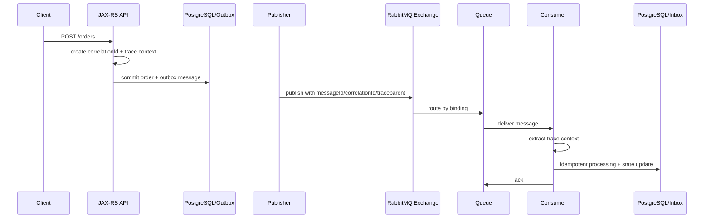

# Message Metadata and Traceability

## 1. Core idea

RabbitMQ moves messages between services.

Traceability answers a different question:

```text
When a message affects production state, can we prove where it came from, why it exists, who caused it, where it went, and what happened to it?
```

Message metadata is the difference between:

```text
Something happened somewhere in RabbitMQ.
```

And:

```text
HTTP request R created command C, which caused event E, which was routed through exchange X to queue Q, consumed by service S, retried twice, then updated order O and emitted event E2.
```

For senior backend work, metadata is not decoration.

Metadata is operational infrastructure.

Without it, debugging becomes archaeology.

---

## 2. Why metadata exists

Metadata exists because async systems break direct call stacks.

In HTTP/gRPC, request path is relatively direct:

```text
client -> service A -> service B -> service C -> response
```

In RabbitMQ, the path is delayed and indirect:

```text
HTTP request -> DB transaction -> outbox -> publisher -> exchange -> queue -> consumer -> DB transaction -> new message -> another queue
```

Failures may appear minutes or hours later.

Consumers may process messages after producer deployment changed.

Messages may be redelivered after crash.

DLQ replay may happen days later.

To debug this, every message needs identity and context.

Minimum traceability questions:

```text
What message is this?
What type is it?
Who produced it?
Why was it produced?
Which request/workflow caused it?
Which business entity is affected?
Which tenant/customer does it belong to?
Which version/schema applies?
How many times has it been retried?
Which consumer processed it?
What side effect happened?
```

---

## 3. Metadata layers in RabbitMQ

RabbitMQ message metadata can live in:

```text
AMQP properties
custom headers
payload envelope
routing key
queue/exchange context
consumer logs/metrics
outbox/inbox tables
tracing spans
```

A practical model:

```text
AMQP properties -> standard transport metadata
headers         -> operational/correlation metadata
payload envelope -> durable business/message metadata
routing key     -> broker routing metadata
logs/traces     -> observability projection
DB ledgers      -> durable processing evidence
```

Do not rely on only one layer.

For example, if replay tooling stores only payload but not headers, trace context and retry metadata may be lost.

If logs store only correlation ID but not message ID, duplicate delivery is hard to prove.

If inbox table stores message ID but not schema version, old payload replay can fail.

---

## 4. Message ID

Message ID identifies a specific message instance.

It should be stable across delivery attempts.

For producer retries, decide carefully:

```text
same logical message retry -> same messageId if retrying same outbox record
new business message -> new messageId
```

Message ID is useful for:

```text
deduplication
inbox table
logs
DLQ investigation
manual replay
producer/consumer reconciliation
```

Bad:

```text
consumer generates messageId after receiving message
```

Then producer and broker-side trace cannot link to consumer processing.

Better:

```text
producer assigns messageId before outbox insert or publish
consumer treats messageId as stable identity
```

Message ID should be:

```text
globally unique or scoped with tenant/source
stable
logged
stored in outbox/inbox
included in DLQ investigation
```

---

## 5. Correlation ID

Correlation ID groups related work.

It answers:

```text
Which user/API/workflow interaction does this message belong to?
```

Example:

```text
HTTP request correlationId = corr-123
quote.price-calculation-requested message correlationId = corr-123
quote.price.calculated event correlationId = corr-123
notification.email-requested message correlationId = corr-123
```

Correlation ID should flow across:

```text
JAX-RS request
service layer
outbox row
RabbitMQ properties/headers
consumer logs
inbox row
new emitted messages
tracing spans
```

Bad:

```text
new correlation ID generated at every service boundary
```

That breaks traceability.

Better:

```text
preserve inbound correlation ID
create one if missing at system edge
propagate it through downstream messages
```

Correlation ID is not always unique per message.

Many messages can share one correlation ID.

That is the point.

---

## 6. Causation ID

Causation ID links a message to the immediate prior cause.

Correlation ID groups the whole workflow.

Causation ID forms the chain.

Example:

```text
HTTP request: req-1
Command: cmd-1, correlationId=req-1, causationId=req-1
Event: evt-1, correlationId=req-1, causationId=cmd-1
Command: cmd-2, correlationId=req-1, causationId=evt-1
Event: evt-2, correlationId=req-1, causationId=cmd-2
```

This creates causal graph:


Why it matters:

```text
Correlation ID tells you messages are related.
Causation ID tells you which message caused which message.
```

In incident analysis, causation is often more important than correlation.

---

## 7. Trace ID and traceparent

Distributed tracing connects spans across services.

In HTTP, trace context is commonly propagated via headers.

In messaging, trace context must be injected into message headers/properties and extracted by the consumer.

Common standard:

```text
traceparent
tracestate
```

A message should allow this flow:

```text
JAX-RS inbound span
producer span
RabbitMQ publish span
consumer receive/process span
database span
outbound publish span
```

Trace context is not the same as business correlation ID.

| Concept | Purpose |
|---|---|
| trace ID | Observability trace graph |
| span ID | Individual operation in trace |
| correlation ID | Business/request/workflow grouping |
| causation ID | Message causal chain |
| message ID | Unique message instance |

Do not use one field for all of them.

You may copy one into another at system edge if needed, but semantics should remain clear.

---

## 8. Tenant ID

In multi-tenant systems, tenant ID is essential metadata.

It supports:

```text
debugging by customer/tenant
routing if tenant-aware
access control checks
data repair
privacy review
DLQ triage
rate limiting
noisy-neighbor analysis
```

But tenant ID can be sensitive.

Governance questions:

```text
Is tenant ID safe in headers?
Is it logged?
Is it visible in RabbitMQ Management UI or metrics labels?
Does it create high-cardinality metrics?
Can routing key expose tenant identity?
```

Do not put raw customer names or sensitive identifiers into routing keys.

Safer pattern:

```text
tenantId in payload/header for application handling
low-cardinality tenant classification in metrics if needed
redacted or hashed identifiers in logs where required
```

Internal standard must define this.

---

## 9. Actor ID

Actor ID identifies who initiated the action.

Possible actors:

```text
end user
system user
service account
scheduler
batch job
external partner
support/admin tool
```

Actor metadata helps answer:

```text
Was this order update user-driven or system-driven?
Did support manually replay this message?
Was this command caused by an integration partner?
```

Actor ID can be sensitive.

Do not blindly log full user identifiers if privacy policy forbids it.

Useful fields:

```text
actorType: USER | SERVICE | SYSTEM | PARTNER | ADMIN
actorId: stable identifier if allowed
actorRole: optional
sourceChannel: API | BATCH | UI | REPLAY | INTEGRATION
```

For compliance, actor metadata may be required for audit trail.

---

## 10. Source service

Every message should identify producer/source.

Examples:

```text
quote-service
pricing-service
order-service
fulfillment-adapter
notification-service
integration-gateway
```

Source service helps:

```text
find producer code
find owner team
correlate deployment version
debug schema drift
route incident ownership
```

Add source version if useful:

```text
sourceService: pricing-service
sourceVersion: 2026.07.11-abc123
sourceInstance: pod name if safe/useful
```

Be careful with high-cardinality labels.

`sourceInstance` is useful in logs, not always metrics.

For metrics, prefer service/version over pod name unless cardinality is controlled.

---

## 11. Message type

Message type tells consumer what the message means.

Examples:

```text
quote.price-calculation-requested
quote.price.calculated
quote.approval.requested
order.submitted
order.fulfillment.failed
```

RabbitMQ can carry message type in AMQP properties and/or headers/envelope.

Message type should be logged and metric-labeled carefully.

Useful metrics:

```text
messages_published_total{message_type}
messages_consumed_total{message_type, consumer}
messages_failed_total{message_type, reason}
dlq_messages_total{message_type}
```

Message type is low-cardinality if governed.

Do not generate dynamic message types.

Bad:

```text
messageType = order.submitted.customer-12345
```

That breaks metrics and governance.

---

## 12. Message version

Message version identifies contract version.

It should be visible in logs, metrics, inbox/outbox, and validation errors.

Examples:

```text
schemaVersion: 1.0
messageVersion: 2
contractVersion: quote.submitted.v1
```

Version metadata helps answer:

```text
Is this failure caused by old producer?
Is consumer receiving new version before deployment?
Are DLQ messages from deprecated schema?
Can replay use current decoder?
```

Metrics:

```text
messages_consumed_total{message_type, schema_version}
contract_validation_failed_total{message_type, schema_version, reason}
```

Avoid high-cardinality version values such as build SHA as schema version.

Build SHA is source version, not message contract version.

---

## 13. Created time, occurred time, published time, processing time

Timestamps are often confused.

Define each one clearly.

| Field | Meaning |
|---|---|
| createdAt | Message object created by producer code |
| occurredAt | Business event happened |
| persistedAt | Outbox row committed |
| publishedAt | Publisher sent to RabbitMQ or confirm received |
| deliveredAt | Consumer received delivery |
| processingStartedAt | Consumer began business handling |
| processedAt | Consumer completed durable side effect |

For events, `occurredAt` is usually most important.

For operations, `publishedAt` and `processedAt` help latency analysis.

Latency breakdown:

```text
producer delay = publishedAt - createdAt
outbox lag = publishedAt - persistedAt
queue lag = deliveredAt - publishedAt
processing latency = processedAt - processingStartedAt
end-to-end latency = processedAt - occurredAt
```

Do not use one timestamp for all purposes.

---

## 14. Retry count

Retry count helps distinguish first failure from poison message.

In RabbitMQ, dead-lettering can add `x-death` information.

Applications may also maintain retry headers.

Governance question:

```text
Is retry count derived from x-death, custom header, inbox state, or retry queue routing?
```

Avoid conflicting retry counters.

Bad:

```text
x-death says 5 deaths
custom retry-count says 1
consumer logic trusts custom header
```

Better:

```text
one retry interpretation standard
consumer logs both raw x-death and normalized retryAttempt
retry decision is deterministic
```

Retry metadata should include:

```text
attempt number
last failure reason
last failure time
original queue
original exchange/routing key if needed
```

Do not put full exception stack trace into message headers.

It can be huge and may leak sensitive data.

---

## 15. Routing metadata

Routing metadata includes:

```text
exchange
routing key
queue
binding pattern
vhost
dead-letter exchange
dead-letter routing key
original queue
original routing key
```

Some of this is broker context, not necessarily inside message.

For debugging, capture relevant routing metadata in logs and DLQ tooling.

Useful log fields:

```text
rabbitmq.exchange
rabbitmq.routing_key
rabbitmq.queue
rabbitmq.consumer_tag
rabbitmq.delivery_tag
rabbitmq.redelivered
rabbitmq.vhost
```

Routing key may contain business hints.

But message should not rely solely on routing key for business meaning.

If a message is manually replayed to a different exchange/queue, payload and metadata must still be interpretable.

---

## 16. Headers vs payload

A healthy metadata strategy avoids both extremes.

Bad extreme 1:

```text
All metadata only in payload.
```

Broker tools and tracing instrumentation cannot easily use it.

Bad extreme 2:

```text
All metadata only in headers.
```

Replay tools and persisted payload records may lose context.

Balanced approach:

```text
transport/observability metadata in headers/properties
business and durable audit metadata in payload envelope or DB ledger
critical identity stored in outbox/inbox tables
```

Example split:

| Metadata | AMQP property/header | Payload envelope | DB ledger |
|---|---:|---:|---:|
| messageId | Yes | Yes | Yes |
| correlationId | Yes | Optional | Yes |
| causationId | Header | Optional | Yes |
| traceparent | Header | No | Usually no |
| tenantId | Header maybe | Yes | Yes |
| messageType | Property/header | Yes | Yes |
| schemaVersion | Header | Yes | Yes |
| retryAttempt | Header/derived | No | Optional |
| actorId | Header maybe | Payload/audit | Yes if required |

---

## 17. Auditability

Auditability is stronger than observability.

Observability helps operate system behavior.

Auditability helps prove what happened.

Audit questions:

```text
Who initiated the action?
What message was created?
When was it created?
What business entity did it affect?
Which service processed it?
Was it retried or replayed?
What final side effect occurred?
Who manually intervened, if anyone?
```

RabbitMQ is usually not the audit store.

Queues are operational buffers, not permanent audit ledgers.

Audit evidence should usually be stored in:

```text
business tables
outbox table
inbox/processed message table
audit/event table
central logs/traces with retention policy
incident/replay records
```

Do not rely on queue contents for audit.

Messages disappear after ack.

---

## 18. Distributed tracing for RabbitMQ flow

A good trace for messaging should show:

```text
HTTP request span
DB transaction/outbox span
publish span
broker/routing context if instrumented
consume span
business processing span
DB update span
ack span or processing completion
next publish span if any
```

Mermaid flow:



Trace should connect asynchronous boundaries.

If publish and consume spans are disconnected, RabbitMQ flows become invisible in distributed tracing.

---

## 19. Trace context propagation in Java

For Java services, propagation usually requires instrumentation.

Publisher responsibilities:

```text
read current trace context from request/thread context
inject traceparent/tracestate into AMQP headers
set correlationId/messageId properties according to internal standard
log message metadata at publish boundary
```

Consumer responsibilities:

```text
extract trace context from AMQP headers
start consumer/process span as child/linked span
put correlationId/messageId into MDC/log context
propagate context to downstream DB/API/message calls
clear MDC after processing
```

Pseudo-code:

```java
Map<String, Object> headers = new HashMap<>();
headers.put("traceparent", currentTraceparent);
headers.put("correlation-id", correlationId);
headers.put("causation-id", causationId);
headers.put("message-type", messageType);
headers.put("schema-version", schemaVersion);

AMQP.BasicProperties props = new AMQP.BasicProperties.Builder()
    .messageId(messageId)
    .correlationId(correlationId)
    .type(messageType)
    .contentType("application/json")
    .headers(headers)
    .build();
```

Exact implementation depends on internal tracing library and RabbitMQ client wrapper.

Verify before standardizing.

---

## 20. Logging context

Logs should let engineers pivot across systems.

Minimum message log context:

```text
messageId
correlationId
causationId
traceId if available
messageType
schemaVersion
tenantId if allowed
sourceService
queue
exchange
routingKey
consumerName
retryAttempt
redelivered
```

Use structured logging.

Bad:

```text
Processing message failed
```

Better:

```json
{
  "event": "rabbitmq_consumer_failed",
  "messageId": "msg-123",
  "correlationId": "corr-456",
  "messageType": "order.submitted",
  "schemaVersion": "1.0",
  "queue": "order.fulfillment.q",
  "retryAttempt": 3,
  "redelivered": true,
  "reason": "DOWNSTREAM_TIMEOUT"
}
```

Do not log full payload by default.

Payload logs need redaction and classification.

---

## 21. MDC and thread boundaries

Java consumers often process messages using worker threads.

If logging context uses MDC, it must be propagated and cleared carefully.

Failure pattern:

```text
consumer thread handles message A
MDC correlationId=A
thread reused for message B
MDC not cleared
logs for B show A's correlationId
debugging becomes misleading
```

Safe pattern:

```java
try {
    MDC.put("messageId", messageId);
    MDC.put("correlationId", correlationId);
    MDC.put("messageType", messageType);
    process(message);
} finally {
    MDC.clear();
}
```

If processing moves to another executor, context must be propagated intentionally.

Do not assume thread-local context survives async boundaries.

---

## 22. Outbox traceability

Outbox should preserve enough metadata to reconstruct publish intent.

Useful outbox columns:

```text
outbox_id
message_id
message_type
schema_version
correlation_id
causation_id
tenant_id
aggregate_type
aggregate_id
exchange
routing_key
payload
headers_json
status
attempt_count
created_at
published_at
confirmed_at
last_error
```

This allows:

```text
publisher retry
publish confirmation audit
producer/consumer reconciliation
manual repair
DLQ comparison
message reconstruction
```

If outbox stores only payload, replay may lose headers/properties.

That weakens traceability.

---

## 23. Inbox traceability

Inbox/processed message table should preserve enough metadata to prove consumer behavior.

Useful inbox columns:

```text
inbox_id
message_id
consumer_name
message_type
schema_version
correlation_id
causation_id
tenant_id
aggregate_id
queue
routing_key
received_at
processing_started_at
processed_at
status
failure_reason
retry_attempt
payload_hash
```

This supports:

```text
deduplication
audit
consumer latency analysis
partial failure investigation
manual replay safety
poison message tracking
```

Inbox table is not only dedup.

For critical flows, it is a processing ledger.

---

## 24. Redelivery and traceability

RabbitMQ redelivery means the same message may be delivered again.

Consumer must log:

```text
messageId
redelivered flag
retry attempt/death count
previous failure if known
```

Redelivery can happen after:

```text
consumer crash
connection loss
channel close
nack/requeue
broker failover
manual replay
```

Traceability question:

```text
Is this duplicate delivery of the same message, or a new duplicate message produced separately?
```

Message ID and outbox ID help distinguish.

Cases:

| Scenario | messageId | Meaning |
|---|---|---|
| Broker redelivery | Same | Same message delivered again |
| Publisher retry same outbox row | Usually same | Same logical message republished |
| Producer bug creates duplicate command | Different or same depending bug | Business duplicate risk |
| Manual replay | Same or new by policy | Must be explicit |

Define manual replay identity policy.

---

## 25. DLQ traceability

DLQ without metadata is a graveyard.

DLQ with metadata is an investigation queue.

For DLQ triage, need:

```text
original exchange
original routing key
original queue
message type
schema version
message ID
correlation ID
retry/death count
failure reason
consumer name
first failure time
last failure time
payload classification
```

`x-death` can provide broker death history, but application failure reason should also be captured in logs or parking lot metadata.

Do not mutate original business payload to add error details unless that is your governed replay format.

Better:

```text
error context in parking lot table/tool
message body preserved
metadata stored alongside
```

---

## 26. Manual replay traceability

Manual replay must be traceable.

Replay is a production write operation.

Replay metadata should answer:

```text
who replayed it
when it was replayed
why it was replayed
from which DLQ/source
to which exchange/routing key
whether messageId was preserved
whether headers were preserved
whether payload was transformed
which approval/ticket authorized it
```

Replay header examples:

```text
replayed=true
replayId=rp-20260711-001
replayedBy=support-user-or-service
replayedAt=2026-07-11T10:15:30Z
replayReason=downstream outage recovered
originalMessageId=msg-123
```

Be careful:

```text
Changing messageId may bypass idempotency.
Preserving messageId may cause consumer to ignore replay if inbox says processed.
```

Replay identity policy must be explicit.

---

## 27. Metrics and cardinality

Metadata is useful for metrics, but high cardinality can break observability systems.

Good metric labels:

```text
message_type
queue
consumer
producer_service
schema_version
failure_reason_class
```

Risky metric labels:

```text
message_id
correlation_id
tenant_id if many tenants
user_id
order_id
quote_id
pod_name in high-scale systems
```

Use high-cardinality identifiers in logs/traces, not metrics labels.

Pattern:

```text
metrics show where problem is
logs/traces identify exact message
DB ledger proves exact processing state
```

Do not put every metadata field into Prometheus labels.

---

## 28. Privacy and metadata

Metadata can leak sensitive information.

Examples:

```text
routingKey = tenant.customerName.order.submitted
header userEmail = john@example.com
correlationId contains account number
messageId generated from business ID
```

Avoid encoding sensitive values in:

```text
routing keys
queue names
exchange names
metric labels
unredacted logs
DLQ dashboards
trace attributes
```

Safe approach:

```text
use opaque IDs
redact logs
hash identifiers if needed
store sensitive mapping in protected database
limit Management UI access
control replay tool permissions
```

Traceability must not violate privacy.

Security review should include metadata, not only payload.

---

## 29. Routing key and traceability

Routing keys are visible operational metadata.

They help debug:

```text
was message routed with expected key?
did binding pattern match?
did wrong routing key cause unroutable message?
```

But routing key should not be the only business record.

Bad:

```text
payload has no orderId
routingKey contains order.12345.submitted
consumer extracts orderId from routingKey
```

Better:

```text
routingKey = order.submitted
payload contains orderId
headers contain messageType and correlationId
```

If routing key includes domain fragments, define grammar:

```text
<domain>.<entity>.<event>
<tenant-class>.<domain>.<event>
<region>.<domain>.<event>
```

Do not let routing keys evolve organically without governance.

---

## 30. Consumer identity

Consumer identity is needed for debugging.

Capture:

```text
consumer service
consumer group/purpose
queue
consumer tag
pod/instance if useful
application version
```

This helps answer:

```text
Which service processed the message?
Which version processed it?
Was it old consumer code?
Was failure isolated to one pod?
Did deployment cause errors?
```

Useful logs:

```text
consumer_started
consumer_cancelled
message_processing_started
message_processing_succeeded
message_processing_failed
message_ack_failed
consumer_shutdown_draining
```

For RabbitMQ, consumer tag can help map broker-side consumer to application logs.

---

## 31. Producer identity

Producer identity is equally important.

Capture:

```text
producer service
producer version
publisher component
outbox id
exchange
routing key
publish attempt
confirm latency
```

Producer logs should include:

```text
message_built
outbox_record_created
publish_attempted
publish_confirmed
publish_failed
message_returned_unroutable
```

For publisher reliability, traceability must distinguish:

```text
message never created
outbox created but not published
published but not confirmed
confirmed but not consumed
consumed but failed processing
processed but downstream side effect failed
```

Each state needs metadata.

---

## 32. Traceability across outbox publisher

Outbox introduces time gap.

HTTP request may finish before RabbitMQ publish happens.

Need continuity:

```text
request correlation ID stored in outbox
trace context may be stored or new publish trace linked to original correlation
outbox id links API transaction to publish attempt
```

Possible trace model:

```text
HTTP trace includes DB commit + outbox insert
publisher trace is separate but linked with correlationId/outboxId/messageId
consumer trace continues from message trace context if propagated
```

Some tracing systems support span links for async work.

Even if tracing is imperfect, logs and DB ledgers must preserve correlation.

Do not rely only on thread-local trace context in outbox publisher.

The publisher may run in another process later.

---

## 33. Traceability across saga/workflow

Saga/workflow needs both correlation and causation.

Example:

```text
quote approval request -> approval task created -> approval completed -> order submission command -> fulfillment started
```

Metadata:

```text
workflowId
sagaId
correlationId
causationId
messageId
aggregateId
stepName
stepAttempt
```

Workflow observability should answer:

```text
Which step is stuck?
Which message caused the step?
Which service owns the next action?
Was timeout emitted?
Was compensation triggered?
```

If saga state is stored in DB, message metadata should link to saga state row.

Without this, stuck workflow investigation becomes manual stitching.

---

## 34. Traceability in CPQ/order management context

Conceptual examples, not internal CSG claims.

Quote pricing flow:

```text
correlationId = original quote pricing request
causationId = HTTP request or quote.updated event
messageId = price-calculation-requested command id
aggregateId = quoteId
workflowId = pricing calculation id
tenantId = tenant/account scope
```

Order fulfillment flow:

```text
correlationId = order submission request/workflow
causationId = order.submitted event
messageId = fulfillment command id
aggregateId = orderId
stepName = fulfillment-dispatch
sourceService = order-service
```

Fallout flow:

```text
correlationId = original order workflow
causationId = downstream failure event
messageId = fallout-detected event
aggregateId = orderId
actorType = SYSTEM
```

Internal verification required for actual field names and flow ownership.

---

## 35. Java/JAX-RS propagation pattern

At HTTP ingress:

```text
read X-Correlation-ID if trusted/allowed
otherwise generate correlation ID
start trace span
put correlation ID into MDC
pass through service layer explicitly or via request context
```

At message creation:

```text
messageId = new stable ID
correlationId = inbound correlation ID
causationId = request ID or triggering message ID
trace context = current trace context
sourceService = current service
messageType/schemaVersion = contract metadata
```

At outbox insert:

```text
persist message metadata and payload
```

At consumer:

```text
extract metadata
validate required fields
put metadata into MDC
start trace/process span
process idempotently
emit next messages with same correlation ID and current messageId as causation ID
clear context
```

---

## 36. Metadata standard example

Example standard message metadata:

```json
{
  "messageId": "msg-01J2X9E7N6",
  "correlationId": "corr-01J2X9E7N1",
  "causationId": "req-01J2X9E7M9",
  "messageType": "order.submitted",
  "schemaVersion": "1.0",
  "sourceService": "order-service",
  "sourceVersion": "2026.07.11-abc123",
  "tenantId": "tenant-a",
  "actorType": "USER",
  "actorId": "user-123",
  "aggregateType": "ORDER",
  "aggregateId": "O-1000123",
  "occurredAt": "2026-07-11T10:15:30Z"
}
```

AMQP properties/headers may carry overlapping fields:

```text
properties.messageId = messageId
properties.correlationId = correlationId
properties.type = messageType
properties.contentType = application/json
headers.schema-version = 1.0
headers.causation-id = causationId
headers.traceparent = traceparent
headers.tenant-id = tenantId
```

If duplicate metadata exists, define consistency rule.

---

## 37. Consistency between properties, headers, and payload

Duplicate metadata can drift.

Example:

```text
AMQP property messageId = msg-1
payload envelope messageId = msg-2
```

This is dangerous.

Consumer rule options:

```text
reject as contract violation
prefer AMQP property and emit warning
prefer envelope and emit warning
normalize at publisher before publish
```

Best pattern:

```text
publisher sets metadata once through common library
library writes consistent properties/headers/envelope
consumer validates consistency for critical fields
```

Critical fields to validate:

```text
messageId
messageType
schemaVersion
correlationId
tenantId if present in both places
```

---

## 38. Failure modes

Traceability failure modes:

| Failure | Symptom | Root issue |
|---|---|---|
| Missing correlation ID | Cannot connect API request to message | Ingress propagation gap |
| New correlation at each service | Trace fragmentation | Wrong propagation policy |
| Missing message ID | Cannot deduplicate or investigate DLQ | Producer metadata gap |
| Missing schema version | Replay/parse failure | Contract governance gap |
| Missing tenant ID | Cannot triage customer impact | Metadata standard gap |
| Full payload logged | Privacy incident | Logging/redaction gap |
| High-cardinality metrics | Metrics system pressure | Wrong metadata used as labels |
| Replay loses headers | Consumer rejects replay | Replay tooling gap |
| MDC leakage | Logs show wrong correlation | Thread context cleanup bug |

Traceability failures often do not break happy path.

They break incident response.

---

## 39. Detection signals

Detect metadata problems with validation and metrics:

```text
message_metadata_missing_total{field, message_type}
message_metadata_mismatch_total{field, message_type}
message_trace_context_missing_total{message_type, source_service}
message_correlation_missing_total{message_type}
message_invalid_timestamp_total{message_type, field}
message_privacy_redaction_failed_total{message_type}
```

Consumer should validate required metadata before business processing.

Publisher should validate before publish/outbox insert.

Dashboard should show:

```text
publish/consume rate by message type
DLQ by message type/version
missing metadata by producer
consumer failures by correlation ID sample
old schema version traffic
retry attempts by queue/message type
```

---

## 40. Debugging with metadata

Given a production issue:

```text
Customer says order is stuck.
```

Traceability debugging path:

```text
1. Find orderId/quoteId/customer/tenant.
2. Search business state table.
3. Find correlationId/workflowId.
4. Search logs by correlationId.
5. Search outbox by aggregateId/correlationId.
6. Check messageId and publish status.
7. Check RabbitMQ queue/DLQ by message type if possible.
8. Search inbox by messageId/aggregateId.
9. Check consumer processing status.
10. Check downstream side effect.
11. If replay needed, verify idempotency and replay identity policy.
```

Without metadata, step 3 fails and everything becomes manual.

Good metadata turns incident response into a graph traversal.

---

## 41. Production-safe payload inspection

Sometimes you need to inspect payload.

Rules:

```text
prefer metadata first
inspect payload only when needed
use approved tools
redact sensitive fields
avoid copying payload to chat/tickets/logs unless allowed
record access if compliance requires it
```

DLQ tooling should show:

```text
metadata summary
schema version
failure reason
redacted payload preview
replay eligibility
privacy classification
```

It should not casually expose full payload to everyone with dashboard access.

---

## 42. OpenTelemetry semantic mapping

If OpenTelemetry is used, messaging spans should represent publish and consume operations.

Useful attributes conceptually include:

```text
messaging.system = rabbitmq
messaging.destination.name = exchange or queue depending span
messaging.operation.type = publish/process/receive
messaging.message.id = messageId
messaging.message.conversation_id = correlationId if mapped
server.address / network peer if available
```

Exact semantic convention names can evolve.

Verify current internal OpenTelemetry instrumentation and version.

Do not hardcode semantic names in business code if observability library abstracts them.

Business logs should still carry stable message metadata independent of tracing vendor/tool.

---

## 43. Management UI and metadata limits

RabbitMQ Management UI is useful but not a complete traceability system.

It can show queues, exchanges, rates, consumers, messages when inspected, and some properties/headers.

But:

```text
acked messages disappear
payload inspection may be restricted
history is limited
business context is not modeled
correlation graph is not built automatically
```

Use Management UI for broker state.

Use logs/traces/outbox/inbox/audit tables for end-to-end traceability.

Do not expect RabbitMQ alone to answer business process questions.

---

## 44. Metadata in retry topology

Retry topology can change routing context.

Example:

```text
main queue -> DLX -> retry queue -> DLX -> main exchange -> main queue
```

During this cycle, metadata should preserve:

```text
original message ID
original correlation ID
original causation ID
original message type/version
original exchange/routing key
retry attempt/death history
last failure class
```

If retry publisher creates a new message, define whether:

```text
messageId preserved
causationId updated
retryAttempt incremented
originalMessageId stored
```

Retry without traceability causes mystery duplicates.

---

## 45. Metadata in fanout/pub-sub

In pub/sub, many subscriber queues receive copies.

Each subscriber may process independently.

Need to distinguish:

```text
same message delivered to multiple subscriber queues
same queue redelivered same message
producer published duplicate event
manual replay of event
```

Metadata helps:

```text
same messageId across subscriber queues -> same original event
consumer-specific inbox rows -> each subscriber processing state
consumer name in logs -> which subscriber failed
```

Subscriber should not rewrite message ID of received event.

If subscriber emits new derived message, it creates new messageId and uses original messageId as causationId.

---

## 46. Metadata in request-reply/RPC

Request-reply needs correlation ID and request ID discipline.

Fields:

```text
requestMessageId
replyMessageId
correlationId
replyTo
causationId = requestMessageId for reply
timeoutAt
requesterService
responderService
```

Reply handling failure modes:

```text
late reply after timeout
duplicate reply
reply with unknown correlationId
reply for already completed request
reply lost due to direct reply-to semantics
```

Traceability should allow:

```text
which request caused this reply?
was reply late?
did requester already timeout?
did duplicate reply arrive?
```

RPC over RabbitMQ without metadata is especially hard to debug.

---

## 47. Internal verification checklist

Verify in actual CSG/team context:

```text
standard messageId field/property
standard correlationId field/property
standard causationId field/property
traceparent/tracestate propagation
OpenTelemetry instrumentation for RabbitMQ publish/consume
MDC/log context propagation in Java consumers
message type and schema version metadata standard
tenant ID metadata standard and privacy rule
actor metadata standard
source service/version standard
outbox metadata columns
inbox metadata columns
DLQ tooling metadata display
manual replay metadata and audit trail
routing key grammar and privacy constraints
metrics label policy/cardinality policy
payload redaction policy
consumer validation of required metadata
publisher validation of required metadata
```

Do not assume these exist.

Verify in shared libraries, codebase, platform docs, dashboards, and runbooks.

---

## 48. PR review checklist

For any PR introducing or changing RabbitMQ message flow, ask:

```text
Does every message have stable messageId?
Is correlationId propagated from ingress or triggering message?
Is causationId set for derived messages?
Is trace context injected/extracted?
Is messageType explicit?
Is schemaVersion explicit?
Is tenantId handled according to privacy policy?
Is sourceService set?
Are timestamps semantically clear?
Are metadata fields persisted in outbox/inbox?
Are logs structured with message metadata?
Are metrics using safe low-cardinality labels?
Does replay preserve required metadata?
Does DLQ triage show enough metadata?
Does consumer clear MDC/thread-local context?
```

If the PR cannot support production debugging, it is incomplete.

---

## 49. Production readiness checklist

A RabbitMQ message flow is traceability-ready when:

```text
message identity is stable
workflow correlation is preserved
causal chain is represented
trace context crosses async boundary
message type/version are visible
source service and consumer identity are visible
tenant/actor metadata is governed
outbox/inbox store required metadata
logs are structured and redacted
metrics use safe cardinality
DLQ tooling exposes metadata safely
manual replay is audited
metadata validation exists
runbook uses metadata for debugging
```

This is not bureaucracy.

It is the foundation for fast incident response.

---

## 50. Key takeaways

RabbitMQ breaks direct call stacks.

Metadata rebuilds the chain of evidence.

A senior engineer should treat message metadata as part of the architecture, not as optional logging detail.

Minimum serious RabbitMQ metadata:

```text
messageId
correlationId
causationId
messageType
schemaVersion
sourceService
tenantId if tenant-aware
aggregateId
trace context
created/occurred/published/processed timestamps
retry/death context
```

The goal is not to collect metadata for its own sake.

The goal is to answer production questions quickly and safely:

```text
Where did this message come from?
Why was it created?
Which business entity did it affect?
Who processed it?
Was it retried or replayed?
What happened next?
```

If you cannot answer those questions, the system is not production-debuggable.

---

## 51. References for further verification

Use these as external references, then verify internal implementation against actual CSG/team standards:

```text
RabbitMQ publishers and message properties
RabbitMQ consumers and message type property
RabbitMQ AMQP 0-9-1 concepts
RabbitMQ Java client guide
OpenTelemetry context propagation
OpenTelemetry messaging semantic conventions
W3C trace context if used internally
Internal CSG/team logging, tracing, privacy, and replay standards
```
