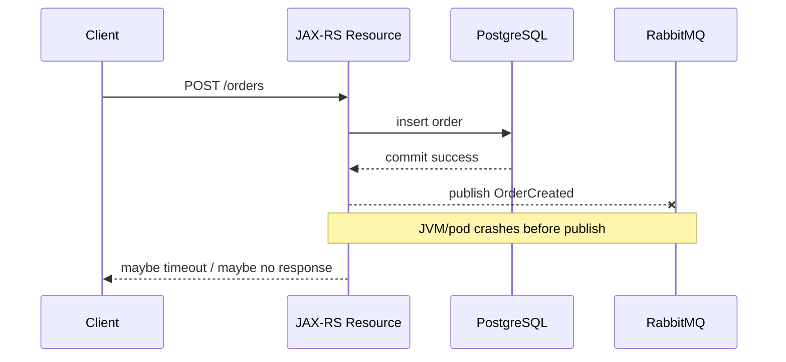
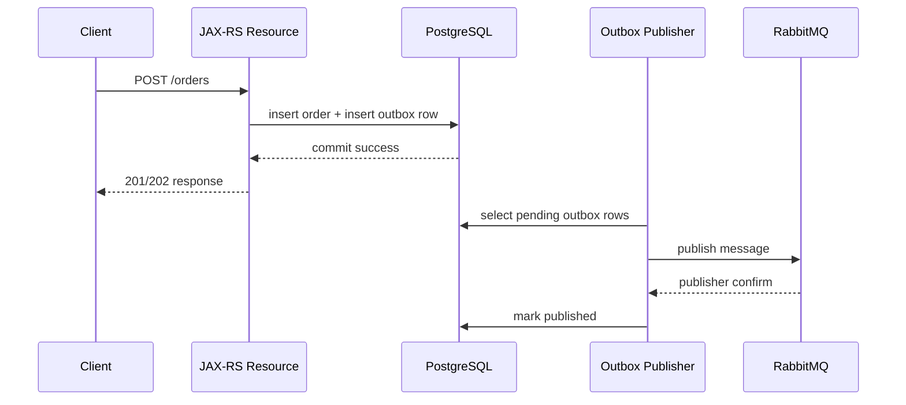
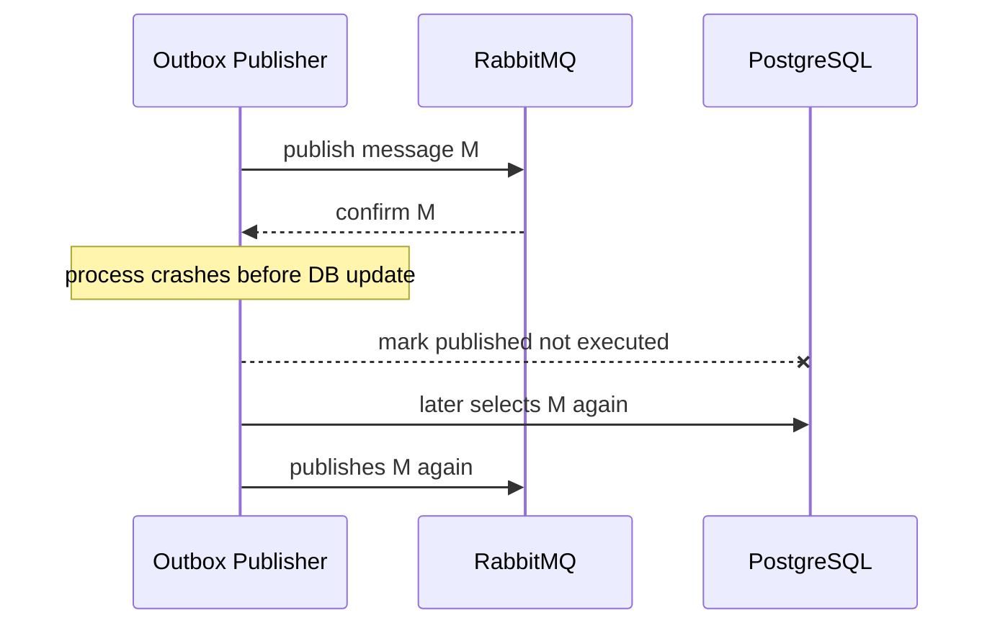

# Outbox Pattern with RabbitMQ

## 1. Core idea

Outbox pattern solves one specific problem:

```text
How do we change business state in PostgreSQL and publish a RabbitMQ message without losing the message when the process crashes?
```

The problem exists because PostgreSQL transaction commit and RabbitMQ publish are two different durability systems.

A Java/JAX-RS service cannot make this operation atomic by doing this:

```text
1. write business row to PostgreSQL
2. commit PostgreSQL transaction
3. publish message to RabbitMQ
```

There is a crash window between step 2 and step 3.

If the JVM, pod, node, broker connection, or deployment dies after the database commit but before the publish succeeds, the business state exists but the message is missing.

Outbox changes the shape:

```text
1. write business row to PostgreSQL
2. write outbox row in the same PostgreSQL transaction
3. commit
4. separate publisher reads outbox rows
5. publish to RabbitMQ
6. wait for publisher confirm
7. mark outbox row as published
```

The outbox row becomes the durable intent to publish.

The broker publish becomes eventually consistent with the database commit.

This does not create exactly-once delivery.

It creates recoverable publication.

---

## 2. Why outbox exists

In a distributed system, the common failure is not total failure.

The common failure is partial success:

```text
Database commit succeeded.
RabbitMQ publish failed.
```

Or:

```text
RabbitMQ publish succeeded.
Application did not observe confirm.
Outbox row was not marked published.
Same message may be published again.
```

Outbox exists because these partial states are normal.

The pattern accepts this reality:

```text
You cannot make PostgreSQL commit and RabbitMQ publish a single atomic transaction.
You can make publication durable, retryable, observable, and idempotency-compatible.
```

For senior backend systems, outbox is not just an integration pattern.

It is a correctness boundary.

---

## 3. The failure it prevents

Without outbox:



Final state:

```text
order row exists
OrderCreated message missing
downstream services never learn about the order
```

With outbox:



Final state after crash/retry:

```text
order row exists
outbox row exists until publication is confirmed
message can be retried
missing publish becomes detectable
```

---

## 4. Outbox lifecycle

A practical outbox lifecycle:

```text
NEW/PENDING
  -> LOCKED/IN_PROGRESS
  -> PUBLISHED
  -> FAILED_RETRYABLE
  -> FAILED_PERMANENT / PARKED
  -> ARCHIVED / DELETED
```

Not every implementation needs all states, but every implementation needs to answer:

```text
Is this message waiting to be published?
Is a publisher currently trying to publish it?
Was it published and confirmed?
Did publishing fail temporarily?
Did publishing fail permanently?
Can this row be safely retried?
Can this row be safely cleaned up?
```

Minimal status model:

```text
PENDING
PUBLISHED
FAILED
```

Production status model:

```text
PENDING
IN_PROGRESS
PUBLISHED
RETRYABLE_FAILED
PERMANENT_FAILED
CANCELLED
ARCHIVED
```

The status model must be operationally useful.

A status that cannot guide action is noise.

---

## 5. Canonical outbox table shape

A practical PostgreSQL outbox table should separate identity, routing, payload, status, retry, and audit.

Example shape:

```sql
CREATE TABLE message_outbox (
    id                  UUID PRIMARY KEY,
    aggregate_type      TEXT NOT NULL,
    aggregate_id        TEXT NOT NULL,
    message_type        TEXT NOT NULL,
    message_version     INTEGER NOT NULL,

    exchange_name       TEXT NOT NULL,
    routing_key         TEXT NOT NULL,

    payload             JSONB NOT NULL,
    headers             JSONB NOT NULL DEFAULT '{}'::jsonb,

    status              TEXT NOT NULL,
    attempt_count       INTEGER NOT NULL DEFAULT 0,
    next_attempt_at     TIMESTAMPTZ NOT NULL DEFAULT now(),
    last_error_code     TEXT,
    last_error_message  TEXT,

    created_at          TIMESTAMPTZ NOT NULL DEFAULT now(),
    locked_at           TIMESTAMPTZ,
    locked_by           TEXT,
    published_at        TIMESTAMPTZ,

    correlation_id      TEXT,
    causation_id        TEXT,
    trace_id            TEXT,
    tenant_id           TEXT,

    UNIQUE (message_type, aggregate_id, id)
);

CREATE INDEX idx_message_outbox_pending
ON message_outbox (next_attempt_at, created_at)
WHERE status IN ('PENDING', 'RETRYABLE_FAILED');

CREATE INDEX idx_message_outbox_aggregate
ON message_outbox (aggregate_type, aggregate_id, created_at);
```

Important fields:

| Field | Purpose |
|---|---|
| `id` | Stable message identity and deduplication key. |
| `aggregate_type` / `aggregate_id` | Business anchor for debugging and ordering. |
| `message_type` / `message_version` | Contract identity. |
| `exchange_name` / `routing_key` | RabbitMQ routing target. |
| `payload` | Actual business message. |
| `headers` | Transport/trace/retry metadata. |
| `status` | Publisher lifecycle state. |
| `attempt_count` | Retry governance. |
| `next_attempt_at` | Backoff scheduling. |
| `locked_at` / `locked_by` | Publisher concurrency control. |
| `published_at` | Confirmed publish timestamp. |
| `correlation_id` / `causation_id` / `trace_id` | Traceability across async boundaries. |
| `tenant_id` | Multi-tenant audit and isolation. |

Do not hide routing information in opaque application code only.

If production debugging needs to answer “where was this message supposed to go?”, the outbox row should help.

---

## 6. Same DB transaction rule

The outbox row must be inserted in the same PostgreSQL transaction as the business state change.

Correct:

```text
BEGIN
  insert/update business state
  insert outbox row
COMMIT
```

Incorrect:

```text
BEGIN
  insert/update business state
COMMIT

BEGIN
  insert outbox row
COMMIT
```

The second version still has a crash gap.

In Java/JAX-RS service code, the boundary should look like this conceptually:

```java
@Transactional
public CreateOrderResult createOrder(CreateOrderCommand command) {
    Order order = orderService.createOrder(command);

    outboxMapper.insert(OutboxMessage.fromDomainEvent(
        OrderCreated.from(order),
        routing.exchange("order.events"),
        routing.key("order.created"),
        traceContext.current()
    ));

    return CreateOrderResult.accepted(order.id());
}
```

The outbox insert is part of application transaction logic, not an afterthought in a controller finally block.

---

## 7. JAX-RS request boundary

A common RabbitMQ path in JAX-RS:

```text
HTTP request
  -> resource method
  -> validation
  -> application service
  -> PostgreSQL transaction
  -> business mutation
  -> outbox insert
  -> commit
  -> HTTP response
  -> async outbox publisher later publishes to RabbitMQ
```

This affects API response semantics.

If the HTTP endpoint returns `201 Created` or `200 OK`, it can only truthfully claim:

```text
The command was accepted and local state was committed.
```

It cannot truthfully claim:

```text
All downstream consumers already processed the message.
```

For long-running async work, use response semantics like:

```text
202 Accepted
Location: /operations/{operationId}
```

Or return a domain ID with explicit processing status.

Do not imply synchronous completion when the architecture is asynchronous.

---

## 8. Publisher process model

The outbox publisher can be implemented as:

```text
embedded worker inside service
separate deployment consuming the same database
scheduled job
CDC-based publisher
platform-managed relay
```

This part focuses on polling publisher, because it is common with PostgreSQL/MyBatis/JDBC and easier to reason about.

Polling publisher loop:

```text
while running:
  select pending rows eligible for publish
  lock rows
  publish each row to RabbitMQ
  wait for publisher confirm
  mark published or mark failed
  sleep/backoff when no work
```

The publisher must be idempotent at the publication level.

If it crashes after publish confirm but before marking published, it may publish the same message again.

Consumer-side idempotency is required.

---

## 9. Locking outbox rows with SKIP LOCKED

Multiple publisher workers need safe row claiming.

PostgreSQL `FOR UPDATE SKIP LOCKED` is a common mechanism.

Conceptual query:

```sql
WITH candidate AS (
    SELECT id
    FROM message_outbox
    WHERE status IN ('PENDING', 'RETRYABLE_FAILED')
      AND next_attempt_at <= now()
    ORDER BY created_at
    LIMIT #{batchSize}
    FOR UPDATE SKIP LOCKED
)
UPDATE message_outbox o
SET status = 'IN_PROGRESS',
    locked_at = now(),
    locked_by = #{workerId},
    attempt_count = attempt_count + 1
FROM candidate c
WHERE o.id = c.id
RETURNING o.*;
```

The intent:

```text
multiple workers can claim different rows
workers do not block each other on already locked rows
rows remain durable if worker crashes
```

Important nuance:

`SKIP LOCKED` is a concurrency tool, not a correctness proof by itself.

You still need:

```text
status transition discipline
lock timeout/stale lock recovery
retry budget
unique message ID
consumer idempotency
monitoring for stuck IN_PROGRESS rows
```

---

## 10. Stale lock recovery

A publisher may crash after marking a row `IN_PROGRESS`.

Without stale lock recovery, that row can be stuck forever.

Recovery query concept:

```sql
UPDATE message_outbox
SET status = 'RETRYABLE_FAILED',
    locked_at = NULL,
    locked_by = NULL,
    next_attempt_at = now() + interval '30 seconds',
    last_error_code = 'STALE_LOCK'
WHERE status = 'IN_PROGRESS'
  AND locked_at < now() - interval '5 minutes';
```

The stale threshold must reflect:

```text
normal publish batch duration
RabbitMQ confirm timeout
network latency
database load
expected maximum processing time per publish attempt
```

Too short creates duplicate publish pressure.

Too long delays recovery.

---

## 11. Publisher confirm integration

Outbox publisher should not mark a row as published just because `basicPublish` returned.

`basicPublish` means the client attempted to send data to the broker connection/channel.

For publication safety, the publisher should use publisher confirms.

Correct shape:

```text
publish message
wait for confirm / async confirm callback
only then mark outbox row as PUBLISHED
```

Pseudo-code:

```java
channel.confirmSelect();

for (OutboxMessage msg : batch) {
    AMQP.BasicProperties props = buildProperties(msg);

    channel.basicPublish(
        msg.exchangeName(),
        msg.routingKey(),
        true, // mandatory
        props,
        serialize(msg.payload())
    );

    boolean confirmed = channel.waitForConfirms(confirmTimeoutMillis);

    if (confirmed) {
        outboxMapper.markPublished(msg.id());
    } else {
        outboxMapper.markRetryableFailed(msg.id(), "CONFIRM_TIMEOUT");
    }
}
```

Production code often uses asynchronous confirms for throughput.

But the invariant stays the same:

```text
Only confirmed publish may transition outbox row to PUBLISHED.
```

---

## 12. Mandatory flag and unroutable messages

Publisher confirm answers:

```text
Did the broker accept responsibility for the publish?
```

It does not automatically mean:

```text
The message was routed to the intended queue.
```

For routing safety, use the `mandatory` flag and a return listener/handler where appropriate.

Failure case:

```text
exchange exists
routing key has no matching binding
message is accepted but unroutable unless mandatory/alternate exchange handles it
```

Outbox status should distinguish:

```text
broker unavailable
confirm timeout
unroutable message
permission failure
serialization failure
invalid exchange/routing key
```

Unroutable is often not transient.

It may indicate topology drift, config error, wrong environment, wrong vhost, missing binding, or broken deployment order.

---

## 13. Duplicate publish is expected

Outbox prevents lost publish.

It does not prevent duplicate publish.

Duplicate publish scenario:



Final state:

```text
same logical message may be delivered twice
```

Therefore:

```text
Outbox requires idempotent consumers.
```

The outbox message `id` should become the consumer deduplication key.

Consumer must be able to say:

```text
I have already processed message_id = X.
```

---

## 14. Message identity design

The outbox row ID should be stable and included in RabbitMQ message metadata.

Recommended identity fields:

```text
message_id      -> outbox row UUID
correlation_id  -> request/workflow ID
causation_id    -> message/command that caused this message
aggregate_id    -> business entity ID
message_type    -> contract type
message_version -> contract version
```

AMQP properties and headers example:

```java
AMQP.BasicProperties properties = new AMQP.BasicProperties.Builder()
    .messageId(outbox.id().toString())
    .correlationId(outbox.correlationId())
    .contentType("application/json")
    .deliveryMode(2) // persistent
    .headers(Map.of(
        "message_type", outbox.messageType(),
        "message_version", outbox.messageVersion(),
        "causation_id", outbox.causationId(),
        "tenant_id", outbox.tenantId(),
        "traceparent", outbox.traceparent()
    ))
    .build();
```

Do not generate a new message ID on every retry.

That destroys deduplication.

---

## 15. Persistent message and durable topology

Outbox alone does not guarantee broker-side survival.

The publish must align with RabbitMQ durability:

```text
durable exchange
durable queue
persistent message
publisher confirm
appropriate queue type and policy
```

If the outbox publishes transient messages to non-durable queues, a broker restart can still lose messages after they are marked `PUBLISHED`.

The application-level invariant should be explicit:

```text
A message is marked PUBLISHED only after RabbitMQ confirms durable acceptance under the intended durability policy.
```

For classic queues, quorum queues, and streams, durability/performance trade-offs differ.

Do not assume all queues behave the same.

---

## 16. Serialization boundary

Serialization can fail after the business transaction commits if payload generation is delayed until publish time.

Safer model:

```text
inside business transaction:
  build payload
  validate payload
  serialize or store JSON payload
  insert outbox row
```

If serialization is deferred, this can happen:

```text
business state committed
outbox row points to data
publisher later fails to serialize because data shape changed or mapper broke
```

Practical rule:

```text
The outbox row should contain the exact payload to publish, not merely instructions to reconstruct it later.
```

This improves:

```text
repeatability
auditability
schema version stability
replay safety
incident debugging
```

---

## 17. Payload snapshot vs live lookup

Two possible outbox models:

| Model | Description | Risk |
|---|---|---|
| Payload snapshot | Store final message payload in outbox. | Larger table, retention concern. |
| Live lookup | Store entity ID and reconstruct during publish. | Payload can change; event may no longer represent original state. |

For events, prefer payload snapshot.

For commands, payload snapshot is also usually safer because the command is the instruction.

Live lookup can be acceptable for large payloads if carefully versioned, but it weakens auditability.

In CPQ/order systems, temporal correctness matters.

A `QuoteApproved` event should represent the approval as it happened, not whatever the quote looks like when the publisher retries later.

---

## 18. Ordering considerations

Outbox can preserve order only within a chosen boundary.

Possible ordering boundaries:

```text
global outbox order
per aggregate order
per tenant order
per message type order
no strict order
```

Global ordering is expensive and often unnecessary.

Per-aggregate ordering is usually more useful:

```text
all messages for order_id = O-123 should publish in state-transition order
```

Schema support:

```sql
aggregate_type TEXT NOT NULL,
aggregate_id TEXT NOT NULL,
aggregate_version BIGINT,
created_at TIMESTAMPTZ NOT NULL
```

Publisher selection can enforce per-aggregate order by not publishing version N+1 before N.

But this reduces concurrency and increases operational complexity.

Ask first:

```text
Does the consumer require ordering, or can it reject stale transitions using version checks?
```

Ordering should be a documented business requirement, not an accidental property of one queue.

---

## 19. Retry strategy for outbox publish

Outbox publish failures should be classified.

| Failure | Retry? | Notes |
|---|---:|---|
| RabbitMQ temporarily unavailable | Yes | Backoff. Alert if prolonged. |
| Connection reset | Yes | Reconnect and retry. |
| Confirm timeout | Yes, carefully | May duplicate. Consumers must dedup. |
| Serialization error | Usually no | Payload/code bug. Needs repair. |
| Exchange not found | Usually no/alert | Topology/config drift. |
| Permission denied | Usually no/alert | Security/config issue. |
| Unroutable message | Usually no/alert | Missing binding/routing bug unless topology is eventually created. |
| Payload violates contract | No | Contract bug. |

Backoff model:

```text
attempt 1: immediate
attempt 2: +10s
attempt 3: +1m
attempt 4: +5m
attempt 5: +15m
then park / alert
```

Do not retry permanently invalid messages forever.

Outbox retry storm can overload RabbitMQ and PostgreSQL at the same time.

---

## 20. Mark published semantics

A row can be marked `PUBLISHED` only after all required publish conditions are true.

Minimum:

```text
message serialized
publish sent to correct exchange/routing key
broker confirm received
return listener did not report unroutable message
```

If using asynchronous confirms, maintain an in-memory map:

```text
sequence number -> outbox message id
```

On confirm callback:

```text
mark published
```

On nack/timeout:

```text
mark retryable failed
```

Be careful with batch confirms.

A multiple confirm can acknowledge many sequence numbers.

The implementation must update all affected outbox rows safely.

---

## 21. Cleanup and retention

Outbox rows are operational records.

They should not grow forever.

Retention policy should depend on:

```text
compliance/audit requirements
replay needs
incident investigation window
payload sensitivity
storage cost
message volume
```

Common retention options:

```text
keep full payload for 7-30 days
archive metadata only after payload deletion
partition outbox table by time
move old rows to audit/archive table
hard delete after compliance window
```

Example cleanup:

```sql
DELETE FROM message_outbox
WHERE status = 'PUBLISHED'
  AND published_at < now() - interval '30 days';
```

For high volume systems, prefer partitioning or batched cleanup.

A cleanup job that locks a huge table can become its own incident.

---

## 22. Outbox observability

Outbox must be visible.

Metrics:

```text
outbox_pending_count
outbox_in_progress_count
outbox_retryable_failed_count
outbox_permanent_failed_count
outbox_oldest_pending_age_seconds
outbox_publish_attempt_rate
outbox_publish_success_rate
outbox_publish_failure_rate
outbox_confirm_latency_ms
outbox_batch_size
outbox_stale_lock_count
```

Useful dashboard questions:

```text
How many messages are waiting?
How old is the oldest pending message?
Is publish rate lower than insert rate?
Are confirm latencies increasing?
Which message types are failing?
Which routing keys are failing?
Are failures concentrated in one tenant/service/message type?
```

Alert on age, not only count.

A queue of 100 pending messages may be normal.

One pending message stuck for 2 hours may be a correctness incident.

---

## 23. Outbox and RabbitMQ Management UI

When debugging outbox publication, correlate:

```text
outbox status
RabbitMQ publish rate
exchange existence
binding existence
queue depth
unroutable returns
publisher confirms/nacks
connection/channel errors
```

A practical debugging path:

```text
1. Find outbox row by message_id / correlation_id.
2. Check status, attempt_count, next_attempt_at, last_error.
3. Check intended exchange and routing key.
4. Verify exchange exists in expected vhost.
5. Verify binding matches routing key.
6. Check publisher logs for confirm/return/channel close.
7. Check RabbitMQ publish rate and connection state.
8. Check target queue depth and consumer status.
```

Do not jump directly to “RabbitMQ lost the message”.

Most missing-message investigations are topology, transaction, confirm, return, or consumer idempotency issues.

---

## 24. Outbox with MyBatis/JDBC

MyBatis fits outbox well because SQL is explicit.

Mapper operations:

```text
insertOutboxMessage
claimPendingOutboxMessages
markPublished
markRetryableFailed
markPermanentFailed
releaseStaleLocks
deletePublishedOlderThan
```

Key concern:

```text
Ensure mapper methods participate in the same transaction as business writes.
```

Anti-pattern:

```java
orderMapper.insert(order);
transactionManager.commit();
outboxMapper.insert(message); // too late
```

Correct:

```java
transactionTemplate.execute(status -> {
    orderMapper.insert(order);
    outboxMapper.insert(message);
    return order.id();
});
```

Also verify:

```text
JDBC autocommit disabled inside transaction
mapper uses the intended datasource
no accidental separate SqlSession outside transaction
no post-commit event listener writing outbox without durability guarantee
```

---

## 25. Outbox and JPA/Hibernate coexistence

If a service uses both JPA and MyBatis, the outbox boundary needs extra care.

Risk examples:

```text
JPA entity changes are not flushed before MyBatis outbox insert uses derived values
MyBatis writes outbox through a different transaction/session
domain event generated from stale JPA entity state
JPA rollback occurs after outbox insert if transaction management is misconfigured
```

Review questions:

```text
Are JPA and MyBatis sharing the same transaction manager?
Is flush timing explicit where needed?
Is outbox insert guaranteed to rollback with business state?
Is the payload generated from authoritative state?
Are entity listeners used, and are they safe?
```

Avoid hidden outbox writes from ORM lifecycle callbacks unless the team has a very clear convention.

Outbox should be explicit in application service flow.

---

## 26. CDC-based outbox awareness

Some systems publish outbox rows via CDC, such as Debezium.

In that model:

```text
service writes outbox row
PostgreSQL WAL records change
CDC connector reads row change
connector publishes event to broker/stream
```

Benefits:

```text
no polling query load
transaction order can be captured from WAL
publication is decoupled from application runtime
```

Risks:

```text
connector lag
replication slot/WAL retention pressure
schema changes breaking connector
harder local debugging
operational dependency on CDC platform
RabbitMQ-specific routing may require transformation layer
```

If CDC is used internally, verify the exact path.

Do not assume polling publisher if the platform uses CDC.

Do not assume CDC if the application code contains a poller.

---

## 27. Outbox in Kubernetes

When the outbox publisher runs in Kubernetes, consider:

```text
replica count
leader election or SKIP LOCKED concurrency
pod shutdown
in-flight confirms during termination
connection recovery
readiness probe behavior
resource limits
CPU throttling
DB connection pool pressure
connection storm on rollout
```

Shutdown invariant:

```text
Do not mark a row published unless its confirm was observed.
```

If pod receives SIGTERM:

```text
stop claiming new rows
drain in-flight publish attempts
mark unknown rows retryable or leave them for stale lock recovery
close channel/connection cleanly
```

Kubernetes rollout can create a burst of publishers.

Make sure publisher concurrency and DB pool sizing match deployment behavior.

---

## 28. Outbox in CPQ/order management context

Example conceptual uses:

```text
QuoteCreated
QuotePriced
QuoteApproved
OrderSubmitted
OrderValidated
OrderDecomposed
FulfillmentRequested
FalloutDetected
BillingActivationRequested
```

The outbox protects this invariant:

```text
If local state transition commits, the integration intent is durable.
```

It does not guarantee:

```text
downstream service processed it
customer saw correct status immediately
external system accepted it
message was processed once
```

For quote/order lifecycle, outbox row should carry enough business context:

```text
quote_id/order_id
state transition
previous state if useful
new state
version/sequence
tenant/customer/account context
correlation/causation ID
```

Internal verification must determine actual message names and topology.

Do not invent CSG exchange, queue, vhost, or routing keys.

---

## 29. Failure modes

### 29.1 Business row committed, outbox row missing

Likely cause:

```text
outbox insert not in same transaction
exception swallowed
conditional event emission bug
post-commit listener failure
```

Impact:

```text
irrecoverable unless reconciliation can infer missing event
```

Mitigation:

```text
same transaction rule
reconciliation job
business invariant checks
integration tests
```

### 29.2 Outbox row exists but never published

Likely cause:

```text
publisher down
stale IN_PROGRESS lock
next_attempt_at in future
bad status transition
query index issue
```

Mitigation:

```text
oldest pending age alert
stale lock recovery
publisher health dashboard
```

### 29.3 Outbox publishes duplicates

Likely cause:

```text
confirm observed but markPublished failed
confirm timeout ambiguity
publisher retry after crash
manual replay
```

Mitigation:

```text
consumer inbox/idempotency
stable message_id
dedup metrics
```

### 29.4 Outbox retry storm

Likely cause:

```text
broker down
permission error treated as transient
unroutable treated as transient
too aggressive backoff
many pods retrying simultaneously
```

Mitigation:

```text
failure classification
exponential backoff with jitter
retry budget
circuit breaker around publisher
operator alert
```

### 29.5 Outbox table grows too large

Likely cause:

```text
no cleanup
publisher lag
permanent failures not handled
payload retention too long
```

Mitigation:

```text
retention policy
partitioning
batch cleanup
archive strategy
```

---

## 30. Debugging checklist

When someone says “event was not sent”:

```text
1. Find business entity and state transition.
2. Check whether outbox row exists.
3. If missing, inspect transaction/application logic.
4. If present, check status and attempt_count.
5. Check next_attempt_at and locked_at.
6. Check publisher logs for this message_id.
7. Check RabbitMQ exchange/routing key/vhost.
8. Check mandatory return/unroutable handling.
9. Check publisher confirm result.
10. Check target queue depth and consumer status.
11. Check inbox/consumer dedup table for message_id.
12. Check DLQ/retry queue if consumer rejected it.
```

Debug by lifecycle.

Do not debug by intuition.

---

## 31. Testing strategy

Required tests:

```text
business transaction inserts outbox row
rollback removes business row and outbox row
publisher claims only pending rows
multiple publishers do not claim same row
publisher confirm marks published
confirm timeout marks retryable failed
unroutable message is detected
serialization failure parks message
stale lock recovery works
cleanup does not delete unprocessed rows
```

Integration tests should use:

```text
PostgreSQL/Testcontainers
RabbitMQ/Testcontainers
real MyBatis/JDBC transaction manager
real RabbitMQ Java client if practical
```

Important crash-window tests:

```text
crash after DB commit before publish -> row remains pending
crash after publish before mark published -> duplicate possible, consumer dedups
```

Do not only test happy-path publish.

Outbox value appears during failure.

---

## 32. PR review checklist

Ask these questions in PR/design review:

```text
Is the outbox row inserted in the same DB transaction as the business change?
Is the message ID stable across retries?
Is payload snapshot stored, or reconstructed later?
Is publisher confirm required before markPublished?
Is mandatory publishing/return handling used where routing safety matters?
Are unroutable messages classified separately from transient failures?
Is duplicate publish expected and handled by consumers?
Is SKIP LOCKED or equivalent used safely for concurrent publishers?
Is stale IN_PROGRESS recovery implemented?
Is retry backoff bounded and observable?
Is outbox age monitored?
Is cleanup/retention defined?
Is payload privacy considered?
Is topology as code aligned with exchange/routing key in outbox?
Are integration tests covering crash windows?
```

If these answers are vague, the design is not production-ready.

---

## 33. Internal verification checklist

Verify in the actual codebase/platform:

```text
Where are outbox tables defined?
Which services write outbox rows?
Which transaction manager owns business write + outbox write?
Are MyBatis mappers participating in the same transaction?
Are JPA/Hibernate and MyBatis mixed in the same transaction?
Is outbox payload stored as JSON, binary, or reconstructed later?
What are the outbox statuses and transitions?
How are rows claimed by publishers?
Is SKIP LOCKED used?
How are stale locks recovered?
How is publisher confirm implemented?
Is mandatory flag used?
How are returned/unroutable messages handled?
What RabbitMQ exchange/routing keys are stored?
Are exchange/queue/binding definitions managed as code?
What happens when RabbitMQ is unavailable?
What is the retry/backoff policy?
How are permanent failures parked?
What metrics/alerts exist for pending age and failures?
What is the retention/cleanup policy?
Who owns manual replay?
What incident notes mention outbox lag or missing messages?
```

Treat every unknown as a production risk until verified.

---

## 34. Key takeaways

Outbox does not make RabbitMQ exactly-once.

Outbox makes publication intent durable.

The main invariant:

```text
If business state commits, the message-to-publish is durably recorded in the same transaction.
```

The second invariant:

```text
A message is marked published only after RabbitMQ publish is confirmed under the intended routing and durability rules.
```

The unavoidable consequence:

```text
Duplicate publish can happen.
Consumers must be idempotent.
```

For senior backend review, outbox is not optional ceremony.

It is the line between:

```text
best-effort integration
```

and:

```text
recoverable distributed consistency
```

---

## 35. References

- RabbitMQ — Consumer Acknowledgements and Publisher Confirms: https://www.rabbitmq.com/docs/confirms
- RabbitMQ — Publishers: https://www.rabbitmq.com/docs/publishers
- RabbitMQ — Java Client API Guide: https://www.rabbitmq.com/client-libraries/java-api-guide
- PostgreSQL — SELECT documentation, including `FOR UPDATE SKIP LOCKED`: https://www.postgresql.org/docs/current/sql-select.html
