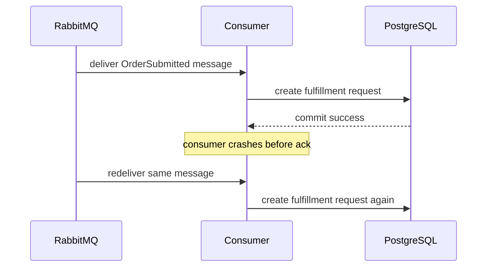
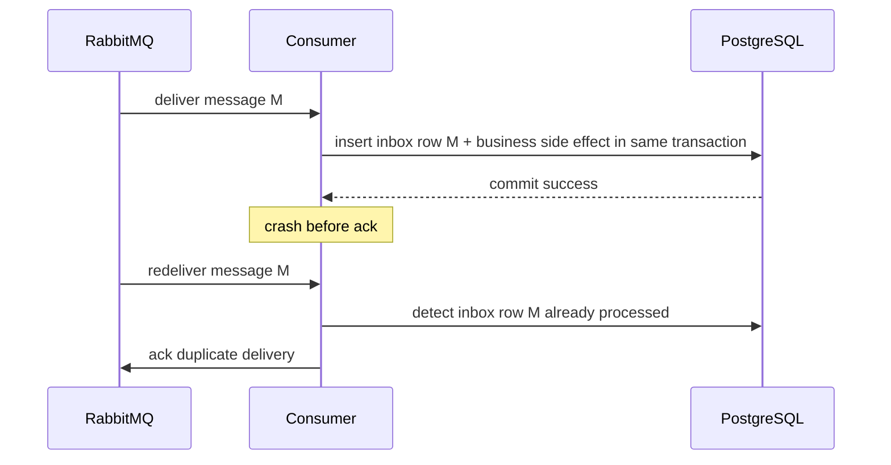
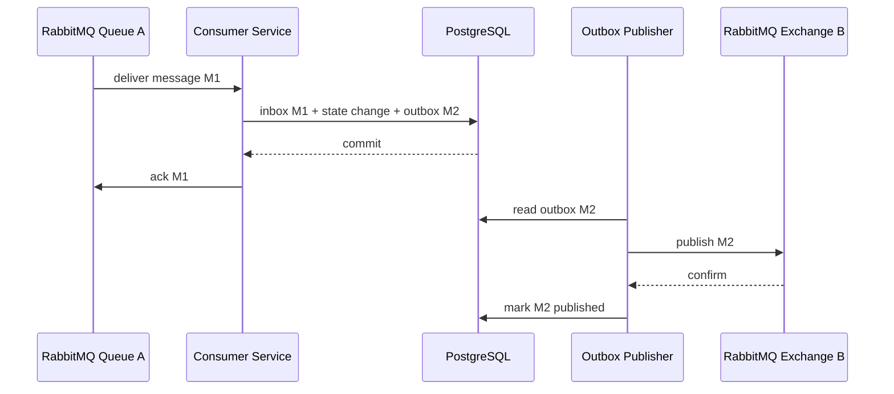

# Inbox Pattern with RabbitMQ

## 1. Core idea

Inbox pattern solves the consumer-side version of the messaging correctness problem:

```text
How do we process RabbitMQ messages safely when the same message can be delivered more than once?
```

RabbitMQ with manual acknowledgements gives at-least-once delivery when used correctly.

At-least-once means:

```text
A message should not be lost before processing.
```

It also means:

```text
A message may be delivered again.
```

Inbox pattern accepts duplicate delivery as normal.

It records received/processed message identity in PostgreSQL so the consumer can decide:

```text
Have I already processed this message?
Am I currently processing it?
Did it fail?
Can it be retried?
Should it be rejected/parked?
```

Inbox is not a performance optimization.

Inbox is a correctness ledger.

---

## 2. Why inbox exists

The dangerous consumer assumption is:

```text
RabbitMQ delivered this message once, so my consumer will run once.
```

That is false.

Duplicate delivery can happen when:

```text
consumer crashes after DB commit but before ack
consumer acks on wrong channel and fails
connection drops after processing before ack reaches broker
consumer times out and message is redelivered
publisher publishes duplicate after outbox retry
manual replay sends same message again
DLQ replay reintroduces old messages
operator requeues messages
```

Inbox exists because the consumer must protect business state from duplicate side effects.

---

## 3. The failure it prevents

Without inbox:



Final state:

```text
duplicate fulfillment request
duplicate downstream command
duplicate billing activation risk
duplicate notification risk
```

With inbox:



Final state:

```text
business side effect occurs once
duplicate delivery is acknowledged safely
```

---

## 4. Inbox lifecycle

A practical inbox row lifecycle:

```text
RECEIVED
  -> PROCESSING
  -> PROCESSED
  -> FAILED_RETRYABLE
  -> FAILED_PERMANENT / POISONED
  -> REPLAYED
  -> ARCHIVED / DELETED
```

Minimal model:

```text
PROCESSED only
```

This can be enough if processing is short and transactional.

Production model:

```text
RECEIVED
PROCESSING
PROCESSED
RETRYABLE_FAILED
PERMANENT_FAILED
POISONED
```

The status model should support operational questions:

```text
Was this message seen?
Was it processed?
Is it stuck?
Did it fail repeatedly?
Can it be replayed?
Should it be ignored as duplicate?
```

---

## 5. Canonical inbox table shape

Example PostgreSQL table:

```sql
CREATE TABLE message_inbox (
    message_id          UUID NOT NULL,
    consumer_name       TEXT NOT NULL,

    message_type        TEXT NOT NULL,
    message_version     INTEGER NOT NULL,
    aggregate_type      TEXT,
    aggregate_id        TEXT,

    status              TEXT NOT NULL,
    processing_attempt  INTEGER NOT NULL DEFAULT 0,
    first_received_at   TIMESTAMPTZ NOT NULL DEFAULT now(),
    last_received_at    TIMESTAMPTZ NOT NULL DEFAULT now(),
    processing_started_at TIMESTAMPTZ,
    processed_at        TIMESTAMPTZ,

    payload             JSONB,
    headers             JSONB NOT NULL DEFAULT '{}'::jsonb,

    last_error_code     TEXT,
    last_error_message  TEXT,

    correlation_id      TEXT,
    causation_id        TEXT,
    trace_id            TEXT,
    tenant_id           TEXT,

    PRIMARY KEY (message_id, consumer_name)
);

CREATE INDEX idx_message_inbox_status
ON message_inbox (consumer_name, status, first_received_at);

CREATE INDEX idx_message_inbox_aggregate
ON message_inbox (aggregate_type, aggregate_id, first_received_at);
```

Why include `consumer_name` in the primary key?

Because the same message may be consumed by multiple services/subscribers.

Each consumer needs its own processing ledger.

```text
message_id = X, consumer = fulfillment-service -> processed
message_id = X, consumer = notification-service -> processed
message_id = X, consumer = audit-service -> processed
```

Do not use a global processed-message table if multiple independent consumers need to process the same event.

---

## 6. Inbox vs idempotency table

Inbox is a specific form of idempotency table for message consumers.

General idempotency table:

```text
request_id / idempotency_key -> result
```

Inbox table:

```text
message_id + consumer_name -> processing state
```

Business idempotency may still be required.

Example:

```text
message_id differs but both commands represent the same business operation
```

Such as:

```text
two different OrderActivationRequested messages for the same order version
```

Inbox catches exact duplicate messages.

Business idempotency catches logically duplicate operations.

You often need both.

---

## 7. Deduplication key design

Preferred dedup key:

```text
AMQP message_id generated by producer/outbox
```

If producer is not controlled:

```text
external_event_id
business operation ID
correlation ID + message type + aggregate version
hash of stable payload fields
```

Bad dedup keys:

```text
current timestamp
random ID generated by consumer
delivery tag
RabbitMQ queue name only
payload hash including non-deterministic fields
```

Important:

```text
delivery tag is not a message identity
```

Delivery tag identifies a delivery on a channel.

It changes across redelivery and is scoped to channel.

It must not be used as the inbox dedup key.

---

## 8. Correct consumer transaction shape

The core consumer invariant:

```text
Inbox state and business side effect must commit atomically.
```

Correct shape:

```text
receive RabbitMQ delivery
begin PostgreSQL transaction
  insert/claim inbox row
  if already PROCESSED -> commit and ack
  perform business side effect
  mark inbox PROCESSED
commit PostgreSQL transaction
ack RabbitMQ message
```

Pseudo-code:

```java
public void handleDelivery(Delivery delivery) {
    MessageEnvelope envelope = deserialize(delivery);

    try {
        transactionTemplate.execute(status -> {
            InboxDecision decision = inboxMapper.tryStartProcessing(
                envelope.messageId(),
                consumerName,
                envelope.metadata(),
                envelope.payload()
            );

            if (decision == InboxDecision.ALREADY_PROCESSED) {
                return null;
            }

            orderService.applyMessage(envelope);
            inboxMapper.markProcessed(envelope.messageId(), consumerName);
            return null;
        });

        channel.basicAck(delivery.getEnvelope().getDeliveryTag(), false);
    } catch (RetryableException e) {
        channel.basicNack(delivery.getEnvelope().getDeliveryTag(), false, false);
    } catch (PermanentException e) {
        channel.basicReject(delivery.getEnvelope().getDeliveryTag(), false);
    }
}
```

Ack happens after DB commit.

Not before.

---

## 9. The ack-after-commit rule

If you ack before commit:

```text
RabbitMQ considers message done
DB transaction may fail
message will not be redelivered
side effect is lost
```

Bad:

```text
receive message
ack RabbitMQ
write database
commit fails
```

Correct:

```text
receive message
write database + inbox
commit succeeds
ack RabbitMQ
```

If crash happens after commit but before ack:

```text
message is redelivered
inbox detects already processed
consumer acks duplicate
```

This is the intended failure mode.

---

## 10. Insert-first dedup strategy

A common strategy uses unique constraint:

```sql
PRIMARY KEY (message_id, consumer_name)
```

Processing flow:

```text
try insert inbox row with PROCESSING
if insert succeeds -> this consumer owns first processing attempt
if duplicate key -> load existing inbox row
  if PROCESSED -> ack as duplicate
  if PROCESSING and stale -> decide recovery
  if FAILED -> decide retry/replay policy
```

Example MyBatis operation:

```sql
INSERT INTO message_inbox (
    message_id,
    consumer_name,
    message_type,
    message_version,
    aggregate_type,
    aggregate_id,
    status,
    payload,
    headers,
    correlation_id,
    causation_id,
    trace_id,
    tenant_id
) VALUES (
    #{messageId},
    #{consumerName},
    #{messageType},
    #{messageVersion},
    #{aggregateType},
    #{aggregateId},
    'PROCESSING',
    #{payload}::jsonb,
    #{headers}::jsonb,
    #{correlationId},
    #{causationId},
    #{traceId},
    #{tenantId}
)
ON CONFLICT (message_id, consumer_name) DO NOTHING;
```

Then check affected row count.

This leverages PostgreSQL uniqueness as the concurrency guard.

---

## 11. Business side effect design

Inbox dedups messages.

Business logic still needs invariants.

Example:

```text
OrderSubmitted message should transition order from DRAFT to SUBMITTED.
```

Safe state update:

```sql
UPDATE orders
SET status = 'SUBMITTED',
    version = version + 1
WHERE order_id = #{orderId}
  AND status = 'DRAFT';
```

Then validate affected rows.

Do not blindly set state if ordering matters.

For state machines:

```text
message idempotency protects duplicate delivery
state transition guard protects invalid repeated or out-of-order operation
```

Both are needed.

---

## 12. Processing status and retry state

RabbitMQ retry/DLQ topology and inbox status must not contradict each other.

Possible statuses:

| Status | Meaning | RabbitMQ action |
|---|---|---|
| `PROCESSING` | Transaction currently attempting work. | No ack yet. |
| `PROCESSED` | Business side effect committed. | Ack. |
| `RETRYABLE_FAILED` | Attempt failed but can retry. | Nack/reject to retry topology or let redelivery happen. |
| `PERMANENT_FAILED` | Invalid message/contract/business rule. | Reject/dead-letter/park. |
| `POISONED` | Repeated failure beyond budget. | Dead-letter/parking lot. |

Avoid this mismatch:

```text
inbox says PROCESSED but message is sent to DLQ
```

Or:

```text
inbox says FAILED but message was acked and no retry path exists
```

Inbox status should mirror reality.

---

## 13. Payload storage in inbox

Storing payload in inbox helps:

```text
incident investigation
manual replay validation
auditability
schema migration analysis
poison message diagnosis
consumer regression test generation
```

Risks:

```text
PII retention
large table growth
sensitive headers persisted
data deletion/privacy obligations
```

Practical approach:

```text
store payload for failed/poison messages
store metadata for processed messages
apply retention by message type/data classification
redact or encrypt sensitive fields if required
```

Do not store secrets in headers or payload just because inbox makes it convenient.

---

## 14. Poison message tracking

Poison message means:

```text
a message that repeatedly fails and is unlikely to succeed by immediate retry
```

Causes:

```text
invalid schema
unsupported message version
missing required business entity
violated state transition
non-retryable downstream response
bug in consumer code
corrupt payload
permission/data access issue
```

Inbox can track poison state:

```text
message_id
consumer_name
attempt_count
last_error_code
last_error_message
first_failed_at
last_failed_at
payload snapshot
headers
```

A poison message should not block the entire queue indefinitely.

It should move to DLQ/parking lot with enough context to investigate.

---

## 15. Replay handling

Replay means processing a message again intentionally.

Replay can come from:

```text
DLQ replay
parking lot replay
manual requeue
outbox republish
operator script
backfill job
```

Inbox affects replay.

If inbox row is already `PROCESSED`, replay will be ignored.

That may be correct for duplicate suppression.

But for repair, you may need a separate mode:

```text
force replay with new operation ID
reprocess only if business state still needs repair
clear/reopen inbox row with audit approval
publish compensating message instead of replaying original
```

Do not casually delete inbox rows to “make replay work”.

That removes audit evidence and can trigger duplicate side effects.

---

## 16. Inbox cleanup and retention

Retention depends on deduplication window and audit needs.

Questions:

```text
How long can RabbitMQ redeliver or replay old messages?
How long can DLQ replay occur?
How long must duplicate detection be guaranteed?
What compliance retention applies to payload?
How large is message volume?
```

If DLQ replay can happen after 30 days but inbox processed rows are deleted after 7 days, duplicates can re-trigger side effects.

Align retention windows:

```text
inbox processed retention >= maximum replay window
```

If payload must be deleted earlier for privacy, retain metadata hash/message ID longer.

---

## 17. Inbox observability

Inbox metrics:

```text
inbox_processed_count
inbox_duplicate_count
inbox_retryable_failed_count
inbox_permanent_failed_count
inbox_poison_count
inbox_processing_age_seconds
inbox_oldest_unprocessed_age_seconds
inbox_attempt_count_distribution
consumer_processing_latency_ms
consumer_db_transaction_latency_ms
```

Useful dashboard questions:

```text
Are duplicates increasing?
Which message types fail most?
Are failures concentrated by tenant or aggregate?
Are messages stuck in PROCESSING?
How long does processing take?
Are retry attempts aligned with RabbitMQ redelivery count/x-death?
```

Duplicate count is not automatically bad.

A sudden spike is worth investigating.

It may indicate publisher confirm ambiguity, consumer crash, connection instability, or replay activity.

---

## 18. Inbox and RabbitMQ redelivery

RabbitMQ redelivery flag means the broker has delivered this message before.

It does not prove whether your business transaction committed.

Inbox answers that question.

Handling redelivery:

```text
if inbox says PROCESSED:
  ack immediately
if inbox says PROCESSING and stale:
  recover according to policy
if inbox says RETRYABLE_FAILED:
  decide whether to retry now or reject to retry topology
if inbox row missing:
  process as first delivery
```

Do not treat redelivered=true as an error by itself.

Redelivery is part of at-least-once operation.

---

## 19. Inbox and RabbitMQ DLQ/retry topology

Inbox should cooperate with retry/DLQ.

A clean model:

```text
consumer receives message
business processing succeeds -> mark PROCESSED -> ack
transient failure -> mark RETRYABLE_FAILED -> nack/reject false to retry/DLQ topology
permanent failure -> mark PERMANENT_FAILED/POISONED -> reject false -> DLQ/parking lot
```

But beware:

```text
if the DB transaction that marks RETRYABLE_FAILED rolls back, your inbox does not record failure
if you nack before recording failure, debugging loses context
if you record failure and then ack by mistake, retry will not happen
```

The action and the recorded state must align.

---

## 20. Consumer concurrency

Multiple consumer instances may receive duplicates or related messages concurrently.

Inbox primary key prevents exact duplicate concurrent processing:

```text
consumer A inserts inbox row for message M
consumer B attempts insert for same M
unique constraint blocks/ignores duplicate
```

But inbox does not prevent concurrent different messages for same aggregate:

```text
OrderSubmitted(message_id=1, order_id=O1)
OrderCancelled(message_id=2, order_id=O1)
```

For aggregate correctness, use additional controls:

```text
state transition guards
optimistic version
SELECT FOR UPDATE on aggregate row
per-aggregate ordering
single active consumer
business sequence number
```

Inbox is not a substitute for aggregate concurrency control.

---

## 21. Inbox with MyBatis/JDBC

MyBatis mapper operations:

```text
insertInboxIfAbsent
findInboxByMessageIdAndConsumer
markProcessing
markProcessed
markRetryableFailed
markPermanentFailed
markPoisoned
findStaleProcessing
cleanupProcessedOlderThan
```

The critical requirement:

```text
inbox insert/update and business side effect must share the same transaction
```

Correct transaction shape:

```java
transactionTemplate.execute(tx -> {
    InboxStartResult start = inboxMapper.tryStart(message, consumerName);

    if (start.alreadyProcessed()) {
        return ProcessingResult.duplicate();
    }

    businessMapper.applySideEffect(...);
    inboxMapper.markProcessed(message.id(), consumerName);
    return ProcessingResult.processed();
});
```

Then ack outside after commit.

If using framework annotations, verify transaction proxy actually wraps consumer method.

Message listener frameworks sometimes call methods in ways that bypass expected proxies if configured poorly.

---

## 22. Inbox with external side effects

External side effects are harder than database side effects.

Example:

```text
consumer receives message
calls external HTTP API
external API succeeds
consumer crashes before marking inbox PROCESSED
message redelivered
external API called again
```

Inbox cannot atomically cover external HTTP calls.

Mitigations:

```text
external API idempotency key
business operation ID
outbox command to external integration worker
state machine with pending/sent/acknowledged
reconciliation job
compensation flow
```

For external side effects, database inbox is necessary but not sufficient.

The external system must also support idempotency or reconciliation.

---

## 23. Inbox and outbox together

Many consumers also publish new messages.

Correct shape:

```text
receive message
begin DB transaction
  insert/check inbox
  apply business state transition
  insert outbox row for next message
  mark inbox processed
commit
ack original RabbitMQ message
outbox publisher later publishes next message
```

Diagram:



This is the common pattern for event-driven state machines.

It creates a durable handoff from incoming message to outgoing message.

---

## 24. Inbox in CPQ/order management context

Conceptual examples:

```text
pricing-service consumes QuotePricingRequested
approval-service consumes QuoteApprovalRequested
order-service consumes OrderSubmitted
fulfillment-service consumes FulfillmentRequested
fallout-service consumes FalloutDetected
notification-service consumes NotificationRequested
```

For each consumer, ask:

```text
What is the message identity?
What business side effect happens?
Can the side effect be repeated safely?
What state transition must be guarded?
What downstream command/event is emitted?
What happens if consumer crashes after DB commit before ack?
What happens if DLQ replay happens after days?
```

Internal topology and message names must be verified.

Do not infer actual CSG queue/exchange/routing key names without codebase/platform evidence.

---

## 25. Failure modes

### 25.1 Duplicate side effect despite inbox

Likely causes:

```text
message_id not stable
consumer_name missing from key or wrong
business side effect occurs outside inbox transaction
external API lacks idempotency
inbox row deleted before replay
```

### 25.2 Message stuck in PROCESSING

Likely causes:

```text
consumer crashed mid-transaction/status update
long transaction
bug in status transition
lock wait/deadlock
```

### 25.3 Inbox says PROCESSED but business state missing

Likely causes:

```text
inbox mark processed not in same transaction as business write
business write swallowed/conditional
wrong datasource/transaction manager
manual data repair changed business table only
```

### 25.4 RabbitMQ keeps redelivering message

Likely causes:

```text
consumer transaction fails before ack
ack not sent due connection/channel issue
ack on wrong channel
consumer rejects with requeue=true loop
exception handler always nacks
```

### 25.5 DLQ contains already processed messages

Likely causes:

```text
message processed but ack failed, later retry path rejected it
manual replay mishandled
consumer state and broker action inconsistent
```

---

## 26. Debugging checklist

When someone says “consumer processed this twice”:

```text
1. Find message_id from logs/header/inbox.
2. Check inbox row for message_id + consumer_name.
3. Verify message_id stability across attempts.
4. Check whether business side effect is in same transaction as inbox markProcessed.
5. Check RabbitMQ redelivery flag and x-death header.
6. Check consumer crash/restart/deployment timeline.
7. Check external side effects for idempotency key.
8. Check whether replay/manual requeue happened.
9. Check inbox retention/deletion history.
10. Check aggregate state transition guards.
```

When someone says “message is stuck”:

```text
1. Check queue ready/unacked counts.
2. Check consumer logs by correlation_id/message_id.
3. Check inbox status.
4. Check DB locks/deadlocks/timeouts.
5. Check retry/DLQ topology.
6. Check poison error classification.
7. Check whether consumer is acking/nacking correctly.
```

---

## 27. Testing strategy

Required tests:

```text
first delivery inserts inbox and applies business state
duplicate delivery after PROCESSED does not reapply side effect
duplicate delivery is acked safely
business failure does not mark PROCESSED
DB rollback rolls back inbox and side effect together
consumer crash after commit before ack leads to redelivery and dedup
external side effect uses idempotency key
poison message is marked and dead-lettered
DLQ replay of processed message is ignored or handled by policy
```

Integration tests should include:

```text
PostgreSQL/Testcontainers
RabbitMQ/Testcontainers
real transaction manager
manual ack consumer
redelivery simulation
duplicate publish simulation
```

Do not mock away transaction boundaries.

Inbox correctness lives exactly at the boundary where mocks are weakest.

---

## 28. Security and privacy concerns

Inbox can accidentally become a sensitive data lake.

Review:

```text
PII in payload
PII in headers
secrets accidentally copied from message headers
tenant/customer identifiers
retention period
access control to inbox table
log redaction for payload/error fields
right-to-delete implications
DLQ/replay payload access
```

Do not store full payload forever unless there is a clear compliance reason and access model.

For sensitive messages:

```text
store metadata and hash
store encrypted payload
store payload only for failed messages
redact fields before persistence
apply shorter retention
```

---

## 29. Performance concerns

Inbox adds database writes to consumer path.

Costs:

```text
insert per message
unique index check per message
status update per message
payload JSONB storage
cleanup workload
additional transaction duration
```

Mitigations:

```text
right-size indexes
avoid over-indexing payload
batch cleanup
partition by time for high volume
store large payload selectively
keep transaction short
avoid external calls inside DB transaction when possible
```

Do not remove inbox because it costs writes without understanding duplicate side-effect risk.

The right question is:

```text
Which message flows need durable deduplication?
```

Not:

```text
Can we avoid writing an inbox row everywhere?
```

---

## 30. PR review checklist

Ask these questions:

```text
What is the deduplication key?
Is message_id stable across retries and replays?
Is consumer_name part of the inbox key?
Are inbox and business side effect in the same DB transaction?
Is ack sent only after commit?
What happens if commit succeeds but ack fails?
What happens if external API succeeds but inbox mark fails?
Are state transitions idempotent?
Are duplicate deliveries tested?
Are redeliveries tested?
Is retry/DLQ behavior aligned with inbox status?
Is payload storage necessary and privacy-safe?
Is retention aligned with replay window?
Are stale PROCESSING rows detectable?
Are metrics and alerts defined?
```

If the answer is “RabbitMQ will only deliver once”, reject the design.

That assumption is unsafe.

---

## 31. Internal verification checklist

Verify in the actual codebase/platform:

```text
Which consumers use inbox/processed message table?
What is the table name and schema?
What is the deduplication key?
Is consumer/service name part of uniqueness?
Is inbox insert in the same transaction as business side effect?
Is ack after commit enforced by framework/code convention?
Are external calls made inside or outside transaction?
Are external calls idempotent?
How are retryable/permanent failures recorded?
How are poison messages tracked?
How does DLQ replay interact with inbox?
What is inbox retention?
Is payload stored? Is PII redacted/encrypted?
What metrics exist for duplicates, failures, and stale processing?
Which dashboards show consumer correctness?
What incident notes mention duplicate processing?
Who owns manual replay and repair?
```

Do not assume inbox exists because outbox exists.

They solve different sides of the problem.

---

## 32. Key takeaways

Inbox is the consumer-side guardrail for at-least-once messaging.

The main invariant:

```text
For each message_id + consumer_name, business side effects are applied at most once.
```

The transaction invariant:

```text
Inbox state and business state commit together.
```

The acknowledgement invariant:

```text
RabbitMQ ack happens only after durable processing commit.
```

Inbox does not replace:

```text
business state transition guards
external API idempotency
ordering controls
retry/DLQ design
reconciliation
```

But without inbox or equivalent idempotency, at-least-once delivery becomes duplicate side-effect risk.

For senior backend systems, inbox is not optional when duplicate effects are harmful.

It is the consumer-side half of reliable RabbitMQ integration.

---

## 33. References

- RabbitMQ — Consumer Acknowledgements and Publisher Confirms: https://www.rabbitmq.com/docs/confirms
- RabbitMQ — Reliability Guide: https://www.rabbitmq.com/docs/reliability
- RabbitMQ — Negative Acknowledgements: https://www.rabbitmq.com/docs/nack
- PostgreSQL — Explicit Locking: https://www.postgresql.org/docs/current/explicit-locking.html
