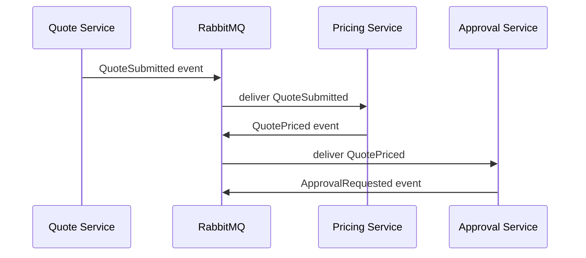
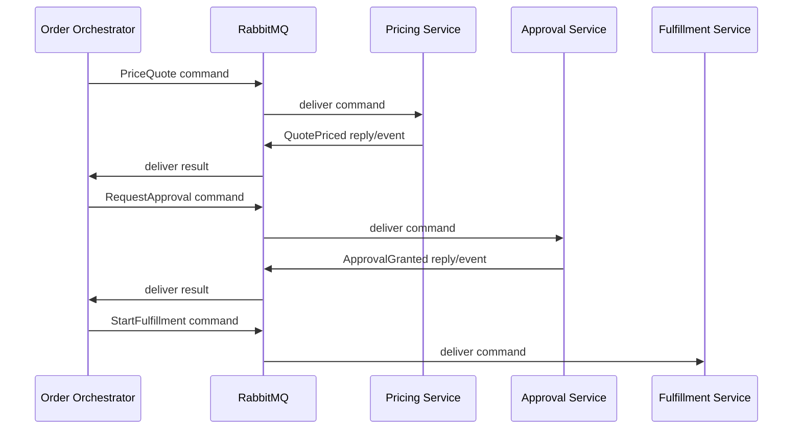
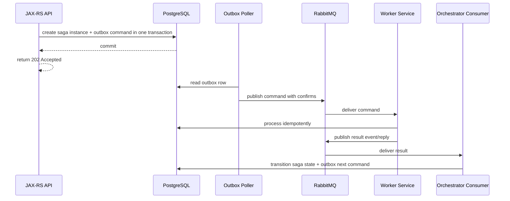
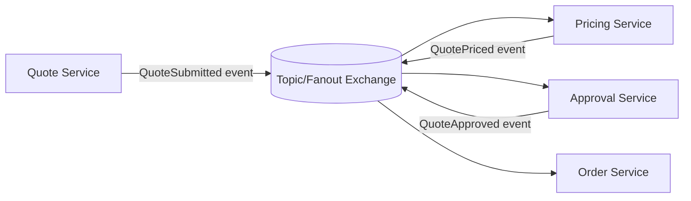
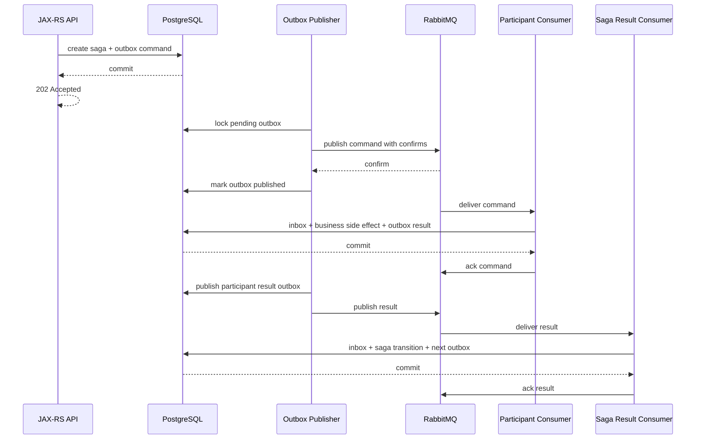
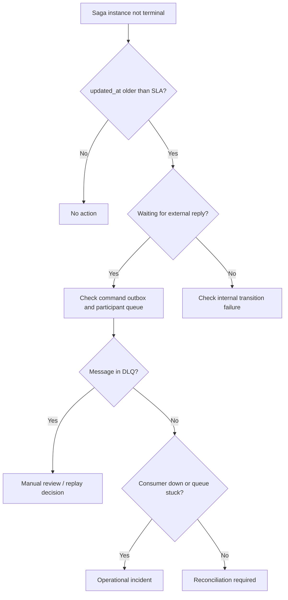

# Saga, Workflow, and Orchestration with RabbitMQ

## 1. Core idea

RabbitMQ can move workflow messages.

RabbitMQ is not automatically a workflow engine.

This distinction matters.

RabbitMQ gives you:

```text
message transport
routing
queueing
consumer delivery
acknowledgement
redelivery
retry and DLQ mechanics
backpressure signals
```

RabbitMQ does not automatically give you:

```text
business process state
long-running workflow visibility
step-level compensation policy
timeout ownership
human intervention queue
cross-step invariant enforcement
idempotent state transition
saga progress dashboard
```

A saga or workflow needs both:

```text
transport + durable business state
```

RabbitMQ can be the transport.

PostgreSQL usually becomes the durable state ledger.

Java/JAX-RS service code usually becomes the decision layer.

That combination must be designed explicitly.

---

## 2. Why this topic exists

In enterprise systems, many business actions are not single local transactions.

Examples:

```text
create quote
price quote
validate eligibility
request approval
reserve resource
submit order
decompose order
notify downstream system
wait for fulfillment response
handle fallout
```

These steps may cross multiple services, databases, networks, and external systems.

A single ACID transaction cannot cover all of them.

So teams use asynchronous workflows.

But asynchronous workflow introduces new failure modes:

```text
step completed but reply lost
command duplicated
event delivered out of order
timeout fired while late success arrives
compensation partially succeeds
manual replay reopens old process
consumer crash leaves step ambiguous
DLQ hides business-critical work
```

RabbitMQ helps route and buffer messages.

It does not remove the need to model the workflow as a state machine.

---

## 3. Minimal terminology

### 3.1 Saga

A saga is a long-running business transaction split into smaller local transactions.

Each local transaction commits independently.

If later steps fail, the system may execute compensating actions.

Example:

```text
submit order
reserve inventory
create fulfillment request
notify billing
activate service
```

If billing fails after fulfillment has started, the system cannot simply roll back one global DB transaction.

It needs business-aware recovery.

---

### 3.2 Choreography

In choreography, services react to events without one central coordinator.



Choreography is useful when:

```text
services are loosely coupled
events represent facts
subscribers evolve independently
fanout is useful
```

Choreography is risky when:

```text
process state is implicit
no service owns end-to-end progress
failure handling is scattered
operators cannot see where workflow is stuck
business timeout is unclear
```

---

### 3.3 Orchestration

In orchestration, one service owns the process state and sends commands to participants.



Orchestration is useful when:

```text
business process needs explicit state
step order matters
operators need visibility
compensation is complex
timeouts must be centrally managed
```

Orchestration is risky when:

```text
orchestrator becomes too large
all domain logic is centralized incorrectly
participants become thin RPC executors
throughput bottleneck appears at orchestrator
```

---

### 3.4 Workflow

Workflow is the broader concept.

A workflow can be:

```text
fully automated
partially manual
state-machine driven
orchestrated
choreographed
hybrid
```

RabbitMQ is only the messaging substrate inside that workflow.

---

## 4. RabbitMQ's correct role in saga/workflow systems

RabbitMQ should usually be treated as:

```text
reliable asynchronous transport between workflow participants
```

RabbitMQ should not be treated as:

```text
the only source of workflow truth
a replacement for saga state table
a complete audit log
a long-term event history system
a workflow engine by itself
```

A mature design usually has:

```text
PostgreSQL table for saga/workflow instance state
PostgreSQL outbox for commands/events emitted by state changes
RabbitMQ exchange/queue topology for transport
RabbitMQ consumer idempotency/inbox for received messages
DLQ/parking lot for failed workflow messages
operator UI/dashboard for stuck workflows
manual repair/replay procedure
```

---

## 5. Saga state should be explicit

A common production mistake is making message existence equal workflow state.

Bad mental model:

```text
If there is a message in RabbitMQ, workflow is pending.
If there is no message, workflow is done.
```

This is weak because:

```text
message may be unacked
message may be in retry queue
message may be in DLQ
message may have expired
message may have been duplicated
message may have been consumed but DB commit failed
message may have been processed but ack lost
```

Better model:

```text
Workflow state lives in PostgreSQL.
RabbitMQ moves transitions and work requests.
```

Example saga table:

```sql
CREATE TABLE order_saga_instance (
    saga_id              UUID PRIMARY KEY,
    business_key         VARCHAR(128) NOT NULL,
    order_id             VARCHAR(128),
    current_state        VARCHAR(64) NOT NULL,
    current_step         VARCHAR(64) NOT NULL,
    version              BIGINT NOT NULL,
    status               VARCHAR(32) NOT NULL,
    last_message_id      VARCHAR(128),
    last_error_code      VARCHAR(128),
    last_error_message   TEXT,
    retry_count          INT NOT NULL DEFAULT 0,
    next_retry_at        TIMESTAMPTZ,
    timeout_at           TIMESTAMPTZ,
    created_at           TIMESTAMPTZ NOT NULL,
    updated_at           TIMESTAMPTZ NOT NULL
);

CREATE UNIQUE INDEX uq_order_saga_business_key
ON order_saga_instance (business_key);
```

This table does not have to be exactly this shape.

The important invariant is:

```text
There must be a durable source of truth for workflow progress.
```

---

## 6. Workflow as state machine

A workflow should have explicit states.

Example order workflow:

```text
DRAFT
VALIDATING
PRICING_REQUESTED
PRICED
APPROVAL_REQUESTED
APPROVED
ORDER_SUBMISSION_REQUESTED
ORDER_SUBMITTED
FULFILLMENT_STARTED
COMPLETED
FAILED
CANCELLED
MANUAL_REVIEW_REQUIRED
```

Each transition should define:

```text
allowed previous state
trigger message or API action
side effect
outgoing message
idempotency key
timeout rule
retry rule
compensation rule
observability signal
```

Example transition rule:

```text
FROM: APPROVED
TRIGGER: SubmitOrderRequested
ACTION: persist order submission state
OUTGOING MESSAGE: StartOrderSubmission command
NEXT STATE: ORDER_SUBMISSION_REQUESTED
IDEMPOTENCY KEY: sagaId + commandType + targetSystem
```

Without explicit transition rules, RabbitMQ-based workflow becomes hidden distributed spaghetti.

---

## 7. Command, event, and reply messages

Saga/workflow design often uses three message types.

### 7.1 Command message

A command asks a specific service to do something.

```json
{
  "messageType": "PriceQuoteCommand",
  "messageId": "msg-001",
  "correlationId": "quote-123",
  "causationId": "api-request-456",
  "targetService": "pricing-service",
  "quoteId": "quote-123",
  "requestedAt": "2026-07-11T10:15:30Z"
}
```

A command should have one clear owner.

It should not be broadcast casually.

### 7.2 Event message

An event states that something happened.

```json
{
  "messageType": "QuotePricedEvent",
  "messageId": "msg-002",
  "correlationId": "quote-123",
  "causationId": "msg-001",
  "quoteId": "quote-123",
  "priceVersion": 7,
  "occurredAt": "2026-07-11T10:16:12Z"
}
```

An event can have multiple subscribers.

It should represent a fact, not an instruction.

### 7.3 Reply message

A reply is a response to a prior command.

```json
{
  "messageType": "PriceQuoteResult",
  "messageId": "msg-003",
  "correlationId": "quote-123",
  "causationId": "msg-001",
  "commandId": "msg-001",
  "status": "SUCCESS",
  "quoteId": "quote-123"
}
```

A reply is common in orchestration.

But do not confuse reply with synchronous RPC safety.

Reply messages can be duplicated, delayed, or lost depending on queue/retry topology and consumer behavior.

---

## 8. Correlation ID is mandatory

Saga/workflow messaging without correlation ID is operationally weak.

Minimum identifiers:

```text
messageId       unique ID of this message
correlationId   end-to-end workflow/business correlation
causationId     message/action that caused this message
sagaId          durable workflow instance ID
businessKey     quote/order/customer-facing key if allowed
traceparent     distributed tracing context
```

Recommended invariant:

```text
Every command/event/reply emitted by a saga must carry sagaId and correlationId.
```

This enables:

```text
trace reconstruction
DLQ investigation
manual replay safety
duplicate detection
workflow dashboard joins
incident communication
```

---

## 9. Orchestrated saga lifecycle with RabbitMQ

A realistic lifecycle:



Key correctness points:

```text
API does not claim workflow completion immediately
state transition and outgoing message are coupled through outbox
consumer result handling is idempotent
RabbitMQ is transport, not state source
saga table is inspectable during incident
```

---

## 10. Choreographed saga lifecycle with RabbitMQ

A choreographed flow:



This can work well when each event is a stable business fact.

The main risk is invisible process state.

To reduce that risk:

```text
publish durable domain events via outbox
make each subscriber idempotent
track subscriber processing status if business-critical
build workflow/process observability outside RabbitMQ queue depth alone
avoid business rules that require guessing which service should act next
```

---

## 11. Hybrid saga model

Many enterprise systems are hybrid.

Example:

```text
orchestrator owns the critical happy-path state
some side effects are event-driven subscribers
some long-running jobs are work queues
some integrations use reply messages
some failures require manual intervention
```

This is normal.

The key is to avoid accidental hybrid design.

Every message flow should declare:

```text
Is this a command, event, reply, or task?
Who owns it?
Who is allowed to consume it?
Is replay safe?
Is duplicate safe?
Is ordering required?
What happens if it lands in DLQ?
```

---

## 12. Compensation is not rollback

Compensation is a business action that attempts to counteract a previous committed action.

It is not a database rollback.

Examples:

```text
cancel reservation
void submitted request
send correction event
mark order as fallout
request manual review
create reversal transaction
notify downstream system of cancellation
```

A compensation action can fail too.

Therefore compensation needs:

```text
idempotency key
state transition rule
retry policy
DLQ policy
manual intervention path
audit trail
```

Bad compensation design:

```text
if step 4 fails, just publish undo for steps 1-3
```

Better compensation design:

```text
each compensating command is a first-class command
with its own state, retry policy, idempotency, and business owner
```

---

## 13. Timeout design

Timeouts are business decisions.

RabbitMQ TTL can expire messages.

But workflow timeout should not depend only on message TTL.

Why?

```text
TTL expiry may discard or dead-letter a message
TTL does not explain business intent
TTL does not automatically transition saga state correctly
TTL does not handle late reply semantics by itself
```

Better options:

```text
saga timeout_at column
scheduled scanner job
outbox-generated timeout command/event
explicit timeout transition
separate timeout metrics
manual intervention for ambiguous timeout
```

RabbitMQ TTL can support delay/retry mechanics.

But the business timeout should be represented in durable workflow state.

---

## 14. Expiry and late reply problem

Common scenario:

```text
orchestrator sends command
orchestrator times out after 10 minutes
participant finishes after 12 minutes
reply arrives late
```

You must define what happens.

Options:

```text
ignore late reply if saga state is terminal
accept late reply if state is still waiting
route late reply to manual review
apply late reply as compensating signal
record late reply as audit-only event
```

Never leave late reply behavior undefined.

Undefined late replies cause inconsistent state.

---

## 15. Duplicate command problem

RabbitMQ can redeliver a command.

Outbox retry can publish a duplicate command.

Manual replay can duplicate a command.

Therefore command handlers must be idempotent.

Command idempotency should usually be based on:

```text
commandId
sagaId + commandType + targetAggregate
business idempotency key
```

Example database constraint:

```sql
CREATE TABLE command_processing_ledger (
    command_id      VARCHAR(128) PRIMARY KEY,
    saga_id         UUID NOT NULL,
    command_type    VARCHAR(128) NOT NULL,
    business_key    VARCHAR(128) NOT NULL,
    status          VARCHAR(32) NOT NULL,
    result_ref      VARCHAR(256),
    created_at      TIMESTAMPTZ NOT NULL,
    updated_at      TIMESTAMPTZ NOT NULL
);
```

For business-critical commands, a unique command processing ledger is safer than relying only on in-memory deduplication.

---

## 16. Lost reply problem

A participant can complete work but fail to publish the reply.

Example:

```text
consumer receives command
consumer updates DB successfully
consumer crashes before publishing result event
or reply publish fails after DB commit
```

Solution patterns:

```text
participant outbox for reply/event
orchestrator timeout + reconciliation query
idempotent command handler that can return existing result
periodic repair job
manual reconciliation dashboard
```

Do not assume reply publish is atomic with participant DB commit unless you explicitly implement outbox.

---

## 17. Stuck saga problem

A saga is stuck when it is not terminal and no progress is happening.

Indicators:

```text
state has not changed beyond expected SLA
waiting_for_step longer than timeout
last outgoing command has no result
related queue has zero consumers
related message is in DLQ
related retry queue keeps cycling
participant service is down
orchestrator consumer is not running
```

A stuck saga dashboard should show:

```text
sagaId
business key
current state
current step
last transition time
timeout_at
last message ID
last outgoing command
last received reply/event
retry count
DLQ reference if available
owner service
manual action needed
```

RabbitMQ queue metrics alone do not show stuck saga state.

---

## 18. Human intervention path

Some workflows cannot be fully automated.

Examples:

```text
pricing discrepancy
order fallout
customer data mismatch
downstream system rejection
compliance hold
manual approval
ambiguous duplicate
```

A mature RabbitMQ-based workflow should include a manual intervention path.

That path may be represented as:

```text
MANUAL_REVIEW_REQUIRED saga state
parking lot queue
case management task
operator dashboard item
support ticket
admin repair endpoint
controlled replay tool
```

Manual intervention must be audited.

Manual replay must be idempotent.

Manual repair must not bypass business invariants silently.

---

## 19. RabbitMQ topology for orchestration

A conceptual topology:

```text
workflow.command.exchange
workflow.event.exchange
workflow.reply.exchange
workflow.retry.exchange
workflow.dlx.exchange
workflow.parking.exchange
```

Example queue categories:

```text
pricing.command.queue
approval.command.queue
fulfillment.command.queue
orchestrator.reply.queue
workflow.retry.5m.queue
workflow.retry.30m.queue
workflow.dlq
workflow.parking.queue
```

Do not copy these names blindly.

Actual topology must follow internal naming standards.

The principle is:

```text
separate command traffic, event traffic, reply traffic, retry traffic, and dead-letter traffic enough that operators can reason about failure.
```

---

## 20. Routing key design for workflow

Routing keys should encode stable routing dimensions.

Possible dimensions:

```text
message category: command/event/reply/task
business domain: quote/order/pricing/approval/fulfillment
message type: submitted/priced/approved/rejected
version: v1/v2 if part of routing model
tenant/region only if routing requires it and security approves
```

Examples:

```text
command.pricing.price-quote.v1
event.quote.quote-submitted.v1
event.quote.quote-priced.v1
reply.pricing.price-quote-result.v1
task.order.fulfillment-start.v1
```

Avoid routing keys that encode unstable implementation details:

```text
class names
method names
pod names
deployment names
random environment suffixes without convention
```

---

## 21. Outbox with saga state

Saga transition and outgoing message should be committed together.

Pattern:

```text
read saga instance
validate transition
update saga state
insert outbox message
commit DB transaction
outbox poller publishes to RabbitMQ
publisher confirm marks outbox published
```

Pseudo-code:

```java
transactionTemplate.execute(status -> {
    Saga saga = sagaRepository.findForUpdate(sagaId);

    saga.transitionTo("APPROVAL_REQUESTED");

    outboxRepository.insert(new OutboxMessage(
        messageId,
        "RequestApprovalCommand",
        saga.getSagaId(),
        saga.getBusinessKey(),
        payload
    ));

    sagaRepository.update(saga);
    return null;
});
```

The important property:

```text
If saga state says command was requested, there must be an outbox record for that command.
```

---

## 22. Inbox with saga result handling

Saga result consumers should be idempotent.

Pattern:

```text
receive reply/event
begin DB transaction
insert inbox row by messageId or dedup key
if duplicate, ack safely
load saga instance
validate transition allowed
apply transition
insert next outbox message if needed
commit
ack RabbitMQ message
```

Pseudo-code:

```java
transactionTemplate.execute(status -> {
    boolean firstTime = inboxRepository.tryInsert(messageId, consumerName);
    if (!firstTime) {
        return ProcessingResult.DUPLICATE;
    }

    Saga saga = sagaRepository.findForUpdate(sagaId);
    saga.apply(resultMessage);

    if (saga.needsNextCommand()) {
        outboxRepository.insert(saga.nextCommand());
    }

    sagaRepository.update(saga);
    inboxRepository.markProcessed(messageId);
    return ProcessingResult.PROCESSED;
});

channel.basicAck(deliveryTag, false);
```

Ack after commit.

Not before.

---

## 23. Idempotent state transition

A saga transition should be idempotent.

Example:

```text
Current state: APPROVAL_REQUESTED
Incoming message: ApprovalGranted
Transition: APPROVED
```

If the same message arrives again:

```text
Current state: APPROVED
Incoming message: ApprovalGranted
Action: detect duplicate/already-applied and ack safely
```

If a conflicting message arrives:

```text
Current state: APPROVED
Incoming message: ApprovalRejected
Action: flag conflict, do not blindly transition
```

State transition logic should distinguish:

```text
duplicate message
late message
invalid message
conflicting message
new valid message
```

This is a business correctness problem.

RabbitMQ cannot infer it for you.

---

## 24. Retry policy by failure type

Not all failures deserve the same retry.

| Failure type | Example | Retry? | Likely action |
|---|---|---:|---|
| Transient infrastructure | DB timeout, HTTP 503 | Yes | delayed retry |
| Dependency throttling | downstream rate limit | Yes | backoff + rate limit |
| Validation error | invalid payload shape | No | DLQ or reject as bad message |
| Business rejection | approval denied | No technical retry | transition business state |
| Conflict | duplicate incompatible state | No blind retry | manual review |
| Unknown exception | NPE, unexpected response | Limited | retry then DLQ |
| Poison message | always fails same way | No infinite retry | parking lot |

A retry should be tied to a specific state and message.

A retry should not blindly re-run the entire saga from the start unless the workflow is explicitly designed for that.

---

## 25. DLQ in workflow systems

A DLQ entry in a workflow system is not just a technical dead letter.

It may represent blocked business work.

For each DLQ message, operators need to know:

```text
which saga/workflow instance is affected
which customer/order/quote is affected if allowed
which step failed
whether workflow is still active
whether retry is safe
whether replay is safe
whether manual compensation is needed
```

A DLQ dashboard should join RabbitMQ message metadata with saga state where possible.

Do not let DLQ become a graveyard of business processes.

---

## 26. Replay in saga systems

Replay is dangerous unless idempotency and state validation are strong.

Before replaying a workflow message, verify:

```text
current saga state
message type
message age
original failure reason
x-death count
whether message is duplicate
whether downstream side effect already happened
whether replay can create duplicate command
whether reply/event is late and should be ignored
```

Replay procedure should be controlled.

Avoid giving broad production access to arbitrary republish tools.

---

## 27. JAX-RS API boundary

For long-running workflow starts, JAX-RS endpoint should usually return `202 Accepted` rather than pretending the workflow completed synchronously.

Example response shape:

```json
{
  "requestId": "req-123",
  "correlationId": "quote-456",
  "sagaId": "7b8449f0-6d61-4d5f-a2de-f857ad4e6112",
  "status": "ACCEPTED",
  "statusUrl": "/quotes/quote-456/workflow-status"
}
```

Endpoint responsibilities:

```text
validate request
apply idempotency key
create initial saga state
insert outbox message
commit transaction
return correlation handle
```

Endpoint should not:

```text
block until every async participant finishes
return success for downstream steps not yet completed
hide timeout semantics
create saga state after publishing message
```

---

## 28. PostgreSQL/MyBatis transaction boundary

In Java/JAX-RS systems with PostgreSQL and MyBatis/JDBC, key transaction boundaries are:

```text
API request transaction
saga transition transaction
outbox poller transaction
consumer inbox transaction
participant command handling transaction
manual repair transaction
```

Be careful with:

```text
DB commit success but publish fail
publish success but DB transition fail
consumer DB commit success but ack fail
reply publish fail after participant DB commit
manual repair without version check
concurrent messages updating same saga
```

Use optimistic or pessimistic locking deliberately.

For high-contention saga state, versioned updates are useful:

```sql
UPDATE order_saga_instance
SET current_state = ?, version = version + 1, updated_at = now()
WHERE saga_id = ?
  AND version = ?
  AND current_state = ?;
```

If affected rows = 0, the transition must be re-evaluated.

---

## 29. Concurrency control for saga state

A saga may receive multiple messages close together.

Example:

```text
ApprovalGranted arrives
ApprovalTimeout fires
ManualCancel arrives
```

Only valid transitions should win.

Concurrency controls:

```text
unique saga ID
state version column
SELECT FOR UPDATE for critical transition
unique inbox key
idempotency ledger
transition guard condition
```

Do not rely on RabbitMQ ordering alone to protect saga state.

Multiple queues, multiple consumers, retries, replays, and redelivery can break the assumed order.

---

## 30. Workflow observability

Workflow observability must combine application and broker signals.

RabbitMQ signals:

```text
publish rate
consumer rate
ack rate
redelivery rate
queue depth
unacked count
DLQ count
retry queue count
consumer count
connection blocked
```

Application workflow signals:

```text
saga instances by state
saga instances stuck by SLA
transition success/failure count
step latency
timeout count
compensation count
manual review count
duplicate message count
invalid transition count
late reply count
```

Trace/log dimensions:

```text
sagaId
correlationId
causationId
messageId
messageType
businessKey
stateBefore
stateAfter
transitionName
retryCount
```

Without application-level workflow metrics, RabbitMQ observability is incomplete.

---

## 31. Mermaid: orchestrated saga with outbox and inbox



Important invariant:

```text
Every durable state change that requires a message creates an outbox record in the same DB transaction.
```

---

## 32. Mermaid: stuck saga detection



This is why saga state, outbox, RabbitMQ metrics, and DLQ metadata must be connected.

---

## 33. Failure modes

### 33.1 Command published twice

Cause:

```text
outbox publisher retry after uncertain confirm
manual replay
publisher crash after publish before mark published
```

Protection:

```text
idempotent command handler
command ledger
business unique constraint
safe retry semantics
```

### 33.2 Command consumed but reply not published

Cause:

```text
participant DB commit succeeds
participant crashes before publishing reply
```

Protection:

```text
participant outbox
orchestrator timeout
reconciliation query
idempotent command result lookup
```

### 33.3 Reply delivered twice

Cause:

```text
consumer crash after saga transition before ack
manual replay
broker redelivery
```

Protection:

```text
inbox table
idempotent transition
state guard
message ledger
```

### 33.4 Timeout and late success race

Cause:

```text
timeout job and success reply process concurrently
```

Protection:

```text
state version
transition guard
late reply policy
audit record
manual review for conflict
```

### 33.5 DLQ hides workflow item

Cause:

```text
consumer repeatedly fails
message dead-lettered
workflow state not updated
```

Protection:

```text
DLQ-to-saga dashboard
DLQ alert by business criticality
manual review transition
parking lot process
```

---

## 34. Performance concerns

Saga/workflow systems may suffer from:

```text
orchestrator bottleneck
large message payloads
high retry volume
chatty command/reply patterns
too many fine-grained workflow steps
DB contention on saga state table
hot aggregate key
consumer thread pool exhaustion
DLQ/retry queue growth
```

Performance review should ask:

```text
Can we batch non-critical side effects?
Can we reduce command/reply chatter?
Is orchestration state partitioned enough?
Is saga table indexed by status, timeout_at, and updated_at?
Is the outbox poller scalable?
Are consumers sized by downstream DB capacity, not just CPU?
```

---

## 35. Security and privacy concerns

Workflow messages often contain business-sensitive data.

Minimize payloads.

Prefer references where possible:

```text
quoteId
orderId
sagaId
version
state transition reason
```

Be careful with:

```text
PII in payload
PII in headers
sensitive error messages in DLQ
manual replay tool exposing payloads
logs with full message body
cross-tenant routing keys
operator dashboards with customer data
```

Security review should include:

```text
vhost isolation
least privilege permissions
management UI access
DLQ access control
replay tool authorization
audit trail for manual actions
```

---

## 36. Kubernetes, cloud, and on-prem concerns

Workflow reliability depends on client workload behavior too.

Kubernetes concerns:

```text
pod termination during in-flight command
rolling update duplicates deliveries
consumer replica count changes ordering/concurrency
connection storm during rollout
CPU throttling increases timeout false positives
secret rotation restarts consumers
```

Cloud/on-prem concerns:

```text
broker maintenance window
network partition
cross-region latency
certificate expiry
firewall or security group drift
storage pressure
managed broker failover
self-managed cluster restart
```

Design workflow timeouts with deployment reality in mind.

A five-second timeout may be a bug in a system that experiences rolling updates, broker failover, and downstream maintenance.

---

## 37. When RabbitMQ is enough for workflow

RabbitMQ plus application state can be enough when:

```text
workflow is moderately complex
state transitions are owned by one service
operators have dashboard/runbook
timeouts are simple
compensation is limited
message volume fits RabbitMQ capacity
replay requirements are limited
```

---

## 38. When to consider a workflow engine

Consider a workflow engine or dedicated orchestration platform when:

```text
workflow is long-running and highly branched
human tasks are first-class
visual process tracking is required
complex timers are everywhere
compensation paths are numerous
business users need process visibility
replay/history/audit needs are strict
workflow definition changes frequently
```

RabbitMQ can still be used around a workflow engine.

But RabbitMQ alone should not be forced to become a full process engine through scattered consumers and hidden queues.

---

## 39. Internal verification checklist

Use this checklist inside the actual team/codebase.

### 39.1 Workflow ownership

Verify:

```text
Which service owns each saga/workflow?
Is the workflow orchestrated, choreographed, or hybrid?
Where is saga state stored?
Who owns timeout policy?
Who owns compensation policy?
Who owns manual intervention?
```

### 39.2 Message classification

Verify:

```text
Which messages are commands?
Which messages are events?
Which messages are replies?
Which messages are tasks?
Are names and routing keys aligned with this classification?
```

### 39.3 State and transaction boundary

Verify:

```text
Does every workflow transition persist state?
Does transition + outgoing message use outbox?
Does result consumer use inbox?
Is ack after DB commit?
Are duplicate replies safe?
Are late replies defined?
```

### 39.4 RabbitMQ topology

Verify:

```text
exchange list
queue list
binding list
routing keys
vhost
DLX
retry queues
parking lot queues
reply queues
consumer ownership
```

### 39.5 Timeout and retry

Verify:

```text
timeout_at column or equivalent
scheduled timeout scanner
retry count
retry delay
DLQ policy
manual replay procedure
stuck saga alert
```

### 39.6 Observability

Verify:

```text
saga dashboard
queue dashboard
DLQ dashboard
correlation ID propagation
traceparent propagation
logs include sagaId/messageId
alerts for stuck workflow
alerts for DLQ spike
```

### 39.7 Human intervention

Verify:

```text
manual review state
who can repair
who can replay
what is audited
what is forbidden
how customer impact is tracked
```

---

## 40. PR review checklist

Ask these questions before approving saga/workflow changes.

### 40.1 Design

```text
Is this actually a saga/workflow, or just a background task?
Who owns the end-to-end state?
Is RabbitMQ being used as transport or as hidden state store?
Is choreography intentional or accidental?
Is orchestration too centralized?
```

### 40.2 Correctness

```text
What happens if command is duplicated?
What happens if reply is duplicated?
What happens if reply is lost?
What happens if reply arrives late?
What happens if timeout races with success?
What happens if compensation fails?
```

### 40.3 Data consistency

```text
Is saga state updated transactionally?
Is outbox used for outgoing messages?
Is inbox used for incoming result messages?
Are state transitions guarded?
Is there optimistic/pessimistic locking?
```

### 40.4 RabbitMQ semantics

```text
Are messages manually acked after durable processing?
Are retry and DLQ routes clear?
Is replay safe?
Is routing key stable?
Is consumer concurrency safe for ordering assumptions?
```

### 40.5 Operations

```text
Can operators see stuck workflows?
Can DLQ messages be mapped to saga instances?
Is there a runbook?
Is manual replay audited?
Are alerts based on business impact, not just queue depth?
```

---

## 41. Common anti-patterns

### 41.1 Queue as workflow state

```text
The queue tells us what is pending.
```

This fails under retry, DLQ, unacked delivery, and replay.

### 41.2 Event soup

```text
Every service publishes events and every other service reacts somehow.
```

This creates implicit workflow with no owner.

### 41.3 RPC disguised as saga

```text
HTTP request waits synchronously for a chain of RabbitMQ replies.
```

This combines async complexity with sync timeout pain.

### 41.4 Retry as business recovery

```text
If anything fails, retry forever.
```

This creates retry storms and hides business exceptions.

### 41.5 Compensation without state

```text
Publish undo commands without tracking compensation progress.
```

This creates ambiguous partial rollback.

### 41.6 DLQ as final answer

```text
Failed message is in DLQ, so system handled it.
```

A DLQ is a holding area, not business resolution.

---

## 42. Senior engineer mental model

For saga/workflow with RabbitMQ, think in four layers.

```text
Layer 1: Business process
What states and transitions exist?

Layer 2: Durable state
Where is progress recorded?

Layer 3: Messaging transport
How are commands/events/replies routed?

Layer 4: Operations
How are failures detected, diagnosed, replayed, or repaired?
```

A design is production-ready only when all four layers are explicit.

---

## 43. Summary

RabbitMQ is useful for saga and workflow systems because it provides asynchronous routing, buffering, delivery, retry, and dead-letter mechanics.

But RabbitMQ does not replace workflow state.

For enterprise Java/JAX-RS systems, robust saga design usually requires:

```text
explicit state machine
PostgreSQL saga state table
outbox for outgoing messages
inbox for incoming messages
manual ack after durable processing
idempotent command handlers
late reply policy
timeout policy
DLQ and parking lot process
workflow observability
manual intervention path
```

The senior-level question is not:

```text
Can RabbitMQ carry this message?
```

The real question is:

```text
Can the business process remain correct when every message can be delayed, duplicated, retried, dead-lettered, replayed, or observed during an incident?
```

---

## 44. References

- RabbitMQ AMQP 0-9-1 model: https://www.rabbitmq.com/tutorials/amqp-concepts
- RabbitMQ consumer acknowledgements and publisher confirms: https://www.rabbitmq.com/docs/confirms
- RabbitMQ dead-letter exchanges: https://www.rabbitmq.com/docs/dlx
- RabbitMQ TTL and expiration: https://www.rabbitmq.com/docs/ttl
- RabbitMQ consumers: https://www.rabbitmq.com/docs/consumers
