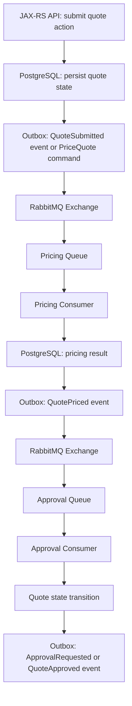
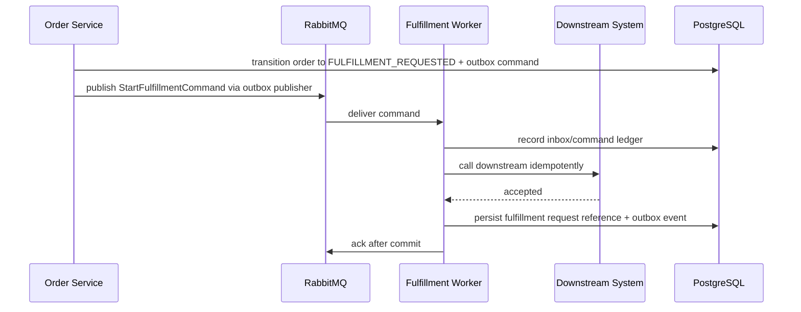

# RabbitMQ in CPQ and Order Management Context

## 1. Scope and disclaimer

This part discusses RabbitMQ in a CPQ and order management context.

It does not claim any internal CSG topology.

It does not invent actual exchange names, queue names, routing keys, vhosts, policies, retry topology, DLQ topology, cluster setup, ownership model, or deployment model.

Everything that depends on the real codebase or platform must be verified internally.

Use this part as a reasoning map.

Not as a statement of actual CSG implementation.

---

## 2. Core idea

CPQ and order management systems are naturally workflow-heavy.

They involve:

```text
quote creation
configuration validation
pricing
discounting
approval
quote acceptance
order creation
order validation
order decomposition
fulfillment
fallout handling
notification
integration with downstream systems
```

RabbitMQ can help by decoupling these steps through queues, routing, retries, and asynchronous processing.

But the business correctness does not come from RabbitMQ alone.

Correctness comes from:

```text
explicit state model
idempotent command handling
business invariant enforcement
outbox/inbox discipline
careful retry/DLQ semantics
clear ownership of messages
auditability and traceability
```

RabbitMQ moves work.

The domain model decides what work is valid.

---

## 3. Why RabbitMQ appears in CPQ/order systems

CPQ/order management workflows often need asynchronous messaging because:

```text
some operations are long-running
some steps call slow downstream systems
some steps can be retried independently
some tasks can be processed by worker pools
some events need fanout to multiple subscribers
some integrations should not block API response
some failures require DLQ/manual intervention
some workloads must be throttled
```

RabbitMQ is useful when the problem is:

```text
route this work item to the right service
buffer this task until worker capacity exists
isolate slow consumer from producer
retry transient failures with delay
park poison messages for investigation
fan out business events to subscribers
```

RabbitMQ is not enough when the problem is:

```text
keep permanent event history
replay all events from months ago
run complex visual business process definitions
query process history as primary storage
replace business state tables
perform distributed ACID transaction
```

---

## 4. Typical message categories in CPQ/order domain

### 4.1 Quote command

A quote command asks a service to perform an action on a quote.

Examples:

```text
ValidateQuoteCommand
PriceQuoteCommand
RequestQuoteApprovalCommand
RecalculateQuoteCommand
ExpireQuoteCommand
```

Command semantics:

```text
intended for one logical handler
must be idempotent
must carry quoteId/correlationId/messageId
should define valid source states
may produce quote event or reply
```

### 4.2 Quote event

A quote event states that something happened to a quote.

Examples:

```text
QuoteCreatedEvent
QuoteValidatedEvent
QuotePricedEvent
QuoteApprovalRequestedEvent
QuoteApprovedEvent
QuoteRejectedEvent
QuoteExpiredEvent
QuoteAcceptedEvent
```

Event semantics:

```text
represents a fact
may have multiple subscribers
should be versioned
should be backward-compatible
should not require all subscribers to be available immediately
```

### 4.3 Order command

An order command asks a service to perform an action on an order.

Examples:

```text
CreateOrderCommand
ValidateOrderCommand
SubmitOrderCommand
DecomposeOrderCommand
StartFulfillmentCommand
CancelOrderCommand
```

Command risk:

```text
duplicate command can create duplicate downstream work
out-of-order command can violate state transition
late command can affect already-cancelled order
```

### 4.4 Order event

An order event states that something happened to an order.

Examples:

```text
OrderCreatedEvent
OrderValidatedEvent
OrderSubmittedEvent
OrderDecomposedEvent
OrderFulfillmentStartedEvent
OrderCompletedEvent
OrderFailedEvent
OrderCancelledEvent
```

Event risk:

```text
subscribers may process duplicate event
subscribers may process old event after newer state
subscriber DLQ may hide business side effect failure
```

### 4.5 Task message

A task message represents background work.

Examples:

```text
GenerateQuoteDocumentTask
RunPricingCalculationTask
SendCustomerNotificationTask
SyncOrderToDownstreamTask
RebuildOrderProjectionTask
```

Task risk:

```text
long-running job timeout
worker crash during processing
duplicate document/notification
retry storm if downstream is down
```

### 4.6 Integration message

An integration message crosses boundary to another system.

Examples:

```text
SendOrderToFulfillmentSystem
SendQuoteToCRM
SyncCustomerData
NotifyBillingSystem
ReceiveProvisioningUpdate
```

Integration risk:

```text
downstream idempotency unknown
external SLA unknown
payload mapping failure
security/privacy exposure
manual reconciliation required
```

---

## 5. CPQ/order lifecycle as messaging map

A simplified conceptual flow:



This diagram is conceptual only.

Actual internal flow must be verified in codebase and RabbitMQ topology.

---

## 6. Quote lifecycle concerns

Quote lifecycle often has state transitions like:

```text
DRAFT
CONFIGURING
VALIDATING
VALIDATED
PRICING
PRICED
APPROVAL_REQUIRED
APPROVAL_PENDING
APPROVED
REJECTED
ACCEPTED
EXPIRED
CANCELLED
```

RabbitMQ messages may represent:

```text
request to perform a transition
fact that a transition occurred
background task triggered by state
integration event after state change
```

Correctness rule:

```text
A message must not be allowed to move a quote into an invalid state.
```

Example invalid transition:

```text
QuoteApprovedEvent arrives after QuoteExpiredEvent
```

The consumer must not blindly apply the event.

It must check current state and version.

---

## 7. Order lifecycle concerns

Order lifecycle may have states like:

```text
ORDER_DRAFT
ORDER_CREATED
ORDER_VALIDATING
ORDER_VALIDATED
ORDER_SUBMITTED
ORDER_DECOMPOSING
ORDER_DECOMPOSED
FULFILLMENT_IN_PROGRESS
PARTIALLY_FULFILLED
FULFILLED
FALLOUT
CANCEL_REQUESTED
CANCELLED
FAILED
COMPLETED
```

Order messages can be more dangerous than quote messages because they may trigger external fulfillment or billing side effects.

Correctness concerns:

```text
do not submit the same order twice
avoid duplicate fulfillment command
avoid activating service twice
avoid billing twice
avoid sending inconsistent cancellation
avoid losing fallout notification
```

Every order command should have strong idempotency.

---

## 8. Pricing job pattern

Pricing can be CPU-heavy, IO-heavy, rules-heavy, or dependent on external catalog/pricing services.

RabbitMQ can be used to distribute pricing work.

Conceptual pattern:

```text
JAX-RS request updates quote state to PRICING_REQUESTED
outbox publishes PriceQuoteCommand
pricing worker consumes command
worker calculates price
worker persists pricing result
worker publishes QuotePricedEvent via outbox
quote workflow consumes QuotePricedEvent
```

Important invariants:

```text
same quote version should not be priced twice with conflicting result
pricing result should reference quote version/configuration version
late pricing result for old quote version must not overwrite newer pricing
pricing failure must transition quote to recoverable state or manual review
```

Potential idempotency key:

```text
quoteId + quoteVersion + pricingRequestId
```

---

## 9. Approval task pattern

Approval may be synchronous, asynchronous, human-driven, or rule-based.

RabbitMQ can route approval tasks or events.

Conceptual messages:

```text
RequestApprovalCommand
ApprovalRequestedEvent
ApprovalGrantedEvent
ApprovalRejectedEvent
ApprovalTimedOutEvent
```

Important invariants:

```text
approval should apply to a specific quote/order version
approval result should not apply after quote/order changed materially
approval timeout must not race incorrectly with late approval
manual approval action must be audited
```

Approval is usually not just a queue operation.

It is a business control point.

---

## 10. Fulfillment task pattern

Fulfillment is high-risk because it often triggers downstream provisioning, activation, shipping, or external order handling.

RabbitMQ can decouple fulfillment start from API calls.

Conceptual flow:



Important invariants:

```text
downstream request must have idempotency key if supported
fulfillment reference must be persisted
ack only after durable record
retry must not create duplicate fulfillment
DLQ must be visible as customer-impacting risk
```

---

## 11. Fallout task pattern

Fallout means the process could not continue automatically.

Examples:

```text
invalid downstream response
manual provisioning required
catalog mismatch
customer data inconsistency
partial fulfillment failure
billing rejection
network timeout with unknown downstream state
```

RabbitMQ can route fallout tasks to a specialized queue.

But fallout should also be recorded in business state.

Do not rely only on a fallout queue.

Recommended model:

```text
order/quote state = FALLOUT or MANUAL_REVIEW_REQUIRED
fallout reason persisted in DB
outbox publishes FalloutCreatedEvent or CreateFalloutTaskCommand
RabbitMQ routes task/event
case/work item created if needed
operator action audited
```

---

## 12. Notification task pattern

Notifications are common RabbitMQ workloads.

Examples:

```text
quote approved notification
quote expired notification
order submitted notification
fulfillment completed notification
fallout notification
```

Notification risks:

```text
duplicate email/SMS
notification sent before transaction commits
notification sent for rolled-back state
notification contains PII in queue/log/DLQ
notification retry causes spam
```

Recommended safeguards:

```text
notification outbox
notification idempotency key
deduplication by business event ID
rate limiting
payload minimization
privacy-safe logging
DLQ review policy
```

---

## 13. Order decomposition message

Order decomposition splits a commercial order into technical or downstream work items.

Conceptual messages:

```text
DecomposeOrderCommand
OrderDecomposedEvent
CreateFulfillmentItemCommand
FulfillmentItemCreatedEvent
```

Critical concerns:

```text
same order version must not decompose differently without versioning
partial decomposition must be recoverable
component order messages must preserve parent order correlation
duplicate decomposition must not duplicate fulfillment items
ordering between parent and child events must be defined
```

Potential keys:

```text
orderId
orderVersion
decompositionRunId
fulfillmentItemId
parentCorrelationId
```

---

## 14. Downstream system message

Downstream integration messages are often the highest operational risk.

They may cross:

```text
service boundary
network boundary
company boundary
deployment boundary
cloud/on-prem boundary
security boundary
```

Design questions:

```text
Does downstream support idempotency?
Does downstream provide request ID or transaction reference?
Can downstream return ambiguous timeout?
How do we reconcile unknown state?
Is there a manual repair path?
What data is allowed in payload?
How is retry throttled?
```

RabbitMQ retry cannot solve unknown external side effects by itself.

---

## 15. Business invariant in messaging flow

A business invariant is a rule that must remain true even when messages duplicate, delay, retry, or arrive out of order.

Examples:

```text
a quote cannot be accepted after expiry
an order cannot be submitted twice
an approval applies only to the quote version it approved
a fulfillment request must reference exactly one order version
a cancellation cannot erase audit history
billing activation must not happen before order submission is durable
fallout state must be visible until resolved
```

For every RabbitMQ message flow, identify the invariant it may affect.

Then design protection:

```text
state check
version check
unique constraint
idempotency ledger
outbox/inbox
manual review state
audit log
```

---

## 16. Duplicate command business risk

Duplicate command risk is not merely technical.

It can create business damage.

Examples:

| Duplicate command | Possible damage | Protection |
|---|---|---|
| `PriceQuoteCommand` | conflicting quote price | quote version key |
| `RequestApprovalCommand` | duplicate approval tasks | approval request unique key |
| `SubmitOrderCommand` | duplicate order submission | order submission ledger |
| `StartFulfillmentCommand` | duplicate provisioning | downstream idempotency key |
| `SendNotificationTask` | duplicate customer message | notification dedup key |
| `CancelOrderCommand` | repeated cancellation side effect | cancellation ledger |

Senior review should always ask:

```text
If this command is delivered twice, what exact business side effect can happen?
```

---

## 17. Event duplication business risk

Duplicate event risk is also real.

Examples:

```text
projection updated twice
notification sent twice
audit row inserted twice
cache invalidation repeated harmlessly
downstream sync called twice
workflow transition attempted twice
```

Some duplicates are harmless.

Some are dangerous.

Classify each subscriber:

```text
naturally idempotent
idempotent by unique constraint
idempotent by inbox table
not idempotent and must be fixed
```

---

## 18. Ordering risk in CPQ/order messaging

Ordering assumptions are dangerous.

Possible out-of-order scenarios:

```text
QuotePricedEvent arrives after QuoteExpiredEvent
OrderCancelledEvent arrives while FulfillmentStartedEvent is in retry
ApprovalGrantedEvent arrives after ApprovalTimedOutEvent
OrderUpdatedEvent for version 5 arrives before version 4
DLQ replay reintroduces an old event
```

Protection patterns:

```text
aggregate version in message
state transition guard
ignore stale version
manual review for conflicting transition
single active consumer only where needed
per-aggregate ordering strategy
```

Do not rely only on queue FIFO if there are multiple queues, retries, redelivery, DLQ replay, or multiple consumers.

---

## 19. Message payload strategy

CPQ/order payloads can become huge.

Avoid pushing entire quote/order documents into RabbitMQ unless necessary.

Prefer:

```text
business ID
version
operation context
minimal fields required by consumer
trace/correlation metadata
schema version
```

Avoid:

```text
large full aggregate snapshots without reason
sensitive customer data in headers
pricing internals in logs
PII in DLQ payloads
unbounded nested payloads
```

Trade-off:

```text
small message = consumer may need DB lookup
large message = broker pressure, privacy risk, schema coupling
```

Choose deliberately.

---

## 20. Contract versioning in CPQ/order flows

Message versioning is critical because order/quote systems evolve.

Version-sensitive fields:

```text
quote structure
product configuration
pricing breakdown
discount model
approval reason
order line item model
fulfillment item model
customer/account reference
```

Compatibility rules:

```text
add optional fields safely
avoid removing required fields abruptly
avoid changing meaning of existing field
version commands/events deliberately
support old consumers during deployment window
contract test important message types
```

RabbitMQ routes bytes.

It does not enforce business schema compatibility.

---

## 21. Topology design lens for CPQ/order

Conceptual topology categories:

```text
quote command exchange
quote event exchange
order command exchange
order event exchange
task exchange
integration exchange
retry exchange
dead-letter exchange
parking lot exchange
```

Queue categories:

```text
pricing worker queue
approval worker queue
quote workflow queue
order workflow queue
fulfillment worker queue
fallout task queue
notification task queue
integration adapter queue
DLQ
parking lot queue
```

This is not a recommended internal naming scheme.

It is a reasoning model.

Actual names must follow internal standards.

---

## 22. Ownership model

Every message type should have explicit ownership.

Ownership questions:

```text
Who owns the message schema?
Who owns the producer?
Who owns each consumer?
Who owns retry policy?
Who owns DLQ review?
Who owns replay decision?
Who owns customer impact when message is stuck?
Who approves breaking changes?
```

Without ownership, RabbitMQ topology becomes shared infrastructure with unclear business accountability.

---

## 23. Java/JAX-RS integration model

A JAX-RS endpoint should be explicit about async behavior.

Example quote pricing request:

```text
POST /quotes/{quoteId}/pricing-requests
```

Possible response:

```json
{
  "quoteId": "Q-123",
  "pricingRequestId": "PR-456",
  "status": "ACCEPTED",
  "correlationId": "corr-789",
  "statusUrl": "/quotes/Q-123/pricing-requests/PR-456"
}
```

Correct API semantics:

```text
request accepted does not mean pricing completed
status endpoint should reflect durable state
idempotency key should prevent duplicate request
RabbitMQ publish should be via outbox when tied to DB state
```

---

## 24. PostgreSQL/MyBatis consistency model

Typical safe pattern:

```text
JAX-RS resource receives command
service validates business state
PostgreSQL transaction starts
state transition is persisted
outbox row is inserted
transaction commits
outbox publisher sends message to RabbitMQ with publisher confirm
consumer processes with inbox/idempotency
ack after DB commit
```

For MyBatis/JDBC:

```text
make transaction boundary explicit
avoid publishing inside transaction without outbox unless consciously accepted
avoid ack before commit
use unique constraints for idempotency
use version columns for state transition protection
```

---

## 25. Redis interaction in CPQ/order flows

Redis may support RabbitMQ flows through:

```text
cache invalidation
rate limiting
temporary deduplication
short-lived distributed lock
status cache
```

But Redis should be used carefully.

Risks:

```text
lock expires while consumer still processing
cache shows newer state than DB transaction
Redis dedup key expires before RabbitMQ redelivery
status cache hides stuck workflow
Redis outage blocks message processing unnecessarily
```

For business-critical idempotency, PostgreSQL is usually safer than Redis because it participates in durable transaction boundaries.

---

## 26. Retry policy by domain category

Different domain messages need different retry handling.

| Category | Retry strategy | DLQ/parking expectation |
|---|---|---|
| Pricing transient failure | delayed retry | DLQ if repeated technical failure |
| Approval validation failure | no blind technical retry | business rejection/manual review |
| Fulfillment downstream timeout | limited retry + reconciliation | manual review if unknown state |
| Notification failure | delayed retry with dedup | DLQ may be lower criticality but privacy-sensitive |
| Fallout task failure | retry carefully | manual queue must be visible |
| Order submission failure | conservative retry | high-priority DLQ/manual review |

The retry policy must be business-aware.

A generic retry policy for all CPQ/order messages is usually wrong.

---

## 27. DLQ severity by business impact

Not every DLQ message has equal impact.

Classify DLQ by domain impact:

```text
P0/P1: order submission, fulfillment, billing-affecting command
P2: quote approval/pricing workflow blocker
P3: notification or non-critical projection
P4: analytics/optional subscriber
```

DLQ alerting should consider:

```text
message type
business process state
customer impact
age in DLQ
retry count
volume spike
tenant/customer segment if allowed
```

A single DLQ count threshold is rarely enough.

---

## 28. Observability for CPQ/order RabbitMQ flows

Broker metrics:

```text
queue depth by queue
ready/unacked messages
publish/deliver/ack rate
redelivery rate
DLQ depth
retry queue depth
consumer count
consumer utilization
connection/channel count
```

Domain metrics:

```text
quotes stuck in PRICING
quotes stuck in APPROVAL_PENDING
orders stuck in SUBMITTED
orders stuck in FULFILLMENT_IN_PROGRESS
orders in FALLOUT
message processing latency by type
workflow age by state
duplicate command count
invalid transition count
manual replay count
```

Correlation dimensions:

```text
quoteId
orderId
sagaId
correlationId
messageId
messageType
routingKey
consumerName
stateBefore/stateAfter
```

Production debugging needs both broker and domain metrics.

---

## 29. Debugging example: quote stuck in pricing

Symptoms:

```text
quote status = PRICING_REQUESTED for too long
customer/API sees pending pricing
pricing queue depth may or may not be high
```

Debug path:

```text
check quote state and version in DB
check outbox row for PriceQuoteCommand
check if outbox was published
check RabbitMQ exchange/binding/routing key
check pricing queue ready/unacked count
check pricing consumer logs by correlationId
check inbox/processing ledger
check DLQ/retry queue for messageId/correlationId
check pricing result event outbox
check QuotePricedEvent consumer
```

Do not start by randomly replaying messages.

First reconstruct the lifecycle.

---

## 30. Debugging example: duplicate fulfillment

Symptoms:

```text
downstream fulfillment system sees duplicate request
order has multiple fulfillment references
customer receives duplicate action
```

Debug path:

```text
find orderId and correlationId
find StartFulfillmentCommand messages
check messageId and idempotency key
check outbox duplicate publish
check publisher confirm uncertainty
check consumer inbox/command ledger
check downstream idempotency behavior
check manual replay history
check DLQ replay logs
check order state transition versioning
```

Likely fixes:

```text
stronger fulfillment command idempotency
unique constraint on orderId + fulfillmentAction
persist downstream reference before ack
manual replay guardrail
```

---

## 31. Debugging example: fallout not visible

Symptoms:

```text
order is blocked
no operator task visible
message is in DLQ or retry loop
support team lacks case context
```

Debug path:

```text
check order workflow state
check failure event or command DLQ
check if fallout state was persisted
check if CreateFalloutTaskCommand was emitted
check fallout queue consumer
check case/task creation system
check DLQ alert mapping to workflow
```

Fix direction:

```text
fallout must be business state, not only a failed message
DLQ must link to order/quote workflow
manual review state must be explicit
```

---

## 32. Security and privacy in CPQ/order messages

CPQ/order messages may contain sensitive data:

```text
customer identity
account number
address
contact details
pricing/discounts
contract terms
product configuration
order details
approval comments
fallout reason
```

Controls:

```text
minimize payload
avoid PII in routing keys
avoid PII in headers if logs expose headers
redact payload logs
restrict DLQ access
restrict replay tooling
secure management UI
use TLS/mTLS as required
apply least privilege per vhost/exchange/queue
```

DLQ is privacy-sensitive because failed messages may remain inspectable for longer than normal processing.

---

## 33. Kubernetes/cloud/on-prem deployment impact

CPQ/order workflows are sensitive to infrastructure events.

Kubernetes impacts:

```text
rolling deployment redelivers in-flight messages
consumer replicas change concurrency
prefetch x replicas increases unacked volume
pod CPU throttling causes timeout false positives
secret rotation can restart all consumers
```

Cloud/on-prem impacts:

```text
broker failover causes reconnect storm
network latency affects downstream integration
certificate expiry blocks publishers/consumers
storage pressure triggers broker alarms
maintenance windows delay workflow processing
hybrid network issues create ambiguous downstream state
```

Business timeout and retry settings must account for these realities.

---

## 34. Internal verification checklist

This is the most important section for actual CSG/team use.

### 34.1 Actual domain usage

Verify in codebase and team documentation:

```text
Which quote flows use RabbitMQ?
Which order flows use RabbitMQ?
Which pricing flows use RabbitMQ?
Which approval flows use RabbitMQ?
Which fulfillment flows use RabbitMQ?
Which fallout flows use RabbitMQ?
Which notification flows use RabbitMQ?
Which downstream integrations use RabbitMQ?
```

### 34.2 Producer implementation

Verify:

```text
producer service name
publisher abstraction/library
exchange name
routing key
message type
message schema/version
publisher confirm
mandatory flag/return listener
outbox usage
error handling
metrics
```

### 34.3 Consumer implementation

Verify:

```text
consumer service name
queue name
manual ack or auto ack
prefetch
concurrency
inbox/idempotency
transaction boundary
DLQ behavior
retry behavior
shutdown handling
metrics/logging/tracing
```

### 34.4 Topology

Verify:

```text
vhost
exchange list
queue list
binding list
routing key convention
queue type classic/quorum/stream
DLX
retry queues
parking lot queues
operator policy
queue policy
```

### 34.5 Business invariants

Verify:

```text
quote state machine
order state machine
approval validity rules
pricing version rules
fulfillment idempotency rules
fallout visibility rules
notification dedup rules
```

### 34.6 Data consistency

Verify:

```text
outbox table
inbox table
processed message table
state transition table
unique constraints
version columns
repair scripts
reconciliation process
```

### 34.7 Operations

Verify:

```text
RabbitMQ Management UI access
Prometheus/Grafana dashboards
DLQ alerts
retry storm alerts
stuck workflow alerts
incident notes
runbook
manual replay tool
replay audit
```

### 34.8 Security/privacy

Verify:

```text
PII in payload
PII in headers
PII in logs
DLQ access
replay tool access
vhost permission
TLS/mTLS
secret rotation
management UI audit
```

---

## 35. PR review checklist for CPQ/order RabbitMQ changes

### 35.1 Message intent

```text
Is this message a command, event, reply, or task?
Who owns it?
Who consumes it?
Is the name honest?
Is the routing key stable?
```

### 35.2 Business correctness

```text
What business invariant can this message violate?
What happens if it is duplicated?
What happens if it is delayed?
What happens if it arrives out of order?
What happens if it is replayed from DLQ?
What happens if it is never consumed?
```

### 35.3 Data consistency

```text
Is DB state committed with outbox?
Is consumer processing guarded by inbox/idempotency?
Is ack after commit?
Are state transitions versioned?
Is downstream side effect idempotent?
```

### 35.4 Operations

```text
Is there a dashboard?
Is there a DLQ route?
Is retry bounded?
Is manual replay safe?
Is customer impact visible?
Is there a runbook owner?
```

### 35.5 Security/privacy

```text
Does the payload contain sensitive data?
Are headers safe to log?
Is DLQ access restricted?
Is replay audited?
Does least privilege apply?
```

---

## 36. Anti-patterns in CPQ/order RabbitMQ usage

### 36.1 Message without business owner

```text
A message exists, but nobody owns its contract or DLQ.
```

This becomes an incident during failure.

### 36.2 State transition by side effect

```text
Consumer assumes message means state can change without checking current DB state.
```

This breaks under duplicate or late messages.

### 36.3 One retry policy for all messages

```text
Everything retries 5 times every 1 minute.
```

Pricing, fulfillment, notification, and fallout do not have the same risk.

### 36.4 Full aggregate payload everywhere

```text
Every message carries full quote/order object.
```

This increases coupling, broker pressure, privacy risk, and schema breakage.

### 36.5 DLQ not connected to business process

```text
Operators can see failed message but cannot see affected quote/order state.
```

This slows incident recovery.

### 36.6 RabbitMQ as audit log

```text
We can always inspect queues later.
```

Queues are not a durable business audit system.

Persist audit-critical facts in a database or proper event log.

---

## 37. Senior engineer mental model

For CPQ/order messaging, do not start with:

```text
Which exchange should I publish to?
```

Start with:

```text
What business transition is happening?
What invariant must stay true?
Who owns the command/event?
What durable state changes?
What message is emitted from that state change?
What happens under duplicate, delay, redelivery, replay, and DLQ?
How will we debug this at 2 AM?
```

Then design RabbitMQ topology.

Not the other way around.

---

## 38. Summary

RabbitMQ can be very effective in CPQ and order management systems because it supports asynchronous routing, worker distribution, event fanout, retry, DLQ, and decoupling from slow downstream systems.

But CPQ/order correctness depends on domain discipline:

```text
explicit quote/order state machine
business invariant checks
idempotent commands
version-aware events
outbox for producers
inbox for consumers
bounded retry
DLQ with business context
manual intervention path
observability tied to quote/order state
security/privacy controls
```

A RabbitMQ message in this domain is not just a technical packet.

It is often a business transition, task, or integration obligation.

Treat it with the same seriousness as a database write or API contract.

---

## 39. References

- RabbitMQ AMQP 0-9-1 model: https://www.rabbitmq.com/tutorials/amqp-concepts
- RabbitMQ consumer acknowledgements and publisher confirms: https://www.rabbitmq.com/docs/confirms
- RabbitMQ dead-letter exchanges: https://www.rabbitmq.com/docs/dlx
- RabbitMQ TTL and expiration: https://www.rabbitmq.com/docs/ttl
- RabbitMQ queues: https://www.rabbitmq.com/docs/queues
