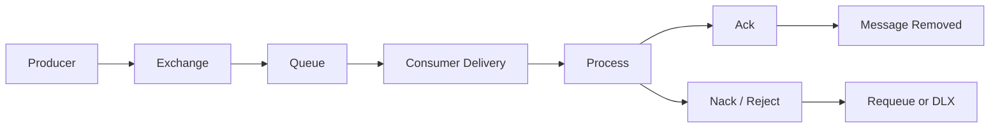
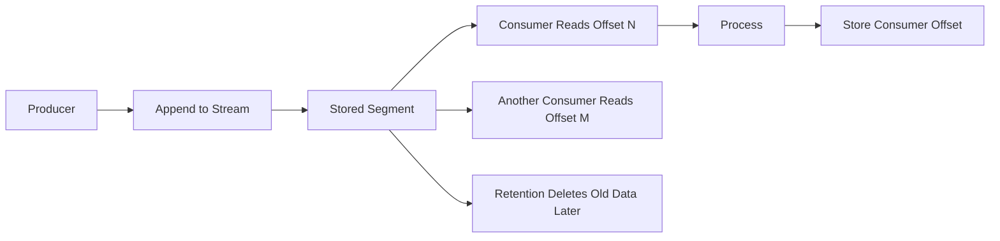
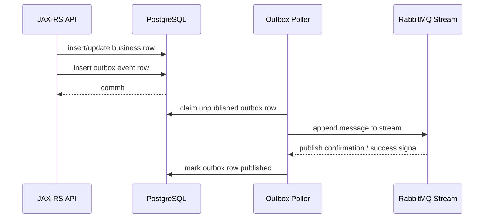

# RabbitMQ Stream

## 1. Core idea

RabbitMQ Stream is not just another queue type.

It is RabbitMQ's log-oriented messaging model.

A normal RabbitMQ queue is primarily designed for message handoff:

```text
producer publishes
broker routes
queue stores temporarily
consumer receives
consumer acknowledges
message leaves the queue
```

A stream is designed for retained message history:

```text
producer appends
broker stores a retained log
consumer reads from an offset
consumer can resume
consumer can replay retained data
retention policy decides when old data disappears
```

That difference changes almost every design question.

With classic/quorum queues, you usually ask:

```text
Who should process this message next?
Has the message been acknowledged?
Should the failed message be retried or dead-lettered?
How large is the queue backlog?
```

With streams, you ask:

```text
What offset has this consumer processed?
How long should messages be retained?
Can consumers replay historical messages?
How do we scale a stream using partitions?
How do we preserve order within a partition?
```

RabbitMQ Stream is useful when you want some log-like behavior while staying inside the RabbitMQ ecosystem.

But it should not be treated as a drop-in replacement for Kafka.

It should also not be treated as a drop-in replacement for quorum queues.

The first design question is therefore simple:

```text
Is this use case about work dispatch?
Or is it about retained event/history consumption?
```

If it is work dispatch, use a queue.

If it is retained event/history consumption, RabbitMQ Stream may be relevant.

---

## 2. Why this topic exists

Many teams learn RabbitMQ through work queues and pub/sub tutorials.

Then they see "streams" and assume:

```text
RabbitMQ now works like Kafka.
```

That assumption is dangerous.

RabbitMQ Stream gives RabbitMQ a stream-oriented model, but the operational envelope, ecosystem, partitioning model, client APIs, governance patterns, and platform maturity can differ from Kafka.

For a senior backend engineer, the important skill is not memorizing stream API calls.

The important skill is knowing when a stream model changes the architecture.

A stream changes:

```text
consumer progress model
message lifecycle
replay semantics
retention planning
storage planning
ordering assumptions
capacity model
observability model
operational runbook
message contract governance
```

In enterprise systems, the main risk is using stream semantics accidentally.

Examples:

```text
A team wants replay but creates normal queues.
A team wants work distribution but uses streams.
A team expects Kafka-like ecosystem guarantees from RabbitMQ Stream.
A team expects queue-style retry/DLQ behavior from streams.
A team stores sensitive payloads with long retention without privacy review.
A team scales with partitions but does not define per-key ordering.
```

RabbitMQ Stream must therefore be introduced as an architectural decision, not as an implementation detail.

---

## 3. Queue vs stream mental model

### Queue mental model

A queue is a handoff buffer.

```text
message exists because work must be delivered
message is removed when acknowledged
consumer failure causes redelivery
backlog means unprocessed work
ack is central to lifecycle
```

Typical queue use cases:

```text
pricing task
email notification task
fulfillment command
approval workflow step
integration job
background calculation
one worker should process one task
```

### Stream mental model

A stream is retained append-only-ish history.

```text
message exists because history/event record should be retained
message is not removed just because one consumer reads it
consumer progress is tracked by offset
multiple consumers can read different offsets
replay is a first-class reason to use the system
retention policy is central to lifecycle
```

Typical stream use cases:

```text
event history distribution
retained integration feed
near-real-time analytics feed
replayable domain event stream
audit-adjacent event pipeline
consumer bootstrap from historical events
```

### The simplest distinction

```text
Queue question:
Who should process this message?

Stream question:
From which offset should this consumer read?
```

That one distinction prevents many wrong designs.

---

## 4. RabbitMQ Stream in the RabbitMQ ecosystem

RabbitMQ Stream is delivered through RabbitMQ stream functionality and a stream protocol/client model.

Conceptually, it sits beside the usual AMQP queue model:

```text
RabbitMQ broker runtime
├── AMQP 0-9-1 model
│   ├── exchanges
│   ├── bindings
│   ├── classic queues
│   ├── quorum queues
│   └── consumers with acknowledgements
│
└── Stream model
    ├── streams
    ├── offsets
    ├── retention
    ├── stream publishers
    ├── stream consumers
    ├── consumer store
    └── super streams / partitioned streams
```

The mental split matters.

Do not assume every AMQP queue feature maps cleanly to streams.

Do not assume every Kafka mental model maps cleanly to RabbitMQ Stream.

Do not assume existing Java AMQP client abstractions automatically support stream workloads correctly.

A stream workload may require a different client library, different connection settings, different port exposure, different metrics, different alerting, and different runbook.

---

## 5. Stream vs queue lifecycle

### Queue lifecycle



### Stream lifecycle



The queue lifecycle is delivery-and-removal oriented.

The stream lifecycle is append-read-retain-expire oriented.

That means replay and storage retention are natural in streams.

It also means you must plan retention and privacy deliberately.

---

## 6. Stream retention

A stream needs a retention policy.

Retention answers:

```text
How long should messages remain available?
How much disk can this stream consume?
Should retention be time-based?
Should retention be size-based?
What happens when retention removes data before a consumer catches up?
```

A queue backlog usually represents unprocessed work.

A stream backlog is more subtle.

A stream can contain old messages because retention intentionally keeps history.

So a large stream is not automatically a problem.

The real question is:

```text
Is every required consumer still within the retained offset range?
```

If a consumer is too far behind and retention deletes old segments, replay from that lost range may no longer be possible.

### Production invariant

For a stream-backed consumer group or named consumer, the platform should be able to answer:

```text
current stream end offset
consumer stored offset
consumer lag
retention window
estimated time before lagged data expires
```

Without that, stream replay safety is mostly guesswork.

---

## 7. Offset mental model

Offset is the consumer's position in the stream.

A queue consumer mainly thinks in delivery tags and acknowledgements.

A stream consumer thinks in offsets.

```text
queue:
  delivery tag identifies a delivery on a channel
  ack/nack controls removal or redelivery

stream:
  offset identifies a position in retained history
  consumer state controls resume/replay
```

A stream consumer can start from different positions:

```text
first available offset
last offset
specific offset
stored consumer offset
timestamp-related position if supported/configured by client semantics
```

The architectural question is not just "can the consumer read?"

The question is:

```text
Where should the consumer start after deployment, crash, replay, migration, or data repair?
```

Wrong offset choice can cause:

```text
missed processing
duplicate processing
massive replay storm
out-of-order business effects
expensive downstream load
privacy exposure from historical replay
```

---

## 8. Consumer store

A stream consumer needs a durable progress model.

RabbitMQ Stream includes consumer store concepts, but an enterprise system may also store progress or deduplication state in its own database.

There are two different concerns:

```text
stream offset progress:
  where the stream consumer resumes reading

business idempotency progress:
  whether this message/business effect has already been applied
```

Do not confuse them.

A stored offset does not prove that the business side effect is correct.

A processed-message table does not by itself tell the stream client where to resume efficiently.

In a PostgreSQL/MyBatis-backed service, a robust design often needs both:

```text
stream consumer offset/progress
processed message or inbox table
business state transition guard
```

### Failure window

Consider this sequence:

```text
1. Consumer reads event at offset 500.
2. Consumer updates order state in PostgreSQL.
3. Consumer crashes before storing offset 501.
4. Consumer restarts from offset 500.
```

The event may be processed again.

That is acceptable only if the business operation is idempotent.

Offset tracking reduces repeated work.

It does not remove the need for idempotent business state changes.

---

## 9. Stream publisher model

A stream publisher appends messages to a stream.

Compared with AMQP publishing, the important questions are:

```text
Which stream is the target?
Is the publisher using a stream-specific client?
Is publishing confirmed?
What batching strategy is used?
What is the message size distribution?
What is the routing/partitioning strategy for super streams?
What metadata is included for correlation, schema, and replay?
```

For Java/JAX-RS services, publishing to a stream should still respect transactional boundaries.

If an HTTP request creates or changes business state and then emits a stream message, the same old problem appears:

```text
DB commit succeeds, stream publish fails.
```

A stream does not remove the need for outbox reasoning.

For mission-critical business events, consider:

```text
business row + outbox row in one PostgreSQL transaction
outbox publisher appends to stream
publish confirmation observed
outbox row marked published
idempotent downstream stream consumers
```

---

## 10. Stream consumer model

A stream consumer reads retained messages.

The consumer design must define:

```text
consumer identity
start offset
stored offset behavior
processing concurrency
per-key ordering requirement
idempotency mechanism
error handling
replay procedure
shutdown behavior
lag monitoring
```

Unlike a queue consumer, a stream consumer should not be judged only by "is the queue empty?"

It should be judged by:

```text
lag
processing rate
offset commit/store rate
error rate
replay rate
retention safety margin
consumer restart behavior
```

### Consumer correctness rule

A stream consumer must be idempotent unless the processing effect is purely analytical and naturally overwrite-safe.

Replay is one of the reasons streams exist.

Replay without idempotency is a production incident waiting to happen.

---

## 11. Stream replay

Replay is the ability to consume historical messages again.

Replay is useful for:

```text
rebuilding projections
repairing downstream state
reprocessing after bug fix
bootstrapping a new consumer
reconstructing audit-adjacent views
running backfill jobs
```

Replay is dangerous when:

```text
messages trigger external side effects
messages create duplicate orders/tasks/notifications
consumers are not idempotent
payload schemas changed incompatibly
old messages contain sensitive data
retention is misunderstood
backfill overloads PostgreSQL or downstream services
```

### Replay is not just a broker feature

Replay needs an application-level runbook:

```text
which consumer can replay
from what offset
to what offset
under what rate limit
with what idempotency guard
with what operator approval
with what audit log
with what rollback/repair plan
```

In enterprise systems, replay should be treated as an operational change.

Not as a developer convenience.

---

## 12. Stream vs Kafka

RabbitMQ Stream overlaps with Kafka in some mental models:

```text
append-oriented storage
retention
offset-based consumption
replay
partitioned scaling via super streams
```

But Kafka remains a different platform category:

```text
Kafka is primarily a distributed log/event streaming platform.
RabbitMQ is primarily a messaging broker with queue/routing heritage and stream capability.
```

Decision questions:

| Question | RabbitMQ Stream may fit | Kafka may fit better |
|---|---|---|
| Team already operates RabbitMQ and needs limited retained stream use | Yes | Maybe not worth another platform |
| Enterprise event backbone across many domains | Maybe | Often yes |
| Heavy replay and long retention across many consumers | Maybe | Often yes |
| Work queue/task dispatch | Usually no; use RabbitMQ queues | Usually no |
| Rich routing with exchanges | RabbitMQ core strength | Kafka does not use exchange routing |
| High ecosystem need: Kafka Connect, stream processing, schema tooling | Limited/depends | Often stronger |
| Low-latency brokered messaging with selective routing | RabbitMQ queues/exchanges | Not Kafka's main advantage |
| Partitioned event log with high fanout and replay | RabbitMQ Stream can be considered | Kafka commonly chosen |

The wrong comparison is:

```text
RabbitMQ Stream means we no longer need Kafka.
```

The better comparison is:

```text
For this specific flow, do we need queue dispatch, broker routing, retained stream replay, or enterprise event backbone semantics?
```

---

## 13. Stream vs quorum queue

A quorum queue is still a queue.

It is designed for replicated durable queueing and at-least-once delivery.

A stream is designed for retained stream consumption and offset-based reading.

| Concern | Quorum Queue | RabbitMQ Stream |
|---|---|---|
| Primary model | Work/message delivery | Retained log-like stream |
| Consumer progress | Ack/nack delivery semantics | Offset/progress semantics |
| Message removal | After delivery lifecycle/dequeue | Retention policy |
| Replay | Not the main model | Core model |
| Replication | Raft-backed queue replication | Stream replication model depending setup |
| Use case | Reliable command/task processing | Retained event/history feed |
| Poison message handling | Delivery limit/DLQ patterns | Application/runbook-specific handling |
| Ordering | Queue ordering subject to consumers/retry | Offset ordering within stream/partition |

If the message represents work that must be done once by one worker, a quorum queue is usually easier to reason about.

If the message represents event history consumed by multiple independent readers, a stream may be more appropriate.

---

## 14. Super stream and partitioned stream

A single stream has scaling limits.

A super stream partitions a logical stream into multiple streams.

This is similar in spirit to partitioning, but the details are RabbitMQ-specific.

Partitioning introduces a new design responsibility:

```text
choose partition key
preserve order where needed
avoid hot partitions
route producers consistently
scale consumers correctly
monitor lag per partition
handle partition-level failure
```

For CPQ/order management, possible partition keys might conceptually include:

```text
quoteId
orderId
customerId
tenantId
accountId
```

But do not invent the key.

The correct partition key depends on business invariants.

Examples:

```text
If all events for one order must be processed in order, orderId may be a candidate.
If tenant isolation dominates operations, tenantId may be a candidate.
If account-level ordering matters, accountId may be a candidate.
If load distribution matters more than ordering, a different key may be needed.
```

### Hot partition warning

A partition key that looks semantically clean can still be operationally bad.

Example:

```text
tenantId
```

If one tenant is much larger than others, it can overload one partition.

Partitioning is not just a data-model choice.

It is a capacity planning choice.

---

## 15. Ordering in streams

Streams preserve order within a stream or partition.

But global ordering across partitions is not usually a safe assumption.

Ordering questions:

```text
Do we need order per order?
Do we need order per quote?
Do we need order per tenant?
Do we need total global order?
Can consumers process messages concurrently?
Can replay interleave with live processing?
Can old schema messages be replayed after new messages?
```

In most enterprise backend systems, global order is too expensive and unnecessary.

A better target is per-aggregate order:

```text
all messages for order O-123 are processed in order
all messages for quote Q-456 are processed in order
```

If RabbitMQ Stream is used, partitioning should align with the aggregate whose order matters.

If it does not, stream ordering may look correct in the broker but still be wrong for the business.

---

## 16. Stream filtering awareness

RabbitMQ Stream has filtering capabilities in newer versions/documentation areas, but this must be verified against the actual broker version, plugin, client library, and platform configuration.

Filtering can reduce data delivered to consumers.

But filtering should not be used as a substitute for contract governance.

Questions to verify:

```text
Is stream filtering available in the deployed RabbitMQ version?
Is the Java stream client version compatible?
What filter metadata is used?
Does filtering affect ordering or consumer expectations?
What happens when filter values are missing or malformed?
How is filtering tested?
```

If filtering is not explicitly enabled and tested internally, assume consumers receive the stream data they subscribe to and must filter safely at application level.

---

## 17. Message contract in streams

Stream retention makes contract mistakes more painful.

In a normal queue, old messages usually disappear after processing.

In a stream, old messages may remain and be replayed later.

Therefore, stream payload design must be more disciplined:

```text
messageType
messageVersion
schemaVersion
contentType
createdAt
producer
correlationId
causationId
aggregateId
partitionKey
```

Backward compatibility matters because old retained messages may meet new consumer code.

Forward compatibility matters because old consumers may read new messages during rolling deployments.

A stream schema change should answer:

```text
Can old messages still be parsed?
Can new consumers handle old versions?
Can old consumers ignore new fields?
Is a breaking change isolated by new message type/version?
Is replay across versions tested?
```

---

## 18. Outbox with RabbitMQ Stream

For business events, a stream publisher should still be integrated with an outbox.

The target changes from exchange/queue to stream append, but the consistency problem remains.



Critical details:

```text
outbox row must contain message key/aggregate ID
outbox row must contain schema/message version
publisher must handle duplicate append attempts
consumer must handle duplicate business effects
outbox retention must align with stream retention
```

A stream gives replay after publish.

It does not guarantee that publish happens atomically with database commit.

---

## 19. Inbox/idempotency with stream consumers

Replay means duplicate processing is normal.

A stream consumer should not assume:

```text
I read this offset once, therefore the business side effect happened once.
```

Use idempotency based on stable message identity or business identity:

```text
messageId
aggregateId + eventVersion
business command ID
producer event ID
correlation ID + message type where appropriate
```

For PostgreSQL/MyBatis:

```sql
CREATE TABLE processed_stream_message (
  consumer_name TEXT NOT NULL,
  message_id TEXT NOT NULL,
  stream_name TEXT NOT NULL,
  stream_offset BIGINT,
  processed_at TIMESTAMPTZ NOT NULL DEFAULT now(),
  PRIMARY KEY (consumer_name, message_id)
);
```

This is only an example.

Actual schema must be aligned with internal standards.

The principle is:

```text
consumer offset controls reading progress
inbox/processed-message state controls business idempotency
```

---

## 20. Error handling in streams

Queue consumers often use retry/DLQ topology.

Stream consumers need a deliberate error handling model.

Options include:

```text
skip with error record
pause consumer and alert
write failed message to an error table
publish failure event to a queue or exchange
route failed processing to a DLQ-like queue
manual replay after fix
quarantine by offset range
```

Do not blindly port queue retry semantics.

A poison message in a stream can block a consumer if the consumer refuses to advance offset.

But skipping it without record can lose business processing.

A production stream consumer needs a policy for:

```text
parse failure
schema incompatibility
business validation failure
transient database failure
downstream service failure
security/privacy rejection
poison payload
```

### Practical pattern

```text
transient infrastructure failure:
  retry locally with bounded backoff, then pause/alert

poison message:
  record failure with stream offset and message ID, isolate, advance only if business-approved

schema failure:
  alert contract owner, do not silently ignore unless explicitly forward-compatible

external side effect failure:
  require idempotent external call or compensation strategy
```

---

## 21. Stream observability

A stream dashboard should not look exactly like a queue dashboard.

Queue dashboard:

```text
ready messages
unacked messages
consumer count
ack rate
redelivery rate
DLQ size
```

Stream dashboard:

```text
append rate
read rate
consumer lag
stored offset
end offset
retention window
segment/disk usage
consumer restart count
replay activity
error offset
partition lag
```

For super streams:

```text
lag per partition
append rate per partition
hot partition detection
consumer assignment/state
partition-level error rate
```

### Minimum production questions

```text
Which consumer is behind?
How far behind is it?
Will retention delete data before it catches up?
Which partition is hot?
Is replay currently running?
Are consumers failing at the same offset repeatedly?
```

If you cannot answer these, stream operations are immature.

---

## 22. Performance considerations

Stream workloads can be efficient for high-throughput append/read patterns, but performance depends on design.

Key factors:

```text
message size
batching
publisher confirmation mode
stream segment storage
retention policy
number of streams
number of consumers
consumer processing cost
consumer offset store frequency
partition count
hot partition distribution
network path
storage I/O
```

Avoid these mistakes:

```text
using one partition for all high-volume tenant traffic
using tiny messages but no batching where batching is expected
storing huge payloads instead of references
retaining sensitive large payloads too long
using stream replay to compensate for poor database repair tooling
running replay at full speed against a fragile downstream DB
```

### Java/JAX-RS implication

Do not let request threads become stream publishing bottlenecks.

For critical business messages, prefer:

```text
HTTP request writes DB + outbox
background publisher appends to stream
publisher exposes lag and error metrics
```

This keeps API latency independent from stream broker hiccups.

---

## 23. Security and privacy concerns

Streams retain messages.

Retention changes privacy risk.

A sensitive value in a normal queue may still be bad.

A sensitive value in a retained stream can be worse because it remains available for replay and inspection until retention removes it.

Review:

```text
PII in payload
PII in headers
tenant ID exposure
actor/user ID exposure
credential/token leakage
long retention of sensitive payloads
DLQ/error table duplication
replay access controls
stream read permission
management UI visibility
backup/snapshot retention
```

For enterprise systems, stream access should be least privilege.

Not every service that can publish should be able to read historical stream data.

Not every operator should be able to replay sensitive streams.

Replay should be auditable.

---

## 24. Kubernetes and deployment concerns

RabbitMQ Stream may require additional broker configuration, plugin enablement, port exposure, storage planning, and client configuration.

In Kubernetes, verify:

```text
stream plugin enabled if required
stream listener port exposed correctly
service and network policy allow stream clients
persistent volumes sized for retention
pod anti-affinity protects replicas
resource limits do not throttle broker badly
monitoring includes stream metrics
backup/restore approach is understood
client workloads handle rolling restart
```

For client workloads:

```text
consumer stores offset before/after business effect intentionally
consumer shuts down without corrupting progress
consumer replicas do not duplicate side effects unexpectedly
replay jobs are separated from normal live consumers
rate limits protect downstream systems during replay
```

---

## 25. Cloud, on-prem, and hybrid concerns

A stream workload is storage-heavy compared with a simple transient queue workload.

In cloud-managed or self-managed RabbitMQ, verify:

```text
stream support in the chosen offering/version
available plugin and protocol support
port exposure and private connectivity
storage limits and retention behavior
monitoring support for streams
backup/snapshot cost and restore behavior
cross-zone latency
cross-region replication expectation
upgrade compatibility
```

In on-prem/hybrid environments, also verify:

```text
firewall rules for stream protocol
certificate trust chain
disk throughput
filesystem behavior
monitoring integration
operator runbook maturity
hybrid replay risk over constrained links
```

A stream can move a lot of data.

Network and disk are first-class design concerns.

---

## 26. When to use RabbitMQ Stream

Consider RabbitMQ Stream when:

```text
you already operate RabbitMQ well
you need retained history inside RabbitMQ
you need replay for selected consumers
you need higher-throughput log-like consumption than normal queues
you want multiple independent consumers reading retained messages
your retention window is bounded and well understood
your teams can operate stream-specific metrics and runbooks
your Java services can use appropriate stream client patterns
```

Possible examples:

```text
retained domain event feed
projection rebuild feed
integration feed with replay window
analytics-adjacent event stream
consumer bootstrap from recent history
```

---

## 27. When not to use RabbitMQ Stream

Do not use RabbitMQ Stream when:

```text
you only need one worker to process one task
retry/DLQ queue semantics are the main need
you do not need retention/replay
consumer idempotency is weak
privacy rules make retained payloads risky
Kafka is already the enterprise event backbone and fits better
you need Kafka ecosystem integrations
you cannot monitor consumer lag and retention safety
you cannot operate stream-specific clients and ports
```

For task distribution, use classic/quorum queues.

For replicated durable command processing, use quorum queues.

For enterprise-wide event streaming and long retention, evaluate Kafka seriously.

For short-lived background jobs, streams are usually unnecessary.

---

## 28. CPQ/order management examples

These are conceptual examples only.

They are not claims about CSG internals.

### Potential stream-fit examples

```text
Quote lifecycle event history for projections
Order state-change history for downstream views
Fulfillment status feed with replay window
Catalog change feed to rebuild read models
Pricing event feed for analytics-adjacent consumers
```

### Poor stream-fit examples

```text
Send this email once
Run this pricing calculation once
Call this downstream system once
Approve this task once
Retry this failed fulfillment command with DLQ
```

Those are usually queue workloads.

### Business invariant question

Before choosing Stream, ask:

```text
Is this message a retained fact about something that happened?
Or is it a command/task that must be executed?
```

That question maps directly to event history vs work dispatch.

---

## 29. Debugging RabbitMQ Stream issues

### Symptom: consumer is missing messages

Check:

```text
consumer start offset
stored offset
retention window
consumer identity
stream name/partition assignment
filter configuration if used
client logs
schema parse failures
```

### Symptom: consumer reprocessed old messages

Check:

```text
offset store failure
consumer identity changed
deployment reset offset
manual replay triggered
stream consumer store unavailable
inbox/idempotency table behavior
```

### Symptom: consumer lag grows

Check:

```text
append rate vs processing rate
hot partition
consumer CPU/memory
DB bottleneck
downstream API latency
batch size
offset store frequency
error retry loop
```

### Symptom: replay caused incident

Check:

```text
replay authorization
rate limit
idempotency guard
downstream load
old schema compatibility
external side effects
operator runbook
```

### Symptom: disk grows quickly

Check:

```text
retention configuration
message size
number of streams
replication factor
segment cleanup behavior
replay jobs
backup/snapshot policy
```

---

## 30. Internal verification checklist

Verify with backend, platform, SRE, integration, and security teams:

```text
Is RabbitMQ Stream used at all?
Which RabbitMQ version is deployed?
Is stream plugin/protocol enabled?
Which client library is used by Java services?
Which port/service exposes stream protocol?
Which streams exist?
Which services publish to streams?
Which services consume from streams?
What retention policy exists per stream?
Are super streams used?
What partition key is used?
How is consumer offset stored?
Is consumer store used?
Is there an application inbox/processed-message table?
Can consumers replay intentionally?
Who is authorized to run replay?
How is replay audited?
What dashboard shows consumer lag?
What alert protects retention safety?
What is the largest message size?
Are sensitive fields stored in stream payload/header?
How are schema versions handled?
Are stream consumers contract-tested?
How are failed messages isolated?
Is there a runbook for poison stream message?
How are stream metrics exported?
Is stream traffic covered by TLS/mTLS?
How are credentials rotated?
How is storage sized for retention?
How are backups/restores handled?
How do upgrades affect stream compatibility?
```

---

## 31. PR review checklist

When reviewing a PR involving RabbitMQ Stream, ask:

```text
Why stream instead of queue?
Why stream instead of Kafka?
What retention is required?
What is the start offset behavior?
What is the consumer identity?
What is the idempotency key?
What happens during replay?
What happens when an old message schema is replayed?
What happens when consumer processing fails?
What happens when offset store fails?
What happens when DB commit succeeds but offset store fails?
What happens when stream append succeeds but outbox mark-published fails?
How is lag monitored?
How is retention safety monitored?
How is partition key selected?
Can one tenant/account/order create a hot partition?
Does the payload contain sensitive data?
Who can read/replay this stream?
Is the runbook updated?
Is the dashboard updated?
Is the contract documented?
Are integration tests covering replay?
```

---

## 32. Common wrong assumptions

### Wrong assumption 1: Stream means exactly-once

No.

Replay and offset management make idempotency more important, not less.

### Wrong assumption 2: Stream replaces DLQ

No.

Stream error handling must be designed explicitly.

You may still need an error queue, error table, or quarantine process.

### Wrong assumption 3: Stream means Kafka compatibility

No.

RabbitMQ Stream and Kafka have overlapping concepts but different platforms, clients, operations, and ecosystems.

### Wrong assumption 4: Retention means audit

No.

A retained stream may help reconstruct some history, but audit requires integrity, access control, retention policy, evidence, and governance.

### Wrong assumption 5: Offset means business processing is done

No.

Offset progress is not the same as business correctness.

---

## 33. Senior engineer summary

RabbitMQ Stream is best understood as RabbitMQ's retained, offset-based messaging model.

Use queues for work dispatch.

Use streams for retained event/history consumption.

Use Kafka when the organization needs a broader event streaming backbone, long-retention event platform, or Kafka ecosystem capabilities.

The senior-level questions are:

```text
What are we retaining?
Why do we need replay?
How long is replay safe?
Who owns offsets?
Who owns idempotency?
Who can replay?
What happens when replay meets old schema?
How do we monitor lag and retention safety?
How do we prevent sensitive data from living too long?
```

RabbitMQ Stream is powerful when the use case is truly stream-shaped.

It is risky when teams use it because "stream" sounds more advanced than queue.

---

## 34. References for further study

Use these as starting points, then verify against the deployed RabbitMQ version and internal platform standards:

```text
RabbitMQ Streams and Super Streams documentation
RabbitMQ Stream Java client documentation
RabbitMQ stream protocol documentation
RabbitMQ stream filtering documentation, if relevant to deployed version
RabbitMQ quorum queue documentation
RabbitMQ classic queue documentation
RabbitMQ observability and Prometheus documentation
Internal RabbitMQ platform runbooks
Internal messaging architecture decision records
Internal security/privacy data classification rules
```
