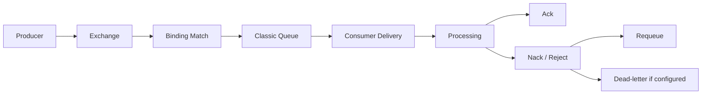
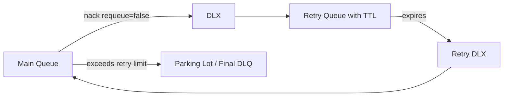

# Classic Queue Deep Dive

## 1. Core idea

Classic queue is RabbitMQ's original general-purpose queue type.

It is the queue type many teams encounter first.

It is flexible, familiar, and widely used.

But it must be understood precisely.

A classic queue is primarily a FIFO work/message delivery structure inside RabbitMQ.

It is suitable for many workloads, but it is not the strongest choice when replicated data safety is the top priority.

For high data safety and replicated durable queues, quorum queues are usually the more appropriate modern queue type.

For retained replay-oriented event history, streams are the more appropriate model.

So the core mental model is:

```text
classic queue:
  versatile non-stream queue type
  useful for many simple and moderate workloads
  supports features such as priority queues and single active consumer
  requires careful durability and failure analysis
  not a replacement for quorum queue or stream
```

Classic queue is not "bad".

Classic queue is also not automatically production-safe.

It is a tool with a specific failure and performance profile.

---

## 2. Why this topic exists

Classic queues appear everywhere in enterprise RabbitMQ installations.

Reasons:

```text
default queue type in older systems
simple tutorials create classic queues
legacy topology uses classic queues
priority queues require classic queue support
some short-lived or non-critical workloads do not need quorum replication
older mirrored queue topologies were based on classic queues
```

The danger is that teams often treat all RabbitMQ queues as equivalent.

They are not.

A senior engineer reviewing RabbitMQ topology must ask:

```text
What queue type is this?
What failure mode does this queue type have?
What durability does the business require?
What happens on node failure?
What happens on broker restart?
What happens under backlog?
What happens under large message load?
What happens during retry storm?
```

Classic queue is the right topic for learning these questions because it forces you to separate queue API familiarity from production reliability.

---

## 3. Classic queue position in queue type landscape

```text
RabbitMQ queue/storage models
├── Classic queue
│   ├── original general-purpose queue
│   ├── non-replicated by default
│   ├── supports priority queue
│   ├── can use single active consumer
│   ├── suitable for many ordinary queue workloads
│   └── legacy mirrored classic queues should be treated carefully
│
├── Quorum queue
│   ├── replicated durable queue
│   ├── Raft-based model
│   ├── better fit when data safety is priority
│   └── different performance/feature trade-offs
│
└── Stream
    ├── retained log-like model
    ├── offset-based consumers
    ├── replay/retention oriented
    └── not a normal work queue replacement
```

The review question is not:

```text
Does this queue work locally?
```

The review question is:

```text
Is this queue type correct for the business and operational risk?
```

---

## 4. Classic queue lifecycle

A classic queue participates in the normal AMQP lifecycle:



The queue stores messages until they are delivered and acknowledged, expired, rejected/dead-lettered, dropped due to limit/overflow behavior, or lost due to durability/failure conditions.

That lifecycle depends on multiple configuration choices:

```text
queue durability
message persistence
exclusive flag
auto-delete flag
TTL
max length
overflow behavior
DLX configuration
consumer ack mode
prefetch
priority configuration
single active consumer
```

A classic queue is therefore not one behavior.

It is a family of behaviors controlled by declarations, policies, and runtime conditions.

---

## 5. Durable queue vs persistent message

Two terms are often confused:

```text
durable queue:
  queue definition survives broker restart

persistent message:
  message is marked for persistence
```

You generally need both for messages to survive broker restart:

```text
queue must be durable
message delivery mode must be persistent
exchange should be durable if topology must survive restart
```

Even then, understand the exact reliability envelope of the queue type.

A durable classic queue with persistent messages is not the same as a replicated quorum queue.

### Java publisher implication

A Java/JAX-RS publisher must not assume durability just because the queue exists.

Review publisher code for:

```text
deliveryMode = 2 / persistent equivalent
publisher confirms enabled
mandatory flag if unroutable detection matters
return listener or alternate exchange
outbox if DB + publish atomicity matters
```

### Consumer implication

Consumer ack discipline still matters.

Persistent message does not prevent duplicate delivery.

Durable queue does not remove the need for idempotent consumers.

---

## 6. Classic queue storage awareness

You do not need to become RabbitMQ internals specialist to be effective.

But you must know that classic queues involve broker-side storage structures and disk/memory behavior.

The practical implications are:

```text
large backlogs consume broker resources
persistent messages create disk I/O pressure
large messages amplify memory/disk/network cost
many queues increase metadata and operational overhead
priority queues add internal overhead
retry storms increase enqueue/dequeue churn
slow consumers cause queue growth
```

A classic queue backlog is not just a number in Management UI.

It represents resource pressure and business delay.

For production operations, always connect queue depth to:

```text
consumer throughput
message age
business SLA
disk usage
memory pressure
publish rate
redelivery rate
DLQ size
```

---

## 7. Persistent vs transient messages

A transient message is not meant to survive broker restart.

A persistent message is marked for disk persistence.

Use transient messages only when loss is acceptable.

Examples where transient may be acceptable:

```text
short-lived cache invalidation where DB remains source of truth
non-critical telemetry where loss is tolerable
best-effort UI refresh signal
```

Examples where persistent is usually required:

```text
order command
quote acceptance event
fulfillment task
billing-related integration message
approval task
fallout handling command
```

Even with persistent messages, design for:

```text
duplicate delivery
publisher retry duplicate
consumer crash after side effect
DLQ/retry handling
broker/node failure envelope
```

Persistence is about not losing stored messages under certain failures.

It is not exactly-once processing.

---

## 8. Classic queue and FIFO

Classic queues are commonly understood as FIFO queues.

That is a useful baseline but not a complete production guarantee.

FIFO can be affected by:

```text
multiple consumers
prefetch greater than 1
consumer processing time differences
redelivery
requeue
priority queues
retry queues
DLQ replay
consumer cancellation
single active consumer configuration
```

If strict ordering is required, a classic queue needs additional constraints:

```text
one active consumer or single active consumer
small prefetch, often 1 for strict processing order
no priority queue
careful retry design
idempotent per-aggregate state transition
no parallel processing that commits out of order
```

### Senior rule

Queue order is not the same as business order.

Business order must be proven at the consumer and database state transition boundary.

---

## 9. Priority queue

Classic queues support priority queues.

Priority queues are useful when some messages should be delivered before others.

But priority is not free.

It can increase CPU and memory overhead because the broker must manage priority levels internally.

Priority queues can also make ordering harder to reason about.

Use priority only when the business truly needs it.

Bad use cases:

```text
every team wants its messages to be high priority
priority used to hide insufficient consumer capacity
priority used instead of separate operational queues
priority used without starvation monitoring
```

Better use cases:

```text
customer-impacting remediation task beats low-value background sync
manual support replay beats routine batch import
urgent fallout handling beats non-urgent notification
```

### Priority review checklist

```text
What priority values are allowed?
Is the range small?
Who can publish high priority?
Can low-priority messages starve?
Is priority visible in metrics/logs?
Is priority part of message contract?
Is priority abused as a capacity workaround?
```

---

## 10. Single active consumer

Single active consumer means only one consumer is active for a queue at a time, with failover to another registered consumer when needed.

It is useful when you need:

```text
stronger ordering control
active/passive consumption model
avoidance of concurrent processing for one queue
consumer failover without multiple active workers
```

But it limits throughput.

If one active consumer is slow, the queue is slow.

Use single active consumer when correctness requires it.

Do not use it accidentally because debugging concurrency is hard.

### Design question

```text
Do we need one active consumer for the whole queue?
Or do we need ordering per aggregate?
```

If ordering is only per order/quote/customer, a single active consumer for all messages may be over-conservative.

A better design might partition by aggregate or route to multiple queues.

---

## 11. Lazy behavior awareness

RabbitMQ has historically exposed lazy queue behavior for classic queues, where messages are kept on disk as much as possible to reduce memory pressure for large backlogs.

This should be treated carefully and verified against the deployed RabbitMQ version and current internal standards.

Lazy behavior can help when:

```text
queues can build large backlogs
messages are not latency critical
memory pressure is a concern
workload is backlog-heavy rather than low-latency
```

But it can hurt when:

```text
low latency delivery is required
consumer catches up rapidly and disk I/O becomes bottleneck
messages are large and persistent
storage is slow
operators expect memory metrics alone to show pressure
```

Do not enable lazy behavior blindly.

It is an operational trade-off between memory pressure and disk I/O/latency.

---

## 12. Queue length and overflow

Classic queues can be configured with length limits.

Limits can protect the broker from unbounded growth.

But they also decide what happens to messages when the queue is full.

Possible outcomes depend on configuration:

```text
old messages dropped or dead-lettered
new publishes rejected
publisher receives failure if configured correctly
messages silently disappear from business perspective if no detection exists
```

For business-critical queues, queue length limit must be reviewed carefully.

A length limit is not only capacity control.

It is data-loss policy.

### Review questions

```text
Is max length configured?
Is max length bytes configured?
What is overflow behavior?
Are dropped messages dead-lettered?
Do publishers detect reject-publish?
Is there an alert before the limit is reached?
Is the limit sized by SLA and throughput?
```

---

## 13. Classic queue DLX integration

Classic queues can use dead-letter exchanges.

Messages may be dead-lettered due to:

```text
negative acknowledgement/reject with requeue=false
message TTL expiry
queue length limit overflow
other broker-supported dead-lettering causes depending queue type/configuration
```

A classic queue without DLX for critical workloads is usually incomplete.

DLX design should define:

```text
dead-letter exchange name
dead-letter routing key
DLQ owner
retention policy
replay procedure
privacy classification
alert threshold
x-death interpretation
poison message isolation
```

### Anti-pattern

```text
main queue -> retry queue -> main queue forever
```

Without retry count and parking lot strategy, this becomes a retry storm.

---

## 14. Classic queue and retry topology

Classic queues are often used in TTL-based retry topologies:



This pattern works, but it has trade-offs:

```text
ordering can be broken
x-death parsing becomes important
retry delay is broker/config driven
message can loop indefinitely if retry limit is missing
DLX misconfiguration can drop or strand messages
parking lot replay requires runbook
```

For classic queues, retry topology is often simple to implement but easy to operate badly.

The hard part is not declaring the queues.

The hard part is preventing infinite retry and preserving business correctness.

---

## 15. Classic queue performance profile

Classic queue performance depends on:

```text
message size
persistent vs transient messages
consumer ack rate
publisher confirms
queue length
number of queues
priority levels
single active consumer
prefetch
consumer concurrency
disk I/O
memory pressure
network throughput
routing fanout
```

### Common bottlenecks

```text
persistent message disk write cost
large message serialization/deserialization
slow consumer transaction time
DB connection pool saturation
high redelivery rate
priority queue overhead
many idle queues with operational overhead
queue growth due to downstream outage
```

### Tuning sequence

Do not tune randomly.

Use this order:

```text
1. Identify business SLA and throughput target.
2. Measure publish rate, deliver rate, ack rate.
3. Check queue depth and message age.
4. Check ready vs unacked messages.
5. Check consumer utilization.
6. Check DB/downstream bottleneck.
7. Check message size and persistence settings.
8. Tune prefetch and consumer concurrency.
9. Review queue type and retry topology.
10. Load test before production change.
```

---

## 16. Classic queue HA legacy awareness

Older RabbitMQ systems may use mirrored classic queues for high availability.

Modern RabbitMQ guidance generally points teams toward quorum queues or streams for replicated data safety use cases.

For a senior engineer, the point is not to memorize every historical feature.

The point is to recognize legacy risk.

If you see terms like:

```text
ha-mode
ha-params
mirrored queue
classic queue mirroring
queue master
```

Treat it as an internal verification trigger.

Ask platform/SRE:

```text
Is this legacy mirrored classic queue setup?
Is it still supported by our deployed RabbitMQ version?
What is the migration plan?
Why not quorum queue?
What incidents have occurred around failover?
```

Do not propose migration casually.

Queue type migration affects durability, ordering, throughput, operational behavior, and client expectations.

---

## 17. Broker restart behavior

Classic queue behavior on broker restart depends on durability and persistence.

Review:

```text
is the queue durable?
is the exchange durable?
are bindings durable?
are messages persistent?
was the node hosting the queue lost?
is the queue replicated or not?
was the message confirmed to publisher?
had the consumer acked the message?
```

A typical risk chain:

```text
publisher sends transient message
queue is non-durable
broker restarts
message/topology disappears
producer thought work was submitted
consumer never receives it
```

For critical flows, this is unacceptable.

For best-effort flows, it may be fine if explicitly documented.

---

## 18. Node failure behavior

A non-replicated classic queue lives on a node.

If that node fails, availability and data safety depend on topology and RabbitMQ version/configuration.

This is why queue type matters.

For critical enterprise flows, ask:

```text
Can this queue tolerate node loss?
If not, is that acceptable?
Is the queue replicated?
Should it be quorum instead?
What is the recovery process?
How does the client reconnect?
Will producers fail fast or block?
Will consumers reconnect to another node?
```

A load balancer in front of RabbitMQ does not magically replicate queue data.

Client connectivity HA is not the same as message data HA.

---

## 19. Classic queue and Java publisher design

A Java publisher sending to a classic queue through an exchange should define:

```text
exchange name
routing key
mandatory flag behavior
publisher confirm handling
message persistence
message ID/correlation ID
content type
schema version
retry-on-publish failure policy
outbox integration
metrics
```

### Anti-pattern

```java
channel.basicPublish(exchange, routingKey, null, payload);
```

This hides too many decisions.

Better production design wraps publishing behind an internal abstraction that forces:

```text
message metadata
persistent delivery mode where required
confirm handling
unroutable detection
structured logging
metrics
dead-letter/retry contract awareness
```

---

## 20. Classic queue and Java consumer design

A Java consumer processing a classic queue should define:

```text
manual ack
prefetch
idempotency key
transaction boundary
error classification
nack/reject policy
DLQ behavior
shutdown drain
metrics
```

### Correctness sequence

For a database-backed consumer:

```text
1. receive delivery
2. parse and validate message
3. start transaction
4. check inbox/idempotency
5. apply business state transition
6. commit transaction
7. ack message
```

If the consumer acks before the durable side effect, it risks message loss.

If the consumer commits and crashes before ack, it risks duplicate processing.

That duplicate is acceptable only if idempotency is correct.

---

## 21. PostgreSQL/MyBatis integration

Classic queue consumers often update PostgreSQL.

The database is where business correctness is enforced.

Use PostgreSQL/MyBatis for:

```text
idempotency table
business unique constraints
state transition guards
inbox table
retry/processing audit
dead-letter correlation
repair queries
```

### Example idempotency guard

```sql
INSERT INTO processed_message (consumer_name, message_id, processed_at)
VALUES (:consumerName, :messageId, now())
ON CONFLICT DO NOTHING;
```

If row count is zero, the message was already processed.

This is only a pattern illustration.

Actual schema and transaction management must follow internal standards.

---

## 22. Observability for classic queues

Minimum dashboard metrics:

```text
ready messages
unacked messages
total messages
publish rate
deliver rate
ack rate
redelivery rate
consumer count
consumer utilization
message age if available
DLQ depth
retry queue depth
memory usage
disk usage
connection/channel count
```

Interpretation:

```text
ready increasing:
  consumers are too slow or down

unacked increasing:
  consumers received messages but are stuck, slow, or over-prefetched

redelivery increasing:
  failures or requeue loop

DLQ increasing:
  poison/permanent failures or retry exhaustion

publish rate > ack rate for long period:
  backlog will grow
```

Do not alert only on queue depth.

Queue depth without message age and business context creates noisy or late alerts.

---

## 23. Failure modes

### Failure mode 1: queue grows forever

Causes:

```text
consumer down
consumer too slow
DB bottleneck
downstream outage
prefetch too low for workload
consumer exceptions
routing spike
```

Detection:

```text
ready messages increasing
consumer utilization low or zero
ack rate below publish rate
message age increasing
```

Response:

```text
identify consumer health
check downstream dependencies
scale consumers only if downstream can handle it
pause publishers if needed
inspect DLQ/retry rate
```

### Failure mode 2: unacked grows

Causes:

```text
consumer stuck after receiving delivery
prefetch too high
thread pool deadlock
DB transaction hanging
external API slow
consumer not acking
```

Response:

```text
inspect consumer logs/thread dumps
check DB lock waits
check downstream latency
consider lowering prefetch
restart only with duplicate/idempotency awareness
```

### Failure mode 3: redelivery loop

Causes:

```text
consumer nacks with requeue=true repeatedly
transient dependency remains down
poison message always fails
no retry delay
```

Response:

```text
stop requeue loop
route to DLQ/parking lot
classify failure
fix consumer or payload
replay safely
```

### Failure mode 4: message lost suspicion

Check:

```text
publisher confirm logs
mandatory return logs
alternate exchange
exchange/queue/binding existence
queue durability
message persistence
consumer ack timing
DLX/TTL/overflow behavior
application logs by correlation ID
```

Do not start with "RabbitMQ lost it."

Start with lifecycle evidence.

---

## 24. Security and privacy concerns

Classic queues can contain sensitive business data.

Review:

```text
payload PII
header PII
message retention in DLQ
Management UI access
queue permission
vhost isolation
log redaction
replay authorization
exported message dumps
backup/snapshot access
```

Classic queues used for DLQ can become sensitive archives.

A DLQ may retain failed payloads much longer than the main queue.

That means privacy review must include:

```text
main queue
retry queue
DLQ
parking lot queue
manual replay tool
operator logs
consumer error table
```

---

## 25. Kubernetes concerns

Classic queue behavior is broker-side, but client workloads in Kubernetes affect queue health.

Review Java consumers for:

```text
graceful shutdown
in-flight message drain
manual ack after processing
consumer cancellation handling
prefetch per replica
replica scaling impact
rolling deployment duplicate risk
CPU throttling
memory limits
DB connection pool sizing
```

Example risk:

```text
10 replicas × prefetch 100 = 1000 unacked messages
```

If each message takes 30 seconds and DB pool is small, this can create long invisible backlog in consumers rather than visible ready backlog in queue.

Unacked messages are still backlog.

They are just assigned backlog.

---

## 26. Cloud/on-prem concerns

For classic queues in AWS/Azure/on-prem, verify:

```text
managed vs self-managed RabbitMQ
broker version
queue type policy
storage performance
backup/restore semantics
node failure recovery
network latency
TLS configuration
secret rotation
monitoring integration
maintenance window
upgrade path
```

Classic queue safety depends on the deployed platform.

Do not infer production behavior from local Docker tests.

A local single-node broker hides:

```text
node failure
storage exhaustion
network partitions
client reconnect storms
operator policy overrides
cross-zone latency
TLS/certificate expiry
```

---

## 27. Migration considerations

Migrating from classic queue to quorum queue or stream is not only a config change.

You must review:

```text
semantics
feature support
performance
ordering
retry topology
DLX behavior
queue declaration arguments
policies
client assumptions
monitoring dashboards
runbooks
load tests
rollback plan
```

### Classic to quorum

Consider when:

```text
message safety is priority
node failure data loss is unacceptable
legacy mirrored classic queue must be replaced
replicated queue semantics are required
```

Watch for:

```text
performance difference
feature differences
poison message/delivery limit behavior
storage growth
leader placement
```

### Classic to stream

Consider only when the use case changes to retained replay/event history.

Do not migrate a work queue to a stream just for novelty.

---

## 28. Internal verification checklist

Verify in codebase/platform:

```text
Which queues are classic queues?
Are they classic by explicit declaration or default policy?
Which queues are durable?
Which messages are persistent?
Which exchanges and bindings feed these queues?
Which services consume them?
What is the business criticality of each queue?
Is node failure data loss acceptable?
Is quorum queue more appropriate?
Are any mirrored classic queues still present?
Are priority queues used?
What max priority is configured?
Is single active consumer used?
Is lazy behavior configured?
Are queue length limits configured?
What overflow behavior is configured?
Is DLX configured?
Where do failed messages go?
Is retry topology TTL-based?
Is x-death parsed safely?
Is parking lot queue available?
Is replay procedure documented?
Are queue metrics dashboarded?
Are alerts based on depth, age, unacked, redelivery, DLQ?
Are consumers idempotent?
Is graceful shutdown implemented?
Are queue declarations managed as code?
Are policies/operator policies overriding app declarations?
```

---

## 29. PR review checklist

When reviewing a PR involving classic queues, ask:

```text
Why classic queue instead of quorum queue?
Is message loss acceptable under node failure?
Is the queue durable?
Are messages persistent?
Are publisher confirms enabled?
Is mandatory publishing or alternate exchange used?
Is consumer manual ack used?
Is ack after durable processing?
Is consumer idempotent?
What is prefetch?
How many consumer replicas exist?
Is DLX configured?
What is retry policy?
How are poison messages isolated?
Is there a max length?
What happens on overflow?
Is priority enabled?
Can priority cause starvation?
Is single active consumer required?
Is ordering actually required?
Is the dashboard updated?
Is alerting updated?
Is runbook updated?
Are integration tests covering retry/DLQ/idempotency?
```

---

## 30. Classic queue decision checklist

Use classic queue when:

```text
workload is simple/moderate queueing
non-replicated queue risk is acceptable or mitigated
feature support such as priority is required
latency/throughput profile fits classic queue behavior
operations team understands the failure model
```

Prefer quorum queue when:

```text
data safety is priority
replicated durable queue is required
node failure message loss is unacceptable
modern HA queue semantics are desired
```

Prefer stream when:

```text
retention and replay are first-class requirements
offset-based consumption is required
multiple consumers need historical reads
```

Prefer Kafka when:

```text
enterprise event streaming backbone is required
long retention and large-scale replay are central
Kafka ecosystem integration is needed
```

---

## 31. Common wrong assumptions

### Wrong assumption 1: Durable queue means durable message

No.

Queue durability and message persistence are different.

### Wrong assumption 2: Classic queue is always safe enough

No.

It depends on business criticality, deployment, durability, and node failure model.

### Wrong assumption 3: Queue depth is the only health signal

No.

Unacked, message age, redelivery, DLQ, consumer utilization, and resource alarms matter.

### Wrong assumption 4: Priority is harmless

No.

Priority adds overhead and can cause starvation.

### Wrong assumption 5: Load balancer means queue HA

No.

Connectivity HA does not equal data replication.

### Wrong assumption 6: Requeue is a retry strategy

No.

Immediate requeue can create a CPU/network redelivery loop.

---

## 32. Senior engineer summary

Classic queues are useful but must be reviewed with precision.

They are not automatically wrong.

They are not automatically safe.

The senior-level skill is knowing which risk matters:

```text
message loss
node failure
broker restart
duplicate delivery
ordering loss
retry storm
DLQ growth
priority starvation
consumer over-prefetch
storage pressure
privacy exposure
```

For non-critical, simple, or feature-specific queue workloads, classic queues may be appropriate.

For mission-critical replicated command/task processing, quorum queues often deserve strong consideration.

For retained replay/event history, streams are a different model.

The correct RabbitMQ design starts by naming the workload correctly.

```text
work dispatch?
reliable command processing?
retained event stream?
best-effort notification?
priority task lane?
strict ordering lane?
```

Only then should you choose the queue type.

---

## 33. References for further study

Use these as starting points, then verify against deployed RabbitMQ version and internal platform standards:

```text
RabbitMQ Classic Queues documentation
RabbitMQ Queues documentation
RabbitMQ Consumer Acknowledgements and Publisher Confirms documentation
RabbitMQ Priority Queues documentation
RabbitMQ Single Active Consumer documentation
RabbitMQ TTL documentation
RabbitMQ Dead Letter Exchanges documentation
RabbitMQ Queue Length Limit documentation
RabbitMQ Quorum Queues documentation
RabbitMQ Streams documentation
Internal RabbitMQ topology-as-code repository
Internal RabbitMQ platform runbooks
Internal CSG service producer/consumer implementations
```
