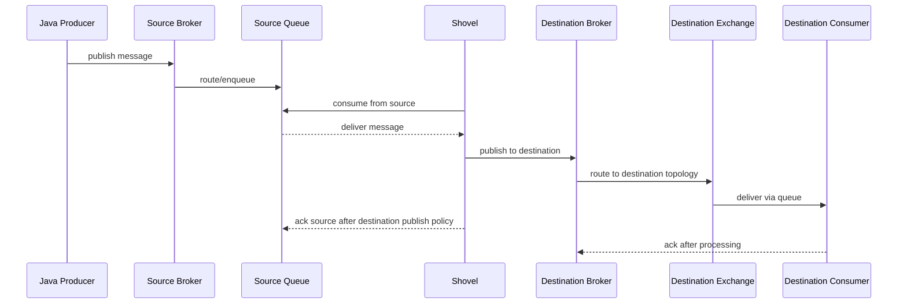
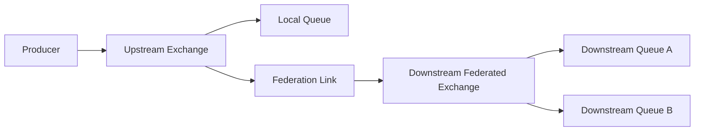
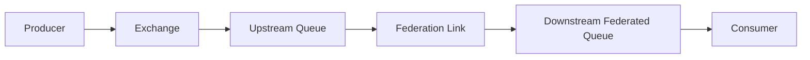
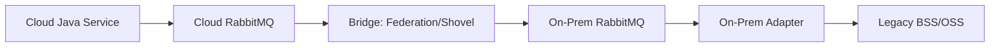

# Federation, Shovel, and Cross-Broker Integration

## 1. Core idea

RabbitMQ clustering is for multiple nodes that belong to one logical broker deployment.

Federation and Shovel are for moving messages between RabbitMQ brokers that are not necessarily part of the same cluster.

The simplest distinction:

```text
Cluster:
  one logical RabbitMQ deployment
  LAN-oriented
  shared cluster membership and metadata
  queue data model depends on queue type

Federation/Shovel:
  broker-to-broker integration
  useful across vhosts, clusters, regions, clouds, or on-prem boundaries
  not equivalent to clustering
  introduces duplicate, ordering, latency, security, and replay concerns
```

Use Federation or Shovel when the real problem is not "make one RabbitMQ cluster bigger", but:

```text
move selected messages between brokers
bridge cloud and on-prem
support migration between RabbitMQ deployments
connect environments temporarily
replicate selected flows for DR or integration
avoid WAN-spanning clusters
```

For a senior backend engineer, the important skill is not memorizing plugin flags.

The important skill is asking:

```text
What messages are crossing the boundary?
Who owns them?
Are they commands, events, or tasks?
Can they be duplicated?
Can they arrive late?
Can they arrive out of order?
Who is allowed to read/write them?
How will we prove the bridge is healthy?
How will we stop it safely?
How will we replay or repair data after failure?
```

---

## 2. Why cross-broker integration exists

Cross-broker integration usually appears when one broker boundary is not enough.

Typical drivers:

```text
cloud-to-on-prem integration
on-prem-to-cloud migration
cross-region delivery
customer-specific deployment topology
regulated environment boundary
air-gapped or semi-connected environment
separation between internal and external integration brokers
DR warm-standby preparation
temporary migration bridge
multi-business-unit platform integration
```

In enterprise Java/JAX-RS systems, this often means a service publishes a message into its local RabbitMQ broker, then another broker receives a copy or forwarded delivery for downstream processing.

Example:

```text
Quote Service
  publishes quote.approved event

Local RabbitMQ broker
  routes message to local subscribers
  also forwards selected messages to integration broker

Integration RabbitMQ broker
  routes to downstream BSS/OSS adapter
```

The bridge is not free.

It adds another delivery boundary.

That boundary must be treated like a distributed system component.

---

## 3. Federation mental model

Federation connects brokers so exchanges or queues can receive messages from one or more upstream brokers.

A useful mental model:

```text
upstream broker
  exchange/queue source
      │
      │ federation link
      ▼
downstream broker
  federated exchange/queue
```

Federation is commonly used when you want brokers to be loosely coupled while still sharing selected message flows.

Federation is not the same as clustering.

A federated broker does not become part of the upstream broker cluster.

The downstream broker remains a separate broker with its own users, vhosts, policies, topology, storage, monitoring, alarms, and operational lifecycle.

### Exchange federation

Exchange federation is useful when messages published to an upstream exchange should be made available to a downstream exchange.

Mental model:

```text
Producer
  publishes to upstream exchange

Upstream exchange
  routes locally
  also feeds federation link

Downstream federated exchange
  receives copies from upstream
  routes using downstream bindings
```

Good fit:

```text
selected event distribution across sites
regional event propagation
publishing events into integration broker
multi-environment migration bridge
```

Common risk:

```text
an event that was local becomes globally visible
routing key semantics differ between brokers
subscriber count increases without producer awareness
message duplication becomes more likely
```

### Queue federation

Queue federation is useful when consumers on a downstream broker should be able to receive messages from upstream queues.

Mental model:

```text
Upstream queue
  holds messages near producer

Federation link
  transfers messages when downstream needs them

Downstream queue
  feeds local consumers
```

Good fit:

```text
remote consumers for selected queue workload
load movement across broker boundary
migration away from an old broker
```

Common risk:

```text
consumer location becomes ambiguous
work distribution is harder to reason about
ordering assumptions become weaker
debugging message ownership becomes harder
```

---

## 4. Shovel mental model

Shovel moves messages from a source to a destination.

A useful mental model:

```text
source broker/vhost/queue/exchange
      │
      │ shovel process/link
      ▼
destination broker/vhost/exchange/queue
```

Shovel is more explicit and lower-level than federation.

It is often easier to reason about for one-way message movement:

```text
take from here
publish there
```

Typical use cases:

```text
one-off migration
continuous bridge between brokers
moving messages from old topology to new topology
cloud-to-on-prem forwarding
on-prem-to-cloud forwarding
DR copy flow
manual recovery path from parking lot or DLQ
```

Important distinction:

```text
Shovel consumes from source and publishes to destination.
```

That means the bridge behaves like a special consumer+producer pair.

So all normal messaging concerns apply:

```text
acknowledgement
publisher confirm
duplicate publish
unroutable destination message
authentication
authorization
TLS
heartbeat
backpressure
monitoring
retry
poison message behavior
```

---

## 5. Dynamic vs static shovel

Shovels can be configured in different ways.

A practical decision model:

```text
Dynamic shovel:
  configured through runtime parameters / management API
  can be started/stopped without node config file changes
  useful for operational and migration workflows

Static shovel:
  configured in broker configuration
  tied more tightly to node config lifecycle
  useful when platform wants declarative static broker config
```

For enterprise operations, prefer a managed, reviewed, auditable configuration path.

Do not let ad-hoc shovels become hidden production integration.

A shovel that runs for months is production architecture, not a temporary script.

---

## 6. Federation vs Shovel

A compact comparison:

| Dimension | Federation | Shovel |
|---|---|---|
| Mental model | Link exchanges/queues across brokers | Consume from source and publish to destination |
| Typical use | Distributed brokers sharing selected flows | Explicit one-way movement or migration |
| Control surface | Federation upstreams/policies | Shovel parameters/config |
| Fit for migration | Possible | Often very clear |
| Fit for broad exchange propagation | Stronger | Possible but more explicit |
| Operational risk | Hidden propagation if not documented | Hidden bridge if not documented |
| Debugging lens | Federation link + upstream/downstream routing | Source consume + destination publish |
| Duplicate risk | Yes | Yes |
| Ordering risk | Yes | Yes |
| Security surface | Broker-to-broker permissions | Source and destination credentials |

Rule of thumb:

```text
Use Federation when brokers should exchange selected routed flows continuously.
Use Shovel when you need explicit movement from source to destination.
```

But do not decide by rule of thumb alone.

Decide based on:

```text
message ownership
failure handling
replay plan
duplicate tolerance
ordering needs
security boundary
observability
operational ownership
migration rollback
```

---

## 7. Federation/Shovel are not WAN clusters

A common architectural mistake is trying to stretch a RabbitMQ cluster across unreliable or high-latency network boundaries.

A better mental model:

```text
Within one low-latency operational boundary:
  RabbitMQ cluster

Across regions/cloud/on-prem/WAN boundaries:
  separate brokers + explicit integration path
```

Federation and Shovel exist because cross-boundary messaging has different trade-offs than cluster membership.

When using cross-broker links, accept that:

```text
latency can increase
messages can be delayed
links can flap
messages can duplicate
routing can diverge
monitoring must cover both sides
security must be configured twice
incident ownership can cross teams
```

This is exactly why bridge topology must be documented like an integration contract.

---

## 8. Message lifecycle through a Shovel

A shovel-based lifecycle often looks like this:



The critical correctness question:

```text
When does the bridge acknowledge the source message?
```

If source ack happens before safe destination publish, message loss can occur during bridge failure.

If destination publish succeeds but source ack fails, duplicate movement can occur.

Therefore downstream consumers must be idempotent.

Cross-broker movement is almost always at-least-once from the business perspective.

---

## 9. Message lifecycle through exchange federation

A simplified exchange federation lifecycle:



The producer publishes once.

The upstream broker routes locally.

The federation link transports eligible messages to the downstream exchange.

The downstream exchange applies its own bindings.

Key implication:

```text
Downstream routing is not automatically identical to upstream routing.
```

A message can be valid upstream and unroutable downstream.

A routing key can mean one thing in one broker and another thing in another broker.

Therefore the bridge contract must define:

```text
source exchange
source routing key pattern
destination exchange
destination bindings
destination queue owners
schema/version compatibility
security classification
replay behavior
```

---

## 10. Message lifecycle through queue federation

A simplified queue federation lifecycle:



Queue federation is more sensitive to work distribution semantics.

Ask:

```text
Is the message supposed to be processed once globally?
Is the message supposed to be processed once per site?
Can local and remote consumers compete?
What happens when the link is down?
Where does backlog accumulate?
Who owns the queue depth alert?
```

If answers are unclear, queue federation can make incidents harder to debug.

---

## 11. Command, event, and task semantics across brokers

Cross-broker integration must distinguish message intent.

### Commands

Commands ask another component to do something.

Example:

```text
fulfillment.order.activate
pricing.quote.recalculate
integration.account.sync
```

Cross-broker command risk:

```text
duplicate command can create duplicate business side effects
late command can apply to stale state
out-of-order command can violate lifecycle rules
lost command can leave workflow stuck
```

Command movement requires strong idempotency and state transition guards.

### Events

Events say something happened.

Example:

```text
quote.approved.v1
order.submitted.v1
order.fallout.created.v1
```

Cross-broker event risk:

```text
downstream misses event during bridge outage
consumer receives duplicate event after reconnect/replay
event arrives after newer state is already known
schema incompatible between environments
```

Events require versioning, deduplication, and reconciliation strategy.

### Tasks

Tasks represent work to perform.

Example:

```text
send-notification
run-pricing-job
export-order-payload
```

Cross-broker task risk:

```text
same task executed in two regions
worker location unclear
retry happens on the wrong side
DLQ lives on one broker but owner watches another
```

Tasks require clear ownership and execution locality.

---

## 12. Duplicate risk

Federation and Shovel both introduce duplicate risk.

Common duplicate scenarios:

```text
destination publish succeeds but source ack fails
bridge reconnects and repeats transfer
source broker redelivers to bridge
network failure hides previous outcome
manual replay repeats already-transferred messages
operator starts two bridges accidentally
migration runs old and new paths in parallel
```

Do not design consumers assuming bridge-level exactly-once.

Use:

```text
message_id
correlation_id
business idempotency key
inbox table
processed_message table
unique constraint
state transition guard
outbox source event id
```

A bridge should never be the only duplicate protection layer.

---

## 13. Ordering risk

Cross-broker links weaken ordering guarantees.

Ordering can be affected by:

```text
parallel bridge links
multiple upstreams
network reconnect
retry
redelivery
destination queue type
multiple destination consumers
manual replay
broker failover
priority queues
separate command/event paths
```

If a business flow requires ordering, define ordering scope explicitly:

```text
per order
per quote
per account
per tenant
per customer
per integration endpoint
```

Then verify:

```text
all messages in that scope use the same route
only one effective consumer processes that scope at a time
retry does not reorder critical transitions
replay process respects sequence or is state-based/idempotent
consumer rejects stale transitions
```

For order management systems, prefer state-transition correctness over relying purely on transport ordering.

The consumer should be able to say:

```text
I received order.completed before order.submitted.
This transition is invalid for current state.
I will reject, park, or mark for investigation.
```

---

## 14. Latency and backpressure risk

Cross-broker messaging adds latency.

Latency sources:

```text
network distance
TLS handshake/reconnect
bridge flow control
source queue backlog
destination broker pressure
destination routing cost
consumer slowdown
WAN packet loss
cloud/on-prem firewall/proxy
```

Backpressure can appear in surprising places:

```text
source broker queue grows because bridge cannot forward
destination broker blocks publishing because disk alarm is active
bridge connection is blocked
downstream queue grows because consumer is down
source system keeps publishing because it only sees local broker success
```

Architecture review must include:

```text
where backlog accumulates
who alerts on that backlog
what SLA applies to bridge latency
what happens when destination is unavailable
whether producer should be throttled
how business users see delayed processing
```

---

## 15. Security model

Federation/Shovel introduces broker-to-broker credentials.

Each link needs least privilege.

For Shovel:

```text
source credential:
  read from source queue or consume from source endpoint

destination credential:
  write to destination exchange or queue
```

For Federation:

```text
upstream credential:
  enough rights to read from upstream exchange/queue flow

downstream broker:
  local routing and resource permissions
```

Security review must check:

```text
vhost isolation
user permissions
write/read/configure regex
topic permissions if used
TLS/mTLS
certificate validation
secret rotation
management UI access
runtime parameter access
audit trail for who created/changed link
```

A bridge credential should not be an administrator credential.

A bridge that can configure all exchanges/queues is a production risk.

---

## 16. Privacy and compliance risk

Cross-broker links can accidentally move sensitive data across boundaries.

Examples:

```text
PII moves from regulated region to non-regulated region
DLQ payload crosses environment boundary
internal-only event becomes externally visible
tenant data crosses tenant boundary
headers include actor/customer identifiers
replay copies old sensitive payloads to new broker
```

Message movement must respect:

```text
data classification
tenant boundary
country/region residency
retention policy
DLQ retention
encryption in transit
encryption at rest depending deployment
access audit
log redaction
```

Do not approve cross-broker integration until data classification is explicit.

---

## 17. Observability requirements

A bridge without metrics is a blind integration.

Minimum observability:

```text
link status
source queue depth
destination queue depth
messages transferred rate
transfer latency
bridge reconnect count
bridge error count
destination publish failure
source consume failure
unroutable destination messages
DLQ growth
retry growth
connection blocked state
heartbeat failures
certificate expiry
```

For Java/JAX-RS systems, application observability must also include:

```text
message_id
correlation_id
causation_id
source broker
source vhost
destination broker
destination vhost
bridge name
business aggregate id
published_at
transferred_at
consumed_at
```

Without correlation metadata, cross-broker debugging becomes manual archaeology.

---

## 18. Runbook: bridge link down

A production-safe triage flow:

```text
1. Confirm which bridge is down.
2. Identify source and destination broker/vhost.
3. Check whether source queue/exchange backlog is growing.
4. Check destination broker availability.
5. Check authentication/permission/TLS errors.
6. Check network/DNS/firewall/security group/path.
7. Check disk/memory alarm on both brokers.
8. Check whether messages are accumulating in DLQ or unroutable path.
9. Estimate customer/business impact by message type.
10. Decide whether to pause publishers, increase consumers, repair link, or replay.
```

Do not immediately replay.

First answer:

```text
Was anything partially transferred?
Can replay duplicate business side effects?
Are consumers idempotent?
Do we have a replay cutoff/window?
Is destination topology compatible?
```

---

## 19. Runbook: destination unroutable

Symptoms:

```text
source bridge appears healthy
messages disappear from source
consumer never sees message downstream
destination exchange has no matching binding
return listener/alternate exchange shows unroutable messages
DLQ/parking lot grows
```

Investigation:

```text
check destination exchange exists
check destination routing key
check bindings
check queue existence
check permissions
check alternate exchange
check shovel/federation destination config
check recent topology changes
check environment-specific naming differences
```

Root causes often include:

```text
routing key mismatch
exchange type mismatch
missing binding after deployment
destination vhost wrong
bridge points to old exchange
message schema version blocked by consumer
```

---

## 20. Runbook: duplicate messages after reconnect

Symptoms:

```text
same message_id processed twice
downstream side effect duplicated
consumer logs redelivered or duplicate key conflict
bridge recently reconnected
source/destination network flapped
manual replay was executed
```

Investigation:

```text
check bridge reconnect logs
check source ack timing
check destination publish confirm behavior
check message_id and business key
check inbox/processed_message table
check manual replay window
check whether two bridges were active
```

Correct response:

```text
stop duplicate bridge if misconfigured
validate consumer idempotency
repair business side effects if needed
add unique constraints/state guards
improve bridge monitoring
write incident note with duplicate window
```

---

## 21. Migration use case

Shovel is often used in broker migration.

Example:

```text
Old RabbitMQ broker
  legacy queue/exchange
      │
      │ shovel
      ▼
New RabbitMQ broker
  new exchange/queue topology
```

Migration checklist:

```text
define source of truth
define cutover point
freeze or version topology changes
ensure destination topology exists
validate message compatibility
run shadow consumers if safe
verify duplicate handling
monitor source backlog to zero
stop old publishers or redirect them
stop shovel only after drain validation
keep rollback plan
```

Never run migration bridge indefinitely without ownership.

A temporary migration link can become permanent hidden architecture.

---

## 22. DR use case

Federation/Shovel can be used in disaster recovery strategy, but not as magic exactly-once replication.

Questions:

```text
Is DR broker hot, warm, or cold?
Are messages continuously copied?
Which message classes are copied?
Is copy synchronous or asynchronous?
What is acceptable RPO/RTO?
Can copied messages be replayed safely?
Do consumers run in DR region before failover?
How are duplicate side effects avoided after failback?
```

If DR requires strong consistency, RabbitMQ bridge alone is probably insufficient.

Use business-level reconciliation.

---

## 23. Hybrid cloud/on-prem pattern

Hybrid flow example:



Hybrid-specific risks:

```text
firewall change windows
certificate expiry
VPN/Direct Connect/ExpressRoute instability
NAT timeout
DNS split-horizon issue
proxy limitation
latency spikes
on-prem maintenance not visible to cloud team
cloud autoscaling increases message rate beyond on-prem capacity
```

Hybrid integration must have shared runbook between application, platform, network, security, and downstream owners.

---

## 24. Java/JAX-RS impact

A Java/JAX-RS service may not know that a message crosses brokers.

That is dangerous.

At minimum, service design should know:

```text
whether command/event/task crosses a broker boundary
whether downstream processing is local or remote
expected latency
retry/DLQ location
idempotency expectation
correlation metadata
business SLA
fallback behavior
```

For HTTP APIs that initiate cross-broker workflows:

```text
return 202 Accepted for async work
persist request/business state before publish
use outbox for publish reliability
include idempotency key
expose status endpoint
make delayed downstream processing visible
avoid claiming completion before async workflow finishes
```

The HTTP boundary must not lie about asynchronous uncertainty.

---

## 25. PostgreSQL/MyBatis impact

Cross-broker delivery makes database consistency more important.

Producer side:

```text
business row + outbox row in one PostgreSQL transaction
outbox publisher sends to local broker
bridge moves message later
published state does not mean remote consumed state
```

Consumer side:

```text
inbox table deduplicates message
state transition is guarded by current state
processed_message unique constraint catches duplicates
consumer ack happens after durable DB commit
```

Do not use bridge success as business completion.

Use business state tables and reconciliation.

---

## 26. Kubernetes impact

If bridges run in RabbitMQ itself as plugins, Kubernetes concerns are broker-side:

```text
RabbitMQ pod restart affects bridge links
runtime parameters must persist across restarts
operator/Helm config must include plugin enablement
network policy must allow cross-broker connection
secrets/certs must be mounted or configured safely
```

If bridge-like logic runs in custom Java services:

```text
consumer shutdown must drain in-flight messages
publisher confirms must be handled
replica count must not duplicate movement unexpectedly
leader election may be needed for singleton bridges
HPA can create duplicate transfer risk if not designed
```

Bridge workloads need deployment discipline.

---

## 27. Anti-patterns

Avoid these:

```text
using federation/shovel to hide broken service ownership
bridging all messages because selecting messages is hard
using admin credentials for bridge links
no DLQ for destination failures
no monitoring for bridge status
no correlation ID across brokers
assuming ordering across bridge
assuming exactly-once movement
running migration shovel permanently without ADR
putting PII-heavy events across regions without classification
using cross-broker messaging for synchronous request latency expectations
```

These anti-patterns usually become production incidents later.

---

## 28. Design review questions

Ask these before approving Federation/Shovel:

```text
What is the exact source broker/vhost/exchange/queue?
What is the exact destination broker/vhost/exchange/queue?
Which routing keys are included?
Which message types are included?
Is the message a command, event, or task?
Who owns the message contract?
Who owns the bridge runtime?
What happens when destination is down?
Where does backlog accumulate?
How are duplicates handled?
How is ordering protected or made irrelevant?
What is the replay process?
What is the rollback process?
What credentials are used?
Are permissions least-privilege?
Is TLS/mTLS required?
What dashboards and alerts exist?
What is the customer/business impact of bridge delay?
```

If these cannot be answered, the bridge is not production-ready.

---

## 29. Internal verification checklist

Verify in the actual CSG/team environment:

```text
Does the team use RabbitMQ Federation plugin?
Does the team use RabbitMQ Shovel plugin?
Are dynamic or static shovels used?
Which brokers/vhosts are connected?
Is there cloud-to-on-prem or on-prem-to-cloud message movement?
Is there cross-region broker movement?
Is any bridge used for migration?
Is any bridge used for DR?
What exchange/queue/routing key patterns cross broker boundaries?
Which message types cross boundaries?
Are commands, events, and tasks separated?
Who owns each bridge?
Where are bridge definitions stored?
Are bridge definitions managed as code?
Are bridge credentials least-privilege?
Is TLS/mTLS configured?
How are secrets rotated?
What dashboards show bridge health?
What alerts exist for bridge down/backlog/error?
Where do failed bridge messages go?
Is there an alternate exchange/DLQ/parking lot for destination failures?
How is duplicate delivery handled by downstream consumers?
Is inbox/processed_message table used?
What is the manual replay procedure?
What incident notes exist for bridge failures?
```

---

## 30. PR review checklist

Use this checklist for changes involving Federation/Shovel:

```text
[ ] Message type and intent are clear: command/event/task.
[ ] Source and destination broker/vhost/topology are documented.
[ ] Routing key patterns are explicit.
[ ] Message contract and version compatibility are documented.
[ ] Duplicate handling is implemented downstream.
[ ] Ordering assumption is either protected or rejected.
[ ] Destination unroutable handling exists.
[ ] Retry/DLQ/parking lot behavior is defined.
[ ] Bridge credentials are least-privilege.
[ ] TLS/mTLS and certificate validation are defined.
[ ] Data classification and privacy boundary are reviewed.
[ ] Dashboard and alerting exist.
[ ] Runbook covers link down, destination down, duplicate, replay.
[ ] Ownership is clear across application/platform/SRE teams.
[ ] Rollback and cutover plan exist for migration use cases.
```

---

## 31. Senior engineer mental model

Federation and Shovel should be treated as production integration components.

They are not just RabbitMQ plugins.

They change system behavior:

```text
new delivery boundary
new failure mode
new security surface
new observability requirement
new duplicate path
new ordering risk
new operational owner
```

The safe principle:

```text
Cross-broker movement is not a transport detail.
It is an architecture decision.
```

If a message crossing broker boundaries can trigger business side effects, the architecture must be reviewed like any other distributed workflow.

---

## 32. References

- RabbitMQ Documentation — Federation Plugin: https://www.rabbitmq.com/docs/federation
- RabbitMQ Documentation — Federated Exchanges: https://www.rabbitmq.com/docs/federated-exchanges
- RabbitMQ Documentation — Federated Queues: https://www.rabbitmq.com/docs/federated-queues
- RabbitMQ Documentation — Shovel Plugin: https://www.rabbitmq.com/docs/shovel
- RabbitMQ Documentation — Dynamic Shovels: https://www.rabbitmq.com/docs/shovel-dynamic
- RabbitMQ Documentation — Static Shovels: https://www.rabbitmq.com/docs/shovel-static
- RabbitMQ Documentation — Clustering: https://www.rabbitmq.com/docs/clustering
- RabbitMQ Documentation — TLS Support: https://www.rabbitmq.com/docs/ssl
- RabbitMQ Documentation — Access Control: https://www.rabbitmq.com/docs/access-control
