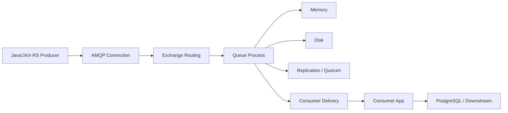
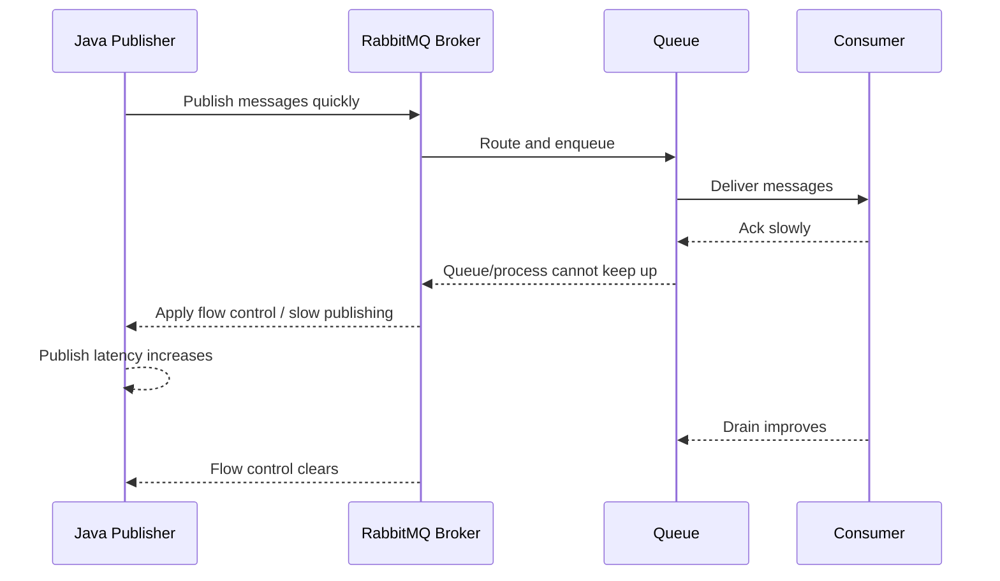
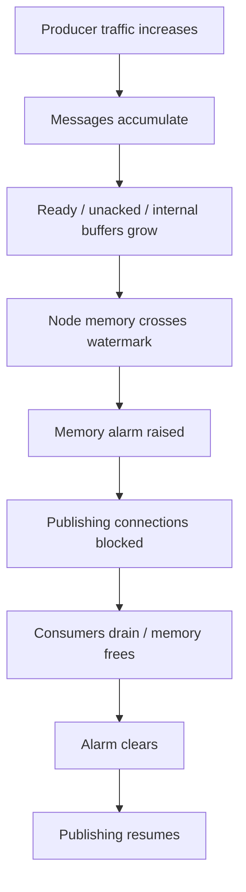
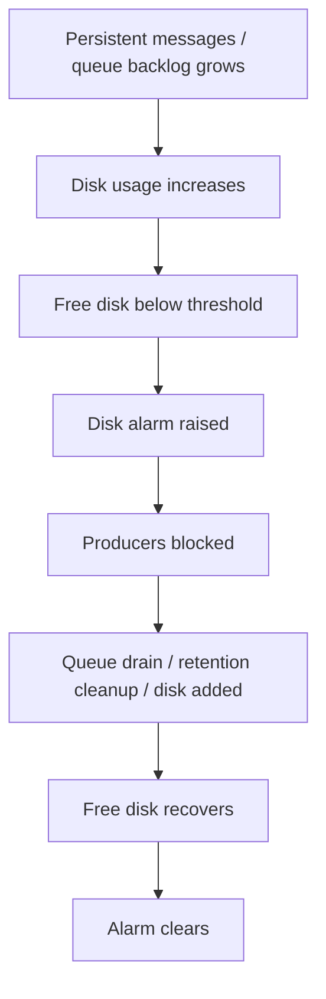
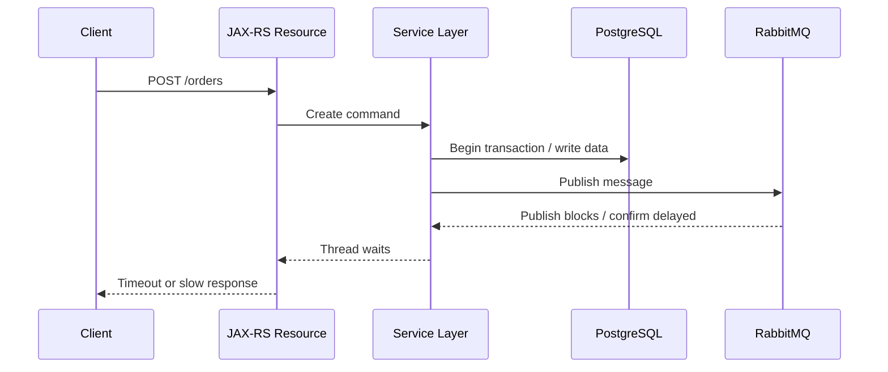
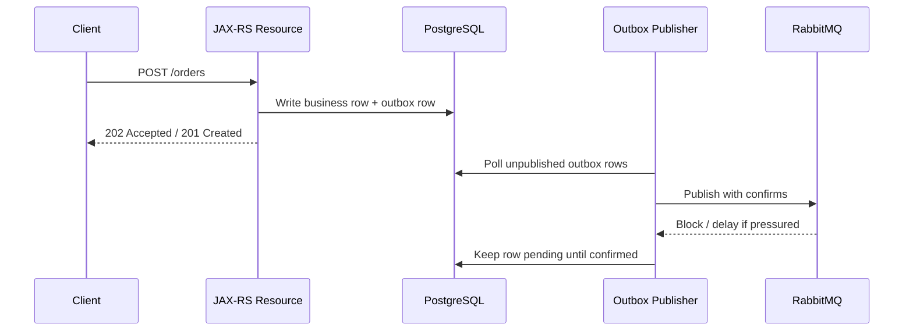
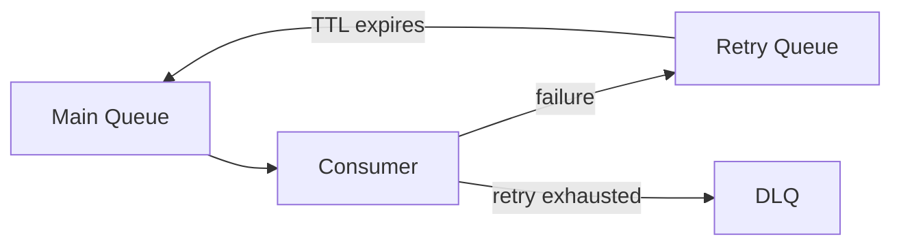

# Flow Control, Memory Alarm, and Disk Alarm

## 1. Core idea

RabbitMQ protects itself.

When producers publish faster than the broker, queues, disks, or consumers can absorb, RabbitMQ does not simply keep accepting traffic forever. It applies backpressure through flow control and resource alarms.

For a Java/JAX-RS backend engineer, the key point is this:

```text
A publish call can become slow or blocked not because application code changed,
but because the broker is protecting memory, disk, queue processes, or cluster safety.
```

This matters because a blocked publisher can propagate backward into:

```text
HTTP request latency
JAX-RS thread exhaustion
transaction timeout
outbox backlog
connection pool exhaustion
Kubernetes pod readiness failures
upstream retry storm
customer-visible API degradation
```

Flow control and alarms are not just broker internals. They are production control signals.

---

## 2. The resource pressure mental model

A RabbitMQ message flow has multiple buffers.



Pressure can appear at any stage:

```text
publisher sends too fast
queue grows faster than consumers drain
consumer processing slows
PostgreSQL slows
DLQ grows
retry topology amplifies traffic
quorum replication waits on disk/network
node memory grows
free disk space drops
network throughput saturates
```

RabbitMQ reacts with different signals:

```text
flow-controlled connection
connection blocked notification
memory alarm
disk alarm
low consumer utilisation
increasing ready messages
increasing unacked messages
high redelivery rate
channel/connection churn
```

Do not debug these signals independently. They are usually symptoms of one pressure chain.

---

## 3. Flow control vs memory alarm vs disk alarm

These are related but not identical.

| Mechanism | What it means | Typical impact | Primary question |
|---|---|---|---|
| Flow control | RabbitMQ is slowing publishers because queues/broker cannot keep up | Publish latency increases; connection state may show `flow` | Which queue/process is saturated? |
| Memory alarm | Node memory usage crossed configured threshold | Publishing connections can be blocked | Why is memory retained? Queue growth? Unacked? Large messages? |
| Disk alarm | Free disk space dropped below configured limit | Producers can be blocked | What is consuming disk and can consumers drain safely? |
| Connection blocked | Broker notified AMQP client that publishing should pause | Java publisher may block or fail depending implementation | Does app handle blocked/unblocked events and timeouts? |
| Queue growth | Ready messages accumulate | Consumer lag/customer delay | Are consumers slow, down, or under-provisioned? |
| Unacked growth | Broker delivered messages but consumers have not acked | Memory pressure and redelivery risk | Are consumers stuck or prefetch too high? |

Important distinction:

```text
Flow control is usually a rate-matching mechanism.
Resource alarms are safety mechanisms.
```

Both should be visible to application and platform teams.

---

## 4. Flow control lifecycle

A common flow control lifecycle looks like this:



What you see in production:

```text
publish latency increases
publisher confirm latency increases
HTTP endpoint latency increases if publishing in request path
outbox rows accumulate if publisher worker is blocked
connection state shows flow/blocked
queue depth may or may not increase
consumer utilisation may be low or high depending bottleneck
```

Flow control is not automatically a failure. It becomes a failure when the system has no margin and callers pile up.

---

## 5. Memory alarm lifecycle

A memory alarm lifecycle usually looks like this:



Potential root causes:

```text
consumers down
consumers slow
prefetch too high
unacked messages growing
large message payloads
bursty publisher without backpressure
DLQ or retry queues accumulating
quorum queue pressure
too many connections/channels
bad topology causing unexpected fanout
```

The wrong response is to only raise the memory limit.

That may buy time, but it does not answer:

```text
Why did message retention exceed expected operating range?
Why did consumers fail to drain?
Why was backpressure not absorbed upstream?
Why did alerting fire only after customer impact?
```

---

## 6. Disk alarm lifecycle

A disk alarm lifecycle usually looks like this:



Typical causes:

```text
persistent messages accumulating
quorum queues retaining replicated logs
streams retaining data by policy
dead-letter queues not drained
retry queues accumulating
large payloads in messages
log files growing
insufficient persistent volume size
slow storage class
on-prem disk full due to unrelated process
backup/snapshot pressure
```

Disk alarms are especially dangerous because a broker that cannot safely persist data should not accept infinite writes.

Do not treat disk alarms as only infrastructure noise. They are data safety signals.

---

## 7. Backpressure propagation into Java/JAX-RS

In a synchronous HTTP request path, a RabbitMQ block can become an API incident.



This is one reason outbox is often safer than direct publish in the request path.

With outbox:



Outbox does not eliminate broker pressure. It changes blast radius.

Instead of blocking customer request threads, pressure accumulates in an explicit database backlog that can be monitored, throttled, and retried.

---

## 8. Producer behavior under block

A production Java publisher must answer these questions:

```text
What happens when RabbitMQ blocks the connection?
Does publish call block indefinitely?
Is there a timeout?
Is the blocked state logged?
Is a metric emitted?
Does the JAX-RS endpoint fail fast or wait?
Does the outbox publisher pause?
Does retry amplify traffic?
Does the connection auto-recover safely?
```

Bad producer behavior:

```java
// Bad: no timeout model, no blocked listener, no backpressure policy, no outbox fallback.
channel.basicPublish(exchange, routingKey, props, body);
channel.waitForConfirmsOrDie();
```

Better mental model:

```java
// Pseudocode only.
// The exact implementation should follow the internal RabbitMQ client standard.

connection.addBlockedListener(new BlockedListener() {
    public void handleBlocked(String reason) {
        metrics.increment("rabbitmq.connection.blocked");
        log.warn("RabbitMQ connection blocked: {}", reason);
        publisherState.markBlocked(reason);
    }

    public void handleUnblocked() {
        metrics.increment("rabbitmq.connection.unblocked");
        log.info("RabbitMQ connection unblocked");
        publisherState.markUnblocked();
    }
});

publishWithConfirmTimeout(message, confirmTimeout);
```

The application must define what blocked means:

```text
pause outbox polling
reduce publish batch size
fail fast on direct publish path
return 503/429 if broker is part of request SLA
trip circuit breaker
stop accepting optional traffic
continue critical flows only
```

---

## 9. Consumer slowdown as hidden root cause

Many broker alarms are producer-visible but consumer-caused.

A typical chain:

```text
PostgreSQL slows
consumer transaction time increases
ack latency increases
unacked messages increase
ready messages increase
queue memory/disk grows
broker applies flow control
producer publish latency increases
JAX-RS APIs degrade
```

The producer team may see RabbitMQ as the problem.

The actual bottleneck may be:

```text
DB lock contention
slow MyBatis query
external API latency
consumer thread pool exhaustion
CPU throttling in Kubernetes
Redis lock contention
poison messages causing retry loops
prefetch too high relative to processing time
```

Debugging rule:

```text
When publisher is blocked, inspect consumer health before changing producer retry.
```

---

## 10. Queue growth vs unacked growth

These two symptoms imply different failure modes.

### Ready messages increasing

```text
Messages are waiting in the queue and not delivered yet.
```

Possible causes:

```text
no consumers
not enough consumers
consumer utilisation low
prefetch saturated
routing to wrong queue
single active consumer bottleneck
consumer connection down
permission issue after deployment
```

### Unacked messages increasing

```text
Messages were delivered to consumers but not acknowledged.
```

Possible causes:

```text
consumer stuck during processing
consumer prefetch too high
consumer thread pool blocked
DB transaction slow
external call hanging
ack missing due to bug
consumer crashed after delivery
manual ack path not reached
```

Quick interpretation:

| Symptom | First suspicion |
|---|---|
| Ready grows, consumers zero | Consumer deployment down |
| Ready grows, consumers exist, utilisation low | Consumer not pulling or blocked client-side |
| Unacked grows | Consumer processing/ack problem |
| Redelivery grows | Consumer failure/retry/requeue loop |
| DLQ grows | Permanent failure or retry exhaustion |
| Publish blocked | Broker resource pressure or queue process saturation |

---

## 11. Retry storm and resource alarms

Retry topology can amplify pressure.

Example:



This looks safe until the downstream dependency fails globally.

Then:

```text
all messages fail
all messages enter retry queues
TTL expires in waves
messages return to main queue together
consumers retry together
more failures
redelivery rate spikes
DLQ grows
broker memory/disk grows
flow control triggers
```

Production guardrails:

```text
retry count limit
jittered retry delay
dead-letter after threshold
circuit breaker for known-down dependency
rate-limited replay
DLQ capacity alert
retry queue depth alert
consumer failure ratio alert
```

The retry system must be designed for dependency outage, not only individual transient error.

---

## 12. Flow control runbook

Use this when RabbitMQ indicates flow control or publishing slowdowns.

### Step 1: Confirm the symptom

Check:

```text
connection state = flow / blocked
publisher confirm latency
publish rate vs deliver/ack rate
ready messages
unacked messages
memory alarm
disk alarm
node CPU/disk/network
consumer utilisation
```

### Step 2: Locate pressure point

Ask:

```text
Which queue is growing?
Which vhost?
Which publisher?
Which consumer group?
Which node hosts the hot queue leader?
Is pressure isolated or cluster-wide?
```

### Step 3: Determine whether producers or consumers caused it

Producer-side indicators:

```text
publish rate spike
unexpected fanout
new release publishing more messages
large payload introduced
routing key mistake duplicating messages
```

Consumer-side indicators:

```text
ack rate dropped
unacked grew
consumer pods restarted
DB latency increased
external dependency down
DLQ/retry loop started
```

### Step 4: Stabilize

Possible actions:

```text
pause non-critical publishers
scale consumers if downstream can handle it
reduce producer rate
disable broken integration flow
increase consumer replicas only if DB/downstream has headroom
stop infinite requeue
move poison messages to parking lot
increase disk only if backlog is legitimate and drainable
```

### Step 5: Recover safely

After pressure clears:

```text
confirm alarms cleared
confirm publish latency normal
confirm queue depth decreasing
confirm unacked stable
confirm redelivery not spiking
confirm DLQ not growing unexpectedly
confirm customer-facing APIs recovered
```

### Step 6: Post-incident changes

Add or adjust:

```text
alert threshold
dashboard panel
runbook step
publisher timeout
outbox backlog alert
retry storm guardrail
DLQ replay approval
capacity baseline
load test scenario
```

---

## 13. Memory alarm runbook

### Immediate questions

```text
Which node raised the memory alarm?
Is alarm cluster-wide?
Which queues are largest?
Is growth ready or unacked?
Are consumers online?
Are message sizes abnormal?
Any recent release or traffic spike?
```

### Safe actions

```text
pause non-critical publishers
scale consumers only if downstream capacity exists
restart stuck consumers carefully
reduce prefetch if unacked explosion is consumer-side
move poison messages out of hot path
check DLQ/retry queue growth
check quorum queue leader distribution
```

### Dangerous actions

```text
blindly restart broker node
purge queue without business approval
increase producer retries
scale producers
raise memory threshold without root cause
replay DLQ during active alarm
```

### Data to capture

```text
queue depth before/after
unacked count
publish/deliver/ack/redelivery rates
top queues by memory
consumer count/utilisation
connection/channel count
node memory usage
recent deploys
customer impact window
```

---

## 14. Disk alarm runbook

### Immediate questions

```text
Which node is low on disk?
Which queue/stream uses disk?
Are messages persistent?
Are streams retaining more than expected?
Are DLQs growing?
Are retry queues growing?
Is the persistent volume full?
Any log/snapshot/backup growth?
```

### Safe actions

```text
pause non-critical publishers
increase disk/PV if approved and supported
accelerate consumer drain if safe
archive or process DLQ after approval
adjust retention only after data owner approval
remove unrelated disk usage if confirmed
```

### Dangerous actions

```text
purge production queue casually
delete stream segments without owner approval
remove DLQ data containing audit evidence
restart into same full disk condition
ignore quorum queue replication storage needs
```

### Recovery validation

```text
free disk above threshold
alarm cleared
publishers unblocked
queue depth draining
no unexpected message loss
storage trend stable
alert resolved with notes
```

---

## 15. Java publisher design under resource pressure

A production publisher should expose these controls:

```text
publish timeout
confirm timeout
blocked/unblocked listener
circuit breaker state
outbox backlog metric
publish success/failure metric
publish latency histogram
confirm latency histogram
unroutable message counter
connection recovery counter
```

Direct HTTP-to-publish path must decide:

```text
Should request block until publish confirmed?
Should endpoint return 202 after DB/outbox write?
Should endpoint fail fast when broker blocked?
Should optional messages be dropped or persisted?
Should commands and audit events have different policies?
```

Do not use one publisher policy for all message classes.

Example classification:

| Message class | Backpressure policy |
|---|---|
| Order command | Persist via outbox; do not silently drop |
| Audit event | Persist or durable fallback depending compliance |
| Cache invalidation | Can sometimes be regenerated; still needs visibility |
| Notification | Retry/DLQ; may tolerate delay |
| Metrics-like event | May use lossy path if explicitly approved |

---

## 16. Kubernetes-specific pressure patterns

RabbitMQ and clients in Kubernetes add extra failure modes.

### Broker running in Kubernetes

Check:

```text
PersistentVolume size
StorageClass latency
pod memory limit vs RabbitMQ memory watermark
CPU throttling
pod anti-affinity
node disk pressure
readiness/liveness probe behavior
rolling restart behavior
operator reconciliation
```

A bad configuration:

```text
RabbitMQ memory watermark > pod memory limit
```

This can cause the pod to be killed before RabbitMQ can apply graceful memory alarm behavior.

### Java clients in Kubernetes

Check:

```text
consumer replicas
prefetch per replica
connection count after rollout
shutdown grace period
in-flight message drain
CPU throttling
DB pool per pod
HPA scaling signal
```

Scaling consumers can help only when the real bottleneck is consumer CPU or concurrency.

It can hurt when the real bottleneck is PostgreSQL or downstream integration.

---

## 17. Cloud-managed RabbitMQ pressure considerations

For managed brokers, the application team may not control all broker internals.

Still verify:

```text
broker size / instance class
storage limit and growth behavior
metric availability
alarm exposure
maintenance behavior
Multi-AZ replication model
connection limits
channel limits
network latency
backup/snapshot impact
support escalation path
```

When a managed broker blocks publishing, your application still needs:

```text
timeouts
metrics
outbox/backlog visibility
retry discipline
incident ownership clarity
```

Managed does not mean pressure-free.

---

## 18. On-prem pressure considerations

On-prem deployments often add operational coupling:

```text
shared storage array
manual certificate rotation
firewall changes
VM resource contention
OS memory/disk tuning
backup job interference
monitoring gaps
air-gapped patching
```

For on-prem RabbitMQ, verify:

```text
who can add disk
who can restart broker
who owns certificate renewal
who monitors OS disk
who monitors broker disk alarm
who approves queue purge/replay
who handles after-hours incident
```

The broker runbook must reflect actual operational authority, not ideal team boundaries.

---

## 19. Observability checklist

Required dashboard panels:

```text
connection blocked count
connection state = flow/blocked
memory alarm status
disk alarm status
node memory usage
node disk free
publish rate
deliver rate
ack rate
redelivery rate
ready messages by queue
unacked messages by queue
DLQ depth
retry queue depth
consumer utilisation
publisher confirm latency
outbox backlog
consumer processing latency
```

Useful alert groups:

```text
broker resource alarm
blocked publisher
queue depth sustained growth
unacked sustained growth
DLQ spike
retry storm
consumer down
ack rate collapse
outbox backlog growth
disk free trend risk
```

Do not alert only on absolute queue depth. Alert on depth relative to drain rate and business SLA.

---

## 20. Debugging examples

### Case A: API latency spike after RabbitMQ alarm

Likely chain:

```text
RabbitMQ blocked publisher
publisher waits for confirm
JAX-RS request thread waits
HTTP latency increases
upstream retries increase
more pressure
```

Check:

```text
publish confirm latency
blocked connection logs
HTTP thread pool
outbox backlog
queue depth
consumer ack rate
```

Corrective direction:

```text
move direct publish behind outbox
add publish timeout
pause optional publishers
fix consumer/downstream bottleneck
```

### Case B: Memory alarm with high unacked

Likely chain:

```text
prefetch too high or consumers stuck
messages delivered but not acked
memory retained
alarm blocks publishers
```

Check:

```text
consumer logs
thread dumps
DB latency
external call timeout
prefetch value
unacked per consumer
```

Corrective direction:

```text
fix stuck consumer
reduce prefetch
ensure timeouts
ack only after durable success
avoid infinite requeue
```

### Case C: Disk alarm with DLQ growth

Likely chain:

```text
permanent validation failure or downstream outage
retry exhausted
DLQ grows
persistent messages consume disk
broker blocks producers
```

Check:

```text
DLQ top message types
x-death headers
recent schema change
consumer error rate
message size
retention policy
```

Corrective direction:

```text
stop bad publisher
fix schema/consumer bug
rate-limit replay
retain evidence as required
increase disk only if needed and approved
```

---

## 21. Anti-patterns

Avoid these:

```text
Treating flow control as RabbitMQ being slow
Ignoring blocked connection events
Publishing inside HTTP request without timeout or outbox
Infinite retry during broker pressure
Scaling consumers without checking downstream capacity
Purging queues during incident without business owner approval
Setting prefetch extremely high to chase throughput
Using huge message payloads instead of references
Keeping DLQs forever without retention strategy
No alert for disk free trend
No outbox backlog alert
No runbook for blocked publishers
```

The most dangerous pattern is silent pressure.

A system that blocks visibly can be operated. A system that blocks invisibly becomes customer impact before engineers understand the cause.

---

## 22. Internal verification checklist

Check these in the actual CSG/team environment.

### Broker configuration

```text
RabbitMQ version
memory watermark
disk free limit
cluster size
queue types
quorum replication factor
stream retention policy
policy/operator policy
resource alarm settings
```

### Java publisher implementation

```text
blocked listener
publish timeout
confirm timeout
mandatory flag
return listener
outbox usage
retry/backoff policy
metrics/logging
circuit breaker behavior
```

### Consumer implementation

```text
prefetch
manual ack
processing timeout
DB transaction timeout
external call timeout
shutdown drain
idempotency/inbox
DLQ behavior
```

### Kubernetes/cloud/on-prem deployment

```text
pod memory limit vs RabbitMQ watermark
PV size and storage class
node disk pressure
cloud broker storage limit
network latency
secret rotation
maintenance windows
support escalation path
```

### Observability and operations

```text
dashboard panels
alert thresholds
runbook ownership
incident notes
DLQ replay process
queue purge approval
outbox backlog alert
customer impact mapping
```

---

## 23. PR review checklist

When reviewing a RabbitMQ-related PR, ask:

```text
Can this code block an HTTP request when broker blocks publishing?
Is there a publish timeout?
Is publisher confirm used where durability matters?
Are blocked/unblocked events visible?
Does retry amplify broker pressure?
Does outbox backlog have metrics?
Does consumer ack after durable side effect?
Can unacked messages grow without bound?
Is prefetch sized relative to processing time?
Are DLQ and retry queues monitored?
Does the change increase message size?
Does the change increase fanout unexpectedly?
Does Kubernetes scaling multiply prefetch/DB load?
Does runbook mention memory/disk alarms?
```

A senior review should focus less on whether code compiles and more on whether pressure behavior is explicit.

---

## 24. Key takeaways

```text
Flow control is rate protection.
Memory alarm is memory safety protection.
Disk alarm is persistence safety protection.
Blocked publishers are application-visible production signals.
Queue growth usually means consumer/drain mismatch.
Unacked growth usually means consumer processing/ack problem.
Retry topology can amplify outages into broker pressure.
Outbox changes the blast radius of blocked publishing.
Kubernetes resource limits must align with RabbitMQ alarms.
Operational readiness requires dashboard, alerts, and runbooks.
```

RabbitMQ pressure is not solved only by bigger brokers.

It is solved by explicit backpressure design across producer, broker, queue, consumer, database, deployment platform, and operations.

---

## 25. References

- RabbitMQ Documentation: Memory and Disk Alarms — https://www.rabbitmq.com/docs/alarms
- RabbitMQ Documentation: Memory Threshold and Limit — https://www.rabbitmq.com/docs/memory
- RabbitMQ Documentation: Free Disk Space Alarms — https://www.rabbitmq.com/docs/disk-alarms
- RabbitMQ Documentation: Flow Control — https://www.rabbitmq.com/docs/flow-control
- RabbitMQ Documentation: Publishers — https://www.rabbitmq.com/docs/publishers
- RabbitMQ Documentation: Consumer Prefetch — https://www.rabbitmq.com/docs/consumer-prefetch
- RabbitMQ Documentation: Quorum Queues — https://www.rabbitmq.com/docs/quorum-queues
