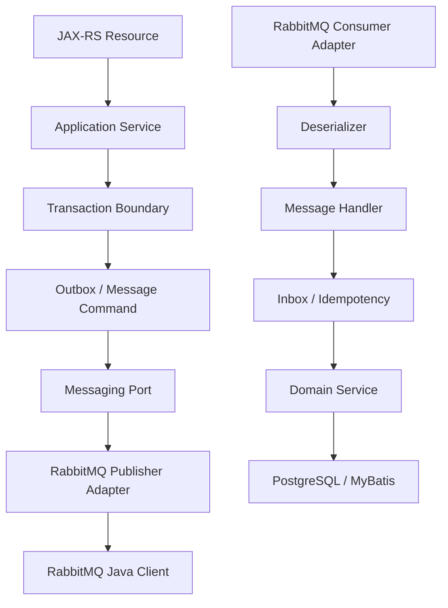
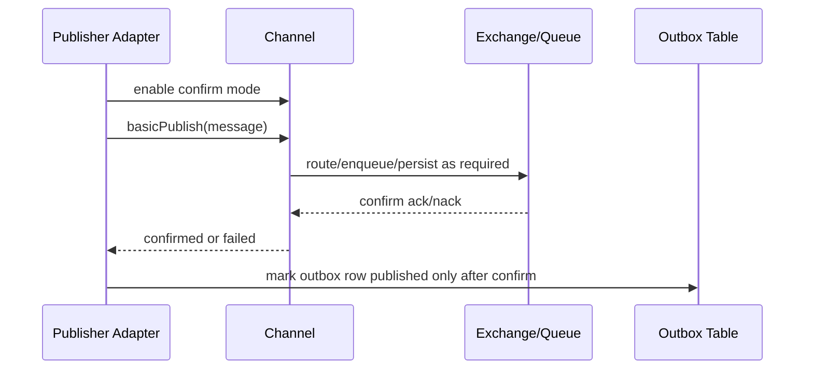
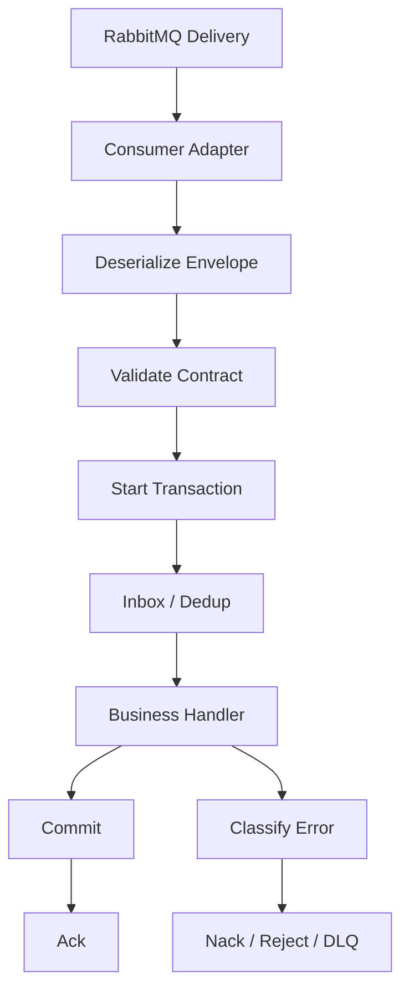
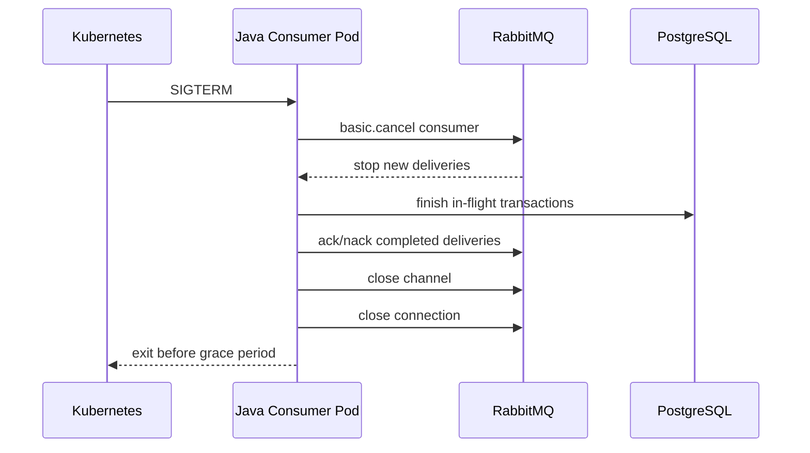

# Java Client Implementation Patterns

## 1. Core idea

RabbitMQ Java client code should not be scattered across business services.

In a serious enterprise Java/JAX-RS system, RabbitMQ integration needs a small internal messaging layer that makes these decisions explicit:

```text
connection lifecycle
channel lifecycle
thread ownership
publisher confirm strategy
mandatory/unroutable handling
consumer ack/nack discipline
prefetch policy
serialization
metadata propagation
idempotency hooks
retry/DLQ behavior
metrics/logging/tracing
graceful shutdown
automatic recovery
topology declaration policy
test strategy
```

The goal is not to hide RabbitMQ completely.

The goal is to prevent every service from inventing its own unsafe version of RabbitMQ usage.

---

## 2. What the Java client is responsible for

RabbitMQ Java client provides AMQP operations such as:

```text
create connection
create channel
declare exchange/queue/binding
publish message
consume delivery
ack/nack/reject delivery
register return listener
use publisher confirms
handle connection/channel shutdown
recover connections/topology depending configuration
```

But the Java client does not automatically solve application correctness.

Application-level responsibilities remain:

```text
message contract
idempotency
outbox/inbox
business transaction boundary
retry classification
DLQ policy
schema compatibility
security classification
trace context
operational dashboard
```

A good internal abstraction should make the boundary clear.

---

## 3. Recommended layering

Avoid direct RabbitMQ client usage from JAX-RS resources or random service classes.

Better layering:



The business service should say:

```text
Publish OrderSubmitted event
Handle PriceCalculated command
Process FulfillmentRequested task
```

It should not repeatedly decide:

```text
which channel to use
how long to wait for confirms
which headers to include
how to nack poison messages
how to emit metrics
```

---

## 4. Connection lifecycle pattern

A RabbitMQ connection is relatively expensive and long-lived.

Typical pattern:

```text
one or small number of connections per application instance
connection created on startup
connection reused across publishers/consumers
connection closed on graceful shutdown
blocked/unblocked listener attached
shutdown listener attached
metrics emitted
```

Pseudocode:

```java
public final class RabbitConnectionManager implements AutoCloseable {
    private final ConnectionFactory factory;
    private volatile Connection connection;

    public RabbitConnectionManager(RabbitConfig config) {
        this.factory = new ConnectionFactory();
        this.factory.setHost(config.host());
        this.factory.setPort(config.port());
        this.factory.setVirtualHost(config.vhost());
        this.factory.setUsername(config.username());
        this.factory.setPassword(config.password());
        this.factory.setAutomaticRecoveryEnabled(true);
        this.factory.setTopologyRecoveryEnabled(false); // decide intentionally
        this.factory.setRequestedHeartbeat(config.heartbeatSeconds());
        this.factory.setConnectionTimeout(config.connectionTimeoutMs());
    }

    public synchronized Connection start() throws Exception {
        if (connection != null && connection.isOpen()) {
            return connection;
        }

        connection = factory.newConnection("quote-order-service");
        connection.addBlockedListener(new BrokerBlockedListener());
        connection.addShutdownListener(new BrokerShutdownListener());
        return connection;
    }

    @Override
    public synchronized void close() throws Exception {
        if (connection != null && connection.isOpen()) {
            connection.close();
        }
    }
}
```

Production notes:

```text
Use meaningful connection names if supported.
Expose connection status via health/metrics.
Do not create one connection per message.
Do not create one connection per HTTP request.
Separate publisher and consumer connections if operationally useful.
Handle blocked/unblocked events.
```

---

## 5. Channel lifecycle pattern

A channel is lighter than a connection, but it is not a casual object.

Important rule:

```text
Do not share Channel instances concurrently across publisher threads.
```

RabbitMQ Java client documentation warns against sharing channels between threads because it can cause protocol frame interleaving and incorrect behavior.

Common safe patterns:

| Workload | Channel pattern |
|---|---|
| Single publisher thread | One long-lived channel |
| Multiple publisher threads | One channel per thread or channel pool with strict ownership |
| Consumer | Channel owned by consumer callback/worker model |
| Ack/nack | Ack on the same channel that received delivery |
| Topology declaration | Dedicated startup/admin channel |

Bad pattern:

```java
// Bad: shared channel used concurrently by request threads.
class UnsafePublisher {
    private final Channel sharedChannel;

    public void publish(byte[] body) throws Exception {
        sharedChannel.basicPublish("orders.exchange", "order.created", null, body);
    }
}
```

Better pattern:

```java
// Pseudocode: channel ownership is explicit.
class PublisherWorker implements Runnable {
    private final Connection connection;
    private final BlockingQueue<OutboundMessage> queue;

    public void run() {
        try (Channel channel = connection.createChannel()) {
            channel.confirmSelect();

            while (!Thread.currentThread().isInterrupted()) {
                OutboundMessage message = queue.take();
                publishAndWaitForConfirm(channel, message);
            }
        } catch (Exception ex) {
            // reconnect/restart worker according to policy
        }
    }
}
```

The principle:

```text
A channel should have a clear owner.
```

---

## 6. Publisher abstraction

A publisher abstraction should expose business intent and enforce broker rules.

Example interface:

```java
public interface MessagePublisher {
    PublishResult publish(MessageEnvelope envelope);
}
```

Where `MessageEnvelope` carries:

```text
message type
schema version
payload bytes
content type
message id
correlation id
causation id
trace context
tenant id
routing key
exchange
mandatory flag
persistence flag
headers
created timestamp
```

`PublishResult` should represent:

```text
confirmed
returned/unroutable
timeout
blocked
failed before publish
failed after uncertain publish
```

Do not collapse all failures into `RuntimeException`.

Publisher uncertainty is part of messaging correctness.

---

## 7. Publisher confirm pattern

For durable business messages, use publisher confirms.

A basic safe flow:



Confirm decisions:

```text
sync wait vs async confirm listener
single publish vs batch publish
confirm timeout
retry behavior
duplicate publish tolerance
outbox mark-published timing
metrics by outcome
```

Synchronous confirms are simpler but can reduce throughput.

Batch/asynchronous confirms improve throughput but make error correlation and outbox state more complex.

---

## 8. Mandatory publishing and return handling

Publisher confirm tells you broker accepted responsibility according to routing/storage conditions. It does not by itself mean your routing was semantically correct in all cases.

For messages that must not disappear due to routing mistakes:

```text
use mandatory flag
register return listener
consider alternate exchange
alert on returned messages
store returned message state if using outbox
```

Pseudocode:

```java
channel.addReturnListener(returned -> {
    metrics.increment("rabbitmq.publisher.returned", Tags.of(
        "exchange", returned.getExchange(),
        "routingKey", returned.getRoutingKey()
    ));

    log.error("RabbitMQ message returned: exchange={}, routingKey={}, replyCode={}, replyText={}",
        returned.getExchange(),
        returned.getRoutingKey(),
        returned.getReplyCode(),
        returned.getReplyText());

    // Mark outbox row as ROUTING_FAILED if message id can be correlated.
});
```

Unroutable messages should be treated as topology or contract failure, not ordinary transient failure.

---

## 9. Consumer abstraction

A consumer abstraction should separate AMQP mechanics from business handling.



Example handler interface:

```java
public interface MessageHandler<T> {
    HandlerResult handle(MessageContext context, T payload) throws Exception;
}
```

`MessageContext` should include:

```text
message id
correlation id
causation id
trace context
tenant id
message type
schema version
routing key
exchange
redelivered flag
delivery tag
x-death headers if present
received timestamp
```

The handler should not directly call `basicAck`.

Ack/nack should be centralized so behavior is consistent and observable.

---

## 10. Ack/nack discipline pattern

Manual ack is the production default for important business messages.

Basic rule:

```text
Ack only after durable side effects are complete.
```

Pseudocode:

```java
DeliverCallback callback = (consumerTag, delivery) -> {
    long tag = delivery.getEnvelope().getDeliveryTag();

    try {
        MessageEnvelope envelope = deserialize(delivery);
        ProcessingDecision decision = dispatcher.dispatch(envelope);

        if (decision.success()) {
            channel.basicAck(tag, false);
        } else if (decision.retryable()) {
            channel.basicNack(tag, false, false); // route through DLX/retry topology
        } else {
            channel.basicReject(tag, false);      // permanent failure -> DLQ/parking lot
        }
    } catch (Throwable ex) {
        // Avoid infinite immediate requeue loops unless explicitly intended.
        channel.basicNack(tag, false, false);
    }
};
```

Do not do this casually:

```java
channel.basicNack(tag, false, true); // immediate requeue can create a hot redelivery loop
```

Use requeue `true` only when the retry semantics are intentionally designed.

---

## 11. Error classification

Consumer failures should be classified.

| Failure type | Example | Typical action |
|---|---|---|
| Transient infrastructure | DB connection timeout | retry with delay |
| Transient external | downstream 503 | retry with backoff/circuit breaker |
| Permanent contract | missing required field | DLQ/parking lot |
| Business conflict | invalid state transition | idempotent ignore or DLQ depending invariant |
| Poison message | always fails same way | isolate and alert |
| Unknown | unexpected exception | limited retry then DLQ |

A single catch-all retry is not enough.

A robust consumer asks:

```text
Is this safe to retry?
Will retry change the result?
Could retry duplicate an external side effect?
Should this be visible to operations immediately?
```

---

## 12. Retry handler pattern

Prefer broker topology for delayed retry over sleeping inside consumer threads.

Bad:

```java
catch (Exception ex) {
    Thread.sleep(60_000); // Bad: holds consumer thread and delivery unacked
    channel.basicNack(tag, false, true);
}
```

Better:

```text
consumer rejects/nacks message without requeue
broker DLX routes to retry queue
retry queue TTL expires
message returns to main exchange/queue
x-death / retry headers track attempts
after threshold message goes to parking lot
```

Consumer code should make one classification decision:

```text
success -> ack
retryable -> nack/reject false into retry/DLX topology
permanent -> reject false into DLQ/parking lot
```

Retry delay should not be implemented by blocking consumer threads.

---

## 13. DLQ publisher pattern

Sometimes the broker DLX is enough.

Sometimes application-managed parking is needed because you want to enrich failure metadata:

```text
exception class
error code
business state
handler version
payload hash
schema version
tenant id
first failure time
last failure time
retry count
operator note
```

Two approaches:

### Broker-managed DLX

```text
consumer nack/reject false
RabbitMQ dead-letters message
x-death header records history
```

Pros:

```text
simple
standard
less app code
works with broker policies
```

Cons:

```text
limited business error context
harder to attach structured failure reason
```

### App-managed failure envelope

```text
consumer catches permanent failure
publishes FailureEnvelope to parking exchange
acks original only after failure publish confirmed
```

Pros:

```text
rich metadata
strong audit story
custom replay workflow
```

Cons:

```text
more code
requires confirm discipline
risk if failure publish succeeds but ack fails
must be idempotent
```

For most systems, start with broker DLX and add app-managed failure envelopes only when operational needs justify it.

---

## 14. Serialization abstraction

Do not let every producer decide serialization format independently.

A minimal abstraction:

```java
public interface MessageSerializer<T> {
    SerializedMessage serialize(T value, MessageSchema schema);
}

public interface MessageDeserializer<T> {
    T deserialize(byte[] body, MessageHeaders headers);
}
```

The serialized message should define:

```text
content type
content encoding
schema name
schema version
payload bytes
payload hash if needed
```

Rules:

```text
Never infer schema only from queue name.
Include message type/version.
Keep headers small.
Do not put large business objects in headers.
Avoid Java-native serialization.
Treat payload as language-neutral contract.
```

For enterprise integration, JSON is common, but the real requirement is not JSON.

The real requirement is explicit compatibility management.

---

## 15. Header propagation pattern

A standard header set avoids production blind spots.

Recommended minimum:

```text
message_id
message_type
message_version
correlation_id
causation_id
traceparent
tenant_id if applicable
source_service
created_at
published_at
idempotency_key
```

Optional but useful:

```text
actor_id
request_id
schema_name
schema_version
retry_count
business_key
aggregate_id
payload_hash
```

Do not blindly propagate all HTTP headers into RabbitMQ.

Sanitize and whitelist.

Bad propagation risks:

```text
PII leakage
credential leakage
header size explosion
trace cardinality issues
tenant boundary leak
```

---

## 16. Graceful shutdown pattern

Consumer shutdown must drain in-flight messages.

A safe shutdown sequence:



Implementation requirements:

```text
handle SIGTERM/application shutdown hook
stop accepting new work
cancel consumer subscription
wait bounded time for in-flight processing
ack successful work
nack/reject failed or incomplete work according policy
close channel/connection
emit shutdown metrics
```

Do not rely only on process kill.

A killed consumer causes unacked messages to be requeued/redelivered. That may be acceptable, but it must be expected and idempotent.

---

## 17. Automatic recovery and topology recovery

The Java client can perform automatic connection recovery.

But recovery is not a correctness guarantee.

You must decide:

```text
automatic connection recovery enabled?
topology recovery enabled?
who declares exchanges/queues/bindings?
what happens during recovery window?
are publisher confirms reset correctly?
are consumers re-registered?
are duplicate consumers possible?
are metrics emitted?
```

Topology recovery trade-off:

| Option | Benefit | Risk |
|---|---|---|
| Client declares topology on startup | Service self-contained | App can accidentally drift topology |
| GitOps/platform declares topology | Central governance | App startup depends on pre-created artifacts |
| Java client topology recovery | Convenience after reconnect | May mask drift or recreate unwanted topology |
| No topology recovery | Explicit control | Requires robust startup/deploy process |

For enterprise systems, topology ownership should be intentional.

Do not let every consumer dynamically create production queues unless that is the approved model.

---

## 18. Topology declaration pattern

Topology declaration can be useful in local/dev/test, but dangerous in production if uncontrolled.

Questions:

```text
Should application declare exchange/queue/binding?
Should platform GitOps declare them?
Should declaration be passive in production?
Should mismatch fail fast?
Should queue arguments be mutable?
How are policy/operator policy applied?
```

Recommended production posture:

```text
critical topology declared as code
application may passively verify existence
startup fails if required topology missing
queue arguments are not silently changed by app
breaking topology changes go through review
```

Example startup check:

```java
// Pseudocode only.
channel.exchangeDeclarePassive("orders.command.x");
channel.queueDeclarePassive("quote-order.pricing.work.q");
```

Passive checks help catch missing topology without accidentally creating the wrong one.

---

## 19. Metrics instrumentation pattern

Publisher metrics:

```text
publish_attempt_total
publish_confirmed_total
publish_failed_total
publish_returned_total
publish_timeout_total
publish_latency_ms
publisher_confirm_latency_ms
connection_blocked_total
connection_recovered_total
outbox_backlog
```

Consumer metrics:

```text
message_received_total
message_processed_total
message_failed_total
message_ack_total
message_nack_total
message_reject_total
message_redelivered_total
consumer_processing_latency_ms
consumer_db_latency_ms
consumer_external_call_latency_ms
inflight_messages
```

Labels/tags should be controlled:

```text
service
vhost
exchange
queue
message_type
result
failure_class
```

Avoid high-cardinality tags:

```text
message_id
tenant_id if too many tenants
correlation_id
raw routing key if unbounded
exception message
```

Metrics should support operational decisions, not just pretty dashboards.

---

## 20. Logging pattern

Every publish and consume flow should be debuggable by correlation ID.

Publisher log fields:

```text
message_id
message_type
correlation_id
causation_id
exchange
routing_key
outbox_id if present
confirm_result
returned_flag
latency_ms
```

Consumer log fields:

```text
message_id
message_type
correlation_id
queue
routing_key
redelivered
retry_count
x_death_count
handler_result
processing_latency_ms
failure_class
```

Do not log full payload by default.

Payload logging risks:

```text
PII exposure
secret leakage
huge log volume
compliance violation
customer data leakage through DLQ debugging
```

Use payload hash or selected safe business identifiers instead.

---

## 21. Tracing pattern

RabbitMQ creates asynchronous boundaries.

Trace propagation should:

```text
extract trace context from incoming HTTP request
inject trace context into message headers
extract trace context in consumer
create consumer span linked to producer span
include messaging system/exchange/queue/routing key attributes
```

Trace must not be the only source of truth.

For long-running workflows, trace retention may be shorter than message retention or incident investigation windows.

Keep durable correlation fields in message metadata and database tables.

---

## 22. Health check pattern

Avoid simplistic health checks.

Bad health check:

```text
Can the app open a TCP connection to RabbitMQ?
```

Better health model:

```text
can connection be established?
is channel open?
is broker blocked?
are required exchanges/queues present?
is outbox backlog within SLA?
are consumers registered?
is DLQ growth under threshold?
```

But be careful:

```text
Do not make readiness flap because one optional queue is delayed.
Do not declare topology from health endpoint.
Do not publish test messages to production queues casually.
```

Separate:

```text
liveness: is this process alive?
readiness: can it safely receive traffic?
dependency health: is RabbitMQ usable for this function?
business health: are message flows meeting SLA?
```

---

## 23. Unit testing client code

Unit test the messaging layer without a broker for pure decisions:

```text
routing key selection
header construction
message envelope validation
error classification
retry decision
ack/nack decision
idempotency key extraction
serialization/deserialization
```

Example test targets:

```text
OrderSubmitted event has correct message_type/version
missing tenant id fails validation
permanent schema error maps to DLQ decision
transient DB timeout maps to retry decision
redelivered poison message after threshold maps to parking lot
```

Unit tests should not verify RabbitMQ itself.

They verify your policy.

---

## 24. Integration testing with Testcontainers

Use real RabbitMQ for integration tests that need broker semantics:

```text
exchange routing
binding correctness
mandatory return behavior
publisher confirm behavior
manual ack/redelivery
nack/reject/DLX
TTL retry
consumer prefetch behavior
connection recovery basics
```

Testcontainers pattern:

```java
// Pseudocode only.
@Container
static RabbitMQContainer rabbit = new RabbitMQContainer("rabbitmq:management")
    .withExposedPorts(5672, 15672);
```

Integration test examples:

```text
publish to command exchange routes to expected queue
publish with wrong routing key is returned when mandatory=true
consumer failure sends message to DLQ
message is redelivered after consumer closes without ack
retry queue returns message after TTL
publisher does not mark outbox row until confirm
```

Do not rely only on mocks for RabbitMQ behavior.

Many RabbitMQ bugs are topology and lifecycle bugs.

---

## 25. CI test strategy

Suggested layers:

| Layer | Purpose |
|---|---|
| Unit test | Policy, serialization, routing decision |
| Contract test | Message schema compatibility |
| Integration test | RabbitMQ topology and ack/retry behavior |
| Component test | Service + PostgreSQL + RabbitMQ |
| Load test | Throughput, latency, backpressure |
| Chaos test | broker restart, consumer crash, duplicate handling |

Minimum RabbitMQ CI coverage for important flows:

```text
publisher confirm success
unroutable message failure
consumer ack after DB commit
consumer crash before ack redelivers
retry path
DLQ path
idempotent duplicate handling
trace/correlation header propagation
```

---

## 26. Common implementation mistakes

Avoid these:

```text
creating connection per message
creating connection per HTTP request
sharing channel across publishing threads
ack before DB commit
auto ack for business-critical messages
sleeping inside consumer for retry delay
using requeue true for all exceptions
no publisher confirms
no mandatory flag for critical routing
no return listener
no blocked listener
no graceful shutdown
no message id/correlation id
payload logging in production
topology created ad hoc by every service
mock-only tests
no DLQ replay safety
```

Most RabbitMQ production incidents are not caused by AMQP being complex.

They are caused by unspecified behavior under failure.

---

## 27. Internal verification checklist

Check these in the actual codebase/team environment.

### Java client standard

```text
Is there an internal RabbitMQ library/wrapper?
Which RabbitMQ Java client version is used?
Is Spring AMQP used, raw Java client, or custom abstraction?
Who owns the client configuration standard?
Are connection/channel patterns documented?
```

### Connection/channel lifecycle

```text
connections per pod
channels per connection
channel ownership model
publisher thread model
consumer channel model
shutdown handling
blocked/unblocked listener
shutdown listener
heartbeat/timeout settings
```

### Publisher

```text
publisher confirms
mandatory flag
return listener
alternate exchange
confirm timeout
outbox integration
retry/backoff
metrics/logging/tracing
```

### Consumer

```text
manual ack
ack after DB commit
nack/reject policy
prefetch
consumer concurrency
idempotency/inbox
DLQ/retry topology
poison message handling
graceful shutdown
```

### Serialization and metadata

```text
message format
content type
schema version
message id
correlation id
causation id
traceparent
tenant id
payload logging policy
```

### Testing

```text
unit tests for routing/header/error policy
contract tests
Testcontainers integration tests
consumer crash test
broker restart test
retry/DLQ test
idempotency duplicate test
```

---

## 28. PR review checklist

When reviewing RabbitMQ Java client code, ask:

```text
Who owns this connection?
Who owns this channel?
Can this channel be used concurrently?
Is publisher confirm required and used?
Can unroutable messages be detected?
What happens when broker blocks publishing?
Is there a timeout?
Is publish inside HTTP request path?
Should outbox be used instead?
Does consumer use manual ack?
Is ack after durable processing?
What happens on exception?
Can this create immediate requeue loop?
Is idempotency enforced?
Are headers standardized?
Are PII payloads logged?
Does shutdown drain in-flight messages?
Are metrics enough for incident debugging?
Is topology declared intentionally?
Are Testcontainers tests covering RabbitMQ behavior?
```

If a PR touches RabbitMQ and cannot answer these, it is not production-ready.

---

## 29. Key takeaways

```text
Do not scatter raw RabbitMQ client usage through business code.
Connections are long-lived; channels need clear ownership.
Do not share publishing channels across threads.
Publisher confirms and mandatory returns are core reliability tools.
Manual ack should be centralized and tied to durable side effects.
Retry classification should be explicit.
Do not sleep inside consumers for delayed retry.
Graceful shutdown is part of correctness.
Automatic recovery is useful but not a correctness guarantee.
Topology declaration must have an ownership model.
Metrics, logs, traces, and tests are part of the client design.
```

A strong Java RabbitMQ layer should make safe behavior the default and dangerous behavior explicit.

---

## 30. References

- RabbitMQ Documentation: Java Client API Guide — https://www.rabbitmq.com/client-libraries/java-api-guide
- RabbitMQ Documentation: Channels — https://www.rabbitmq.com/docs/channels
- RabbitMQ Documentation: Publishers — https://www.rabbitmq.com/docs/publishers
- RabbitMQ Documentation: Consumer Acknowledgements and Publisher Confirms — https://www.rabbitmq.com/docs/confirms
- RabbitMQ Documentation: Consumers — https://www.rabbitmq.com/docs/consumers
- RabbitMQ Documentation: Consumer Cancel Notification — https://www.rabbitmq.com/docs/consumer-cancel
- RabbitMQ Documentation: Flow Control — https://www.rabbitmq.com/docs/flow-control
- RabbitMQ Documentation: Consumer Prefetch — https://www.rabbitmq.com/docs/consumer-prefetch
