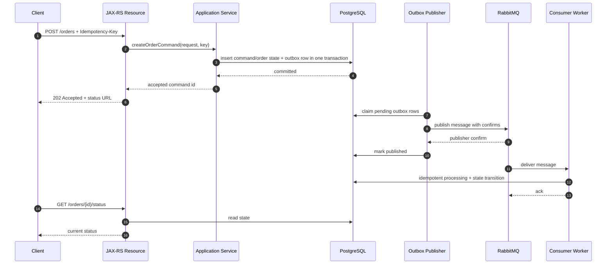
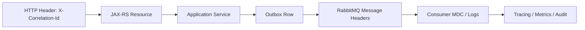

# JAX-RS and RabbitMQ Integration

## 1. Core idea

A JAX-RS endpoint is a synchronous HTTP boundary.

RabbitMQ is an asynchronous messaging boundary.

The integration problem is not merely:

```text
receive HTTP request
publish message
return response
```

The real problem is:

```text
How do we accept a client command,
make durable business intent visible,
publish a message without losing it,
return an honest HTTP response,
allow the client to track progress,
and preserve correctness under duplicate requests, retries, crashes, and delayed consumers?
```

That is why RabbitMQ integration should not be hidden inside a random JAX-RS resource method.

A production-grade design must make these boundaries explicit:

```text
HTTP request boundary
validation boundary
idempotency boundary
business transaction boundary
outbox boundary
publisher boundary
consumer processing boundary
status/query boundary
error visibility boundary
```

The endpoint does not complete the full business process.

It accepts intent.

RabbitMQ carries work to the asynchronous side of the system.

---

## 2. The wrong mental model

A common bad model:

```java
@POST
@Path("/orders")
public Response createOrder(CreateOrderRequest request) {
    orderService.validate(request);
    rabbitPublisher.publish("order.create", request);
    return Response.ok().build();
}
```

This looks simple, but it hides several production questions:

```text
What if publish fails after validation?
What if the HTTP client times out and retries?
What if publish succeeds but the process crashes before returning HTTP response?
What if the same command is sent twice?
What if the consumer fails permanently?
What if the consumer succeeds but status endpoint still shows pending?
What if the message is unroutable?
What if the broker blocks the publisher due to memory/disk alarm?
What if RabbitMQ is unavailable?
What does 200 OK actually mean?
```

Returning `200 OK` after enqueueing a message is often misleading.

The backend has not completed the business operation.

It has accepted work for asynchronous processing.

---

## 3. Better mental model: HTTP command to durable intent

For asynchronous operations, the HTTP endpoint should usually do this:

```text
1. Authenticate and authorize request
2. Validate syntax and basic business preconditions
3. Resolve idempotency key
4. Create or reuse durable command record
5. Insert business intent and outbox row in the same DB transaction
6. Return 202 Accepted or equivalent response with status reference
7. Outbox publisher later publishes to RabbitMQ
8. Consumer processes command/event/task
9. Status endpoint exposes current state
```

A safer architecture:



The important shift:

```text
HTTP response confirms durable acceptance, not full completion.
RabbitMQ message delivery drives asynchronous progress.
Database state is the source of truth for client-visible status.
```

---

## 4. HTTP response semantics

Do not casually return `200 OK` for asynchronous work.

Use response semantics deliberately:

| HTTP response | Meaning in async RabbitMQ flow |
|---|---|
| `201 Created` | Resource was created synchronously enough to expose as created |
| `202 Accepted` | Request accepted for asynchronous processing |
| `200 OK` | Operation completed or current representation returned |
| `204 No Content` | Synchronous command completed with no body |
| `400 Bad Request` | Request is structurally invalid |
| `401 Unauthorized` | Client is not authenticated |
| `403 Forbidden` | Client is authenticated but not allowed |
| `404 Not Found` | Target resource does not exist or is not visible |
| `409 Conflict` | Business state conflict, duplicate semantic conflict, version conflict |
| `422 Unprocessable Entity` | Semantically invalid request, if your API standard uses it |
| `429 Too Many Requests` | Client-level throttling or backpressure surfaced to caller |
| `503 Service Unavailable` | Dependency unavailable and request cannot be safely accepted |

For RabbitMQ-backed async commands, `202 Accepted` is often the honest response.

Example response body:

```json
{
  "commandId": "cmd_01HR...",
  "resourceId": "ord_12345",
  "status": "ACCEPTED",
  "statusUrl": "/orders/ord_12345/status",
  "correlationId": "corr_01HR..."
}
```

This says:

```text
We accepted your request.
We have not promised that downstream processing is complete.
Use this identifier to track progress.
```

---

## 5. JAX-RS boundary should stay thin

The JAX-RS resource should not contain messaging logic.

Bad layering:

```text
JAX-RS Resource
  validates request
  opens DB transaction
  publishes RabbitMQ message
  handles publisher confirm
  handles retry
  updates order state
  formats response
```

Better layering:

```text
JAX-RS Resource
  parse request
  authenticate/authorize via platform mechanism
  call application service
  map result to HTTP response

Application Service
  validate command
  enforce idempotency
  run transaction
  persist durable intent
  write outbox row

Outbox Publisher
  claim outbox row
  publish to RabbitMQ
  wait for confirm
  mark published

Consumer
  consume message
  enforce inbox/idempotency
  execute business transition
  ack/nack/reject
```

Example skeleton:

```java
@Path("/orders")
@Consumes(MediaType.APPLICATION_JSON)
@Produces(MediaType.APPLICATION_JSON)
public class OrderResource {
    private final OrderCommandService commandService;

    @POST
    public Response submitOrder(
            @HeaderParam("Idempotency-Key") String idempotencyKey,
            @HeaderParam("X-Correlation-Id") String correlationId,
            SubmitOrderRequest request) {

        AcceptedCommand accepted = commandService.acceptSubmitOrder(
            request,
            IdempotencyKey.required(idempotencyKey),
            CorrelationId.fromOrCreate(correlationId)
        );

        return Response.accepted(new AcceptedCommandResponse(
                accepted.commandId(),
                accepted.orderId(),
                accepted.status(),
                accepted.statusUrl(),
                accepted.correlationId()
        )).location(URI.create(accepted.statusUrl())).build();
    }
}
```

The resource does not know RabbitMQ topology.

That belongs to messaging adapters and configuration.

---

## 6. Idempotency key at the HTTP boundary

Async endpoints are especially vulnerable to duplicate requests.

Clients retry because of:

```text
network timeout
HTTP 502/503/504
client-side timeout
mobile/network instability
load balancer retry
user double click
job scheduler retry
unknown response after server processed request
```

If the endpoint publishes a message directly without idempotency, duplicate messages may create duplicate business actions.

For commands that create or mutate business state, require an idempotency key.

Example:

```http
POST /orders
Idempotency-Key: tenant-123:client-request-789
X-Correlation-Id: corr-456
Content-Type: application/json
```

Server-side idempotency table:

```sql
CREATE TABLE api_idempotency_key (
    tenant_id           text        NOT NULL,
    idempotency_key    text        NOT NULL,
    request_hash       text        NOT NULL,
    command_id         text        NOT NULL,
    resource_id        text,
    status             text        NOT NULL,
    response_payload   jsonb,
    created_at         timestamptz NOT NULL DEFAULT now(),
    updated_at         timestamptz NOT NULL DEFAULT now(),
    PRIMARY KEY (tenant_id, idempotency_key)
);
```

Rules:

```text
same key + same request hash = return same accepted result
same key + different request hash = 409 Conflict
missing key for non-idempotent command = reject or generate only if safe
key scope should include tenant/client boundary
key retention must match client retry window
```

Do not confuse HTTP idempotency key with RabbitMQ message ID.

They can be related, but they serve different boundaries:

| Identifier | Boundary |
|---|---|
| Idempotency key | HTTP client request deduplication |
| Command ID | Application command lifecycle |
| Message ID | Broker/message delivery identity |
| Correlation ID | Trace/debugging across systems |
| Causation ID | What caused this message |
| Business key | Domain aggregate identity |

---

## 7. Correlation from HTTP to RabbitMQ

Every async flow should propagate correlation metadata.

Minimum useful metadata:

```text
correlation_id
causation_id
traceparent
tenant_id
actor_id
source_service
command_id / event_id
message_type
message_version
created_at
published_at
idempotency_key reference if safe
```

HTTP to RabbitMQ propagation:



Example message envelope:

```json
{
  "metadata": {
    "messageId": "msg_01HR...",
    "messageType": "order.submit.requested",
    "messageVersion": 1,
    "correlationId": "corr_01HR...",
    "causationId": "cmd_01HR...",
    "tenantId": "tenant_123",
    "sourceService": "quote-order-api",
    "createdAt": "2026-07-11T12:00:00Z"
  },
  "payload": {
    "orderId": "ord_12345"
  }
}
```

For RabbitMQ, some metadata can live in AMQP properties/headers.

But do not over-fragment metadata randomly.

Use a consistent internal convention:

```text
AMQP properties for broker/client-level metadata
headers for routing/trace/operational metadata
payload for business facts
```

---

## 8. Transaction boundary: direct publish vs outbox

The most important JAX-RS/RabbitMQ correctness issue is the transaction boundary.

Bad pattern:

```java
@Transactional
public Order createOrder(Request request) {
    Order order = orderRepository.insert(request);
    rabbitPublisher.publish(orderCreated(order));
    return order;
}
```

Failure windows:

| Window | Result |
|---|---|
| DB insert succeeds, publish fails | State exists, no message |
| Publish succeeds, DB transaction rolls back | Message exists, state does not |
| Publish succeeds, process crashes before HTTP response | Client may retry and create duplicate |
| Publish times out but broker accepted message | Publisher may retry and duplicate |

Preferred pattern:

```java
@Transactional
public AcceptedCommand acceptSubmitOrder(SubmitOrderRequest request, IdempotencyKey key) {
    IdempotencyRecord existing = idempotencyRepository.find(key);
    if (existing != null) {
        return existing.toAcceptedCommand();
    }

    Order order = orderRepository.createPending(request);
    Command command = commandRepository.create("SubmitOrder", order.id(), key);

    outboxRepository.insert(new OutboxMessage(
        command.messageId(),
        "order.command.exchange",
        "order.submit.requested",
        buildPayload(order, command),
        buildHeaders(command)
    ));

    idempotencyRepository.insert(key, request.hash(), command.id(), order.id());

    return AcceptedCommand.of(command.id(), order.id(), "ACCEPTED");
}
```

The outbox publisher handles RabbitMQ publishing outside the HTTP request path.

This gives you:

```text
atomic DB state + outbox intent
retryable publish
publisher confirm integration
clear operational backlog
no direct dependency on broker availability for already accepted transaction, depending design
```

---

## 9. When direct publish from JAX-RS may be acceptable

Direct publish is not always forbidden.

It may be acceptable when:

```text
message is non-critical telemetry
loss is acceptable
operation has no business side effect
there is no DB transaction involved
caller can safely retry
publisher confirm is used
mandatory/unroutable handling exists
backpressure behavior is explicit
```

Examples:

```text
low-value async notification hint
best-effort analytics event
internal cache warmup signal
non-critical audit supplement where authoritative audit is elsewhere
```

Direct publish is risky when:

```text
message represents business command
message is required for state consistency
message triggers billing/order/fulfillment/provisioning
message is the only evidence of accepted intent
message must survive process crash
message must align with DB commit
```

For CPQ/order management, default to outbox unless there is a clear reason not to.

---

## 10. Status endpoint pattern

If the API returns `202 Accepted`, clients need a way to observe progress.

Example endpoints:

```text
POST /orders
GET  /orders/{orderId}/status
GET  /commands/{commandId}
GET  /orders/{orderId}
```

Status state should be backed by durable application state, not RabbitMQ queue inspection.

Example status model:

```text
ACCEPTED
PUBLISH_PENDING
PUBLISHED
PROCESSING
WAITING_FOR_DOWNSTREAM
COMPLETED
FAILED_RETRYABLE
FAILED_FINAL
CANCELLED
```

Be careful not to leak internal implementation details.

Good client-facing status:

```json
{
  "orderId": "ord_12345",
  "status": "PROCESSING",
  "lastUpdatedAt": "2026-07-11T12:03:00Z",
  "correlationId": "corr_01HR..."
}
```

Bad client-facing status:

```json
{
  "status": "stuck in rabbitmq.retry.5m.queue with x-death-count=3"
}
```

Internal diagnostics can expose RabbitMQ detail to support tools.

Public APIs should expose business-safe state.

---

## 11. Polling, SSE, WebSocket, and callbacks

For long-running async processing, you need a progress communication model.

Options:

| Pattern | When useful | Risk |
|---|---|---|
| Polling status endpoint | Simple, reliable, firewall-friendly | Excessive polling load |
| SSE | Server-to-client progress for web clients | Connection lifecycle complexity |
| WebSocket | Bidirectional live interaction | Operational complexity |
| Callback/webhook | Partner integration | Retry/security/signature complexity |
| Email/notification | Human workflow | Not enough for machine integration |

RabbitMQ should not be exposed directly to API clients.

External clients should not need to know queue names, routing keys, DLX, or retry topology.

The API layer translates business status into client-safe representation.

---

## 12. Error mapping in async systems

In synchronous HTTP, error mapping is direct.

In async RabbitMQ systems, errors happen after the HTTP response.

That changes the API contract.

Synchronous validation errors:

```text
invalid JSON
missing required field
unknown product id if immediately checkable
unauthorized actor
invalid idempotency key reuse
business precondition conflict known at request time
```

These can be returned immediately as `4xx`.

Asynchronous processing errors:

```text
pricing engine unavailable
downstream fulfillment timeout
temporary integration failure
consumer poison message
schema rejected by downstream
manual approval required
```

These should update durable state and be visible through status/query/event mechanisms.

Do not return `202 Accepted` and then hide failure forever.

A system that accepts async work must provide async failure visibility.

---

## 13. Broker unavailable behavior

With direct publish, broker unavailable usually affects the HTTP endpoint immediately.

Possible responses:

```text
503 Service Unavailable
429 Too Many Requests if backpressure policy maps this way
500 Internal Server Error if unexpected, but avoid generic mapping for known dependency outage
```

With outbox, broker availability may not block acceptance if the database transaction can commit.

But this is a product/business decision.

If the system accepts commands while RabbitMQ is down, it must have:

```text
outbox backlog alerting
clear publish lag metric
capacity to drain backlog
client-visible status such as PUBLISH_PENDING or ACCEPTED
SRE runbook
business owner awareness
```

If asynchronous processing is time-sensitive, accepting unlimited backlog while broker is down can be worse than rejecting.

Use explicit acceptance policy:

```text
accept if backlog < threshold
reject/degrade if backlog too high
apply tenant/client rate limit
surface delayed processing status
```

---

## 14. Backpressure from RabbitMQ to HTTP

RabbitMQ can signal pressure through blocked connections, slow confirms, growing queue depth, DLQ growth, or unavailable consumers.

The JAX-RS layer needs a policy for backpressure.

Possible backpressure gates:

```text
outbox pending count threshold
publish lag threshold
queue depth threshold
DLQ spike threshold
consumer health threshold
broker alarm state
connection blocked state
```

Example decision matrix:

| Signal | API behavior |
|---|---|
| Outbox backlog normal | Accept command |
| Outbox backlog high | Accept only priority/critical tenants, throttle others |
| Broker memory/disk alarm | Stop direct publish; consider 503/429 |
| DLQ spike for same message type | Disable new submissions for affected workflow |
| Consumer down | Accept only if backlog SLA allows |
| Downstream unavailable | Return 202 only if async retry is valid and visible |

Backpressure should be explicit, not accidental.

---

## 15. JAX-RS request validation vs consumer validation

Validate at both boundaries, but for different reasons.

JAX-RS validation:

```text
syntax
required fields
field types
client permissions
basic domain preconditions
idempotency key
tenant visibility
request size
```

Consumer validation:

```text
message schema
message version
required metadata
business state transition validity
idempotency/inbox
downstream dependency readiness
poison message classification
```

Do not assume that because an HTTP endpoint validated the request, every RabbitMQ message is valid.

Messages can come from:

```text
older application version
manual replay
another service
integration bridge
shovel/federation
buggy publisher
partial deployment
```

Consumers must defend their own boundary.

---

## 16. Message ownership from API commands

A JAX-RS endpoint should not publish arbitrary messages.

Each async command needs clear ownership:

```text
who owns message type
who owns schema
who owns exchange/routing key
who owns consumer behavior
who owns retry/DLQ
who owns replay
who owns status state
who owns incident response
```

Example command ownership:

```text
Message type: order.submit.requested
Owner: Quote & Order backend team
Producer: quote-order-api
Primary consumer: order-orchestration-worker
Exchange: domain command exchange
Routing key: order.submit.requested
Idempotency key: tenant_id + client idempotency key
State table: order_command
Retry owner: order-orchestration-worker
DLQ owner: Quote & Order backend team
```

Use `Internal verification checklist` before assuming any actual CSG topology.

---

## 17. API contract for async commands

Document the async contract clearly.

Minimum contract fields:

```text
HTTP method/path
request schema
idempotency requirement
accepted response schema
status endpoint
possible status values
retry behavior from client perspective
error mapping
SLA/timeout expectation
correlation ID behavior
security scope
privacy classification
```

Example API documentation fragment:

```text
POST /orders

Creates an order submission command.

This endpoint returns 202 Accepted when the command is durably accepted.
Processing continues asynchronously. The response does not mean that pricing,
fulfillment, or downstream integration has completed.

Clients must provide Idempotency-Key.
Clients can poll GET /orders/{orderId}/status.
```

This avoids the common mismatch:

```text
client thinks order is done
backend only enqueued a command
consumer fails later
no one knows who owns the failure
```

---

## 18. Mapping JAX-RS filters/interceptors to messaging metadata

In enterprise Java systems, correlation/security/tenant context often enters through filters.

Example boundaries:

```text
ContainerRequestFilter extracts tenant/user/correlation
Resource method receives typed request
Application service receives explicit context object
Outbox row stores metadata
Publisher maps metadata to RabbitMQ headers/properties
Consumer reconstructs processing context
```

Pseudocode:

```java
public record RequestContext(
    String tenantId,
    String actorId,
    String correlationId,
    String traceparent,
    String sourceIp
) {}
```

Do not rely on thread-local context silently crossing async boundaries.

Thread-local context dies at process boundaries.

RabbitMQ message metadata is the async boundary carrier.

---

## 19. Security and privacy at the HTTP-to-message boundary

Before publishing a message, decide what data is allowed to leave the API boundary.

Questions:

```text
Does payload contain PII?
Does header contain PII?
Will this message land in DLQ?
Who can read the DLQ?
Will replay tools expose payload?
Will logs print headers/payload?
Is tenant ID required for isolation?
Is actor ID required for audit?
Should sensitive values be referenced by ID instead of copied?
```

A safe default:

```text
put business identifiers in message
avoid copying full sensitive request bodies
store sensitive details in DB with access control
let consumers fetch authorized data if needed
redact logs by default
```

For order/quote systems, be careful with:

```text
customer name
service address
billing information
contract terms
pricing details
approval comments
partner identifiers
```

---

## 20. Observability for JAX-RS + RabbitMQ

You need observability across both synchronous and asynchronous halves.

API metrics:

```text
request rate
accepted command count
rejected command count
idempotency hit count
validation error count
accept latency
status endpoint rate
```

Outbox metrics:

```text
pending outbox rows
oldest unpublished age
publish attempts
publish success/failure
publisher confirm latency
unroutable count
```

RabbitMQ metrics:

```text
publish rate
queue depth
ready/unacked
consumer count
redelivery rate
DLQ size
retry queue size
connection blocked
```

Consumer metrics:

```text
processing latency
ack/nack/reject count
idempotency duplicate count
business failure count
external dependency failure count
state transition success/failure
```

Trace should connect:

```text
HTTP request span
DB transaction span
outbox publish span
RabbitMQ publish span
consumer receive span
business processing span
DB update span
```

---

## 21. Failure modes

Common JAX-RS/RabbitMQ integration failure modes:

| Failure mode | Symptom | Design defense |
|---|---|---|
| Direct publish after DB commit fails | State exists but no async work | Outbox |
| Publish succeeds then HTTP response lost | Client retries and duplicates | Idempotency key |
| Consumer fails after side effect | Redelivery duplicates side effect | Inbox/idempotent consumer |
| API returns 200 for async work | Client assumes completion | 202 + status endpoint |
| Broker unavailable | API errors or backlog grows | Acceptance/backpressure policy |
| Consumer down | Queue depth grows | Dashboard/alert/runbook |
| Message unroutable | Accepted command never processed | mandatory/return listener/AE + outbox failure state |
| Retry storm | Consumer overload, DB overload | bounded retry + DLQ/parking lot |
| Missing correlation ID | Debugging requires guesswork | metadata propagation standard |
| PII in DLQ | Privacy/compliance exposure | payload minimization/redaction/access control |

---

## 22. Production-safe debugging path

When a client says, "I submitted the request but nothing happened," debug in this order:

```text
1. Find HTTP request by correlation ID / idempotency key
2. Check API response: accepted or rejected?
3. Check command/business state row
4. Check outbox row status
5. Check publish attempts and confirm state
6. Check exchange/routing key/binding correctness
7. Check target queue depth/ready/unacked
8. Check consumer logs by correlation/message ID
9. Check inbox/processed-message table
10. Check DLQ/retry queues and x-death headers
11. Check downstream dependency state
12. Check final business state/status endpoint
```

Do not start by randomly replaying messages.

First establish where the lifecycle stopped.

---

## 23. PR review checklist

For any PR where a JAX-RS endpoint publishes or causes RabbitMQ messages, ask:

```text
What does the HTTP response mean?
Is this synchronous completion or async acceptance?
Is 202 Accepted more correct than 200 OK?
Is there an idempotency key?
What happens if the client retries?
What is persisted before publishing?
Is outbox needed?
What is the transaction boundary?
What is the message type/version/schema?
What metadata is propagated?
What is the routing key/exchange?
What happens if RabbitMQ is unavailable?
What happens if publish is confirmed late or times out?
How does the client observe progress?
Where is async failure visible?
What is the retry/DLQ strategy?
What is the privacy classification of payload/headers?
What dashboard/alert/runbook covers this flow?
```

---

## 24. Internal verification checklist

Verify these in the actual CSG/team environment before assuming details:

```text
Which JAX-RS endpoints publish RabbitMQ messages directly?
Which endpoints write to outbox instead?
Is 202 Accepted used for async commands?
Is Idempotency-Key required for create/mutate commands?
Where is idempotency stored?
How is correlation ID generated and propagated?
What is the standard message envelope?
Which exchange/routing key is used per command/event?
Are RabbitMQ topology details declared by app, platform, or GitOps?
How are publisher confirms handled?
How are unroutable messages detected?
Where is async processing status stored?
What status endpoints exist?
What happens when RabbitMQ is down?
What backlog threshold causes API throttling/rejection?
What logs/traces connect HTTP request to consumer processing?
Which team owns DLQ/replay for each message type?
Are payloads checked for PII/privacy risk?
```

---

## 25. Senior engineer summary

A JAX-RS + RabbitMQ integration is good when:

```text
HTTP contract is honest
idempotency is explicit
business intent is durable
publish is reliable
async progress is observable
consumer processing is idempotent
failure is visible
retry is bounded
DLQ has ownership
privacy risk is controlled
```

A weak integration looks simple in code but fails under real production conditions:

```text
POST request publishes directly
returns 200 OK
no idempotency
no outbox
no status endpoint
no confirm handling
no DLQ ownership
no correlation ID
no replay discipline
```

The senior engineer move is to treat the HTTP-to-message boundary as a correctness boundary, not a convenience wrapper around `basicPublish`.

---

## References

- RabbitMQ Consumer Acknowledgements and Publisher Confirms: https://www.rabbitmq.com/docs/confirms
- RabbitMQ Reliability Guide: https://www.rabbitmq.com/docs/reliability
- RabbitMQ Publishers Guide: https://www.rabbitmq.com/docs/publishers
- RabbitMQ Java Client API Guide: https://www.rabbitmq.com/client-libraries/java-api-guide
- Jakarta RESTful Web Services: https://jakarta.ee/specifications/restful-ws/
