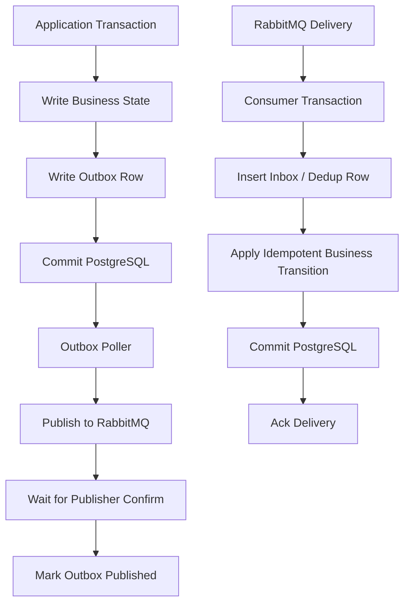
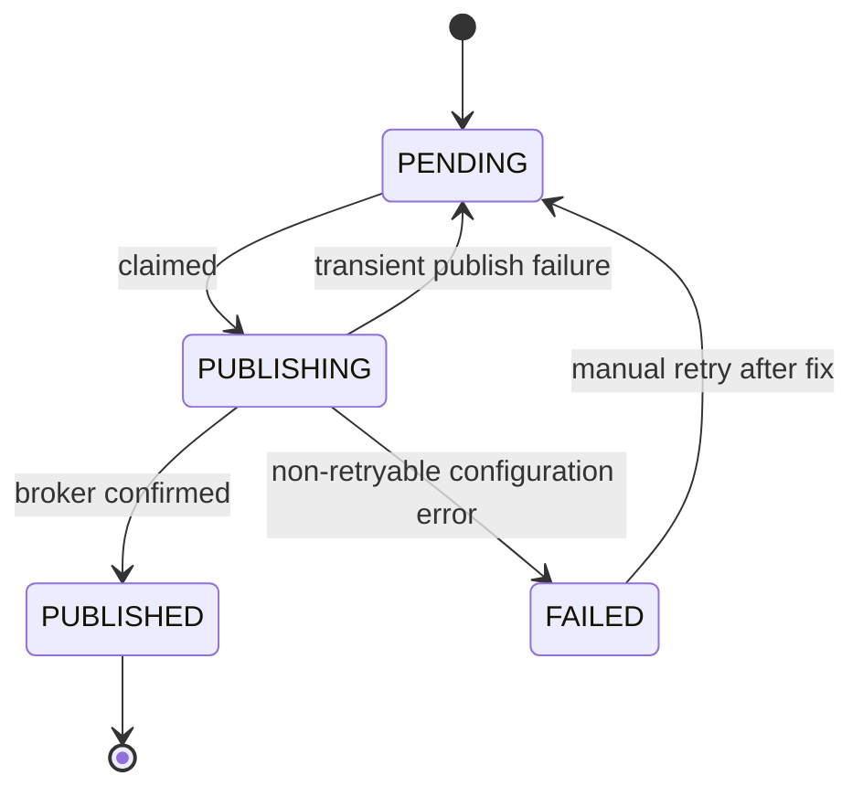

# PostgreSQL, MyBatis, and RabbitMQ Integration

## 1. Core idea

RabbitMQ and PostgreSQL do not share a transaction.

That single fact drives most correctness problems in enterprise messaging.

A Java service often needs to do both:

```text
change durable business state in PostgreSQL
publish or consume a RabbitMQ message
```

But PostgreSQL commit and RabbitMQ publish/ack are separate systems.

There is no automatic atomic boundary across them.

Therefore, the design must explicitly handle:

```text
DB commit succeeds but message publish fails
message publish succeeds but DB transaction rolls back
consumer writes DB then crashes before ack
consumer acks then DB write fails
publisher confirm times out but broker accepted message
message redelivers after DB side effect already happened
schema migration changes payload/state expectations
replay reprocesses old message against new schema/state
```

The solution is not "try/catch harder".

The solution is disciplined integration patterns:

```text
transactional outbox
idempotent publisher
publisher confirm
inbox / processed message table
idempotent consumer
state transition table
explicit locking
bounded retry/DLQ
repair and reconciliation tooling
```

---

## 2. The false promise of simple integration

Bad producer pattern:

```java
@Transactional
public void submitOrder(SubmitOrderCommand command) {
    orderMapper.insertOrder(command.toOrderRow());
    rabbitPublisher.publish("order.submit.requested", command.toMessage());
}
```

Bad consumer pattern:

```java
public void handleDelivery(Delivery delivery) {
    SubmitOrderMessage message = deserialize(delivery);
    orderMapper.updateStatus(message.orderId(), "SUBMITTED");
    channel.basicAck(delivery.getEnvelope().getDeliveryTag(), false);
}
```

Both look reasonable.

Both are incomplete.

The producer ignores atomicity between DB and broker.

The consumer ignores duplicate delivery and crash windows.

Production systems need to assume:

```text
anything after a DB commit can fail
anything after a broker publish can fail
anything before an ack can be repeated
anything after an ack may be unrecoverable from RabbitMQ
```

---

## 3. Transaction boundaries

There are three separate boundaries:

```text
PostgreSQL transaction
RabbitMQ publisher confirm boundary
RabbitMQ consumer acknowledgement boundary
```

They do not mean the same thing.

| Boundary | What it means | What it does not mean |
|---|---|---|
| PostgreSQL commit | DB state is durable | RabbitMQ message was published |
| Publisher confirm | Broker accepted publication according to confirm semantics | Consumer processed message |
| Consumer ack | Broker can remove delivery from queue | DB side effect was correct unless app ensured it |

You must compose them intentionally.

A reliable architecture usually looks like this:



---

## 4. Producer-side integration: outbox with PostgreSQL

The transactional outbox solves this producer problem:

```text
How do I ensure that a committed business state change has a durable message intent?
```

The outbox row is inserted in the same PostgreSQL transaction as the business change.

Example tables:

```sql
CREATE TABLE order_header (
    order_id        text PRIMARY KEY,
    tenant_id       text NOT NULL,
    status          text NOT NULL,
    version         bigint NOT NULL,
    created_at      timestamptz NOT NULL DEFAULT now(),
    updated_at      timestamptz NOT NULL DEFAULT now()
);

CREATE TABLE message_outbox (
    outbox_id       text PRIMARY KEY,
    aggregate_type  text NOT NULL,
    aggregate_id    text NOT NULL,
    message_type    text NOT NULL,
    message_version integer NOT NULL,
    exchange_name   text NOT NULL,
    routing_key     text NOT NULL,
    payload         jsonb NOT NULL,
    headers         jsonb NOT NULL,
    status          text NOT NULL,
    attempt_count   integer NOT NULL DEFAULT 0,
    next_attempt_at timestamptz NOT NULL DEFAULT now(),
    published_at    timestamptz,
    created_at      timestamptz NOT NULL DEFAULT now(),
    updated_at      timestamptz NOT NULL DEFAULT now()
);

CREATE INDEX idx_message_outbox_pending
ON message_outbox (status, next_attempt_at, created_at);
```

Producer transaction:

```java
@Transactional
public AcceptedCommand acceptOrder(SubmitOrderCommand command) {
    OrderRow order = OrderRow.pending(command);
    orderMapper.insert(order);

    OutboxRow outbox = OutboxRow.of(
        "order.submit.requested",
        1,
        "order.command.exchange",
        "order.submit.requested",
        payload(order),
        headers(command)
    );

    outboxMapper.insert(outbox);

    return AcceptedCommand.of(order.orderId(), outbox.outboxId());
}
```

If the transaction commits:

```text
business state exists
outbox intent exists
publisher can retry until RabbitMQ accepts it
```

If the transaction rolls back:

```text
business state does not exist
outbox intent does not exist
no message should be published
```

---

## 5. Outbox polling with SKIP LOCKED

Multiple publisher workers can safely claim rows using row-level locking.

Typical pattern:

```sql
SELECT outbox_id
FROM message_outbox
WHERE status = 'PENDING'
  AND next_attempt_at <= now()
ORDER BY created_at
LIMIT 100
FOR UPDATE SKIP LOCKED;
```

Then update claimed rows:

```sql
UPDATE message_outbox
SET status = 'PUBLISHING',
    attempt_count = attempt_count + 1,
    updated_at = now()
WHERE outbox_id = ANY(#{outboxIds});
```

Conceptual MyBatis mapper:

```xml
<select id="claimPending" resultType="OutboxRow">
  SELECT *
  FROM message_outbox
  WHERE status = 'PENDING'
    AND next_attempt_at &lt;= now()
  ORDER BY created_at
  LIMIT #{limit}
  FOR UPDATE SKIP LOCKED
</select>
```

Important rules:

```text
claim and mark PUBLISHING in a transaction
publish outside the DB transaction if confirm wait may be slow
mark PUBLISHED only after publisher confirm
on publish failure, move back to PENDING with next_attempt_at
on permanent failure, move to FAILED or NEEDS_REVIEW
```

Do not hold a DB transaction open while waiting indefinitely for RabbitMQ.

That can exhaust connection pools and block unrelated writes.

---

## 6. Publisher confirm and outbox state

Outbox state should reflect publisher confirm outcome.

State machine:



Common statuses:

```text
PENDING
PUBLISHING
PUBLISHED
FAILED
NEEDS_REVIEW
CANCELLED
```

Failure classification:

| Failure | Outbox action |
|---|---|
| connection temporarily down | retry later |
| connection blocked due to broker alarm | retry with backoff / stop claiming |
| confirm timeout | retry but expect possible duplicate |
| unroutable with mandatory return | mark failed or route to repair path |
| exchange missing | configuration failure, stop and alert |
| serialization error | mark failed, requires code/data fix |

Publisher confirms reduce uncertainty.

They do not remove duplicate possibility.

If confirm times out, the broker may still have accepted the message.

Therefore consumers must be idempotent.

---

## 7. Consumer-side integration: inbox with PostgreSQL

The inbox solves this consumer problem:

```text
How do I process at-least-once RabbitMQ delivery without applying the same side effect twice?
```

Example table:

```sql
CREATE TABLE message_inbox (
    consumer_name       text NOT NULL,
    message_id          text NOT NULL,
    message_type        text NOT NULL,
    message_version     integer NOT NULL,
    aggregate_id        text,
    status              text NOT NULL,
    payload_hash        text NOT NULL,
    first_seen_at       timestamptz NOT NULL DEFAULT now(),
    last_seen_at        timestamptz NOT NULL DEFAULT now(),
    processed_at        timestamptz,
    failure_reason      text,
    attempt_count       integer NOT NULL DEFAULT 0,
    PRIMARY KEY (consumer_name, message_id)
);
```

Consumer transaction:

```java
public void handleDelivery(Delivery delivery) throws IOException {
    long tag = delivery.getEnvelope().getDeliveryTag();

    try {
        messageProcessingService.process(delivery);
        channel.basicAck(tag, false);
    } catch (RetryableFailure e) {
        channel.basicNack(tag, false, false); // let DLX/retry topology decide
    } catch (PermanentFailure e) {
        channel.basicReject(tag, false); // dead-letter or discard depending topology
    }
}
```

Inside `process`:

```java
@Transactional
public void process(Delivery delivery) {
    MessageEnvelope envelope = serializer.deserialize(delivery.getBody());

    boolean inserted = inboxMapper.tryInsertProcessing(
        consumerName,
        envelope.messageId(),
        envelope.messageType(),
        envelope.messageVersion(),
        envelope.payloadHash()
    );

    if (!inserted) {
        InboxRow existing = inboxMapper.find(consumerName, envelope.messageId());
        if (existing.isProcessed()) {
            return; // duplicate delivery, safe no-op
        }
        if (existing.isProcessingTooLong()) {
            // policy decision: retry, takeover, or fail
        }
    }

    applyBusinessTransition(envelope);

    inboxMapper.markProcessed(consumerName, envelope.messageId());
}
```

Ack only after the DB transaction commits.

---

## 8. Ack timing with DB transactions

Correct consumer order:

```text
deserialize
begin DB transaction
insert/check inbox
apply idempotent business transition
commit DB transaction
ack RabbitMQ delivery
```

Bad order:

```text
ack RabbitMQ delivery
begin DB transaction
write DB
commit
```

If the process crashes after ack but before DB commit, RabbitMQ will not redeliver.

The message is lost from the queue perspective.

Another bad order:

```text
begin DB transaction
write DB
ack RabbitMQ delivery
commit DB transaction
```

If ack succeeds but DB commit fails, RabbitMQ will not redeliver.

Safer order:

```text
commit DB
ack
```

If crash happens after commit but before ack, RabbitMQ may redeliver.

That is acceptable if the consumer is idempotent.

This is the core at-least-once trade-off.

---

## 9. State transition table

For CPQ/order management, state transitions are often more important than individual messages.

A state transition table can make message-driven changes auditable and idempotent.

Example:

```sql
CREATE TABLE order_state_transition (
    transition_id     text PRIMARY KEY,
    order_id          text NOT NULL,
    from_status       text NOT NULL,
    to_status         text NOT NULL,
    reason            text NOT NULL,
    message_id        text NOT NULL,
    correlation_id    text NOT NULL,
    created_at        timestamptz NOT NULL DEFAULT now(),
    UNIQUE(order_id, message_id)
);
```

Consumer transition logic:

```text
load current order state
validate transition is allowed
insert transition row with unique message_id
update order state with optimistic version check
mark inbox processed
commit
ack
```

This protects against:

```text
duplicate delivery
out-of-order event
replay of old message
manual replay mistake
consumer retry after partial processing
```

State transitions should be validated by business invariants, not just message arrival.

---

## 10. Locking patterns

Message consumers often update aggregate state.

You need a locking strategy.

Options:

| Strategy | Use case | Risk |
|---|---|---|
| Optimistic locking with version column | Most aggregate updates | Retry needed on conflict |
| `SELECT FOR UPDATE` | Strict serialized update per row | Can block under long transactions |
| Unique constraint idempotency | Deduplication | Requires stable keys |
| Advisory lock | Cross-row/process coordination | Easy to misuse; operationally opaque |
| Redis lock | Cross-system lock | Expiry/fencing risk |

Example optimistic update:

```sql
UPDATE order_header
SET status = #{newStatus},
    version = version + 1,
    updated_at = now()
WHERE order_id = #{orderId}
  AND version = #{expectedVersion};
```

If affected row count is 0:

```text
state changed concurrently
reload state
classify as already-applied, retryable conflict, or invalid transition
```

Do not use locks to hide unclear message ordering requirements.

If order matters per aggregate, design routing/consumer concurrency accordingly.

---

## 11. MyBatis transaction awareness

MyBatis itself does not magically define your transaction boundary.

In enterprise Java, transaction boundary may be controlled by:

```text
Jakarta Transactions / JTA
Spring transaction management
application server transaction manager
manual JDBC transaction
custom unit-of-work abstraction
```

Verify actual behavior.

Questions:

```text
Are mapper calls participating in the same transaction?
Is autocommit disabled where needed?
Are outbox insert and business insert in the same transaction?
Does exception type trigger rollback?
Are checked exceptions rolled back?
Are mapper sessions reused correctly?
Is transaction propagated across service methods?
```

Common bug:

```text
service method A is transactional
service method B is called through self-invocation
transaction annotation on B is ignored by proxy-based framework
outbox write commits differently than expected
```

Another common bug:

```text
mapper writes business row
publisher publishes message
later mapper fails
transaction rolls back
message still exists
```

Keep RabbitMQ publish outside transactional business methods unless you deliberately accept the risk.

---

## 12. Serialization failure after DB commit

A subtle outbox failure:

```text
business transaction commits
outbox row contains enough data
publisher later cannot serialize payload
```

This happens when:

```text
payload schema changed
field contains unexpected null
enum value unknown
old row uses old format
serializer version deployed before migration
message template expects data not present
```

Design defense:

```text
store final publishable payload in outbox when transaction commits
validate payload before insert
store message_version
avoid generating payload later from mutable business tables unless intentional
test old outbox rows with new publisher code
```

Two outbox styles:

| Style | Description | Trade-off |
|---|---|---|
| Store full payload | Outbox has exact message body | More storage, better reproducibility |
| Store reference only | Publisher builds payload later from DB | Smaller, but vulnerable to state drift/schema changes |

For high-value business events, storing the full intended payload is often safer.

---

## 13. Migration ordering

Schema and message changes require careful ordering.

Dangerous migration:

```text
consumer expects new DB column
message with new field is published
DB migration not deployed everywhere
consumer fails
DLQ fills
```

Safer ordering for additive change:

```text
1. Deploy DB migration adding nullable/defaulted column
2. Deploy consumers that tolerate old and new messages
3. Deploy producers that publish new optional field
4. Backfill if required
5. Later make field required only after all producers/consumers support it
```

Safer ordering for message deprecation:

```text
1. Add new message version
2. Consumers support old + new
3. Producers switch to new
4. Monitor old version disappearance
5. Retire old consumer path
6. Remove old fields only after retention/replay window expires
```

Remember replay.

Old messages may reappear from:

```text
DLQ replay
parking lot replay
outbox retry
backup restore
cross-broker shovel/federation delay
manual operational tool
```

---

## 14. Data repair and reconciliation

Even good systems need repair paths.

Repair is not a sign of bad engineering.

Uncontrolled repair is.

Common reconciliation queries:

```sql
-- Outbox rows stuck too long
SELECT *
FROM message_outbox
WHERE status IN ('PENDING', 'PUBLISHING')
  AND created_at < now() - interval '15 minutes'
ORDER BY created_at;

-- Commands accepted but not published
SELECT c.command_id, c.status, o.status AS outbox_status
FROM command_table c
LEFT JOIN message_outbox o ON o.aggregate_id = c.command_id
WHERE c.status = 'ACCEPTED'
  AND (o.status IS NULL OR o.status <> 'PUBLISHED');

-- Inbox rows processing too long
SELECT *
FROM message_inbox
WHERE status = 'PROCESSING'
  AND first_seen_at < now() - interval '15 minutes';
```

Repair actions should be explicit:

```text
retry publish outbox row
mark poison outbox row failed
requeue from DLQ to original exchange
replay message with new correlation id but original causation id
mark inbox stuck row as failed after investigation
run domain reconciliation between order state and downstream state
```

Never repair by blindly deleting rows or purging queues in production.

---

## 15. PostgreSQL as queue vs RabbitMQ as broker

Outbox polling means PostgreSQL temporarily behaves like a queue.

That is acceptable for reliable handoff.

But do not confuse it with replacing RabbitMQ.

PostgreSQL outbox is good for:

```text
durable intent
transactional handoff
publisher retry
audit/reconciliation
low/medium throughput coordination
```

RabbitMQ is better for:

```text
consumer fanout
routing topology
work distribution
broker-side backpressure
consumer acknowledgements
retry/DLQ topology
integration across services
```

Bad use of PostgreSQL outbox:

```text
millions of unpartitioned pending rows
no cleanup
no index discipline
poller scans whole table
large payloads without retention policy
using DB as infinite message broker
```

Outbox needs operational design too.

---

## 16. Indexing and retention

Outbox/inbox tables can grow quickly.

Indexes should support operational queries.

Outbox indexes:

```sql
CREATE INDEX idx_outbox_claim
ON message_outbox (status, next_attempt_at, created_at);

CREATE INDEX idx_outbox_aggregate
ON message_outbox (aggregate_type, aggregate_id, created_at);

CREATE INDEX idx_outbox_correlation
ON message_outbox ((headers->>'correlationId'));
```

Inbox indexes:

```sql
CREATE INDEX idx_inbox_status_age
ON message_inbox (status, first_seen_at);

CREATE INDEX idx_inbox_aggregate
ON message_inbox (aggregate_id, first_seen_at);
```

Retention policy:

```text
keep outbox published rows long enough for audit/replay/debugging
archive or partition old rows
keep inbox rows at least as long as message redelivery/replay window
never delete dedup records earlier than duplicate risk window
coordinate retention with DLQ/parking lot retention
```

For large systems, consider partitioning by time or tenant.

---

## 17. RabbitMQ message ID and database keys

Message ID should be stable across publish retries.

If outbox row is retried, do not generate a new message ID each time unless the system intentionally treats each publish attempt as a distinct message.

Recommended identity mapping:

```text
outbox_id = stable publication intent id
message_id = stable message identity, often same as outbox_id
command_id/event_id = stable business message identity
correlation_id = stable trace/request identity
```

Consumer inbox deduplicates on:

```text
consumer_name + message_id
```

Sometimes business idempotency also requires:

```text
tenant_id + business_command_id
tenant_id + order_id + transition_type
tenant_id + external_request_id
```

Technical deduplication prevents duplicate message processing.

Business idempotency prevents duplicate business effect.

You usually need both.

---

## 18. Handling out-of-order messages with DB state

RabbitMQ queue ordering does not guarantee business ordering across multiple queues, consumers, retries, or services.

The database must reject invalid transitions.

Example:

```text
current order status = DRAFT
message says ORDER_FULFILLED
```

Do not blindly update status because the message arrived.

Instead:

```text
load current state
check allowed transition
if already applied, ack as duplicate/no-op
if future transition arrived early, classify as retryable or park
if impossible transition, dead-letter or mark business exception
```

State transition guard:

```java
if (!stateMachine.canTransition(currentStatus, event.targetStatus())) {
    if (stateMachine.isAlreadyApplied(currentStatus, event)) {
        return DuplicateOutcome.ALREADY_APPLIED;
    }
    throw new InvalidTransitionException(currentStatus, event);
}
```

RabbitMQ transports messages.

The database/domain model enforces state correctness.

---

## 19. External calls inside consumer transactions

Avoid long external calls inside DB transactions.

Bad pattern:

```text
begin DB transaction
mark order processing
call downstream HTTP service for 30 seconds
update DB
commit
ack
```

Risks:

```text
locks held too long
connection pool exhaustion
deadlocks
slow redelivery
consumer throughput collapse
hard-to-retry partial side effects
```

Better patterns:

```text
split state transition and external call into separate steps
persist intent to call downstream
use another outbox message for downstream integration
use timeout and compensation
make external call idempotent
store external request id
```

If external call must happen inside processing, keep transaction boundaries short:

```text
transaction 1: claim/mark processing
external call with idempotency key
action result
transaction 2: persist result and mark processed
ack only after durable outcome
```

This requires careful stuck-processing recovery.

---

## 20. Exactly-once illusion

PostgreSQL + RabbitMQ does not give exactly-once end-to-end processing.

You can build effectively-once business behavior with:

```text
stable message IDs
outbox
publisher confirms
inbox deduplication
idempotent state transitions
unique constraints
business idempotency keys
safe replay tooling
```

The real guarantee becomes:

```text
messages may be delivered more than once,
but the business effect is applied once or converges to the same final state.
```

That is the correct target for enterprise order/quote systems.

---

## 21. Observability across PostgreSQL and RabbitMQ

You need both broker metrics and database metrics.

Outbox metrics:

```text
pending count by message_type
oldest pending age
publishing count
failed count
attempt count distribution
confirm latency
unroutable count
```

Inbox metrics:

```text
processing count
duplicate count
processed count
failed count
oldest processing age
message type failure distribution
```

Database metrics:

```text
lock wait time
deadlocks
slow queries
connection pool usage
transaction duration
index bloat
table growth
vacuum lag
```

RabbitMQ metrics:

```text
queue depth
ready/unacked
publish/deliver/ack rate
redelivery rate
DLQ size
retry queue size
connection blocked
consumer utilization
```

The useful dashboards connect these:

```text
HTTP accepted commands up
outbox pending up
RabbitMQ publish rate down
queue depth flat
=> publisher/broker issue

queue depth up
consumer utilization low
DB connection pool saturated
=> consumer blocked by database

DLQ up
inbox failures up
schema version changed
=> deployment/contract issue
```

---

## 22. Production debugging path

When debugging suspected data/message inconsistency:

```text
1. Start with business key: order_id, quote_id, command_id, correlation_id
2. Check current business state in PostgreSQL
3. Check state transition history
4. Check outbox row for expected message
5. Check outbox status and attempt count
6. Check RabbitMQ publish metrics/confirm logs
7. Check queue/DLQ/retry state
8. Check consumer logs by message_id/correlation_id
9. Check inbox row status
10. Check downstream integration state
11. Decide whether to retry, replay, repair DB state, or escalate
```

Do not assume the message is lost.

Most "lost message" incidents are actually:

```text
unroutable publish
unconfirmed publish
message in DLQ
consumer rejected due to schema
consumer processed but status not updated
duplicate suppressed by idempotency
wrong tenant/vhost/routing key
outbox stuck
manual replay created second identity
```

---

## 23. Security and privacy

PostgreSQL/RabbitMQ integration often duplicates data.

The same data may exist in:

```text
business table
outbox payload
RabbitMQ queue
consumer log
DLQ
inbox payload
replay tool
archive table
backup
```

This increases privacy risk.

Design rules:

```text
store only required payload
avoid PII in routing keys
avoid PII in headers
redact logs
protect outbox/inbox tables
restrict DLQ access
define retention
encrypt in transit
verify encryption at rest depending deployment
```

If payload contains sensitive quote/order/customer information, treat outbox and DLQ as sensitive data stores.

---

## 24. PR review checklist

For any PR touching PostgreSQL/MyBatis/RabbitMQ integration, ask:

```text
What DB transaction writes the business state?
Is the message published directly or via outbox?
If direct publish, what failure window is accepted?
Is outbox row inserted in the same transaction as business change?
Is message_id stable across retries?
Are publisher confirms used before marking published?
How are confirm timeouts handled?
Is the consumer idempotent?
Is there an inbox/processed-message table?
Is ack done only after DB commit?
Are state transitions guarded?
Are duplicate and out-of-order messages safe?
Are DB locks/indexes appropriate?
Does the consumer hold DB transactions during external calls?
Is retry/DLQ aligned with DB side effects?
Are schema migrations ordered safely?
Is there a repair/reconciliation path?
Are outbox/inbox retention and cleanup defined?
Are dashboards and alerts updated?
Is sensitive data duplicated into outbox/inbox/DLQ?
```

---

## 25. Internal verification checklist

Verify these in the actual CSG/team environment:

```text
Which services use PostgreSQL/MyBatis/JDBC with RabbitMQ?
Where are transaction boundaries defined?
Is there a standard outbox implementation?
Is there a standard inbox/dedup implementation?
Are outbox rows storing full payload or references?
How are outbox rows claimed?
Is FOR UPDATE SKIP LOCKED used?
How are publisher confirms handled?
How are outbox stuck rows detected?
How are inbox duplicates handled?
Is ack after DB commit enforced by framework/library?
Are state transitions stored/audited?
What are allowed state transitions for quote/order flows?
Are optimistic locks or SELECT FOR UPDATE used?
Are external calls made inside DB transactions?
What repair scripts/tools exist?
Who can replay DLQ messages?
How are schema migrations coordinated with message versions?
What retention exists for outbox/inbox/DLQ?
What dashboards link DB state with RabbitMQ state?
```

---

## 26. Senior engineer summary

PostgreSQL is the durable source of truth for business state.

RabbitMQ is the broker for asynchronous routing and delivery.

MyBatis/JDBC is the application’s mechanism for changing database state.

The dangerous part is the seam between them.

The senior-level design principle:

```text
Do not rely on cross-system atomicity that does not exist.
Create local atomicity with PostgreSQL.
Use RabbitMQ confirms and acknowledgements carefully.
Make consumers idempotent.
Use database constraints and state machines to protect business correctness.
Make repair possible and observable.
```

If the design cannot survive duplicate delivery, delayed delivery, publish retry, consumer crash, and replay, it is not production-ready.

---

## References

- RabbitMQ Consumer Acknowledgements and Publisher Confirms: https://www.rabbitmq.com/docs/confirms
- RabbitMQ Reliability Guide: https://www.rabbitmq.com/docs/reliability
- RabbitMQ Publishers Guide: https://www.rabbitmq.com/docs/publishers
- PostgreSQL SELECT documentation: https://www.postgresql.org/docs/current/sql-select.html
- PostgreSQL Explicit Locking: https://www.postgresql.org/docs/current/explicit-locking.html
