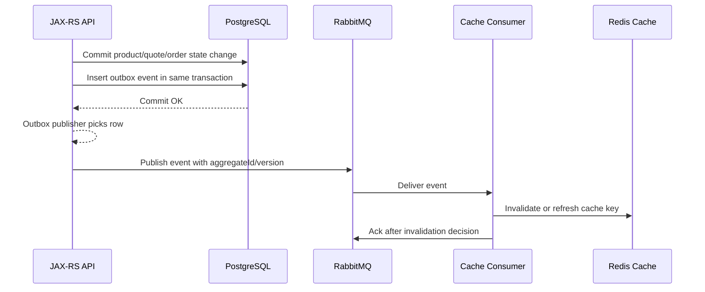

# Redis and RabbitMQ Integration

## 1. Core idea

Redis and RabbitMQ solve different problems.

RabbitMQ is a broker for asynchronous message routing, queueing, delivery acknowledgement, retry, DLQ, and work distribution.

Redis is usually a fast in-memory data structure platform used for cache, ephemeral coordination, rate limiting, counters, short-lived deduplication, and sometimes streaming or pub/sub.

They can work well together, but only when their responsibilities are explicit.

Bad integration usually starts with this assumption:

```text
Redis is fast, therefore Redis can safely replace broker semantics.
```

That is not a safe default.

In enterprise backend systems, Redis should usually support RabbitMQ. It should not silently become an unreviewed second message broker.

A healthy split is:

```text
RabbitMQ owns asynchronous delivery.
Redis owns fast lookup, ephemeral state, cache, or rate control.
PostgreSQL owns durable business truth and audit-grade state.
```

If that boundary is blurred, correctness becomes fragile.

---

## 2. Mental model: three different state layers

Think in three layers.

```text
PostgreSQL
  durable business state
  transactional state transition
  outbox/inbox ledger
  audit/reconciliation source

RabbitMQ
  delivery pipeline
  routing topology
  queue backlog
  ack/nack/redelivery
  retry/DLQ mechanics

Redis
  fast volatile or semi-volatile helper state
  cache
  dedup TTL window
  rate limiter counter
  lock lease
  short-lived workflow hint
```

The dangerous mistake is using Redis as if it were PostgreSQL or RabbitMQ.

Redis is excellent when losing the value is acceptable, repairable, or bounded.

Redis is dangerous when the value is the only record of business progress.

---

## 3. Redis is not a universal broker replacement

Redis can support pub/sub and streams, but that does not mean it is interchangeable with RabbitMQ.

RabbitMQ gives you broker-native concepts such as:

```text
exchange
binding
routing key
queue
consumer ack
nack/reject
requeue
dead-letter exchange
dead-letter queue
prefetch
publisher confirm
mandatory return
quorum queue
stream queue
vhost permission
```

Redis gives you different primitives:

```text
key/value
hash
set
sorted set
counter
TTL
pub/sub channel
stream
consumer group
lock key
Lua script
```

Both are useful. They optimize different failure models.

Use the primitive that matches the invariant you need.

---

## 4. Common integration patterns

Useful Redis + RabbitMQ patterns:

```text
RabbitMQ event -> Redis cache invalidation
RabbitMQ consumer -> Redis short-lived dedup key
RabbitMQ publisher -> Redis rate limiter
RabbitMQ consumer -> Redis rate limiter for downstream API
RabbitMQ consumer -> Redis lock around non-transactional external resource
RabbitMQ event -> Redis cache warm/rebuild trigger
RabbitMQ workflow -> Redis temporary status cache
RabbitMQ DLQ/replay tool -> Redis replay throttle
```

Risky patterns:

```text
Redis key as only source of processed-message truth
Redis lock as only correctness guard for money/order/quote state
Redis pub/sub for business-critical command delivery
Redis stream without retention/replay/consumer lag ownership
Redis cache invalidation event without version or aggregate identity
Redis rate limiter without fallback path
```

The difference is simple:

```text
Redis as optimization: usually acceptable
Redis as correctness boundary: requires hard review
```

---

## 5. Cache invalidation via RabbitMQ

A common pattern:

```text
service A changes durable state in PostgreSQL
service A publishes domain event through RabbitMQ
service B consumes event
service B invalidates or refreshes Redis cache
```

Example flow:



The event must identify what changed.

Minimum useful metadata:

```text
aggregate type
aggregate ID
event type
event version
business version / row version
published time
correlation ID
tenant ID if applicable
```

Do not publish vague cache invalidation messages like:

```json
{
  "type": "CACHE_CHANGED"
}
```

That creates operational ambiguity.

A better message:

```json
{
  "messageId": "01J...",
  "messageType": "QuotePriceChanged",
  "messageVersion": 2,
  "tenantId": "tenant-123",
  "quoteId": "Q-90001",
  "quoteVersion": 17,
  "changedFields": ["totalPrice", "discountSummary"],
  "occurredAt": "2026-07-11T10:15:30Z"
}
```

The consumer can then decide:

```text
delete cache key
refresh cache key
ignore stale event
record invalidation failure
send to DLQ
```

---

## 6. Cache invalidation failure modes

Cache invalidation is deceptively hard.

Failure modes:

```text
event published before DB commit
DB commit succeeds but event is never published
consumer invalidates wrong cache key
consumer processes old event after newer cache value exists
Redis delete succeeds but cache rebuild fails
Redis is unavailable during invalidation
consumer acks before invalidation decision is durable enough
DLQ contains invalidation messages with PII
cache key naming changes but consumers still publish old format
multi-tenant cache key misses tenant dimension
```

Correctness guardrails:

```text
publish via outbox
include aggregate version
make invalidation idempotent
prefer delete over blind overwrite when ordering is uncertain
include tenant/environment dimension in cache key
record invalidation failures in logs/metrics/DLQ
make cache rebuild read from PostgreSQL, not from event payload only
```

If ordering is uncertain, prefer this:

```text
receive event for quote version 16
current cache holds quote version 17
ignore stale invalidation or rebuild from DB
```

Never let an old event overwrite a newer cache value.

---

## 7. Redis as idempotency store

Redis can be used as a short-lived idempotency store.

Example:

```text
consumer receives messageId M
SETNX processed:M true EX 86400
if SETNX succeeds -> process
if SETNX fails -> duplicate within TTL window -> skip or verify
```

This can be useful for:

```text
high-volume low-risk duplicate suppression
short retry windows
external API call throttling
notification deduplication
cache invalidation deduplication
non-critical background jobs
```

But it has important limits.

Redis TTL-based idempotency is not enough when:

```text
duplicate can arrive after TTL expires
business side effect is irreversible
processing must be auditable
replay can happen months later
message must survive Redis flush/failover/data loss
compliance requires durable processing evidence
```

For high-value business operations, prefer PostgreSQL inbox/processed-message table.

Use Redis dedup as a performance optimization, not as the only correctness boundary.

---

## 8. Redis dedup key design

Bad dedup key:

```text
processed:{messageType}
```

This collapses unrelated messages.

Better dedup key:

```text
processed:{serviceName}:{consumerName}:{messageId}
```

For business idempotency:

```text
idempotency:{tenantId}:{operation}:{businessKey}
```

Examples:

```text
processed:pricing-worker:quote-price-request:01JABC...
idempotency:tenant-123:submit-order:ORDER-90001
idempotency:tenant-123:send-notification:invoice-888:email-confirmation
```

Key design must include:

```text
tenant dimension if multi-tenant
consumer dimension if multiple consumers process same message independently
business operation if idempotency is business-scoped
message ID if idempotency is technical delivery-scoped
TTL aligned with retry/replay window
```

A key without tenant dimension is a privacy and correctness bug waiting to happen.

---

## 9. Redis as distributed lock around consumers

Sometimes a RabbitMQ consumer wants to ensure only one worker handles a resource at a time.

Example:

```text
many consumer replicas consume quote recalculation tasks
only one recalculation for quote Q-123 should run concurrently
consumer acquires Redis lock lock:quote:Q-123
consumer processes task
consumer releases lock
```

This can work for soft coordination.

But it is not a substitute for database correctness.

Redis locks have lease expiry risk:

```text
consumer acquires lock for 30s
processing pauses due to GC/network/downstream slowness
lock expires
another consumer acquires lock
both process same quote concurrently
```

Therefore:

```text
use Redis lock only to reduce concurrency, not to prove correctness
keep DB state transition idempotent
use version checks or optimistic locking in PostgreSQL
make lock TTL explicit
renew lock only when safe
handle lock acquisition failure without requeue storm
```

For critical order/quote state transitions, database constraints and state machine guards remain mandatory.

---

## 10. Redis rate limiter for RabbitMQ publishers

RabbitMQ can buffer bursts, but not every downstream can absorb them.

Redis can limit publisher rate before messages enter the broker.

Example use cases:

```text
limit notification messages per tenant
limit pricing job fanout per account
limit replay publisher rate
limit integration messages to external system
limit manual reprocessing throughput
```

Publisher-side flow:

```text
HTTP request / scheduled job / replay tool
check Redis token bucket
if allowed -> publish to RabbitMQ
if not allowed -> reject, defer, or enqueue lower priority
```

Design questions:

```text
What is being limited: tenant, user, service, queue, external endpoint?
What happens when limit is exceeded?
Is the caller told to retry later?
Are dropped/deferred messages observable?
Does rate limit state survive Redis restart?
Is rate limiting duplicated in consumer as well?
```

Rate limiter failure policy must be explicit:

```text
fail open: preserve availability, risk downstream overload
fail closed: protect downstream, risk customer-facing failure
fallback local limiter: approximate behavior under Redis outage
```

---

## 11. Redis rate limiter for RabbitMQ consumers

Consumer-side rate limiting is useful when the consumer calls a limited downstream dependency.

Example:

```text
RabbitMQ queue has 100k notification tasks
consumer calls external email provider
email provider allows 500 requests/minute
Redis limiter gates consumer processing
```

Consumer-side caution:

```text
Do not hold large unacked batches while waiting for rate limit.
Do not set high prefetch when downstream is heavily rate-limited.
Do not requeue aggressively when rate limit is hit.
```

Safer design:

```text
small prefetch
consumer waits briefly for token
if no token, nack/retry with delay or republish to delayed retry queue
record rate-limited metric
protect against retry storm
```

If rate limit delay is predictable, prefer delayed retry topology over hot requeue.

---

## 12. Redis Pub/Sub vs RabbitMQ

Redis Pub/Sub is useful for ephemeral notification.

Good use cases:

```text
local cache invalidation inside one bounded runtime environment
non-critical UI refresh signal
best-effort node coordination
real-time hint where missed messages are acceptable
```

Dangerous use cases:

```text
order command delivery
quote approval workflow
payment/fulfillment command
business event that must be consumed by every subscriber
integration message requiring DLQ/replay
```

RabbitMQ is more appropriate when you need:

```text
durable queue
consumer ack
retry/DLQ
routing topology
per-subscriber backlog
backpressure visibility
manual replay path
permission/vhost isolation
```

If missing a message is not acceptable, Redis Pub/Sub should not be the primary delivery mechanism.

---

## 13. Redis Streams vs RabbitMQ

Redis Streams and RabbitMQ queues/streams overlap at a high level because both can move messages.

But the operational model differs.

Redis Streams gives you:

```text
append-only stream-like data structure
consumer groups
pending entries list
explicit acknowledgement in consumer group
range queries
retention/trimming controls
```

RabbitMQ gives you:

```text
AMQP routing model
exchange/binding/queue topology
consumer ack/nack/reject
DLX/DLQ
publisher confirm
quorum queue
RabbitMQ Stream protocol/model
vhost/permission model
broker-oriented operational dashboard
```

Decision heuristic:

```text
Use RabbitMQ when routing, work distribution, ack/nack, retry/DLQ, and topology ownership matter.
Use Redis Streams when stream is close to Redis-centric state, retention is bounded, and team owns Redis stream operations.
Use Kafka when replayable event log, partitioned throughput, long retention, and ecosystem integration dominate.
```

Do not choose Redis Streams just because Redis already exists.

A stream is not free. It requires ownership of:

```text
retention
consumer lag
pending entries
claiming stuck messages
consumer group lifecycle
backpressure
replay policy
monitoring
schema compatibility
```

---

## 14. Cache staleness and event ordering

RabbitMQ messages can be delayed, retried, redelivered, or processed out of order when multiple consumers/retry queues are involved.

Cache invalidation must tolerate this.

Bad pattern:

```text
consumer receives event payload
consumer writes event payload directly to Redis cache
```

Why it is dangerous:

```text
older event can overwrite newer cache
partial event can become full cache representation
schema evolution can corrupt cache shape
replay can resurrect stale data
```

Safer options:

```text
option 1: delete cache key and let next read rebuild from PostgreSQL
option 2: rebuild cache by reading current PostgreSQL row
option 3: update cache only if event version >= cached version
option 4: use monotonic aggregate version check
```

For CPQ/order systems, prefer version-aware cache behavior.

Example:

```text
cache key: quote:{tenantId}:{quoteId}
cache value contains quoteVersion=42
incoming event has quoteVersion=41
consumer ignores event or only deletes if policy allows
```

---

## 15. Redis and RabbitMQ failure interaction matrix

| Failure | Risk | Safer response |
|---|---|---|
| Redis down, RabbitMQ up | Consumer cannot update cache/dedup/rate limiter | Decide fail-open/fail-closed per use case; send to retry/DLQ if correctness affected |
| RabbitMQ down, Redis up | Cache/rate limit available but async delivery blocked | Outbox publisher waits/retries; avoid direct Redis workaround unless reviewed |
| Redis loses keys | Dedup/lock/rate state disappears | Durable inbox/state machine must still protect critical side effects |
| RabbitMQ redelivers message | Redis dedup may suppress duplicate | Ensure dedup TTL covers retry window; durable inbox for critical flow |
| Consumer crashes after Redis update before ack | Message redelivers and cache update repeats | Cache operations must be idempotent |
| Consumer acks before Redis update | Cache may remain stale | Ack only after invalidation decision, or repair via reconciliation |
| Redis lock expires during processing | Concurrent workers may process same aggregate | Use DB version/state guard |
| Replay old messages | Old event may corrupt cache | Use aggregate version and schema version checks |

---

## 16. Java/JAX-RS integration implications

In a JAX-RS service, Redis + RabbitMQ often appears in request flows like:

```text
POST /quotes/{id}/price
  validate request
  check idempotency key in Redis/PostgreSQL
  commit request state in PostgreSQL
  insert outbox message
  return 202 Accepted

outbox publisher
  publish message to RabbitMQ

pricing worker
  consume message
  rate-limit using Redis
  calculate price
  update PostgreSQL state
  invalidate Redis cache
  ack message
```

The important boundary:

```text
HTTP response must not claim business completion if only a message was enqueued.
```

Use response semantics like:

```text
202 Accepted: request accepted for async processing
200 OK: operation already completed or synchronous result available
409 Conflict: idempotency/business state conflict
429 Too Many Requests: rate limiter rejected request
503 Service Unavailable: async pipeline unavailable and request cannot be accepted
```

Redis can support idempotency and rate limiting at API boundary, but PostgreSQL should own durable workflow state.

---

## 17. PostgreSQL/MyBatis integration implications

Redis should not replace PostgreSQL transaction discipline.

For critical flows:

```text
DB transaction writes business state
DB transaction writes outbox row
outbox publisher publishes to RabbitMQ
consumer writes inbox/processed-message row
consumer updates business state
consumer optionally updates Redis cache
consumer acks after DB commit and cache decision
```

If Redis update fails after DB commit:

```text
business truth remains correct
cache is stale
message can be retried or repair job can refresh cache
```

If DB update fails after Redis update:

```text
cache may lie
therefore avoid writing Redis before durable DB state when cache implies truth
```

For MyBatis/JDBC, verify:

```text
transaction manager boundary
mapper calls inside same transaction
outbox insert in same transaction as business row
inbox insert unique constraint
cache invalidation after commit or in async consumer
```

---

## 18. Kubernetes implications

Redis and RabbitMQ client workloads in Kubernetes introduce runtime-specific risks.

Watch for:

```text
pod termination during message processing
consumer replica scaling changing concurrency
prefetch multiplied by pod count
Redis connection pool exhaustion
RabbitMQ connection storm during rollout
DNS instability during broker/Redis failover
CPU throttling causing heartbeat or lock renewal issues
memory limits causing client OOM and redelivery
secret rotation requiring client reconnect
```

For Redis locks in Kubernetes, be extra careful:

```text
pod pauses
GC stalls
node pressure
network jitter
lock lease expires
second pod starts same work
```

A Redis lock is not proof that only one business mutation happened.

Use PostgreSQL constraints/state transition guards for proof.

---

## 19. Observability checklist

Minimum metrics/logs for Redis + RabbitMQ flows:

```text
RabbitMQ publish rate
RabbitMQ deliver rate
RabbitMQ ack rate
RabbitMQ redelivery rate
queue ready count
queue unacked count
DLQ size
retry queue size
consumer processing latency
consumer failure count
Redis command latency
Redis error count
Redis cache hit/miss rate
Redis key eviction count
Redis memory usage
Redis lock acquisition failure count
Redis rate-limit allow/deny count
cache invalidation success/failure count
idempotency duplicate-suppressed count
```

Log fields:

```text
messageId
correlationId
causationId
traceId
tenantId
aggregateId
aggregateVersion
cacheKey
redisOperation
queueName
routingKey
consumerName
retryCount
xDeathCount
```

Do not log PII payload just because debugging cache invalidation is hard.

---

## 20. Security and privacy concerns

Redis can accidentally leak sensitive information through keys and values.

Risky cache keys:

```text
quote:john.smith@example.com
order:+6281234567890
customer:passport:123456789
```

Prefer opaque IDs:

```text
quote:{tenantId}:{quoteId}
order:{tenantId}:{orderId}
customer:{tenantId}:{customerId}
```

RabbitMQ DLQ/replay tooling may also expose payloads.

Review:

```text
PII in RabbitMQ payload
PII in RabbitMQ headers
PII in Redis keys
PII in Redis values
PII in logs/metrics labels
cache retention TTL
DLQ retention
who can read Management UI
who can read Redis keys
who can replay messages
```

Never put high-cardinality or sensitive values into metrics labels.

---

## 21. Anti-pattern catalog

### Anti-pattern: Redis-only idempotency for critical command

```text
SETNX idempotency key
perform irreversible business action
ack message
```

Risk:

```text
Redis key expires or is lost
old duplicate replays
business action repeats
```

Better:

```text
PostgreSQL inbox/business unique constraint
Redis only as short-lived optimization
```

### Anti-pattern: Redis lock as state machine

```text
if lock acquired -> transition order state
```

Risk:

```text
lock expiry or split brain creates concurrent transitions
```

Better:

```text
DB state transition with optimistic lock / conditional update
```

### Anti-pattern: RabbitMQ event directly overwrites cache

Risk:

```text
old event overwrites new cache
```

Better:

```text
invalidate or version-check before write
```

### Anti-pattern: Redis Pub/Sub for business command

Risk:

```text
subscriber disconnected -> command lost
```

Better:

```text
RabbitMQ queue with ack/retry/DLQ or Kafka topic if log semantics needed
```

### Anti-pattern: hiding backpressure with Redis buffer

Risk:

```text
RabbitMQ backlog disappears from broker dashboard but accumulates in Redis with weak operational ownership
```

Better:

```text
make backpressure visible in broker/application metrics
```

---

## 22. Design review questions

Ask these before approving Redis + RabbitMQ integration:

```text
What is RabbitMQ responsible for?
What is Redis responsible for?
What is PostgreSQL responsible for?
What happens if Redis is unavailable?
What happens if RabbitMQ is unavailable?
What happens if Redis loses keys?
What happens if RabbitMQ redelivers after Redis state changed?
Is Redis state durable enough for the invariant?
Is duplicate suppression TTL longer than retry/replay window?
Can an old event overwrite newer cache?
Are tenant/environment dimensions present in Redis keys?
Are Redis keys/values free from sensitive data?
Are failures observable through metrics/logs/DLQ?
Is there a repair/reconciliation path?
```

---

## 23. Implementation checklist for Java services

Producer side:

```text
Use outbox for critical publish.
Do not publish directly from DB transaction unless risk is accepted.
Propagate correlation ID and tenant ID.
Avoid using Redis as only accepted-request ledger for critical operation.
Rate-limit explicitly if needed.
Return HTTP semantics that match async reality.
```

Consumer side:

```text
Use manual ack.
Ack after durable processing decision.
Make Redis operations idempotent.
Use PostgreSQL inbox for critical duplicate handling.
Use Redis dedup only for bounded optimization.
Avoid hot requeue when Redis/downstream is unavailable.
Expose Redis/RabbitMQ failure separately in metrics.
```

Cache side:

```text
Use version-aware invalidation.
Prefer delete/rebuild over blind write when ordering is uncertain.
Do not store sensitive payload unnecessarily.
Set TTL intentionally.
Monitor hit/miss, eviction, latency, and invalidation failure.
```

---

## 24. Internal verification checklist

Verify in the actual codebase and runtime:

```text
Which services use both Redis and RabbitMQ?
Which flows use RabbitMQ events to invalidate Redis cache?
Which consumers use Redis for idempotency/deduplication?
Which consumers use Redis locks?
Which publishers/consumers use Redis rate limiting?
Are Redis keys tenant-aware?
Are Redis keys free from PII?
What TTL is used for dedup/idempotency keys?
Is there a durable inbox for critical flows?
What happens when Redis is down?
What happens when RabbitMQ is down?
Are cache invalidation failures retried, DLQed, or ignored?
Are stale cache incidents documented?
Are Redis metrics visible beside RabbitMQ metrics?
Are replay tools aware of cache invalidation side effects?
Is there a repair job for cache rebuild/reconciliation?
```

CSG-specific details to verify internally:

```text
actual Redis deployment mode
actual RabbitMQ deployment mode
service ownership of Redis keys
service ownership of RabbitMQ queues
cache naming convention
tenant isolation model
approved distributed lock library/pattern
approved rate limiter pattern
incident history involving stale cache or duplicate processing
platform/SRE guidance for Redis failover behavior
```

Do not infer these from generic RabbitMQ or Redis documentation.

---

## 25. Senior engineer takeaway

Redis and RabbitMQ can be a powerful combination when each tool has a clean job.

A good production design says:

```text
RabbitMQ delivers work.
PostgreSQL proves business truth.
Redis accelerates or coordinates bounded behavior.
```

A fragile design says:

```text
RabbitMQ delivers some things.
Redis stores some truth.
PostgreSQL stores other truth.
Nobody knows which failure mode wins.
```

When reviewing Redis + RabbitMQ integration, focus on invariants:

```text
Can a duplicate message repeat a business action?
Can a stale event corrupt cache?
Can Redis outage block critical processing?
Can Redis key loss break correctness?
Can replay cause privacy or cache corruption?
Can rate limiting create invisible backlog?
```

The goal is not to avoid Redis.

The goal is to keep Redis from becoming an undocumented correctness boundary.

---

## References

- RabbitMQ Documentation: AMQP Concepts, Exchanges, Queues, Consumer Acknowledgements, Publisher Confirms, Dead Letter Exchanges, Streams.
- Redis Documentation: Pub/Sub, Streams, Distributed Locks, TTL/key expiration, data structures.
- PostgreSQL Documentation: transactions, locking, `SELECT ... FOR UPDATE SKIP LOCKED`.
- OpenTelemetry Documentation: context propagation and messaging telemetry.
