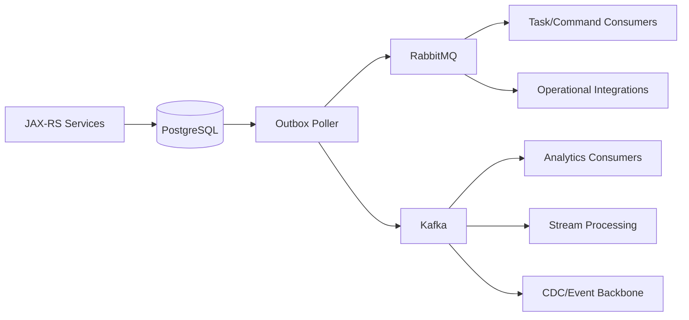

# RabbitMQ vs Kafka Decision Framework

## 1. Core idea

RabbitMQ and Kafka are not interchangeable just because both move messages.

RabbitMQ is primarily a broker and routing system for queues, work distribution, command delivery, pub/sub distribution, acknowledgements, retry, DLQ, and backpressure through queue state.

Kafka is primarily a distributed append-only log platform for partitioned event streams, retention, replay, high-throughput ingestion, consumer offsets, and stream processing ecosystems.

The wrong question is:

```text
Which one is better?
```

The better question is:

```text
Which failure model and consumption model does this flow need?
```

Use RabbitMQ when the core problem is:

```text
route work to consumers
control acknowledgement per message
retry or dead-letter failed work
fan out event to service-specific queues
coordinate background tasks
model command delivery
```

Use Kafka when the core problem is:

```text
store an event log
replay historical events
consume independently at different offsets
scale throughput by partitioning
run stream processing
feed analytics/data pipelines
retain events for days/months/years
```

Use both when the system has both problems.

---

## 2. Queue vs log

RabbitMQ queue mental model:

```text
message waits in queue
consumer receives delivery
consumer processes delivery
consumer ack removes message from queue
nack/reject can requeue or dead-letter
queue depth represents backlog
```

Kafka log mental model:

```text
event is appended to partition
event remains until retention/compaction policy removes it
consumer reads from offset
consumer commits offset progress
many consumers can read same event independently
replay means resetting or choosing offset
```

This distinction drives almost every architecture decision.

RabbitMQ is naturally good at:

```text
task distribution
command queues
retry queues
DLQ workflows
per-subscriber backlog
routing-key based delivery
consumer ack semantics
```

Kafka is naturally good at:

```text
event history
consumer replay
stream processing
high-throughput ingestion
partitioned scaling
analytics integration
CDC/event backbone
```

Do not force a queue to become a long-term log.

Do not force a log to become a precise task dispatcher unless you accept the trade-offs.

---

## 3. Routing vs partitioning

RabbitMQ routing:

```text
producer publishes to exchange
exchange routes based on routing key/header/binding
queue receives messages that match bindings
consumer consumes from queue
```

Kafka partitioning:

```text
producer publishes to topic
event is assigned to partition based on key or partitioner
consumer group members share partitions
ordering is per partition
parallelism is bounded by partition count
```

RabbitMQ asks:

```text
Which queue should receive this message?
Which service owns that queue?
What routing key expresses intent?
What happens when message is unroutable?
```

Kafka asks:

```text
Which topic should store this event?
What key determines partition/order?
What retention applies?
Which consumer groups read it?
What offset should each consumer use?
```

Architecture smell:

```text
RabbitMQ topology has thousands of ad-hoc routing keys nobody owns.
Kafka topic is used as a work queue where consumers fight over task acknowledgement manually.
```

---

## 4. Work distribution vs event streaming

RabbitMQ is strong for work distribution.

Example:

```text
pricing.requested -> pricing.work.queue
approval.requested -> approval.work.queue
notification.requested -> notification.worker.queue
fallout.created -> fallout.worker.queue
```

Properties:

```text
message is work to be completed
one worker usually completes one task
ack means task accepted as done
nack/retry means task failed temporarily
DLQ means task needs investigation
queue depth is operational backlog
```

Kafka is strong for event streaming.

Example:

```text
quote-events topic
order-events topic
catalog-change-events topic
billing-events topic
```

Properties:

```text
event is fact that happened
many consumer groups can read independently
consumer offset tracks progress
retention allows replay
stream processors derive views
partition key controls order
```

If the message is a unit of work, RabbitMQ is often a natural fit.

If the message is an event history to be replayed, Kafka is often a natural fit.

---

## 5. Decision matrix

| Concern | RabbitMQ fit | Kafka fit |
|---|---|---|
| Command delivery | Strong | Possible, but less natural |
| Background task queue | Strong | Possible with careful consumer model |
| Retry/DLQ per task | Strong | Requires conventions and separate topics |
| Complex routing | Strong via exchange/bindings | Usually topic/partition design |
| Long replay | Limited unless RabbitMQ Stream used | Strong |
| Retention by time/size | Queue-specific but not primary classic use | Core model |
| Consumer offsets | RabbitMQ Stream has offsets; queues use ack/remove | Core model |
| Per-message acknowledgement | Core queue model | Offset-based progress model |
| High-throughput event ingestion | Possible, especially streams, but not always default | Strong |
| Stream processing ecosystem | Limited compared to Kafka ecosystem | Strong |
| Operational simplicity for task queues | Often simpler | Can be heavier |
| Per-subscriber backlog isolation | Strong with per-subscriber queues | Strong with consumer groups but different semantics |
| Reprocessing old business events | Manual/replay tooling needed | Natural through offsets/retention |
| Routing by wildcard/topic key | Native topic exchange | Usually topic naming/keying strategy |

A matrix does not decide for you.

It exposes which trade-off you are accepting.

---

## 6. Delivery semantics comparison

RabbitMQ queue semantics:

```text
publisher confirm tells publisher broker accepted publish
consumer ack tells broker delivery can be removed
nack/reject controls requeue/dead-letter behavior
at-least-once requires manual ack and idempotent consumer
```

Kafka semantics:

```text
producer acks tell publisher broker replicated/accepted record based on configuration
consumer offset commit tracks progress
redelivery/reprocessing occurs when offset is not advanced or is reset
exactly-once support exists for specific Kafka transactional/stream processing cases, but business-side effects still need idempotency
```

For enterprise Java/JAX-RS systems, the shared truth is:

```text
external side effects still need idempotency
PostgreSQL state transitions still need constraints
replay/redelivery still needs compatibility
```

Do not use broker semantics as a replacement for business correctness.

---

## 7. Replay and retention

Ask this early:

```text
Will we need to replay this data later?
```

If no:

```text
RabbitMQ queue may be enough.
```

If yes, ask:

```text
Replay for how long?
Replay by whom?
Replay from what point?
Replay into old or new schema?
Replay with side effects disabled or enabled?
Replay into cache, DB, external system, or analytics?
```

Kafka is usually the stronger default when replay is a first-class requirement.

RabbitMQ classic/quorum queues are not designed as long-term replay logs.

RabbitMQ Stream can support stream-style retention and replay, but it is a different RabbitMQ model that must be reviewed explicitly.

Decision rule:

```text
If replay is operational exception -> RabbitMQ with DLQ/replay tooling may be enough.
If replay is product/platform requirement -> Kafka or RabbitMQ Stream should be evaluated.
If replay feeds analytics/data platform -> Kafka is usually the more natural backbone.
```

---

## 8. Ordering comparison

RabbitMQ ordering:

```text
single queue + single consumer can preserve strong practical ordering
multiple consumers increase throughput but weaken observed order
redelivery/requeue/retry can disturb order
priority queue changes order
single active consumer can preserve order with lower parallelism
```

Kafka ordering:

```text
ordering is guaranteed within a partition
partition key controls per-key order
multiple partitions increase throughput but global order is not guaranteed
consumer group assignment affects parallelism
```

Decision rule:

```text
Need per-aggregate order for commands? RabbitMQ single active consumer or partitioned queue strategy may fit.
Need per-aggregate event order with replay? Kafka partition key or RabbitMQ Stream super stream may fit.
Need global order? Challenge the requirement; it is expensive.
```

For CPQ/order management, per-aggregate order usually matters more than global order.

Examples:

```text
all events for quote Q-123 should preserve order
all commands for order O-456 should not race invalid state transitions
pricing jobs for different quotes can run concurrently
```

---

## 9. Backpressure comparison

RabbitMQ backpressure appears as:

```text
queue depth growing
unacked messages growing
consumer utilisation dropping
connection blocked due to resource alarm
publisher confirms slowing down
DLQ/retry queues growing
```

Kafka backpressure appears as:

```text
consumer lag growing
producer latency increasing
broker disk/network pressure
partition hot spots
consumer rebalance instability
```

Operational question:

```text
Does the team know how to observe the backlog primitive?
```

RabbitMQ backlog primitive:

```text
queue depth / ready / unacked
```

Kafka backlog primitive:

```text
consumer lag by topic/partition/group
```

If nobody owns these dashboards, either technology will fail in production.

---

## 10. Consumer model comparison

RabbitMQ consumer:

```text
broker pushes messages to consumer
prefetch limits unacked deliveries
consumer ack removes message
consumer nack/reject can requeue/dead-letter
consumer cancellation matters
```

Kafka consumer:

```text
consumer polls records
consumer group assignment controls partitions
consumer offset commit controls progress
rebalance changes partition ownership
consumer lag tracks progress
```

RabbitMQ failure question:

```text
Did the consumer ack, nack, reject, requeue, or crash?
```

Kafka failure question:

```text
Did the consumer commit offset before or after side effect?
```

Both require idempotency.

But the debugging path is different.

---

## 11. Throughput and latency reasoning

Do not decide from benchmark folklore.

Ask:

```text
message size distribution?
publish rate?
consume rate?
fanout count?
persistent or transient?
replication factor?
confirm/ack requirements?
consumer processing time?
network distance?
retention period?
replay requirement?
ordering key cardinality?
```

RabbitMQ can be very fast for task queues and routing-oriented messaging, but performance depends heavily on:

```text
queue type
message persistence
publisher confirm strategy
prefetch
consumer concurrency
message size
queue count
binding count
routing topology
memory/disk pressure
```

Kafka can be very strong for high-throughput append/read workloads, but performance depends heavily on:

```text
partition count
replication factor
acks configuration
batching
compression
message size
consumer group count
retention
disk throughput
network throughput
```

The right answer is load testing with your workload shape.

---

## 12. Schema governance comparison

RabbitMQ does not impose schema governance.

Kafka also does not inherently force schema governance, but Kafka deployments often use schema registries and event platform practices.

In both cases, you need:

```text
message type
schema version
content type
compatibility rules
contract tests
deprecation policy
consumer ownership
replay compatibility
PII classification
```

RabbitMQ-specific schema concern:

```text
message may sit in DLQ/retry queue and be replayed after consumer schema changed
```

Kafka-specific schema concern:

```text
old retained events may be consumed months later by new consumers
```

The more replay you support, the more serious schema compatibility becomes.

---

## 13. Operational complexity

RabbitMQ operational concerns:

```text
queue depth
unacked messages
consumer utilisation
DLQ/retry topology
flow control
memory alarm
disk alarm
queue leader/quorum health
connection/channel count
vhost/permission topology
```

Kafka operational concerns:

```text
broker disk
replication health
ISR/shrinking replicas
controller health
partition count
consumer lag
rebalance behavior
retention/compaction
schema registry if used
connect/streams ecosystem if used
```

The simpler technology is the one your team can operate well.

Not the one with fewer moving parts on a marketing slide.

---

## 14. Hybrid architecture

Many enterprise systems use both.

Example:



A clean split:

```text
RabbitMQ handles commands, jobs, operational task distribution, retry/DLQ, service-specific queues.
Kafka handles canonical event streams, CDC, replayable history, analytics, stream processing.
```

A messy split:

```text
some events go to RabbitMQ
some events go to Kafka
same consumer logic exists twice
no one knows which stream is source of truth
replay behavior differs silently
contract versioning differs silently
```

Hybrid architecture needs explicit routing policy.

---

## 15. CPQ/order management examples

RabbitMQ-friendly examples:

```text
run pricing calculation job
send quote approval task
dispatch notification task
process fallout queue
call downstream integration with retry/DLQ
route command to fulfilment worker
isolate slow subscriber using per-subscriber queue
```

Kafka-friendly examples:

```text
publish immutable quote lifecycle events
publish order status event log
feed reporting/analytics platform
stream catalog changes to many consumers
support event replay for rebuilding read models
capture CDC from PostgreSQL for downstream consumers
```

Ambiguous examples requiring review:

```text
quote event used both for task trigger and analytics fact
order event used for both state transition and replayable history
pricing result used as both command response and domain event
integration status used as both operational retry signal and audit record
```

When a message has two jobs, consider splitting it into two messages.

```text
command/task message: do this work
fact/event message: this happened
```

---

## 16. When to choose RabbitMQ

Choose RabbitMQ when the flow needs most of these:

```text
message represents work to be completed
one consumer should process each task
routing key / exchange topology matters
retry and DLQ are central to operation
per-message ack/nack/reject matters
unroutable message detection matters
complex fanout to service-specific queues matters
latency matters more than long retention
manual replay from DLQ is exceptional, not normal
operations team is ready for queue-depth based monitoring
```

Examples:

```text
background quote recalculation
order decomposition task queue
notification dispatch
integration retry queue
fallout task handling
approval task creation
cache invalidation fanout
```

---

## 17. When to choose Kafka

Choose Kafka when the flow needs most of these:

```text
message represents a durable fact/event history
events must be replayable by many consumers
retention is days/months/years
consumer groups progress independently
throughput is very high
partitioned ordering is acceptable
stream processing is required
analytics/data lake integration is required
CDC/event backbone is required
schema governance and evolution are platform-level concerns
```

Examples:

```text
order lifecycle event stream
quote lifecycle event stream
catalog change stream
customer interaction event stream
billing event pipeline
CDC from PostgreSQL to downstream consumers
read model rebuild pipeline
```

---

## 18. When to choose RabbitMQ Stream

RabbitMQ Stream can be a middle option when:

```text
RabbitMQ is already the broker platform
stream retention/replay is needed
Kafka platform is not available or not justified
consumer offset/replay semantics are needed inside RabbitMQ ecosystem
workload fits RabbitMQ Stream operational model
```

But review carefully:

```text
Is the Stream plugin/protocol enabled?
Does the team know how to monitor stream offsets and retention?
Is super stream/partitioning required?
Is Kafka already the enterprise event backbone?
Will this create a second event backbone?
```

RabbitMQ Stream is not simply a queue with a different flag.

It changes the consumption model.

---

## 19. When Redis Streams may fit

Redis Streams may fit when:

```text
flow is tightly coupled to Redis-centric state
retention is short and bounded
consumer group management is understood
pending entries are monitored
Redis operational ownership is strong
message durability requirement matches Redis deployment guarantees
```

Redis Streams is risky when:

```text
team expects RabbitMQ DLQ semantics
team expects Kafka replay ecosystem
business audit depends only on Redis retention
consumer lag/pending entries are not monitored
Redis is already heavily used for cache and memory pressure is high
```

Redis Streams should be an explicit architecture choice, not an accidental side effect of Redis availability.

---

## 20. Anti-patterns

### Anti-pattern: Kafka for every async thing

Risk:

```text
simple task queues become offset-management workflows
retry/DLQ become ad-hoc topics
operational debugging becomes harder than necessary
```

Better:

```text
use RabbitMQ for operational tasks and commands
use Kafka for durable event logs and replayable streams
```

### Anti-pattern: RabbitMQ as analytics event lake

Risk:

```text
queues are drained by consumers
replay is manual and limited
retention is not a first-class event history model for classic/quorum queues
```

Better:

```text
use Kafka or explicitly evaluate RabbitMQ Stream
```

### Anti-pattern: same payload for command and event

Risk:

```text
producer intent is ambiguous
consumer compatibility is unclear
replay causes side effects
```

Better:

```text
separate command contract from fact/event contract
```

### Anti-pattern: decision based only on throughput

Risk:

```text
chooses high-throughput platform that does not match delivery/retry/debugging needs
```

Better:

```text
decide from consumption model, failure model, replay, ordering, and operations
```

---

## 21. Architecture decision flow

Use this flow during design review.

```text
1. Is this message a command/task or a fact/event?
2. Does one consumer complete work, or many consumers observe history?
3. Is replay a first-class requirement?
4. Is long retention required?
5. Is routing topology complex?
6. Is per-message ack/nack/DLQ central?
7. Is consumer offset replay central?
8. Is per-aggregate ordering required?
9. Is high throughput more important than routing flexibility?
10. Which team operates the platform and dashboard?
11. Which platform already exists and is approved internally?
12. What is the failure mode when consumer crashes after side effect?
13. What is the failure mode when producer is uncertain if publish succeeded?
14. How will schema evolve?
15. How will security/privacy be enforced?
```

Then decide:

```text
RabbitMQ queue
RabbitMQ stream
Kafka topic
Redis stream
HTTP/gRPC
PostgreSQL outbox/inbox without broker
hybrid design
```

---

## 22. ADR template for RabbitMQ vs Kafka decision

Use this structure:

```mdx
# ADR: Messaging Platform for <Flow Name>

## Context
- Business flow:
- Producer service:
- Consumer services:
- Message type: command / event / task / integration / audit
- Expected volume:
- Expected latency:
- Retention requirement:
- Replay requirement:
- Ordering requirement:
- Failure handling requirement:

## Options considered
- RabbitMQ queue
- RabbitMQ Stream
- Kafka topic
- Redis Stream
- HTTP/gRPC

## Decision
Chosen option:

## Rationale
Why this model matches the consumption/failure/replay model:

## Consequences
- Operational dashboard:
- Retry/DLQ or replay strategy:
- Schema governance:
- Security/privacy controls:
- Migration strategy:
- Failure modes accepted:

## Internal verification
- Platform availability:
- Team ownership:
- Existing conventions:
- SRE review:
- Backend review:
- Integration review:
```

---

## 23. PR review checklist

For RabbitMQ PR:

```text
Is the message a command/task/event?
Is exchange/queue/routing key documented?
Is unroutable message handled?
Is publisher confirm used where needed?
Is consumer manual ack used correctly?
Is idempotency implemented?
Is retry/DLQ topology defined?
Is prefetch appropriate?
Is ordering requirement documented?
Are metrics/logs/traces present?
Is replay/manual repair path defined?
```

For Kafka PR:

```text
Is topic ownership documented?
Is partition key chosen correctly?
Is retention/compaction policy defined?
Is consumer group ownership clear?
Is offset commit timing safe?
Is idempotency implemented?
Is schema compatibility tested?
Is replay behavior safe?
Is consumer lag monitored?
Are PII/security controls reviewed?
```

For hybrid PR:

```text
Is source of truth clear?
Can events diverge between RabbitMQ and Kafka?
Is dual-publish handled through outbox?
Is ordering across platforms required?
Is replay from Kafka allowed to trigger RabbitMQ commands?
Is there loop prevention?
Is observability correlated across both systems?
```

---

## 24. Internal verification checklist

Verify in the actual CSG/team environment:

```text
Which platform is officially supported for RabbitMQ?
Which platform is officially supported for Kafka?
Which flows use RabbitMQ today?
Which flows use Kafka today?
Which flows use Redis Streams/PubSub today?
Is there a messaging decision guideline?
Is there a schema registry or AsyncAPI process?
Is there an approved outbox publisher pattern?
Is there a standard RabbitMQ retry/DLQ topology?
Is there a standard Kafka retry/DLQ/replay convention?
Who owns broker operations?
Who owns dashboards and alerts?
What are current platform quotas/limits?
What incidents have happened around queue growth or consumer lag?
What are compliance restrictions for retained messages?
What is the approved replay process?
```

Do not infer internal platform policy from generic RabbitMQ/Kafka documentation.

---

## 25. Decision summary

Use this as a compact rule of thumb:

```text
RabbitMQ:
  route work
  distribute tasks
  manage ack/retry/DLQ
  isolate subscribers with queues
  optimize operational command processing

Kafka:
  store event history
  replay streams
  scale by partitions
  feed analytics/stream processing
  support long retention and independent consumer offsets

Redis:
  cache
  short-lived coordination
  bounded dedup/rate limit
  Redis Streams only when explicitly reviewed

PostgreSQL:
  durable business truth
  state transitions
  outbox/inbox
  audit and repair source
```

The most senior answer is often not choosing one platform.

It is assigning the right responsibility to each platform and making the failure modes explicit.

---

## 26. Senior engineer takeaway

RabbitMQ vs Kafka is a system design question, not a tool preference question.

A strong decision explains:

```text
why this message exists
who owns it
how it is routed or partitioned
how it is acknowledged or offset-committed
how it is retried or replayed
how duplicates are handled
how order is preserved or relaxed
how schema evolves
how privacy is protected
how operators detect failure
how engineers repair bad data
```

If the design cannot answer those questions, the platform choice is premature.

Choose the broker after choosing the failure model.

---

## References

- RabbitMQ Documentation: AMQP Concepts, Exchanges, Queues, Consumer Acknowledgements, Publisher Confirms, Dead Letter Exchanges, Streams.
- Apache Kafka Documentation: topics, partitions, consumer groups, offsets, retention.
- Redis Documentation: Pub/Sub, Streams, distributed locks.
- OpenTelemetry Documentation: messaging telemetry and context propagation.
