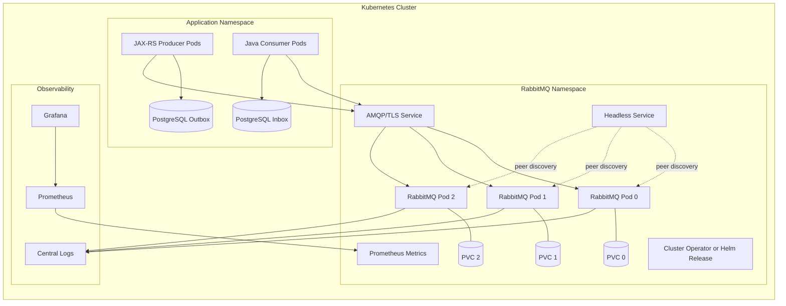

# RabbitMQ in Kubernetes

## 1. Core idea

RabbitMQ in Kubernetes is not just "run a container".

RabbitMQ is a stateful distributed broker. Kubernetes is a dynamic orchestration platform. The tension is obvious:

```text
RabbitMQ wants stable identity, durable storage, predictable networking, careful upgrade sequencing, and controlled failure domains.
Kubernetes wants replaceable pods, declarative reconciliation, rolling changes, rescheduling, and abstraction over nodes.
```

A production RabbitMQ deployment in Kubernetes must reconcile those two worlds.

The senior-engineer question is not:

```text
Can RabbitMQ run in Kubernetes?
```

It can.

The real questions are:

```text
Who owns the broker lifecycle?
What is the storage failure model?
What happens when a pod moves?
What happens during node drain?
What happens during rolling upgrade?
What happens when quorum queue leaders are concentrated?
What happens when PVC performance is not enough?
What happens when applications reconnect all at once?
What happens when topology changes drift from code?
```

RabbitMQ in Kubernetes is a platform decision, not just an application dependency.

---

## 2. Where RabbitMQ fits in a Kubernetes-based enterprise platform

In a Java/JAX-RS microservice platform, RabbitMQ usually sits between:

```text
JAX-RS API service
  -> command/event/task publisher
  -> RabbitMQ broker
  -> consumer service / worker / integration adapter
  -> PostgreSQL / Redis / downstream system
```

In Kubernetes, those components become:

```text
Deployment: Java API producer pods
Deployment: Java consumer/worker pods
StatefulSet/operator-managed RabbitMQ pods
Service/headless service for broker discovery
PVC/PV for durable broker state
Secret for credentials/certificates
ConfigMap for broker/application config
NetworkPolicy for allowed connectivity
Prometheus/Grafana for observability
```

The dangerous assumption is that RabbitMQ behaves like a stateless service.

It does not.

If RabbitMQ loses broker state, queue state, stream data, quorum queue member data, or metadata at the wrong time, the impact can be much larger than a single pod restart.

---

## 3. Self-managed RabbitMQ in Kubernetes vs managed RabbitMQ

Before going deep, decide whether RabbitMQ should run inside Kubernetes at all.

### 3.1 Self-managed in Kubernetes

Use this when:

```text
platform team has RabbitMQ operational expertise
storage class is proven for broker workloads
cluster upgrades are controlled
RabbitMQ operator/Helm lifecycle is understood
broker config must stay close to workloads
network path from apps to broker should stay inside cluster
on-prem or hybrid platform requires in-cluster deployment
```

Risks:

```text
Kubernetes node maintenance can affect broker quorum
PVC performance may be insufficient
operator reconciliation can surprise manual changes
cluster upgrades interact with broker upgrades
storage/node failure handling is now your responsibility
```

### 3.2 Managed RabbitMQ outside Kubernetes

Use this when:

```text
broker operations should be delegated
backup/patching/monitoring/HA are handled by provider
apps can connect securely over private network
platform team wants to reduce operational burden
```

Risks:

```text
less direct control over broker internals
provider-specific limits
maintenance windows
network dependency between Kubernetes and broker
possible mismatch with internal topology-as-code practices
```

### 3.3 Architecture decision rule

Do not decide based on convenience of deployment.

Decide based on:

```text
operational maturity
failure tolerance
storage requirements
security boundary
latency requirement
upgrade control
observability ownership
incident response ownership
```

---

## 4. StatefulSet mental model

RabbitMQ cluster nodes need stable identity.

A RabbitMQ pod should not be treated like an anonymous stateless replica.

A typical Kubernetes StatefulSet gives each pod:

```text
stable ordinal name
stable network identity
stable PVC association
ordered startup/shutdown behavior
```

Example mental model:

```text
rabbitmq-server-0 -> PVC rabbitmq-data-rabbitmq-server-0
rabbitmq-server-1 -> PVC rabbitmq-data-rabbitmq-server-1
rabbitmq-server-2 -> PVC rabbitmq-data-rabbitmq-server-2
```

This matters because RabbitMQ node identity and persisted data are linked.

Wrong model:

```text
Any RabbitMQ pod can replace any RabbitMQ pod.
```

Correct model:

```text
A RabbitMQ node has identity and state.
A recreated pod should return with the correct identity and persistent data.
```

If the deployment uses a plain Deployment without stable identity and persistent state, treat that as a major architecture smell for production broker workloads.

---

## 5. PersistentVolume and storage class

RabbitMQ storage is not just "some disk".

It affects:

```text
message persistence
quorum queue replication catch-up
stream retention
broker restart time
queue recovery
publisher confirm latency
disk alarm risk
throughput under load
```

### 5.1 Storage questions

Ask:

```text
What StorageClass backs RabbitMQ PVCs?
What IOPS and throughput are guaranteed?
Is storage zonal or regional?
What happens when a Kubernetes node is lost?
Can PVC reattach quickly?
How does storage behave during node drain?
What are latency percentiles under sustained broker load?
Is filesystem tuning required?
How are snapshots/backups handled?
```

### 5.2 Storage failure patterns

Common production patterns:

```text
broker starts but disk latency is high
publisher confirms become slow
queue depth grows because consumers cannot drain fast enough
quorum queue followers fall behind
stream retention consumes disk unexpectedly
disk alarm blocks publishing
PVC cannot reattach after node failure
node replacement causes long recovery time
```

### 5.3 Storage decision smell

A warning sign:

```text
RabbitMQ storage class was chosen because it is the default cluster storage class.
```

For RabbitMQ, storage should be chosen based on broker workload, not platform default.

---

## 6. RabbitMQ Cluster Operator

The RabbitMQ Cluster Kubernetes Operator is commonly used to manage RabbitMQ clusters in Kubernetes.

Operator-managed deployment usually creates and reconciles resources such as:

```text
RabbitmqCluster custom resource
StatefulSet
Services
Secrets
ConfigMaps
PVCs
Pods
RBAC resources
```

The operator improves lifecycle management, but it does not remove the need to understand RabbitMQ.

Operator is not magic.

It helps with:

```text
declarative cluster creation
stable resource generation
default service setup
credential secret generation
some operational lifecycle handling
```

It does not automatically solve:

```text
bad storage
bad topology
bad queue type selection
bad retry design
bad consumer behavior
bad observability
bad capacity planning
bad security model
```

### 6.1 Operator review questions

Check:

```text
Which operator version is installed?
Which RabbitMQ version is deployed?
Who owns operator upgrades?
How are RabbitmqCluster manifests versioned?
What fields are customized?
What defaults are accepted blindly?
What happens during reconciliation?
Are manual UI changes overwritten or drifted?
```

### 6.2 Operator anti-pattern

Dangerous anti-pattern:

```text
Use operator, then manually change production broker settings in Management UI.
```

If the operator is source of truth, manual change creates drift.
If Management UI is source of truth, GitOps is weak.

Pick a source of truth.

---

## 7. Helm chart awareness

Some environments use Helm instead of the RabbitMQ Cluster Operator.

Helm is packaging and templating. It is not the same as an operator.

A Helm release usually manages:

```text
StatefulSet
Service
ConfigMap
Secret
PVC templates
NetworkPolicy
PodDisruptionBudget
ServiceAccount
```

The main risks are:

```text
values.yaml becomes undocumented platform contract
chart upgrade changes defaults
manual changes drift from Helm state
rollback does not necessarily roll back broker data
PVC/data schema may not be reversible
```

### 7.1 Helm review questions

Check:

```text
Which chart is used?
Which chart version?
Which RabbitMQ image version?
Where is values.yaml stored?
Are values promoted across environments?
Are secrets externalized?
Are policies/users/vhosts declared as code?
What is the upgrade/rollback procedure?
```

---

## 8. Peer discovery and cluster formation

RabbitMQ nodes must discover each other to form a cluster.

In Kubernetes, peer discovery usually depends on Kubernetes DNS/API and stable node names.

Failure modes include:

```text
pods start but do not form cluster
pods form separate clusters
DNS issue prevents discovery
RBAC issue prevents Kubernetes API access
network policy blocks inter-node communication
node identity changes unexpectedly
stale PVC causes node identity confusion
```

### 8.1 Formation checklist

Verify:

```text
headless service exists if required
DNS names resolve between pods
Erlang distribution ports are reachable
cluster formation mechanism is documented
pods have stable identity
PVC data matches node identity
network policies allow inter-node traffic
```

### 8.2 Split cluster risk

A dangerous state is not simply "node down".

A worse state is:

```text
multiple nodes believe different cluster realities
applications connect to different broker views
metadata/topology changes are inconsistent
quorum queues cannot elect/progress safely
```

Senior rule:

```text
Cluster formation and recovery should be runbooked before production.
```

---

## 9. Node identity

RabbitMQ node identity matters.

It can include:

```text
Erlang node name
pod name
hostname
persistent data directory
cluster membership metadata
```

If identity changes unexpectedly, RabbitMQ may treat the pod as a different node.

This can cause:

```text
cluster join failure
orphaned data
node unable to rejoin
quorum member confusion
manual cleanup requirement
long recovery window
```

### 9.1 Internal verification

Ask platform/SRE:

```text
How is RabbitMQ node name derived?
Is longname or shortname used?
How does pod DNS map to node identity?
What happens when pod is rescheduled?
What happens when PVC is retained but pod identity changes?
What is the node replacement procedure?
```

---

## 10. Pod anti-affinity

RabbitMQ replicas should not all land on the same Kubernetes worker node.

If three RabbitMQ pods run on one worker node, a single node failure can take down the entire broker cluster.

Use anti-affinity or topology spread constraints to distribute pods across:

```text
nodes
zones
failure domains
racks, if on-prem labels exist
```

### 10.1 Anti-affinity failure mode

Without pod anti-affinity:

```text
worker node fails
all broker pods disappear
all queues unavailable
publishers fail or block
consumers disconnect
incident becomes total broker outage
```

With anti-affinity but insufficient nodes:

```text
pending pods
reduced quorum
operator cannot schedule replacement
cluster may remain degraded
```

Therefore anti-affinity must be paired with capacity planning.

---

## 11. PodDisruptionBudget

A PodDisruptionBudget controls voluntary disruptions such as node drain.

For RabbitMQ, it helps prevent too many pods being evicted at once.

But PDB is not absolute protection.

It does not prevent:

```text
node crash
kernel panic
cloud VM loss
forced deletion
misconfigured operator action
manual emergency intervention
```

### 11.1 PDB review

Check:

```text
Does a PDB exist?
What is minAvailable or maxUnavailable?
Does it match quorum requirements?
Does cluster autoscaler respect it?
Do platform maintenance procedures respect it?
What happens during node upgrade?
```

Senior rule:

```text
PDB is a guardrail, not a high-availability strategy.
```

---

## 12. Resource requests and limits

RabbitMQ is sensitive to memory, CPU, and disk.

Kubernetes resource requests affect scheduling.
Limits affect runtime behavior.

Bad sizing can cause:

```text
CPU throttling
memory pressure
OOMKill
broker alarms
slow publisher confirms
slow deliveries
consumer backlog
quorum replication lag
stream retention pressure
```

### 12.1 CPU

CPU affects:

```text
routing
protocol handling
connection/channel management
confirm handling
queue process work
TLS overhead
metrics exporting
```

### 12.2 Memory

Memory affects:

```text
queue state
connection/channel state
unacked deliveries
internal buffers
plugins
management UI
Prometheus endpoint
```

RabbitMQ has its own memory watermark/alarm logic. Kubernetes has its own memory enforcement.

If the broker hits Kubernetes memory limit first, the pod can be killed before RabbitMQ has a chance to protect itself cleanly.

### 12.3 Resource sizing smell

Smell:

```text
RabbitMQ has arbitrary low limits copied from another service chart.
```

RabbitMQ sizing should come from measured workload:

```text
message rate
message size
queue count
connection/channel count
unacked count
retention
replication factor
failure recovery target
```

---

## 13. Readiness probe

Readiness answers:

```text
Should Kubernetes route traffic to this pod?
```

For RabbitMQ, readiness must be meaningful.

A pod can be "process running" but not ready for production traffic because:

```text
node has not joined cluster
alarms are active
listeners are unavailable
queue leaders are not settled
startup recovery is ongoing
```

### 13.1 Readiness review

Check:

```text
What endpoint/command is used for readiness?
Does it validate broker app health?
Does it account for cluster readiness?
Does it become false during serious broker pressure?
Does the load balancer respect readiness?
```

Readiness should prevent traffic from being sent to a broker pod that is not safe to serve.

---

## 14. Liveness probe

Liveness answers:

```text
Should Kubernetes restart this container?
```

This is dangerous if too aggressive.

A bad liveness probe can create an outage by killing RabbitMQ during:

```text
slow startup
disk recovery
high load
cluster join
quorum queue recovery
long GC or scheduler delay
```

### 14.1 Liveness anti-pattern

Bad:

```text
liveness probe times out under load
Kubernetes kills RabbitMQ pod
pod restart increases cluster pressure
other pods get more load
more probes fail
cascading restart
```

Senior rule:

```text
Liveness should detect truly stuck process, not transient broker pressure.
```

---

## 15. Startup probe

A startup probe can protect slow-starting RabbitMQ pods from premature liveness failure.

Use it when:

```text
broker startup may take time
queue recovery is heavy
PVC attach is slow
plugins initialize slowly
cluster join can be delayed
```

Without startup probe, liveness may kill the pod before it can recover.

---

## 16. Kubernetes Services

RabbitMQ deployments often expose multiple services:

```text
client-facing AMQP service
headless service for peer discovery
management UI service
metrics service
stream protocol service, if RabbitMQ Stream is used
```

### 16.1 Service review

Check:

```text
Which service do Java clients use?
Is it stable across broker pod replacement?
Does it load balance across nodes?
Does it respect readiness?
Is Management UI exposed only internally?
Is metrics endpoint scraped securely?
Are stream ports exposed only if needed?
```

### 16.2 Load balancer nuance

AMQP connections are long-lived.

A load balancer does not distribute every message. It distributes connection establishment.

If a few app pods open long-lived connections, distribution can be uneven.

This matters for:

```text
queue leader locality
network hops
connection concentration
node pressure
failover behavior
```

---

## 17. Headless Service

A headless service is often used for stable DNS records for StatefulSet pods.

Mental model:

```text
rabbitmq-0.rabbitmq-nodes.namespace.svc.cluster.local
rabbitmq-1.rabbitmq-nodes.namespace.svc.cluster.local
rabbitmq-2.rabbitmq-nodes.namespace.svc.cluster.local
```

This helps cluster formation and node identity.

Do not remove or change headless service settings without understanding cluster formation.

---

## 18. NetworkPolicy

NetworkPolicy should express intended connectivity:

```text
producer pods -> RabbitMQ AMQP/TLS port
consumer pods -> RabbitMQ AMQP/TLS port
Prometheus -> metrics port
admins/platform -> Management UI
RabbitMQ pods -> RabbitMQ pods for clustering
```

Common failure mode:

```text
NetworkPolicy allows application traffic but blocks inter-node RabbitMQ traffic.
```

Another failure mode:

```text
Management UI is exposed too widely.
```

### 18.1 Internal verification

Check:

```text
Which namespaces can connect to RabbitMQ?
Which ports are open?
Are inter-node ports allowed?
Is Management UI restricted?
Are metrics endpoints restricted?
Are network policies environment-specific?
```

---

## 19. Secrets

RabbitMQ deployments need secrets for:

```text
user credentials
Erlang cookie
TLS private keys
TLS certificates
OAuth/LDAP credentials, if used
management credentials
client credentials
```

### 19.1 Secret risks

Risks:

```text
secret mounted into too many pods
secret rotation breaks clients
Erlang cookie mismatch breaks cluster communication
TLS cert expires
old credentials remain valid
Management UI credential reused by applications
```

### 19.2 Secret rotation

Rotation must be planned for:

```text
broker credential update
application secret update
rolling restart behavior
connection recovery behavior
dual credential window, if needed
rollback procedure
monitoring for auth failures
```

---

## 20. ConfigMap

ConfigMap may hold:

```text
rabbitmq.conf
enabled_plugins
advanced.config
definitions file
application connection settings
```

But ConfigMap changes are not always safely applied by magic.

Some require:

```text
broker restart
rolling restart
operator reconciliation
manual validation
compatibility check
```

### 20.1 Config drift

If runtime config is changed via Management UI but declarative config remains unchanged, the next reconciliation or restart can surprise the team.

Senior rule:

```text
Broker config should have a source of truth.
```

---

## 21. Topology definitions in Kubernetes

RabbitMQ topology includes:

```text
vhosts
users
permissions
exchanges
queues
bindings
policies
operator policies
runtime parameters
federation/shovel parameters
```

In Kubernetes/GitOps environments, these may be defined through:

```text
operator CRDs
Helm values
definitions JSON
Terraform
Ansible
custom deployment jobs
application startup declarations
manual Management UI changes
```

The worst case is mixed ownership:

```text
some queues declared by app startup
some by Helm
some by Management UI
some by platform scripts
some by operator CRs
```

This creates drift and incident ambiguity.

### 21.1 Review questions

Ask:

```text
Where is topology defined?
Who owns it?
How is it promoted across environments?
How are breaking changes reviewed?
Can topology be recreated from code?
Does application startup declare broker topology?
If yes, is that allowed in production?
```

---

## 22. RabbitMQ policies and operator policies

Policies can control queue behavior without changing application code.

Examples:

```text
queue type
dead-letter exchange
message TTL
max length
overflow behavior
quorum delivery limit
federation
ha legacy settings
```

Operator policies can enforce limits and guardrails.

### 22.1 Policy risk

Policy can change application semantics.

Example:

```text
adding message TTL can expire messages unexpectedly
changing max length can drop or reject publish
changing queue type can affect ordering/performance
changing delivery limit can dead-letter messages earlier
```

Policies must be treated as architecture artifacts.

---

## 23. RabbitMQ version and image strategy

RabbitMQ version matters.

It affects:

```text
queue behavior
quorum queue features
stream features
peer discovery behavior
plugin compatibility
operator compatibility
security patches
management API behavior
metrics names
upgrade path
```

### 23.1 Image review

Check:

```text
Is the image pinned by exact version?
Is it an official image or internal hardened image?
Are plugins included in image or enabled at runtime?
How are CVEs handled?
Who approves upgrades?
Is rollback tested?
```

Avoid:

```text
latest
floating major version
untested image rebuilds
manual plugin install in running container
```

---

## 24. Plugin management

RabbitMQ plugins can enable:

```text
management UI
Prometheus metrics
stream protocol
federation
shovel
delayed message exchange
consistent hash exchange
OAuth2/LDAP auth
```

Plugin changes are not harmless.

They can change:

```text
runtime behavior
resource usage
attack surface
upgrade compatibility
port exposure
operational runbooks
```

### 24.1 Plugin checklist

Check:

```text
Which plugins are enabled?
Why are they enabled?
Are they required in all environments?
Are plugin versions compatible with RabbitMQ version?
Are plugin ports exposed?
Are plugin metrics monitored?
```

---

## 25. Quorum queues in Kubernetes

Quorum queues are often used for stronger data safety.

In Kubernetes, their behavior depends on:

```text
replica placement
node availability
storage reliability
network latency between pods
pod disruption behavior
leader distribution
PVC performance
```

### 25.1 Kubernetes-specific quorum risks

Risk examples:

```text
all quorum replicas scheduled in same zone
node drain removes too many quorum members
PVC attach delay keeps replica unavailable
network partition prevents majority
leader concentration overloads one pod
rolling restart disrupts too many leaders at once
```

### 25.2 Review questions

Ask:

```text
What replication factor is used?
Are quorum members spread across failure domains?
What is minAvailable during maintenance?
How are leaders balanced?
What is expected recovery time after pod/node failure?
Are delivery limits configured?
```

---

## 26. Streams in Kubernetes

RabbitMQ Streams rely on storage and retention.

In Kubernetes, this adds pressure on:

```text
PVC size
disk throughput
retention policy
replica placement
consumer offset storage
backup/restore expectations
```

If streams are used, review:

```text
stream port exposure
stream retention config
super stream partition count
consumer offset strategy
disk usage alerting
replay expectation
stream vs Kafka decision
```

Do not introduce RabbitMQ Stream just because RabbitMQ already exists.

Use it only when the stream model is intentionally selected.

---

## 27. Management UI in Kubernetes

Management UI is useful for:

```text
topology inspection
queue depth investigation
connection/channel inspection
consumer count
message rates
policy inspection
manual emergency actions
```

But it should not become the primary control plane.

Risks:

```text
manual production changes
excessive exposure
credential sharing
no Git history
no review workflow
accidental purge/delete
```

### 27.1 UI access checklist

Check:

```text
Who can access Management UI?
Is it behind VPN/private network?
Is TLS enabled?
Are admin users separated from app users?
Are actions audited?
Are manual changes reconciled into code?
```

---

## 28. Metrics and Prometheus scraping

RabbitMQ in Kubernetes should expose metrics through a controlled path.

Monitor at least:

```text
node health
memory usage
disk usage
alarms
connection count
channel count
queue depth
ready messages
unacked messages
publish/deliver/ack rates
redelivery rates
consumer count
consumer utilization
DLQ size
retry queue size
quorum queue status
stream disk usage
```

### 28.1 Scrape risks

Prometheus scraping can fail because:

```text
service monitor label mismatch
network policy blocks metrics
metrics port not exposed
TLS/auth mismatch
pod not ready
management plugin disabled
high-cardinality labels overload metrics system
```

### 28.2 Senior rule

A RabbitMQ deployment is not production-ready until dashboards and alerts exist for both broker and application-level messaging behavior.

---

## 29. Logging in Kubernetes

RabbitMQ logs should be collected centrally.

Logs are useful for:

```text
cluster formation errors
authentication failures
connection churn
channel exceptions
resource alarms
plugin failures
TLS errors
peer discovery issues
node shutdown/restart
```

But logs alone are not enough.

A queue-depth incident needs metrics.
A duplicate-processing incident needs application logs and inbox/outbox data.
A routing incident needs topology inspection.

### 29.1 Log checklist

Check:

```text
Are RabbitMQ pod logs collected?
Are logs retained long enough for incidents?
Are auth failures detectable?
Are alarm events visible?
Can logs be correlated with app pod logs?
Are sensitive message payloads excluded?
```

---

## 30. Backup and restore

RabbitMQ backup strategy depends on what must be preserved:

```text
definitions/topology
users/permissions/policies
persistent queue data
stream data
quorum queue data
certificates/secrets
operator manifests
```

Do not assume PVC snapshot equals safe application-level recovery.

Questions:

```text
Can topology be recreated from code?
Can message data be restored safely?
What happens to duplicate delivery after restore?
What happens to outbox/inbox consistency?
Can replay cause business duplicate effects?
Are backups encrypted?
Has restore been tested?
```

For many business systems, outbox/inbox plus downstream reconciliation is more important than blindly restoring old broker message data.

---

## 31. Upgrade strategy

RabbitMQ upgrade in Kubernetes includes multiple layers:

```text
RabbitMQ version
Erlang version
container image
operator version
Helm chart version
plugin versions
Kubernetes version
storage driver behavior
client library compatibility
```

### 31.1 Upgrade checklist

Before upgrade:

```text
read release notes
validate plugin compatibility
test in lower environment with production-like topology
check queue type-specific notes
check stream/quorum behavior
test Java client compatibility
verify dashboards/metrics after upgrade
prepare rollback plan
communicate maintenance risk
```

### 31.2 Rollback warning

Rollback is not just redeploying the old image.

If broker metadata or queue storage has changed, downgrade may not be safe.

Treat broker upgrades like database upgrades.

---

## 32. Node drain and maintenance

Kubernetes node maintenance is normal.
RabbitMQ node disruption is not trivial.

During node drain:

```text
pod eviction may start
connections close
clients reconnect
quorum members may go offline
leaders may move or become unavailable
queues may become degraded
PVC may detach/reattach
```

### 32.1 Maintenance runbook

A safe runbook should include:

```text
check cluster health before drain
check quorum queue health
check queue depth and unacked messages
ensure PDB allows safe disruption only
drain one node at a time
wait for cluster to recover
verify applications reconnected
verify no DLQ/retry spike
verify alarms remain clear
```

---

## 33. RabbitMQ and GitOps

In GitOps environments, RabbitMQ should be represented declaratively.

Possible artifacts:

```text
RabbitmqCluster CR
Helm values
NetworkPolicy
ServiceMonitor
Secrets references
ConfigMap
policies
topology definitions
alerts
dashboards
runbooks
```

### 33.1 GitOps failure mode

Bad:

```text
Git says one thing
Management UI says another
operator reconciles a third thing
application startup declares a fourth thing
```

Good:

```text
topology and infrastructure have explicit source of truth
manual emergency changes are backported to Git or reverted
breaking changes go through PR review
alerts/dashboards are versioned
```

---

## 34. Java client impact of broker-in-Kubernetes

From Java/JAX-RS services, broker-in-Kubernetes affects:

```text
connection endpoint
DNS behavior
TLS certificates
credential injection
connection recovery
publisher confirm timeouts
consumer cancellation
rolling broker restart behavior
connection storm during broker restart
readiness of application when broker is unavailable
```

### 34.1 Application readiness

A Java producer service might be HTTP-ready but unable to publish.

Decide intentionally:

```text
Should service be ready if RabbitMQ is unavailable?
Should endpoint return 503 when broker publish path is down?
Can requests be stored in DB/outbox even if broker is down?
Can outbox poller publish later?
```

For command APIs, outbox often allows the HTTP transaction to commit while broker outage is handled asynchronously.

But this must be visible through status and observability.

---

## 35. Topology creation by application startup

Some applications declare exchanges/queues/bindings on startup.

This is convenient for local development.

In production, it can be dangerous.

Risks:

```text
app has configure permission too broad
startup race creates topology incorrectly
multiple services fight over queue arguments
topology changes bypass platform review
queue argument mismatch causes channel exception
rolling deployment partially applies topology
```

### 35.1 Safer pattern

Use separate topology management:

```text
GitOps/operator/definitions manage broker topology
applications have write/read only where possible
topology changes go through PR review
local dev may use auto-declare profile
production disables uncontrolled declaration
```

---

## 36. Kubernetes failure scenarios

### 36.1 RabbitMQ pod restarts

Symptoms:

```text
client connections close
publisher confirm failures/timeouts
consumer deliveries redelivered
queue leaders may move
unacked messages return to queue
```

Debug:

```text
kubectl describe pod
pod logs
RabbitMQ node health
application reconnect logs
queue redelivery rate
DLQ/retry spike
```

### 36.2 Worker node lost

Symptoms:

```text
one or more broker pods unavailable
PVC reattach delay
quorum queue degraded
connection redistribution
possible majority loss if placement is poor
```

Debug:

```text
node status
pod scheduling events
PVC attach events
quorum queue status
application connection errors
```

### 36.3 NetworkPolicy misconfiguration

Symptoms:

```text
applications cannot connect
metrics unavailable
cluster nodes cannot communicate
Management UI inaccessible
TLS handshake appears as timeout
```

Debug:

```text
network policy diff
port connectivity test
DNS resolution test
pod-to-pod traffic check
RabbitMQ logs
```

### 36.4 Storage degraded

Symptoms:

```text
confirm latency increases
disk alarm fires
broker restart slow
quorum queue catch-up slow
stream retention pressure
```

Debug:

```text
PVC metrics
node disk metrics
RabbitMQ disk metrics
publisher confirm latency
queue growth pattern
```

---

## 37. Kubernetes manifest review checklist

Review these resources:

```text
RabbitmqCluster CR or StatefulSet
Service and headless service
PVC and StorageClass
ConfigMap
Secret
NetworkPolicy
PodDisruptionBudget
ServiceMonitor/PodMonitor
PrometheusRule
Ingress/Gateway for Management UI, if any
RBAC
Pod security settings
resource requests/limits
node affinity/anti-affinity/topology spread
```

For each, ask:

```text
What failure does this protect against?
What failure can this create?
Who owns it?
How is it tested?
How is it changed safely?
```

---

## 38. Example architecture diagram



---

## 39. Production readiness checklist

A RabbitMQ Kubernetes deployment is not production-ready until these questions have clear answers.

### 39.1 Broker deployment

```text
RabbitMQ version pinned
operator/chart version pinned
StatefulSet/operator-managed identity verified
PVC and StorageClass reviewed
anti-affinity/topology spread configured
PDB configured
resource requests/limits sized from workload
readiness/liveness/startup probes reviewed
```

### 39.2 Networking/security

```text
AMQP/TLS endpoint defined
Management UI restricted
metrics endpoint restricted
NetworkPolicy allows required flows only
TLS certificates managed and rotated
credentials stored in Secret/external secret manager
Erlang cookie managed securely
```

### 39.3 Reliability

```text
queue type policy documented
quorum replication factor documented
DLX/retry/parking lot topology documented
broker restart behavior tested
node drain tested
client reconnect tested
publisher confirm timeout behavior tested
consumer redelivery behavior tested
```

### 39.4 Observability

```text
dashboard exists
alerts exist
queue depth/unacked/DLQ/retry metrics visible
broker alarms visible
connection/channel count visible
quorum/stream health visible
logs centralized
runbook linked from alerts
```

### 39.5 Governance

```text
topology source of truth defined
manual UI changes policy defined
environment promotion defined
upgrade procedure documented
backup/restore strategy documented
incident ownership defined
```

---

## 40. Internal verification checklist

Use this checklist inside CSG/team context. Do not assume the answers.

### 40.1 Deployment model

```text
Is RabbitMQ self-managed in Kubernetes, cloud-managed, on-prem, or hybrid?
If Kubernetes: operator, Helm, or custom StatefulSet?
Which namespace owns RabbitMQ?
Which team owns broker operations?
Which team owns topology?
```

### 40.2 Version and runtime

```text
RabbitMQ version?
Erlang version?
Container image source?
Enabled plugins?
Operator/chart version?
Upgrade cadence?
```

### 40.3 Storage

```text
StorageClass?
PVC size?
IOPS/throughput guarantee?
Backup/snapshot policy?
Disk alarm thresholds?
Stream retention, if streams are used?
```

### 40.4 HA and scheduling

```text
Replica count?
Node/zone spreading?
PDB?
Quorum queue replication factor?
Leader placement visibility?
Node drain runbook?
```

### 40.5 Networking

```text
AMQP endpoint used by Java clients?
TLS enabled?
Management UI access path?
Metrics scrape path?
NetworkPolicy/security group/firewall rules?
Cross-zone/cross-cluster path?
```

### 40.6 App integration

```text
Do Java producers use publisher confirms?
Do consumers use manual ack?
Do apps handle reconnect?
Do pods drain in-flight messages on shutdown?
Is application readiness tied to broker availability or outbox availability?
```

### 40.7 Operations

```text
Dashboard?
Alerts?
Runbook?
Incident history?
Replay procedure?
DLQ ownership?
Retry storm procedure?
```

---

## 41. PR review questions

Ask these in platform/app PRs touching RabbitMQ Kubernetes deployment:

```text
Does this change alter broker identity, storage, networking, or scheduling?
Does this change alter queue type, DLX, TTL, max length, or policy?
Does this change require broker restart?
Does this change affect Java client connectivity?
Does this change affect node drain or upgrade behavior?
Does this change expose Management UI or metrics more broadly?
Does this change have rollback constraints because of broker data?
Are dashboards and alerts updated?
Is there a runbook for the new failure mode?
```

---

## 42. Summary

RabbitMQ in Kubernetes is viable, but it must be treated as a stateful distributed broker.

The key invariants are:

```text
stable identity
persistent storage
safe scheduling
controlled disruptions
clear topology ownership
secure access
observable broker health
tested recovery behavior
```

For Java/JAX-RS systems, the application side must also be ready for Kubernetes broker behavior:

```text
reconnect
publisher confirm timeout
consumer cancellation
redelivery
graceful shutdown
outbox/inbox consistency
readiness semantics
```

A RabbitMQ Kubernetes deployment fails not because Kubernetes is bad, but because teams treat broker state, topology, storage, and client recovery as incidental.

They are not incidental.

They are the system.
