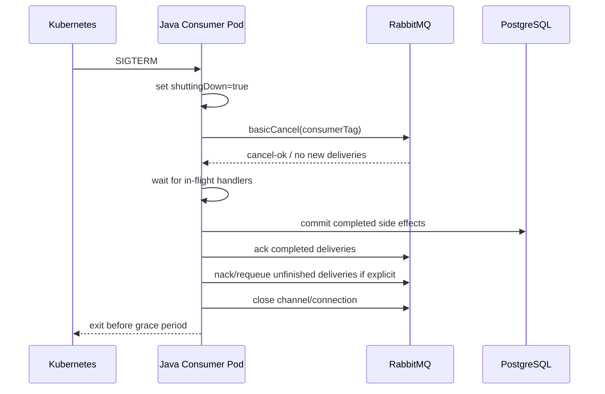
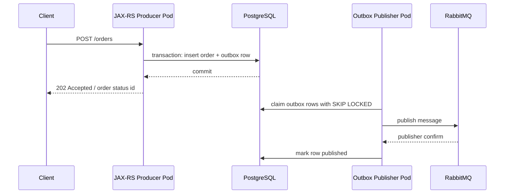

# RabbitMQ Client Workloads in Kubernetes

## 1. Core idea

A RabbitMQ producer or consumer running in Kubernetes is not just Java code using a broker client.

It is a workload with a lifecycle.

Kubernetes can:

```text
start pods
stop pods
restart pods
reschedule pods
scale replicas up/down
roll deployments
kill containers that exceed limits
rotate secrets through restarts
change DNS endpoints
move traffic away from unready pods
```

RabbitMQ clients must behave correctly under those lifecycle events.

The senior-engineer question is not:

```text
Does the consumer work locally?
```

The real questions are:

```text
What happens when the pod receives SIGTERM while processing messages?
What happens to unacked deliveries during rolling update?
What happens when replicas double but prefetch also doubles?
What happens when 100 pods reconnect after broker restart?
What happens when CPU throttling slows ack rate?
What happens when credentials rotate?
What happens when DNS returns a different broker node?
What happens when readiness says ready but RabbitMQ publish path is broken?
```

RabbitMQ correctness in Kubernetes is mostly lifecycle correctness.

---

## 2. Producer workload vs consumer workload

RabbitMQ Java clients in Kubernetes commonly appear as:

```text
HTTP/JAX-RS producer service
background outbox publisher
consumer worker service
integration adapter
workflow/saga participant
notification worker
cache invalidation worker
pricing/fulfillment/fallout task worker
```

Each workload has a different failure model.

### 2.1 Producer service

A producer service receives HTTP requests and publishes messages.

Key concerns:

```text
publish confirm timeout
unroutable message
broker unavailable
outbox fallback
HTTP response semantics
idempotency key
readiness behavior
connection reuse
credential rotation
```

### 2.2 Outbox publisher

An outbox publisher reads DB rows and publishes to RabbitMQ.

Key concerns:

```text
DB locking
batch size
publisher confirms
mark published only after confirm
duplicate publish
leader election or partitioning between replicas
shutdown after claim but before publish
shutdown after publish but before mark published
```

### 2.3 Consumer worker

A consumer worker receives deliveries and performs side effects.

Key concerns:

```text
manual ack
ack after durable processing
in-flight drain on shutdown
prefetch per replica
consumer concurrency
idempotency/inbox
DLQ/retry behavior
poison message isolation
resource limits
```

---

## 3. Pod lifecycle mental model

A Kubernetes pod lifecycle can be simplified as:

```text
scheduled
container starts
application initializes
readiness becomes true
pod receives traffic / starts consuming
SIGTERM arrives during deployment/scale-down/node drain
termination grace period starts
application shuts down
container exits
pod is removed
```

RabbitMQ lifecycle must align with this.

For a consumer:

```text
pod ready
consumer registered
messages delivered
messages in-flight
SIGTERM arrives
stop accepting new deliveries
finish or safely abandon in-flight work
ack completed messages
nack/requeue or let connection close for uncompleted messages
close channel/connection
exit before grace period expires
```

For a producer:

```text
pod ready
accept HTTP/background work
publish with confirm
SIGTERM arrives
stop accepting new HTTP/background work
finish in-flight publish confirms or persist to outbox
close channel/connection
exit safely
```

---

## 4. SIGTERM is a correctness event

Kubernetes sends SIGTERM before killing a pod.

For RabbitMQ consumers, SIGTERM is not just shutdown.
It is a message-delivery correctness event.

If handled badly, it can cause:

```text
lost work
duplicate work
long redelivery delay
partial side effect
ack before processing
requeue storm
DLQ spike
workflow timeout
```

### 4.1 Bad shutdown

```text
consumer receives message
consumer starts DB update or external call
pod gets SIGTERM
process exits immediately
message remains unacked
RabbitMQ redelivers later
side effect may or may not have happened
consumer processes duplicate
business state may be inconsistent
```

### 4.2 Better shutdown

```text
SIGTERM received
mark application as shutting down
stop HTTP intake / stop polling outbox
cancel RabbitMQ consumer or stop consuming new deliveries
wait for in-flight tasks within grace period
ack completed tasks
leave incomplete tasks unacked or nack/requeue intentionally
close channel/connection
exit
```

The exact strategy depends on workload idempotency and processing duration.

---

## 5. Termination grace period

`terminationGracePeriodSeconds` must match real processing behavior.

If the grace period is too short:

```text
pod killed before in-flight messages finish
unacked messages are redelivered
external side effects may duplicate
outbox publish may be interrupted
logs/traces may be incomplete
```

If too long:

```text
deployment rollouts are slow
node drain is slow
broken pods stay around too long
resource capacity remains tied up
```

### 5.1 Sizing rule

Base grace period on:

```text
p95/p99 message processing time
maximum allowed in-flight messages
shutdown drain strategy
DB transaction timeout
external call timeout
business SLA
Kubernetes rollout expectations
```

If a consumer can process 50 in-flight messages and each can take 30 seconds, a 30-second grace period is not honest.

The better design may be to reduce prefetch/in-flight count, not blindly increase termination grace.

---

## 6. Consumer cancellation

RabbitMQ supports consumer cancellation.

In shutdown, a consumer should stop receiving new deliveries before waiting for in-flight work.

Conceptual flow:

```text
receive SIGTERM
set shuttingDown = true
basicCancel consumer tag
wait for consumer cancellation callback / no new deliveries
wait for in-flight tasks
ack/nack remaining work intentionally
close channel/connection
```

### 6.1 Why cancellation matters

If the consumer remains active during shutdown:

```text
RabbitMQ can deliver more messages
in-flight count grows
pod has less time to drain
termination kill becomes more likely
redelivery increases
```

Consumer cancellation is how the workload says:

```text
I am leaving the consumer group; do not send me new work.
```

---

## 7. In-flight message drain

In-flight messages are deliveries that have been received but not yet acked/nacked.

They are visible as unacked messages in RabbitMQ.

Drain means:

```text
stop new intake
complete currently running handlers
commit durable side effects
ack completed deliveries
release/abandon incomplete deliveries safely
```

### 7.1 Drain strategies

#### Strategy A: finish everything within grace period

Use when:

```text
processing time is short and bounded
in-flight count is small
handlers are idempotent
shutdown grace is sufficient
```

#### Strategy B: finish only currently executing, reject queued internal work

Use when:

```text
consumer prefetch is larger than worker threads
some deliveries are buffered but not started
unstarted deliveries can be nacked/requeued
started deliveries should finish
```

#### Strategy C: stop quickly and rely on redelivery

Use when:

```text
processing is fully idempotent
side effects are transactional
redelivery is acceptable
business SLA tolerates retry
```

#### Strategy D: checkpoint progress

Use when:

```text
long-running jobs exist
work can be resumed
job state table exists
message only triggers state-machine advancement
```

Long-running jobs should usually not be represented as a single unbounded RabbitMQ message handler.

---

## 8. Ack before shutdown: major risk

A common bug:

```text
on shutdown, ack everything so queue looks clean
```

This is unsafe.

Ack means:

```text
RabbitMQ can remove this message.
The consumer has taken responsibility for completion.
```

If the application acks unfinished work during shutdown, RabbitMQ will not redeliver it.

That can lose business work.

### 8.1 Correct rule

```text
Ack only after durable side effect is complete.
If not complete, do not ack.
```

If the message is safe to retry:

```text
nack/requeue or close channel/connection and allow redelivery
```

If the message is known poison/permanent failure:

```text
nack/requeue=false to DLQ, with metadata
```

Do not use ack as cleanup.

---

## 9. Rolling update impact

A Kubernetes rolling update gradually replaces pods.

For RabbitMQ clients, a rolling update can cause:

```text
consumer capacity drop
redelivery of unacked messages
connection churn
publisher confirm timeouts
temporary queue depth growth
DLQ/retry spikes if shutdown is poor
consumer rebalancing by queue delivery
```

RabbitMQ does not have Kafka-style partition assignment rebalance, but competing consumers still change effective delivery distribution when pods leave/join.

### 9.1 Rolling update checklist

Before rollout:

```text
check queue depth
check unacked messages
check DLQ/retry queues
check consumer utilization
check downstream DB/API health
```

During rollout:

```text
watch redelivery rate
watch queue depth
watch consumer count
watch application shutdown logs
watch publisher confirm latency
```

After rollout:

```text
verify no stuck unacked messages
verify no unexpected DLQ spike
verify all replicas connected
verify throughput recovered
verify no duplicate business effect alerts
```

---

## 10. Deployment strategy

### 10.1 RollingUpdate

Default for many Deployments.

Good for:

```text
stateless producers
short-running consumers
idempotent handlers
well-drained workloads
```

Risk:

```text
capacity dips during rollout
bad new version processes messages before issue is noticed
mixed-version consumers process same message contract differently
```

### 10.2 Recreate

Usually not ideal for consumers because all capacity disappears temporarily.

Can be useful if:

```text
only one active version can process safely
schema compatibility is not possible
message contract changed incompatibly
```

But this should be rare and carefully planned.

### 10.3 Blue/green or canary

Useful when:

```text
new consumer logic is risky
message contract migration is complex
new retry behavior must be observed
new performance profile is unknown
```

Be careful: both blue and green consuming from the same queue may compete for messages.

If canary must receive only specific traffic, use separate queue/binding/routing key or controlled routing.

---

## 11. Horizontal scaling

Scaling consumer replicas changes delivery dynamics.

If each pod has:

```text
prefetch = 50
replicas = 10
```

Total possible unacked deliveries:

```text
50 * 10 = 500
```

If each pod also processes with 20 threads:

```text
20 * 10 = 200 concurrent handlers
```

That concurrency hits downstream systems:

```text
PostgreSQL connection pool
external API rate limit
Redis capacity
workflow table locks
tenant-specific limits
```

### 11.1 Scaling rule

Do not scale consumers based only on queue depth.

Also consider:

```text
downstream capacity
idempotency contention
ordering requirements
retry rate
DLQ rate
message processing time
DB connection pool
CPU/memory per pod
```

---

## 12. Prefetch per replica

Prefetch is local to the consumer/channel model.

In Kubernetes, total in-flight delivery grows with replicas.

Formula:

```text
total_possible_unacked = replicas * consumers_per_pod * prefetch_per_consumer
```

This is one of the most common hidden scaling bugs.

### 12.1 Example

```text
replicas = 8
consumers_per_pod = 4
prefetch = 25

total_possible_unacked = 8 * 4 * 25 = 800
```

If only 80 worker threads exist in total, many messages may sit unprocessed but unacked.

This causes:

```text
poor fairness
slow redelivery on pod kill
memory pressure
long drain time
misleading queue depth because ready messages drop but unacked rises
```

### 12.2 Better rule

Align prefetch with actual handler capacity.

```text
prefetch should be close to worker concurrency for long-running work
prefetch can be higher for short IO-bound work if measured
prefetch should be lower when ordering/fairness matters
prefetch must be revisited when replicas change
```

---

## 13. Consumer replicas and ordering

Multiple replicas can break effective ordering.

Even if RabbitMQ queue is FIFO, order can be affected by:

```text
multiple consumers
parallel processing
different processing times
redelivery
retry topology
nack/requeue
pod shutdown
```

If ordering matters per aggregate:

```text
route by aggregate key to dedicated queue/shard
use single active consumer where appropriate
serialize processing per aggregate in application
avoid retry topology that reorders blindly
```

Do not scale a strict-order consumer horizontally without an ordering strategy.

---

## 14. Connection storm

A connection storm happens when many clients reconnect at once.

Causes:

```text
RabbitMQ pod restart
broker rolling upgrade
network blip
DNS issue
Kubernetes node failure
application rollout
secret rotation restart
```

Symptoms:

```text
connection count spikes
channel count spikes
authentication failures spike
CPU increases on broker
publisher confirms time out
consumers reconnect slowly
application logs flood
```

### 14.1 Mitigation

Use:

```text
connection recovery with backoff/jitter
bounded connection pools
avoid connection per message
avoid channel per message
staggered rollouts
PodDisruptionBudget
rate-limited restarts
readiness gates for app dependencies
```

Java client recovery should not create a thundering herd.

---

## 15. Connection and channel count

A Java pod should usually use a small number of long-lived connections.

Channels are lighter than connections but not free.

Bad patterns:

```text
new connection per HTTP request
new connection per message
new channel per message without pooling/lifecycle
unbounded channel creation per worker
leaked channels after failure
```

Kubernetes scaling multiplies this.

Example:

```text
50 pods * 5 connections = 250 broker connections
50 pods * 100 channels = 5000 broker channels
```

This can become a broker resource issue.

### 15.1 Review checklist

```text
connections per pod
channels per pod
channels per consumer
publisher channel strategy
consumer channel strategy
thread ownership per channel
recovery behavior
leak detection metrics
```

---

## 16. Resource limits and CPU throttling

CPU throttling can look like a RabbitMQ problem.

A throttled consumer may:

```text
process slowly
ack slowly
increase unacked messages
increase queue depth
trigger redelivery during shutdown
miss heartbeat under extreme pressure
create timeout to downstream systems
```

A throttled producer may:

```text
publish slowly
process confirms slowly
timeout waiting for confirm
increase HTTP latency
increase outbox backlog
```

### 16.1 Debug CPU throttling

Check:

```text
container CPU throttling metrics
JVM thread pool saturation
GC pauses
RabbitMQ consumer utilization
queue depth vs unacked trend
application handler latency
DB latency
```

If queue depth grows but broker is healthy, look at consumer CPU and downstream dependencies.

---

## 17. Memory pressure

Consumer pods can experience memory pressure due to:

```text
large payloads
large prefetch
internal buffering
JSON serialization/deserialization
batch processing
unbounded executor queue
retry buffers
logging large payloads
```

If pod is OOMKilled:

```text
unacked messages are redelivered
partial side effects may duplicate
in-flight trace/log context is lost
shutdown drain does not run
```

### 17.1 Memory checklist

```text
message size limit
prefetch count
executor queue size
payload logging disabled/redacted
streaming parser if needed
heap sizing
container memory limit
OOM alerting
```

---

## 18. DNS behavior

Kubernetes DNS can affect RabbitMQ clients.

Issues:

```text
service name misconfigured
namespace mismatch
DNS caching in JVM
headless vs normal service confusion
broker pod IP changes
load balancer endpoint changes
network policy blocks DNS
```

### 18.1 Java DNS caching

JVM DNS caching can make failover slower or behave unexpectedly depending on configuration.

Review:

```text
JVM DNS cache TTL
client address resolver
RabbitMQ connection recovery
service endpoint strategy
load balancer behavior
```

For long-lived AMQP connections, DNS is mainly used at connection establishment and reconnect time.

---

## 19. Secret injection

Java pods need RabbitMQ credentials/certs.

Secrets can be injected through:

```text
environment variables
mounted files
external secret operator
service mesh secret mechanism
Vault/Key Vault/Secrets Manager integration
```

### 19.1 Rotation risk

When credentials rotate:

```text
existing connections may continue temporarily
new connections may fail if app has old secret
pods may need restart
broker may reject old credentials
connection recovery may loop
logs may fill with auth errors
```

### 19.2 Rotation checklist

```text
can app reload credentials without restart?
if not, is rollout planned?
is there dual credential overlap?
are auth failures alerted?
are secrets mounted with correct file permissions?
are TLS cert expiry alerts configured?
```

---

## 20. Readiness for producer pods

A JAX-RS producer has two readiness dimensions:

```text
HTTP server readiness
message publication readiness
```

They are not always the same.

Possible strategies:

### Strategy A: readiness requires RabbitMQ connectivity

Good when:

```text
endpoint cannot safely accept requests without publish path
no outbox fallback exists
synchronous publish is critical to request success
```

Risk:

```text
temporary broker issue removes API capacity
cascading unavailability
```

### Strategy B: readiness requires DB/outbox, not RabbitMQ

Good when:

```text
request can commit business state + outbox row
publisher can deliver later
API can return accepted/pending status
```

Risk:

```text
outbox backlog grows
business operation appears accepted but downstream processing delayed
requires transparent status and alerting
```

### Strategy C: endpoint-level degradation

Some endpoints require RabbitMQ; others do not.

In that case, global pod readiness may be too blunt.
Use endpoint-level health/error behavior carefully.

---

## 21. Readiness for consumer pods

A consumer pod may be process-ready but not actually consuming.

Readiness should consider:

```text
RabbitMQ connection established
consumer registered
DB dependencies available
handler thread pool healthy
not in shutdown mode
configuration loaded
```

But do not make readiness flap on every transient broker reconnect unless traffic routing depends on it.

Consumer readiness is often used more for deployment safety than external traffic routing.

---

## 22. Liveness for client pods

Liveness should not kill a pod simply because RabbitMQ is temporarily unavailable.

Bad liveness:

```text
if RabbitMQ connection down, restart pod
```

This can create restart storms during broker outage.

Better:

```text
connection recovery handles broker outage
readiness reflects degraded capability where appropriate
liveness detects truly stuck JVM/application
```

Restarting every consumer does not fix a broker outage.
It can make recovery worse.

---

## 23. Outbox publisher in Kubernetes

Outbox publishers can be deployed as:

```text
part of API service
separate Deployment
CronJob-like poller
leader-elected worker
horizontally scaled poller with DB locking
```

### 23.1 Multi-replica outbox publisher

If multiple replicas poll the same table, use database locking such as:

```text
SELECT ... FOR UPDATE SKIP LOCKED
```

But locking alone is not enough.

Also define:

```text
batch size
claim timeout
publish confirm handling
retry policy
mark-published transaction
duplicate publish tolerance
shutdown behavior
```

### 23.2 Outbox shutdown windows

Important windows:

```text
claimed row, pod dies before publish -> row must be claimable again
published message, pod dies before mark-published -> duplicate publish possible
mark-published before publish confirm -> message loss possible
```

Correctness requires downstream idempotency.

---

## 24. Consumer idempotency in Kubernetes

Kubernetes increases duplicate opportunities:

```text
pod restart
rolling deployment
node drain
OOMKill
connection drop
broker failover
manual scale-down
```

Therefore every consumer should assume:

```text
same message can be delivered more than once
same command can be executed more than once unless guarded
same business event can arrive after timeout/retry/replay
```

Use:

```text
message ID
idempotency key
inbox table
processed message table
business unique constraints
state transition guards
```

Kubernetes lifecycle events make idempotency non-negotiable.

---

## 25. Autoscaling consumers

Horizontal Pod Autoscaler can scale consumers based on:

```text
CPU
memory
custom queue depth metric
messages per consumer
consumer lag-like derived metric
```

RabbitMQ does not expose Kafka-style lag for queues, but queue depth and consumer rates can guide scaling.

### 25.1 Autoscaling risks

```text
scaling too fast creates connection storm
scaling consumers overloads PostgreSQL
scaling consumers breaks ordering assumptions
scale-down kills pods with in-flight work
queue depth metric ignores unacked messages
retry storm triggers autoscaling and amplifies damage
```

### 25.2 Better autoscaling signal

Use a combination:

```text
ready messages
unacked messages
publish rate
ack rate
processing latency
consumer utilization
downstream DB/API saturation
DLQ/retry rate
```

Do not autoscale on queue depth alone for business-critical consumers.

---

## 26. Consumer scale-down

Scale-down is as important as scale-up.

When replicas decrease:

```text
pods get SIGTERM
some deliveries are in-flight
capacity drops
remaining pods receive more work
unacked messages from terminated pods redeliver
```

### 26.1 Scale-down checklist

```text
is termination grace sufficient?
does consumer cancel before draining?
is prefetch too high for fast shutdown?
are handlers idempotent?
are unstarted buffered messages nacked/requeued?
is redelivery rate monitored?
```

Scale-down without drain discipline creates duplicate spikes.

---

## 27. Message size and pod memory

Large messages are bad for both RabbitMQ broker and Kubernetes consumers.

Impacts:

```text
network cost
broker memory/disk pressure
consumer heap usage
serialization CPU
garbage collection
log size if payload logged
DLQ storage
retry cost
```

In Kubernetes, large messages interact with container limits.

Rule:

```text
send references to large payloads when possible, not huge payload bodies
```

If payload must be large:

```text
set explicit size expectations
load test real payloads
monitor heap and GC
redact logs
avoid high prefetch
```

---

## 28. Backpressure from downstream systems

Consumer pods often call:

```text
PostgreSQL
Redis
external REST API
internal gRPC service
third-party integration
file/object storage
```

If downstream slows down, RabbitMQ symptoms appear:

```text
unacked grows
queue depth grows
consumer utilization changes
redeliveries may increase on timeout
retry queues grow
DLQ spikes
```

### 28.1 Correct response

Do not blindly add consumer replicas.

First check:

```text
DB connection pool saturation
lock wait
slow SQL
external API rate limit
Redis latency
thread pool saturation
handler timeout
```

RabbitMQ often reveals downstream bottlenecks; it is not always the root cause.

---

## 29. Retry storm in Kubernetes

A retry storm can happen when many pods fail the same message type quickly.

Example:

```text
new deployment has bug
all consumer replicas fail messages
messages nack/requeue or enter short retry delay
replicas process same failing messages repeatedly
CPU/logs/DLQ explode
```

### 29.1 Mitigation

Use:

```text
bounded retry count
delayed retry
DLQ/parking lot
circuit breaker for known downstream outage
deployment rollback
feature flag disablement
consumer pause mechanism
alert on redelivery and DLQ rate
```

A retry design that looked safe at one replica may explode at twenty replicas.

---

## 30. Pause and resume consumers

Production systems often need a safe way to pause consumers.

Use cases:

```text
downstream system outage
data migration
bad deployment rollback
poison message investigation
manual replay preparation
customer-impacting incident
```

Options:

```text
scale deployment to zero
disable consumer via config/feature flag
remove binding temporarily, risky
set policy/permission changes, risky
pause specific tenant/routing key in application logic
```

Preferred approach depends on operational maturity.

Scaling to zero is simple but may affect all tenants/messages.
Application-level pause can be more precise but must be tested.

---

## 31. Safe replay into Kubernetes consumers

Manual replay can overload consumers.

Before replay:

```text
verify consumer version
verify idempotency
verify downstream capacity
define replay rate
define tenant/customer scope
define stop condition
monitor DLQ/retry/unacked
have rollback/stop mechanism
```

Do not replay thousands of DLQ messages into a freshly deployed consumer without rate control.

Replay is production traffic.

---

## 32. Logging and trace context in pods

Every publish/consume path should log enough metadata:

```text
message_id
correlation_id
causation_id
trace_id / traceparent
routing_key
exchange
queue
consumer_tag
delivery_tag, where safe
redelivered flag
retry count
tenant_id, if applicable
business key, if non-sensitive
```

In Kubernetes, include:

```text
pod name
namespace
deployment version
container image version
node name, if useful for infra incidents
```

This allows incident reconstruction across rolling deployments.

---

## 33. Metrics for client workloads

Broker metrics are not enough.

Java client workloads need application metrics.

### 33.1 Producer metrics

```text
publish attempts
publish success
publish failure
publisher confirm latency
confirm timeout count
unroutable return count
outbox backlog
outbox publish lag
message serialization failures
connection recovery count
```

### 33.2 Consumer metrics

```text
messages received
messages processed successfully
message processing latency
ack count
nack/reject count
redelivered count
handler failure count
DLQ publish count, if app publishes DLQ manually
in-flight count
executor queue size
shutdown drain duration
```

### 33.3 Kubernetes labels

Label metrics by stable, bounded dimensions:

```text
service
environment
queue
message_type
outcome
```

Avoid high-cardinality labels:

```text
message_id
tenant_id, unless cardinality is controlled
correlation_id
user_id
raw routing key if unbounded
```

---

## 34. Application version compatibility

During rolling deployment, old and new pods may run simultaneously.

Therefore message contract changes must be compatible.

Risks:

```text
new producer sends field old consumer cannot handle
new consumer expects field old producer does not send
new routing key not bound yet
new queue arguments conflict with existing queue
new retry header format not understood by old code
```

### 34.1 Compatibility rule

For RabbitMQ workloads in Kubernetes:

```text
assume mixed versions during rollout
support backward/forward-compatible message changes
separate topology migration from code deployment when needed
verify rollback compatibility
```

---

## 35. Topology declaration from pods

Application pods may declare topology on startup.

In Kubernetes, rolling replicas amplify declaration races.

Problems:

```text
multiple pods declare same queue with different arguments
new version tries to change immutable queue argument
old version redeclares old topology
startup fails channel due to inequivalent arg
producer becomes unready
consumer never starts
```

### 35.1 Safer production approach

```text
manage topology outside app startup
apps declare only in local/dev profile
production app users do not have broad configure permission
topology migration runs before code rollout
queue argument changes use migration plan
```

---

## 36. Kubernetes workload anti-patterns

### 36.1 One connection per message

```text
HTTP request arrives
open connection
publish
close connection
```

This destroys performance and can overwhelm broker during traffic spike.

### 36.2 Auto ack consumer

```text
message delivered
RabbitMQ considers it done
pod crashes before processing
message lost
```

Avoid for business-critical workloads.

### 36.3 Huge prefetch with slow handler

```text
pod receives many messages
only processes few concurrently
pod dies
many messages redeliver late
```

### 36.4 Liveness tied to broker connection

```text
broker down
all consumers restart repeatedly
broker recovers
all consumers reconnect at once
```

### 36.5 Scaling consumers without downstream capacity

```text
queue depth high
HPA adds replicas
DB melts
processing gets slower
retry storm begins
```

---

## 37. Example graceful consumer shutdown flow



---

## 38. Example producer with outbox in Kubernetes



Shutdown windows remain:

```text
publish confirmed but mark-published not committed -> duplicate publish later
mark-published before confirm -> possible message loss
```

Therefore downstream idempotency is still required.

---

## 39. Kubernetes workload review checklist

### 39.1 Producer pod checklist

```text
Does producer use long-lived connection?
Does producer use safe channel ownership?
Are publisher confirms enabled for important messages?
Is mandatory flag/return handling used where routing must be guaranteed?
Is outbox used across DB transaction boundary?
Does HTTP response honestly reflect async state?
Does readiness model match outbox/broker availability?
Are confirm timeouts monitored?
Are connection recovery and backoff configured?
```

### 39.2 Consumer pod checklist

```text
Manual ack?
Ack after durable side effect?
Idempotency/inbox table?
Prefetch aligned with worker concurrency?
Shutdown cancels consumer before drain?
Termination grace period sufficient?
Unfinished work not acked?
Retry/DLQ bounded?
Poison messages isolated?
Processing latency monitored?
```

### 39.3 Scaling checklist

```text
Total prefetch across replicas calculated?
Downstream DB/API capacity checked?
Ordering requirements reviewed?
Scale-down drain behavior tested?
HPA signal includes more than queue depth?
Connection storm risk mitigated?
```

### 39.4 Kubernetes checklist

```text
Resource requests/limits sized?
CPU throttling monitored?
OOMKill monitored?
Secrets injected safely?
Credential/cert rotation tested?
DNS/service endpoint documented?
Pod disruption behavior tested?
Rolling deployment tested under load?
```

---

## 40. Production debugging checklist

When queue depth grows after deployment:

```text
Did consumer replicas decrease?
Are pods ready?
Are consumers registered?
Is CPU throttling happening?
Is DB latency high?
Did prefetch change?
Did message processing latency increase?
Did routing key/message type change?
Are errors causing retry/DLQ?
```

When unacked grows:

```text
Are handlers stuck?
Is downstream blocked?
Is prefetch too high?
Are worker threads saturated?
Are pods shutting down slowly?
Are acks failing due to channel closure?
```

When duplicates increase:

```text
Were pods restarted?
Was there a rolling update?
Did node drain occur?
Did broker connection drop?
Was ack after commit preserved?
Is inbox/idempotency working?
```

When publisher confirms timeout:

```text
Is broker under disk/memory alarm?
Is network unstable?
Is publisher CPU throttled?
Is channel blocked?
Is queue leader overloaded?
Did RabbitMQ pod restart?
```

---

## 41. Internal verification checklist

Use this checklist inside CSG/team context.

### 41.1 Workload inventory

```text
Which Java/JAX-RS services publish to RabbitMQ?
Which services consume from RabbitMQ?
Which workloads are API producers, outbox publishers, workers, or integration adapters?
Which queues are business-critical?
Which flows are tenant/customer-impacting?
```

### 41.2 Runtime behavior

```text
Connection count per pod?
Channel count per pod?
Publisher confirm enabled?
Manual ack enabled?
Auto recovery enabled?
Backoff/jitter on reconnect?
Prefetch value?
Consumer concurrency?
Thread pool size?
```

### 41.3 Kubernetes behavior

```text
Termination grace period?
preStop hook?
SIGTERM handling?
Consumer cancellation on shutdown?
In-flight drain logic?
Readiness/liveness probes?
Resource requests/limits?
HPA rules?
PDB interactions during rollout?
```

### 41.4 Correctness

```text
Outbox used for producer DB boundary?
Inbox/idempotency used for consumer boundary?
Ack after DB commit?
Duplicate command handling?
Poison message handling?
Replay safety?
```

### 41.5 Operations

```text
Client metrics exported?
Broker metrics correlated with app metrics?
DLQ/retry alerts?
Deployment dashboard?
Runbook for stuck consumer?
Runbook for safe pause/resume?
Runbook for replay?
```

---

## 42. Summary

RabbitMQ client workloads in Kubernetes fail when application lifecycle and message lifecycle are designed independently.

They must be designed together.

The key invariants are:

```text
manual ack after durable processing
bounded in-flight messages
graceful shutdown with consumer cancellation
prefetch aligned with replica count and worker concurrency
idempotent consumers
outbox-backed producers when DB consistency matters
connection recovery with backoff
resource limits sized from workload
readiness/liveness that do not create restart storms
observability at broker and app level
```

Kubernetes will restart, reschedule, scale, and terminate pods.

RabbitMQ will redeliver unacked messages.

Your Java/JAX-RS code must make those two facts safe.
