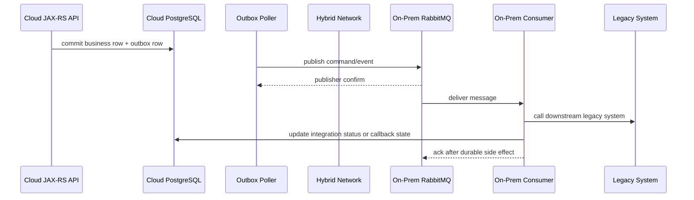
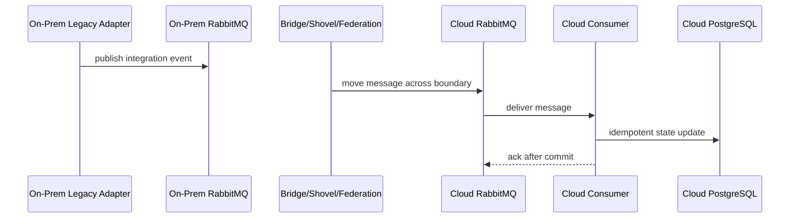

# RabbitMQ On-Prem and Hybrid Deployment

## 1. Core idea

RabbitMQ on-prem is not a different messaging system.

The application semantics remain the same:

```text
publisher confirms
manual acknowledgements
idempotent consumers
outbox for DB + publish atomicity
inbox for consumer deduplication
retry/DLQ strategy
message contract governance
observability
security and privacy control
```

What changes is the operational boundary.

In cloud-managed RabbitMQ, the platform may own parts of broker provisioning, patching, monitoring, failover, backups, and maintenance.

In on-prem and hybrid deployment, those responsibilities often move closer to the company platform/SRE/infrastructure team.

For a senior Java/JAX-RS backend engineer, the question is not:

```text
Can I connect to RabbitMQ?
```

The better question is:

```text
Who owns the broker when disk fills, certificates expire, nodes partition, storage latency spikes, or hybrid connectivity fails?
```

A production RabbitMQ system is only as reliable as the weakest boundary among:

```text
application correctness
broker configuration
storage reliability
network reliability
security operations
monitoring
incident runbook
human ownership
```

---

## 2. Why on-prem and hybrid still matter

Enterprise systems still use on-prem and hybrid RabbitMQ for reasons such as:

```text
regulatory constraints
data residency
customer-managed deployment
air-gapped environment
legacy datacenter integration
low-latency access to internal systems
BSS/OSS integration
private network dependency
contractual deployment model
cloud migration transition
vendor/platform standardization
```

In CPQ/order-management and telco-style integration, RabbitMQ may sit between:

```text
quote service
order service
pricing service
approval service
fulfillment service
billing integration
inventory integration
legacy OSS/BSS adapter
customer-specific deployment boundary
cloud-native microservices
on-prem downstream systems
```

Hybrid messaging is attractive because it allows asynchronous decoupling across boundaries.

Hybrid messaging is dangerous because failures become harder to reason about:

```text
cloud producer cannot reach on-prem broker
on-prem consumer cannot reach cloud broker
VPN flaps
firewall rule changes
DNS split-horizon mismatch
TLS certificate trust mismatch
latency spike across WAN
duplicate delivery after reconnect
message backlog accumulates during link outage
manual replay crosses data residency boundary
```

---

## 3. Responsibility boundary

Before discussing CPU, disk, TLS, or backup, define ownership.

### 3.1 Backend/application team usually owns

```text
message contract
publisher confirm usage
mandatory flag or alternate exchange handling
outbox publishing
consumer manual ack discipline
inbox/idempotency
retry and DLQ behavior
business-level replay safety
message metadata
message privacy classification
service-level metrics
application logs and tracing
consumer shutdown behavior
message schema compatibility
```

### 3.2 Platform/SRE/infrastructure team usually owns

```text
RabbitMQ installation
RabbitMQ version and Erlang version
node provisioning
OS patching
disk provisioning
filesystem layout
network routing
firewall policy
TLS certificate installation
cluster formation
backup and restore process
monitoring integration
resource alarm thresholds
upgrade procedure
incident escalation
```

### 3.3 Shared ownership

Some responsibilities cannot be owned by only one side:

```text
DLQ replay
schema-breaking message changes
retention decisions
PII handling in payload and DLQ
capacity planning
queue growth incident response
broker migration
cluster upgrade validation
hybrid connectivity incident triage
security audit evidence
```

If this boundary is not written down, production incidents will turn into ownership disputes.

---

## 4. Deployment models

On-prem/hybrid RabbitMQ commonly appears in several forms.

### 4.1 Bare-metal RabbitMQ

RabbitMQ runs directly on physical servers.

Potential benefits:

```text
predictable hardware ownership
low virtualization overhead
stable network identity
explicit disk layout
full infrastructure control
```

Risks:

```text
hardware replacement complexity
manual upgrade process
manual capacity expansion
less elastic scaling
more local operational knowledge required
```

### 4.2 Virtual machine RabbitMQ

RabbitMQ runs on VM clusters in a datacenter or private cloud.

Potential benefits:

```text
easier provisioning than bare metal
snapshot integration may exist
infrastructure team already familiar
stable node identity
compatible with traditional monitoring
```

Risks:

```text
storage latency may be opaque
hypervisor noisy-neighbor risk
snapshot misuse can corrupt operational assumptions
network path may be hard to trace
VM restart behavior may surprise RabbitMQ cluster
```

### 4.3 Kubernetes on-prem

RabbitMQ runs on an on-prem Kubernetes platform.

Potential benefits:

```text
GitOps-friendly deployment
operator-based lifecycle management
standardized secrets/configmaps/services
pod scheduling controls
integration with Kubernetes observability
```

Risks:

```text
stateful workload complexity
persistent volume behavior matters
pod identity matters
node drain can affect quorum
storage class latency can dominate performance
operator version must be managed
```

### 4.4 Hybrid broker bridge

RabbitMQ brokers exist on both cloud and on-prem sides and are connected via application bridge, Shovel, Federation, or custom integration.

Potential benefits:

```text
boundary isolation
local broker availability
controlled cross-boundary movement
migration support
disaster recovery pattern
```

Risks:

```text
duplicate messages
ordering changes
cross-boundary security concerns
monitoring split across environments
manual replay complexity
unclear source of truth
```

### 4.5 Cloud workload to on-prem broker

Java/JAX-RS services run in cloud but connect to an on-prem RabbitMQ cluster.

Risks:

```text
WAN latency affects publisher confirm latency
firewall/VPN outage stops publish/consume
heartbeat timeout during network jitter
TLS trust chain must be available to cloud workloads
connection storm after link recovery
backpressure propagates into API layer
```

### 4.6 On-prem workload to cloud broker

On-prem services connect to RabbitMQ running in cloud or managed cloud.

Risks:

```text
outbound firewall dependency
private connectivity requirement
NAT/session timeout
cross-region latency
certificate trust mismatch
credential distribution complexity
```

---

## 5. OS-level concerns

RabbitMQ is a broker runtime. It depends heavily on the host OS.

For on-prem and VM deployments, verify:

```text
supported OS distribution
supported Erlang version
supported RabbitMQ version
systemd service configuration
file descriptor limit
process limit
kernel network settings
TCP keepalive settings
time synchronization
log rotation
user permissions
disk mount options
filesystem choice
```

### 5.1 File descriptor limits

RabbitMQ uses file descriptors for:

```text
network sockets
files
internal resources
```

A low file descriptor limit can manifest as:

```text
new connection failures
channel creation failures
random client disconnects
broker log warnings
management UI instability
```

Senior review question:

```text
What is the configured file descriptor limit, and is it consistent with expected connection/channel count?
```

### 5.2 Time synchronization

Time skew affects:

```text
logs
tracing
incident timelines
certificate validity
metrics correlation
message timestamp interpretation
```

RabbitMQ semantics do not rely on wall-clock time for queue ordering, but humans and observability systems do.

If timestamps are wrong, debugging becomes unreliable.

### 5.3 Log rotation

On-prem brokers often fail in boring ways.

One common boring failure:

```text
logs fill disk
RabbitMQ hits disk alarm
publishers get blocked
queues grow elsewhere
incident appears as application outage
```

Always verify log retention and rotation.

---

## 6. Disk layout and storage model

RabbitMQ can become disk-bound quickly when using:

```text
persistent messages
durable queues
quorum queues
streams
large backlog
slow consumers
publisher confirms
DLQ retention
```

Disk is not just capacity.

Disk behavior includes:

```text
latency
IOPS
throughput
fsync behavior
failure domain
replication behavior
snapshot behavior
filesystem semantics
```

### 6.1 Separate concerns

Where possible, separate:

```text
RabbitMQ data directory
logs
OS disk
backup staging
monitoring agent buffers
```

Reason:

```text
A log spike should not consume the same space needed by message storage.
```

### 6.2 Persistent messages

Persistent messages require disk interaction when routed to durable queues.

This affects:

```text
publisher confirm latency
throughput
broker restart recovery
queue backlog durability
flow control risk
```

A persistent message is not useful if:

```text
exchange is non-durable
queue is non-durable
publisher does not use confirms
consumer is not idempotent
backup/restore is misunderstood
```

Reliability is a chain.

### 6.3 Quorum queue storage

Quorum queues replicate data using a consensus-based model.

That means the storage profile can be very different from classic queues:

```text
more writes across replicas
leader/follower placement matters
majority availability matters
storage latency affects confirms
delivery limit can interact with poison message handling
```

Do not size quorum queues like classic queues without benchmark data.

### 6.4 Stream storage

RabbitMQ Streams are retention-oriented.

They need explicit thinking about:

```text
retention size
retention age
consumer offset
replay window
segment storage
disk capacity
privacy retention
```

A stream backlog is often intentional.

A classic/quorum queue backlog is often a symptom.

Know which one you are looking at.

---

## 7. Filesystem concerns

Filesystem choice and mount behavior matter because RabbitMQ persists broker data.

Verify:

```text
filesystem type
mount options
disk scheduler
write cache behavior
fsync reliability
snapshot consistency
backup tooling compatibility
```

Avoid casual assumptions such as:

```text
"The VM has disk, so RabbitMQ is durable."
```

Durability requires understanding the full chain:

```text
application publish
publisher confirm
broker write path
queue type
replication model
disk behavior
backup and restore
consumer idempotency
```

---

## 8. Network architecture

RabbitMQ networking in on-prem/hybrid environments requires explicit diagrams.

At minimum document:

```text
client networks
broker networks
cluster inter-node network
management UI access path
monitoring scrape path
backup path
admin SSH/bastion path
firewall rules
TLS termination points
DNS names
load balancers
VPN/private link/MPLS path if hybrid
```

### 8.1 Client-to-broker traffic

Java/JAX-RS publishers and consumers need stable broker connectivity.

Failure symptoms include:

```text
connection timeout
heartbeat timeout
TLS handshake failure
authentication failure
permission failure
publisher confirm timeout
consumer cancellation
connection blocked
connection storm after reconnect
```

### 8.2 Inter-node cluster traffic

RabbitMQ cluster nodes must communicate reliably.

A network partition can be more dangerous than a clean node failure.

Senior review question:

```text
Are client traffic and inter-node traffic sharing a congested path?
```

### 8.3 Hybrid WAN traffic

For hybrid flows, measure:

```text
round-trip latency
packet loss
jitter
bandwidth
VPN failover behavior
NAT timeout
DNS failover behavior
TLS renegotiation behavior
```

High latency affects:

```text
publisher confirms
RPC/request-reply timeout
consumer reconnect
Shovel/Federation lag
manual replay window
```

---

## 9. Firewall and network policy

RabbitMQ failures are often caused by changes outside RabbitMQ:

```text
firewall rule changed
security appliance updated
NAT idle timeout changed
DNS entry moved
certificate inspection proxy introduced
new Kubernetes NetworkPolicy applied
```

Document allowed traffic:

```text
AMQP plain port if used
AMQP TLS port
management UI port
Prometheus metrics port
inter-node distribution port
CLI/admin access
stream port if RabbitMQ Stream is used
Shovel/Federation remote broker access
LDAP/OIDC endpoint if used
certificate authority/OCSP endpoint if used
```

Never rely on tribal knowledge for firewall ports.

---

## 10. TLS and certificate management

TLS in on-prem/hybrid deployment is operationally sensitive.

Verify:

```text
broker certificate source
certificate authority
certificate chain
client truststore
server name verification
mTLS requirement
certificate rotation process
expiry alert
private key protection
cipher/protocol policy
```

### 10.1 Java client impact

Java clients need:

```text
truststore configuration
keystore if mTLS is required
hostname verification compatibility
certificate reload/redeploy process
clear error logging for SSLHandshakeException
```

A certificate rotation can break all publishers and consumers if:

```text
new CA is not trusted
broker certificate CN/SAN does not match endpoint
client truststore is baked into old image
mTLS client cert expires
secret rollout does not restart pods/services
```

### 10.2 Hybrid trust chain

Hybrid systems often involve multiple trust domains:

```text
corporate CA
cloud CA
customer CA
third-party managed broker CA
service mesh CA
```

Senior review question:

```text
Which CA chain must each Java workload trust, and who rotates it?
```

---

## 11. Secrets and credentials

On-prem credentials may be stored in:

```text
vault system
Kubernetes Secret
VM secret file
environment variable
configuration management system
manual runbook
```

The storage location matters less than the rotation behavior.

Verify:

```text
credential owner
credential scope
vhost permission
rotation frequency
rotation runbook
application reload behavior
audit trail
emergency revocation process
```

A RabbitMQ credential should not have broad access unless it is an admin automation credential.

Application credentials should be scoped to:

```text
specific vhost
specific configure permission if topology declaration is allowed
specific write exchange pattern
specific read queue pattern
```

---

## 12. Monitoring stack

On-prem monitoring must cover both broker and host.

### 12.1 Broker metrics

Track:

```text
queue depth
ready messages
unacked messages
publish rate
deliver rate
ack rate
redelivery rate
consumer count
consumer utilisation
connection count
channel count
memory usage
disk usage
resource alarms
DLQ size
retry queue size
node health
cluster health
```

### 12.2 Host metrics

Track:

```text
CPU
memory
disk capacity
disk latency
IOPS
network throughput
packet loss
file descriptors
process count
time sync
log volume
```

### 12.3 Hybrid metrics

Track:

```text
cross-boundary publish latency
Shovel/Federation lag if used
VPN/private link health
DNS failure rate
TLS handshake errors
broker-to-broker connection status
cloud-to-on-prem message lag
on-prem-to-cloud message lag
```

Monitoring must answer:

```text
Is the problem in producer, network, broker, queue, consumer, database, or downstream integration?
```

---

## 13. Backup and restore

RabbitMQ backup is often misunderstood.

Separate:

```text
definitions backup
message/data backup
configuration backup
secret/certificate backup
runbook backup
```

### 13.1 Definitions

Definitions include topology/metadata such as:

```text
users
vhosts
permissions
queues
exchanges
bindings
runtime parameters
policies
operator policies
```

Definitions are essential for rebuilding broker topology.

They are not the same as message backup.

### 13.2 Message data

Message data backup is more complicated.

Questions to ask:

```text
Are messages expected to survive broker loss?
Are queues quorum/classic/stream?
Is there a DR broker?
Is the business source of truth PostgreSQL/outbox instead of broker messages?
Can messages be regenerated from database state?
Is replay privacy-safe?
What is acceptable RPO/RTO?
```

For many enterprise systems, the safer model is:

```text
Business state lives in PostgreSQL.
Publish intent lives in outbox.
RabbitMQ is transport and short/medium-term buffer.
Replay is driven from business/outbox/inbox records, not blind disk restore.
```

But this must be verified.

### 13.3 Restore test

A backup that is never restored is not a backup.

Minimum restore drill:

```text
restore definitions into non-production broker
verify exchanges/queues/bindings/policies/users/vhosts
reconnect test publisher
reconnect test consumer
publish test message
consume test message
verify DLQ path
verify monitoring path
verify permission model
```

---

## 14. Patch management

Patch management covers:

```text
OS packages
Erlang runtime
RabbitMQ server
RabbitMQ plugins
TLS libraries
monitoring agents
Kubernetes operator if used
Helm chart if used
base VM image
```

Patch risks:

```text
client compatibility changes
plugin incompatibility
feature flag requirement
cluster rolling upgrade failure
node cannot rejoin cluster
policy behavior changes
TLS/cipher behavior changes
management API behavior changes
```

Senior review question:

```text
What is the tested path from current version to target version, and what is the rollback plan?
```

---

## 15. Upgrade strategy

RabbitMQ upgrades must be planned like production changes.

Checklist:

```text
read release notes
check supported Erlang version
check feature flags
check plugin compatibility
check client compatibility
export definitions
backup config
verify cluster health before upgrade
verify queue leader distribution
pause non-critical topology changes
communicate maintenance window
upgrade one node at a time if rolling upgrade is supported
monitor alarms, queue depth, confirms, redelivery
validate consumers after upgrade
```

Application teams must prepare for:

```text
broker reconnect
publisher confirm latency spike
consumer cancellation
redelivery of in-flight messages
duplicate processing
temporary queue growth
```

Idempotency is not optional during maintenance.

---

## 16. Air-gapped deployment

Air-gapped environments add constraints:

```text
no internet package download
internal package mirror required
container image import process
offline documentation
offline certificate chain management
manual vulnerability scanning
manual plugin packaging
restricted monitoring egress
restricted support access
```

For Java/JAX-RS teams, air-gapped RabbitMQ affects:

```text
library version approval
container image promotion
Testcontainers availability in CI
certificate truststore distribution
schema artifact distribution
runbook availability
incident diagnostics without external support access
```

Internal verification checklist:

```text
How are RabbitMQ packages/images imported?
How are Erlang packages/images imported?
How are CVEs tracked?
How are certificates rotated?
How are monitoring dashboards exported?
How are definitions promoted?
How are test containers handled in CI?
```

---

## 17. Hybrid connectivity patterns

### 17.1 Application-level bridge

A custom service reads from one side and writes to another.

Benefits:

```text
business-aware transformation
idempotency can be explicit
observability can be domain-specific
can enforce schema/security policy
```

Risks:

```text
more custom code
bridge becomes critical service
must implement retry/DLQ/replay
must handle duplicate publishes
```

### 17.2 RabbitMQ Shovel

Shovel moves messages from source to destination.

Benefits:

```text
broker-level movement
useful for migration or simple bridge
less custom application code
```

Risks:

```text
business semantics may be invisible
observability must be configured
ordering and duplicate behavior must be understood
security credentials cross boundary
```

### 17.3 RabbitMQ Federation

Federation allows exchange/queue federation from upstream brokers.

Benefits:

```text
loosely coupled broker-to-broker integration
useful across WAN boundaries
can reduce direct client dependency
```

Risks:

```text
remote dependency still exists
lag must be monitored
message ownership can become unclear
routing topology becomes harder to reason about
```

### 17.4 Database-driven replay

Instead of relying on broker bridge replay, use database source of truth:

```text
outbox table
business state table
integration ledger
inbox table
reconciliation job
```

Benefits:

```text
clear audit trail
business-aware replay
better privacy control
controlled idempotency
```

Risks:

```text
requires good schema and tooling
may not support high-volume event replay without planning
needs operations process
```

---

## 18. Cloud-to-on-prem message flow

Example flow:



Failure windows:

```text
DB commit succeeds but hybrid network is down
outbox backlog grows
publish confirm times out
message arrives but consumer cannot reach legacy system
consumer crashes after external side effect
DLQ accumulates due to schema mismatch
manual replay duplicates downstream action
```

Required controls:

```text
outbox retry
publisher confirm
idempotency key
consumer inbox
downstream idempotency if possible
DLQ classification
backlog dashboard
manual replay guardrail
```

---

## 19. On-prem-to-cloud message flow

Example flow:



Failure windows:

```text
bridge connection down
message duplicated after reconnect
cloud consumer receives event after long delay
ordering changes across bridge
PII crosses boundary unexpectedly
DLQ exists only on one side
```

Required controls:

```text
cross-boundary message classification
idempotency key
lag dashboard
bridge error alert
DLQ ownership per side
replay approval process
```

---

## 20. Disaster recovery thinking

RabbitMQ DR must be tied to business recovery.

Ask:

```text
What is the system of record?
Can messages be regenerated?
What message loss is tolerable?
What duplicate processing is tolerable?
What is the RPO?
What is the RTO?
What happens to in-flight messages?
What happens to DLQ messages?
How are consumers restarted?
How is replay authorized?
```

Possible DR strategies:

```text
restore definitions and republish from outbox
maintain standby broker
bridge messages to DR broker
rebuild broker and replay from business database
use quorum queue across failure domains where latency allows
use streams with retention for replay-like workloads
```

Do not promise zero data loss unless the full chain has been proven.

---

## 21. Production failure modes

### 21.1 Disk full

Symptoms:

```text
disk alarm
publishers blocked
publisher confirm timeout
queue growth elsewhere
management UI warnings
```

Likely causes:

```text
consumer down
DLQ growth
retry storm
log growth
stream retention too large
backup files on data disk
```

### 21.2 Certificate expired

Symptoms:

```text
SSLHandshakeException in Java
connection failure
consumer pods restart repeatedly
publishers cannot connect
hybrid bridge disconnected
```

Likely causes:

```text
no expiry alert
manual cert rotation missed
truststore not updated
mTLS client cert expired
wrong SAN after endpoint change
```

### 21.3 Firewall changed

Symptoms:

```text
connection timeout
heartbeat timeout
broker reachable from some networks but not others
Shovel/Federation down
monitoring scrape fails
```

Likely causes:

```text
firewall rule cleanup
security appliance policy change
new network segment
NAT idle timeout
proxy interception
```

### 21.4 Storage latency spike

Symptoms:

```text
publisher confirm latency increases
queue throughput drops
memory pressure rises
flow control occurs
consumer lag grows
```

Likely causes:

```text
shared storage contention
backup/snapshot running
VM host noisy neighbor
disk throttling
filesystem issue
```

### 21.5 Hybrid link down

Symptoms:

```text
cloud-to-on-prem publish failure
bridge lag
outbox backlog
remote consumer idle
customer-facing async workflow stuck
```

Likely causes:

```text
VPN outage
DNS issue
firewall issue
certificate issue
network provider incident
```

---

## 22. Java/JAX-RS backend implications

For Java services, on-prem/hybrid RabbitMQ requires defensive client behavior.

### 22.1 Publisher behavior

Publisher must handle:

```text
connection failure
confirm timeout
mandatory return
connection blocked
retry with backoff
outbox backlog
circuit breaker or degradation mode
API response semantics
```

A JAX-RS endpoint should not imply completed downstream processing if it only enqueued intent.

Use:

```text
202 Accepted
operation id
status endpoint
idempotency key
clear timeout semantics
```

### 22.2 Consumer behavior

Consumer must handle:

```text
redelivery after reconnect
duplicate message
slow downstream system
partial failure
DLQ classification
shutdown drain
manual replay
```

Ack after durable side effect.

Do not ack just because the message was parsed.

### 22.3 Hybrid latency

If publisher confirm crosses WAN, latency may become visible in API throughput.

Mitigation options:

```text
local outbox
local broker
async bridge
batching where safe
separate API response from publish completion
backpressure-aware status endpoint
```

---

## 23. PostgreSQL/MyBatis/JDBC implications

On-prem/hybrid does not remove transaction problems.

It makes them easier to expose.

Use database patterns intentionally:

```text
outbox table for publish intent
inbox table for consumer deduplication
state transition table for domain lifecycle
integration ledger for external calls
reconciliation query for stuck workflows
SKIP LOCKED for safe poller parallelism
unique constraints for idempotency
```

Avoid:

```text
DB commit then direct publish without outbox for critical events
consumer ack before DB commit
manual replay without idempotency
state transition without expected-current-state check
```

If hybrid connectivity fails, the database should show the system state clearly:

```text
outbox_pending
outbox_failed
integration_waiting
consumer_processed
consumer_failed
replay_requested
```

---

## 24. Security and privacy concerns

On-prem/hybrid systems often cross boundaries.

Classify message data:

```text
public
internal
confidential
PII
sensitive customer data
regulated data
credentials/secrets prohibited
```

Pay special attention to:

```text
headers
payload
routing key
dead-letter queues
retry queues
parking lot queues
broker logs
consumer logs
trace spans
manual replay tools
exported definitions
backup artifacts
```

Do not put tenant/customer identifiers in routing keys unless policy allows it.

Do not assume DLQ is safe just because production queue is protected.

---

## 25. Observability and dashboard design

For on-prem/hybrid RabbitMQ, create a dashboard with four layers.

### 25.1 Broker layer

```text
node status
cluster status
memory alarm
disk alarm
connection blocked
queue count
connection count
channel count
file descriptor usage
```

### 25.2 Queue layer

```text
ready messages
unacked messages
publish rate
deliver rate
ack rate
redelivery rate
DLQ size
retry queue size
consumer count
consumer utilisation
```

### 25.3 Application layer

```text
outbox backlog
publish confirm latency
consumer processing latency
consumer error rate
inbox duplicate count
business workflow lag
manual replay count
```

### 25.4 Hybrid layer

```text
bridge status
cross-boundary lag
VPN/private link health
TLS handshake failures
remote broker unreachable count
firewall/network error count
```

The dashboard should answer:

```text
Is the broker sick, the consumer slow, the network broken, or the business workflow blocked?
```

---

## 26. Operational runbook checklist

Every on-prem/hybrid RabbitMQ deployment should have runbooks for:

```text
queue growth
unacked growth
DLQ spike
retry storm
memory alarm
disk alarm
node down
cluster partition
certificate expiry
credential rotation
firewall/network outage
hybrid link outage
backup restore
broker upgrade
consumer rollout
manual replay
bad topology change
```

Each runbook should include:

```text
symptoms
impact
first safe checks
commands or dashboard links
what not to do
rollback steps
escalation owner
customer communication trigger
post-incident evidence to collect
```

---

## 27. Internal verification checklist

Use this checklist in the actual CSG/team environment.

### 27.1 Deployment

```text
Is RabbitMQ on bare metal, VM, Kubernetes, managed cloud, or hybrid?
Who owns RabbitMQ installation?
Who owns RabbitMQ upgrades?
Who owns Erlang upgrades?
Who owns OS patching?
What is the support escalation path?
```

### 27.2 Storage

```text
Where is RabbitMQ data stored?
What is the filesystem?
What is disk latency baseline?
What is the disk capacity threshold?
Are logs separated from message data?
Are backups stored on separate media?
```

### 27.3 Network

```text
What DNS name do clients use?
Is there a load balancer?
What ports are open?
What firewall rules exist?
Is traffic cross-zone/cross-region/cross-datacenter?
What is the hybrid connectivity path?
```

### 27.4 Security

```text
Is TLS required?
Is mTLS required?
Where are certificates stored?
Who rotates certificates?
How are credentials stored?
What permissions does each application user have?
```

### 27.5 Messaging correctness

```text
Do critical publishers use confirms?
Is outbox used for critical DB + publish flows?
Do consumers use manual ack?
Is inbox/idempotency used?
Is DLQ configured?
Is replay safe and documented?
```

### 27.6 Operations

```text
Are definitions exported?
Are backups tested?
Are dashboards available?
Are alerts actionable?
Are runbooks current?
Are incident notes reviewed?
```

---

## 28. PR review checklist

When reviewing a change that touches RabbitMQ in on-prem/hybrid environment, ask:

```text
Does this introduce a new exchange, queue, binding, policy, or vhost?
Is topology declared by app or managed as infrastructure?
Does the publisher use confirm and routability checks?
Does the consumer ack only after durable side effect?
Is idempotency enforced by database constraint or business state?
What happens during broker reconnect?
What happens during hybrid link outage?
Does retry/DLQ preserve privacy boundaries?
Is queue growth observable?
Is manual replay documented?
Does the change require firewall/TLS/secret update?
Does the change affect capacity or disk retention?
Does the change need platform/SRE approval?
```

---

## 29. Senior-engineer heuristics

Use these rules in architecture discussions.

```text
If RabbitMQ is self-managed, operational maturity is part of system correctness.
If a message crosses datacenter/cloud boundary, treat it as integration, not just messaging.
If a queue can grow forever, it will eventually become an outage.
If a certificate can expire silently, it will expire during a bad time.
If replay is manual, it must be idempotent, audited, and privacy-reviewed.
If a broker is the only copy of business intent, backup/restore must be proven.
If outbox exists, broker outage becomes backlog, not immediate data loss.
If inbox exists, duplicate delivery becomes routine, not catastrophic.
```

---

## 30. Key takeaways

RabbitMQ on-prem and hybrid deployment is mainly about operational truth.

The messaging model remains RabbitMQ.

The failure model changes.

A production-ready on-prem/hybrid RabbitMQ system needs:

```text
clear ownership
known deployment model
stable storage
documented network path
TLS and credential rotation
monitoring for broker + host + application + hybrid layer
backup and restore drill
upgrade plan
runbooks
outbox/inbox discipline
DLQ/replay governance
security and privacy review
```

For a senior backend engineer, the goal is not to become the datacenter operator.

The goal is to know which infrastructure assumptions your Java/JAX-RS service depends on, how those assumptions fail, and how to design the application so broker/network/storage incidents do not silently corrupt business state.

---

## References

- RabbitMQ Production Deployment Guidelines: https://www.rabbitmq.com/docs/production-checklist
- RabbitMQ Backup and Restore: https://www.rabbitmq.com/docs/backup
- RabbitMQ Definitions Export and Import: https://www.rabbitmq.com/docs/definitions
- RabbitMQ Access Control: https://www.rabbitmq.com/docs/access-control
- RabbitMQ TLS Support: https://www.rabbitmq.com/docs/ssl
- RabbitMQ Networking: https://www.rabbitmq.com/docs/networking
- RabbitMQ Clustering: https://www.rabbitmq.com/docs/clustering
