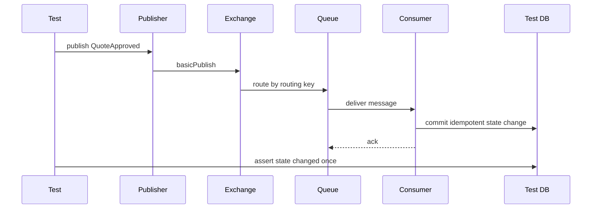

# Testing RabbitMQ-Based Systems

## 1. Core idea

Testing RabbitMQ-based systems is not the same as testing:

```text
basic Java method logic
HTTP controller mapping
SQL mapper query
happy-path publish and consume
```

RabbitMQ systems fail in the spaces between components:

```text
publisher and broker
broker and queue topology
queue and consumer
consumer and database
consumer and downstream service
retry and DLQ
manual replay and idempotency
Kubernetes shutdown and redelivery
schema change and old consumer
```

The purpose of testing is not to prove that RabbitMQ works.

RabbitMQ already works.

The purpose is to prove that your system remains correct when messaging reality appears:

```text
duplicate delivery
out-of-order delivery
unroutable message
publisher confirm timeout
consumer crash
broker restart
redelivery
poison message
DLQ replay
schema evolution
slow consumer
backpressure
partial database failure
external call failure
```

A senior backend engineer tests failure semantics, not just API calls.

---

## 2. Testing pyramid for RabbitMQ systems

A practical testing model:

```text
unit tests
component tests
contract tests
integration tests
topology tests
failure-mode tests
load/performance tests
chaos/resilience tests
manual runbook drills
```

Each layer catches a different class of bug.

Do not put everything in slow end-to-end tests.

Do not trust only mocks.

RabbitMQ behavior is broker behavior; important parts must be tested against a real broker.

---

## 3. What must be tested

For RabbitMQ-backed Java/JAX-RS systems, test at least:

```text
publisher constructs correct message
publisher routes to correct exchange/routing key
publisher handles unroutable message
publisher waits for confirm where required
outbox poller publishes and marks state correctly
consumer deserializes expected contract
consumer rejects invalid contract safely
consumer commits DB before ack
consumer does not double-apply duplicate message
consumer handles redelivery
retry count increments correctly
poison message goes to DLQ/parking lot
manual replay is idempotent
ordering-sensitive flow is protected
Kubernetes shutdown drains in-flight work
observability emits useful metrics/logs/traces
```

The most important test question:

```text
What business invariant must remain true after failure?
```

---

## 4. Unit testing publisher code

Unit tests should verify local logic without requiring a broker.

Test:

```text
message type selection
routing key creation
exchange name resolution
payload serialization
headers creation
message ID/correlation ID propagation
content type
schema version
tenant metadata
idempotency key
outbox row creation
error mapping
```

Example test focus:

```text
Given QuoteApproved domain event
When publisher builds message envelope
Then routing key is quote.approved.v1
And message type is QuoteApproved
And correlation ID is propagated
And tenant ID is present
And schema version is v1
```

Do not unit test RabbitMQ itself.

Unit test your mapping from business intent to message contract.

---

## 5. Unit testing consumer code

Consumer unit tests should isolate business handling from broker details.

Test:

```text
payload validation
schema version handling
idempotency key extraction
business state transition
expected-current-state check
database command construction
external call abstraction
error classification
retryable vs non-retryable error
log context creation
metric tag creation
```

Good consumer code separates:

```text
RabbitMQ delivery adapter
message deserialization
idempotency guard
business handler
transaction boundary
ack/nack decision
```

This separation makes failure testing possible.

---

## 6. Avoid mock-only confidence

Mocks are useful for fast feedback.

Mocks are dangerous when they hide broker behavior.

Mock-only tests usually miss:

```text
wrong exchange type
wrong binding
wrong routing key
missing durable flag
mandatory return behavior
publisher confirm behavior
manual ack behavior
delivery tag scope
redelivery flag
DLX behavior
TTL expiry
x-death header
connection recovery
```

If the behavior is implemented by RabbitMQ, test at least one layer against RabbitMQ.

---

## 7. Contract testing message payload

Message contracts need tests because RabbitMQ does not know your business schema.

Contract tests should verify:

```text
required fields
optional fields
default values
schema version
message type
content type
backward compatibility
forward compatibility
unknown field handling
enum evolution
numeric precision
timestamp format
tenant metadata
trace metadata
```

### 7.1 Producer contract test

Producer contract test answers:

```text
Does the producer emit a message that matches the published contract?
```

### 7.2 Consumer contract test

Consumer contract test answers:

```text
Can the consumer process messages produced by supported producer versions?
```

### 7.3 Breaking change test

Breaking change test answers:

```text
Will this schema change break old consumers or old producers?
```

In enterprise systems, message schema compatibility is production safety.

---

## 8. Integration testing with Testcontainers

Use a real RabbitMQ broker for integration tests.

Testcontainers is useful because it can provide disposable RabbitMQ instances in Java test suites.

Typical use cases:

```text
start RabbitMQ container
create exchange
create queue
create binding
publish message
consume message
assert ack behavior
assert DLQ behavior
assert retry topology
assert management API/topology if needed
```

### 8.1 What Testcontainers gives you

```text
isolated broker per test suite
repeatable local and CI environment
real AMQP behavior
real exchange routing
real queue behavior
real DLX/TTL behavior
real Java client connection path
```

### 8.2 What Testcontainers does not give you

```text
production cluster behavior
real storage latency
real network partition
real cloud/on-prem firewall behavior
real HA/failover behavior unless explicitly built
real production credentials/policies
```

Use Testcontainers for correctness behavior.

Use staging/load/chaos environments for operational behavior.

---

## 9. Example integration test topology

A simple integration test can create isolated topology:

```text
exchange: test.quote.events
queue: test.quote.approved.consumer
binding: quote.approved.v1
DLX: test.quote.dlx
DLQ: test.quote.dlq
```

Test flow:



This test validates the contract between publisher, topology, consumer, and database.

---

## 10. Topology tests

Topology tests verify broker configuration.

Test:

```text
exchange exists
exchange type is correct
exchange is durable when required
queue exists
queue type is correct
queue is durable when required
binding exists
routing key pattern is correct
DLX is configured
DLQ is bound correctly
TTL retry queue is configured if used
policy does not override expected behavior unexpectedly
```

Topology bugs are common because everything looks fine until a message is published.

Example failure:

```text
producer publishes quote.approved.v1
binding expects quote.approve.v1
message is unroutable
publisher does not use mandatory flag
message disappears from application perspective
```

Topology tests prevent expensive debugging.

---

## 11. Publisher confirm tests

Publisher reliability tests should verify:

```text
publisher waits for confirm for critical messages
confirm success updates outbox row
confirm failure leaves outbox row retryable
confirm timeout does not mark message as published
connection failure does not lose publish intent
duplicate publish is tolerated by downstream idempotency
```

### 11.1 Outbox confirm test

Test scenario:

```text
Given outbox row is pending
When publisher publishes and receives confirm
Then outbox row becomes published
```

Failure scenario:

```text
Given outbox row is pending
When publish throws connection exception
Then outbox row remains pending or failed-retryable
And no business transaction is rolled back incorrectly
```

### 11.2 Confirm timeout test

Confirm timeout is ambiguous.

The message might have reached the broker.

Test expected behavior:

```text
outbox row is not marked published
retry may publish duplicate
consumer idempotency handles duplicate
metric confirm_timeout increments
log includes outbox id and correlation id
```

---

## 12. Mandatory flag and unroutable message tests

If a message must be routed, test unroutable behavior.

Test:

```text
publish with mandatory=true
publish to exchange with no matching binding
verify return listener is invoked
verify outbox row is failed or retryable according to policy
verify alert/metric/log is emitted
```

If alternate exchange is used, test:

```text
unroutable message is routed to alternate exchange
alternate queue receives message
operator can inspect message
producer does not treat alternate route as business success unless policy says so
```

Do not let unroutable message become silent success.

---

## 13. Consumer acknowledgement tests

Consumer ack tests verify correctness around side effects.

Test:

```text
consumer acks after DB commit
consumer does not ack when DB commit fails
consumer nacks/rejects according to error classification
consumer sends poison message to DLQ
consumer does not requeue infinite loop
consumer handles redelivery flag
consumer logs delivery tag safely without treating it as global id
```

### 13.1 Ack-after-commit test

```text
Given message is delivered
When business handler commits DB transaction
Then consumer sends ack
And message is removed from queue
```

### 13.2 No-ack-on-failure test

```text
Given message is delivered
When DB commit fails
Then consumer does not ack
And message is retried or dead-lettered according to policy
```

### 13.3 Crash-window test

Harder but important:

```text
commit succeeds
consumer crashes before ack
message is redelivered
idempotency prevents duplicate state transition
consumer eventually acks
```

This is one of the most valuable RabbitMQ tests.

---

## 14. Retry and DLQ tests

Retry/DLQ tests should prove that failure classification is real.

Test transient failure:

```text
consumer fails with retryable exception
message is retried with expected delay
retry count increases
message eventually succeeds
message is acked after success
```

Test permanent failure:

```text
consumer fails with non-retryable exception
message is rejected/nacked without requeue
message appears in DLQ
DLQ includes useful headers/metadata
operator can identify reason
```

Test poison message:

```text
message fails repeatedly
retry limit is reached
message moves to parking lot or DLQ
no infinite loop occurs
redelivery rate does not explode
```

Test replay:

```text
message is manually replayed from DLQ
consumer processes idempotently
original failure reason is preserved or linked
replay action is audited
```

---

## 15. TTL and delayed retry tests

For TTL retry topology, test actual broker behavior.

Test:

```text
message is dead-lettered to retry queue
retry queue has message TTL
expired message returns to main exchange/queue
x-death header changes as expected
retry count can be derived safely
final failure routes to DLQ
```

Failure modes to test:

```text
wrong dead-letter routing key
retry queue not bound
TTL missing
message stuck in retry queue
message loops forever
x-death parsing incorrect
```

Do not trust retry topology from code review alone.

Run it.

---

## 16. Idempotency tests

Idempotency tests are mandatory for at-least-once systems.

Test duplicate delivery:

```text
same message ID delivered twice
consumer applies business transition once
second delivery is acknowledged safely
inbox/processed table records duplicate
metric duplicate_detected increments
```

Test same business command with different message ID:

```text
same idempotency key
new message ID
consumer still prevents duplicate business effect
```

Test partial failure:

```text
external call succeeds
consumer crashes before ack
message redelivered
consumer does not repeat unsafe external operation without idempotency guard
```

The strongest idempotency tests use database unique constraints or state transition guards, not only in-memory flags.

---

## 17. Ordering tests

Ordering tests should be narrow and explicit.

Do not claim global ordering unless topology enforces it.

Test:

```text
single queue + single consumer preserves expected order for simple flow
multiple consumers can process out of order
redelivery can affect order
retry queue can break order
priority queue can break FIFO expectations
per-aggregate routing preserves aggregate-local order if topology supports it
single active consumer behavior if used
```

A useful test:

```text
publish OrderCreated then OrderCancelled for same order
consumer must not apply cancellation before creation
if delivery order breaks, state machine must handle it safely
```

Ordering should be protected by design, not hope.

---

## 18. Outbox tests

Outbox tests cover producer-side consistency.

Test:

```text
business row and outbox row are inserted in same DB transaction
rollback removes both
poller locks rows safely
parallel pollers do not publish same row concurrently
publisher confirm marks row published
confirm timeout does not mark row published
failed publish remains retryable
cleanup does not delete needed audit data
```

### 18.1 Parallel poller test

Use PostgreSQL semantics if possible.

Test:

```text
two pollers run concurrently
same outbox row is not processed twice at same time
SKIP LOCKED or equivalent prevents contention
```

Even if duplicate publish later happens, concurrent duplicate publish should not be accidental.

---

## 19. Inbox tests

Inbox tests cover consumer-side deduplication.

Test:

```text
first message inserts inbox row and processes business change
same message ID is recognized as duplicate
same idempotency key is recognized as duplicate if required
failed processing updates inbox state
retry does not corrupt inbox state
replay can be tracked
cleanup respects retention
```

Inbox table should help answer:

```text
Was this message seen?
Was it processed?
Did it fail?
Why did it fail?
Was it replayed?
```

Testing should verify those answers are available.

---

## 20. Consumer crash tests

Consumer crash tests simulate the most important at-least-once behavior.

Scenarios:

```text
crash before DB transaction
crash after DB transaction before ack
crash during external call
crash after external call before ack
crash during DLQ handling
crash during shutdown drain
```

Expected behavior:

```text
message is redelivered when not acked
business state is not duplicated
unsafe external side effects are guarded
consumer can resume
logs and metrics show crash/redelivery context
```

If you cannot automate all crash tests, at least document and manually validate the critical ones in staging.

---

## 21. Broker restart tests

Broker restart tests verify client recovery and redelivery behavior.

Test:

```text
publisher reconnects
publisher does not lose outbox rows
publisher confirm timeout is handled
consumer reconnects
unacked messages are redelivered
consumer idempotency holds
metrics recover
health checks behave correctly
```

Important distinction:

```text
connection recovery does not prove message correctness
```

Your application still needs outbox/inbox/ack discipline.

---

## 22. Channel and connection failure tests

Test Java client behavior when:

```text
channel closes due to protocol exception
connection drops
broker sends connection.blocked
broker sends connection.unblocked
consumer is cancelled
publisher channel is closed while publishing
return listener receives unroutable message
```

Expected behavior:

```text
no silent message loss
clear logs
retry/backoff
metric increment
outbox remains source of truth
consumer re-subscribes if appropriate
application readiness reflects degraded state if needed
```

---

## 23. Load testing

Load tests answer capacity questions.

Test dimensions:

```text
publish rate
consume rate
message size
publisher confirm latency
consumer processing latency
queue depth
unacked messages
redelivery rate
DLQ rate
CPU
memory
disk IO
network IO
DB connection pool pressure
```

Vary:

```text
prefetch
consumer concurrency
number of replicas
message persistence
queue type
payload size
batch size
publisher connection/channel model
```

Do not load test only RabbitMQ.

Load test the whole flow:

```text
JAX-RS API
PostgreSQL transaction
outbox poller
RabbitMQ
consumer
PostgreSQL update
external dependency stub
observability
```

---

## 24. Chaos and resilience tests

Chaos tests should be controlled and purposeful.

Possible tests:

```text
kill consumer pod
restart broker node
pause network between app and broker
block publisher connection
slow down database
fill DLQ intentionally
increase message size
break binding
expire TLS certificate in test environment
rotate credential
simulate DNS failure
```

For each chaos test define:

```text
hypothesis
blast radius
expected detection
expected application behavior
expected recovery
rollback
success criteria
```

Chaos without hypothesis is just outage rehearsal.

---

## 25. Kubernetes-specific tests

For RabbitMQ client workloads in Kubernetes, test:

```text
rolling update of consumer deployment
SIGTERM handling
preStop hook if used
grace period length
in-flight drain
ack behavior during shutdown
consumer replica scaling
prefetch multiplication
connection storm after rollout
secret rotation rollout
readiness when broker unavailable
```

A critical test:

```text
consumer receives message
processing takes 30 seconds
pod receives SIGTERM at second 10
pod stops accepting new deliveries
message is either completed and acked or redelivered safely
no partial business corruption occurs
```

---

## 26. Observability tests

Observability should be tested.

Verify metrics exist for:

```text
publish success/failure
publish confirm latency
mandatory returned messages
outbox pending count
consumer processing latency
consumer success/failure
ack/nack/reject count
redelivery count
retry count
DLQ count
inbox duplicate count
message age
business lag
```

Verify logs include:

```text
message ID
correlation ID
causation ID
trace ID
tenant ID where allowed
message type
routing key
queue name
retry count
error classification
```

Verify traces cross:

```text
HTTP request
DB transaction
outbox publish
RabbitMQ message
consumer processing
DB update
external call
```

If production debugging depends on a field, test that the field is emitted.

---

## 27. Security and privacy tests

Test that sensitive data does not leak.

Verify:

```text
payload does not contain prohibited fields
headers do not contain PII unless approved
routing key does not expose tenant/customer sensitive data
logs redact payload fields
DLQ access is restricted
replay tool requires authorization
test fixtures do not use real customer data
TLS is required in integration environment where applicable
credentials are not hardcoded
```

Security tests should include DLQ and replay paths because those are often forgotten.

---

## 28. CI strategy

A practical CI pipeline:

```text
unit tests on every commit
contract tests on every commit
integration tests with RabbitMQ container on PR
topology validation on PR
outbox/inbox tests on PR
retry/DLQ tests on PR or nightly
load smoke test nightly or pre-release
chaos/resilience tests in staging
manual runbook drill before major release
```

Keep CI stable by:

```text
isolating vhost/queue names per test
using unique routing keys
cleaning up topology
using timeouts generously but bounded
avoiding sleeps where condition polling works
recording broker logs on failure
```

Flaky messaging tests usually indicate either poor isolation or hidden timing assumptions.

---

## 29. Test data strategy

Use synthetic messages that represent real business invariants.

Good test message examples:

```text
QuoteApproved
QuoteRejected
OrderSubmitted
OrderCancelled
PricingCompleted
ApprovalRequested
FulfillmentFailed
NotificationRequested
```

Each test message should include:

```text
message ID
correlation ID
causation ID
message type
schema version
tenant ID if applicable
business aggregate ID
created timestamp
idempotency key
```

Avoid meaningless payloads such as:

```text
{"hello":"world"}
```

They do not test production risks.

---

## 30. Failure-mode test matrix

Use this matrix when designing tests.

| Failure | Expected safety mechanism | Test type |
|---|---|---|
| Publish after DB commit fails | Outbox | Integration |
| Broker confirm timeout | Outbox retry + idempotent consumer | Integration |
| Message unroutable | Mandatory return or alternate exchange | Integration |
| Consumer crashes before ack | Redelivery + idempotency | Crash test |
| Consumer processes duplicate | Inbox/idempotent state transition | Integration |
| Poison message loops | Retry limit + DLQ | Integration |
| DLQ replay duplicates business effect | Idempotency + audit | Replay test |
| Schema breaks consumer | Contract test | Contract |
| Rolling update kills consumer | Graceful shutdown + redelivery | Kubernetes test |
| Queue backlog grows | Alert + runbook | Load/resilience |
| Broker restart | Client recovery + outbox/inbox | Resilience |
| TLS certificate changes | Truststore/secret rollout | Security/integration |

---

## 31. Anti-patterns in RabbitMQ testing

Avoid:

```text
only testing happy path publish/consume
mocking RabbitMQ for all tests
using auto-ack in tests while production uses manual ack
not testing DLQ
not testing duplicate delivery
not testing unroutable message
not testing publisher confirm timeout
using sleeps instead of condition waits
sharing queues across parallel tests
ignoring cleanup
asserting on queue depth without understanding timing
not capturing broker logs in CI failures
using production-like names without isolation
```

A test suite that never creates redelivery is not testing at-least-once reality.

---

## 32. Internal verification checklist

Use this checklist in the actual CSG/team environment.

### 32.1 Test coverage

```text
Are publishers unit tested?
Are consumers unit tested?
Are message contracts tested?
Are topology tests present?
Are integration tests using real RabbitMQ?
Are retry/DLQ tests present?
Are idempotency tests present?
Are outbox/inbox tests present?
Are ordering-sensitive flows tested?
```

### 32.2 Test environment

```text
Is RabbitMQ available in CI?
Is Testcontainers allowed in CI?
Are Docker/container runtimes available?
Are test queues isolated per run?
Are broker logs collected on failure?
Are tests parallel-safe?
```

### 32.3 Production-readiness testing

```text
Is broker restart tested?
Is consumer crash tested?
Is rolling update tested?
Is secret/certificate rotation tested?
Is replay tested?
Is load baseline known?
Is alerting tested?
Is runbook exercised?
```

### 32.4 Governance

```text
Is message schema compatibility checked before merge?
Is topology change reviewed by platform/SRE?
Is DLQ replay authorized and audited?
Is PII in payload/header tested?
Are observability fields required by standard?
```

---

## 33. PR review checklist

When reviewing a RabbitMQ-related PR, ask:

```text
What tests prove the message routes correctly?
What tests prove publisher failure does not lose business intent?
What tests prove consumer duplicate handling?
What tests prove ack happens after durable side effect?
What tests prove retry does not loop forever?
What tests prove DLQ contains enough diagnostic metadata?
What tests prove schema compatibility?
What tests prove observability fields exist?
What tests prove shutdown/restart safety?
What tests prove replay safety?
```

If a PR introduces a queue but no retry/DLQ/idempotency test, it is not production-ready.

---

## 34. Senior-engineer heuristics

Use these rules:

```text
If a behavior depends on RabbitMQ routing, test against RabbitMQ.
If a behavior depends on duplicate delivery, explicitly deliver duplicate messages.
If a behavior depends on ack timing, test crash windows.
If a behavior depends on retry/DLQ, test the actual topology.
If a behavior depends on schema compatibility, test old/new payloads.
If a behavior depends on Kubernetes shutdown, send SIGTERM.
If a behavior depends on replay, replay the message in test.
If a behavior affects business money/order state, unit tests are not enough.
```

---

## 35. Key takeaways

RabbitMQ testing is about proving distributed correctness.

A strong test suite covers:

```text
publisher mapping
message contract
routing topology
publisher confirm behavior
unroutable handling
outbox correctness
consumer ack discipline
inbox/idempotency
retry/DLQ behavior
TTL/dead-letter behavior
ordering-sensitive flows
consumer crash windows
broker restart behavior
Kubernetes rollout behavior
observability
security/privacy leakage
load and resilience
```

The highest-value tests are not the ones that prove happy path works.

The highest-value tests prove that failures do not corrupt business state.

For enterprise Java/JAX-RS systems, that is the difference between "RabbitMQ integration exists" and "RabbitMQ integration is production-ready".

---

## References

- RabbitMQ Java Client Guide: https://www.rabbitmq.com/client-libraries/java-api-guide
- RabbitMQ Publisher Confirms and Consumer Acknowledgements: https://www.rabbitmq.com/docs/confirms
- RabbitMQ Dead Letter Exchanges: https://www.rabbitmq.com/docs/dlx
- RabbitMQ Time-To-Live and Expiration: https://www.rabbitmq.com/docs/ttl
- RabbitMQ Reliability Guide: https://www.rabbitmq.com/docs/reliability
- RabbitMQ Production Deployment Guidelines: https://www.rabbitmq.com/docs/production-checklist
- Testcontainers RabbitMQ Module for Java: https://java.testcontainers.org/modules/rabbitmq/
- Testcontainers for Java: https://java.testcontainers.org/
