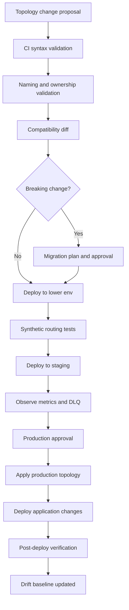
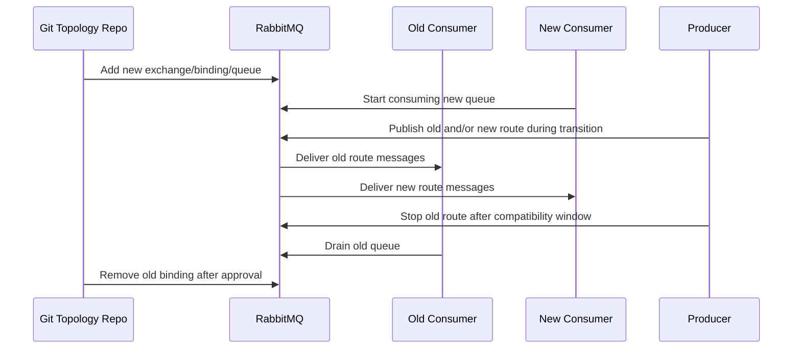

# CI/CD and GitOps for RabbitMQ Artifacts

## 1. Core idea

RabbitMQ topology is production infrastructure.

Do not treat it as incidental runtime state.

In a serious Java/JAX-RS microservice environment, the following are not "just config":

```text
vhost
exchange
queue
binding
routing key
policy
operator policy
runtime parameter
user
permission
federation upstream
shovel definition
stream definition
DLX topology
retry topology
parking lot queue
default queue type
consumer timeout policy
max length policy
TTL policy
quorum delivery limit
```

They determine:

```text
whether messages route at all
whether messages are durable
whether retry works
whether poison messages are isolated
whether queue type is classic, quorum, or stream
whether a service can read/write/configure resources
whether a deployment silently breaks another service
whether an incident can be rolled back
```

The core principle:

```text
RabbitMQ topology must be reviewed, versioned, promoted, validated, observed, and rolled back like application code.
```

A senior engineer does not ask only:

```text
Does the producer compile?
Does the consumer start?
```

A senior engineer asks:

```text
Who owns this exchange?
Who owns this queue?
What contract does this routing key represent?
What happens if this binding is missing?
What happens if this policy changes queue type?
What happens during blue/green or rolling deploy?
Can we detect drift?
Can we safely roll back?
Can old producers and new consumers coexist?
Can new producers and old consumers coexist?
```

---

## 2. Why this matters

RabbitMQ topology failure often looks like application failure.

Example symptoms:

```text
producer logs success but no consumer receives message
message is published but unroutable
message routes to unexpected queue
DLQ grows after deployment
retry queue does not delay
consumer receives duplicate message spike
queue changes from classic to quorum unexpectedly
permission error appears only in production
new environment misses one binding
helm upgrade recreates queues unexpectedly
manual UI change fixes incident but is lost during redeploy
```

The root cause may be:

```text
missing binding
wrong routing key
wrong vhost
wrong exchange type
non-durable queue
policy override
operator policy override
missing permission
wrong DLX argument
wrong max-length overflow behavior
manual drift
incompatible topology change
uncoordinated deployment order
```

This is why topology must be lifecycle-managed.

---

## 3. RabbitMQ artifacts that need lifecycle control

At minimum, control these artifacts.

### 3.1 Virtual hosts

```text
name
purpose
environment mapping
owner
allowed applications
backup/export policy
```

Vhost is a logical namespace.

Do not create vhosts casually.

A vhost boundary affects:

```text
resource visibility
permission scope
naming collision risk
tenant isolation
environment isolation
operational blast radius
```

### 3.2 Exchanges

Track:

```text
name
type
vhost
durable flag
auto-delete flag
internal flag
alternate exchange
owner
contract purpose
allowed routing keys
```

Exchange changes are dangerous because they affect routing.

Changing exchange type is usually a breaking topology change.

### 3.3 Queues

Track:

```text
name
vhost
queue type
owner service
consumer service
business purpose
durability
exclusive/auto-delete flags
single active consumer
max length
message TTL
queue TTL
DLX
DL routing key
quorum delivery limit
stream retention
```

Queue changes can affect:

```text
durability
ordering
throughput
failover
storage
retry behavior
privacy retention
consumer scaling
```

### 3.4 Bindings

Track:

```text
source exchange
destination queue or exchange
routing key
headers match if headers exchange
owner
contract purpose
expected producer
expected consumer
```

Bindings are where many production routing bugs hide.

A missing binding can make a message unroutable.

An overly broad binding can deliver unrelated messages to a consumer.

### 3.5 Policies

Policies should be versioned because they can affect groups of resources.

Examples:

```text
queue type
DLX
message TTL
max length
overflow behavior
quorum delivery limit
stream retention
federation behavior
```

A policy can change behavior without changing application code.

This makes policy changes high-risk.

### 3.6 Operator policies

Operator policies are especially important in managed/platform-owned environments.

They can enforce upper bounds or platform constraints.

Examples:

```text
maximum queue length
maximum TTL
queue type enforcement
resource guardrails
```

Application teams must know whether operator policies override or constrain application-declared settings.

### 3.7 Users and permissions

Track:

```text
username/service identity
vhost
configure regex
write regex
read regex
topic permissions if used
rotation schedule
owning service
secret source
```

Permissions are part of topology governance.

A service that can configure `.*` can create or mutate broker topology.

That may be acceptable for infrastructure automation, but usually not for application runtime identities.

### 3.8 Runtime parameters

Runtime parameters may include:

```text
federation upstreams
shovel definitions
OAuth2 settings
other plugin-specific configuration
```

These are integration infrastructure and should not be changed manually without review.

---

## 4. Topology as code

Topology as code means RabbitMQ topology is declared in source control and applied through controlled automation.

Possible approaches:

```text
RabbitMQ definitions JSON
rabbitmqadmin scripts
rabbitmqctl commands
Terraform provider if used
Helm chart values
RabbitMQ Cluster Operator custom resources
Kubernetes manifests
platform-specific IaC modules
internal topology registry
application startup declaration with strict guardrails
```

The exact mechanism depends on the platform.

The engineering invariant is the same:

```text
Production topology should not depend on undocumented manual UI clicks.
```

---

## 5. RabbitMQ definitions file

RabbitMQ definitions represent broker metadata/topology such as:

```text
users
vhosts
permissions
parameters
policies
queues
exchanges
bindings
```

Definitions can be exported and imported.

They are useful for:

```text
schema backup
environment seeding
drift inspection
migration planning
local development bootstrap
CI validation
restore preparation
```

But definitions are not a complete substitute for operational backup.

They capture topology and metadata, not necessarily all durable message data.

A safe mental model:

```text
definitions = broker schema/topology metadata
messages     = broker data/workload state
```

Do not confuse the two.

---

## 6. Definitions-as-code workflow

A practical workflow:

```text
1. Developer proposes topology change in repository.
2. CI validates syntax and naming rules.
3. CI validates compatibility against current production snapshot.
4. Reviewer checks ownership, contract, security, retry, DLQ, observability.
5. Change is merged after approval.
6. CD promotes to dev/test/staging.
7. Synthetic publish/consume tests verify routing.
8. Production deployment applies topology change before dependent application rollout.
9. Drift detector compares desired vs actual.
10. Rollback plan is ready for breaking changes.
```

This prevents topology changes from becoming tribal knowledge.

---

## 7. Application startup topology declaration

Some applications declare exchanges/queues/bindings at startup.

This can be acceptable for local development or simple systems.

In enterprise production systems, be careful.

Application startup declaration can create problems:

```text
multiple services competing to declare shared topology
accidental topology mutation during app rollout
permission expansion because app needs configure rights
race condition between old and new versions
queue arguments mismatch causing declaration failure
implicit topology hidden inside code
inconsistent topology across environments
```

A safer rule:

```text
Application runtime may verify required topology.
Platform/IaC should own production topology mutation.
```

If applications declare topology, enforce:

```text
idempotent declaration
strict ownership
no shared topology mutation without approval
fail-fast on mismatch
clear startup diagnostics
least privilege exception documented
```

---

## 8. Exchange as code

For each exchange, define:

```yaml
name: quote.command.x
type: topic
durable: true
autoDelete: false
internal: false
alternateExchange: quote.unroutable.x
owner: quote-service
purpose: route quote commands to owning consumers
allowedRoutingKeys:
  - quote.create
  - quote.submit
  - quote.cancel
```

Review questions:

```text
Why this exchange type?
Is the exchange command, event, task, retry, DLX, or integration?
Who owns it?
Can multiple producer teams publish to it?
Are routing keys documented?
Is alternate exchange configured if unroutable messages matter?
Is exchange-to-exchange binding used intentionally?
```

Anti-patterns:

```text
one global topic exchange for unrelated domains
exchange name tied to implementation class
exchange type changed in-place
undocumented alternate exchange
internal exchange used without documentation
```

---

## 9. Queue as code

For each queue, define:

```yaml
name: quote.approval.worker.q
vhost: quote-prod
type: quorum
durable: true
exclusive: false
autoDelete: false
owner: quote-service
consumer: approval-worker
arguments:
  x-dead-letter-exchange: quote.dlx
  x-dead-letter-routing-key: quote.approval.failed
  x-delivery-limit: 5
```

Review questions:

```text
Why this queue type?
Who consumes it?
Is it command, event subscription, task, retry, DLQ, or parking lot?
Is queue durability aligned with message durability?
Does queue need strict ordering?
How many consumers are expected?
Is DLX configured?
Is delivery limit configured for quorum queue if poison message risk exists?
Is max length/TTL intentional?
```

Anti-patterns:

```text
shared queue consumed by unrelated services
queue created by producer without consumer ownership
queue without DLQ for business-critical processing
classic queue used for critical durable workflow without conscious decision
queue name includes environment twice or inconsistently
```

---

## 10. Binding as code

Binding example:

```yaml
source: quote.event.x
destination: billing.quote-created.q
destinationType: queue
routingKey: quote.created.v1
owner: billing-service
purpose: billing subscription to quote-created event
```

Review questions:

```text
Does the routing key match producer contract?
Is the binding too broad?
Is the binding too narrow?
Is wildcard use documented?
Can this binding route sensitive data to unintended consumers?
Does consumer schema support all messages matching this binding?
```

Dangerous binding example:

```text
source exchange: order.event.x
binding key: #
consumer: reporting-service
```

This means the reporting service receives every event routed through that topic exchange.

That might be intentional.

But it must be explicit because it affects:

```text
security
privacy
load
schema compatibility
future event evolution
```

---

## 11. Policy as code

Policies are powerful because they match resources by pattern.

Example conceptual policy:

```yaml
name: quote-quorum-policy
pattern: ^quote\..*\.q$
applyTo: queues
definition:
  queue-type: quorum
  dead-letter-exchange: quote.dlx
priority: 10
```

Review questions:

```text
Which resources match the pattern?
Can the pattern catch unintended queues?
Does priority conflict with another policy?
Does the policy change queue type?
Does it set TTL, max length, DLX, delivery limit, or federation?
Is there an operator policy that overrides it?
```

A risky policy pattern:

```text
.*
```

It may apply to everything.

That can be valid for platform guardrails, but application teams must know the blast radius.

---

## 12. User and permission as code

Runtime service identity should usually have narrow permissions.

Example conceptual model:

```text
quote-publisher:
  configure: ^$
  write: ^quote\.command\.x$|^quote\.event\.x$
  read: ^$

quote-consumer:
  configure: ^$
  write: ^quote\.dlx$|^quote\.retry\.x$
  read: ^quote\..*\.q$
```

This is conceptual, not a universal recommendation.

The actual regex must match internal naming.

Review questions:

```text
Can runtime service configure topology?
Can producer read queues unnecessarily?
Can consumer write to unrelated exchanges?
Can service access DLQ payloads with sensitive data?
Are credentials environment-specific?
Is rotation tested?
```

---

## 13. Environment promotion

RabbitMQ topology usually moves through environments:

```text
local
dev
integration
qa
staging
pre-prod
prod
```

Promotion rules:

```text
same topology shape where possible
environment-specific endpoint/credential only
same exchange/queue/binding semantics
same policy intent
same message contract versioning rules
same retry/DLQ behavior unless explicitly different
```

Avoid:

```text
prod-only queues that are never tested
staging topology created manually
lower environments using classic queue while prod uses quorum queue
retry disabled in dev but enabled in prod without test coverage
permissions broader in prod than test
```

A good promotion pipeline catches topology mismatch before production.

---

## 14. Multi-environment naming

A naming scheme should avoid ambiguity.

Bad patterns:

```text
queue1
new-queue
test-final
quote-prod-prod-q
serviceA-temp-do-not-delete
```

Better conceptual structure:

```text
<domain>.<message-class>.<purpose>.<resource-type>
```

Examples:

```text
quote.command.x
quote.event.x
quote.approval.worker.q
quote.approval.retry.5m.q
quote.approval.dlq
quote.unroutable.q
```

Environment may be represented by vhost rather than resource name.

Example:

```text
vhost: quote-prod
queue: quote.approval.worker.q
```

or:

```text
vhost: prod
queue: quote.approval.worker.q
```

Do not assume which model CSG uses.

Treat it as an internal verification item.

---

## 15. Breaking topology changes

A topology change is breaking when it can break running producers or consumers.

Examples:

```text
renaming exchange
renaming queue
changing exchange type
removing binding
changing routing key contract
changing queue type
changing DLX
changing TTL semantics
changing max length overflow behavior
changing permissions
removing vhost
changing stream retention
removing policy that provides DLX
```

A safe migration usually requires expand/contract:

```text
1. Add new topology.
2. Deploy producers/consumers that support both old and new if needed.
3. Mirror or dual-publish only if duplicate-safe.
4. Drain old queue.
5. Verify no active producers/consumers use old path.
6. Remove old topology after retention window.
```

Do not rename a queue casually.

A queue is often an operational state holder.

It can contain in-flight business work.

---

## 16. Deployment ordering

Messaging changes often require ordering.

Examples:

### New producer publishes new routing key

Required order:

```text
1. Add exchange/binding/queue.
2. Deploy consumer that can process new message.
3. Deploy producer that emits new routing key.
4. Monitor routing, queue depth, DLQ.
```

### New field added to message

Required order:

```text
1. Ensure old consumers ignore optional field.
2. Deploy compatible consumers.
3. Deploy producer emitting field.
4. Later make field required only after all consumers support it.
```

### Queue type migration

Required order depends on strategy.

Possible strategies:

```text
new queue + new binding + consumer migration
blue/green queue
drain old queue
controlled cutover
```

Do not assume queue type can be changed in place safely.

---

## 17. Validation in CI

CI should validate topology before deployment.

Useful checks:

```text
valid JSON/YAML
no duplicate resource names
naming convention
required tags/owner fields
exchange type allowed
queue type allowed
DLQ required for critical queues
retry topology complete
parking lot queue exists for manual intervention flows
binding source/destination exists
routing key matches allowed taxonomy
policy regex matches expected resources
permissions are least privilege
no wildcard write/read unless approved
no auto-delete for durable business queue
no non-durable critical queue
no unbounded queue without explicit decision
```

CI should fail fast for dangerous patterns.

---

## 18. Topology compatibility validation

Beyond syntax, validate compatibility.

Compare desired topology against actual or previous topology.

Flag:

```text
exchange type change
queue type change
queue argument removal
DLX removal
binding removal
policy pattern expansion
permission broadening
permission narrowing that can break service
TTL reduction
retention reduction
max length reduction
routing key contract removal
```

Some changes are safe.

Some require migration plan.

Some require platform/SRE approval.

---

## 19. Drift detection

Drift means actual broker state differs from desired state.

Sources of drift:

```text
manual Management UI changes
emergency rabbitmqctl command
application startup declaration
operator reconciliation difference
failed deployment
partial rollback
hotfix during incident
managed service default change
```

Drift detection strategy:

```text
export actual definitions
normalize volatile fields
compare against desired definitions
classify drift severity
alert or open ticket
reconcile only if safe
```

Not all drift should be auto-reverted.

Some drift may be emergency mitigation.

But undocumented drift must become visible.

---

## 20. GitOps reconciliation

GitOps means desired state in Git drives actual state.

For RabbitMQ, reconciliation must be careful because topology can contain live business work.

Safe reconciliation principles:

```text
create missing safe resources automatically
update additive metadata cautiously
never delete queues with messages automatically
never delete bindings without compatibility review
never change queue type in place automatically
never narrow permissions without deployment coordination
never reduce retention/TTL without approval
```

RabbitMQ is not a stateless Kubernetes Deployment.

A queue can hold customer-impacting work.

Deletion is not just config cleanup.

---

## 21. Rollback strategy

Rollback must be designed before production deployment.

Application rollback is not always enough.

Topology rollback may be dangerous.

Examples:

```text
removing a new binding can strand messages
restoring an old policy can change DLX behavior
removing a new queue can delete in-flight work
rolling back permissions can break new/old app versions
rolling back routing keys can orphan producers
```

Prefer forward-fix for topology that already contains messages.

Rollback checklist:

```text
Can old and new producers coexist?
Can old and new consumers coexist?
Are messages in new queues safe to drain?
Are DLQ/retry queues version-aware?
Can replay handle both message versions?
Can routing be restored without losing messages?
```

---

## 22. RabbitMQ definitions in local development

Local development should be realistic enough to catch topology issues.

Recommended local bootstrap:

```text
start RabbitMQ via container
load definitions
run integration tests
publish synthetic message
consume synthetic message
assert DLQ path
assert retry path
assert permissions where practical
```

Avoid:

```text
local app creates whatever topology it wants
local exchange type differs from prod
local queues are all non-durable while prod is quorum
local retry/DLQ disabled
```

Local fidelity prevents environment-specific surprises.

---

## 23. CI smoke tests for topology

A useful topology smoke test:

```text
1. Boot RabbitMQ container.
2. Import definitions.
3. Start minimal test producer.
4. Publish message to each declared exchange/routing key contract.
5. Assert expected queue receives message.
6. Publish invalid routing key.
7. Assert alternate exchange/unroutable queue receives it if configured.
8. Trigger consumer failure.
9. Assert retry/DLQ path.
```

This catches:

```text
missing binding
wrong exchange type
wrong routing key
missing DLX
wrong queue argument
invalid permission assumptions
```

---

## 24. Promotion gates

For production, topology change should pass gates.

Suggested gates:

```text
owner identified
business purpose documented
contract documented
producer/consumer compatibility checked
security reviewed
privacy reviewed
observability reviewed
runbook updated
rollback/forward-fix plan documented
migration plan approved if breaking
load impact estimated
DLQ/retry path validated
```

For high-risk changes, require SRE/platform review.

High-risk examples:

```text
new quorum queue with high throughput
policy pattern change
DLX change
queue type migration
federation/shovel change
vhost/permission model change
retention/TTL change
cross-region routing change
```

---

## 25. CI/CD anti-patterns

Avoid these patterns:

```text
manual Management UI changes as normal deployment practice
producer creates shared exchange at startup
consumer creates shared queue at startup without ownership
queue deletion in automated cleanup without checking depth
routing key changes without consumer compatibility
policy wildcard changes without impact analysis
permissions set to .* for convenience
DLQ topology omitted from lower environments
staging topology different from production
no drift detection
no rollback plan
```

The most dangerous anti-pattern:

```text
Application deployment and broker topology deployment are unrelated and nobody owns the ordering.
```

---

## 26. Java/JAX-RS service implications

A Java/JAX-RS service should not hide messaging topology in arbitrary code paths.

At runtime, the service should expose diagnostics:

```text
configured vhost
configured exchange names
configured routing keys
publisher confirm enabled or disabled
mandatory flag enabled or disabled
consumer queue names
prefetch
consumer concurrency
DLQ target
retry strategy
message contract version
```

Do not log credentials.

A good startup log says:

```text
service=quote-api
rabbit.vhost=quote-prod
publisher.exchange=quote.command.x
publisher.confirm=true
publisher.mandatory=true
consumer.queue=quote.approval.worker.q
consumer.prefetch=20
```

A bad startup log says:

```text
RabbitMQ connected
```

That is not operationally useful.

---

## 27. PostgreSQL/MyBatis integration implications

Topology deployment must align with database schema deployment.

Examples:

```text
new outbox message type requires new outbox serializer
new consumer message requires inbox table support
new workflow event requires state transition column/table
new retry behavior requires poison tracking
new replay tool requires message audit table
```

Deployment ordering may be:

```text
1. Add DB schema compatible with old and new code.
2. Add RabbitMQ topology.
3. Deploy consumers that understand new contract.
4. Deploy producers.
5. Backfill or migrate if needed.
6. Remove old path later.
```

For MyBatis/JDBC, verify:

```text
transaction manager boundary
outbox insert in same transaction as business state
poller locking query
mark-published update
consumer idempotency constraint
repair script compatibility
```

---

## 28. Kubernetes/GitOps implications

When RabbitMQ runs in Kubernetes or is managed through Kubernetes resources, topology and cluster configuration may come from:

```text
Helm chart values
RabbitMQ Cluster Operator CRDs
Kubernetes Secrets
ConfigMaps
definitions mounted at startup
init containers
GitOps controller
external secrets controller
```

Check interaction between:

```text
broker configuration
broker topology
application deployment
secret rotation
network policy
service discovery
rollout order
readiness probes
```

A GitOps controller should not blindly reconcile destructive topology changes.

---

## 29. Cloud-managed RabbitMQ implications

Cloud-managed RabbitMQ can limit what teams can configure.

Possible constraints:

```text
plugin availability
cluster topology
maintenance window
backup behavior
definition import/export support
metrics access
network model
TLS certificate handling
user/permission management
operator policy equivalent
```

Do not assume self-managed RabbitMQ capabilities exist in managed broker.

Verify per platform.

---

## 30. Observability for topology deployment

A topology deployment should emit evidence.

Track:

```text
topology deployment version
Git commit SHA
environment
resources created
resources updated
resources skipped
resources failed
policy changes
permission changes
definition import result
drift detected
synthetic route test result
```

Dashboards should show:

```text
post-deploy queue depth
DLQ depth
unroutable messages
publisher returns
consumer errors
permission failures
authentication failures
channel exceptions
```

A topology deployment is not complete when the command exits.

It is complete when routing and consumption are verified.

---

## 31. Security and compliance concerns

CI/CD for RabbitMQ must protect:

```text
credentials
TLS keys
vhost isolation
permissions
DLQ access
replay tool access
management API access
definition exports containing users/permissions
```

Do not commit secrets in definitions.

Separate:

```text
topology metadata
secret material
runtime credentials
```

Review whether exported definitions contain sensitive information before storing them.

Least privilege applies to automation identities too.

The CI/CD identity should have only the permissions needed for the deployment it performs.

---

## 32. Production-safe deletion

Deletion is the highest-risk topology operation.

Before deleting a queue, verify:

```text
queue depth is zero
unacked count is zero
no active consumers require it
no producers route to it
no retry/DLQ path points to it
no replay process depends on it
retention window passed
owner approved
backup/export captured if needed
```

Before deleting a binding, verify:

```text
no producer still uses routing key
alternative binding exists if needed
consumer migration complete
synthetic route test passes
monitoring window clean
```

Before deleting an exchange, verify:

```text
no bindings depend on it
no producers publish to it
alternate exchange references removed
federation/shovel references removed
```

Do not automate deletion without guardrails.

---

## 33. Example topology change review

Scenario:

```text
Add new approval timeout event route.
```

Review:

```text
Exchange exists: quote.event.x
Routing key: quote.approval.timeout.v1
Consumer queue: order-fallout.quote-approval-timeout.q
Binding: quote.event.x -> order-fallout.quote-approval-timeout.q
Queue type: quorum or classic by policy
DLQ: order-fallout.dlq
Retry: retry topology defined
Schema: event v1 documented
Consumer: deployed before producer emits event
Observability: queue depth, DLQ, processing count
Replay: idempotent consumer
Security: queue readable only by fallout service
```

Deployment order:

```text
1. Add topology.
2. Deploy consumer.
3. Run synthetic event test.
4. Deploy producer.
5. Monitor event flow.
```

---

## 34. Mermaid: safe topology promotion



---

## 35. Mermaid: expand/contract routing migration



---

## 36. Internal verification checklist

Use this checklist in the actual CSG/team environment.

### 36.1 Topology source of truth

Verify:

```text
Where are exchanges defined?
Where are queues defined?
Where are bindings defined?
Where are policies defined?
Where are permissions defined?
Is the source Git, Helm, Terraform, operator CR, script, or application startup?
Who owns the source of truth?
```

### 36.2 Definitions and export/import

Verify:

```text
Can definitions be exported?
Are exports stored?
Are exports sanitized?
Are imports tested in lower environments?
Is there a backup/restore procedure?
```

### 36.3 CI/CD pipeline

Verify:

```text
Is topology validated in CI?
Are breaking changes detected?
Are synthetic routing tests run?
Is production deployment gated?
Is rollback/forward-fix documented?
```

### 36.4 Drift detection

Verify:

```text
Is actual broker state compared to desired state?
How often?
Who gets alerted?
What drift is auto-reconciled?
What drift requires manual review?
```

### 36.5 Runtime declaration

Verify:

```text
Do Java apps declare topology at startup?
Do they have configure permission?
Do they fail fast on mismatch?
Do multiple apps declare the same resource?
```

### 36.6 Security

Verify:

```text
Are RabbitMQ credentials managed via approved secret store?
Are permissions least privilege?
Are Management API credentials protected?
Are CI/CD identities separated from runtime identities?
```

### 36.7 Platform ownership

Verify:

```text
Who can create vhost?
Who can create policy/operator policy?
Who approves queue type changes?
Who owns RabbitMQ plugin configuration?
Who handles emergency broker changes?
```

---

## 37. PR review checklist

Ask these questions before approving topology-affecting PRs.

### 37.1 Ownership

```text
Who owns the exchange?
Who owns the queue?
Who owns the routing key?
Who owns the message contract?
Who owns the DLQ?
Who owns replay?
```

### 37.2 Compatibility

```text
Can old producers work with new consumers?
Can new producers work with old consumers?
Is the message schema backward-compatible?
Is routing additive or breaking?
Is deployment order documented?
```

### 37.3 Reliability

```text
Is publisher confirm required?
Is mandatory flag required?
Is alternate exchange required?
Is DLX configured?
Is retry bounded?
Is poison message isolated?
```

### 37.4 Correctness

```text
Is consumer idempotent?
Is inbox/outbox needed?
Is ordering required?
Does retry break ordering?
Can duplicate message damage business state?
```

### 37.5 Operations

```text
Are metrics available?
Are alerts defined?
Is runbook updated?
Is replay procedure documented?
Is rollback or forward-fix safe?
```

### 37.6 Security/privacy

```text
Are permissions least privilege?
Can sensitive payloads enter DLQ?
Can replay expose PII?
Are logs redacted?
Are secrets handled correctly?
```

---

## 38. Failure modes

Common failure modes:

```text
missing binding after deployment
wrong routing key in producer
policy pattern catches unintended queue
queue created with wrong type
runtime app lacks write permission
runtime app has too much configure permission
manual UI fix lost after redeploy
DLX missing in lower env but present in prod
retry queue points to wrong routing key
production topology differs from staging
queue deleted while messages remain
rollback removes resource still in use
```

Detection:

```text
publisher return events
unroutable message count
channel exceptions
permission failure logs
queue depth anomalies
DLQ spikes
post-deploy synthetic route failure
definition drift diff
```

---

## 39. Debugging checklist

When a topology deployment breaks messaging:

```text
1. Identify affected message flow.
2. Check producer exchange and routing key.
3. Check vhost.
4. Check exchange exists and type matches expected.
5. Check binding exists and routing key matches.
6. Check destination queue exists.
7. Check queue type and arguments.
8. Check DLX/retry arguments.
9. Check permissions.
10. Check policy/operator policy applied.
11. Check recent topology Git commits.
12. Check manual drift.
13. Check Management UI and broker logs.
14. Publish synthetic test message if safe.
15. Decide rollback vs forward-fix.
```

Do not replay or re-publish production messages until routing and idempotency are understood.

---

## 40. Senior engineer mental model

RabbitMQ CI/CD and GitOps is not about making YAML pretty.

It is about preventing invisible distributed-system changes from bypassing engineering review.

The key invariants:

```text
topology has ownership
topology is versioned
topology is validated
topology is promoted in order
topology drift is visible
topology deletion is controlled
topology changes have rollback or forward-fix plan
runtime credentials are least privilege
routing changes are contract changes
queue changes are stateful infrastructure changes
```

When these invariants hold, RabbitMQ becomes reviewable infrastructure.

When they do not, RabbitMQ becomes a production mystery box.

---

## 41. References

- RabbitMQ Documentation: Definitions Export and Import
- RabbitMQ Documentation: Management Plugin
- RabbitMQ Documentation: Policies
- RabbitMQ Documentation: Production Deployment Guidelines
- RabbitMQ Documentation: Monitoring
- RabbitMQ Documentation: Access Control
- RabbitMQ Documentation: Kubernetes Operator
