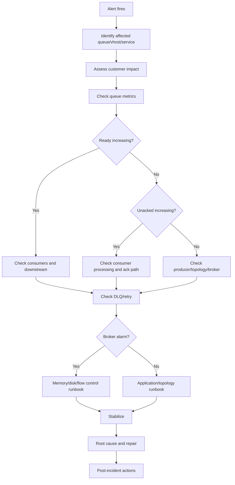
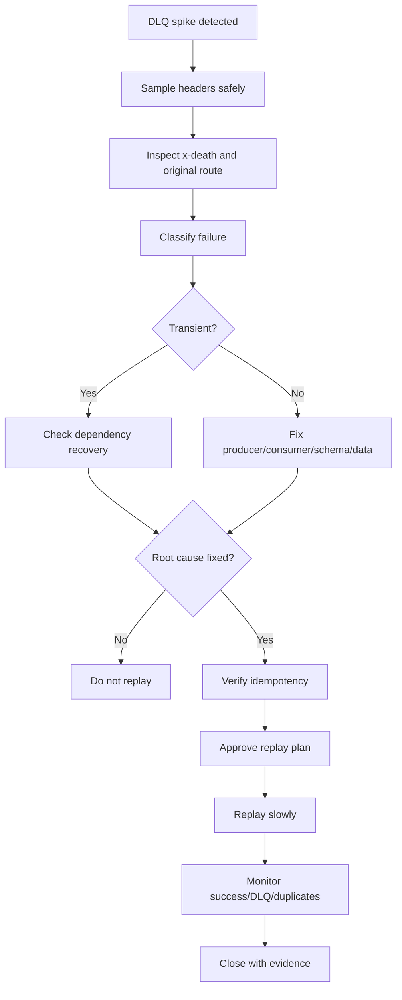

# Operational Runbook

## 1. Core idea

A RabbitMQ incident is rarely just a RabbitMQ incident.

It usually means one or more business workflows are no longer moving correctly.

Examples:

```text
quote submission stuck
pricing job delayed
approval task not delivered
order decomposition paused
fulfillment command not consumed
fallout queue growing
notification delayed
integration message trapped in retry
DLQ contains customer-impacting events
```

The purpose of a runbook is to provide a safe sequence of actions under pressure.

A good runbook helps you answer:

```text
What is broken?
Who is impacted?
Is the broker unhealthy or are consumers unhealthy?
Are messages safe?
Are messages duplicated?
Are messages delayed?
Are messages stuck?
Can we recover without replay?
If replay is needed, is it idempotent?
Should we rollback, scale, pause, drain, or escalate?
```

A senior backend engineer avoids heroic guessing.

They preserve evidence, stabilize the system, then act.

---

## 2. Incident triage model

Start with classification.

```text
producer-side issue
broker-side issue
queue/topology issue
consumer-side issue
downstream dependency issue
retry/DLQ issue
security/network issue
capacity/resource issue
schema/contract issue
manual replay/data repair issue
```

Symptoms often overlap.

Example:

```text
Queue depth increasing
```

Possible causes:

```text
consumer down
consumer too slow
consumer blocked on database
consumer failing and retrying
publisher spike
broker flow control
permission failure after deployment
schema change causing poison messages
Kubernetes rollout stopped workers
```

Never assume the first visible symptom is the root cause.

---

## 3. First 5 minutes checklist

When alerted:

```text
1. Identify affected environment.
2. Identify affected vhost.
3. Identify affected exchange/queue/routing key if known.
4. Check whether this is customer-impacting.
5. Check queue depth, ready, unacked, publish rate, deliver rate, ack rate, redelivery rate.
6. Check DLQ and retry queue size.
7. Check consumer count and consumer utilization.
8. Check broker node health, memory alarm, disk alarm, connection count, channel count.
9. Check recent deployments and topology changes.
10. Check application logs for producer/consumer errors.
11. Decide severity and escalation path.
```

Do not delete messages.

Do not purge queues.

Do not replay messages.

Do not change topology manually unless the impact and rollback path are understood.

---

## 4. Key metrics to inspect

For a queue:

```text
messages_ready
messages_unacknowledged
messages_total
publish_rate
deliver_rate
ack_rate
redeliver_rate
consumer_count
consumer_utilisation
```

For broker/node:

```text
memory_used
memory_alarm
disk_free
disk_alarm
fd_used
sockets_used
connection_count
channel_count
queue_count
message_store_read/write
node_running
partition status
```

For application:

```text
consumer error rate
consumer processing latency
DB transaction latency
external dependency latency
ack/nack count
DLQ publish count
idempotency conflict count
outbox backlog
inbox backlog
retry count distribution
```

---

## 5. Queue growth runbook

Symptom:

```text
messages_ready increasing
queue depth increasing
publish rate > ack rate
```

Possible causes:

```text
consumer down
consumer too slow
consumer count reduced
consumer stuck on DB/external service
publisher spike
prefetch too low or too high
Kubernetes rollout issue
permission/auth failure
schema poison messages
broker resource pressure
```

Immediate checks:

```text
queue messages_ready
queue messages_unacknowledged
consumer count
consumer utilisation
publish/deliver/ack rates
consumer logs
recent deployments
DB/external dependency health
DLQ/retry queue growth
```

Safe actions:

```text
scale consumers only if downstream can handle it
rollback recent bad consumer deployment if confirmed
pause or rate-limit producer if backlog threatens SLO
increase worker concurrency only if idempotency and ordering allow it
separate poison messages if they block processing
escalate to DB/downstream owner if consumer is blocked externally
```

Unsafe actions:

```text
purge queue without business approval
blindly increase consumers for ordering-sensitive queue
blindly increase prefetch under memory pressure
replay DLQ while root cause remains active
```

Business questions:

```text
What workflow is delayed?
Is backlog within acceptable recovery window?
Will processing old messages still be valid?
Are messages time-sensitive or expirable?
```

---

## 6. Unacked messages runbook

Symptom:

```text
messages_unacknowledged increasing
messages_ready may be low
consumer count > 0
ack rate low or zero
```

Meaning:

```text
RabbitMQ delivered messages to consumers, but consumers have not acknowledged them.
```

Possible causes:

```text
consumer processing slow
consumer thread pool stuck
DB transaction hanging
external API timeout
prefetch too high
consumer forgot to ack
channel stuck
application deadlock
consumer pod terminating poorly
```

Immediate checks:

```text
consumer logs
thread dumps if Java service is stuck
DB connection pool usage
external dependency latency
prefetch setting
consumer processing latency
Kubernetes pod status
recent code changes around ack path
```

Safe actions:

```text
restart stuck consumer if messages are idempotent
reduce prefetch if too many messages are held by each consumer
fix downstream dependency if processing is blocked
scale consumers only if unacked represents slow but healthy processing
let consumers finish if backlog is draining safely
```

Caution:

```text
When a consumer connection closes, unacked messages can be requeued/redelivered.
```

That can cause duplicate processing.

Before restarting consumers, verify idempotency.

---

## 7. Consumer down runbook

Symptom:

```text
consumer_count = 0
messages_ready increasing
no deliver rate
```

Possible causes:

```text
consumer deployment failed
Kubernetes pods crashlooping
auth/permission failure
TLS failure
queue name mismatch
vhost mismatch
network policy blocks broker
consumer disabled by feature flag
bad topology change
```

Immediate checks:

```text
pod status
application startup logs
RabbitMQ connection logs
authentication failures
permission failures
TLS errors
configured vhost/queue name
recent secret rotation
recent topology deployment
```

Safe actions:

```text
rollback consumer deployment if recent version fails
restore secret if rotation broke auth
restore permission if accidentally narrowed
fix queue/vhost config
scale deployment back to expected replicas
```

Do not create a new queue with a similar name just to make the consumer start.

That may split traffic or leave real messages behind.

---

## 8. Publisher failure runbook

Symptoms:

```text
publish errors
publisher confirm timeout
return listener receives unroutable message
channel closed
connection blocked
outbox backlog increasing
HTTP API returns 500 or 202 but no message appears
```

Possible causes:

```text
broker unavailable
exchange missing
wrong exchange type declaration
wrong routing key
missing binding
permission failure
TLS/network issue
memory/disk alarm blocks publishing
publisher confirm timeout due to broker pressure
application serialization failure
outbox poller broken
```

Immediate checks:

```text
publisher logs
confirm latency
return listener logs
outbox table backlog
RabbitMQ node alarms
exchange exists
binding exists
permission write regex
connection blocked metrics
recent topology changes
```

Safe actions:

```text
stop or slow publisher if broker blocked
fix unroutable topology before retrying
repair outbox poller if backlog is safe
rollback producer routing key change
restore exchange/binding if accidentally removed
```

Important:

```text
Do not blindly retry publish without understanding duplicate risk.
```

Outbox-based publishing should make duplicate publish safe through consumer idempotency.

Non-outbox publishing may require careful reconciliation.

---

## 9. DLQ spike runbook

Symptom:

```text
DLQ depth increasing
x-death count increasing
consumer failure rate rising
```

Possible causes:

```text
schema mismatch
invalid payload
consumer bug
downstream permanent failure
permission/business rule rejection
message expired
queue length overflow
quorum delivery limit reached
manual replay reintroduced poison messages
```

Immediate checks:

```text
DLQ message sample metadata
x-death header
original exchange/routing key
message type/version
consumer error logs
recent deployments
schema changes
business validation changes
retry count distribution
```

Safe actions:

```text
pause replay jobs
stop bad producer if producing invalid messages
rollback bad consumer if newly introduced
fix consumer if code bug
create repair plan for DLQ messages
classify messages by error type
```

Unsafe actions:

```text
bulk replay without fixing root cause
purge DLQ without business/data owner approval
log full sensitive payloads during investigation
```

DLQ is evidence.

Treat it like operational data, not trash.

---

## 10. Retry storm runbook

Symptoms:

```text
retry queue growing rapidly
redelivery rate high
same message appears repeatedly
consumer CPU high
DLQ eventually spikes
broker publish/deliver rates elevated without business progress
```

Possible causes:

```text
permanent failure classified as transient
downstream service outage
bad retry delay too short
infinite requeue loop
consumer nacks with requeue=true repeatedly
manual replay while system unhealthy
```

Immediate checks:

```text
redelivery rate
x-death count
retry count header
consumer error cause
retry delay configuration
DLX/DL routing
consumer nack/reject behavior
external dependency health
```

Safe actions:

```text
stop or scale down affected consumers if they amplify storm
pause replay
route poison messages to parking lot
increase retry delay only through approved topology/config change
fix classification between transient and permanent errors
protect downstream dependency with circuit breaker/rate limit
```

Key invariant:

```text
Retry must create time for recovery, not multiply failure traffic.
```

---

## 11. Memory alarm runbook

Symptoms:

```text
memory alarm active
publishers blocked
connection.blocked events
broker memory high
queue depth may grow
```

Possible causes:

```text
queue backlog
large messages
too many connections/channels
too many queues
unacked messages high
consumer slowdown
retry storm
misconfigured prefetch
insufficient broker memory
```

Immediate checks:

```text
memory_alarm status
memory_used
largest queues
unacked counts
connection/channel count
message size distribution if available
recent publisher spike
recent consumer outage
```

Safe actions:

```text
restore consumers if down
reduce publisher rate
stop retry storm
scale consumers if downstream can handle load
reduce prefetch if consumers hold too many messages
investigate connection/channel leaks
increase broker resources only if capacity issue confirmed
```

Unsafe actions:

```text
purging queues without business approval
scaling publishers during alarm
bulk replay during memory pressure
```

Memory alarm is broker self-protection.

Treat publisher blocking as a symptom, not the primary defect.

---

## 12. Disk alarm runbook

Symptoms:

```text
disk alarm active
publishing blocked
broker logs disk_free_limit warning
message store growth
```

Possible causes:

```text
persistent backlog
DLQ/retry queues growing
streams retention too large
large messages
broker logs filling disk
insufficient disk provisioning
consumer outage
stuck quorum queue replication/storage growth
```

Immediate checks:

```text
disk_free
disk_free_limit
largest queues/streams
DLQ size
retry queue size
stream retention
message publish rate
consumer ack rate
filesystem utilization
```

Safe actions:

```text
restore consumers and drain backlog
pause high-volume publishers if needed
move poison messages to parking lot with retention plan
adjust retention only with approval
increase disk capacity if infrastructure supports it
clean unrelated logs only if confirmed safe
```

Unsafe actions:

```text
manual deletion of broker data files
queue purge without approval
retention reduction without privacy/business review
```

Disk alarm can become severe because RabbitMQ needs disk headroom to operate safely.

Escalate early to platform/SRE.

---

## 13. Connection storm runbook

Symptoms:

```text
connection count spikes
broker CPU/network spikes
authentication rate high
many short-lived connections
Java apps reconnect repeatedly
```

Possible causes:

```text
application creates connection per message
bad connection pooling
Kubernetes rollout starts many pods at once
broker endpoint unstable
network flap
TLS handshake failures
secret rotation mismatch
load balancer issue
```

Immediate checks:

```text
connection count by client
connection churn rate
client properties
pod rollout events
authentication failure logs
TLS errors
network errors
heartbeat timeout logs
recent deployment
```

Safe actions:

```text
pause rollout
rollback bad client release
throttle reconnect/backoff
restore broker/network stability
fix connection lifecycle bug
scale rollout gradually
```

Java client invariant:

```text
Use long-lived connections and scoped channels; do not create a new TCP connection per publish.
```

---

## 14. Channel leak runbook

Symptoms:

```text
channel count grows continuously
connection count stable
broker memory increases
application eventually fails to open channel
```

Possible causes:

```text
publisher opens channel per message and never closes
consumer creates channels per task
error path skips channel close
connection recovery creates duplicate channels
thread lifecycle bug
```

Immediate checks:

```text
channel count by connection
client properties
application metrics
recent code changes around publisher/consumer abstraction
thread dump if channel ownership unclear
```

Safe actions:

```text
rollback leaking application
restart affected service as temporary mitigation
fix channel lifecycle
add channel count metric per app instance
add tests for close/error path
```

Do not fix channel leaks by increasing broker limits only.

That hides the bug until the next incident.

---

## 15. Node down runbook

Symptoms:

```text
RabbitMQ node unavailable
cluster degraded
queue leaders unavailable or moved
client reconnect spike
quorum queue availability changes
```

Possible causes:

```text
host failure
pod/node failure
storage issue
network partition
resource exhaustion
upgrade failure
certificate/secret issue
```

Immediate checks:

```text
cluster node status
which node is down
which queues had leaders on that node
quorum queue replica majority
Kubernetes pod/PVC status if applicable
cloud/on-prem host health
broker logs
client reconnect logs
```

Safe actions:

```text
follow platform/SRE node recovery process
avoid restarting multiple nodes at once
verify quorum majority before disruptive action
monitor leader election and queue availability
throttle clients if reconnect storm occurs
```

Application-side checks:

```text
publisher confirm timeout
consumer redelivery
connection recovery
outbox backlog
queue depth after recovery
```

---

## 16. Cluster partition runbook

Symptoms:

```text
cluster reports partition
nodes disagree on cluster state
client behavior inconsistent
queue availability issues
```

Possible causes:

```text
network split
DNS/routing issue
firewall/security group change
Kubernetes CNI issue
cross-zone connectivity issue
```

Immediate checks:

```text
RabbitMQ cluster partition status
network connectivity between nodes
Kubernetes node/network events
cloud network changes
broker logs
queue leader distribution
quorum queue majority
```

Safe actions:

```text
escalate to platform/SRE immediately
preserve logs and evidence
avoid manual cluster surgery without expert approval
restore network connectivity
follow documented partition handling procedure
```

Do not improvise cluster recovery commands in production.

Partition handling can affect data safety.

---

## 17. Certificate expiry runbook

Symptoms:

```text
TLS handshake failure
clients cannot connect
management UI inaccessible over TLS
federation/shovel connection failure
sudden auth/network errors after cert rotation
```

Possible causes:

```text
server certificate expired
client certificate expired
CA bundle mismatch
wrong SAN
secret rotation incomplete
pods not restarted after secret update
truststore not updated in Java service
```

Immediate checks:

```text
certificate expiry date
server cert chain
client truststore
Kubernetes Secret or cloud secret version
recent rotation job
Java SSL error logs
RabbitMQ TLS listener logs
```

Safe actions:

```text
restore valid certificate
restart components that need to reload certs
verify truststore/keystore update
test connection from representative client pod
monitor reconnect and auth failures
```

Preventive controls:

```text
certificate expiry alerting
rotation rehearsal
documented owner
staging validation before prod rotation
```

---

## 18. Bad topology change runbook

Symptoms:

```text
unroutable messages after deploy
consumer stops receiving
permission failures
DLQ/retry path broken
queue created with wrong type
policy unexpectedly affects queues
```

Immediate checks:

```text
recent topology commits
recent manual UI/API changes
actual exchange type
actual bindings
actual queue arguments
policy/operator policy match
permissions
producer routing key
consumer queue name
```

Safe actions:

```text
restore missing binding
restore permission
restore DLX if safe
rollback application routing key change
apply forward-fix topology change
pause producer if messages are being dropped/unroutable
```

Caution:

```text
If messages were already published unroutably and not captured by alternate exchange, RabbitMQ may not have them.
```

This becomes a data reconstruction problem from outbox, logs, database state, or upstream system.

---

## 19. Message replay runbook

Replay is dangerous.

It can create duplicate side effects.

Use replay only after root cause is understood.

Pre-replay checklist:

```text
root cause fixed
message class identified
affected time range known
target consumer version known
idempotency verified
business owner approves
privacy owner approves if sensitive payloads exist
expected duplicate behavior documented
replay rate limit defined
monitoring ready
rollback/stop condition defined
```

Replay options:

```text
DLQ to original exchange
parking lot to retry exchange
outbox republish
manual script publish
broker shovel-based movement if approved
application-level repair command
```

Replay monitoring:

```text
replay count
success count
failure count
DLQ after replay
duplicate/idempotency conflict count
consumer latency
DB load
customer-visible state changes
```

Stop replay if:

```text
DLQ starts growing again
same error recurs
DB load becomes unsafe
duplicate side effects appear
ordering-sensitive workflow becomes inconsistent
```

---

## 20. Queue purge decision

Purging a queue deletes messages.

It is rarely a purely technical decision.

Before purge:

```text
identify message type
identify business owner
identify customer impact
sample metadata safely
confirm messages are obsolete or reconstructible
capture count and evidence
obtain approval
record incident note
```

Valid reasons may include:

```text
test environment cleanup
known invalid poison messages with repair completed
expired non-business-critical notifications
duplicate backlog already reconstructed safely
```

Invalid reasons:

```text
queue depth graph looks ugly
we want alert to stop
we do not understand these messages
consumer code is failing and purge seems easier
```

---

## 21. Customer impact assessment

For every incident, map technical state to business state.

Technical signal:

```text
quote.approval.worker.q depth = 50,000
```

Business impact questions:

```text
Are quote approvals delayed?
Which customers/accounts/tenants are affected?
Are SLAs breached?
Can users retry safely?
Will duplicate processing create duplicate orders/notifications?
Can stale messages still be processed?
Is manual intervention needed?
```

Severity should be based on business impact, not just queue depth.

---

## 22. Communication checklist

For incident updates, communicate:

```text
current symptom
business impact
affected services/environment
what is known
what is not known
current mitigation
risk of duplicate/delayed/lost messages
next checkpoint
owners involved
customer-facing implication if any
```

Avoid saying:

```text
RabbitMQ is broken
```

Prefer:

```text
Approval worker queue is accumulating because consumers are failing validation after deployment X. Publishing is healthy. Messages are preserved. We paused replay and are rolling back the consumer while monitoring DLQ and queue drain rate.
```

Precision reduces panic.

---

## 23. Incident severity guide

Example severity mapping:

### SEV1

```text
critical quote/order workflow stopped
broker unavailable across production
message loss suspected for business-critical flow
large-scale duplicate side effects occurring
security/privacy exposure through messaging
```

### SEV2

```text
major queue backlog threatening SLA
DLQ spike for important workflow
single RabbitMQ node failure with degraded redundancy
retry storm stressing downstream systems
publisher blocked for important service
```

### SEV3

```text
localized queue delay
non-critical notification backlog
single consumer group degraded but recovering
known DLQ with contained impact
```

### SEV4

```text
non-prod issue
monitoring anomaly without customer impact
minor drift detected
runbook/documentation gap
```

Use internal incident policy if it exists.

This mapping is conceptual.

---

## 24. Stabilization before root cause

In production, first stabilize.

Stabilization actions:

```text
pause bad producer
scale known-good consumers
rollback bad consumer
stop retry storm
disable unsafe replay
restore missing binding
restore credentials
rate-limit ingress
protect downstream dependency
```

Root cause follows after safety.

But do not destroy evidence.

Capture:

```text
message counts
sample headers
x-death
logs
recent deploys
topology diff
metrics graphs
broker node state
```

---

## 25. Java/JAX-RS service runbook items

For producer APIs:

```text
check HTTP error rate
check outbox backlog
check publisher confirm latency
check return listener/unroutable count
check connection blocked logs
check serialization errors
check idempotency key behavior
```

For consumers:

```text
check processing latency
check ack/nack rate
check exception classification
check DB transaction latency
check external call latency
check idempotency conflicts
check inbox table backlog
check shutdown/restart events
```

For async status endpoint:

```text
check whether status reflects queue backlog
check whether users are retrying commands
check duplicate submission risk
check stale pending states
```

---

## 26. PostgreSQL/MyBatis runbook items

RabbitMQ incidents often involve database state.

Check:

```text
outbox rows pending
outbox rows failed
outbox lock contention
outbox poller lag
inbox processed message table
idempotency unique constraint violations
state transition table
DB connection pool saturation
long-running transactions
deadlocks
serialization errors
```

Common diagnosis:

```text
RabbitMQ queue grows because consumer cannot commit DB transaction.
```

In that case, scaling consumers may make DB pressure worse.

---

## 27. Kubernetes runbook items

Check:

```text
pod restarts
CrashLoopBackOff
OOMKilled
CPU throttling
readiness failures
rolling update status
HPA scaling events
node drain events
secret/config rollout
DNS resolution
NetworkPolicy changes
preStop hook behavior
terminationGracePeriodSeconds
```

For consumers:

```text
Did rollout terminate pods with unacked messages?
Did new pods reconnect successfully?
Did replica count change prefetch multiplication?
Did CPU throttling slow processing?
```

---

## 28. Cloud/on-prem runbook items

For managed cloud broker:

```text
maintenance event
broker failover
instance storage pressure
cloud monitoring alarms
security group/NSG changes
secret rotation
certificate update
provider service health
```

For on-prem:

```text
host health
disk filesystem
network firewall
certificate store
OS limits
patching event
monitoring agent health
backup status
```

Do not assume platform ownership.

Clarify responsibility boundary.

---

## 29. Mermaid: incident triage flow



---

## 30. Mermaid: DLQ handling flow



---

## 31. Post-incident review checklist

After incident:

```text
What was the first signal?
Was alert actionable?
Was customer impact clear?
Was topology documented?
Were producer and consumer logs sufficient?
Were correlation IDs available?
Was DLQ useful?
Was replay safe?
Was idempotency sufficient?
Was runbook accurate?
Was ownership clear?
What guardrail would have prevented this?
```

Action item categories:

```text
code fix
topology fix
policy fix
monitoring fix
alert threshold fix
runbook update
capacity change
security/permission change
CI/CD validation
contract test
load test
chaos test
team ownership clarification
```

---

## 32. Internal verification checklist

Use this checklist in the actual CSG/team environment.

### 32.1 Runbook ownership

Verify:

```text
Who owns RabbitMQ broker incidents?
Who owns application consumer incidents?
Who owns DLQ replay?
Who approves queue purge?
Who approves topology emergency changes?
Who communicates customer impact?
```

### 32.2 Dashboards and alerts

Verify:

```text
queue depth alerts
unacked alerts
DLQ alerts
retry queue alerts
consumer count alerts
memory alarm alerts
disk alarm alerts
connection/channel count alerts
publisher confirm latency alerts
outbox backlog alerts
```

### 32.3 Incident history

Verify:

```text
previous RabbitMQ incidents
common failure modes
recurring DLQ causes
recurring retry storms
known weak consumers
known topology drift
known capacity bottlenecks
```

### 32.4 Replay and repair

Verify:

```text
approved replay tool
replay rate limit
idempotency guarantee
replay audit log
DLQ payload privacy handling
business approval path
data repair scripts
```

### 32.5 Platform boundary

Verify:

```text
managed vs self-managed broker
SRE escalation path
cloud/on-prem support process
maintenance window policy
backup/restore owner
certificate rotation owner
secret rotation owner
```

---

## 33. Production-safe command discipline

Before running any RabbitMQ operational command, ask:

```text
Is this read-only?
If write/destructive, what messages/resources can be affected?
Is there approval?
Is there a rollback or forward-fix?
Have we captured evidence?
Is this the right vhost/environment?
```

Safe default:

```text
observe first
sample metadata safely
change slowly
avoid destructive actions
```

Dangerous actions:

```text
purge queue
delete queue
delete exchange
remove binding
change policy pattern
reduce TTL/retention
bulk replay
restart multiple cluster nodes
manual cluster recovery without SRE approval
```

---

## 34. Senior engineer mental model

RabbitMQ operations is about preserving business progress under failure.

The broker is only one layer.

A complete operational model includes:

```text
producer correctness
broker health
topology correctness
queue health
consumer correctness
downstream dependency health
retry/DLQ containment
idempotency/replay safety
observability
incident communication
```

The most important operational questions:

```text
Are messages safe?
Are messages moving?
Are messages duplicated?
Are messages delayed?
Are messages obsolete?
Can we recover automatically?
If not, can we repair safely?
```

Good runbooks make these questions answerable during pressure.

---

## 35. References

- RabbitMQ Documentation: Monitoring
- RabbitMQ Documentation: Prometheus and Grafana
- RabbitMQ Documentation: Production Deployment Guidelines
- RabbitMQ Documentation: Alarms
- RabbitMQ Documentation: Flow Control
- RabbitMQ Documentation: Consumer Acknowledgements and Publisher Confirms
- RabbitMQ Documentation: Dead Letter Exchanges
- RabbitMQ Documentation: TTL
- RabbitMQ Documentation: Clustering
- RabbitMQ Documentation: Networking
