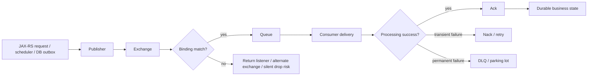

# Troubleshooting Playbook

## 1. Core idea

Troubleshooting RabbitMQ is not guessing where the message went.

It is reconstructing the message lifecycle across four boundaries:

```text
application boundary
broker topology boundary
consumer processing boundary
durable state boundary
```

A message can fail at many points:

```text
JAX-RS request accepted but no outbox row created
outbox row created but publisher did not publish
publisher published but exchange did not route
message routed but queue has no active consumer
consumer received but did not ack
consumer acked before durable side effect
consumer repeatedly failed and requeued
message dead-lettered but nobody checks DLQ
message replayed and processed twice
```

A senior engineer does not start with "RabbitMQ lost the message".

Start with evidence.

RabbitMQ can lose data if the application uses unsafe semantics: auto-ack, transient messages, non-durable topology, no publisher confirms, unsafe replay, or ack-before-commit. But in most production incidents, the root cause is one of these:

```text
bad routing key
missing binding
wrong vhost
permission failure
publisher confirm ignored
consumer down
consumer stuck
consumer crash loop
unacked pile-up
requeue loop
poison message
DLQ not monitored
retry topology bug
schema incompatibility
idempotency bug
downstream database/service unavailable
Kubernetes rollout drained consumers incorrectly
flow control blocking publishers
memory or disk alarm
certificate or credential expiry
```

Troubleshooting RabbitMQ well means reducing uncertainty in the right order.

---

## 2. Golden debugging path

Use this sequence before jumping into repair.

```text
1. Identify the business flow.
2. Identify producer service.
3. Identify exchange.
4. Identify routing key.
5. Identify binding.
6. Identify queue.
7. Identify consumer service.
8. Identify ack/retry/DLQ behavior.
9. Identify durable side effect.
10. Identify observability evidence.
```

The generic path:



Every incident can be mapped to one edge in this graph.

---

## 3. Production-safe rules

Before any manual action:

```text
Do not purge queue unless impact is understood.
Do not requeue DLQ blindly.
Do not replay messages before verifying idempotency.
Do not scale consumers blindly if downstream is failing.
Do not restart broker as first response.
Do not assume queue depth means broker is broken.
Do not assume empty queue means processing succeeded.
Do not trust logs without correlation/message IDs.
Do not change topology in production without rollback plan.
```

Safe first actions:

```text
inspect only
snapshot metrics
capture sample message metadata
capture routing topology
capture consumer logs
capture deployment version
capture relevant DB state
identify recent changes
confirm owner and business impact
```

If the incident involves customer-impacting CPQ/order flow, prioritize preserving message evidence over fast cleanup.

---

## 4. Symptom: message not published

### What it means

The application intended to publish, but no message reached the broker or no durable publish evidence exists.

Possible causes:

```text
HTTP request failed before reaching service layer
transaction rollback removed outbox row
publisher code not executed
outbox poller stopped
publisher connection failed
channel closed
authentication failed
permission denied
publisher confirm timed out
flow control blocked connection
serialization failed before publish
application swallowed publish exception
```

### Debugging path

Check producer side first:

```text
1. Locate request correlation ID.
2. Check JAX-RS access log.
3. Check service-layer business transaction.
4. Check outbox row exists.
5. Check outbox status: NEW, LOCKED, PUBLISHED, FAILED.
6. Check publisher logs by message ID.
7. Check publisher confirm result.
8. Check channel/connection errors.
9. Check broker connection count from producer.
10. Check Management UI for publish rate.
```

### Java/JAX-RS concerns

Common bug:

```java
businessRepository.save(entity);
rabbitPublisher.publish(event); // publish succeeds/fails outside DB atomicity
```

Safer shape:

```java
transactionTemplate.execute(status -> {
    businessRepository.save(entity);
    outboxRepository.insert(eventEnvelope);
    return null;
});
```

Then a separate publisher publishes the outbox row and marks it published only after confirm.

### PostgreSQL/MyBatis/JDBC concerns

Check:

```sql
select id, aggregate_id, event_type, status, attempt_count, created_at, last_error
from outbox_event
where correlation_id = :correlation_id
order by created_at desc;
```

If no outbox row exists, RabbitMQ is not the first suspect.

The business transaction may have rolled back, or the code path never created an event.

### Internal verification checklist

```text
Which code path creates the message?
Is publish direct or outbox-based?
Is publisher confirm required?
Where is publish failure persisted?
Are publish exceptions logged with correlation/message ID?
Can the team query outbox by business ID?
Does the producer expose publish success/failure metrics?
```

---

## 5. Symptom: message published but unroutable

### What it means

The broker accepted a publish to an exchange, but no queue matched the exchange/routing key/binding combination.

Possible causes:

```text
wrong exchange name
wrong routing key
binding missing
binding wildcard mismatch
wrong vhost
exchange exists in one environment but not another
topology drift
case sensitivity
producer deployed before topology migration
queue renamed without updating binding
```

### Important RabbitMQ behavior

Publishing to an exchange does not guarantee delivery to a queue.

A message can be accepted by RabbitMQ and still be unroutable.

Protection mechanisms:

```text
mandatory flag
return listener
alternate exchange
topology-as-code validation
startup topology assertion
publisher metrics for returned messages
```

### Debugging path

```text
1. Check exchange exists in the same vhost.
2. Check exchange type.
3. Check routing key emitted by producer.
4. Check queue bindings.
5. Test binding match manually in Management UI or definitions.
6. Check returned-message logs if mandatory=true.
7. Check alternate exchange queue if configured.
8. Check recent topology deployment.
9. Compare environment definitions.
```

### Topic exchange wildcard trap

```text
* matches exactly one word
# matches zero or more words
```

Example:

```text
routing key: order.submitted.eu.enterprise
binding:     order.*
result:      no match
```

The binding only matches two words, not four.

### Internal verification checklist

```text
Is mandatory flag enabled for critical publishers?
Is return listener implemented and monitored?
Is alternate exchange configured?
Are unroutable messages counted and alerted?
Is topology declared by GitOps/definitions/Helm/operator?
Are routing keys centrally documented?
```

---

## 6. Symptom: message routed but not consumed

### What it means

Messages are in a queue but not being delivered or not being processed.

Possible causes:

```text
consumer count is zero
consumer connected to wrong vhost
consumer connected to wrong queue
consumer cancelled by broker
consumer app crash loop
consumer failed authentication
consumer has permission issue
consumer prefetch exhausted due to unacked messages
consumer blocked on database/API
consumer thread pool exhausted
queue is paused by policy/operator issue
connection unstable
```

### Debugging path

```text
1. Check queue depth: ready vs unacked.
2. Check consumer count.
3. Check consumer utilisation.
4. Check deliver rate and ack rate.
5. Check consumer logs for startup/cancellation errors.
6. Check Kubernetes deployment/pod status.
7. Check DB/API dependency latency.
8. Check prefetch and concurrency.
9. Check channel closures.
10. Check recent deploy version.
```

### Ready vs unacked

```text
ready high, unacked low  -> consumer not receiving enough or absent
ready low, unacked high  -> consumer received but not acking
ready high, unacked high -> consumer too slow or stuck under load
```

### Internal verification checklist

```text
Does the queue have active consumers?
Are consumers connected to expected vhost/queue?
Are consumers healthy in Kubernetes?
Is consumer utilisation low or high?
Is DB connection pool saturated?
Are messages stuck unacked after deployment?
```

---

## 7. Symptom: queue depth increasing

### What it means

Ingress exceeds successful processing rate.

Possible causes:

```text
publisher spike
consumer down
consumer slower than expected
consumer retrying internally before ack
consumer blocked on downstream dependency
prefetch too low
consumer concurrency too low
DB pool exhausted
broker flow control
network latency
message size increased
poison message blocking serial processing
single active consumer bottleneck
```

### Debugging path

```text
1. Compare publish rate vs ack rate.
2. Check deliver rate.
3. Check consumer count.
4. Check consumer utilisation.
5. Check ready/unacked split.
6. Check redelivery rate.
7. Check DLQ/retry queues.
8. Check downstream database/API latency.
9. Check recent traffic spike or batch job.
10. Check message size change.
```

### Do not scale blindly

Scaling consumers helps only if the bottleneck is consumer capacity.

It can make things worse if the bottleneck is:

```text
database lock contention
external API rate limit
shared downstream service
transaction deadlock
connection pool limit
poison message loop
non-idempotent processing
strict ordering requirement
```

### Internal verification checklist

```text
What is normal queue depth baseline?
What is normal publish/ack rate?
Is queue depth expected during batch windows?
Does the queue have a drain-time SLO?
Is alert threshold based on business delay or raw depth?
Which downstream dependency limits processing?
```

---

## 8. Symptom: unacked messages increasing

### What it means

RabbitMQ delivered messages to consumers, but consumers have not acknowledged them.

Possible causes:

```text
consumer processing slow
consumer hung
consumer thread pool saturated
manual ack forgotten
ack attempted on wrong channel
exception path skips ack/nack
long-running transaction
external call timeout
consumer has high prefetch
consumer shutdown not draining properly
```

### Debugging path

```text
1. Check consumer logs for processing start without finish.
2. Check application thread dumps if possible.
3. Check DB active queries and locks.
4. Check external API latency/timeouts.
5. Check prefetch count.
6. Check consumer concurrency.
7. Check JVM CPU/memory/GC.
8. Check pod restarts and OOMKills.
9. Check ack/nack exception handling.
10. Check whether unacked drops after consumer restart.
```

### Java consumer bug pattern

Bad:

```java
try {
    process(message);
    channel.basicAck(deliveryTag, false);
} catch (Exception e) {
    log.error("processing failed", e);
    // message remains unacked until channel closes
}
```

Better:

```java
try {
    process(message);
    channel.basicAck(deliveryTag, false);
} catch (RetryableException e) {
    channel.basicNack(deliveryTag, false, false); // route to retry/DLX topology
} catch (PermanentException e) {
    channel.basicReject(deliveryTag, false); // DLQ/parking lot
}
```

### Internal verification checklist

```text
Is manual ack used?
Can every exception path ack/nack/reject?
Is delivery tag acknowledged on the same channel?
Does processing use bounded timeout?
Does pod shutdown drain in-flight deliveries?
```

---

## 9. Symptom: redelivery loop

### What it means

Messages are repeatedly delivered, fail, and return to the queue or retry path.

Possible causes:

```text
nack requeue=true
consumer crash before ack
poison message
schema mismatch
bad data
external dependency always failing
idempotency constraint violation treated as failure
retry topology routes back too quickly
no retry count limit
```

### Debugging path

```text
1. Check redelivery rate.
2. Sample message headers and redelivered flag.
3. Check x-death header if DLX path is used.
4. Check consumer error logs by message ID.
5. Identify whether failure is transient or permanent.
6. Check requeue=true usage.
7. Check retry count and backoff.
8. Check DLQ routing.
9. Check poison message quarantine.
```

### Correctness concern

A redelivery loop can amplify side effects.

Examples:

```text
same email sent repeatedly
same downstream command sent repeatedly
same external order submitted repeatedly
same payment/charge attempted repeatedly
same state transition retried after partial success
```

Idempotency is not optional for at-least-once consumers.

### Internal verification checklist

```text
Is requeue=true allowed anywhere?
Is retry count bounded?
Does DLQ receive permanent failures?
Does consumer distinguish duplicate success from failure?
Are side effects idempotent?
```

---

## 10. Symptom: DLQ increasing

### What it means

Messages are being dead-lettered because they were rejected/nacked without requeue, expired by TTL, exceeded length/delivery limit, or otherwise routed by DLX policy.

Possible causes:

```text
consumer permanent failure
schema incompatibility
permission issue in downstream system
business validation failure
message TTL expired
retry attempts exhausted
queue length overflow
quorum delivery limit reached
bad deployment introduced poison messages
```

### Debugging path

```text
1. Check DLQ growth rate.
2. Inspect sample x-death headers.
3. Group DLQ messages by message type/version/source service/error class.
4. Check first-death queue/exchange/reason.
5. Compare with deployment timeline.
6. Check consumer logs by correlation/message ID.
7. Classify replayable vs non-replayable messages.
8. Confirm idempotency before replay.
9. Decide: fix consumer, repair data, replay, archive, or escalate.
```

### x-death fields to inspect

```text
queue
exchange
routing-keys
reason
count
time
original-expiration
```

### Internal verification checklist

```text
Are DLQs monitored and owned?
Is there a DLQ triage dashboard?
Can DLQ messages be grouped by error reason?
Is manual replay audited?
Is replay idempotent and permission-controlled?
```

---

## 11. Symptom: retry queue stuck

### What it means

Messages enter retry but never return to the main queue, or they return too fast and cause storms.

Possible causes:

```text
wrong DLX on retry queue
wrong dead-letter routing key
missing binding from retry exchange to main queue
TTL not configured
per-message expiration malformed
delayed exchange plugin missing or disabled
x-death parsing bug
retry count not incremented as expected
routing loop between retry and DLQ
```

### Debugging path

```text
1. Inspect retry queue arguments/policy.
2. Check x-message-ttl or per-message expiration.
3. Check dead-letter-exchange and dead-letter-routing-key.
4. Check binding back to main exchange/queue.
5. Check delayed exchange plugin if used.
6. Check x-death header evolution.
7. Publish test message in non-production environment.
8. Compare definitions across environments.
```

### Internal verification checklist

```text
Is retry topology declared as code?
Is retry delay controlled by policy or application?
Is retry count bounded?
Is parking lot queue separate from retry queue?
Is replay tooling aware of retry metadata?
```

---

## 12. Symptom: publisher confirm timeout

### What it means

Producer published a message but did not receive broker confirmation within expected time.

Possible causes:

```text
broker overloaded
network latency
disk IO slow
quorum queue replication delayed
flow control
connection blocked
channel closed
publisher confirm listener bug
confirm timeout too aggressive
large batch under sustained load
```

### Debugging path

```text
1. Check broker memory/disk alarm.
2. Check flow control / blocked connection.
3. Check queue type: classic, quorum, stream.
4. Check disk latency and persistent message rate.
5. Check network latency between producer and broker.
6. Check publish batch size.
7. Check confirm timeout configuration.
8. Check whether message eventually arrived.
9. Check duplicate publish handling.
```

### Correct handling

Confirm timeout is ambiguous.

The message may have:

```text
not reached broker
reached broker but confirm delayed
been persisted but confirm lost due to connection failure
been routed and consumed already
```

Therefore publisher retry can create duplicates.

Use message ID + idempotent consumer.

### Internal verification checklist

```text
What confirm timeout is configured?
Does timeout trigger retry publish?
Is duplicate publish safe?
Are confirms correlated to outbox row IDs?
Are confirm latency metrics collected?
```

---

## 13. Symptom: connection blocked

### What it means

RabbitMQ is applying backpressure to publishers because broker resources are under pressure.

Common causes:

```text
memory alarm
disk alarm
queue growth
slow consumers
large messages
persistent message backlog
retry storm
quorum replication pressure
```

### Debugging path

```text
1. Check alarm status.
2. Check memory usage and watermark.
3. Check disk free limit.
4. Check queue growth by vhost.
5. Check largest queues.
6. Check publish vs ack rate.
7. Check consumers and downstream dependencies.
8. Check message size.
9. Check recent traffic spike.
10. Reduce ingress or restore consumers before restarting broker.
```

### Java behavior

Java publisher code must handle blocked/unblocked connection notifications if the client abstraction supports it.

At minimum, expose:

```text
blocked connection count
blocked duration
publish latency
confirm latency
outbox backlog
```

### Internal verification checklist

```text
Are connection.blocked/unblocked events logged?
Does outbox poller slow down when blocked?
Are application retries making pressure worse?
Is queue growth caused by one tenant or one message type?
Is platform/SRE runbook clear on disk/memory alarms?
```

---

## 14. Symptom: channel closed

### What it means

RabbitMQ closed the AMQP channel because of protocol error, topology mismatch, permission issue, invalid ack, or application misuse.

Common causes:

```text
ack with unknown delivery tag
ack on wrong channel
declare queue with different arguments
publish to missing exchange
permission denied
precondition failed
channel used concurrently across threads
consumer exception closes channel wrapper
```

### Debugging path

```text
1. Check exception class and reply code.
2. Check broker logs for channel exception.
3. Check topology declaration mismatch.
4. Check permission errors.
5. Check ack delivery tag usage.
6. Check channel sharing across threads.
7. Check automatic recovery behavior.
8. Check if channel is recreated safely.
```

### Typical precondition failure

If a queue already exists with one set of arguments, declaring it with different arguments can close the channel.

Examples:

```text
same queue name, different durable flag
same queue name, different x-queue-type
same queue name, different DLX argument
same queue name, different max length
```

### Internal verification checklist

```text
Does application declare topology at startup?
Is topology declaration identical across services?
Is topology owned by GitOps instead of app startup?
Are channel exceptions surfaced as metrics?
Is channel sharing prohibited in code review?
```

---

## 15. Symptom: authentication failure

### What it means

Client cannot authenticate to RabbitMQ.

Possible causes:

```text
wrong username/password
expired secret
rotated credential not deployed
wrong vhost in connection URI
wrong auth backend
LDAP/OAuth2 issue if used
certificate auth mapping issue if mTLS used
```

### Debugging path

```text
1. Check connection URI without exposing secret.
2. Check username and vhost.
3. Check secret version mounted in pod.
4. Check recent credential rotation.
5. Check RabbitMQ auth backend logs.
6. Check Management UI user state.
7. Check environment variable/config map mismatch.
8. Check Kubernetes Secret reload behavior.
```

### Internal verification checklist

```text
Where are RabbitMQ credentials stored?
Is secret rotation documented?
Do apps reload secrets or require restart?
Are credentials per service or shared?
Are failed logins alerted?
```

---

## 16. Symptom: permission failure

### What it means

Client authenticated successfully but lacks configure/write/read permissions for the requested resource.

Common cases:

```text
publisher lacks write permission on exchange
consumer lacks read permission on queue
service tries to declare topology without configure permission
wrong vhost permission
topic permission blocks routing key
management user can see but app cannot access
```

### Debugging path

```text
1. Identify user and vhost.
2. Identify operation: configure/write/read.
3. Identify resource: exchange/queue/routing key.
4. Check permission regex.
5. Check topic permission if topic authorization is enabled.
6. Check whether app is declaring topology unexpectedly.
7. Check least-privilege policy.
```

### Internal verification checklist

```text
Does service need configure permission?
Can service only write expected exchanges?
Can service only read expected queues?
Are permissions environment-specific?
Are permission changes GitOps-managed?
```

---

## 17. Symptom: TLS failure

### What it means

TCP connection may exist, but TLS negotiation or certificate validation fails.

Possible causes:

```text
wrong TLS port
expired certificate
wrong CA truststore
hostname verification failure
client certificate missing
mTLS required but not configured
protocol/cipher mismatch
intermediate certificate missing
Kubernetes secret not refreshed
```

### Debugging path

```text
1. Confirm endpoint and port.
2. Check certificate expiry.
3. Check server certificate chain.
4. Check client truststore.
5. Check hostname/SAN.
6. Check mTLS client cert/key if required.
7. Check Java SSL debug logs in lower environment.
8. Check network proxy/LB TLS termination behavior.
```

### Internal verification checklist

```text
Who owns RabbitMQ certificates?
How is expiry monitored?
Is mTLS required?
Are truststores bundled or injected?
Does app validate hostname?
Is certificate rotation tested?
```

---

## 18. Symptom: broker unavailable

### What it means

Client cannot reach a usable RabbitMQ broker endpoint.

Possible causes:

```text
broker node down
load balancer unhealthy
DNS issue
network policy block
firewall/security group change
Kubernetes service issue
cluster partition
maintenance window
managed broker failover
certificate/secret issue misread as availability
```

### Debugging path

```text
1. Check DNS resolution from application namespace/host.
2. Check TCP connectivity to AMQP/TLS port.
3. Check load balancer target health.
4. Check RabbitMQ node status.
5. Check cluster status.
6. Check Kubernetes pods/services/endpoints if self-managed.
7. Check cloud provider maintenance/failover events.
8. Check client reconnect behavior.
```

### Internal verification checklist

```text
Is endpoint single-node or load-balanced?
Do clients use multiple addresses?
Is automatic recovery enabled?
Is DNS TTL appropriate?
Is failover tested?
```

---

## 19. Symptom: node alarm

### What it means

The broker is warning that memory or disk state is unsafe.

Possible causes:

```text
message backlog
large messages
slow consumers
persistent message accumulation
retry storm
DLQ not drained
insufficient disk
memory watermark too low/high
unbounded queue
unexpected traffic spike
```

### Debugging path

```text
1. Identify alarm type.
2. Identify affected node.
3. Identify largest queues on that node.
4. Check message rates and backlog.
5. Check disk free and disk IO.
6. Check memory usage and queue process memory.
7. Check retry/DLQ growth.
8. Reduce ingress or restore consumers.
9. Avoid restart unless advised by runbook/SRE.
```

### Internal verification checklist

```text
Are memory/disk alarms alerted?
Is disk sized for backlog and replay windows?
Are max-length policies used for non-critical queues?
Are large messages prohibited?
Is DLQ retention controlled?
```

---

## 20. Symptom: cluster issue

### What it means

RabbitMQ cluster membership, metadata, quorum queue availability, or node communication is unhealthy.

Possible causes:

```text
node down
network partition
DNS/peer discovery failure
quorum majority unavailable
rolling upgrade issue
Kubernetes node drain
persistent volume attach issue
Erlang cookie mismatch
clock/network instability
```

### Debugging path

```text
1. Check cluster status.
2. Check node health.
3. Check quorum queue leader/follower state.
4. Check network connectivity between nodes.
5. Check peer discovery logs.
6. Check Kubernetes pod/PV events if applicable.
7. Check recent rolling upgrade or node drain.
8. Check whether affected queues have quorum majority.
9. Escalate to platform/SRE before destructive repair.
```

### Internal verification checklist

```text
What is cluster size?
Where are quorum replicas placed?
Is anti-affinity configured?
Is partition handling documented?
Is rolling upgrade tested?
```

---

## 21. Symptom: ordering issue

### What it means

Messages were processed in an order different from business expectation.

Possible causes:

```text
multiple consumers
high prefetch
parallel processing
redelivery
requeue
retry queue
priority queue
stream partitioning
publisher emits events out of transaction order
outbox poller parallelism
per-aggregate messages routed to different queues
```

### Debugging path

```text
1. Identify aggregate ID.
2. Collect message IDs and created/published/processed timestamps.
3. Check routing keys and target queues.
4. Check consumer count and prefetch.
5. Check retry/redelivery history.
6. Check outbox ordering by DB sequence/time.
7. Check whether ordering requirement was documented.
8. Check if single active consumer or per-aggregate routing is needed.
```

### Internal verification checklist

```text
Which flows require ordering?
Is ordering per queue, per aggregate, or global?
Does retry topology break ordering?
Does consumer process in parallel?
Are outbox rows published in deterministic order?
```

---

## 22. Symptom: duplicate processing

### What it means

The same logical message or command was processed more than once.

Possible causes:

```text
publisher retry after ambiguous confirm
consumer crash after side effect before ack
manual replay
redelivery after connection loss
outbox duplicate publish
no idempotency key
inbox table missing
business uniqueness constraint missing
external API not idempotent
```

### Debugging path

```text
1. Identify logical idempotency key.
2. Check message ID and correlation ID.
3. Check outbox attempts.
4. Check inbox/processed-message table.
5. Check consumer ack timing.
6. Check redelivery flag/x-death.
7. Check manual replay audit.
8. Check business table for duplicate state transition.
9. Determine whether duplicate was harmful or harmless.
```

### Internal verification checklist

```text
Is duplicate handling explicitly tested?
Does consumer have inbox table or unique constraint?
Are external calls idempotent?
Is manual replay audited?
Can duplicate success be treated as ackable success?
```

---

## 23. Symptom: lost-message suspicion

### What it means

A business actor expected a message to produce an outcome, but the outcome did not occur.

This does not prove RabbitMQ lost the message.

Possible causes:

```text
message never created
transaction rolled back
outbox not published
message unroutable
message in alternate exchange
message in retry queue
message in DLQ
consumer processed but side effect failed
consumer acked before durable commit
message expired by TTL
queue overflow dropped/dead-lettered message
wrong environment/vhost checked
```

### Debugging path

```text
1. Start from business ID, not queue name.
2. Find request/correlation ID.
3. Check business transaction record.
4. Check outbox row.
5. Check publisher logs and confirms.
6. Check exchange/routing/binding.
7. Check queue, retry queue, DLQ, alternate queue.
8. Check consumer logs.
9. Check inbox/processed-message table.
10. Check final business state.
```

### Evidence table

| Evidence | Meaning |
|---|---|
| No business row | request may not have committed |
| Business row but no outbox row | application consistency bug |
| Outbox row NEW | publisher not running |
| Outbox row FAILED | publish failure |
| Published but returned | unroutable |
| In queue ready | not consumed yet |
| In unacked | consumer has it |
| In retry | waiting retry |
| In DLQ | failed/expired/rejected |
| Inbox processed | consumer saw it |
| Final state missing | consumer side-effect bug |

### Internal verification checklist

```text
Can every business message be traced end-to-end?
Are message IDs stored in outbox/inbox?
Are DLQ/retry/alternate queues searchable?
Is TTL/overflow configured on critical queues?
Is there a standard lost-message investigation worksheet?
```

---

## 24. Debugging data model

For production-grade systems, you want enough durable evidence to answer:

```text
Was the command accepted?
Was business state changed?
Was an outbox event created?
Was the outbox event published?
Was the message confirmed by broker?
Was the message consumed?
Was the consumer side effect committed?
Was the message acked?
Was it retried or dead-lettered?
```

A practical table set:

```text
business aggregate table
outbox_event table
inbox_message table
message_processing_attempt table
manual_replay_audit table
integration_error table
```

Minimum fields:

```text
message_id
correlation_id
causation_id
aggregate_id
message_type
schema_version
source_service
target_consumer
routing_key
status
attempt_count
last_error
created_at
published_at
processed_at
acknowledged_at
```

Without durable evidence, troubleshooting becomes archaeology.

---

## 25. Production-safe replay checklist

Before replaying any message:

```text
1. Identify why it failed.
2. Confirm the root cause is fixed.
3. Confirm message schema is still compatible.
4. Confirm idempotency key exists.
5. Confirm consumer can tolerate duplicate side effects.
6. Confirm target downstream is healthy.
7. Confirm replay rate limit.
8. Confirm audit log for replay operator, time, message IDs, reason.
9. Confirm rollback/stop mechanism.
10. Monitor queue depth, DLQ, redelivery, business state.
```

Replay is not just a broker action.

It is a business state repair operation.

---

## 26. Observability checklist

A RabbitMQ troubleshooting dashboard should expose:

```text
queue depth by queue
ready messages
unacked messages
publish rate
deliver rate
ack rate
redelivery rate
consumer count
consumer utilisation
DLQ size
retry queue size
publisher confirm latency
returned/unroutable count
connection count
channel count
connection blocked state
memory alarm
disk alarm
node health
cluster health
```

Application dashboard should expose:

```text
outbox backlog
outbox publish failures
outbox publish latency
consumer processing latency
consumer success/failure count
consumer duplicate count
inbox insert conflict count
external dependency latency
manual replay count
business stuck-state count
```

---

## 27. PR review checklist

When reviewing RabbitMQ-related changes, ask:

```text
What happens if publish succeeds but HTTP response fails?
What happens if DB commit succeeds but publish fails?
What happens if publish succeeds but confirm times out?
What happens if message is unroutable?
What happens if consumer crashes after side effect but before ack?
What happens if message is delivered twice?
What happens if dependency is down for 30 minutes?
What happens if retry creates a storm?
What happens if message goes to DLQ?
Who replays it?
Is replay idempotent?
How will we debug this with only correlation ID?
```

If the PR cannot answer these, it is not production-ready.

---

## 28. Internal verification checklist

For CSG/team-specific investigation, verify:

```text
actual RabbitMQ vhosts
actual exchange list
actual queue list
actual binding/routing key taxonomy
actual queue types
actual DLX/retry topology
actual publisher confirm standard
actual Java client wrapper/framework
actual consumer ack convention
actual outbox/inbox implementation
actual Management UI access model
actual Prometheus/Grafana dashboards
actual alert thresholds
actual runbooks
actual replay tooling
actual incident notes
actual service ownership matrix
actual platform/SRE escalation path
```

Do not assume topology names, retry policies, queue types, or ownership from generic RabbitMQ knowledge.

---

## 29. Mental model recap

Troubleshooting RabbitMQ requires separating:

```text
message creation
message publication
broker acceptance
routing
enqueue
delivery
processing
acknowledgement
retry/DLQ
business side effect
```

Most incidents are caused by a mismatch between these layers.

The strongest debugging question is:

```text
What durable evidence proves the message crossed this boundary?
```

If no evidence exists, that is not only a debugging problem.

It is an architecture problem.

---

## 30. References

- RabbitMQ Documentation — Consumer Acknowledgements and Publisher Confirms: https://www.rabbitmq.com/docs/confirms
- RabbitMQ Documentation — Dead Letter Exchanges: https://www.rabbitmq.com/docs/dlx
- RabbitMQ Documentation — Time-To-Live and Expiration: https://www.rabbitmq.com/docs/ttl
- RabbitMQ Documentation — Monitoring with Prometheus and Grafana: https://www.rabbitmq.com/docs/prometheus
- RabbitMQ Documentation — Production Checklist: https://www.rabbitmq.com/docs/production-checklist
- RabbitMQ Documentation — Networking: https://www.rabbitmq.com/docs/networking
- RabbitMQ Documentation — Access Control: https://www.rabbitmq.com/docs/access-control
