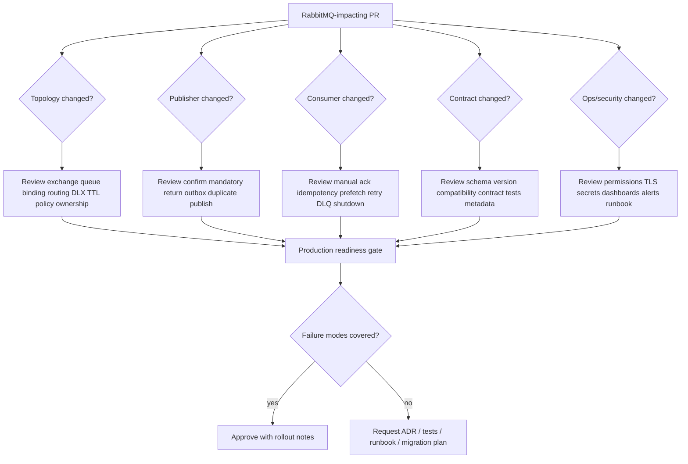

# PR Review and Architecture Decision Checklist

## 1. Core idea

RabbitMQ changes are rarely just code changes.

A small pull request can change production behavior across:

```text
producer transaction boundary
exchange routing
queue durability
consumer concurrency
ack timing
retry behavior
DLQ growth
duplicate processing
ordering guarantees
security permissions
observability quality
incident recovery path
```

For a senior backend engineer, the review target is not only:

```text
Does the Java code compile?
Does the consumer receive the message?
Does the happy path pass?
```

The better review target is:

```text
Can this message flow survive duplicate delivery, broker failover, producer retry,
consumer crash, slow downstream dependency, partial database commit, poison message,
redelivery storm, bad deployment, and production debugging under pressure?
```

This part is a practical review system for RabbitMQ-related PRs, architecture decisions, and production readiness checks.

---

## 2. What counts as a RabbitMQ-impacting change?

A PR should be treated as messaging-impacting if it changes any of these:

```text
exchange declaration
queue declaration
binding declaration
routing key
message type
message schema
message headers
publisher code
consumer code
ack/nack/reject behavior
prefetch
consumer concurrency
retry topology
DLX/DLQ configuration
TTL/expiration
queue length limit
outbox table
inbox table
idempotency key
serialization format
connection/channel lifecycle
security permission
vhost usage
deployment manifest
Helm value
RabbitMQ policy/operator policy
observability dashboard
alert threshold
manual replay tool
```

Do not let a messaging PR pass as a normal application refactor when it changes runtime delivery behavior.

---

## 3. Review lenses

Use these lenses in order.

| Lens | Main question |
|---|---|
| Business correctness | What business invariant can this message violate? |
| Delivery semantics | What happens if the message is duplicated, delayed, lost before confirm, or redelivered? |
| Topology correctness | Is the exchange/queue/binding/routing-key design explicit and owned? |
| Transaction boundary | Is DB state consistent with message publication or consumption? |
| Failure handling | What happens under crash, timeout, retry exhaustion, poison message, and broker failover? |
| Operational readiness | Can SRE/backend debug, alert, replay, and recover safely? |
| Security/privacy | Does the message expose sensitive data in payload, headers, logs, DLQ, or replay tooling? |
| Performance | Can the flow handle expected throughput, latency, backlog, and downstream pressure? |
| Change safety | Is the rollout backward-compatible and reversible? |

A clean PR description should answer most of these without forcing reviewers to reverse-engineer intent from code.

---

## 4. Architecture decision first, implementation second

For non-trivial messaging changes, ask for an ADR or design note before approving implementation.

Minimum ADR fields:

```mdx
# ADR: <message flow / topology / reliability change>

## Context
What business workflow or system pressure requires this change?

## Decision
What exchange, queue, routing, producer, consumer, retry, DLQ, and storage pattern will be used?

## Delivery semantics
At-most-once, at-least-once, or effectively-once through idempotency?

## Transaction boundary
How does the flow interact with PostgreSQL/MyBatis/JDBC transactions?

## Failure modes
What happens on producer crash, broker failover, consumer crash, poison message, duplicate delivery, and retry exhaustion?

## Observability
Which metrics, logs, traces, dashboards, and alerts prove this flow is healthy?

## Security/privacy
What sensitive data can appear in payload, headers, DLQ, logs, traces, exports, and replay tools?

## Rollout and rollback
How can this be deployed, migrated, disabled, or rolled back safely?

## Internal verification checklist
What must be checked in CSG/team codebase, RabbitMQ UI, Helm, GitOps, dashboards, and runbooks?
```

If the answer is "we only added a queue", that is usually not enough.

A queue is an operational contract.

---

## 5. Messaging change classification

Classify the change before review.

| Class | Example | Review intensity |
|---|---|---|
| Local implementation | Refactor publisher abstraction without behavior change | Medium |
| Consumer behavior | Change ack, retry, concurrency, idempotency | High |
| Producer reliability | Add confirms, outbox, retry publish | High |
| Contract change | Add/remove/rename payload field | High |
| Topology change | New exchange/queue/binding/routing key/DLX | High |
| Operational change | Policy, TTL, max length, quorum/classic migration | Very high |
| Security change | Vhost, permission, credential, TLS, PII | Very high |
| Replay/repair tool | Manual replay, DLQ reprocessor, backfill | Very high |

The highest-risk PRs are often small config changes.

Example:

```yaml
x-message-ttl: 60000
x-dead-letter-exchange: retry.exchange
```

This can change ordering, redelivery, DLQ volume, and customer-facing latency.

---

## 6. Exchange design review

Ask these questions.

### 6.1 Exchange purpose

```text
Is this exchange for commands, events, tasks, replies, retry, DLQ, or integration?
Is the exchange owned by one bounded context or shared by many teams?
Is the exchange stable API surface or internal implementation detail?
```

### 6.2 Exchange type

| Type | Review focus |
|---|---|
| Direct | Is routing key exact and predictable? |
| Topic | Are wildcards too broad? Could unrelated consumers receive messages? |
| Fanout | Is broadcast intended? Are all subscribers isolated? |
| Headers | Is routing hidden in mutable headers? Is it observable? |
| Default exchange | Is implicit queue-name routing intentional? |
| Alternate exchange | Are unroutable messages captured safely? |
| Delayed exchange plugin | Is plugin available in all environments? |
| Consistent hash plugin | Is plugin availability and hash-key behavior verified? |
| Internal exchange | Is producer access intentionally blocked? |
| Exchange-to-exchange binding | Is the routing graph documented? |

### 6.3 Exchange durability

Review:

```text
Is the exchange durable?
What happens after broker restart?
Is topology declared by application or GitOps/operator?
Can this exchange be deleted safely?
Is there an owner and documentation page?
```

### 6.4 Exchange anti-patterns

Red flags:

```text
one global topic exchange for everything
wildcard consumers using # without explicit reason
business-critical unroutable messages silently dropped
exchange declared differently by multiple services
exchange name contains environment but vhost already separates environment
retry and business messages mixed on same exchange without clear convention
```

---

## 7. Queue design review

A queue is not just a buffer.

It defines persistence, ordering, failure isolation, ownership, and operational responsibility.

### 7.1 Queue purpose

Ask:

```text
Who owns this queue?
Who consumes it?
Is it command, event subscription, task, retry, DLQ, parking lot, reply, temporary, or stream?
What business process is blocked if this queue stops draining?
What is the expected backlog tolerance?
```

### 7.2 Queue type

| Queue type | Review focus |
|---|---|
| Classic queue | Is non-replicated behavior acceptable? Is priority/lazy behavior needed? |
| Quorum queue | Is data safety worth the write/replication cost? Is delivery limit configured? |
| Stream | Is retention/replay/offset consumption intended? Is Kafka a better fit? |
| Priority queue | Is ordering degradation accepted? Is priority starvation handled? |
| Exclusive queue | Is lifecycle tied to one connection intentionally? |
| Auto-delete queue | Can it disappear safely? |
| Temporary reply queue | Is lost reply acceptable? |

### 7.3 Queue durability and persistence

Check all three together:

```text
durable queue
persistent message
durable exchange/binding topology
```

Durable queue alone does not make a transient message durable.

Persistent message alone does not help if it is routed nowhere or the topology disappears after restart.

### 7.4 Queue ownership

Every production queue should have:

```text
owning service/team
consumer service
purpose
message type
SLO expectation
DLQ/retry path
alert owner
runbook link
replay policy
retention policy
security classification
```

If no team owns the queue, production owns the incident.

---

## 8. Routing key review

Routing keys are API design.

They are not random strings.

Review:

```text
Is the routing key naming convention explicit?
Does it represent business event type, command type, tenant, version, priority, or operation?
Are routing key segments stable?
Can consumers safely use topic wildcards?
Can routing key changes break existing consumers?
Is tenant or environment encoded unnecessarily?
```

Example taxonomy:

```text
<domain>.<entity>.<event>
quote.quote.created
quote.quote.approved
order.order.submitted
order.fulfillment.requested
billing.invoice.generated
```

For commands:

```text
<target-domain>.<command>
pricing.calculate-quote
approval.request-review
fulfillment.create-order
notification.send-email
```

Red flags:

```text
routing key contains raw customer ID
routing key contains sensitive data
routing key overloaded with payload semantics
routing key versioning inconsistent with payload versioning
routing key wildcard required because producer does not know message type
```

---

## 9. Publisher review

Publisher review should prove that "sent" does not mean "safe".

### 9.1 Basic publisher checklist

```text
Connection lifecycle is clear.
Channel ownership is clear.
Channel is not shared unsafely across threads.
Message properties are explicit.
Content type is set.
Message ID is set.
Correlation ID is propagated.
Trace context is propagated.
Delivery mode is intentional.
Mandatory flag behavior is intentional.
Return listener exists when mandatory is used.
Publisher confirm is used for important messages.
Publish failure is measured.
Publish latency is measured.
```

### 9.2 Publisher confirm review

Ask:

```text
Is confirm mode enabled?
Does the publisher wait for confirms synchronously, asynchronously, or in batches?
What is the confirm timeout?
What happens when confirm times out?
Can timeout cause duplicate publish?
Is duplicate publish safe for downstream consumers?
Is confirm integrated with outbox status update?
```

### 9.3 Mandatory and unroutable review

Ask:

```text
Can the message be unroutable?
Is mandatory=true used where needed?
Is a return listener implemented?
Is alternate exchange configured?
Is there alerting for returned/unroutable messages?
Does the publisher distinguish broker accepted vs business delivered?
```

### 9.4 Transaction boundary review

Publisher red flags:

```text
DB commit then publish without outbox for critical state change
publish then DB commit for irreversible downstream command
publish inside transaction but no confirm or outbox
mark published before broker confirm
retry publish without deterministic message ID
publisher catches exception and returns success to HTTP client
```

---

## 10. Consumer review

Consumer review should prove that "received" does not mean "processed".

### 10.1 Basic consumer checklist

```text
Manual ack is used for important work.
Ack happens after durable side effects.
Nack/reject behavior is explicit.
Requeue policy is explicit.
Prefetch is configured.
Consumer concurrency is bounded.
Shutdown drains in-flight messages or allows safe redelivery.
Consumer logs include message ID and correlation ID.
Duplicate handling exists.
Poison message handling exists.
Metrics exist for success, failure, processing time, redelivery, and DLQ.
```

### 10.2 Ack timing review

Ask:

```text
What exactly must complete before ack?
DB commit?
External API call?
Outbox insert?
State transition?
Audit write?
Cache invalidation?
```

Safe default:

```text
consume -> validate -> idempotency check -> transaction -> durable side effect -> commit -> ack
```

Risky pattern:

```text
consume -> ack -> process -> DB write
```

This gives at-most-once semantics and can lose work if processing fails after ack.

### 10.3 Nack/reject review

Ask:

```text
When is basicNack used?
When is basicReject used?
When is requeue=true allowed?
When is requeue=false used to dead-letter?
How is retry count bounded?
How are poison messages isolated?
```

Red flag:

```text
catch (Exception e) {
  channel.basicNack(tag, false, true);
}
```

This can produce an infinite redelivery loop.

---

## 11. Prefetch and concurrency review

Review prefetch with downstream capacity, not only broker throughput.

Ask:

```text
What is prefetch per consumer?
How many consumer instances run per pod?
How many pods run during normal load?
How many pods run during autoscaling?
What is the total possible unacked message count?
Does this exceed DB connection pool capacity?
Does this exceed downstream API rate limit?
Does this break ordering assumptions?
```

Formula:

```text
total_in_flight ≈ pod_count × consumers_per_pod × prefetch_per_consumer
```

Example:

```text
10 pods × 4 consumers × prefetch 50 = 2,000 in-flight messages
```

If each message opens a DB transaction or calls a downstream API, prefetch becomes a capacity multiplier.

---

## 12. Idempotency review

At-least-once delivery without idempotency is just delayed data corruption.

Review:

```text
What is the idempotency key?
Is it stable across retries and duplicate publish?
Is it technical message ID, business command ID, event ID, or aggregate transition ID?
Where is it stored?
Is there a unique constraint?
Is duplicate treated as success, ignored, or rejected?
Can idempotency survive process restart?
Can idempotency survive Redis loss if Redis is used?
```

For business commands, technical message ID is often insufficient.

Example:

```text
Bad: random UUID generated on each retry
Good: commandId generated at request boundary and reused through outbox/retry
```

For state transitions, review the transition itself:

```sql
UPDATE quote
SET status = 'APPROVED'
WHERE quote_id = :quoteId
  AND status = 'PENDING_APPROVAL';
```

This is safer than blindly setting status without checking expected previous state.

---

## 13. Retry and DLQ review

Retry design must classify failures.

| Failure type | Example | Correct reaction |
|---|---|---|
| Transient | downstream timeout | delayed retry with bounded attempts |
| Dependency outage | pricing service down | backoff, circuit breaker, alert |
| Data problem | invalid payload | DLQ or parking lot |
| Code bug | null pointer for valid message | DLQ/parking lot after bounded retry, fix code, replay |
| Business rejection | invalid state transition | do not infinite retry |
| Privacy/security issue | payload contains forbidden data | isolate and escalate |

Review questions:

```text
Is retry count bounded?
Where is retry count stored?
Is x-death used safely?
Is retry delay fixed or exponential?
Can retry storm overload downstream systems?
Is DLQ per consumer/subscriber or shared?
Is parking lot queue available?
Is manual replay safe and audited?
Does replay preserve idempotency key?
```

Red flags:

```text
unbounded requeue=true
single shared DLQ for unrelated domains
manual replay by copying messages without audit
retry queue with no alerting
retry topology not documented
DLQ contains PII with no retention/access policy
```

---

## 14. Outbox review

Producer-side reliability review for DB-backed services:

```text
Is business row and outbox row inserted in the same PostgreSQL transaction?
Does outbox row contain stable event ID/message ID?
Does poller use safe locking such as FOR UPDATE SKIP LOCKED?
Does publisher wait for RabbitMQ confirm before marking published?
Can mark-published fail after broker confirm?
Is duplicate publish safe?
Is outbox cleanup retention defined?
Are stuck outbox rows alerted?
Can outbox be replayed safely?
```

Outbox invariant:

```text
If business state commits, publish intent must be durable.
If publish is retried, consumers must tolerate duplicates.
```

Bad pattern:

```text
service method commits DB
then publishes message directly
then returns success
```

Failure window:

```text
DB commit succeeds
process crashes before publish
no message exists
business state becomes invisible to downstream systems
```

---

## 15. Inbox review

Consumer-side reliability review:

```text
Is message ID stored before/with processing?
Is there a unique constraint on dedup key?
Is processing status tracked?
Is the business side effect and inbox state committed atomically?
Is ack sent only after commit?
Can failed processing be retried safely?
Can poison message be linked to inbox record?
Is replay detected as duplicate or reprocessable by policy?
Is inbox retention defined?
```

Inbox invariant:

```text
A duplicate delivery must not create duplicate business side effects.
```

Common inbox statuses:

```text
RECEIVED
PROCESSING
PROCESSED
FAILED_TRANSIENT
FAILED_PERMANENT
IGNORED_DUPLICATE
REPLAYED
```

---

## 16. Message contract review

Review the message as a product API.

```text
Is message type explicit?
Is schema documented?
Is content type set?
Is version set?
Are required and optional fields clear?
Are default values defined?
Can old consumers read new messages?
Can new consumers read old messages?
Are breaking changes versioned?
Are deprecated fields still produced until all consumers migrate?
Are contract tests present?
```

Red flags:

```text
consumer depends on undocumented field
producer renames field without version bump
nullable field becomes required without migration
routing key version and payload version diverge
payload includes internal entity model directly
```

---

## 17. Metadata and traceability review

Minimum metadata for serious enterprise flows:

```text
messageId
messageType
messageVersion
correlationId
causationId
traceparent or traceId
sourceService
tenantId if applicable
actorId if applicable
createdAt
publishedAt if available
idempotencyKey
retryCount if application-managed
```

Review:

```text
Can one customer incident be traced from HTTP request to DB row to outbox to RabbitMQ to consumer to downstream side effect?
Can DLQ messages be correlated to original request?
Can replay be audited?
Are trace/log labels low-cardinality where needed?
Are sensitive values kept out of metrics labels?
```

---

## 18. Ordering review

Ask whether ordering is truly required.

If yes, specify scope:

```text
global ordering
per tenant ordering
per quote ordering
per order ordering
per aggregate ordering
per queue ordering
per stream partition ordering
```

Review:

```text
How many consumers read the queue?
Is single active consumer required?
Can retry break order?
Can redelivery break order?
Can priority queue break order?
Can horizontal scaling break order?
Is per-aggregate routing required?
Is Kafka/RabbitMQ Stream a better fit?
```

Red flag:

```text
"RabbitMQ is FIFO, so order is guaranteed".
```

That statement is incomplete.

FIFO queue behavior is only one piece of runtime ordering.

Consumer concurrency, redelivery, prefetch, retry, and priority can change observed processing order.

---

## 19. Security review

Review both broker access and message data.

```text
Does the service use a dedicated RabbitMQ user?
Is permission scoped to required vhost?
Are configure/write/read patterns least privilege?
Is TLS enabled where required?
Are certificates validated?
Are credentials sourced from approved secret manager?
Is credential rotation documented?
Is Management UI access restricted?
Are topic permissions used if needed?
```

Message data review:

```text
Does payload contain PII?
Do headers contain PII?
Can DLQ retain sensitive data longer than intended?
Can replay tool expose sensitive data?
Do logs print full payload?
Do traces include sensitive fields?
Are metrics labels free of high-cardinality/customer data?
```

---

## 20. Observability review

A RabbitMQ flow is not production-ready until it can be observed.

Per producer:

```text
publish_attempt_total
publish_success_total
publish_failure_total
publish_confirm_latency
publish_confirm_timeout_total
returned_unroutable_total
outbox_pending_count
outbox_oldest_age_seconds
```

Per consumer:

```text
consume_success_total
consume_failure_total
processing_duration
redelivery_total
ack_total
nack_total
dlq_publish_total
inbox_duplicate_total
inbox_processing_failure_total
```

Per queue:

```text
messages_ready
messages_unacknowledged
publish_rate
deliver_rate
ack_rate
redelivery_rate
consumer_count
consumer_utilisation
dlq_depth
retry_depth
oldest_message_age
```

Review:

```text
Is there a dashboard?
Are alerts actionable?
Is alert ownership clear?
Are dashboard dimensions low-cardinality?
Do logs include correlation ID and message ID?
Can tracing cross async boundary?
```

---

## 21. Performance review

Ask for expected numbers.

```text
Expected publish rate?
Expected consume rate?
Peak rate?
Message size P50/P95/P99?
Processing latency target?
Allowed backlog duration?
DLQ acceptable threshold?
Retry volume expectation?
Consumer CPU/IO-bound?
Downstream DB/API capacity?
```

Review risk multipliers:

```text
persistent messages
publisher confirms
quorum queue replication
large payloads
high binding count
topic wildcard complexity
large unacked window
consumer concurrency
slow downstream dependency
cross-region network
TLS overhead
```

If no one can provide expected rates, require load testing or conservative rollout.

---

## 22. Kubernetes/cloud/on-prem deployment review

For clients:

```text
Does pod shutdown drain in-flight messages?
Is terminationGracePeriodSeconds sufficient?
Does readiness go false before consumer stops?
Can rolling update duplicate processing safely?
Can autoscaling multiply prefetch dangerously?
Are secrets mounted/rotated safely?
Does DNS/LB behavior match Java client recovery behavior?
```

For broker:

```text
StatefulSet/operator/managed service?
Persistent storage class?
Anti-affinity?
Pod disruption budget?
Backup/restore?
Upgrade plan?
Broker version?
Plugin version?
Policy/operator policy?
```

For cloud/on-prem:

```text
Network path?
Private connectivity?
Firewall/security group/NetworkPolicy?
TLS cert chain?
Monitoring integration?
Responsibility boundary?
Maintenance window?
```

---

## 23. GitOps and topology-as-code review

Review:

```text
Is topology declared as code?
Are changes reviewed before production?
Is there drift detection?
Can definitions be exported/imported?
Are policies declarative?
Are operator policies controlled by platform?
Are destructive changes guarded?
Is deletion reversible?
Is rollback possible?
```

Dangerous topology changes:

```text
renaming exchange
renaming queue
changing queue type
changing DLX
changing routing key
removing binding
changing TTL
changing max length/overflow
changing durable flag
changing vhost/permission
```

These need migration plans.

---

## 24. Replay and repair review

Manual replay is production write access.

Review:

```text
Who can replay?
From where: DLQ, parking lot, stream, outbox, backup, file export?
What message fields are preserved?
Is message ID preserved or regenerated?
Is idempotency key preserved?
Is correlation ID preserved?
Is replay audited?
Can replay be scoped by tenant/customer/message type/time window?
Can replay be dry-run?
Can replay overwhelm downstream services?
```

Red flags:

```text
manual copy-paste from Management UI
no replay audit
replay changes message ID accidentally
replay bypasses idempotency
replay directly into business exchange without throttling
```

---

## 25. Migration review

Messaging migrations need backward compatibility.

Common migrations:

```text
classic queue -> quorum queue
queue rename
exchange rename
routing key taxonomy change
payload schema version change
new consumer introduction
old consumer removal
DLQ topology redesign
outbox adoption
inbox adoption
RabbitMQ Stream adoption
```

Safe migration pattern:

```text
1. Add new topology.
2. Publish to both old and new if required.
3. Deploy consumers that can read both schemas.
4. Observe parity.
5. Drain old queues.
6. Disable old publishers.
7. Remove old topology after retention window.
```

Never assume queue deletion is harmless.

A queue may contain business work.

---

## 26. Production readiness gate

Before enabling a new critical flow in production, require yes/no answers.

```text
Can publisher failure be detected?
Can unroutable message be detected?
Can duplicate delivery be handled?
Can consumer crash be recovered?
Can poison message be isolated?
Can DLQ growth alert someone?
Can retry storm be stopped?
Can backlog be drained safely?
Can sensitive data be protected in DLQ/logs/traces?
Can flow be disabled without redeploying everything?
Can messages be replayed safely?
Can downstream systems tolerate catch-up load?
Can support explain customer-visible state during async processing?
```

If the answer is no, document the risk explicitly.

---

## 27. PR comment patterns

Use precise review comments.

Weak comment:

```text
Can you add retry?
```

Better comment:

```text
This consumer currently nacks with requeue=true for all exceptions. That can create an infinite redelivery loop for permanent payload errors. Please classify transient vs permanent failures, cap retry attempts, and route exhausted messages to a DLQ/parking lot with messageId, correlationId, and x-death preserved.
```

Weak comment:

```text
Use outbox.
```

Better comment:

```text
This endpoint commits quote status before publishing QuoteApproved. If the process crashes after DB commit and before broker accept, downstream systems will never see the transition. Please either use transactional outbox or document why message loss is acceptable for this flow.
```

Weak comment:

```text
Add logs.
```

Better comment:

```text
Please log messageId, correlationId, messageType, routingKey, queue, retryAttempt, and business aggregate ID at consume start, success, permanent failure, and DLQ handoff. Avoid logging full payload because it may include customer/order data.
```

---

## 28. Mermaid review map



---

## 29. Internal verification checklist

Check the actual CSG/team environment before assuming any of this is already true.

### Codebase

```text
publisher abstraction
consumer abstraction
connection/channel lifecycle
manual ack/nack policy
prefetch configuration
outbox implementation
inbox implementation
message schema definitions
message metadata standard
idempotency helper
retry/DLQ handler
replay tool
logging/tracing instrumentation
```

### RabbitMQ broker

```text
vhosts
users
permissions
topic permissions
exchanges
queues
bindings
queue types
policies
operator policies
runtime parameters
plugins
DLX/DLQ topology
TTL and queue length limits
quorum delivery limit
stream plugin/stream queues if used
```

### Deployment

```text
Helm chart
Kubernetes manifests
RabbitMQ Cluster Operator resources
StatefulSet/PVC/storage class
service/load balancer
NetworkPolicy
secrets/certificates
AWS/Azure/on-prem network controls
backup/restore process
upgrade process
```

### Observability

```text
RabbitMQ Management UI
Prometheus/Grafana dashboards
producer metrics
consumer metrics
DLQ/retry alerts
resource alarm alerts
connection/channel alerts
outbox/inbox dashboards
log search patterns
trace correlation
incident notes
runbooks
```

### Team process

```text
messaging ADR template
PR checklist
schema compatibility rules
topology ownership registry
DLQ ownership model
replay approval process
security review process
SRE escalation path
post-incident review history
```

---

## 30. Principal-level review questions

Use these when reviewing design documents.

```text
What is the business invariant protected by this message flow?
What is the exact delivery semantic promised to downstream systems?
Where is the idempotency boundary?
What happens if producer publishes twice?
What happens if consumer processes twice?
What happens if broker accepts but publisher does not receive confirm?
What happens if consumer commits DB but dies before ack?
What happens if retry delay causes business SLA breach?
What happens if DLQ contains customer-sensitive data?
What happens if a deployment rolls all consumers at peak load?
What happens if RabbitMQ is healthy but PostgreSQL is slow?
What happens if downstream API is down for two hours?
What happens if an old consumer reads a new message version?
What happens if queue depth grows faster than consumers can drain?
Who gets paged, and what do they do first?
```

These questions are not pessimism.

They are how queue-based systems stay boring in production.

---

## 31. Final mental model

A RabbitMQ PR is safe only when these five contracts are clear:

```text
1. Routing contract
   Which exchange, routing key, binding, and queue will carry the message?

2. Delivery contract
   How does the system handle confirm, ack, duplicate, redelivery, retry, and DLQ?

3. State contract
   How does the message align with PostgreSQL/MyBatis/JDBC transaction boundaries?

4. Operational contract
   How will humans observe, alert, debug, replay, and recover this flow?

5. Governance contract
   Who owns schema, topology, security, privacy, and production readiness?
```

If one of these contracts is implicit, the design is not finished.

---

## References

- RabbitMQ Production Deployment Guidelines: https://www.rabbitmq.com/docs/production-checklist
- RabbitMQ Consumer Acknowledgements and Publisher Confirms: https://www.rabbitmq.com/docs/confirms
- RabbitMQ Publishers: https://www.rabbitmq.com/docs/publishers
- RabbitMQ Monitoring: https://www.rabbitmq.com/docs/monitoring
- RabbitMQ Prometheus and Grafana: https://www.rabbitmq.com/docs/prometheus
- RabbitMQ Management Plugin: https://www.rabbitmq.com/docs/management
- RabbitMQ Access Control: https://www.rabbitmq.com/docs/access-control
- RabbitMQ Definitions: https://www.rabbitmq.com/docs/definitions
- RabbitMQ Policies: https://www.rabbitmq.com/docs/policies
