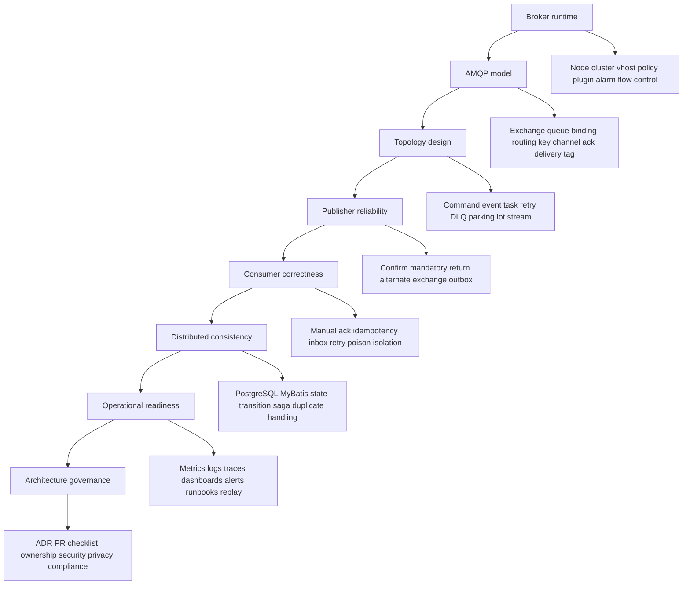
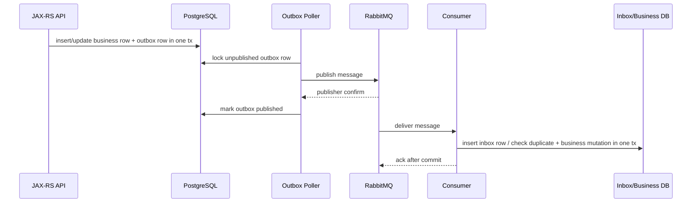

# RabbitMQ Mastery Map for Senior Backend Engineer

This is the final part of the series.

The goal is not to memorize RabbitMQ features.

The goal is to reason correctly when a production system depends on RabbitMQ.

---

## 1. The complete mental model

RabbitMQ is simultaneously:

```text
a message broker
an AMQP broker
a routing engine
a work distribution system
a pub/sub distribution system
a retry and dead-lettering substrate
a reliability boundary
a backpressure surface
a security boundary
a production operations component
```

A senior engineer does not ask only:

```text
How do I publish and consume?
```

A senior engineer asks:

```text
What is the message contract?
What is the topology contract?
What is the transaction boundary?
What is the delivery semantic?
What is the duplicate-handling strategy?
What is the retry/DLQ strategy?
What is the ordering requirement?
What is the operational runbook?
What is the privacy/security classification?
What happens when each component fails?
```

RabbitMQ is easy to start and easy to misuse.

The difference between beginner usage and senior usage is failure modeling.

---

## 2. The RabbitMQ reasoning stack

Think from bottom to top.



If your reasoning starts at Java code, you may miss broker topology.

If your reasoning starts at broker topology, you may miss business consistency.

Move across the full stack.

---

## 3. AMQP mastery checklist

You understand AMQP when these statements are obvious.

```text
A producer publishes to an exchange, not directly to a queue except through the default exchange.
An exchange routes using bindings.
A binding connects exchange to queue or exchange to exchange.
A routing key is part of the routing contract.
A queue stores messages until consumed, expired, dead-lettered, dropped, or deleted.
A consumer receives deliveries, not abstract messages.
A delivery tag is scoped to a channel.
Ack must happen on the same channel that received the delivery.
Auto-ack means RabbitMQ considers the message handled when delivered.
Manual ack means the application decides when processing is complete.
Nack/reject with requeue=false can dead-letter if DLX is configured.
Redelivery is expected, not exceptional.
Channel is not a free-thread-safe abstraction.
Connection is expensive; channel is cheaper but still must be owned.
Vhost is an isolation namespace.
Policy can change runtime behavior without application code change.
```

If these are not clear, revisit the AMQP mental model before reviewing production designs.

---

## 4. Message lifecycle mastery map

Follow every important message through this path:

```text
HTTP request / scheduled job / DB change
  -> service layer validation
  -> transaction boundary
  -> outbox insert or direct publish decision
  -> publisher serialization
  -> message properties and headers
  -> exchange publish
  -> publisher confirm / return / failure
  -> exchange routing
  -> binding match
  -> queue enqueue
  -> persistence / replication if applicable
  -> consumer delivery
  -> prefetch/in-flight window
  -> idempotency check
  -> business processing
  -> DB transaction / external side effect
  -> ack / nack / reject
  -> retry / DLQ / parking lot / replay
  -> observability and audit trail
```

A production incident is usually a break in this lifecycle.

Debug by locating the break.

---

## 5. Exchange design mastery

Use exchanges intentionally.

| Exchange type | Use when | Avoid when |
|---|---|---|
| Direct | Exact routing is enough | You need flexible subscription patterns |
| Topic | Hierarchical routing is useful | Wildcards will become uncontrolled coupling |
| Fanout | All subscribers should receive all events | Subscriber selection matters |
| Headers | Routing depends on attributes | Routing needs to be obvious and simple |
| Default | Simple direct-to-queue cases | You need explicit topology ownership |
| Alternate | Unroutable messages must not disappear | You have no owner for unroutable flow |
| Delayed plugin | Broker-side delay is accepted and plugin is available | Portability across environments is uncertain |
| Consistent hash plugin | Hash-based routing is required | Plugin availability is not verified |

Mastery rule:

```text
Every exchange should have a purpose, owner, route contract, durability decision, and observability path.
```

---

## 6. Queue design mastery

Use queues as owned operational contracts.

| Queue type | Mental model |
|---|---|
| Classic queue | General queue, simpler semantics, original queue type, not automatically replicated unless topology/policy provides behavior in old models. |
| Quorum queue | Replicated durable queue focused on data safety and leader election through Raft-like behavior. |
| Stream | Retained log-like structure with offset consumption and replay semantics. |
| Priority queue | Queue with priority ordering trade-offs and possible starvation. |
| Exclusive/auto-delete | Lifecycle-bound queue, useful for temporary patterns but dangerous for durable workflows. |
| Reply queue/direct reply-to | Request-reply support, often at-most-once for replies and timeout-sensitive. |

Mastery rule:

```text
Queue choice is a reliability, performance, and operations decision.
```

Do not choose queue type by habit.

Choose it by:

```text
data safety requirement
replication requirement
latency/throughput target
ordering requirement
retention/replay requirement
operational ownership
storage cost
failure recovery expectation
```

---

## 7. Routing topology mastery

Topology should reveal system intent.

Good topology answers:

```text
What messages exist?
Who produces them?
Who consumes them?
Which exchange owns routing?
Which queue belongs to which consumer?
Where do failed messages go?
How are retries delayed?
How are poison messages isolated?
How are temporary/reply messages separated from durable business messages?
How is topology promoted across environments?
```

Bad topology forces people to inspect code and guess.

Red flags:

```text
single global exchange for unrelated domains
single shared DLQ for every service
routing keys with inconsistent grammar
queues named after implementation classes
bindings created manually in Management UI with no source of truth
retry queues with no owner
orphan queues nobody consumes
```

---

## 8. Publisher mastery

A robust publisher handles four separate outcomes.

```text
1. Client code failed before sending.
2. Broker received and accepted the message.
3. Broker rejected or lost connection before confirm.
4. Broker accepted the publish but message was unroutable.
```

Publisher checklist:

```text
Connection lifecycle is managed.
Channel ownership is thread-safe.
Message properties are explicit.
Correlation ID and trace context are propagated.
Content type and schema version are set.
Delivery mode is intentional.
Mandatory flag or alternate exchange is used where unroutable messages matter.
Publisher confirms are enabled for important messages.
Confirm timeout is handled as uncertain outcome, not guaranteed failure.
Duplicate publish is safe.
Outbox is used when DB state and message publication must be atomic.
Metrics distinguish attempt, accepted, returned, failed, and timed out.
```

Mastery rule:

```text
A publish attempt is not a business fact until broker acceptance and downstream semantics are handled.
```

---

## 9. Consumer mastery

A robust consumer handles these states:

```text
message delivered
message redelivered
message duplicate
message invalid
message temporarily failing
message permanently failing
message partially processed
message processed but ack failed
message committed to DB but consumer crashed before ack
message sent to DLQ
message replayed
```

Consumer checklist:

```text
Manual ack for important processing.
Ack after durable side effect.
Idempotency before business mutation.
Inbox table or equivalent dedup for critical flows.
Bounded retry strategy.
Poison message isolation.
Prefetch tuned to downstream capacity.
Graceful shutdown drains or allows safe redelivery.
Logs include message ID and correlation ID.
Metrics include success, failure, redelivery, processing latency, duplicate, and DLQ.
```

Mastery rule:

```text
The consumer owns correctness after delivery.
RabbitMQ does not know whether your business state is correct.
```

---

## 10. Ack/nack mastery

Ack/nack is not just API usage.

It is the commit protocol between application processing and RabbitMQ delivery state.

Use this mental model:

```text
ack = application takes responsibility for the message
nack/reject requeue=true = try again soon, possibly immediately
nack/reject requeue=false = do not redeliver to this queue; dead-letter if configured
auto-ack = broker responsibility ends at delivery, not processing
```

Review rule:

```text
Never ack before the side effect you need to protect is durable.
Never requeue forever for unknown exceptions.
Never assume redelivery means broker bug.
```

Crash scenario to memorize:

```text
consumer receives message
consumer writes DB
DB commits
consumer crashes before ack
RabbitMQ redelivers
```

Correct answer:

```text
consumer must be idempotent
```

Not:

```text
RabbitMQ delivered duplicate, therefore RabbitMQ is wrong
```

---

## 11. Prefetch and concurrency mastery

Prefetch controls in-flight risk.

Formula:

```text
total_in_flight = pod_count × consumers_per_pod × prefetch_per_consumer
```

Use this against:

```text
DB connection pool size
downstream API rate limit
thread pool size
CPU budget
memory budget
ordering requirement
shutdown drain time
retry burst capacity
```

Mastery rule:

```text
Prefetch is not only throughput tuning.
It is a blast-radius setting.
```

Too low:

```text
underutilized consumers
excess round trips
lower throughput
```

Too high:

```text
large unacked backlog
slow shutdown
duplicate storm after crash
memory pressure
unfair distribution
DB/API overload
ordering surprise
```

---

## 12. Delivery semantics mastery

Do not use vague words like "guaranteed delivery" without defining the boundary.

Use explicit language:

```text
At-most-once:
  message may be lost, duplicate unlikely.

At-least-once:
  message should not be lost after accepted, duplicate possible.

Effectively-once:
  duplicate may happen, but idempotency prevents duplicate business effect.

Exactly-once:
  usually an illusion across broker, application, database, and external systems.
```

RabbitMQ gives mechanisms:

```text
publisher confirms
consumer acknowledgements
durable queues
persistent messages
quorum replication
DLX/retry
streams/retention depending on use case
```

Application gives correctness:

```text
outbox
inbox
idempotency key
business state guard
transaction boundary
contract compatibility
safe replay
```

Mastery rule:

```text
RabbitMQ can help deliver messages reliably.
Only your application can make processing correct.
```

---

## 13. Retry and DLQ mastery

Retry is a failure classifier.

Not all failures deserve retry.

```text
Transient timeout -> retry with delay
Dependency outage -> retry with backoff plus alert
Invalid payload -> DLQ/parking lot
Code bug -> bounded retry then DLQ until fixed
Business rule rejection -> no infinite retry
Privacy/security issue -> isolate and escalate
```

Retry/DLQ checklist:

```text
bounded retry count
clear delay strategy
DLQ owner
parking lot queue for manual intervention
x-death or application retry metadata preserved
manual replay procedure
replay audit
replay throttling
idempotency on replay
DLQ privacy policy
alerts for DLQ and retry growth
```

Mastery rule:

```text
A retry strategy without a stop condition is an incident generator.
```

---

## 14. Ordering mastery

Ordering is scoped.

Always ask:

```text
Ordering of what?
For whom?
Across which boundary?
For how long?
At what throughput cost?
```

Ordering can be affected by:

```text
multiple consumers
consumer concurrency
prefetch
redelivery
requeue
retry queues
priority queues
DLQ/replay
partitioning/super streams
rolling deployment
consumer crash
```

Use patterns:

```text
single consumer for simple strict ordering
single active consumer for queue-level active processing
per-aggregate routing for aggregate ordering
state transition guards for correctness when ordering can drift
stream partitioning when retained ordered log is needed
```

Mastery rule:

```text
Ordering guarantees must be designed, not assumed.
```

---

## 15. Outbox and inbox mastery

Outbox solves producer-side atomicity.

Inbox solves consumer-side duplicate handling.

Together they give effectively-once business processing.



Outbox invariant:

```text
Committed business state implies durable publish intent.
```

Inbox invariant:

```text
Duplicate delivery does not imply duplicate business effect.
```

Mastery rule:

```text
If the message represents durable business state, direct publish without outbox is a decision that must be justified.
```

---

## 16. RabbitMQ Stream mastery

RabbitMQ Stream is not just a bigger queue.

Think:

```text
queue = consume and remove delivery-oriented work
stream = retain and consume by offset/log-like model
```

Use RabbitMQ Stream when:

```text
retention matters
replay matters
offset consumption matters
high-throughput append/read pattern matters
multiple consumers need independent position
RabbitMQ operational footprint is preferred over Kafka for the use case
```

Avoid RabbitMQ Stream when:

```text
simple task distribution is enough
strict work queue ack semantics are needed
Kafka is already the enterprise event backbone
partitioning/replay requirements exceed RabbitMQ Stream operating model
team has no operational maturity for streams
```

Mastery rule:

```text
Queue, stream, and Kafka are different operational contracts.
Choose the contract, not the brand.
```

---

## 17. Security and privacy mastery

Every message can become stored data.

Places sensitive data can leak:

```text
payload
headers
routing key
logs
traces
metrics labels
DLQ
retry queue
parking lot
manual export
replay tool
broker backup
definitions export if metadata is sensitive
support ticket attachment
```

Security checklist:

```text
dedicated user per service
least privilege per vhost
configure/write/read permissions scoped
TLS/mTLS where required
secret rotation
Management UI restricted
topic permissions if relevant
network isolation
DLQ access restricted
replay audited
payload redaction in logs
PII retention policy
```

Mastery rule:

```text
DLQ is not a trash can.
It is often a sensitive data store with worse governance.
```

---

## 18. Observability mastery

You are production-ready when you can answer these quickly:

```text
Is producer publishing?
Is broker accepting?
Are messages routable?
Are queues growing?
Are consumers connected?
Are consumers keeping up?
Are messages stuck ready or unacked?
Are redeliveries increasing?
Is DLQ growing?
Is retry queue cycling?
Is broker under memory/disk alarm?
Are connections blocked?
Which customer/request/message caused this?
Can we replay safely?
```

Minimum dashboards:

```text
broker health
queue health
producer health
consumer health
DLQ/retry health
outbox/inbox health
resource alarms
connection/channel count
latency and backlog age
```

Mastery rule:

```text
A queue without observability is delayed uncertainty.
```

---

## 19. Performance mastery

RabbitMQ performance is shaped by many interacting factors.

```text
message size
persistent vs transient messages
queue type
quorum replication
publisher confirm strategy
batching
prefetch
consumer concurrency
ack batching
binding count
routing complexity
connection/channel count
memory pressure
disk IO
network IO
cross-zone/cross-region latency
TLS overhead
consumer processing time
downstream DB/API capacity
```

Do not tune by folklore.

Use:

```text
baseline metrics
load test
PerfTest where useful
representative payload size
representative confirm/ack settings
realistic consumer behavior
failure-mode test
capacity margin
```

Mastery rule:

```text
RabbitMQ throughput is meaningless if consumers cannot commit business state safely.
```

---

## 20. Kubernetes/cloud/on-prem mastery

RabbitMQ deployment is environment-sensitive.

Kubernetes broker questions:

```text
StatefulSet or operator?
PersistentVolume class?
Pod identity stable?
Anti-affinity?
PDB?
Resource requests/limits?
Probes?
Backup/restore?
Upgrade plan?
NetworkPolicy?
```

Client workload questions:

```text
graceful shutdown?
in-flight drain?
readiness before consumer start?
termination grace period?
prefetch multiplied by replicas?
connection storm during rollout?
secret rotation behavior?
```

Cloud questions:

```text
managed or self-managed?
private network path?
TLS/cert validation?
monitoring integration?
maintenance window?
backup/snapshot?
failover behavior?
operational responsibility boundary?
```

On-prem/hybrid questions:

```text
firewall?
certificate lifecycle?
OS/disk tuning?
monitoring stack?
patching?
air-gapped constraints?
hybrid latency?
DR plan?
```

Mastery rule:

```text
The same RabbitMQ topology can have different failure modes in Kubernetes, AWS, Azure, and on-prem.
```

---

## 21. Production debugging mastery

Use symptom-first debugging.

### Message not published

Check:

```text
producer logs
connection/channel exception
publisher confirm timeout
connection blocked
outbox pending
broker alarm
credential/TLS/network issue
```

### Message published but not consumed

Check:

```text
exchange exists
routing key
binding
queue depth ready
consumer count
consumer utilization
permissions
consumer logs
prefetch/unacked
```

### Queue depth increasing

Check:

```text
publish rate vs ack rate
consumer count
consumer latency
downstream DB/API health
retry storm
unacked count
consumer errors
scaling limits
```

### Unacked increasing

Check:

```text
consumer stuck
DB transaction slow
thread pool exhausted
external API timeout
prefetch too high
ack not called
consumer crash/recovery loop
```

### DLQ increasing

Check:

```text
x-death header
original exchange/routing key
exception logs
schema changes
permission failures
business validation failures
new deployment timeline
poison message pattern
```

### Lost-message suspicion

Check in order:

```text
outbox row exists?
publisher attempted?
publisher confirm received?
return listener triggered?
message routed to queue?
queue had consumer?
consumer received?
inbox row exists?
business side effect committed?
ack occurred?
message dead-lettered?
message expired?
message purged/deleted?
```

Mastery rule:

```text
Do not start with blame.
Start with lifecycle evidence.
```

---

## 22. Internal verification map for CSG/team onboarding

Do not assume internal architecture.

Verify.

### Topology

```text
vhosts
exchange list
queue list
binding list
routing key convention
queue type
DLX/DLQ/retry topology
parking lot queues
stream queues if any
policies/operator policies
plugins
```

### Code

```text
RabbitMQ Java client abstraction
publisher confirm implementation
mandatory/return listener handling
consumer ack/nack handling
prefetch configuration
outbox implementation
inbox implementation
idempotency strategy
serialization standard
metadata propagation standard
Testcontainers setup
```

### Data consistency

```text
PostgreSQL transaction manager
MyBatis/JDBC transaction boundary
business state transition guards
outbox polling/locking
inbox dedup unique constraints
repair/reconciliation tooling
manual replay tooling
```

### Operations

```text
RabbitMQ dashboards
alerts
runbooks
incident history
DLQ ownership
retry storm procedure
memory/disk alarm response
cluster failover procedure
certificate expiry procedure
backup/restore process
upgrade process
```

### Security/privacy

```text
service users
vhost permissions
TLS/mTLS
secret storage
credential rotation
Management UI access
message data classification
PII policy
DLQ/replay access control
compliance evidence
```

### Team process

```text
ADR template
PR review checklist
schema governance
AsyncAPI/internal message docs
topology-as-code source of truth
GitOps drift detection
platform/SRE escalation path
```

---

## 23. Senior engineer capability ladder

### Level 1: User

Can publish and consume messages.

```text
basic exchange/queue/binding knowledge
simple producer/consumer code
basic Management UI usage
```

### Level 2: Implementer

Can build a working feature.

```text
manual ack
prefetch
message properties
retry/DLQ basics
simple idempotency
```

### Level 3: Production engineer

Can run the feature safely.

```text
publisher confirms
outbox/inbox
bounded retry
DLQ ownership
metrics/logs/traces
runbook
load testing
```

### Level 4: Architect

Can design cross-service messaging.

```text
topology design
contract governance
ordering strategy
delivery semantics
saga/workflow reasoning
security/privacy model
cloud/Kubernetes/on-prem trade-offs
```

### Level 5: Principal-level reviewer

Can prevent incidents before they happen.

```text
failure modeling
migration design
capacity planning
operational readiness gates
ADR quality
team standards
incident learning loop
```

The goal of this series is to move from Level 1 to Level 4/5.

---

## 24. RabbitMQ anti-pattern index

Memorize these.

```text
Direct publish after DB commit without outbox for critical business event.
Ack before durable processing.
Auto-ack for important work.
Infinite requeue on all exceptions.
Shared DLQ for unrelated flows.
No idempotency under at-least-once delivery.
Assuming FIFO means business ordering is guaranteed.
No publisher confirms for critical messages.
No mandatory/alternate exchange for important routed messages.
Queue without owner.
Routing key without convention.
Payload schema without compatibility plan.
Logs that print full message payload.
DLQ with sensitive data and no retention/access control.
Manual topology changes with no GitOps source of truth.
Prefetch tuned without downstream capacity calculation.
Autoscaling consumers without calculating total in-flight messages.
Replay tool without audit and throttling.
Broker dashboard but no producer/consumer/outbox/inbox dashboard.
RabbitMQ vs Kafka decision made by familiarity instead of workload semantics.
```

---

## 25. Final PR review checklist

Before approving RabbitMQ changes, ask:

```text
Is the topology explicit and owned?
Is the message contract documented and versioned?
Is routing deterministic and observable?
Is publisher reliability handled?
Is unroutable message behavior handled?
Is consumer ack discipline correct?
Is duplicate delivery safe?
Is retry bounded?
Is DLQ owned and monitored?
Is ordering requirement explicit?
Is prefetch/concurrency safe for downstream capacity?
Is PostgreSQL/MyBatis transaction boundary correct?
Is outbox/inbox required or intentionally skipped?
Are logs/traces/metrics enough for debugging?
Is security/privacy classification done?
Is deployment/shutdown behavior safe?
Is rollout backward-compatible?
Is replay/repair possible and audited?
Is there a runbook?
```

If several answers are unknown, the PR is not ready.

---

## 26. Final production readiness checklist

A flow is production-ready when:

```text
business owner is known
producer owner is known
consumer owner is known
exchange/queue/binding ownership is known
message schema is documented
message metadata standard is followed
publisher confirms are configured where needed
unroutable behavior is handled
consumer idempotency exists
retry/DLQ policy exists
DLQ owner and alert exist
outbox/inbox are used where required
observability exists across producer, broker, consumer, DB
runbook exists
security/privacy review is complete
load test or capacity estimate exists
failure-mode tests exist for critical flows
replay process is safe
rollback plan exists
```

This is the standard for mission-critical queue-based systems.

---

## 27. How to keep learning in real production systems

RabbitMQ mastery grows fastest from production evidence.

Study:

```text
real topology diagrams
RabbitMQ Management UI under load
Prometheus/Grafana dashboards
DLQ incidents
retry storms
consumer shutdown issues
publisher confirm timeouts
outbox stuck rows
inbox duplicate records
network/TLS failures
broker alarms
cluster failover events
schema compatibility incidents
manual replay records
post-incident reviews
```

For every incident, ask:

```text
Was the failure predicted by our checklist?
Did observability reveal the issue quickly?
Did retry/DLQ help or amplify the problem?
Did idempotency protect business state?
Could a PR review have caught this?
Should this become a team standard?
```

This turns production pain into engineering maturity.

---

## 28. Final mental compression

If you remember only one thing from this series, remember this:

```text
RabbitMQ moves messages.
Your architecture must protect meaning.
```

Meaning includes:

```text
business state
customer impact
delivery semantics
idempotency
ordering
security
privacy
observability
operability
team ownership
```

A broker can route, store, deliver, redeliver, dead-letter, and expose metrics.

It cannot decide whether approving the same quote twice is safe.

It cannot decide whether replaying a DLQ message violates privacy.

It cannot decide whether a consumer should ack after a PostgreSQL commit or before an external call.

It cannot decide whether RabbitMQ or Kafka is the right abstraction for a workflow.

Those are engineering decisions.

That is why senior RabbitMQ mastery is not API mastery.

It is lifecycle, correctness, failure, and operations mastery.

---

## 29. Closing map

Use this as the final map of the whole series.

```text
Foundation
  -> RabbitMQ as broker, routing engine, queue system, pub/sub system, integration component

AMQP model
  -> exchange, queue, binding, routing key, connection, channel, ack, delivery tag

Topology
  -> exchange design, queue type, routing key, retry, DLQ, parking lot, ownership

Reliability
  -> publisher confirms, mandatory returns, alternate exchange, durable topology, outbox

Correctness
  -> manual ack, idempotency, inbox, state transitions, duplicate handling, ordering

Patterns
  -> work queue, pub/sub, request-reply, saga/workflow, CPQ/order management flows

Advanced broker features
  -> classic queue, quorum queue, stream, clustering, federation, shovel

Integration
  -> JAX-RS, PostgreSQL, MyBatis/JDBC, Redis, Kafka decision framework

Deployment
  -> Kubernetes, AWS, Azure, on-prem, hybrid

Operations
  -> observability, performance, flow control, alarms, runbooks, troubleshooting

Governance
  -> security, privacy, compliance, PR checklist, ADR, production readiness
```

This is the final part of the series.

---

## References

- RabbitMQ Documentation: https://www.rabbitmq.com/docs
- RabbitMQ AMQP Concepts: https://www.rabbitmq.com/tutorials/amqp-concepts
- RabbitMQ Consumer Acknowledgements and Publisher Confirms: https://www.rabbitmq.com/docs/confirms
- RabbitMQ Publishers: https://www.rabbitmq.com/docs/publishers
- RabbitMQ Queues: https://www.rabbitmq.com/docs/queues
- RabbitMQ Quorum Queues: https://www.rabbitmq.com/docs/quorum-queues
- RabbitMQ Streams: https://www.rabbitmq.com/docs/streams
- RabbitMQ Production Deployment Guidelines: https://www.rabbitmq.com/docs/production-checklist
- RabbitMQ Monitoring: https://www.rabbitmq.com/docs/monitoring
- RabbitMQ Prometheus and Grafana: https://www.rabbitmq.com/docs/prometheus
- RabbitMQ Access Control: https://www.rabbitmq.com/docs/access-control
- RabbitMQ Management Plugin: https://www.rabbitmq.com/docs/management
