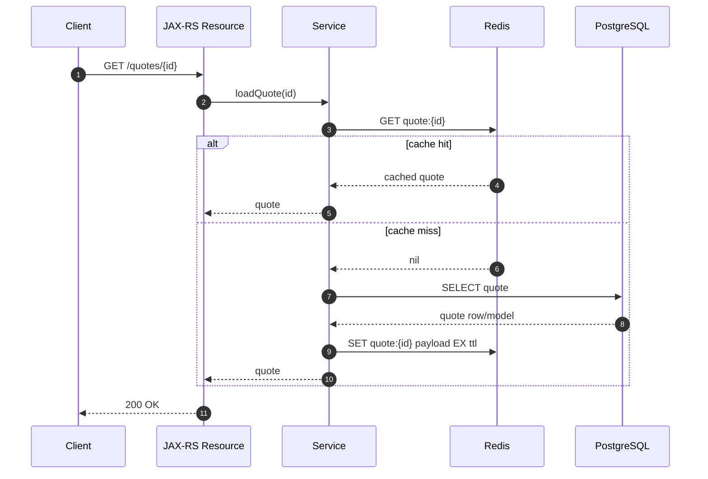

# Part 001 — Redis Foundation for Enterprise Java Systems

## 1. Tujuan Part Ini

Part ini membangun fondasi berpikir tentang Redis untuk engineer backend enterprise.

Targetnya bukan sekadar bisa menjalankan:

```redis
SET key value
GET key
```

Targetnya adalah mampu menjawab pertanyaan desain yang jauh lebih penting:

- Redis sedang dipakai sebagai apa?
- Data di Redis boleh hilang atau tidak?
- Redis mempercepat sistem atau justru menjadi correctness risk?
- Redis adalah cache, coordination helper, queue ringan, stream primitive, session store, atau accidental database?
- Apa yang terjadi jika Redis lambat, penuh, failover, flush, restart, eviction, atau network-nya bermasalah?
- Bagaimana Redis memengaruhi Java/JAX-RS service, PostgreSQL/MyBatis/JDBC, Kafka/RabbitMQ, Kubernetes, cloud, dan on-prem deployment?

Part ini adalah peta awal. Detail teknis setiap area akan diperdalam di part berikutnya.

---

## 2. Mental Model Singkat

Redis adalah **in-memory data structure server**.

Artinya:

1. Redis menyimpan data terutama di memory.
2. Redis menyediakan data structure siap pakai, bukan hanya blob key-value sederhana.
3. Redis mengeksekusi command dengan sangat cepat karena sebagian besar operasi terjadi di memory.
4. Redis sering dipakai sebagai komponen pendukung aplikasi, bukan source of truth utama.
5. Redis dapat dipakai untuk cache, counter, TTL state, deduplication, rate limiting, idempotency, locking, Pub/Sub, Streams, job queue ringan, dan session store.

Mental model yang lebih tepat:

> Redis adalah runtime data structure layer yang memberi aplikasi primitive cepat untuk state yang ephemeral, derived, coordination-oriented, atau latency-sensitive.

Mental model yang salah:

> Redis adalah database cepat untuk menyimpan semua data penting karena PostgreSQL terasa lambat.

Redis bisa durable dalam konfigurasi tertentu, tetapi durability Redis tetap harus dipahami sebagai trade-off. Redis bukan pengganti default untuk PostgreSQL, Kafka, RabbitMQ, audit log, ledger, atau transactional system of record.

---

## 3. Redis Sebagai In-Memory Data Structure Server

Redis bukan sekadar `Map<String, String>` remote.

Redis menyediakan beberapa struktur data:

| Struktur | Contoh Use Case |
|---|---|
| String | cache value, token, counter, lock marker, idempotency marker |
| Hash | object-like cache, tenant config, sparse map |
| List | simple queue, stack, blocking queue |
| Set | membership, deduplication, uniqueness check |
| Sorted Set | ranking, delayed queue, sliding window limiter, time index |
| Bitmap | compact boolean tracking |
| Bitfield | compact numeric flags |
| HyperLogLog | approximate cardinality |
| Geo | geospatial index |
| Stream | append-only stream, consumer group, queue/event-log-lite |

Implikasi desain:

- Pilihan struktur data menentukan complexity command.
- Pilihan struktur data menentukan memory overhead.
- Pilihan struktur data menentukan cara cleanup.
- Pilihan struktur data menentukan atomicity yang tersedia.
- Pilihan struktur data menentukan observability dan failure mode.

Kesalahan umum:

- Semua payload disimpan sebagai JSON string tanpa mempertimbangkan partial update.
- Hash dipakai sebagai object store besar tanpa batas.
- Set besar dibaca dengan `SMEMBERS`.
- Sorted set tumbuh tanpa cleanup.
- Stream dipakai tanpa retention dan pending-entry monitoring.
- Key dibuat tanpa TTL padahal data bersifat ephemeral.

---

## 4. Redis Sebagai Cache

Redis paling sering dipakai sebagai distributed cache.

Cache berarti:

> Salinan data yang bertujuan mempercepat akses atau mengurangi beban source of truth.

Dalam sistem enterprise Java/JAX-RS, Redis cache biasanya berada di antara service layer dan PostgreSQL/API eksternal.

Contoh lifecycle cache-aside:



Cache terlihat sederhana, tetapi correctness-nya sulit.

Pertanyaan penting:

- Data ini source of truth-nya di mana?
- Berapa stale window yang diterima?
- Siapa yang menghapus cache saat data berubah?
- TTL-nya berapa dan kenapa?
- Apa yang terjadi saat cache miss massal?
- Apa yang terjadi jika Redis penuh dan key ter-evict?
- Apa yang terjadi jika cache update berhasil tetapi DB transaction rollback?
- Apa yang terjadi jika DB commit berhasil tetapi cache invalidation gagal?

Cache bukan hanya performance topic. Cache adalah **distributed consistency topic**.

---

## 5. Redis Sebagai Coordination Layer

Redis sering dipakai untuk coordination ringan antar instance service.

Contoh:

- single-flight agar hanya satu instance reload data mahal;
- distributed lock untuk critical section tertentu;
- distributed semaphore untuk membatasi concurrency;
- deduplication marker;
- global throttle;
- maintenance flag;
- kill switch;
- feature flag cache;
- leader election-lite;
- work claiming.

Namun Redis coordination harus dipahami sebagai **best-effort coordination**, kecuali didesain dengan correctness boundary yang kuat.

Masalah yang harus dipikirkan:

- Redis lock bisa expired saat proses masih berjalan.
- JVM bisa mengalami GC pause.
- Network partition bisa membuat client salah mengira lock masih valid.
- Failover Redis bisa menyebabkan write loss.
- Lock tanpa fencing token tidak cukup untuk melindungi resource eksternal tertentu.
- Coordination state yang hilang bisa menyebabkan duplicate work.

Prinsip utama:

> Jangan memakai Redis coordination untuk correctness yang membutuhkan serializability kuat kecuali seluruh failure mode sudah didesain dan diuji.

---

## 6. Redis Sebagai Rate Limiter Backend

Redis cocok untuk distributed rate limiting karena:

- command cepat;
- counter atomic tersedia;
- TTL tersedia;
- sorted set bisa menjadi time-window index;
- Lua script dapat membuat multi-step operation menjadi atomic;
- semua instance service bisa berbagi state limit yang sama.

Use case:

- per-IP limit;
- per-user limit;
- per-tenant limit;
- per-endpoint limit;
- global API limit;
- burst control;
- login attempt limiter;
- expensive operation limiter.

Contoh fixed window sederhana:

```redis
INCR rl:tenant:acme:endpoint:createQuote:2026-07-11T10:15
EXPIRE rl:tenant:acme:endpoint:createQuote:2026-07-11T10:15 60
```

Masalahnya: `INCR` dan `EXPIRE` sebagai dua command terpisah bisa meninggalkan key tanpa TTL jika proses gagal di antara keduanya.

Karena itu implementasi production sering membutuhkan:

- Lua script;
- transaction;
- command atomic yang tepat;
- TTL discipline;
- cleanup;
- memory growth control;
- clear 429 response strategy;
- observability terhadap allowed/blocked request.

---

## 7. Redis Sebagai Idempotency Store

Idempotency berarti request yang sama dapat dikirim ulang tanpa menghasilkan efek samping ganda.

Redis sering dipakai untuk menyimpan:

- idempotency key;
- request fingerprint;
- processing marker;
- completed marker;
- cached response;
- failure state;
- TTL idempotency record.

Contoh state sederhana:

```text
NEW_REQUEST
  -> PROCESSING
  -> COMPLETED
  -> EXPIRED

PROCESSING
  -> COMPLETED
  -> FAILED
  -> UNKNOWN
```

Use case dalam Quote/Order system:

- create quote;
- submit order;
- confirm payment-like event;
- retry command dari client;
- duplicate message dari broker;
- submit ulang karena timeout.

Redis membantu, tetapi tidak menghapus masalah distributed consistency.

Failure window yang harus dipikirkan:

| Failure | Risiko |
|---|---|
| Redis marker berhasil, DB commit gagal | request berikutnya mungkin dianggap sedang/selesai diproses |
| DB commit berhasil, Redis response cache gagal | duplicate request mungkin diproses ulang |
| Client timeout, server masih jalan | client retry saat state masih PROCESSING |
| TTL terlalu pendek | duplicate lama bisa masuk lagi |
| TTL terlalu panjang | legitimate retry bisa tertahan terlalu lama |
| Fingerprint tidak dicek | key sama dengan payload berbeda bisa salah replay |

Prinsip:

> Idempotency bukan exactly-once. Idempotency adalah desain eksplisit untuk mengendalikan efek retry dan duplicate.

---

## 8. Redis Sebagai Lightweight Queue

Redis bisa dipakai sebagai queue ringan dengan List, Sorted Set, atau Streams.

Pilihan umum:

| Redis Primitive | Queue Style |
|---|---|
| List | simple FIFO/LIFO queue |
| Blocking List | worker blocking queue |
| Sorted Set | delayed job / scheduled job |
| Stream | consumer group, ack, replay-lite |

Namun Redis bukan selalu pengganti RabbitMQ atau Kafka.

Redis queue cocok ketika:

- workload ringan;
- durability requirement terbatas;
- operational simplicity lebih penting;
- retry semantics sederhana;
- backlog tidak terlalu besar;
- replay requirement tidak sekuat Kafka;
- routing/ack model tidak serumit RabbitMQ.

Redis queue kurang cocok ketika:

- pesan tidak boleh hilang;
- audit trail wajib;
- replay panjang diperlukan;
- ordering lintas partition penting;
- consumer group semantics butuh tooling matang;
- broker sudah menjadi backbone event architecture.

Dalam enterprise system, Redis queue harus direview dengan pertanyaan:

- Apa yang terjadi jika worker crash?
- Bagaimana retry dilakukan?
- Bagaimana poison job ditangani?
- Apakah ada DLQ-like mechanism?
- Bagaimana backlog dimonitor?
- Bagaimana job idempotency dijamin?
- Apa yang terjadi saat Redis restart/failover?

---

## 9. Redis Sebagai Stream Primitive

Redis Streams menyediakan append-only data structure dengan consumer group.

Redis Streams dapat dipakai untuk:

- job queue yang butuh ack;
- event log-lite;
- work distribution;
- small stream processing;
- retry dengan pending entry list;
- replay terbatas;
- DLQ-like pattern.

Namun Redis Streams bukan Kafka.

Perbandingan singkat:

| Aspek | Redis Streams | Kafka |
|---|---|---|
| Primary use | lightweight stream/queue | distributed commit log |
| Retention | per stream trimming/config | retention log-oriented |
| Scaling model | Redis memory/cluster-bound | partition-based distributed log |
| Consumer state | consumer group + PEL | group offset |
| Durability | depends on Redis persistence/replication | broker log durability model |
| Ecosystem | simpler | richer stream ecosystem |

Gunakan Redis Streams jika kebutuhan stream masih dekat dengan Redis use case dan tidak membutuhkan event backbone berskala besar.

Gunakan Kafka jika event adalah kontrak enterprise, perlu replay kuat, retention panjang, consumer ecosystem besar, dan decoupling antar domain.

---

## 10. Redis Sebagai Pub/Sub Broker

Redis Pub/Sub adalah fire-and-forget messaging.

Cocok untuk:

- notification ringan;
- cache invalidation hint;
- local process coordination;
- non-critical signal;
- live update yang boleh hilang.

Tidak cocok untuk:

- durable event;
- command penting;
- audit event;
- order lifecycle event;
- integration event antar domain;
- message yang wajib sampai;
- subscriber yang bisa offline;
- replay.

Pub/Sub limitation:

- tidak durable;
- tidak ada replay;
- tidak ada consumer group;
- subscriber offline akan kehilangan message;
- message delivery bergantung koneksi aktif.

Prinsip:

> Redis Pub/Sub boleh dipakai untuk signal yang boleh hilang, bukan untuk fakta bisnis yang harus tercatat.

---

## 11. Redis Sebagai Session Store

Redis sering dipakai untuk session dan security state karena TTL natural.

Use case:

- HTTP session;
- token blacklist;
- refresh token state;
- password reset token;
- CSRF token;
- one-time token;
- login attempt counter;
- MFA attempt counter;
- temporary authorization state.

Risiko:

- Redis outage bisa memengaruhi login/session validation.
- TTL salah bisa logout terlalu cepat atau session terlalu panjang.
- PII/token di value harus dilindungi.
- PII di key name harus dihindari.
- Snapshot/backup bisa mengandung sensitive state.
- Key eviction bisa menyebabkan user logout massal atau bypass state tertentu jika fallback salah.

Prinsip:

> Security state di Redis harus diperlakukan sebagai sensitive state, bukan cache biasa.

---

## 12. Redis vs PostgreSQL

Redis dan PostgreSQL memiliki peran berbeda.

| Aspek | Redis | PostgreSQL |
|---|---|---|
| Primary model | in-memory data structures | relational database |
| Durability | optional/config-dependent | strong durable storage |
| Query | key/data-structure command | SQL |
| Transaction | limited Redis transaction/Lua | ACID transaction |
| Data relationship | weak | strong relational model |
| Schema | application-managed | database-enforced |
| Use case | cache, ephemeral state, coordination | source of truth, transactional data |
| Failure tolerance | depends on use case | core data integrity system |

Gunakan PostgreSQL untuk:

- quote/order source of truth;
- transactional state;
- audit data;
- relational constraints;
- reporting source;
- long-lived business data.

Gunakan Redis untuk:

- cache atas data PostgreSQL;
- derived read model;
- rate limiter;
- idempotency marker;
- temporary state;
- fast lookup;
- coordination helper.

Anti-pattern:

```text
"Query PostgreSQL lambat, jadi semua data order kita pindahkan ke Redis."
```

Pendekatan yang benar:

```text
"Query PostgreSQL lambat, mari analisis index, query plan, read model, cacheable access pattern, TTL, invalidation, dan consistency requirement."
```

---

## 13. Redis vs Memcached

| Aspek | Redis | Memcached |
|---|---|---|
| Data structure | rich structures | simple key-value |
| Persistence | available | generally no |
| Replication/Cluster | available | simpler distributed caching |
| Atomic primitives | richer | limited |
| Use case breadth | cache + coordination + streams + pub/sub | cache primarily |
| Operational complexity | higher | lower |

Memcached cocok untuk simple cache besar yang tidak membutuhkan Redis data structures.

Redis cocok ketika butuh:

- TTL cache;
- atomic counter;
- set/sorted set;
- lock/idempotency primitive;
- stream/pubsub;
- richer operational pattern.

Namun semakin banyak Redis dipakai untuk banyak peran, semakin penting governance dan ownership.

---

## 14. Redis vs Kafka

| Aspek | Redis | Kafka |
|---|---|---|
| Core abstraction | data structure server | distributed log |
| Message durability | depends on Redis persistence | log durability model |
| Replay | Streams limited/requires retention | first-class replay |
| Consumer ecosystem | simpler | extensive |
| Long retention | not primary strength | primary strength |
| Ordering | structure/slot dependent | partition-based |
| Typical role | cache/state/coordination/light stream | event backbone |

Redis bukan pengganti Kafka untuk event backbone.

Redis bisa membantu Kafka-based system dengan:

- cache invalidation state;
- deduplication;
- offset-related temporary state;
- projection cache;
- rate limiter;
- idempotency marker.

Kafka tetap lebih tepat untuk:

- integration events;
- audit-like event log;
- domain event stream;
- replayable projections;
- long retention;
- multi-consumer decoupling.

---

## 15. Redis vs RabbitMQ

| Aspek | Redis | RabbitMQ |
|---|---|---|
| Core abstraction | data structures | message broker |
| Routing | application-managed | exchange/queue routing |
| Ack model | Streams have ack; List custom | first-class broker ack |
| Retry/DLQ | custom pattern | broker-supported pattern |
| Work queue | possible | strong fit |
| Pub/Sub | non-durable | exchange-based routing options |

Redis can be enough for lightweight jobs.

RabbitMQ lebih tepat untuk:

- command queue;
- routing complex;
- ack/retry/DLQ yang jelas;
- work distribution;
- broker-level operational semantics;
- integration dengan existing messaging topology.

---

## 16. Redis vs Local Cache

Local cache berada di memory aplikasi.

Contoh Java local cache:

- Caffeine;
- Guava Cache;
- in-memory map dengan TTL;
- framework-level cache.

| Aspek | Local Cache | Redis |
|---|---|---|
| Latency | sangat rendah | network round-trip |
| Scope | per JVM/pod | shared antar instance |
| Consistency | sulit antar instance | lebih konsisten secara distributed |
| Failure | hilang saat pod restart | bergantung Redis |
| Capacity | per pod | central/shared |
| Operational risk | app memory pressure | Redis memory/network pressure |

Pola umum enterprise:

```text
local cache -> Redis distributed cache -> PostgreSQL source of truth
```

Namun multi-level cache menambah kompleksitas invalidation.

Pertanyaan review:

- Apakah local cache punya TTL lebih pendek dari Redis?
- Bagaimana invalidation local cache?
- Apakah stale window diterima?
- Apakah key hot enough untuk local cache?
- Apakah memory pod cukup?

---

## 17. Redis vs Distributed In-Memory Grid

Contoh distributed in-memory grid:

- Hazelcast;
- Apache Ignite;
- Infinispan;
- vendor-specific distributed cache/grid.

Redis biasanya lebih sederhana sebagai remote data structure server.

Distributed grid bisa lebih cocok jika butuh:

- distributed object model;
- compute near data;
- cluster-aware in-memory maps;
- embedded mode;
- richer distributed data processing;
- strong integration dengan JVM ecosystem tertentu.

Redis lebih cocok jika butuh:

- language-agnostic shared state;
- simple operational model;
- rich primitive;
- externalized cache/coordination;
- ecosystem cloud-managed yang luas.

---

## 18. Redis dalam Enterprise Java/JAX-RS System

Dalam Java/JAX-RS service, Redis biasanya muncul di layer berikut:

```text
HTTP Client
  -> JAX-RS Resource
  -> Application Service
  -> Domain/Application Logic
  -> Redis Adapter / Repository / Gateway
  -> Redis Client
  -> Redis Server / Cluster / Managed Redis
```

Desain yang sehat:

- JAX-RS resource tidak langsung memanggil Redis untuk business logic kompleks.
- Redis access dibungkus dalam adapter/gateway.
- Timeout Redis lebih kecil dari request timeout.
- Failure Redis dipetakan secara eksplisit.
- Cache failure tidak otomatis menjadi HTTP 500 jika data masih bisa diambil dari DB.
- Rate limiter failure behavior didefinisikan: fail-open atau fail-closed.
- Lock/idempotency failure tidak disembunyikan.
- Metrics client dan server dikumpulkan.
- Redis key ownership terdokumentasi.

Contoh boundary:

```java
public interface QuoteCache {
    Optional<CachedQuote> getQuote(String tenantId, String quoteId);
    void putQuote(String tenantId, String quoteId, CachedQuote quote, Duration ttl);
    void invalidateQuote(String tenantId, String quoteId);
}
```

Interface seperti ini membantu:

- menghindari Redis command tersebar di semua service;
- memusatkan key naming;
- memusatkan serialization;
- memusatkan TTL policy;
- memudahkan testing;
- memudahkan observability.

---

## 19. Redis dalam CPQ / Quote-to-Order Context

Dalam domain CPQ dan Quote-to-Order, Redis mungkin berguna untuk:

- cache catalog data yang sering dibaca;
- cache pricing rule hasil komputasi;
- cache eligibility result;
- cache tenant configuration;
- cache quote summary read model;
- idempotency key untuk submit quote/order;
- distributed rate limiter untuk API mahal;
- temporary lock untuk mencegah duplicate operation;
- session/security state;
- background job coordination;
- short-lived computation state.

Namun banyak data CPQ/order bersifat correctness-sensitive.

Jangan menyimpan state penting berikut hanya di Redis tanpa desain durability dan recovery:

- final quote state;
- order lifecycle state;
- billing-impacting decision;
- audit trail;
- pricing decision final tanpa trace;
- customer commitment;
- approval state final;
- integration event final;
- compliance evidence.

Redis boleh mempercepat atau mengoordinasikan, tetapi source of truth tetap harus jelas.

---

## 20. Kapan Menggunakan Redis

Gunakan Redis ketika ada kebutuhan berikut:

1. **Low-latency lookup**
   - data sering dibaca;
   - query DB mahal;
   - stale window diterima.

2. **Ephemeral state**
   - token;
   - attempt counter;
   - temporary marker;
   - TTL-based state.

3. **Distributed counter**
   - rate limiter;
   - quota;
   - attempt count.

4. **Deduplication**
   - idempotency key;
   - processed message marker;
   - duplicate request suppression.

5. **Coordination ringan**
   - single-flight;
   - semaphore;
   - lock best-effort;
   - global throttle.

6. **Queue ringan**
   - background job sederhana;
   - delayed execution sederhana;
   - stream worker ringan.

7. **Session/security state**
   - expiring state;
   - shared across pods.

8. **Derived state**
   - read model cache;
   - projection cache;
   - computed value.

---

## 21. Kapan Tidak Menggunakan Redis

Jangan menggunakan Redis ketika:

1. **Data adalah source of truth utama**
   - gunakan PostgreSQL atau database yang sesuai.

2. **Butuh transaksi relational**
   - Redis tidak menggantikan ACID relational transaction.

3. **Butuh query kompleks**
   - Redis bukan SQL database.

4. **Butuh durable integration event**
   - gunakan Kafka/RabbitMQ sesuai kebutuhan.

5. **Butuh audit trail**
   - Redis bukan audit log.

6. **Butuh replay panjang**
   - Kafka lebih tepat.

7. **Butuh strong lock correctness**
   - pertimbangkan DB lock, fencing token, atau desain lain.

8. **Tim tidak punya operational readiness**
   - Redis mudah dipakai, tetapi production Redis perlu observability, runbook, capacity planning, security, dan ownership.

9. **TTL/invalidation tidak bisa dijelaskan**
   - cache tanpa invalidation model adalah incident tertunda.

---

## 22. Design Invariants Redis Enterprise

Saat Redis muncul dalam desain, minimal invariant berikut harus jelas:

### 22.1 Ownership

Setiap keyspace harus punya owner.

```text
service:entity:identifier
```

Tanpa owner, key akan sulit dihapus, dimigrasikan, di-debug, dan diamankan.

### 22.2 Source of Truth

Untuk setiap data di Redis, harus jelas:

```text
Redis data ini berasal dari mana?
Jika Redis hilang, bagaimana rebuild?
```

### 22.3 TTL Policy

Untuk setiap key ephemeral, TTL harus eksplisit.

```text
Tidak ada TTL = keputusan sadar, bukan kelalaian.
```

### 22.4 Failure Behavior

Harus jelas:

- fail-open;
- fail-closed;
- fallback to DB;
- fallback to stale;
- reject request;
- retry;
- degrade gracefully.

### 22.5 Serialization Contract

Payload harus compatible dengan rolling deployment.

### 22.6 Observability

Harus ada metric untuk:

- latency;
- hit/miss;
- error;
- timeout;
- eviction;
- memory;
- key growth;
- command stats.

### 22.7 Security Boundary

Harus jelas apakah Redis menyimpan:

- PII;
- token;
- session;
- secret-derived state;
- tenant-sensitive data.

### 22.8 Operational Recovery

Harus jelas:

- bagaimana restart;
- bagaimana failover;
- bagaimana restore;
- bagaimana rebuild cache;
- bagaimana flush dilakukan dengan aman;
- siapa yang boleh menjalankan command berbahaya.

---

## 23. Failure-Oriented Redis Thinking

Redis design harus dimulai dari pertanyaan kegagalan.

### 23.1 Redis Unavailable

Apa yang terjadi jika Redis tidak bisa dihubungi?

| Use Case | Failure Behavior yang Perlu Diputuskan |
|---|---|
| Cache | fallback ke DB atau return error? |
| Rate limiter | fail-open atau fail-closed? |
| Idempotency | reject request atau risk duplicate? |
| Lock | skip job atau risk concurrent execution? |
| Session | logout user atau allow degraded auth? |
| Queue | stop worker atau buffer elsewhere? |

### 23.2 Redis Slow

Redis slow lebih berbahaya daripada Redis down karena bisa membuat thread pool habis.

Mitigasi:

- command timeout;
- circuit breaker;
- bulkhead;
- pool limit;
- backpressure;
- slowlog monitoring;
- fallback path.

### 23.3 Redis Memory Pressure

Dampak:

- eviction;
- latency spike;
- OOM;
- failed writes;
- loss of cache effectiveness;
- unexpected missing keys.

Mitigasi:

- maxmemory policy dipahami;
- TTL discipline;
- big key detection;
- cardinality control;
- memory dashboard;
- alerting.

### 23.4 Redis Failover

Dampak:

- reconnect storm;
- write loss;
- duplicate operation;
- stale replica read;
- MOVED/ASK redirection;
- temporary timeout.

Mitigasi:

- client config benar;
- retry policy hati-hati;
- idempotency;
- connection backoff;
- failover testing.

### 23.5 Redis Data Corruption by Application

Redis jarang “korup” sendiri; seringnya aplikasi salah menulis.

Contoh:

- serializer berubah;
- key collision;
- TTL salah;
- tenant prefix hilang;
- value schema berubah;
- response cache dipakai untuk request fingerprint berbeda.

Mitigasi:

- key naming governance;
- payload versioning;
- request fingerprint;
- tests;
- production-safe inspection.

---

## 24. Debugging Redis dari Sudut Pandang Backend

Saat ada masalah Redis, jangan langsung membuka CLI dan menjalankan command berbahaya.

Mulai dari symptom aplikasi:

```text
HTTP 500 meningkat?
Latency meningkat?
DB load naik?
Cache hit ratio turun?
User terkena rate limit salah?
Duplicate order/quote submit?
Worker backlog naik?
Session tiba-tiba hilang?
```

Lalu petakan ke layer:

```text
Client request
  -> JAX-RS resource
  -> service method
  -> Redis adapter
  -> Redis client pool/event loop
  -> network
  -> Redis server
  -> Redis memory/CPU/command
  -> persistence/replication/cluster
```

Production-safe evidence:

- application logs dengan correlation ID;
- Redis client metrics;
- Redis server metrics;
- slowlog;
- commandstats;
- memory stats;
- keyspace stats;
- connection count;
- timeout/error rate;
- deployment events;
- failover events;
- broker/DB lag jika Redis terkait invalidation/projection.

Hindari:

```redis
KEYS *
MONITOR
SMEMBERS huge:set
HGETALL huge:hash
ZRANGE huge:zset 0 -1
LRANGE huge:list 0 -1
```

Command di atas bisa sangat mengganggu production jika key besar atau traffic tinggi.

---

## 25. Senior Engineer Review Questions

Saat Redis muncul dalam PR/ADR, tanyakan:

1. Redis dipakai sebagai apa?
2. Apa source of truth data ini?
3. Apakah data boleh hilang?
4. TTL-nya apa dan kenapa?
5. Apa invalidation trigger-nya?
6. Apa stale window yang diterima?
7. Apa key naming convention-nya?
8. Apakah key mengandung tenant?
9. Apakah key/value mengandung PII?
10. Apa serialization format-nya?
11. Bagaimana rolling deployment compatibility?
12. Apa yang terjadi jika Redis down?
13. Apa yang terjadi jika Redis slow?
14. Apa yang terjadi jika key ter-evict?
15. Apa yang terjadi saat failover?
16. Apakah operation butuh atomicity multi-command?
17. Jika memakai lock, apakah butuh fencing token?
18. Jika memakai limiter, apakah memory cleanup jelas?
19. Jika memakai stream/queue, bagaimana retry dan poison message?
20. Apa metric dan alert-nya?
21. Apa runbook incident-nya?
22. Siapa owner keyspace-nya?
23. Apakah ini sudah diuji dengan concurrency/failure?
24. Apakah Redis adalah pilihan yang lebih tepat dari PostgreSQL/Kafka/RabbitMQ/local cache?
25. Apa rencana migrasi atau cleanup jika desain berubah?

---

## 26. Internal Verification Checklist

Gunakan checklist ini untuk memahami penggunaan Redis di lingkungan internal tanpa mengarang detail yang belum diverifikasi.

### 26.1 Redis Usage Inventory

Cek:

- service mana yang memakai Redis;
- dependency Redis client di build file;
- wrapper/internal library Redis;
- environment variable Redis;
- Kubernetes secret/config;
- Helm values;
- Terraform/IaC;
- dashboard Redis;
- incident notes terkait Redis.

### 26.2 Redis Role per Service

Untuk setiap service, tandai Redis digunakan sebagai:

- cache;
- rate limiter;
- idempotency store;
- distributed lock;
- session store;
- token/security state;
- Pub/Sub;
- Stream;
- job queue;
- feature/config cache;
- coordination flag;
- unknown.

### 26.3 Keyspace Governance

Cek:

- key naming convention;
- prefix service;
- prefix tenant;
- prefix environment;
- version prefix;
- TTL policy;
- owner keyspace;
- sensitive data risk;
- cleanup strategy.

### 26.4 Client Configuration

Cek:

- client library;
- connection pool;
- timeout;
- retry;
- reconnect;
- circuit breaker;
- cluster/sentinel awareness;
- TLS;
- auth/ACL;
- metrics.

### 26.5 Deployment and Operations

Cek:

- Redis OSS/self-managed/managed service;
- standalone/Sentinel/Cluster;
- persistence config;
- eviction policy;
- maxmemory;
- backup/restore;
- failover behavior;
- dashboard;
- alerting;
- runbook.

### 26.6 Security and Compliance

Cek:

- AUTH/ACL;
- TLS;
- network isolation;
- PII in key/value;
- token/session handling;
- snapshot/backup access;
- secret rotation;
- dangerous command restriction;
- audit evidence.

---

## 27. Mini Decision Matrix

| Need | Redis Fit | Alternative |
|---|---:|---|
| Fast cache over DB | Strong | Local cache, CDN, materialized view |
| Durable source of truth | Weak | PostgreSQL |
| Integration event backbone | Weak | Kafka |
| Work queue with routing/DLQ | Medium | RabbitMQ |
| Simple distributed counter | Strong | DB counter, local counter |
| Rate limiting | Strong | API gateway limiter, service mesh |
| Idempotency marker | Strong with caveats | PostgreSQL unique constraint/table |
| Strong distributed lock | Risky | DB lock, lease service, fencing design |
| Session store | Strong with security controls | DB/session service |
| Pub/Sub notification | Medium | RabbitMQ/Kafka/WebSocket infra |
| Long replay stream | Weak/Medium | Kafka |
| Temporary config cache | Strong with fallback | Config service/local cache |

---

## 28. Anti-Patterns

### 28.1 Redis as Accidental Source of Truth

```text
Redis contains the only copy of business-critical state.
```

Problem:

- restart/failover/persistence config can lose data;
- no relational constraint;
- hard to audit;
- hard to recover.

### 28.2 Cache Without TTL

```text
SET quote:{id} payload
```

Problem:

- stale forever;
- memory growth;
- invisible correctness issue.

### 28.3 TTL Without Business Reason

```text
TTL = 5 minutes because it sounds reasonable.
```

Problem:

- stale window arbitrary;
- incident root cause hard to defend.

### 28.4 Lock Without Owner Value

```redis
SETNX lock:job true
DEL lock:job
```

Problem:

- client can delete another client's lock.

### 28.5 Pub/Sub for Critical Events

Problem:

- subscriber offline loses event;
- no replay;
- no audit.

### 28.6 Big Key as Hidden Database

Problem:

- high memory;
- slow command;
- network amplification;
- difficult cleanup.

### 28.7 Redis Failure Hidden by Generic Exception

Problem:

- no observability;
- no clear fallback;
- incident diagnosis slow.

---

## 29. What Good Looks Like

Redis usage is healthy when:

- each keyspace has owner and purpose;
- each key has predictable lifecycle;
- TTL is intentional;
- invalidation is designed;
- fallback behavior is explicit;
- Redis is not the hidden source of truth;
- serialization is version-aware;
- rate limiter/idempotency/lock logic is atomic enough for its correctness need;
- security controls match data sensitivity;
- dashboards show latency, errors, memory, hit ratio, eviction, slow commands, and keyspace growth;
- runbook exists;
- failure modes are tested;
- PR review asks correctness questions, not only performance questions.

---

## 30. Recap

Redis is powerful because it gives backend systems fast shared primitives.

Redis is dangerous because those primitives look simple while hiding distributed systems failure modes.

For a Senior Java Software Engineer, the important shift is:

```text
Beginner view:
Redis is fast key-value storage.

Senior view:
Redis is an in-memory data structure and coordination layer whose correctness depends on TTL, ownership, atomicity, failure behavior, observability, security, and operational discipline.
```

Part berikutnya akan membahas **Redis Architecture Mental Model**: server process, event loop, command lifecycle, memory model, persistence, replication, Sentinel, Cluster, Pub/Sub subsystem, Streams, dan kenapa Redis berperilaku berbeda dari database/broker.
