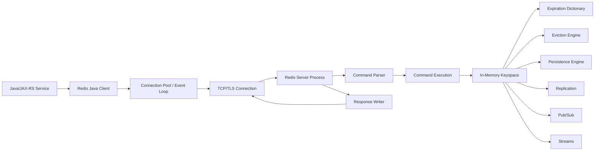
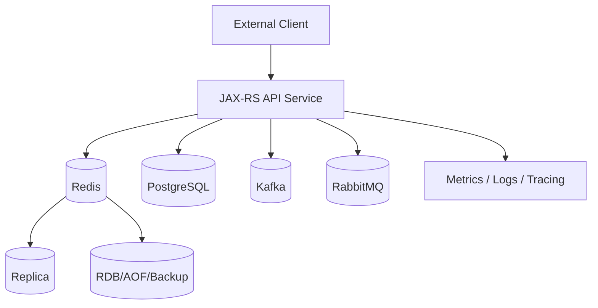
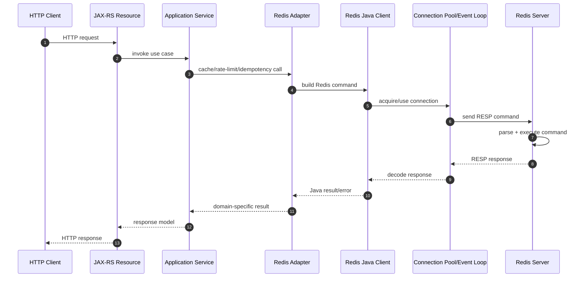
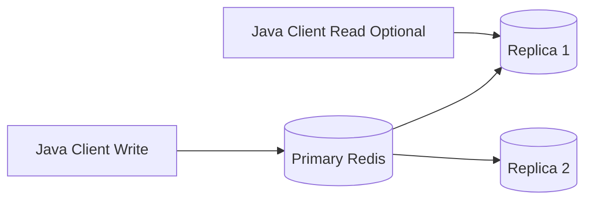
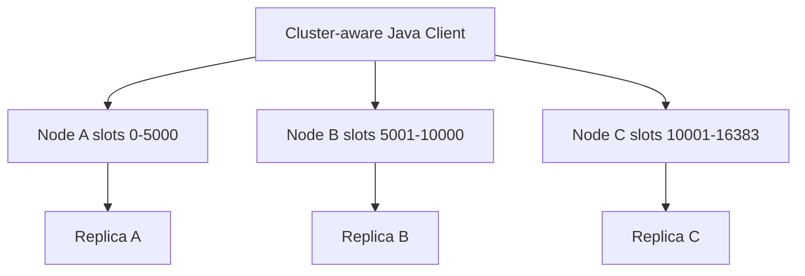
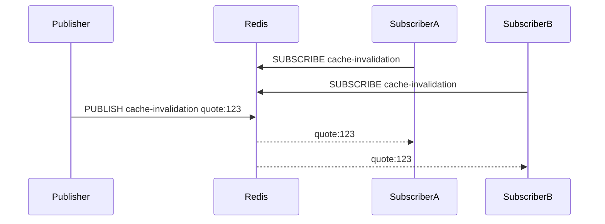
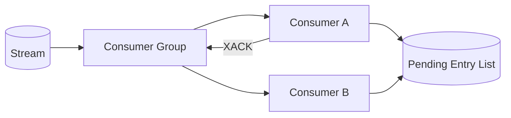

# Part 002 — Redis Architecture Mental Model

## 1. Tujuan Part Ini

Part ini membangun mental model arsitektur Redis dari sudut pandang engineer backend yang harus mengoperasikan Redis secara aman di sistem enterprise.

Setelah membaca part ini, Redis tidak lagi dilihat sebagai kotak hitam yang hanya menerima command `GET` dan `SET`.

Target pemahaman:

- bagaimana request Java/JAX-RS berubah menjadi command Redis;
- bagaimana client connection berinteraksi dengan Redis server;
- bagaimana Redis memproses command;
- kenapa Redis sangat cepat untuk banyak operasi;
- kenapa Redis bisa tetap mengalami latency spike;
- bagaimana keyspace, TTL, eviction, memory, persistence, replication, Sentinel, Cluster, Pub/Sub, dan Streams masuk ke satu model;
- bagaimana failure Redis memengaruhi service Java, PostgreSQL, Kafka/RabbitMQ, Kubernetes, cloud, dan on-prem deployment.

---

## 2. Big Picture Architecture

Redis dapat dipahami sebagai server process yang menerima command dari banyak client, memproses command terhadap keyspace in-memory, lalu mengembalikan response.



Redis server process memiliki beberapa subsistem penting:

- networking layer;
- protocol parser;
- command dispatcher;
- keyspace;
- expiration engine;
- eviction engine;
- memory allocator;
- persistence engine;
- replication;
- Sentinel integration;
- Cluster mode;
- Pub/Sub subsystem;
- Streams data structure;
- module ecosystem.

Dalam arsitektur enterprise, Redis jarang berdiri sendiri. Redis biasanya berada dalam topology:



---

## 3. Request-to-Redis Lifecycle dari Java/JAX-RS

Redis command dari aplikasi biasanya melewati beberapa boundary.



Setiap boundary bisa gagal.

| Boundary | Failure Example |
|---|---|
| JAX-RS → Service | request context hilang, timeout tidak dipropagasi |
| Service → Adapter | key salah, TTL salah, serialization salah |
| Adapter → Client | command salah, wrong API, blocking call |
| Client → Pool | pool exhausted |
| Pool → Network | timeout, DNS issue, TLS issue |
| Network → Redis | packet loss, connection reset |
| Redis Server | slow command, memory pressure, failover |
| Response Decode | deserialization error |
| Error Mapping | Redis error menjadi HTTP 500 tanpa konteks |

Senior engineer harus melihat Redis bukan hanya sebagai server, tetapi sebagai distributed call yang masuk ke request critical path.

---

## 4. Redis Server Process

Redis berjalan sebagai server process yang mendengarkan koneksi client.

Tanggung jawab server process:

- menerima TCP/TLS connection;
- membaca command;
- parsing protocol;
- menjalankan command terhadap keyspace;
- mengelola TTL;
- mengelola eviction saat memory pressure;
- menjalankan persistence;
- melakukan replication;
- menangani Pub/Sub;
- menangani Streams;
- mengirim response;
- mencatat metrics internal.

Implikasi:

- Redis process adalah shared dependency.
- Banyak service/pod bisa bergantung ke satu Redis.
- Satu command buruk bisa memengaruhi banyak aplikasi.
- Memory pressure Redis bisa berdampak lintas service.
- Redis latency bisa memperlambat request Java/JAX-RS meskipun PostgreSQL sehat.
- Redis outage bisa terlihat sebagai API latency, 500, auth failure, duplicate processing, atau worker backlog.

---

## 5. Redis Event Loop

Redis menggunakan event loop untuk menangani banyak connection secara efisien.

Mental model sederhana:

```text
while server_is_running:
    read client events
    parse commands
    execute commands
    write responses
    process timers
    handle background tasks
```

Karena Redis banyak bekerja di memory dan command execution biasanya cepat, event-loop model memungkinkan throughput tinggi tanpa satu thread per connection.

Namun event loop bukan sihir.

Redis tetap bisa lambat jika:

- command mahal dijalankan;
- key terlalu besar;
- response terlalu besar;
- Lua script terlalu lama;
- blocking command digunakan salah;
- persistence menyebabkan pressure;
- memory fragmentation tinggi;
- network output buffer membesar;
- client lambat membaca response;
- CPU Redis jenuh;
- cluster slot hotspot;
- failover/resharding terjadi.

Prinsip:

> Redis cepat karena command seharusnya kecil, predictable, dan memory-local. Redis melambat ketika aplikasi memperlakukannya seperti database query engine atau object dump besar.

---

## 6. Single-Threaded Command Execution

Mental model penting:

> Banyak command Redis dieksekusi secara serial dalam satu jalur command execution utama.

Konsekuensi positif:

- banyak command sederhana bersifat atomic;
- race condition tertentu lebih mudah dikendalikan;
- tidak ada row-level lock seperti RDBMS untuk command sederhana;
- command kecil sangat cepat.

Konsekuensi negatif:

- command lambat menghambat command lain;
- operasi atas big key bisa memblokir progress;
- Lua script panjang menghambat server;
- `KEYS *` di production bisa berbahaya;
- `SMEMBERS` pada set besar bisa menyebabkan latency spike;
- response besar memakan network dan CPU encoding.

Contoh command yang perlu diwaspadai:

```redis
KEYS *
HGETALL huge:hash
SMEMBERS huge:set
LRANGE huge:list 0 -1
ZRANGE huge:zset 0 -1
EVAL long_running_script 1 key
```

Command tersebut tidak selalu salah, tetapi harus dikontrol berdasarkan ukuran data, environment, dan operational impact.

---

## 7. I/O Threading Awareness

Redis modern dapat memakai I/O threading untuk membantu membaca/menulis network payload dalam konfigurasi tertentu.

Namun mental model aman untuk application engineer:

```text
I/O threading dapat membantu network I/O, tetapi jangan menganggap semua command dieksekusi paralel seperti database multi-worker.
```

Implikasi review:

- tetap hindari command mahal;
- tetap batasi big key;
- tetap ukur latency;
- tetap gunakan pipelining dengan disiplin;
- tetap pahami single-command execution cost;
- jangan berharap I/O threading menyelamatkan desain key yang buruk.

---

## 8. RESP Protocol

Redis client berkomunikasi dengan Redis menggunakan RESP, Redis Serialization Protocol.

Sebagai application engineer, tidak harus menghafal detail RESP, tetapi perlu memahami bahwa:

- command Redis dikirim sebagai payload protocol di atas TCP/TLS;
- Redis client melakukan encoding command;
- Redis server melakukan parsing command;
- response dikirim kembali dan di-decode oleh client;
- network round trip menjadi bagian dari latency;
- pipelining mengurangi round trip;
- response besar tetap mahal walaupun command execution cepat.

Contoh konseptual:

```text
Application call:
redis.get("quote:123")

Encoded command:
*2
$3
GET
$9
quote:123
```

Kenapa ini penting?

Karena Redis call bukan function call lokal. Ia adalah network call.

Untuk Java/JAX-RS:

- jangan memanggil Redis berkali-kali tanpa alasan dalam satu request;
- pertimbangkan `MGET`, batching, atau pipelining;
- hindari N+1 Redis call;
- timeout harus eksplisit;
- error harus dimapping;
- metrics harus dipisahkan dari DB/API call metrics.

---

## 9. Client Connection

Redis connection adalah resource penting.

Java service bisa memakai:

- synchronous client;
- asynchronous client;
- reactive client;
- connection pool;
- event-loop based client;
- cluster-aware client;
- Sentinel-aware client.

Masalah umum:

| Problem | Dampak |
|---|---|
| Pool terlalu kecil | request menunggu connection |
| Pool terlalu besar | Redis connection storm |
| Timeout terlalu panjang | thread request habis |
| Retry agresif | memperparah outage |
| Reconnect storm | failover makin berat |
| TLS handshake mahal | latency saat connection churn |
| DNS issue | client gagal resolve Redis |
| Cluster unaware | MOVED/ASK error tidak tertangani |

Rule of thumb:

> Redis client configuration adalah bagian dari architecture, bukan detail library.

Internal review harus melihat:

- jumlah pod;
- pool size per pod;
- total max connection;
- timeout;
- retry;
- backoff;
- circuit breaker;
- failover handling;
- metrics;
- graceful shutdown.

---

## 10. Command Parsing and Dispatch

Saat Redis menerima command, Redis perlu:

1. membaca bytes dari socket;
2. parsing RESP;
3. validasi command;
4. menemukan command handler;
5. mengecek arity dan argument;
6. mengecek ACL;
7. menjalankan command terhadap keyspace;
8. mengubah memory jika write;
9. mengatur TTL jika perlu;
10. menulis replication/AOF jika aktif;
11. mengirim response.

Satu command sederhana seperti `GET` terlihat kecil, tetapi tetap melewati pipeline server lengkap.

Untuk command write, ada tambahan concern:

- AOF append jika AOF aktif;
- replication ke replica;
- keyspace notification jika aktif;
- memory accounting;
- eviction jika memory pressure;
- dirty counter untuk persistence;
- cluster slot ownership jika cluster mode.

---

## 11. Keyspace

Keyspace adalah ruang data Redis.

Secara konseptual:

```text
key -> value object
```

Value object punya tipe:

- string;
- hash;
- list;
- set;
- sorted set;
- stream;
- dan lainnya.

Redis command biasanya bekerja terhadap key tertentu.

Contoh:

```redis
GET quote:123
HGET tenant:acme:config currency
ZADD rl:user:42 1720000000 request-abc
XADD order-events * type submitted orderId O-123
```

Keyspace design menentukan:

- ownership;
- tenant isolation;
- scan safety;
- cardinality;
- hot key risk;
- big key risk;
- cluster slot distribution;
- deletion strategy;
- privacy exposure.

Keyspace bukan naming detail kecil. Keyspace adalah schema informal Redis.

---

## 12. Database Index

Redis mendukung logical database index pada mode tertentu, misalnya DB 0, DB 1, dan seterusnya.

Namun dalam banyak deployment modern, terutama cluster mode, penggunaan multiple logical DB terbatas atau tidak menjadi strategi isolasi utama.

Untuk enterprise system, isolasi lebih sehat dilakukan lewat:

- environment-level Redis instance;
- separate database/deployment jika perlu;
- key prefix;
- ACL key pattern;
- network isolation;
- tenant-aware key naming;
- service ownership.

Jangan mengandalkan DB index sebagai security boundary kuat.

Internal verification:

- apakah aplikasi memilih DB index tertentu;
- apakah cluster mode digunakan;
- apakah key prefix sudah cukup;
- apakah ada risiko collision antar service;
- apakah Redis logical DB dipakai untuk memisahkan environment secara tidak aman.

---

## 13. Memory Allocator and Memory Model

Redis menyimpan data di memory. Memory cost bukan hanya ukuran payload.

Komponen memory:

- key string;
- value object;
- data structure overhead;
- allocator overhead;
- expiration metadata;
- replication buffer;
- client output buffer;
- AOF/rewrite buffer;
- fragmentation;
- internal encoding overhead.

Contoh:

```text
A 20-byte value can cost far more than 20 bytes in actual Redis memory.
```

Implikasi:

- jutaan key kecil tetap mahal;
- key panjang memperbesar overhead;
- hash/list/set/zset punya encoding internal;
- big key menyebabkan memory dan latency risk;
- response besar bisa memperbesar output buffer;
- memory fragmentation bisa membuat RSS jauh lebih tinggi dari used_memory.

Metrics yang harus dipahami:

- used_memory;
- used_memory_rss;
- mem_fragmentation_ratio;
- maxmemory;
- evicted_keys;
- expired_keys;
- allocator stats;
- client output buffer.

---

## 14. Expiration Dictionary

TTL di Redis dikelola dengan metadata expiration.

Jika key punya TTL, Redis menyimpan expiry time terpisah dari key-value utama.

Redis expiration terjadi melalui dua mekanisme konseptual:

1. **Passive expiration**
   - key dicek saat diakses;
   - jika sudah expired, Redis menghapusnya.

2. **Active expiration**
   - Redis secara berkala mencari dan menghapus key expired.

Implikasi:

- key expired tidak selalu hilang tepat pada milidetik expiry;
- expired key bisa tetap ada sebentar sampai ditemukan;
- beban banyak key expired bersamaan bisa menyebabkan spike;
- TTL jitter membantu mencegah expiry burst;
- keyspace notification untuk expiry tidak boleh dianggap durable.

Contoh problem:

```text
Semua cache catalog diberi TTL 15 menit tepat.
Setiap 15 menit, ribuan key expire bersamaan.
Semua pod reload dari PostgreSQL.
DB spike.
API latency naik.
```

Mitigasi:

- TTL jitter;
- refresh-ahead;
- stale-while-revalidate;
- single-flight;
- rate-limited reload;
- cache warming.

---

## 15. Eviction Engine

Eviction berbeda dari expiration.

| Mechanism | Penyebab |
|---|---|
| Expiration | TTL habis |
| Eviction | memory pressure |

Jika Redis mencapai `maxmemory`, eviction policy menentukan key mana yang dibuang atau apakah write ditolak.

Policy umum:

- noeviction;
- allkeys-lru;
- volatile-lru;
- allkeys-lfu;
- volatile-lfu;
- allkeys-random;
- volatile-random;
- volatile-ttl.

Dampak application-level:

| Use Case | Dampak Eviction |
|---|---|
| Cache | cache miss naik |
| Session | user logout atau session invalid |
| Idempotency | duplicate request bisa lolos |
| Lock | lock hilang lebih awal |
| Rate limiter | limit bisa terlalu longgar |
| Queue/Stream | data loss jika key terhapus |
| Security token | revocation state bisa hilang |

Prinsip:

> Eviction policy bukan hanya Redis config. Eviction policy adalah application correctness decision.

Internal review harus memastikan Redis yang menyimpan correctness-sensitive state tidak memakai eviction behavior yang membuat state hilang tanpa disadari.

---

## 16. Persistence Engine

Redis dapat menyimpan data ke disk melalui:

- RDB snapshot;
- AOF;
- kombinasi RDB + AOF;
- backup/snapshot managed service.

Persistence memberi recovery capability, tetapi tetap memiliki trade-off.

### 16.1 RDB

RDB adalah snapshot point-in-time.

Kelebihan:

- compact;
- cepat untuk backup/restore tertentu;
- overhead runtime relatif terkendali.

Risiko:

- data setelah snapshot terakhir bisa hilang;
- fork/background save bisa memberi pressure;
- snapshot privacy harus diperhatikan.

### 16.2 AOF

AOF mencatat write command.

Kelebihan:

- data loss window bisa lebih kecil;
- replay command saat restart.

Risiko:

- fsync policy memengaruhi latency/durability;
- AOF rewrite memberi overhead;
- file bisa besar;
- replay saat startup bisa butuh waktu.

### 16.3 Cache-Only Redis

Untuk pure cache, data loss mungkin diterima.

Namun tetap pikirkan:

- cache warming;
- DB protection saat cache cold;
- stampede setelah Redis restart;
- rate limiter/session/idempotency tidak boleh ikut hilang jika instance Redis yang sama dipakai multi-purpose.

Anti-pattern:

```text
Satu Redis dipakai untuk cache disposable dan idempotency critical, tetapi eviction/persistence dipilih seolah semuanya disposable.
```

---

## 17. Replication

Redis replication membuat replica mengikuti primary.

Mental model:



Replication biasanya asynchronous.

Implikasi:

- replica bisa lag;
- write yang sudah acknowledged primary belum tentu sampai replica;
- failover bisa kehilangan write terbaru;
- read dari replica bisa stale;
- idempotency/lock/rate limiter biasanya harus hati-hati jika membaca dari replica.

Untuk cache, stale replica read mungkin diterima.

Untuk correctness-sensitive state, replica read bisa berbahaya.

Review question:

```text
Apakah Redis client membaca dari replica?
Jika ya, data apa yang dibaca?
Apakah stale read aman?
```

---

## 18. Sentinel

Redis Sentinel menyediakan monitoring dan failover untuk primary/replica deployment.

Sentinel melakukan:

- monitor primary dan replica;
- mendeteksi primary down;
- melakukan election;
- promote replica menjadi primary;
- memberi info primary baru ke client yang Sentinel-aware.

Failure considerations:

- failover tidak instan;
- client harus reconnect;
- write selama failover bisa gagal;
- asynchronous replication bisa menyebabkan write loss;
- split-brain risk harus dipahami;
- retry agresif dari banyak pod bisa menyebabkan storm.

Java client harus dikonfigurasi agar Sentinel-aware jika deployment memakai Sentinel.

Internal checklist:

- Sentinel quorum;
- failover timeout;
- client Sentinel config;
- retry/backoff;
- application timeout;
- failover test;
- dashboard Sentinel/replication lag.

---

## 19. Redis Cluster

Redis Cluster melakukan horizontal partitioning menggunakan hash slot.

Redis Cluster memiliki 16.384 hash slots.

Setiap key dipetakan ke slot.

```text
key -> hash -> slot -> primary node
```

Mental model:



Konsekuensi penting:

- client harus cluster-aware;
- key design memengaruhi slot distribution;
- multi-key command harus berada pada slot yang sama;
- cross-slot error bisa terjadi;
- hash tag dapat memaksa beberapa key ke slot sama;
- hot key bisa menjadi hot slot;
- resharding menghasilkan MOVED/ASK redirection;
- Lua/transaction terbatas untuk key lintas slot.

Contoh hash tag:

```redis
user:{123}:profile
user:{123}:settings
user:{123}:quota
```

Semua key dengan `{123}` masuk slot yang sama.

Gunakan hash tag dengan hati-hati. Terlalu banyak key penting dalam satu tag bisa menciptakan hotspot.

---

## 20. Hash Slot and Multi-Key Limitation

Banyak pattern Redis membutuhkan lebih dari satu key.

Contoh:

- transfer counter antar key;
- lock key + data key;
- rate limiter metadata + request log;
- idempotency processing marker + response;
- queue pending + processing list.

Dalam Redis Cluster, multi-key operation hanya aman jika key berada di slot sama.

Masalah:

```redis
MGET quote:123 quote:456
```

Jika kedua key berada di slot berbeda, cluster bisa menolak dengan cross-slot error.

Solusi:

- hindari multi-key command lintas entity;
- gunakan hash tag jika benar-benar perlu atomic multi-key;
- desain key agar atomic boundary jelas;
- gunakan Lua hanya untuk key dalam slot sama;
- pindahkan consistency-sensitive multi-entity transaction ke PostgreSQL jika perlu.

---

## 21. Pub/Sub Subsystem

Redis Pub/Sub subsystem mengirim message ke subscriber aktif.

Mental model:



Jika SubscriberB offline saat publish, SubscriberB kehilangan message.

Pub/Sub tidak masuk ke durable queue.

Gunakan untuk:

- signal ringan;
- notification;
- best-effort invalidation;
- live update yang boleh hilang.

Jangan gunakan untuk:

- order submitted event;
- billing event;
- audit event;
- critical workflow command;
- message yang wajib diproses.

---

## 22. Streams Data Structure

Redis Streams adalah data structure append-only dengan ID.

Contoh:

```redis
XADD quote-events * type submitted quoteId Q-123 tenant acme
```

Stream entry memiliki ID, misalnya:

```text
1720000000000-0
```

Redis Streams mendukung:

- append entry;
- range read;
- blocking read;
- consumer group;
- pending entry list;
- acknowledgment;
- claim stale message;
- trimming.

Mental model consumer group:



Redis Streams lebih durable dibanding Pub/Sub jika persistence/retention diatur, tetapi tetap bukan Kafka.

Key concern:

- stream trimming;
- pending entries;
- unacked message;
- consumer crash;
- retry;
- poison message;
- DLQ-like stream;
- stream memory growth;
- replay requirement;
- persistence config.

---

## 23. Module Ecosystem Awareness

Redis ecosystem memiliki module/extension dan Redis-compatible systems. Dalam enterprise environment, fitur yang tersedia bisa berbeda tergantung deployment.

Contoh area yang harus diverifikasi:

- Redis OSS feature availability;
- Redis-compatible managed service behavior;
- Valkey compatibility jika digunakan;
- cloud provider limitation;
- module availability;
- command restriction;
- ACL support;
- TLS support;
- Cluster support;
- persistence support;
- backup behavior;
- monitoring integration.

Prinsip:

> Jangan mengasumsikan semua command/fungsi Redis tersedia di semua Redis-compatible service.

Internal verification wajib untuk:

- managed Redis;
- cloud provider;
- on-prem Redis;
- Kubernetes operator;
- Redis-compatible service;
- restricted environment;
- security hardening profile.

---

## 24. Why Redis Behaves Differently from Relational Databases

Redis berbeda dari PostgreSQL karena Redis tidak dirancang sebagai relational transactional database.

| Area | Redis | PostgreSQL |
|---|---|---|
| Storage primary | memory | disk + buffer cache |
| Query model | key/data structure command | SQL optimizer |
| Transaction model | limited transaction/Lua | ACID |
| Schema | application-owned | database schema |
| Constraints | mostly application-enforced | database-enforced |
| Durability | config-dependent | core property |
| Concurrency | command atomicity | MVCC/locks |
| Joins | no native relational join | native join |
| Index | structure-specific | indexes, planner |
| Data lifecycle | TTL/eviction common | explicit DML/retention |

Redis is fast because it avoids many things databases do:

- query planning;
- joins;
- relational constraints;
- MVCC;
- disk-oriented transaction log semantics for every use case;
- complex indexing.

That is also why Redis needs application discipline.

---

## 25. Why Redis Behaves Differently from Brokers

Redis berbeda dari Kafka/RabbitMQ.

| Area | Redis Pub/Sub | Redis Streams | Kafka | RabbitMQ |
|---|---|---|---|---|
| Durable by default | no | depends | yes, log-based | queue-dependent |
| Replay | no | limited/retention | strong | queue-dependent |
| Routing | channel | stream key/group | topic/partition | exchange/routing key |
| Ack | no | yes | offset commit | broker ack |
| DLQ | custom | custom | pattern/ecosystem | common pattern |
| Long retention | no | not primary | yes | not primary |
| Backpressure model | limited | custom | consumer lag | queue depth |

Redis can support messaging-like use cases, but broker semantics must be designed explicitly.

---

## 26. Architecture Failure Modes

### 26.1 Slow Command Blocks Others

Cause:

- large key;
- expensive command;
- Lua script;
- large response.

Symptoms:

- Redis latency spike;
- API latency spike;
- slowlog entries;
- client timeout.

Mitigation:

- command complexity review;
- big key detection;
- SCAN instead of KEYS;
- chunked reads;
- script time limit discipline;
- dashboard and alerting.

---

### 26.2 Memory Pressure Causes Eviction

Cause:

- key growth;
- missing TTL;
- large payload;
- stream not trimmed;
- limiter keys not cleaned;
- session explosion;
- hot tenant traffic.

Symptoms:

- evicted_keys increasing;
- hit ratio down;
- unexpected missing key;
- rate limiter too loose;
- duplicate idempotent requests.

Mitigation:

- TTL discipline;
- maxmemory sizing;
- eviction policy review;
- key cardinality monitoring;
- stream trimming;
- capacity planning.

---

### 26.3 Client Pool Exhaustion

Cause:

- Redis slow;
- pool too small;
- timeout too long;
- connection leak;
- blocking command;
- too many concurrent requests.

Symptoms:

- Java thread blocked waiting connection;
- p95/p99 latency up;
- HTTP timeout;
- pool wait metrics high.

Mitigation:

- pool metrics;
- bounded timeout;
- bulkhead;
- circuit breaker;
- backpressure;
- reduce Redis calls per request;
- pipelining/batching.

---

### 26.4 Failover Causes Write Ambiguity

Cause:

- primary fails after write;
- replication async;
- client timeout during failover;
- retry without idempotency.

Symptoms:

- duplicate operation;
- lost marker;
- stale read;
- inconsistent cache;
- lock unexpectedly gone.

Mitigation:

- idempotency;
- retry discipline;
- failover testing;
- avoid correctness-sensitive state without durability model;
- fencing token for lock-protected resource.

---

### 26.5 Cluster Cross-Slot Error

Cause:

- multi-key command across slots;
- Lua script with keys in different slots;
- transaction across slots.

Symptoms:

- Redis error `CROSSSLOT`;
- production-only failure after cluster migration;
- command works locally but fails in cluster.

Mitigation:

- cluster-aware key design;
- hash tags;
- avoid multi-key operation;
- integration test against cluster-like environment.

---

### 26.6 Pub/Sub Message Loss

Cause:

- subscriber offline;
- network disconnect;
- Redis restart;
- client resubscribe gap.

Symptoms:

- local cache stale;
- invalidation missed;
- notification not received.

Mitigation:

- use Pub/Sub only for best-effort signal;
- combine with TTL;
- use Streams/Kafka/RabbitMQ for durable messages;
- periodic reconciliation.

---

### 26.7 Stream Pending Entries Grow

Cause:

- consumer crash;
- processing error;
- no XACK;
- poison message;
- worker too slow.

Symptoms:

- XPENDING grows;
- lag grows;
- memory grows;
- job not completed.

Mitigation:

- pending monitoring;
- XAUTOCLAIM/XCLAIM strategy;
- retry count;
- DLQ-like stream;
- poison message handling;
- worker idempotency.

---

## 27. Redis Architecture and Java/JAX-RS Impact

Redis architecture affects Java service design directly.

### 27.1 Timeout Budget

If HTTP timeout is 2 seconds, Redis timeout cannot be 2 seconds per command if request also calls DB and external services.

Bad:

```text
HTTP timeout: 2s
Redis timeout: 2s
DB timeout: 2s
External API timeout: 2s
```

Better:

```text
HTTP timeout: 2s
Redis cache get timeout: 30-100ms depending environment
DB timeout: bounded
Fallback: explicit
```

Values must be based on real SLO and environment, not copied blindly.

### 27.2 Thread Pool Safety

Synchronous Redis calls can block request threads.

If Redis slows down:

```text
Redis slow -> request thread waits -> thread pool exhausted -> service outage
```

Mitigation:

- short timeout;
- circuit breaker;
- bulkhead;
- async/reactive where appropriate;
- bounded pool;
- fallback.

### 27.3 Error Mapping

Redis error should not always become HTTP 500.

Examples:

| Redis Use Case | Possible Error Mapping |
|---|---|
| Optional cache | fallback to DB |
| Rate limiter | fail-open/fail-closed decision |
| Session store | auth-specific error |
| Idempotency | 409/425/500 depending state |
| Lock | retry/skip/conflict |
| Queue | worker error, not HTTP response |

### 27.4 Observability

Every Redis call from Java should expose:

- command group/name;
- latency;
- timeout;
- error;
- pool wait;
- connection count;
- fallback count;
- cache hit/miss where relevant;
- keyspace/category, not raw sensitive key.

---

## 28. Redis Architecture and PostgreSQL/MyBatis/JDBC Impact

Redis and PostgreSQL often interact indirectly through cache and consistency flows.

Common patterns:

```text
Read:
Redis -> miss -> PostgreSQL -> Redis fill

Write:
PostgreSQL transaction -> commit -> Redis invalidate/delete/update
```

Risk:

- cache update before DB commit;
- DB commit succeeds but cache invalidation fails;
- invalidation event delayed;
- stale cache after migration;
- cache warm-up overloads DB;
- Redis lock used to protect DB update without fencing;
- idempotency marker in Redis not aligned with DB transaction.

Correctness principle:

> PostgreSQL remains source of truth unless Redis use case explicitly defines otherwise and has durability/recovery model.

Review DB integration:

- transaction boundary;
- commit hook;
- invalidation timing;
- retry;
- outbox pattern if event-driven;
- cache rebuild;
- read-after-write behavior;
- stale tolerance.

---

## 29. Redis Architecture and Kafka/RabbitMQ Impact

Redis often participates in event-driven systems.

Examples:

1. Kafka event invalidates Redis cache.
2. RabbitMQ worker updates Redis projection.
3. Redis rate limiter protects event-producing API.
4. Redis idempotency marker deduplicates consumer messages.
5. Redis Streams handles local worker queue separate from Kafka.

Risks:

- duplicate broker event updates Redis twice;
- out-of-order event writes stale data into cache;
- Redis failure causes projection lag;
- Pub/Sub used where Kafka/RabbitMQ required;
- Redis cache hides broken consumer;
- cache invalidation event lost;
- stream retry creates duplicate side effect.

Review event integration:

- event idempotency;
- event ordering;
- version/timestamp check;
- projection rebuild;
- DLQ;
- lag metrics;
- Redis failure behavior;
- message replay behavior.

---

## 30. Redis Architecture in Kubernetes

When Redis or Redis clients run in Kubernetes, architecture changes.

### 30.1 Redis as Kubernetes Workload

If Redis runs in Kubernetes:

- StatefulSet;
- PersistentVolume;
- Headless Service;
- PodDisruptionBudget;
- anti-affinity;
- resource requests/limits;
- readiness/liveness probes;
- Secret/ConfigMap;
- operator/Helm chart.

Risk:

- pod reschedule changes network identity;
- storage latency affects persistence;
- CPU throttling affects Redis latency;
- memory limit can kill Redis;
- node disruption triggers failover;
- bad liveness probe can restart healthy-but-busy Redis.

### 30.2 Java Clients in Kubernetes

If Java services run in Kubernetes:

- each pod creates connections;
- scaling replicas increases total Redis connections;
- rolling deploy can create reconnect storm;
- DNS/cache behavior matters;
- network policy can break Redis access;
- secret rotation must be handled;
- CPU throttling can make client timeouts worse.

Review:

```text
total_connections = replicas * pool_size_per_pod
```

Do not configure pool size in isolation.

---

## 31. Redis Architecture in Cloud Managed Services

Cloud-managed Redis reduces operational burden but does not remove architecture decisions.

Managed service still requires verification:

- cluster mode;
- failover behavior;
- maintenance window;
- version;
- parameter group;
- backup/snapshot;
- encryption in transit;
- encryption at rest;
- network isolation;
- authentication;
- metrics;
- limits;
- command restrictions;
- scaling behavior;
- SLA/SLO;
- data residency;
- support boundaries.

Do not assume AWS/Azure/on-prem behave identically.

Internal checklist:

- which provider/service;
- which tier/SKU;
- Redis OSS or compatible engine;
- cluster mode on/off;
- persistence on/off;
- failover tested or only assumed;
- metrics integrated into central observability;
- security reviewed.

---

## 32. Redis Architecture On-Prem / Hybrid

On-prem Redis requires explicit ownership for:

- OS tuning;
- kernel/network settings;
- filesystem;
- TLS/certificates;
- patching;
- backup;
- restore;
- monitoring;
- failover;
- capacity;
- hardware;
- firewall;
- DNS;
- incident response.

Hybrid risk:

- cloud service calling on-prem Redis over high-latency link;
- network partition;
- certificate expiry;
- firewall drift;
- asymmetric routing;
- operational ownership ambiguity.

Prinsip:

> Jika Redis berada di jalur request synchronous, network distance matters.

Redis yang dekat secara network dengan service akan sangat berbeda performanya dari Redis yang berada di site lain.

---

## 33. Architecture-Level Observability

Untuk memahami Redis architecture, observability harus mencakup server dan client.

### 33.1 Server Metrics

- CPU;
- memory;
- used_memory;
- RSS;
- fragmentation;
- connected clients;
- blocked clients;
- rejected connections;
- instantaneous ops/sec;
- commandstats;
- keyspace hits/misses;
- expired keys;
- evicted keys;
- slowlog;
- replication lag;
- cluster slot state;
- stream pending entries.

### 33.2 Client Metrics

- command latency;
- timeout count;
- error count;
- pool active/idle/wait;
- reconnect count;
- retry count;
- circuit breaker state;
- fallback count;
- cache hit/miss;
- serialization error;
- deserialization error.

### 33.3 Correlation

Redis incident diagnosis membutuhkan korelasi:

```text
application latency
+ Redis command latency
+ Redis server latency
+ memory/eviction
+ DB load
+ broker lag
+ deployment/failover events
```

Jangan melihat Redis metric sendirian.

---

## 34. Production-Safe Debugging Model

Urutan debugging yang aman:

1. Mulai dari symptom aplikasi.
2. Cek dashboard service.
3. Cek Redis client metrics.
4. Cek Redis server metrics.
5. Cek slowlog.
6. Cek commandstats.
7. Cek memory/eviction/expiration.
8. Cek connection count.
9. Cek replication/cluster health.
10. Cek deployment/failover event.
11. Baru inspect key tertentu jika aman dan scoped.

Hindari command eksploratif berbahaya.

Gunakan pendekatan scoped:

```redis
TYPE exact:key
TTL exact:key
MEMORY USAGE exact:key
HSCAN exact:hash 0 COUNT 100
SSCAN exact:set 0 COUNT 100
ZSCAN exact:zset 0 COUNT 100
XRANGE exact:stream - + COUNT 10
```

Tetap perhatikan environment dan akses policy.

---

## 35. Architecture Review Checklist

Gunakan checklist ini saat membaca desain Redis.

### 35.1 Deployment

- Redis standalone, Sentinel, Cluster, managed, Kubernetes, atau on-prem?
- Persistence aktif?
- Replication aktif?
- Failover otomatis?
- Cluster mode aktif?
- Backup/restore tersedia?
- Maintenance window diketahui?

### 35.2 Client

- Java client apa yang dipakai?
- Sync/async/reactive?
- Connection pool berapa?
- Timeout berapa?
- Retry/backoff bagaimana?
- Cluster/Sentinel aware?
- TLS/auth configured?
- Metrics tersedia?

### 35.3 Keyspace

- Key naming jelas?
- Tenant prefix ada?
- Service owner jelas?
- TTL policy jelas?
- Cardinality diketahui?
- Hot/big key risk dianalisis?
- Cluster slot distribution aman?

### 35.4 Data and Correctness

- Source of truth jelas?
- Data boleh hilang?
- Stale window diterima?
- Invalidation trigger jelas?
- Atomicity requirement jelas?
- Failure mode Redis down/slow/failover jelas?
- Eviction impact dipahami?

### 35.5 Security

- AUTH/ACL?
- TLS?
- Network isolation?
- Dangerous command restricted?
- PII/token/session handling?
- Snapshot/backup access?
- Secret rotation?

### 35.6 Observability

- Server dashboard?
- Client dashboard?
- Slowlog?
- Hit ratio?
- Eviction/expiration?
- Memory?
- Replication lag?
- Cluster health?
- Stream pending entries?
- Alerting?
- Runbook?

---

## 36. Internal Verification Checklist

Gunakan checklist ini untuk memetakan Redis architecture internal tanpa membuat asumsi.

### 36.1 Redis Topology

Cek:

- Redis OSS, Redis-compatible managed service, atau self-managed;
- standalone/Sentinel/Cluster;
- environment dev/stage/prod;
- cloud/on-prem/hybrid;
- version/engine;
- module availability;
- command restrictions.

### 36.2 Java Client

Cek:

- library Redis;
- wrapper internal;
- pool config;
- timeout;
- retry;
- reconnect;
- circuit breaker;
- cluster/sentinel awareness;
- serialization;
- metrics.

### 36.3 Server Configuration

Cek:

- maxmemory;
- eviction policy;
- appendonly;
- save/RDB config;
- TLS;
- ACL;
- databases;
- notify-keyspace-events;
- slowlog threshold;
- stream trimming policy if any.

### 36.4 Operational Evidence

Cek:

- dashboard;
- alerts;
- runbook;
- incident notes;
- failover history;
- latency history;
- memory growth history;
- eviction incidents;
- connection storm incidents.

### 36.5 Cross-System Interaction

Cek:

- PostgreSQL cache dependency;
- MyBatis/JDBC transaction boundary;
- Kafka invalidation;
- RabbitMQ worker update;
- session/auth dependency;
- rate limiter dependency;
- idempotency dependency;
- lock/coordination dependency.

---

## 37. Common Misconceptions

### Misconception 1: Redis Is Always Fast

Redis is fast when command/data model is healthy.

Redis can be slow because of:

- big key;
- slow command;
- memory pressure;
- persistence overhead;
- network issue;
- output buffer;
- hot slot;
- client pool exhaustion.

### Misconception 2: Redis TTL Is Exact Cleanup

TTL is expiry intent, not a guarantee that all expired keys disappear exactly at that time.

### Misconception 3: Redis Replication Means No Data Loss

Replication is often asynchronous. Failover can lose recent writes.

### Misconception 4: Redis Cluster Removes Hot Key Problem

Cluster distributes keys by slot. A single hot key still targets one slot/node.

### Misconception 5: Pub/Sub Is a Queue

Pub/Sub has no durability, no replay, and no consumer group.

### Misconception 6: Redis Lock Guarantees Mutual Exclusion Forever

Redis lock is lease-based. Expiry, pause, network, and failover affect correctness.

### Misconception 7: Managed Redis Means No Need for Redis Knowledge

Managed service reduces server operation workload, but application correctness, TTL, key design, failure behavior, security, and observability remain engineering responsibilities.

---

## 38. Recap

Redis architecture can be summarized as:

```text
Java/JAX-RS service
  -> Redis client
  -> connection/network/protocol
  -> Redis server event loop
  -> command execution
  -> in-memory keyspace
  -> TTL/eviction/memory/persistence/replication/cluster
  -> response
```

The core architecture lesson:

```text
Redis performance comes from simple, bounded, memory-oriented command execution.

Redis incidents usually come from unbounded data, unclear ownership, weak TTL discipline, wrong failure assumptions, poor client configuration, missing observability, or treating Redis as a stronger system than it is.
```

Part berikutnya akan membahas **Redis Command and Data Structure Basics**: key, value, string, hash, list, set, sorted set, bitmap, bitfield, HyperLogLog, geospatial, stream, TTL, atomic command, blocking command, pipelining, transaction, Lua, dan checklist pemilihan data structure.
