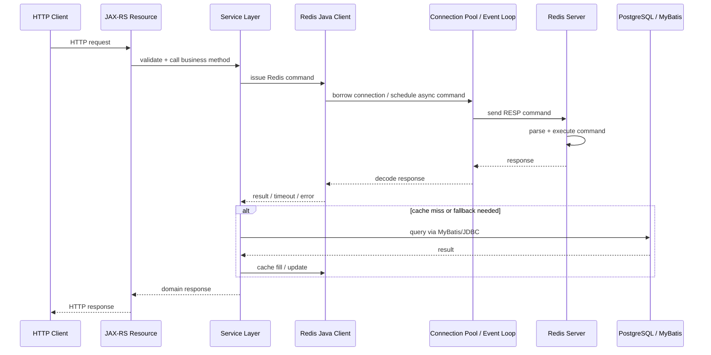

# Part 003 — Redis Command and Data Structure Basics

Redis sering terlihat sederhana karena command paling awal yang dipelajari biasanya hanya `SET` dan `GET`. Di production enterprise, cara berpikir seperti itu berbahaya. Redis bukan hanya key-value store sederhana. Redis adalah **in-memory data structure server**. Artinya, value di Redis bukan sekadar byte blob; value bisa berupa struktur data dengan operasi khusus, time complexity tertentu, memory footprint tertentu, dan failure mode tertentu.

Part ini membangun fondasi agar setiap penggunaan Redis selalu dimulai dari pertanyaan yang benar:

> Data apa yang saya simpan, bagaimana lifecycle-nya, seberapa besar cardinality-nya, bagaimana pola aksesnya, apakah butuh atomicity, apakah butuh TTL, dan apa dampaknya jika Redis lambat, hilang, atau mengevict key tersebut?

Untuk konteks Java/JAX-RS enterprise, keputusan data structure Redis biasanya memengaruhi:

- latency HTTP request;
- pressure ke PostgreSQL/MyBatis/JDBC;
- retry behavior;
- duplicate request behavior;
- Kafka/RabbitMQ consistency;
- cache correctness;
- memory growth;
- observability;
- security dan privacy;
- production debugging.

Part ini belum masuk terlalu dalam ke setiap struktur data. Detail masing-masing akan dibahas di part berikutnya. Fokus part ini adalah **mental model dan selection discipline**.

---

## 1. Core Mental Model

Redis menyimpan data dalam bentuk:

```text
key -> value
```

Namun `value` dapat memiliki tipe berbeda:

```text
key -> string
key -> hash
key -> list
key -> set
key -> sorted set
key -> bitmap
key -> bitfield
key -> hyperloglog
key -> geospatial index
key -> stream
```

Satu key memiliki satu tipe pada satu waktu. Jika sebuah key adalah hash, maka key tersebut tidak bisa diperlakukan sebagai list. Jika sebuah key adalah stream, maka command list tidak relevan untuk key itu.

Redis command bekerja langsung terhadap struktur data tersebut. Contoh:

```text
GET user:123:profile              # string
HGET tenant:acme:config currency  # hash
LPUSH queue:email job-1           # list
SADD user:123:roles admin         # set
ZADD limiter:tenant:acme 123 now  # sorted set
XADD order-events * type created  # stream
```

Kekuatan Redis berasal dari fakta bahwa banyak operasi struktur data bersifat cepat, atomic pada level command, dan berjalan di memory. Risiko Redis juga berasal dari hal yang sama: jika command salah, key membesar, TTL hilang, atau struktur data dipilih keliru, masalahnya bisa menyebar sangat cepat.

---

## 2. Key Is Not Just a String Identifier

Key Redis adalah alamat logis untuk sebuah data. Di sistem enterprise, key juga adalah kontrak.

Sebuah key biasanya membawa informasi:

- environment;
- service owner;
- domain;
- tenant;
- entity;
- use case;
- version;
- lifecycle;
- TTL expectation;
- security classification.

Contoh key yang lebih informatif:

```text
prod:quote-order:tenant:acme:quote:Q-12345:v1:snapshot
```

Contoh key yang buruk:

```text
quote
cache
userData
temp
rateLimit
```

Masalah dari key buruk bukan hanya readability. Masalahnya adalah operasional:

- susah tahu owner key;
- susah tahu apakah key boleh dihapus;
- susah tahu apakah key mengandung PII;
- susah tahu TTL yang benar;
- susah debug cache stale;
- susah melakukan migration;
- berbahaya untuk multi-tenant system.

Key design akan dibahas lebih detail di Part 004, tetapi semua pembahasan data structure di part ini harus dibaca dengan asumsi bahwa key adalah **production contract**, bukan sekadar nama bebas.

---

## 3. Value Type Selection Is Architecture

Memilih Redis value type bukan keputusan kecil. Itu adalah keputusan arsitektur mini.

Pertanyaan minimal sebelum memilih tipe Redis:

| Pertanyaan | Dampak |
|---|---|
| Apakah data dibaca sebagai satu blob atau per field? | String vs hash |
| Apakah butuh urutan insertion? | List atau stream |
| Apakah butuh membership unique? | Set |
| Apakah butuh ordering by score/time? | Sorted set |
| Apakah butuh approximate cardinality? | HyperLogLog |
| Apakah butuh compact boolean tracking? | Bitmap/bitfield |
| Apakah butuh replay dan consumer group? | Stream |
| Apakah data boleh hilang? | Cache vs durable-ish queue |
| Apakah key harus expire? | TTL discipline |
| Apakah operasi harus atomic multi-step? | Lua/function/transaction |
| Apakah command bisa mahal? | Complexity dan cardinality |

Kesalahan umum: memilih tipe berdasarkan command yang paling familiar, bukan berdasarkan lifecycle data.

Contoh:

```text
Salah:
"Saya pakai string JSON saja untuk semua hal karena mudah."

Lebih benar:
"Saya pakai string JSON jika object selalu dibaca penuh, schema versioned, TTL jelas, dan partial update tidak diperlukan."
```

Atau:

```text
Salah:
"Saya pakai list untuk semua queue."

Lebih benar:
"Saya pakai list untuk queue sederhana. Jika butuh ack, retry, pending tracking, replay, dan consumer group, saya evaluasi Redis Streams atau broker seperti RabbitMQ/Kafka."
```

---

## 4. Redis Command Lifecycle from Java/JAX-RS

Dalam aplikasi Java/JAX-RS, Redis command biasanya terlihat sederhana di service layer. Namun lifecycle sebenarnya melibatkan banyak boundary.



Yang harus diperhatikan:

- command Redis berada di jalur latency request;
- timeout Redis harus lebih kecil dari timeout HTTP total;
- Redis error harus dipetakan ke fallback atau HTTP response yang benar;
- cache miss bisa menyebabkan query PostgreSQL;
- retry Redis bisa memperparah traffic saat Redis lambat;
- connection pool exhaustion bisa membuat semua request ikut tertahan;
- serialization/deserialization bisa menjadi bottleneck tersembunyi;
- Redis command yang blocking bisa mengunci worker thread jika tidak dipahami.

Redis bukan hanya dependency storage. Redis adalah bagian dari **request critical path**.

---

## 5. Redis Strings

String adalah tipe paling dasar di Redis. Value string bisa berupa:

- plain text;
- JSON;
- angka counter;
- token;
- serialized binary;
- marker idempotency;
- lock value;
- compressed payload.

Command umum:

```text
SET key value
GET key
SET key value EX 60
SET key value PX 5000
SET key value NX
SET key value XX
INCR key
DECR key
MGET key1 key2 key3
MSET key1 value1 key2 value2
GETDEL key
```

Use case umum:

| Use case | Contoh |
|---|---|
| Simple cache entry | quote snapshot cache |
| Counter | login attempt, API usage |
| Token | password reset token |
| Idempotency marker | processing/completed marker |
| Lock primitive | `SET NX PX` |
| Feature/config value | small config payload |

String cocok jika data biasanya dibaca/ditulis sebagai satu unit. Jika aplikasi sering butuh update per field, hash mungkin lebih sesuai.

### Correctness Concern

String JSON mudah digunakan, tetapi punya risiko:

- schema berubah saat rolling deployment;
- enum rename menyebabkan deserialization failure;
- field baru/hilang memengaruhi behavior;
- BigDecimal/currency precision berubah;
- cache stale tetap terlihat valid secara JSON;
- payload besar meningkatkan network dan memory cost.

### Java/JAX-RS Impact

Dalam service Java, string Redis biasanya dipetakan ke DTO atau domain object.

Risiko umum:

```text
HTTP request -> Redis GET -> JSON deserialize -> domain logic
```

Jika deserialization gagal, keputusan fallback harus jelas:

- return error?
- treat as cache miss?
- delete corrupt cache?
- log and continue?
- alert?

Untuk cache, corrupted string sering lebih aman diperlakukan sebagai cache miss. Untuk idempotency, corrupted value bisa jauh lebih berbahaya karena dapat menyebabkan duplicate processing.

---

## 6. Redis Hashes

Hash adalah map field-value di dalam satu Redis key.

Command umum:

```text
HSET key field value
HGET key field
HMGET key field1 field2
HINCRBY key field increment
HDEL key field
HSCAN key cursor
```

Use case umum:

- object cache dengan field-level access;
- tenant configuration;
- sparse map;
- counters per dimension;
- lightweight profile/config representation.

Contoh:

```text
HSET tenant:acme:config currency USD timezone UTC maxUsers 1000
HGET tenant:acme:config currency
```

### Hash vs JSON String

| Aspek | Hash | JSON String |
|---|---|---|
| Partial read | Baik | Buruk |
| Partial update | Baik | Harus rewrite penuh |
| Schema evolution | Bisa eksplisit per field | Bergantung serializer |
| Field TTL | Tidak native per field | Tidak native per field |
| Object reconstruction | Butuh mapping manual | Mudah via JSON mapper |
| Large object risk | Ada | Ada |

Hash bukan solusi otomatis untuk semua object. Jika object selalu dibaca penuh, JSON string bisa lebih sederhana. Jika field sering diakses terpisah, hash bisa mengurangi network payload.

### Important Limitation

Redis hash tidak punya TTL per field secara native. TTL berlaku pada key hash secara keseluruhan.

Jika satu field harus expire sendiri, desainnya perlu diubah:

- pecah ke key terpisah;
- gunakan sorted set index untuk expiry manual;
- gunakan string per field;
- ubah lifecycle data.

---

## 7. Redis Lists

List adalah ordered sequence. Redis list sering dipakai untuk queue sederhana.

Command umum:

```text
LPUSH queue value
RPUSH queue value
LPOP queue
RPOP queue
BLPOP queue timeout
BRPOP queue timeout
LMOVE source destination LEFT RIGHT
BLMOVE source destination LEFT RIGHT timeout
```

Use case umum:

- simple queue;
- work queue;
- buffer sementara;
- recent items;
- producer-consumer sederhana.

### Queue Mental Model

```text
Producer -> LPUSH queue job
Worker   -> BRPOP queue timeout
```

Ini sederhana, tetapi failure mode penting:

| Failure | Dampak |
|---|---|
| Worker crash setelah pop sebelum process selesai | Job hilang |
| Worker lambat | Queue menumpuk |
| Tidak ada retry | Job gagal tanpa recovery |
| Tidak ada ack native seperti broker | Reliability harus dibangun sendiri |
| List sangat besar | Memory dan latency risk |

Untuk reliable queue, pola sederhana bisa menggunakan processing list:

```text
LMOVE queue processing RIGHT LEFT
```

Namun jika butuh consumer group, pending tracking, ack, retry, dan replay, Redis Streams lebih tepat.

---

## 8. Redis Sets

Set menyimpan elemen unik tanpa urutan.

Command umum:

```text
SADD key member
SREM key member
SISMEMBER key member
SCARD key
SSCAN key cursor
SINTER key1 key2
SUNION key1 key2
SDIFF key1 key2
```

Use case umum:

- membership check;
- deduplication;
- permission-like set;
- tenant feature set;
- processed event IDs;
- idempotency seen-set;
- unique actor tracking.

Contoh:

```text
SADD tenant:acme:enabled-features quote-discount bulk-order
SISMEMBER tenant:acme:enabled-features quote-discount
```

### Danger: `SMEMBERS` on Large Set

`SMEMBERS` mengembalikan semua member. Pada set kecil, ini tidak masalah. Pada set besar, ini bisa menghasilkan:

- network payload besar;
- latency spike;
- memory pressure di client;
- blocked request thread;
- pressure pada Redis server.

Gunakan `SSCAN` untuk iterasi besar, tetapi ingat: scan bukan snapshot konsisten seperti query database.

---

## 9. Redis Sorted Sets

Sorted set menyimpan member unik dengan score numerik.

Command umum:

```text
ZADD key score member
ZREM key member
ZRANGE key start stop
ZRANGEBYSCORE key min max
ZCARD key
ZCOUNT key min max
ZPOPMIN key
ZPOPMAX key
ZREMRANGEBYSCORE key min max
```

Use case umum:

- ranking;
- leaderboard;
- delayed queue;
- sliding window rate limiter;
- time-based index;
- scheduled cleanup;
- priority queue.

Contoh delayed job:

```text
ZADD delayed-jobs 1730000000000 job-123
ZRANGEBYSCORE delayed-jobs -inf now LIMIT 0 100
```

Contoh sliding log limiter:

```text
ZADD limiter:user:123 currentTimestamp requestId
ZREMRANGEBYSCORE limiter:user:123 -inf currentTimestampMinusWindow
ZCOUNT limiter:user:123 currentTimestampMinusWindow currentTimestamp
```

### Score Precision Concern

Score adalah floating-point number. Untuk timestamp millisecond biasanya aman, tetapi jangan sembarangan menyimpan angka yang butuh precision finansial. Untuk currency/price/quote calculation, PostgreSQL atau domain model Java dengan `BigDecimal` lebih tepat sebagai source of truth.

---

## 10. Redis Bitmaps and Bitfields

Bitmap menggunakan string sebagai array bit. Cocok untuk compact boolean tracking.

Command umum:

```text
SETBIT key offset value
GETBIT key offset
BITCOUNT key
```

Use case:

- daily active flag;
- feature exposure bit;
- compact on/off tracking;
- boolean matrix dengan offset stabil.

Bitfield memungkinkan operasi terhadap beberapa bit sebagai integer field.

Risiko utama:

- offset mapping harus stabil;
- debugging tidak intuitif;
- maintainability rendah jika tidak terdokumentasi;
- sparse high offset bisa menyebabkan memory allocation besar;
- tidak cocok untuk domain data yang butuh audit jelas.

Untuk enterprise codebase, bitmap/bitfield sebaiknya dipakai hanya jika manfaat memory efficiency jelas dan mapping terdokumentasi.

---

## 11. Redis HyperLogLog

HyperLogLog adalah struktur approximate cardinality.

Command umum:

```text
PFADD key element
PFCOUNT key
PFMERGE dest source1 source2
```

Use case:

- approximate unique visitors;
- approximate unique API consumers;
- approximate distinct tenant activity;
- telemetry agregasi kasar.

HyperLogLog bukan untuk membership check. Ia hanya memperkirakan jumlah unik.

```text
Bisa: "berapa kira-kira unique users hari ini?"
Tidak bisa: "apakah user X sudah masuk?"
```

Untuk keputusan bisnis atau billing yang membutuhkan akurasi kuat, jangan gunakan HyperLogLog sebagai source of truth.

---

## 12. Redis Geospatial

Redis geospatial menyimpan koordinat dan mendukung pencarian berbasis lokasi.

Command umum:

```text
GEOADD key longitude latitude member
GEOSEARCH key FROMLONLAT lon lat BYRADIUS radius km
```

Use case:

- lookup lokasi sederhana;
- nearest node/branch/region;
- caching hasil geospatial ringan.

Dalam enterprise backend, geospatial Redis biasanya lebih cocok sebagai acceleration layer. Untuk query geospatial kompleks, PostgreSQL dengan PostGIS atau search engine khusus bisa lebih tepat.

---

## 13. Redis Streams

Stream adalah append-only log-like data structure dengan ID, entry, dan consumer group.

Command umum:

```text
XADD stream * field value
XRANGE stream - +
XREAD STREAMS stream $
XGROUP CREATE stream group $
XREADGROUP GROUP group consumer STREAMS stream >
XACK stream group id
XPENDING stream group
XAUTOCLAIM stream group consumer min-idle-time start
XTRIM stream MAXLEN approximateCount
```

Use case:

- durable-ish queue;
- event stream ringan;
- worker group;
- pending/retry tracking;
- replay terbatas;
- async workflow internal.

Streams lebih kuat daripada Pub/Sub karena ada data yang disimpan, consumer group, ack, dan pending entries. Namun Redis Streams tetap bukan Kafka. Retention, partitioning, long-term replay, ecosystem, dan durability model harus dievaluasi hati-hati.

---

## 14. TTL and Expiry Basics

TTL menentukan lifecycle key.

Command umum:

```text
EXPIRE key seconds
PEXPIRE key milliseconds
TTL key
PTTL key
PERSIST key
SET key value EX 60
SET key value PX 5000
```

TTL bukan hanya cleanup. TTL adalah bagian dari correctness.

Contoh:

| Use case | TTL concern |
|---|---|
| Cache | Freshness window |
| Idempotency key | Duplicate retry window |
| Lock | Lease safety |
| Rate limiter | Window cleanup |
| Session | Security expiration |
| Token blacklist | Token lifetime alignment |
| Negative cache | Avoid long false-negative |

Key tanpa TTL perlu alasan kuat. Di Redis dengan memory terbatas, persistent key yang tidak direncanakan adalah risiko capacity dan incident.

---

## 15. Atomic Command

Redis mengeksekusi command secara atomic pada level single command. Jika command `INCR` berjalan, command lain tidak menginterleaving di tengah operasi tersebut.

Contoh atomic:

```text
INCR counter:user:123
SADD processed-events event-123
SET lock:job:1 abc NX PX 30000
```

Namun multi-command sequence tidak otomatis atomic.

Contoh bermasalah:

```text
INCR limiter:user:123
EXPIRE limiter:user:123 60
```

Jika aplikasi crash setelah `INCR` sebelum `EXPIRE`, key limiter bisa menjadi persistent. Untuk fixed window limiter, ini bug serius.

Solusi:

- gunakan `SET EX` jika cocok;
- gunakan Lua untuk atomic multi-step;
- gunakan transaction dengan hati-hati;
- gunakan library limiter yang sudah benar;
- desain cleanup defensive.

---

## 16. Command Time Complexity

Redis cepat bukan berarti semua command aman. Setiap command punya complexity.

Contoh mental model:

| Command | Risiko |
|---|---|
| `GET` | Biasanya murah, tetapi value besar tetap mahal |
| `MGET` | Mengurangi round trip, tetapi payload bisa besar |
| `HGETALL` | Berbahaya pada hash besar |
| `SMEMBERS` | Berbahaya pada set besar |
| `LRANGE 0 -1` | Berbahaya pada list besar |
| `ZRANGE` range besar | Berbahaya pada sorted set besar |
| `KEYS *` | Sangat berbahaya di production |
| `SCAN` | Lebih aman, tetapi bukan gratis dan bukan snapshot konsisten |
| Lua script panjang | Bisa block Redis |
| Blocking command | Harus dipahami thread/connection impact |

Prinsip production:

> Redis command harus dipilih berdasarkan complexity dan cardinality, bukan hanya correctness fungsional.

---

## 17. Blocking Commands

Blocking command menunggu sampai data tersedia atau timeout.

Contoh:

```text
BLPOP queue 30
BRPOP queue 30
XREAD BLOCK 30000 STREAMS stream $
XREADGROUP GROUP group consumer BLOCK 30000 STREAMS stream >
```

Blocking command bisa benar untuk worker. Namun di JAX-RS request thread, blocking command perlu hati-hati.

Risiko:

- request thread tertahan;
- connection Redis tertahan;
- pool exhaustion;
- shutdown lambat;
- timeout HTTP tidak sinkron dengan Redis block timeout;
- worker tidak responsif saat deploy rolling update.

Gunakan blocking command pada worker/background component yang memang dirancang untuk itu, bukan sembarang request path.

---

## 18. Pipelined Commands

Pipelining mengirim banyak command tanpa menunggu response satu per satu.

Tujuan:

- mengurangi network round trip;
- meningkatkan throughput;
- cocok untuk batch read/write.

Namun pipelining bukan transaction. Command tetap dieksekusi berurutan, tetapi tidak otomatis rollback sebagai satu unit.

Risiko:

- batch terlalu besar meningkatkan memory client/server;
- error handling per command harus jelas;
- response besar bisa menekan heap Java;
- timeout satu pipeline bisa membuat diagnosis sulit.

Pipelining cocok untuk performance, bukan untuk correctness atomicity.

---

## 19. Redis Transactions

Redis transaction menggunakan `MULTI` dan `EXEC`.

```text
MULTI
SET key1 value1
INCR key2
EXEC
```

Dengan `WATCH`, Redis bisa melakukan optimistic locking.

```text
WATCH key
GET key
MULTI
SET key newValue
EXEC
```

Namun transaksi Redis tidak sama dengan transaksi RDBMS:

- tidak ada rollback seperti PostgreSQL;
- command error bisa muncul saat eksekusi;
- transaction tidak cocok untuk logic kompleks;
- di Redis Cluster, multi-key transaction terbatas oleh hash slot;
- untuk atomic multi-step logic, Lua sering lebih tepat.

---

## 20. Lua Script Commands

Lua script menjalankan beberapa operasi secara atomic di Redis.

```text
EVAL script numkeys key1 key2 arg1 arg2
EVALSHA sha numkeys key1 arg1
```

Use case:

- safe unlock distributed lock;
- rate limiter atomic;
- idempotency state transition;
- queue claim logic;
- conditional update dengan TTL.

Risiko:

- script panjang memblok Redis;
- script sulit diobservasi;
- versioning script perlu disiplin;
- testing harus memadai;
- cluster key placement harus benar;
- deterministic behavior penting.

Lua adalah alat kuat, bukan tempat memindahkan semua business logic ke Redis.

---

## 21. Data Structure Selection Checklist

Gunakan checklist berikut sebelum menulis kode Redis.

### A. Data Shape

- Apakah data scalar, object, collection, ordered collection, time-indexed, atau stream?
- Apakah data perlu dibaca penuh atau sebagian?
- Apakah data perlu unique membership?
- Apakah data perlu score atau timestamp?
- Apakah data perlu replay?

### B. Lifecycle

- Apakah key wajib punya TTL?
- Berapa TTL yang benar?
- Apakah TTL harus jittered?
- Apa yang terjadi saat key expired?
- Apa yang terjadi saat key evicted?

### C. Correctness

- Apakah Redis adalah cache atau source of truth?
- Apakah stale data bisa diterima?
- Apakah duplicate operation bisa terjadi?
- Apakah operasi harus atomic?
- Apakah ada race condition antar request?

### D. Performance

- Berapa cardinality key?
- Berapa ukuran value/member/entry?
- Apakah command punya complexity linear?
- Apakah payload besar dikirim ke Java heap?
- Apakah perlu pipelining?

### E. Operations

- Bagaimana key dimonitor?
- Bagaimana key dibersihkan?
- Bagaimana debug production-safe?
- Siapa owner key?
- Apakah ada dashboard/alert?

### F. Security and Privacy

- Apakah key/value mengandung PII?
- Apakah TTL sesuai retention policy?
- Apakah data masuk snapshot/backup?
- Apakah key tenant-isolated?
- Apakah log Redis client meredact value sensitif?

---

## 22. Failure Modes by Data Structure

| Data structure | Failure mode utama |
|---|---|
| String | stale JSON, oversized payload, schema incompatibility, missing TTL |
| Hash | large hash, field lifecycle mismatch, `HGETALL` spike |
| List | lost job after pop, worker crash, unbounded queue growth |
| Set | unbounded cardinality, expensive full member read, stale membership |
| Sorted set | cleanup missing, score precision issue, large range query |
| Bitmap | wrong offset mapping, sparse high offset memory surprise |
| HyperLogLog | approximate result misused as exact truth |
| Geo | Redis used as source of truth for complex geospatial domain |
| Stream | pending entries grow, consumer stuck, trimming deletes needed replay |

Failure-aware design berarti sejak awal kita mendokumentasikan:

- apa yang boleh hilang;
- apa yang boleh stale;
- apa yang harus retry;
- apa yang harus idempotent;
- apa yang harus alert;
- apa yang harus fallback.

---

## 23. Java/JAX-RS Review Notes

Saat melihat PR Java/JAX-RS yang menambahkan Redis command, jangan hanya tanya “apakah command-nya benar?”. Tanya:

- Apakah Redis call berada di request critical path?
- Apakah timeout command jelas?
- Apakah fallback behavior jelas?
- Apakah serialization safe untuk rolling deployment?
- Apakah command bisa menghasilkan payload besar?
- Apakah command punya TTL?
- Apakah Redis unavailable menyebabkan HTTP 5xx, degraded response, atau fallback ke DB?
- Apakah cache miss bisa membanjiri PostgreSQL?
- Apakah retry Redis memperparah Redis latency?
- Apakah metric/log/correlation ID tersedia?

Redis bug sering tidak terlihat di unit test karena unit test hanya memeriksa hasil command. Production bug muncul dari concurrency, TTL, cardinality, latency, dan partial failure.

---

## 24. PostgreSQL/MyBatis/JDBC Impact

Redis sering ditempatkan di depan PostgreSQL. Artinya pilihan data structure Redis memengaruhi database.

Contoh:

| Redis behavior | PostgreSQL impact |
|---|---|
| Cache miss spike | Query spike ke DB |
| TTL seragam | DB load burst saat expiry massal |
| Invalidation gagal | Read stale meski DB sudah benar |
| Redis down | Semua request fallback ke DB |
| Big payload cache | Mengurangi query tetapi meningkatkan network/heap |
| Negative cache terlalu lama | DB update tidak terlihat |
| Idempotency Redis hilang | Duplicate insert/update risk |

Dengan MyBatis/JDBC, transaction boundary perlu jelas. Jangan update Redis seolah-olah Redis ikut dalam transaksi PostgreSQL. Redis dan PostgreSQL tidak otomatis commit/rollback bersama.

---

## 25. Kafka/RabbitMQ and Distributed Consistency Impact

Redis juga sering dipakai bersama Kafka/RabbitMQ untuk:

- event-driven cache invalidation;
- projection cache;
- deduplication event;
- idempotency consumer;
- rate limit event producer;
- job coordination.

Risiko:

- event duplicate;
- event out-of-order;
- Redis update gagal setelah event ack;
- Redis update sukses tetapi DB belum commit;
- consumer restart menyebabkan replay;
- Pub/Sub disalahgunakan untuk durable event;
- stream retention tidak cukup untuk replay.

Redis command selection harus mempertimbangkan event lifecycle, bukan hanya local service behavior.

---

## 26. Kubernetes, Cloud, and On-Prem Impact

Redis behavior juga dipengaruhi deployment environment.

### Kubernetes

- connection pool per pod bisa menyebabkan connection storm;
- rolling update bisa menggandakan koneksi sementara;
- CPU throttling pada Java pod bisa memicu timeout palsu;
- network policy bisa memutus akses Redis;
- DNS change/failover perlu client handling.

### AWS/Azure Managed Redis

- cluster mode memengaruhi multi-key command;
- failover memengaruhi connection dan in-flight command;
- parameter group memengaruhi eviction/persistence;
- maintenance window bisa menyebabkan reconnect;
- encryption/TLS memengaruhi latency.

### On-Prem/Hybrid

- latency network lebih variatif;
- certificate/secret rotation perlu disiplin;
- backup dan patching menjadi tanggung jawab internal;
- firewall dan network route bisa menjadi failure point.

---

## 27. Production Debugging Checklist

Saat ada issue yang diduga terkait Redis command/data structure:

1. Identifikasi key pattern.
2. Identifikasi data type dengan command aman.
3. Cek TTL key.
4. Cek ukuran value/cardinality.
5. Cek command yang dipakai aplikasi.
6. Cek slowlog dan command stats.
7. Cek hit/miss ratio jika cache.
8. Cek memory dan eviction.
9. Cek connection/client timeout.
10. Cek deployment event: failover, rolling update, scaling.
11. Cek korelasi dengan PostgreSQL/Kafka/RabbitMQ metrics.
12. Jangan menjalankan command full-scan sembarangan di production.

Production-safe debugging lebih penting daripada sekadar tahu command Redis.

---

## 28. PR Review Checklist

Gunakan checklist ini untuk PR yang menambahkan Redis command:

- Apakah data structure dipilih berdasarkan access pattern?
- Apakah key naming sesuai standard?
- Apakah TTL jelas?
- Apakah value size/cardinality diperkirakan?
- Apakah command complexity aman?
- Apakah ada command full-read pada collection besar?
- Apakah operasi multi-step butuh Lua/transaction?
- Apakah fallback behavior jelas?
- Apakah Redis error/timeout di-handle?
- Apakah serialization compatible dengan rolling deployment?
- Apakah sensitive data dihindari atau dilindungi?
- Apakah metric/log tersedia?
- Apakah testing mencakup miss, expiry, duplicate, concurrency, dan Redis down?

---

## 29. Internal Verification Checklist

Cek hal-hal berikut di codebase dan environment internal:

- Redis client yang dipakai: Jedis, Lettuce, Redisson, atau wrapper internal.
- Semua command Redis yang digunakan service.
- Key pattern dan key owner.
- Data structure per key pattern.
- TTL policy per key.
- Command yang berpotensi mahal: `KEYS`, `HGETALL`, `SMEMBERS`, `LRANGE 0 -1`, range besar di sorted set.
- Penggunaan pipeline.
- Penggunaan transaction atau Lua.
- Serialization format.
- Cache miss fallback ke PostgreSQL.
- Event-driven update dari Kafka/RabbitMQ.
- Redis metrics dashboard.
- Slowlog/latency monitoring.
- Security classification key/value.
- Production debugging SOP.

---

## 30. Summary

Redis command dan data structure harus dipahami sebagai bagian dari desain sistem, bukan sekadar API storage.

Prinsip utama:

- Redis adalah data structure server.
- Key adalah kontrak operasional.
- Value type menentukan lifecycle dan failure mode.
- Atomic command tidak berarti multi-command sequence atomic.
- TTL adalah correctness boundary.
- Command complexity harus direview.
- Blocking command harus dipisahkan dari request path jika tidak didesain khusus.
- Pipelining membantu throughput, bukan atomicity.
- Lua membantu atomicity, tetapi membawa risiko operasional.
- Setiap Redis use case harus punya fallback, observability, dan internal ownership.

Setelah memahami part ini, Part 004 akan masuk lebih dalam ke **key design dan naming convention**, karena keyspace yang buruk adalah akar dari banyak masalah Redis production: stale cache, tenant leakage, debugging sulit, big key, hot key, dan data privacy incident.
