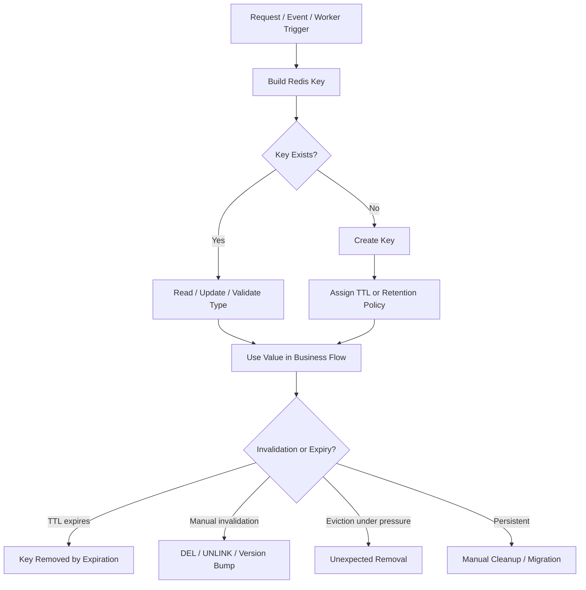

# Part 004 — Redis Key Design and Naming Convention

Redis key design adalah salah satu bagian Redis yang paling sering diremehkan. Banyak incident Redis tidak dimulai dari command yang salah, tetapi dari keyspace yang tidak punya struktur: nama key ambigu, tenant tidak jelas, TTL tidak konsisten, owner tidak diketahui, cardinality tidak diperkirakan, dan cleanup tidak direncanakan.

Di sistem enterprise Java/JAX-RS, key Redis bukan sekadar string. Key adalah **operational contract** antara aplikasi, platform, SRE, security, observability, dan future maintainers.

Key yang baik menjawab pertanyaan:

- service mana yang memiliki key ini?
- environment mana?
- tenant mana?
- entity apa?
- use case apa?
- versi format apa?
- apakah key ini cache, lock, limiter, session, idempotency, stream, atau queue?
- berapa TTL-nya?
- apakah key boleh hilang?
- apakah key mengandung data sensitif?
- bagaimana key ini di-debug secara aman?

Jika jawaban tersebut tidak terlihat dari key name, dokumentasi, atau dashboard, keyspace Redis akan menjadi sumber risiko production.

---

## 1. Core Principle: Key Names Are API Surface

Key Redis adalah API internal. Meskipun tidak terekspos ke external client, key dipakai oleh:

- Java service;
- background worker;
- Redis Lua script;
- rate limiter;
- idempotency middleware;
- cache invalidation consumer;
- observability dashboard;
- runbook incident;
- data cleanup job;
- security review;
- migration script;
- SRE debugging.

Karena itu key harus diperlakukan seperti kontrak API:

- naming konsisten;
- versioning jelas;
- ownership eksplisit;
- lifecycle terdokumentasi;
- security classification dipahami;
- backward compatibility dipertimbangkan saat deployment bertahap.

Key buruk sering terlihat sepele saat development, tetapi mahal saat incident.

---

## 2. Recommended Key Shape

Tidak ada satu format universal untuk semua perusahaan. Namun untuk enterprise multi-service dan multi-tenant, format berikut aman sebagai baseline:

```text
<env>:<service>:<domain>:<usecase>:<tenant-scope>:<entity-type>:<entity-id>:<version>
```

Contoh konkret:

```text
prod:quote-order:cpq:cache:tenant:acme:quote:Q-12345:v1
prod:quote-order:rate-limit:tenant:acme:user:U-7788:create-quote:v1
prod:quote-order:idempotency:tenant:acme:key:idem-789:v1
prod:quote-order:lock:tenant:acme:quote:Q-12345:reprice:v1
prod:quote-order:stream:tenant:acme:quote-events:v1
```

Namun format ini tidak boleh dipakai membabi buta. Key terlalu panjang juga punya cost. Tujuannya bukan membuat key cantik, tetapi membuat key cukup informatif untuk aman dioperasikan.

Baseline minimum yang biasanya harus terlihat:

```text
<env>:<service>:<usecase>:<scope>:<identity>:<version>
```

Contoh:

```text
prod:qo:cache:tenant:acme:quote:Q-12345:v1
```

Jika organisasi sudah punya standar internal, ikuti standar tersebut. Jika belum ada, gunakan part ini sebagai bahan diskusi, bukan klaim bahwa format ini pasti sama dengan internal CSG.

---

## 3. Namespace

Namespace adalah bagian key yang memisahkan area kepemilikan atau domain.

Contoh namespace:

```text
quote-order
catalog
pricing
identity
workflow
rate-limit
idempotency
session
```

Namespace mencegah tabrakan antar service dan membantu debugging.

Tanpa namespace, dua service bisa membuat key yang sama:

```text
quote:123
```

Service A menganggap itu quote snapshot. Service B menganggap itu quote lock. Hasilnya bisa fatal.

Dengan namespace:

```text
quote-order:cache:quote:123
pricing:lock:quote:123
```

Namespace harus cukup stabil. Jangan memakai nama class Java yang sering berubah sebagai namespace utama.

---

## 4. Environment Prefix

Environment prefix membantu mencegah kontaminasi data antar environment.

Contoh:

```text
dev:quote-order:cache:quote:Q-123
staging:quote-order:cache:quote:Q-123
prod:quote-order:cache:quote:Q-123
```

Idealnya environment isolation dilakukan di level Redis instance/database/network, bukan hanya prefix. Namun prefix tetap berguna untuk:

- debugging;
- shared non-prod Redis;
- local development;
- migration safety;
- dashboard grouping.

Production caution:

> Jangan mengandalkan prefix sebagai satu-satunya isolation untuk environment yang benar-benar berbeda sensitivitasnya.

Jika dev dan prod berada di Redis yang sama, itu red flag besar kecuali ada alasan internal yang sangat spesifik dan kontrol kuat.

---

## 5. Service Prefix

Service prefix menunjukkan owner aplikasi.

Contoh:

```text
prod:quote-order:cache:quote:Q-123:v1
prod:catalog:cache:product:P-987:v1
prod:identity:session:user:U-7788:v1
```

Manfaat:

- memudahkan incident routing;
- memudahkan dashboard per service;
- memudahkan cleanup;
- menghindari collision;
- membantu PR review.

Anti-pattern:

```text
prod:cache:quote:Q-123
```

Masalahnya: siapa owner key ini? Quote service? Pricing service? Order service? Integration service?

Dalam microservices, ownership harus terlihat.

---

## 6. Use Case Prefix

Use case prefix membedakan jenis penggunaan Redis.

Contoh use case:

```text
cache
lock
rate-limit
idempotency
session
token
queue
stream
pubsub
config
feature-flag
single-flight
```

Contoh:

```text
prod:quote-order:cache:tenant:acme:quote:Q-123:v1
prod:quote-order:lock:tenant:acme:quote:Q-123:submit:v1
prod:quote-order:idempotency:tenant:acme:key:idem-123:v1
```

Kenapa penting? Karena lifecycle tiap use case berbeda.

| Use case | Lifecycle |
|---|---|
| cache | TTL atau invalidation |
| lock | short lease TTL |
| rate-limit | window TTL |
| idempotency | retry window TTL |
| session | auth/session TTL |
| stream | retention/trimming |
| queue | consumed/ack/retry lifecycle |
| config | TTL + invalidation + safe default |

Jika use case tidak terlihat, TTL dan debugging menjadi spekulasi.

---

## 7. Tenant Prefix

Untuk sistem multi-tenant, tenant harus diperlakukan sebagai boundary utama.

Contoh:

```text
prod:quote-order:cache:tenant:acme:quote:Q-123:v1
prod:quote-order:cache:tenant:globex:quote:Q-123:v1
```

Tanpa tenant prefix, ID yang sama dari dua tenant bisa collision:

```text
quote:Q-123
```

Jika quote ID global unik, tenant prefix mungkin tetap berguna untuk:

- observability per tenant;
- tenant-wide invalidation;
- incident containment;
- GDPR/data deletion workflows;
- rate limiting per tenant;
- debugging customer-specific issue.

### Tenant Prefix Security Note

Jangan memasukkan nama tenant yang mengandung data sensitif jika key bisa muncul di logs, monitoring, dump, atau support tooling. Pertimbangkan tenant ID internal yang tidak langsung mengandung PII/customer name jika dibutuhkan oleh kebijakan privacy.

Contoh lebih aman:

```text
prod:quote-order:cache:tenant:tnt_98231:quote:Q-123:v1
```

---

## 8. Entity Prefix

Entity prefix menjelaskan domain object.

Contoh:

```text
quote
order
customer
catalog
product
offer
price-plan
workflow
approval
```

Contoh key:

```text
prod:quote-order:cache:tenant:tnt_98231:quote:Q-123:snapshot:v1
prod:quote-order:cache:tenant:tnt_98231:order:O-987:summary:v1
```

Entity prefix membantu saat:

- cache invalidation per entity;
- troubleshooting stale data;
- migration domain model;
- analytics keyspace;
- incident impact analysis.

---

## 9. Version Prefix or Suffix

Versioning key membantu rolling deployment dan schema evolution.

Contoh:

```text
prod:quote-order:cache:tenant:tnt_98231:quote:Q-123:snapshot:v1
prod:quote-order:cache:tenant:tnt_98231:quote:Q-123:snapshot:v2
```

Versioning penting saat:

- serialization format berubah;
- DTO field berubah;
- cache semantics berubah;
- TTL policy berubah;
- key structure berubah;
- rolling deployment membuat dua versi aplikasi berjalan bersamaan.

### Versioning Strategy

Ada dua pendekatan umum.

#### A. Version in Key

```text
...:quote:Q-123:snapshot:v2
```

Kelebihan:

- aman untuk breaking change;
- tidak perlu delete semua key lama langsung;
- rolling deployment lebih aman.

Kekurangan:

- key lama tetap ada sampai TTL/cleanup;
- hit ratio drop saat versi berubah;
- memory sementara naik.

#### B. Version in Value

```json
{"schemaVersion":2,"quoteId":"Q-123","status":"DRAFT"}
```

Kelebihan:

- key tetap sama;
- bisa migrasi value on read.

Kekurangan:

- code harus handle multi-version payload;
- deserialization harus defensif;
- corrupted/stale value lebih sulit dibedakan.

Untuk breaking schema change, version in key sering lebih aman.

---

## 10. Composite Key

Composite key menggabungkan beberapa dimensi.

Contoh:

```text
prod:quote-order:rate-limit:tenant:tnt_98231:user:U-7788:endpoint:create-quote:v1
```

Composite key berguna untuk:

- per-user per-endpoint limiter;
- tenant + entity cache;
- idempotency per tenant + idempotency key;
- lock per entity + action;
- dedup per event source + event ID.

Risiko composite key:

- terlalu panjang;
- dimensi tidak stabil;
- mengandung PII;
- cardinality sangat tinggi;
- sulit invalidation;
- sulit aggregate metrics.

Composite key harus didesain dengan estimasi cardinality.

---

## 11. Separator Convention

Separator paling umum adalah colon:

```text
service:usecase:tenant:entity:id:v1
```

Gunakan separator secara konsisten. Jangan mencampur format:

```text
quote-order.cache.tenant.acme.quote.Q-123
quote-order:cache:tenant:acme:quote:Q-123
quoteOrder_cache_acme_Q-123
```

Format tidak konsisten menyebabkan:

- pattern matching sulit;
- dashboard grouping sulit;
- cleanup script rawan salah;
- developer bingung;
- scan tool tidak reusable.

Untuk value yang bisa mengandung colon, lakukan encoding atau gunakan ID yang aman.

---

## 12. Key Cardinality

Cardinality adalah jumlah key yang mungkin terbentuk dari sebuah pattern.

Contoh:

```text
prod:quote-order:cache:tenant:<tenantId>:quote:<quoteId>:v1
```

Cardinality kira-kira:

```text
jumlah tenant aktif x jumlah quote aktif/cacheable per tenant
```

Sebelum membuat key pattern, estimasi:

- jumlah tenant;
- jumlah user;
- jumlah entity;
- jumlah endpoint;
- jumlah request per window;
- TTL;
- expected churn;
- worst-case traffic spike.

### Cardinality Example: Rate Limiter

Key:

```text
prod:quote-order:rate-limit:tenant:<tenantId>:user:<userId>:endpoint:<endpoint>:v1
```

Jika:

```text
10.000 tenant
100 user aktif per tenant
20 endpoint yang dilimit
```

Maka potensi key aktif:

```text
10.000 x 100 x 20 = 20.000.000 key
```

Jika TTL pendek dan traffic tidak merata, mungkin aman. Jika TTL panjang atau cleanup salah, bisa menjadi memory incident.

---

## 13. Key Length

Key yang terlalu panjang punya cost:

- memory overhead;
- network overhead;
- log verbosity;
- dashboard noise.

Namun key yang terlalu pendek punya cost yang lebih buruk:

- ambiguity;
- collision;
- debugging sulit;
- security review sulit.

Prinsipnya:

> Key harus cukup panjang untuk aman dioperasikan, tetapi tidak lebih panjang dari informasi yang benar-benar berguna.

Contoh terlalu verbose:

```text
production-environment:quote-order-management-service:customer-facing-quote-cache-for-tenant:tnt_98231:quote-entity-with-identifier:Q-12345:snapshot-payload-schema-version:v1
```

Contoh lebih seimbang:

```text
prod:qo:cache:tenant:tnt_98231:quote:Q-12345:snapshot:v1
```

Pastikan abbreviation terdokumentasi. `qo` mungkin berarti Quote Order bagi tim tertentu, tetapi tidak universal.

---

## 14. Hot Key

Hot key adalah key yang menerima traffic sangat tinggi.

Contoh:

```text
prod:quote-order:config:global:v1
prod:quote-order:feature-flag:tenant:tnt_98231:v1
prod:catalog:cache:product:popular-plan:v1
```

Hot key bisa menyebabkan:

- single Redis node CPU/network pressure;
- cluster slot hotspot;
- latency spike;
- cascading timeout di Java service;
- reconnect/retry storm;
- uneven load distribution.

Mitigasi:

- local cache dengan TTL pendek;
- client-side caching jika tersedia dan cocok;
- key replication pattern;
- split key per dimension;
- reduce request frequency;
- batch read;
- move extremely hot config to app memory with refresh mechanism.

Hot key bukan selalu salah. Banyak config key memang hot. Yang salah adalah hot key tanpa mitigasi dan observability.

---

## 15. Big Key

Big key adalah key dengan value atau collection sangat besar.

Contoh:

```text
prod:quote-order:cache:tenant:tnt_98231:all-quotes:v1
prod:quote-order:set:tenant:tnt_98231:all-users:v1
prod:quote-order:hash:tenant:tnt_98231:all-config:v1
```

Big key menyebabkan:

- network amplification;
- slow command;
- memory fragmentation;
- eviction pain;
- backup/replication pressure;
- Java heap pressure;
- long GC pause karena payload besar;
- blocked Redis event loop untuk command tertentu.

Anti-pattern:

```text
Cache semua data tenant dalam satu key besar.
```

Lebih baik:

```text
Cache per entity, per page, per projection, atau per query shape dengan TTL jelas.
```

Namun terlalu banyak key kecil juga bisa meningkatkan overhead. Desain harus seimbang.

---

## 16. Expiring Key vs Persistent Key

Redis key harus diklasifikasikan berdasarkan lifecycle.

### Expiring Key

Contoh:

```text
cache
lock
rate-limit
idempotency
session
token
negative-cache
single-flight
```

Biasanya wajib TTL.

### Persistent Key

Contoh:

```text
stream dengan retention manual
configuration cache tertentu
long-lived feature state
manual coordination state
```

Persistent key butuh alasan kuat dan ownership jelas.

Pertanyaan untuk persistent key:

- kenapa tidak ada TTL?
- siapa owner cleanup?
- apakah Redis source of truth?
- apa backup policy?
- apa recovery behavior?
- bagaimana mencegah unbounded growth?

Default aman untuk Redis enterprise:

> Key harus punya TTL kecuali ada alasan eksplisit, terdokumentasi, dan direview.

---

## 17. Scan-Safe Design

Di production, `KEYS *` berbahaya karena bisa memblok Redis pada keyspace besar.

Gunakan `SCAN`, tetapi desain key pattern tetap harus mendukung scan yang aman.

Contoh pattern yang scan-friendly:

```text
prod:quote-order:cache:tenant:tnt_98231:quote:*:snapshot:v1
```

Contoh pattern buruk:

```text
Q-12345
quoteQ12345Cache
cache_12345
```

Scan-safe design membantu:

- debugging;
- selective cleanup;
- tenant deletion;
- migration;
- impact analysis;
- sampling keyspace.

Namun `SCAN` bukan query database. Ia tidak memberi snapshot konsisten. Jangan membangun business logic kritikal yang bergantung pada scan keyspace production.

---

## 18. Key Ownership

Setiap key pattern harus punya owner.

Owner minimal:

- service owner;
- team owner;
- technical contact;
- purpose;
- TTL/lifecycle;
- data classification;
- operational dashboard;
- deletion/migration policy.

Contoh dokumentasi ringan:

```yaml
pattern: prod:qo:cache:tenant:<tenantId>:quote:<quoteId>:snapshot:v1
ownerService: quote-order
ownerTeam: backend-quote-order
purpose: cache quote snapshot for read path
sourceOfTruth: PostgreSQL quote tables
valueType: string-json
schemaVersion: v1
ttl: 15 minutes with jitter
containsPII: possible customer references, must not log value
fallback: query PostgreSQL
invalidation: quote update event / TTL
metrics: cache hit ratio, miss count, deserialize failure
```

Tanpa ownership, incident responder harus menebak.

---

## 19. Key Lifecycle

Key lifecycle harus dipahami dari lahir sampai hilang.



Untuk setiap key pattern, jawab:

- siapa membuat key?
- kapan dibuat?
- apakah dibuat di read path atau write path?
- apakah TTL langsung diberikan saat create?
- siapa menghapus key?
- apakah invalidation manual/event-driven?
- apakah key bisa evicted?
- apa dampak jika key hilang?
- apa dampak jika key tidak hilang?

---

## 20. Cache Key Design

Cache key harus merepresentasikan data dan query shape.

Contoh cache by entity:

```text
prod:qo:cache:tenant:tnt_98231:quote:Q-12345:snapshot:v1
```

Contoh cache by query:

```text
prod:qo:cache:tenant:tnt_98231:quotes:list:status:DRAFT:page:1:size:50:v1
```

Query cache lebih berisiko karena invalidation lebih sulit.

Pertanyaan untuk query cache:

- field filter apa saja masuk key?
- sort order masuk key?
- pagination masuk key?
- permission scope masuk key?
- tenant masuk key?
- user-specific visibility masuk key?
- apakah key mengandung PII?
- bagaimana invalidation saat satu entity berubah?

Anti-pattern serius:

```text
prod:qo:cache:quotes:list:v1
```

Jika hasil query berbeda per tenant/user/filter tetapi key tidak memasukkan dimensi tersebut, data leakage atau stale data hampir pasti terjadi.

---

## 21. Rate Limiter Key Design

Rate limiter key harus merepresentasikan actor, scope, dan window.

Contoh fixed window:

```text
prod:qo:rate-limit:tenant:tnt_98231:user:U-7788:endpoint:create-quote:window:2026-07-11T10:15:v1
```

Contoh sliding limiter:

```text
prod:qo:rate-limit:tenant:tnt_98231:user:U-7788:endpoint:create-quote:v1
```

Untuk limiter, pastikan:

- actor jelas: IP/user/tenant/service;
- endpoint/action jelas;
- window jelas;
- TTL jelas;
- cardinality diperkirakan;
- key tidak mengandung raw IP/user email jika dianggap sensitif;
- 429 response bisa dilacak ke limiter key pattern.

Limiter key yang terlalu kasar menyebabkan false throttling. Key yang terlalu detail menyebabkan memory growth dan fairness buruk.

---

## 22. Idempotency Key Design

Idempotency key harus mengikat request ke scope yang benar.

Contoh:

```text
prod:qo:idempotency:tenant:tnt_98231:user:U-7788:key:idem_abc123:v1
```

Atau jika idempotency key sudah globally unique:

```text
prod:qo:idempotency:key:idem_abc123:v1
```

Namun dalam enterprise multi-tenant system, scope eksplisit lebih aman.

Idempotency key design harus mempertimbangkan:

- tenant;
- authenticated user/client;
- endpoint/action;
- request fingerprint;
- processing state;
- completed response;
- TTL retry window;
- duplicate concurrent request;
- request hash mismatch.

Jangan hanya menyimpan raw client-supplied key tanpa scope. Client dari tenant berbeda bisa saja mengirim idempotency key yang sama.

---

## 23. Lock Key Design

Lock key harus menunjukkan resource dan action yang dilindungi.

Contoh:

```text
prod:qo:lock:tenant:tnt_98231:quote:Q-12345:submit:v1
prod:qo:lock:tenant:tnt_98231:quote:Q-12345:reprice:v1
```

Lock terlalu luas:

```text
prod:qo:lock:quote:v1
```

Dampaknya: semua quote saling block.

Lock terlalu sempit:

```text
prod:qo:lock:request:req-123:v1
```

Dampaknya: tidak benar-benar melindungi resource yang sama.

Lock key harus disejajarkan dengan critical section:

- resource apa yang tidak boleh diproses paralel?
- action apa yang konflik?
- tenant scope apa?
- apakah butuh fencing token?
- berapa lease TTL?

---

## 24. Stream and Queue Key Design

Stream/queue key harus menunjukkan domain event atau job type.

Contoh:

```text
prod:qo:stream:quote-events:v1
prod:qo:stream:tenant:tnt_98231:quote-events:v1
prod:qo:queue:job:quote-reprice:v1
prod:qo:queue:delayed:quote-expiration:v1
```

Pertanyaan:

- apakah stream global atau per tenant?
- apakah partitioning diperlukan?
- apakah per-tenant stream membuat terlalu banyak stream?
- apakah consumer group naming konsisten?
- bagaimana retention/trimming?
- apakah event perlu replay?
- apakah Kafka/RabbitMQ lebih tepat?

Stream key design memengaruhi scaling dan operational visibility.

---

## 25. Session and Token Key Design

Session/token key sensitif.

Contoh:

```text
prod:identity:session:sid:<hashed-session-id>:v1
prod:identity:token-blacklist:jti:<jwt-id>:v1
prod:identity:password-reset:token:<hashed-token>:v1
```

Jangan memasukkan raw token ke key jika key bisa muncul di logs atau monitoring.

Lebih aman:

```text
token:<hash(token)>
```

Perhatikan:

- TTL harus align dengan token/session lifetime;
- logout/revocation behavior harus jelas;
- key/value tidak boleh bocor di logs;
- backup/snapshot Redis bisa mengandung security state;
- access ke keyspace harus dibatasi.

---

## 26. Feature Flag and Config Key Design

Config key biasanya hot dan sensitif terhadap stale behavior.

Contoh:

```text
prod:qo:config:tenant:tnt_98231:runtime:v1
prod:qo:feature-flag:tenant:tnt_98231:v1
prod:qo:kill-switch:feature:quote-submit:v1
```

Pertanyaan:

- apakah key global atau tenant-specific?
- apakah config punya source of truth lain?
- TTL berapa?
- apakah invalidation event-driven?
- safe default apa jika Redis down?
- apakah stale config berbahaya?
- apakah perubahan config audit-able?

Kill switch harus didesain sangat hati-hati. Jika Redis down, default harus jelas: fail open atau fail closed?

---

## 27. Key Design and Redis Cluster

Redis Cluster membagi key ke hash slot. Multi-key command hanya aman jika key berada pada slot yang sama.

Redis mendukung hash tag dengan `{}`.

Contoh:

```text
prod:qo:cache:{tenant:tnt_98231}:quote:Q-123:v1
prod:qo:cache:{tenant:tnt_98231}:quote:Q-456:v1
```

Bagian dalam `{}` dipakai untuk hash slot.

Hash tag berguna jika multi-key operation harus berada dalam slot yang sama. Namun hash tag berlebihan bisa menciptakan hot slot.

Pertanyaan:

- apakah aplikasi memakai Redis Cluster?
- apakah ada multi-key command?
- apakah transaction/Lua melibatkan banyak key?
- apakah hash tag diperlukan?
- apakah hash tag menyebabkan slot imbalance?

Jangan mendesain hash tag tanpa memahami cluster topology.

---

## 28. Key Design and Java Code

Dalam Java service, key construction harus centralized.

Anti-pattern:

```java
String key = "prod:qo:cache:tenant:" + tenantId + ":quote:" + quoteId + ":v1";
```

Jika pola ini tersebar di banyak class, migration akan sulit.

Lebih baik:

```java
RedisKey key = redisKeyFactory.quoteSnapshotKey(tenantId, quoteId);
```

Atau minimal:

```java
String key = QuoteOrderRedisKeys.quoteSnapshot(tenantId, quoteId);
```

Key factory harus:

- encode unsafe characters;
- enforce namespace;
- enforce version;
- avoid null/blank dimensions;
- avoid raw PII if policy forbids;
- expose pattern documentation;
- make test assertions easy.

Unit test untuk key builder penting karena key adalah contract.

---

## 29. Key Design and PostgreSQL/MyBatis

Redis key sering berasal dari PostgreSQL entity ID.

Pertanyaan:

- apakah ID global unique atau tenant-scoped?
- apakah ID bisa berubah?
- apakah key harus include version/revision DB row?
- apakah cache invalidated setelah DB update?
- apakah migration mengubah ID format?
- apakah soft delete memengaruhi cache?
- apakah query cache memasukkan filter yang sesuai dengan SQL?

Contoh bug:

```text
SQL query filter: tenant_id, status, region, user_visibility
Redis key: quotes:list:status:DRAFT
```

Key tidak memasukkan tenant, region, dan visibility. Ini bisa menyebabkan data leakage atau salah data.

Key cache query harus merefleksikan semua dimensi yang memengaruhi hasil query.

---

## 30. Key Design and Kafka/RabbitMQ

Event-driven invalidation membutuhkan key yang bisa dibangun ulang dari event.

Jika event hanya berisi:

```json
{"quoteId":"Q-123"}
```

Tetapi key membutuhkan:

```text
tenantId + quoteId + projectionType + version
```

Maka consumer invalidation tidak bisa membangun key dengan benar kecuali tenantId/projectionType tersedia dari sumber lain.

Checklist event invalidation:

- apakah event berisi dimensi key yang cukup?
- apakah event version sesuai cache version?
- apakah duplicate event aman?
- apakah out-of-order event aman?
- apakah tenant-wide invalidation dibutuhkan?
- apakah projection rebuild tersedia?

Key design dan event schema harus konsisten.

---

## 31. Security and Privacy Concerns

Key name sering muncul di:

- Redis logs;
- slowlog;
- monitoring dashboard;
- error message;
- traces;
- support tool;
- dump/snapshot;
- incident notes.

Karena itu, jangan sembarangan memasukkan:

- email;
- phone number;
- customer name;
- raw token;
- full address;
- national ID;
- secret;
- auth credential;
- sensitive business identifier jika policy melarang.

Gunakan surrogate ID atau hash jika perlu.

Contoh buruk:

```text
prod:identity:session:user:alice@example.com
prod:identity:password-reset:token:raw-secret-token
```

Contoh lebih aman:

```text
prod:identity:session:user:user_98231
prod:identity:password-reset:token:sha256_abcd...
```

Tetap ingat: hashing bukan selalu anonymization sempurna. Ikuti policy internal security/privacy.

---

## 32. Observability by Key Pattern

Dashboard Redis yang baik sering dimulai dari key pattern yang baik.

Observability yang bisa diturunkan dari key pattern:

- hit/miss per cache namespace;
- limiter hit per endpoint/tenant;
- idempotency duplicate count;
- lock acquisition failure per resource/action;
- session key count;
- stream pending entries per stream;
- key count per namespace;
- memory estimate per use case;
- eviction impact per key family.

Jika key pattern kacau, metric menjadi sulit diagregasi.

Di Java service, metric bisa diberi label berdasarkan logical key family, bukan full key.

Contoh:

```text
redis_command_total{service="quote-order", key_family="quote_snapshot_cache", command="GET"}
redis_cache_hit_total{service="quote-order", cache="quote_snapshot"}
redis_lock_acquire_failed_total{service="quote-order", lock="quote_submit"}
```

Jangan menjadikan full Redis key sebagai metric label karena cardinality metrics bisa meledak.

---

## 33. Documentation Template for Key Pattern

Setiap key pattern penting sebaiknya punya dokumentasi ringan.

Template:

```yaml
keyFamily: quote_snapshot_cache
pattern: prod:qo:cache:tenant:<tenantId>:quote:<quoteId>:snapshot:v1
ownerService: quote-order
ownerTeam: quote-order-backend
redisType: string
valueFormat: json
schemaVersion: v1
sourceOfTruth: PostgreSQL quote tables
createdBy: read path on cache miss
updatedBy: cache fill / optional refresh
invalidatedBy: quote update event / manual delete / TTL
TTL: 15 minutes + jitter
expectedCardinality: active quotes per tenant
hotKeyRisk: medium
bigKeyRisk: medium
containsPII: possible business/customer fields in value, not in key
fallbackIfMissing: query PostgreSQL
fallbackIfRedisDown: query PostgreSQL with circuit breaker protection
observability: hit ratio, miss count, deserialize failure, fill latency
productionDebug: use SCAN with pattern; never KEYS
notes: verify internal CSG naming standard before adopting
```

Dokumentasi seperti ini membantu PR review dan incident response.

---

## 34. Migration and Backward Compatibility

Key format bisa berubah. Contoh perubahan:

- tambah tenant prefix;
- ubah schema version;
- ubah serializer;
- ubah entity ID format;
- ubah TTL;
- pecah big key menjadi banyak key;
- pindah dari string ke hash;
- pindah dari list ke stream.

Migration strategy:

1. Introduce new read path that can read v2.
2. Optionally fallback to v1.
3. Write v2.
4. Let v1 expire or run controlled cleanup.
5. Remove v1 fallback after safe window.
6. Monitor hit ratio, errors, memory, and stale data.

Untuk cache, version bump sering lebih sederhana daripada migrasi value lama. Untuk idempotency/session/security state, migrasi harus lebih hati-hati karena kehilangan state bisa berdampak ke correctness/security.

---

## 35. Dangerous Anti-Patterns

### A. Global Key Without Scope

```text
quote:Q-123
```

Masalah:

- tenant collision;
- service collision;
- sulit invalidation.

### B. Key Contains Raw PII

```text
session:alice@example.com
```

Masalah:

- privacy leak di logs/metrics/snapshot.

### C. No Version for Serialized Cache

```text
quote:snapshot:Q-123
```

Masalah:

- rolling deployment schema mismatch.

### D. One Huge Tenant Key

```text
tenant:tnt_98231:all-quotes
```

Masalah:

- big key;
- invalidation kasar;
- huge payload.

### E. Query Cache Missing Filter Dimensions

```text
quotes:list:status:DRAFT
```

Padahal SQL filter by tenant/user/region.

Masalah:

- wrong result;
- data leakage;
- stale cache.

### F. Lock Key Too Broad

```text
lock:quote
```

Masalah:

- unnecessary serialization of all quote operations.

### G. Lock Key Too Narrow

```text
lock:request:req-123
```

Masalah:

- tidak melindungi shared resource.

---

## 36. Production Debugging Checklist

Saat debugging key Redis:

1. Identifikasi key family, bukan hanya satu key.
2. Pastikan environment dan service prefix benar.
3. Pastikan tenant/entity/action dimensions benar.
4. Cek type key.
5. Cek TTL/PTTL.
6. Cek approximate size/cardinality dengan command aman.
7. Cek owner dan dokumentasi key.
8. Cek apakah key seharusnya ada atau sudah expire.
9. Cek apakah key bisa evicted.
10. Cek code path yang membuat key.
11. Cek code path yang menghapus/invalidate key.
12. Cek event Kafka/RabbitMQ yang terkait invalidation.
13. Cek PostgreSQL source of truth.
14. Cek apakah issue tenant-specific atau global.
15. Hindari `KEYS *` di production.

---

## 37. PR Review Checklist

Untuk PR yang menambah key Redis baru:

- Apakah key punya environment/service/use-case prefix?
- Apakah tenant scope jelas?
- Apakah entity dan action jelas?
- Apakah key mengandung PII/secrets?
- Apakah versioning diperlukan?
- Apakah TTL jelas?
- Apakah expected cardinality dihitung?
- Apakah hot key risk dinilai?
- Apakah big key risk dinilai?
- Apakah key scan-safe?
- Apakah key builder centralized di Java?
- Apakah fallback behavior jelas?
- Apakah invalidation bisa membangun key dengan dimensi yang cukup?
- Apakah Redis Cluster multi-key/hash slot concern ada?
- Apakah observability memakai key family, bukan full key sebagai metric label?
- Apakah dokumentasi key pattern dibuat?

---

## 38. Internal Verification Checklist

Cek hal-hal berikut di internal codebase/team sebelum mengadopsi standar:

- Standard naming Redis internal yang sudah ada.
- Daftar Redis key pattern saat ini.
- Service owner per key family.
- Apakah key memakai tenant prefix.
- Apakah key mengandung PII atau raw token.
- Apakah key punya version suffix/prefix.
- Apakah key builder centralized.
- Apakah TTL policy terdokumentasi.
- Apakah ada persistent key tanpa alasan jelas.
- Apakah ada big key/hot key incident sebelumnya.
- Apakah Redis Cluster digunakan dan hash tag diperlukan.
- Apakah invalidation event membawa dimensi key yang cukup.
- Apakah dashboard/metrics dikelompokkan per key family.
- Apakah cleanup/migration tooling tersedia.
- Apakah security/SRE/platform punya checklist Redis key review.

---

## 39. Summary

Redis key design adalah foundation untuk correctness, security, performance, dan operability.

Prinsip utama:

- Key adalah contract, bukan string bebas.
- Namespace dan service ownership harus jelas.
- Tenant scope wajib dipikirkan dalam sistem multi-tenant.
- Use case prefix membantu TTL dan debugging.
- Versioning melindungi rolling deployment dan schema evolution.
- Cardinality harus dihitung sebelum production.
- Hot key dan big key harus diantisipasi.
- Key tidak boleh membocorkan PII/secrets.
- Key builder sebaiknya centralized di Java.
- Key pattern harus mendukung observability dan production-safe debugging.
- Persistent key harus punya alasan dan owner.
- Event-driven invalidation harus bisa membangun key dengan dimensi yang cukup.

Part berikutnya akan masuk ke **TTL, expiration, and eviction**. Setelah key didesain dengan benar, TTL adalah kontrak berikutnya yang menentukan apakah data Redis akan aman, stale, hilang, atau menjadi sumber memory incident.
