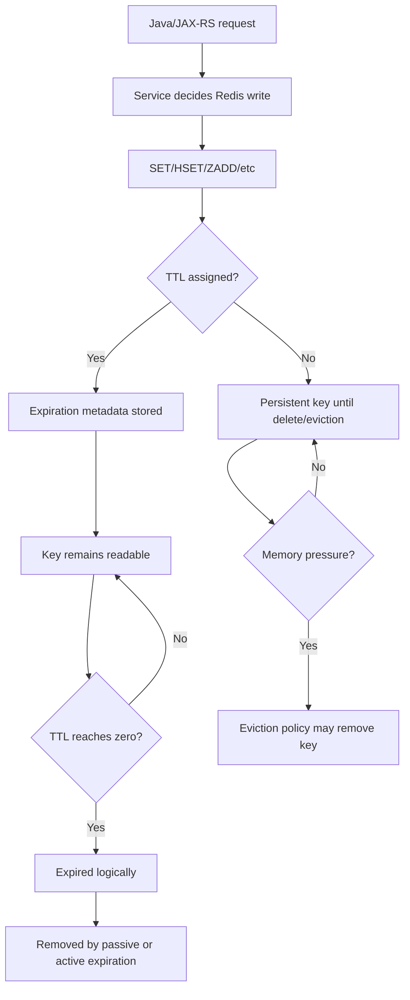
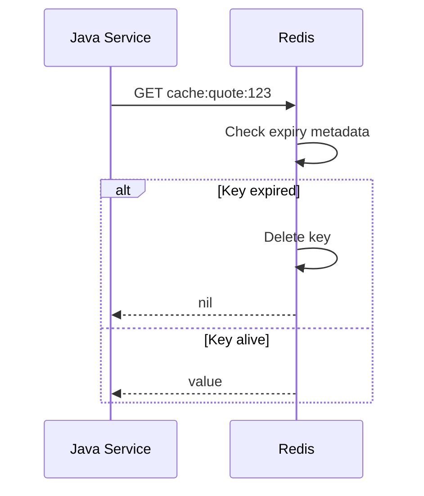
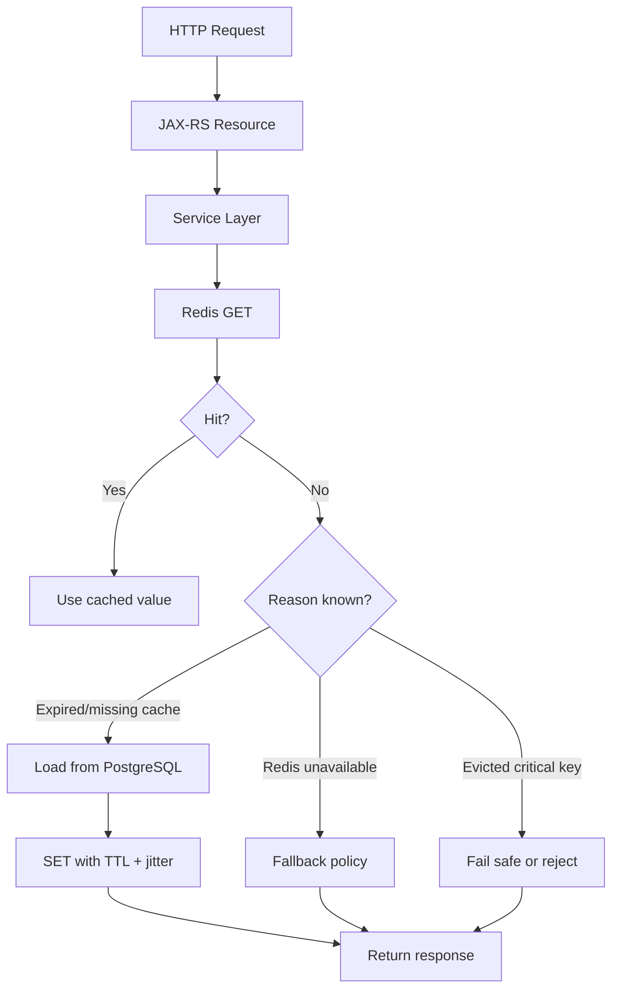

# Part 005 — TTL, Expiration, and Eviction

> Redis TTL is not only a cleanup mechanism. In enterprise backend systems, TTL is a correctness boundary, capacity control, privacy control, retry boundary, and incident-prevention mechanism.

This part focuses on how Redis keys disappear, when they should disappear, what happens when Redis runs out of memory, and how TTL decisions affect Java/JAX-RS services, PostgreSQL/MyBatis consistency, Kafka/RabbitMQ event processing, Kubernetes workloads, and production operations.

---

## 1. Core Idea

Redis stores data in memory. Because memory is finite, every Redis usage must answer three questions:

1. **How long may this key live?**
2. **What happens if this key expires?**
3. **What happens if Redis evicts this key before the TTL?**

A Redis key can disappear because:

- its TTL expires;
- Redis evicts it due to memory pressure;
- application code deletes it;
- deployment, failover, restore, or flush removes it;
- data was never replicated or persisted before failure.

TTL and eviction must be reviewed as part of application correctness, not only infrastructure configuration.

---

## 2. Why TTL Exists

TTL exists because many Redis use cases are temporary by nature:

| Redis Use Case | Why TTL Matters |
|---|---|
| Cache entry | Limits stale data and memory growth |
| Negative cache | Prevents permanent false absence |
| Idempotency key | Defines duplicate-request replay window |
| Rate limiter counter | Defines quota window |
| Distributed lock | Defines lease expiry and prevents permanent lock |
| Session/token state | Defines security/session lifetime |
| Job deduplication marker | Defines duplicate suppression window |
| Feature/config cache | Defines stale config window |
| Retry marker | Defines retry safety window |

A missing TTL can become:

- a memory leak-like pattern;
- a privacy retention issue;
- a correctness bug;
- a quota bug;
- a lock incident;
- a stale cache incident;
- an operational surprise during failover or scaling.

---

## 3. TTL Lifecycle

A typical Redis key lifecycle:



The important distinction:

- **Expiration** is time-based removal.
- **Eviction** is memory-pressure-based removal.
- **Deletion** is application-command-based removal.

These are not equivalent from a correctness perspective.

---

## 4. TTL vs Expiry vs Eviction

### TTL

TTL is the remaining lifetime of a key.

Common commands:

```redis
TTL key
PTTL key
EXPIRE key 60
PEXPIRE key 60000
EXPIREAT key 1735689600
SET key value EX 60
SET key value PX 60000
```

### Expiry

Expiry is the scheduled point in time when a key becomes logically expired.

### Eviction

Eviction happens when Redis must free memory because `maxmemory` is reached and the configured eviction policy allows removing keys.

A key can be evicted even if its TTL has not expired.

---

## 5. Absolute Expiry vs Relative Expiry

### Relative expiry

Relative expiry means “expire this key N seconds from now.”

Example:

```redis
SET quote:summary:123 "..." EX 300
```

Use for:

- cache entries;
- lock leases;
- rate limiter windows;
- idempotency records;
- temporary tokens.

### Absolute expiry

Absolute expiry means “expire at this exact timestamp.”

Example:

```redis
EXPIREAT session:abc 1735689600
```

Use for:

- security tokens with absolute expiration;
- business deadlines;
- license/config validity windows;
- exact retention boundaries.

### Review question

If a key is security-sensitive, ask whether relative TTL is enough or whether it must align with an absolute token/session expiry.

---

## 6. Passive Expiration

Redis does not necessarily remove expired keys immediately at the exact expiry timestamp.

Passive expiration happens when a client accesses a key and Redis sees that the key is expired. Redis then deletes it and treats it as missing.



Impact:

- Expired keys may still occupy memory until touched or sampled by active expiration.
- Application sees them as missing.
- Memory cleanup is not always immediate.

---

## 7. Active Expiration

Redis also runs active expiration cycles in the background. It samples keys with expiry and deletes expired ones.

Impact:

- Redis balances CPU cost and cleanup speed.
- Large numbers of simultaneously expiring keys can create latency spikes.
- Expired-key spikes can indicate TTL design problems.

Production implication:

> Expiry is not free. A million keys expiring at the same second is a workload event.

---

## 8. Expiry Precision

Redis supports second-level and millisecond-level TTLs.

Use seconds for most cache and business windows:

```redis
SET catalog:rules:v7 "..." EX 300
```

Use milliseconds when correctness needs short leases or limiter precision:

```redis
SET lock:quote:123 owner-uuid NX PX 5000
```

Avoid extremely short TTLs unless the application is explicitly designed for:

- network jitter;
- GC pause;
- retry delay;
- clock skew at application level;
- Redis latency spikes.

---

## 9. TTL Jitter

TTL jitter means adding randomness to TTL values so many keys do not expire at exactly the same time.

Without jitter:

```text
100,000 catalog keys expire at 10:00:00
all requests miss cache
PostgreSQL receives a sudden reload spike
```

With jitter:

```text
keys expire between 10:00:00 and 10:05:00
reload pressure is spread out
```

Example in Java-like pseudocode:

```java
Duration baseTtl = Duration.ofMinutes(10);
int jitterSeconds = ThreadLocalRandom.current().nextInt(0, 120);
Duration ttl = baseTtl.plusSeconds(jitterSeconds);
redis.set(key, value, ttl);
```

Use TTL jitter for:

- large cache populations;
- hot read models;
- tenant-level config;
- catalog/rules cache;
- negative cache under heavy traffic;
- computed quote/order summaries.

Avoid jitter for:

- token expiry that must match security semantics;
- idempotency windows with exact business/legal expectations;
- lock leases where jitter changes correctness assumptions.

---

## 10. No-Expiry Risk

A Redis key without TTL is not always wrong. Some keys may be intentionally persistent:

- feature flag cache with explicit invalidation;
- global config snapshot;
- long-lived counters;
- stream keys;
- metadata keys;
- coordination state with explicit cleanup.

But every no-expiry key needs justification.

Risk checklist:

| Risk | Example |
|---|---|
| Memory growth | Per-request key without expiry |
| Privacy retention | PII cached forever |
| Stale data | Catalog rule never refreshed |
| Tenant isolation issue | Old tenant config persists after deprovisioning |
| Operational surprise | Restore brings back obsolete state |
| Incident recovery issue | Bad key survives deployment rollback |

Senior review rule:

> “No TTL” must be an explicit design decision, not the default accident.

---

## 11. Eviction Policy Mental Model

Redis eviction policy decides what Redis may remove when memory is full.

The policy is configured at Redis/server/managed-service level, not usually per key.

Common policies:

| Policy | Meaning |
|---|---|
| `noeviction` | Writes fail when memory limit is reached |
| `allkeys-lru` | Evict least recently used keys from all keys |
| `volatile-lru` | Evict least recently used keys only among keys with TTL |
| `allkeys-lfu` | Evict least frequently used keys from all keys |
| `volatile-lfu` | Evict least frequently used keys only among keys with TTL |
| `allkeys-random` | Evict random keys from all keys |
| `volatile-random` | Evict random keys only among keys with TTL |
| `volatile-ttl` | Evict keys with TTL, favoring keys closer to expiry |

---

## 12. `noeviction`

With `noeviction`, Redis refuses writes when memory is full.

Possible effect in Java/JAX-RS service:

```text
Redis write fails
cache fill fails
rate limiter update fails
idempotency marker write fails
lock acquisition fails
request handling path changes
```

This can be safer for correctness-sensitive Redis use cases because data does not disappear silently. But it can turn memory pressure into application errors.

Good for:

- Redis used for coordination/idempotency where silent eviction is dangerous;
- Redis Streams/job queue where losing data is unacceptable;
- systems with strong alerting and capacity control.

Bad for:

- pure best-effort cache where write failures would cause too much app noise;
- systems without fallback behavior.

---

## 13. `allkeys-lru` and `allkeys-lfu`

These policies may evict any key, even keys without TTL.

Good for:

- Redis used primarily as cache;
- workloads where any cached entry may be recomputed;
- read-heavy systems where hit ratio matters more than preserving specific keys.

Dangerous for:

- idempotency records;
- locks;
- rate limiter counters;
- session/token state;
- stream/job data;
- coordination flags;
- any data treated as source of truth.

Review question:

> If this Redis instance uses `allkeys-*`, are correctness-sensitive keys stored in the same instance as cache keys?

If yes, that is a serious architecture smell.

---

## 14. `volatile-lru`, `volatile-lfu`, `volatile-ttl`

These policies only evict keys that have TTL.

This can protect persistent keys, but it creates a different risk:

- keys without TTL are never eviction candidates;
- memory may fill with persistent keys;
- writes may fail if not enough volatile keys can be evicted.

This policy makes TTL discipline even more important.

---

## 15. Expired Key vs Evicted Key

Do not confuse these.

| Event | Meaning | Application Interpretation |
|---|---|---|
| Expired | Key lived its intended TTL | Expected miss, refresh/retry may be normal |
| Evicted | Redis removed key due to memory pressure | Capacity incident or policy behavior |
| Deleted | Application removed key | Intended invalidation or cleanup |
| Missing after failover | Key not replicated/persisted | HA/durability issue |

For cache entries, expired and evicted may both look like a miss.

For idempotency, lock, session, queue, or security state, the difference can be critical.

---

## 16. TTL by Use Case

### Cache entry

Typical TTL: seconds to hours.

Design questions:

- How stale may this data be?
- Can application recompute it?
- Is PostgreSQL protected during mass expiry?
- Is negative caching needed?
- Should TTL have jitter?

### Negative cache

Typical TTL: short.

Example: quote not found, customer not eligible, catalog rule absent.

Risk:

- too long: newly created data appears missing;
- too short: repeated misses overload DB.

### Idempotency record

Typical TTL: minutes to days depending on retry contract.

Design questions:

- How long can client retry the same request?
- Is response replay required?
- What if Redis evicts this marker early?
- Is PostgreSQL also storing a unique business key?

### Distributed lock

Typical TTL: milliseconds to minutes depending on critical section.

Risk:

- too short: lock expires while owner still works;
- too long: failure causes long blockage;
- no fencing token: stale owner may still write.

### Rate limiter counter

TTL equals limiter window.

Risk:

- missing TTL means permanent throttling state;
- wrong TTL means quota window bug;
- eviction means limiter becomes too loose.

### Session/token state

TTL must match security semantics.

Risk:

- longer Redis TTL than token validity;
- no TTL on revoked tokens;
- eviction causing logout or bypass depending on implementation.

---

## 17. TTL and Java/JAX-RS Backend Behavior

A JAX-RS service must define Redis-miss behavior explicitly.



For every Redis access path, decide:

- If key is missing, do we reload, reject, fallback, or continue?
- If Redis write fails, do we fail request or continue without cache?
- If Redis is slow, do we wait, timeout, or use stale value?
- If Redis evicted key, can correctness still hold?

---

## 18. TTL and PostgreSQL/MyBatis/JDBC

Redis TTL decisions influence PostgreSQL load.

Bad pattern:

```text
All quote summary cache keys use exactly 5 minutes TTL
Traffic is high
Every 5 minutes many keys expire together
MyBatis queries spike
Connection pool saturates
JAX-RS latency rises
```

Better pattern:

- add TTL jitter;
- use stale-while-revalidate for safe read models;
- protect reload with single-flight;
- set DB query timeout lower than HTTP timeout;
- monitor cache miss bursts;
- cap reload concurrency.

TTL must be aligned with transaction boundaries:

- cache should not expose data before DB commit;
- cache should not keep stale data after critical write if stale read is not allowed;
- invalidation should be after commit, not before commit;
- if invalidation fails, the stale window must be understood.

---

## 19. TTL and Kafka/RabbitMQ

Event-driven invalidation often interacts with TTL.

Examples:

- Kafka event invalidates product catalog cache.
- RabbitMQ event refreshes tenant configuration cache.
- Redis key TTL acts as fallback if event invalidation is delayed or lost.

Design questions:

- Is TTL a backup for failed invalidation?
- How long may cache remain stale if event consumer is down?
- Are duplicate events safe?
- Are out-of-order events handled with versioned keys or timestamps?
- Can cache be rebuilt after consumer lag?

TTL is not a replacement for correct event handling, but it can limit the damage of failed invalidation.

---

## 20. TTL in Kubernetes, AWS, Azure, and On-Prem

### Kubernetes

TTL/eviction issues can be amplified by:

- pod autoscaling causing more cache reloads;
- rolling deployment invalidating local cache;
- connection storms during pod restart;
- Redis pod memory limit too close to Redis `maxmemory`;
- CPU throttling causing delayed expiration cleanup.

### AWS/Azure managed Redis

Verify:

- maxmemory and eviction policy;
- node type/SKU capacity;
- failover behavior;
- metric names for evictions/expired keys;
- backup/restore implications;
- maintenance window impact.

### On-prem/self-managed

Verify:

- OS memory overcommit;
- swap disabled or controlled;
- Redis `maxmemory` below physical memory;
- monitoring for RSS and fragmentation;
- backup/persistence storage;
- alert ownership.

---

## 21. Common Failure Modes

### 21.1 Cache key never expires

Symptom:

- stale data persists after DB update;
- memory grows slowly;
- manual delete fixes issue.

Root causes:

- missing `EX`/`PX`;
- later `SET` overwrote key without TTL;
- application uses `PERSIST` accidentally;
- hash fields updated but key TTL assumption forgotten.

Review command:

```redis
TTL some:key
```

### 21.2 TTL accidentally removed

Redis `SET key value` without expiry replaces the value and removes existing TTL unless using options that preserve TTL in supported Redis versions.

Risk:

```text
Initial SET key EX 300
Later SET key newValue
TTL disappears
key becomes persistent
```

Review pattern:

- every write path must preserve or reapply TTL intentionally.

### 21.3 Mass expiry causes DB overload

Symptom:

- cache miss spike;
- PostgreSQL CPU/query latency spike;
- JAX-RS p95/p99 latency increases;
- Redis hit ratio drops periodically.

Mitigation:

- TTL jitter;
- staggered cache warmup;
- single-flight reload;
- stale-while-revalidate;
- backpressure reloads.

### 21.4 Eviction breaks idempotency

Symptom:

- duplicate request processed twice;
- idempotency key missing before expected window;
- Redis shows eviction count increase.

Root cause:

- idempotency keys stored in Redis instance using cache-style eviction policy.

Mitigation:

- separate Redis instance/logical deployment for correctness-sensitive state;
- use `noeviction` or safer policy;
- persist idempotency in PostgreSQL for critical operations.

### 21.5 Lock expires too early

Symptom:

- two workers enter critical section;
- duplicate scheduler execution;
- conflicting DB updates.

Root causes:

- TTL shorter than worst-case critical section;
- GC pause;
- network delay;
- Redis failover;
- missing fencing token.

Mitigation:

- shorten critical section;
- use fencing token;
- renewal/watchdog with strict limits;
- move mutual exclusion to DB when DB is the protected resource.

### 21.6 Rate limiter becomes too loose

Symptom:

- traffic exceeds intended limit;
- limiter keys disappear;
- Redis evictions increase.

Root cause:

- limiter counters evicted under memory pressure.

Mitigation:

- memory sizing;
- separate limiter Redis;
- safer eviction policy;
- fail-closed/fail-open decision documented.

---

## 22. Production Diagnostics

Useful commands, to be used carefully and according to internal policy:

```redis
INFO memory
INFO stats
INFO keyspace
CONFIG GET maxmemory
CONFIG GET maxmemory-policy
TTL key
PTTL key
OBJECT IDLETIME key
MEMORY USAGE key
SLOWLOG GET 10
```

Avoid dangerous production behavior:

```redis
KEYS *
MONITOR
SMEMBERS huge:set
HGETALL huge:hash
LRANGE huge:list 0 -1
ZRANGE huge:zset 0 -1
```

Prefer scan-based and bounded inspection:

```redis
SCAN 0 MATCH service:* COUNT 100
HSCAN hash:key 0 COUNT 100
SSCAN set:key 0 COUNT 100
ZSCAN zset:key 0 COUNT 100
```

---

## 23. Metrics to Monitor

Minimum Redis TTL/eviction dashboard:

| Metric | Why It Matters |
|---|---|
| `used_memory` | Memory consumption |
| `used_memory_rss` | Actual resident memory |
| `mem_fragmentation_ratio` | Fragmentation pressure |
| `evicted_keys` | Eviction incident signal |
| `expired_keys` | Expiry volume signal |
| `keyspace_hits` / `keyspace_misses` | Cache efficiency |
| hit ratio | Cache usefulness |
| connected clients | Client scaling pressure |
| blocked clients | Blocking command issue |
| rejected connections | Capacity/config issue |
| command latency | Performance degradation |
| slowlog count | Expensive commands |

Application-side metrics:

- cache hit/miss per use case;
- cache reload count;
- DB fallback count;
- Redis timeout count;
- Redis write failure count;
- idempotency key missing unexpectedly;
- lock acquisition failure;
- limiter allowed/blocked count;
- stale fallback served count.

---

## 24. TTL Design Heuristics

### Short TTL

Use when:

- data changes frequently;
- stale data is risky;
- recomputation is cheap;
- security state is sensitive.

Risk:

- lower hit ratio;
- more DB load;
- more reload pressure.

### Long TTL

Use when:

- data changes rarely;
- recomputation is expensive;
- stale data is acceptable;
- invalidation is reliable.

Risk:

- stale data lasts longer;
- privacy retention risk;
- bigger memory footprint.

### No TTL

Use only when:

- key is intentionally persistent;
- lifecycle is controlled by explicit delete/trim;
- ownership is documented;
- memory growth is bounded;
- operational dashboards exist.

---

## 25. TTL Policy Template

Use this template when reviewing a Redis key family:

```yaml
key_family: "quote:summary:{tenantId}:{quoteId}:v1"
owner_service: "quote-service"
source_of_truth: "PostgreSQL quote tables"
redis_data_type: "string/json"
contains_pii: true
purpose: "read-through/cache-aside quote summary cache"
ttl: "10 minutes + 0-120 seconds jitter"
negative_cache_ttl: "30 seconds"
eviction_safe: true
stale_data_allowed: "yes, up to 10 minutes for non-submitted quotes"
invalidation_trigger: "quote updated event after DB commit"
reload_protection: "single-flight per quoteId"
fallback_if_redis_down: "load from PostgreSQL with DB rate protection"
metrics:
  - cache_hit
  - cache_miss
  - reload_latency
  - stale_served
  - redis_timeout
review_notes:
  - "Verify internal policy for quote/customer PII in cache"
  - "Verify tenant isolation in key naming"
```

---

## 26. PR Review Checklist

Ask these questions in PR review:

### TTL correctness

- Does every ephemeral key have TTL?
- Is the TTL aligned with business semantics?
- Is TTL re-applied after update?
- Can TTL disappear accidentally after `SET`?
- Is TTL too short for the operation?
- Is TTL too long for stale/privacy risk?

### Eviction correctness

- Is this key safe to evict?
- What happens if Redis evicts it early?
- Is this Redis instance shared with cache-only and correctness-sensitive keys?
- Is the eviction policy known?
- Are evictions alerted?

### Cache behavior

- Does TTL cause synchronized expiry?
- Is TTL jitter needed?
- Is there reload protection?
- Is PostgreSQL protected during cache miss spike?
- Is negative cache TTL short enough?

### Distributed systems behavior

- Does TTL define idempotency retry window?
- Does TTL define lock lease safety?
- Does TTL define rate limiter window?
- Does TTL interact with Kafka/RabbitMQ invalidation lag?
- Does TTL survive deployment/failover assumptions?

### Security/privacy

- Does key/value contain PII?
- Does TTL satisfy retention policy?
- Are snapshots/backups considered?
- Is sensitive state evictable?
- Are logs redacted?

---

## 27. Internal Verification Checklist

Use this checklist inside the actual team/codebase.

### Codebase

- Identify all Redis write paths.
- Identify keys written without TTL.
- Identify write paths that may remove TTL accidentally.
- Identify cache invalidation paths.
- Identify rate limiter, idempotency, lock, session, and token keys.

### Redis client configuration

- Verify default expiration helper methods.
- Verify serialization wrappers do not hide TTL behavior.
- Verify command timeout and retry policy.
- Verify pipeline/batch write behavior with TTL.

### Key naming convention

- Verify key family ownership.
- Verify tenant/environment/service prefix.
- Verify version prefix if payload schema can change.
- Verify no PII in key names.

### TTL policy

- Verify TTL matrix per key family.
- Verify TTL jitter where needed.
- Verify negative cache TTL.
- Verify no-expiry justification.

### Cache invalidation logic

- Verify invalidation happens after DB commit.
- Verify event-driven invalidation has retry/lag handling.
- Verify stale window is documented.

### Production topology

- Verify `maxmemory`.
- Verify `maxmemory-policy`.
- Verify persistence/replication expectations.
- Verify whether correctness-sensitive keys share instance with cache keys.

### Observability

- Verify evicted keys alert.
- Verify expired keys trend.
- Verify hit/miss ratio per feature.
- Verify Redis memory dashboard.
- Verify Java service Redis timeout/error metrics.

### Team discussion

- Confirm with backend/platform/SRE/security:
  - which Redis deployment is used;
  - what eviction policy is configured;
  - what data may be cached;
  - what TTL policies exist;
  - what runbook applies during memory pressure.

---

## 28. Common Anti-Patterns

### Anti-pattern: TTL as a magic consistency fix

TTL reduces stale duration. It does not guarantee correctness.

If stale data is unacceptable, rely on transactional source-of-truth design and explicit invalidation/versioning.

### Anti-pattern: One Redis instance for everything

Mixing cache, locks, idempotency, sessions, streams, and rate limiters under one eviction policy can create hidden coupling.

### Anti-pattern: No TTL matrix

If TTL is scattered across code as magic numbers, nobody can reason about retention, stale windows, or memory growth.

### Anti-pattern: Silent fallback for critical Redis state

For cache, fallback to DB may be fine.

For idempotency, locks, rate limiting, and token revocation, silent fallback may violate correctness or security.

### Anti-pattern: TTL without metrics

TTL policy without hit/miss, expired, evicted, and reload metrics is guesswork.

---

## 29. Production-Oriented Summary

TTL is a design contract:

- for cache, it bounds staleness;
- for rate limiting, it defines the quota window;
- for idempotency, it defines duplicate protection duration;
- for locks, it defines lease safety;
- for sessions/tokens, it defines security state lifetime;
- for memory, it controls key lifecycle;
- for privacy, it limits retention;
- for operations, it shapes failure behavior.

Eviction is not normal expiration. Eviction is a memory-pressure behavior that can be acceptable for cache and dangerous for coordination/security/correctness state.

Senior Redis review always asks:

> “If this key disappears earlier, later, or never, what breaks?”

---

## 30. What You Should Be Able to Do After This Part

You should now be able to:

- explain the difference between TTL, expiry, eviction, and delete;
- review Redis key lifecycle from Java service code;
- identify missing TTL and accidental TTL removal;
- reason about eviction policy impact;
- choose TTL by use case;
- apply TTL jitter safely;
- diagnose expired-key and evicted-key incidents;
- connect TTL behavior to PostgreSQL load;
- connect TTL behavior to Kafka/RabbitMQ invalidation;
- review Redis TTL usage in Kubernetes/cloud/on-prem deployments;
- ask strong PR review questions about TTL and eviction.

