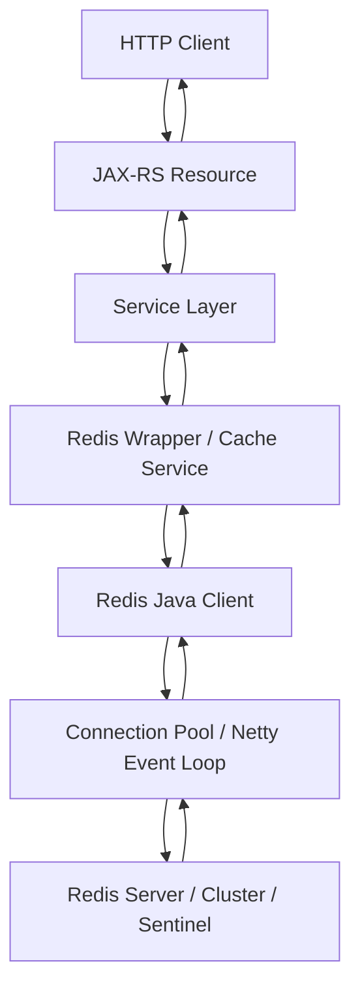
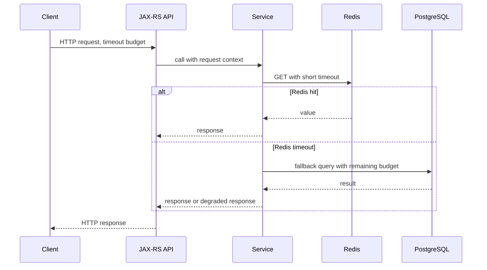

# Part 006 — Redis Java Client Ecosystem

> Redis client configuration is application architecture. A bad client setup can turn a healthy Redis server into a production incident: connection storms, event loop starvation, request pileups, stale topology, failed failover, and silent correctness bugs.

This part explains the Redis Java client ecosystem for enterprise Java/JAX-RS services. The focus is not only “which library to use,” but how client behavior affects latency, concurrency, failover, cluster routing, timeout propagation, serialization, observability, and production safety.

---

## 1. Core Idea

A Java service does not talk to Redis abstractly. It talks through a client library.

That client library decides:

- how connections are created;
- whether commands are synchronous, asynchronous, or reactive;
- how commands are queued;
- how timeouts are enforced;
- how reconnect behaves;
- how cluster redirection is handled;
- how Sentinel failover is discovered;
- how serialization is applied;
- how metrics are exposed;
- how errors surface to JAX-RS request handling.

In production, Redis client behavior is often as important as Redis server behavior.

---

## 2. Redis Java Client Landscape

The three names you will usually encounter:

| Client | Common Strength | Common Risk |
|---|---|---|
| Jedis | Simple, direct, familiar synchronous API | Requires careful pooling and blocking-thread awareness |
| Lettuce | Async/reactive support, Netty-based, cluster-aware | Event loop misuse and async complexity |
| Redisson | Higher-level distributed objects, locks, semaphores, queues | Abstraction can hide Redis semantics and correctness boundaries |

There may also be internal wrappers in enterprise systems:

- platform-provided Redis client abstraction;
- Spring cache abstraction;
- custom cache facade;
- custom rate limiter/idempotency/lock library;
- sidecar/proxy-based access;
- framework-managed Redis extension.

Senior review rule:

> Do not review Redis usage only at command level. Review the client abstraction that executes the command.

---

## 3. Where the Redis Client Sits in Java/JAX-RS Lifecycle



Important boundaries:

- JAX-RS resource should not contain raw Redis command logic.
- Service layer should express business fallback behavior.
- Redis wrapper should own key construction, TTL, serialization, and metrics.
- Client configuration should be centralized.
- Infrastructure should expose topology, credentials, TLS, and timeout configuration.

---

## 4. Synchronous Client Model

A synchronous Redis client blocks the calling thread until Redis responds or timeout occurs.

Example shape:

```java
String value = redis.get(key); // calling thread waits
```

Benefits:

- simple mental model;
- easy to integrate with traditional JAX-RS request-per-thread model;
- easier stack traces;
- easier transaction-like procedural code.

Risks:

- JAX-RS worker threads can block on Redis;
- Redis latency can consume application thread pool;
- connection pool exhaustion can block callers;
- timeout settings become critical;
- retries can amplify latency.

Use synchronous clients when:

- request model is blocking anyway;
- latency budgets are clear;
- connection pool is sized correctly;
- Redis is not called excessively per request;
- fallback behavior is explicit.

---

## 5. Asynchronous Client Model

An asynchronous client returns a future/promise-like result.

Example shape:

```java
CompletionStage<String> valueFuture = redis.getAsync(key);
```

Benefits:

- can avoid blocking application threads;
- can parallelize independent Redis calls;
- fits event-driven application internals;
- can improve throughput under I/O-heavy workloads.

Risks:

- error handling becomes more complex;
- timeout propagation may be forgotten;
- futures may be left unobserved;
- backpressure must be explicit;
- event loop threads must not be blocked;
- request cancellation may not cancel Redis work automatically.

Use async clients when:

- the application architecture is ready for async composition;
- there is clear timeout/cancellation handling;
- developers understand thread/event loop boundaries;
- metrics capture pending/in-flight commands.

---

## 6. Reactive Client Model

Reactive Redis clients expose streams/monos/flux-like APIs depending on framework.

Benefits:

- fits reactive stacks;
- supports non-blocking pipelines;
- can compose with reactive HTTP/database clients.

Risks:

- dangerous if mixed casually with blocking JAX-RS code;
- subscription behavior can surprise teams;
- backpressure semantics must be understood;
- blocking inside reactive chains can starve event loops;
- harder debugging for teams not trained in reactive systems.

For typical enterprise JAX-RS services, reactive Redis is only worth it when the broader application stack is designed for it.

---

## 7. Jedis Mental Model

Jedis is commonly known for a direct synchronous API.

Typical concerns:

- use pool correctly;
- close/return resources correctly;
- configure connection timeout and socket timeout;
- avoid sharing non-thread-safe connection objects incorrectly;
- use cluster/sentinel support intentionally;
- handle broken connections cleanly.

Conceptual example:

```java
try (Jedis jedis = jedisPool.getResource()) {
    String value = jedis.get(key);
}
```

Review questions:

- Is the pool globally shared or created per request?
- Are connections returned to pool?
- What happens when pool is exhausted?
- Are timeouts lower than HTTP request timeout?
- Are retries performed by client or caller?

---

## 8. Lettuce Mental Model

Lettuce is Netty-based and supports synchronous, asynchronous, and reactive usage.

Common strengths:

- thread-safe connection abstractions in many usage modes;
- async/reactive support;
- cluster topology handling;
- auto-reconnect capability;
- integration with metrics in many stacks.

Common risks:

- blocking Netty event loop;
- unbounded pending commands;
- misunderstood reconnect behavior;
- stale cluster topology under failures;
- shared connection misuse under blocking workloads;
- async errors not propagated to request boundary.

Review questions:

- Which API mode is used: sync, async, or reactive?
- Are event loop threads isolated from blocking work?
- Is command timeout configured?
- Is auto-reconnect behavior understood?
- Is cluster topology refresh enabled if needed?
- Are pending command queues bounded or monitored?

---

## 9. Redisson Mental Model

Redisson provides higher-level distributed constructs:

- locks;
- semaphores;
- maps;
- queues;
- topics;
- rate limiters;
- atomic counters;
- executor-like abstractions.

This can be useful, but it also changes review style.

The PR may not show raw commands like `SET NX PX`, but the correctness still depends on Redis behavior.

Review questions:

- Which Redisson object is used?
- What Redis keys does it create?
- What TTL/lease/watchdog behavior exists?
- Does the abstraction match the required correctness level?
- What happens on Redis failover, network partition, or JVM pause?
- Are lock/queue/rate limiter semantics documented?

Senior caution:

> A high-level Redis abstraction does not eliminate distributed systems failure modes. It only moves them behind an API.

---

## 10. Connection Pooling

Connection pooling controls how many Redis TCP connections a Java service opens and how commands wait for connections.

Bad pattern:

```text
50 pods
100 max Redis connections per pod
= 5,000 possible client connections
Redis maxclients = 10,000
rolling deployment doubles active pods temporarily
connection storm begins
```

Pool sizing must consider:

- number of pods;
- max replicas during rollout;
- number of Redis clients per JVM;
- sync vs async model;
- command latency;
- request concurrency;
- Redis `maxclients`;
- managed Redis connection limits;
- sidecar/proxy behavior if used.

---

## 11. Pool Exhaustion

Pool exhaustion means application threads wait for a Redis connection.

Symptoms:

- JAX-RS request latency rises;
- thread dumps show waiting on pool;
- Redis server may look healthy;
- application timeout occurs before Redis timeout;
- p99 latency spikes under load.

Root causes:

- pool too small;
- Redis calls too slow;
- connections leaked;
- long blocking commands;
- too many Redis calls per request;
- missing bulk/pipeline optimization;
- high pod replica count.

Mitigation:

- set pool acquisition timeout;
- expose pool metrics;
- cap per-request Redis calls;
- use batching/pipelining where safe;
- avoid long blocking commands on shared pool;
- separate pools for different workload classes if needed.

---

## 12. Netty Event Loop Awareness

For Netty-based clients, event loop threads handle I/O. Blocking them is dangerous.

Dangerous pattern:

```java
// Conceptual anti-pattern: blocking or heavy CPU inside callback/event-loop path
redis.getAsync(key).thenApply(value -> {
    expensiveJsonParsing(value);
    blockingDatabaseCall();
    return value;
});
```

Risk:

- Redis response processing stalls;
- unrelated commands are delayed;
- latency spikes globally;
- reconnect/topology handling may suffer;
- CPU-heavy deserialization affects I/O.

Better pattern:

- keep event loop callbacks lightweight;
- offload CPU-heavy work to worker executor;
- avoid blocking DB/HTTP/file calls inside Redis event loop;
- instrument command latency and pending commands.

---

## 13. Timeout Taxonomy

Redis clients usually involve several timeout concepts.

| Timeout | Meaning |
|---|---|
| Connection timeout | Time to establish TCP/TLS connection |
| Command timeout | Max time waiting for command completion |
| Socket/read timeout | Low-level network read timeout in blocking clients |
| Pool acquisition timeout | Time waiting for a pooled connection |
| Retry timeout/budget | Total time spent across attempts |
| HTTP request timeout | External request budget |

Correct ordering:

```text
Redis command timeout < service internal timeout < HTTP request timeout < upstream client timeout
```

If Redis command timeout is longer than HTTP timeout, the service may keep doing useless work after the caller already gave up.

---

## 14. Timeout Propagation in JAX-RS

A request should carry a latency budget.



Review questions:

- Is Redis timeout shorter than API timeout?
- Does fallback respect remaining budget?
- Are retries bounded by the same budget?
- Is timeout error mapped correctly?
- Are timeout metrics tagged by operation/key family?

---

## 15. Reconnect Behavior

Redis clients may reconnect automatically after connection loss.

Reconnect sounds good, but can create production issues:

- many pods reconnect at once;
- command queues grow during outage;
- stale connections remain in pool;
- first requests after failover see errors;
- topology refresh lags behind cluster changes.

Design questions:

- Are commands queued while disconnected?
- Is there a max queue size?
- What error does the application see?
- Does circuit breaker open during reconnect storm?
- Are reconnect attempts jittered/backed off?

---

## 16. Retry Behavior

Retries are not always safe.

Safe-ish to retry:

- idempotent reads;
- cache `GET`;
- best-effort cache fill if duplicate write is harmless;
- topology redirection handling.

Dangerous to retry blindly:

- rate limiter increments;
- idempotency state transitions;
- lock acquisition/release;
- queue consumption/ack;
- stream processing ack;
- `INCR` counters;
- Lua scripts with side effects.

Review rule:

> Redis retry policy must be operation-aware. Generic retries can create duplicate side effects.

---

## 17. Cluster-Aware Client

Redis Cluster requires the client to understand hash slots and redirection.

Important concepts:

- key mapped to hash slot;
- command routed to node owning the slot;
- `MOVED` means slot ownership changed;
- `ASK` means temporary migration state;
- multi-key commands require same slot;
- hash tags can force keys into same slot.

Client responsibilities:

- maintain slot topology;
- refresh topology after changes;
- follow `MOVED`/`ASK` redirections;
- route pipelines correctly;
- handle node failure.

Review questions:

- Is the client configured for cluster mode?
- Are multi-key commands cluster-safe?
- Are hash tags used intentionally?
- Is topology refresh enabled?
- Are MOVED/ASK errors visible in logs/metrics?

---

## 18. Sentinel-Aware Client

Redis Sentinel changes the primary during failover.

Client responsibilities:

- discover current primary;
- reconnect to new primary;
- handle old primary demotion;
- avoid writing to stale primary;
- surface errors during failover.

Review questions:

- Is Sentinel configured in client?
- Does the client know Sentinel endpoints, not only Redis primary endpoint?
- What happens during failover?
- Are writes retried safely?
- Are failover events monitored?

---

## 19. TLS and Authentication from Client Side

Security configuration is part of client configuration.

Verify:

- TLS enabled if required;
- hostname verification behavior;
- truststore/certificate configuration;
- AUTH/ACL username/password;
- credential rotation path;
- secret injection via Kubernetes/AWS/Azure/on-prem secret manager;
- no secrets in logs;
- no credentials hardcoded in config files.

Java-specific review:

- truststore loaded correctly;
- TLS handshake timeout reasonable;
- certificate rotation does not require unsafe manual redeploy if avoidable;
- connection pool refreshes credentials/certificates when rotated according to internal policy.

---

## 20. Serialization Abstraction

The Redis client may expose bytes, strings, JSON, or typed codecs.

Serialization decisions affect:

- compatibility;
- latency;
- memory usage;
- cross-language access;
- rolling deployments;
- debugging;
- compression;
- PII handling.

Common patterns:

```text
Java object -> JSON string -> Redis string
Java object -> binary codec -> Redis bytes
Map/object fields -> Redis hash
IDs/timestamps -> Redis sorted set
Counters -> Redis string integer
```

Review questions:

- Where is serialization implemented?
- Is the codec shared across services?
- Is payload versioned?
- What happens after class rename?
- Can operators inspect the value safely?
- Is compression worth CPU cost?

---

## 21. Client Metrics

Minimum client-side metrics:

| Metric | Why It Matters |
|---|---|
| command latency by operation | Detect slow Redis path |
| timeout count | Detect network/server/client issues |
| error count by exception type | Distinguish auth, network, timeout, cluster error |
| pool active/idle/waiting | Detect pool pressure |
| pool acquisition latency | Detect hidden queueing |
| reconnect count | Detect instability |
| pending commands | Detect async backlog |
| bytes in/out | Detect big value/network amplification |
| cache hit/miss by key family | Detect cache usefulness |
| fallback count | Detect Redis degradation impact |

Metrics should be tagged carefully:

- operation name;
- key family, not full key;
- service name;
- environment;
- Redis deployment/logical instance;
- outcome.

Do not tag with raw key if it contains tenant/customer/entity identifiers or high-cardinality values.

---

## 22. Logging Strategy

Good Redis logs include:

- operation name;
- key family;
- timeout value;
- elapsed time;
- fallback decision;
- correlation ID;
- exception class;
- Redis topology mode if relevant.

Avoid:

- full key with PII;
- full cached value;
- credentials;
- excessive per-command logs in hot paths;
- logging every cache miss at error level.

Recommended severity:

| Event | Suggested Severity |
|---|---|
| Cache miss | debug/metric only |
| Redis timeout with fallback | warn, sampled |
| Redis timeout without fallback | error |
| Auth failure | error/security alert |
| MOVED/ASK occasional | debug/metric |
| Reconnect storm | warn/error |
| Pool exhaustion | error |

---

## 23. Error Mapping to Application Behavior

Redis exceptions must map to domain behavior intentionally.

Example behavior matrix:

| Redis Use Case | Redis Down Behavior |
|---|---|
| Optional cache | Bypass cache, load DB if safe |
| Critical cache for expensive DB | Degrade or rate-limit fallback |
| Rate limiter | Fail-open or fail-closed by policy |
| Idempotency store | Usually fail-safe/reject for critical commands unless DB uniqueness protects |
| Distributed lock | Do not enter critical section |
| Session/token state | Fail-safe according to security policy |
| Pub/Sub notification | Accept loss only if non-critical |
| Stream queue | Pause/alert; do not pretend work succeeded |

JAX-RS mapping examples:

| Condition | Possible HTTP Mapping |
|---|---|
| Optional cache timeout, DB fallback success | 200 |
| Optional cache timeout, DB fallback unavailable | 503 or degraded response |
| Rate limited | 429 |
| Idempotency state unavailable for critical write | 409/503 depending design |
| Lock unavailable | 409/423/503 depending domain |
| Session state unavailable | 401/503 depending policy |

---

## 24. Circuit Breaker and Bulkhead

Redis calls should often be protected by resilience patterns.

### Circuit breaker

Prevents repeated Redis calls when Redis is failing.

Useful for:

- optional cache;
- remote Redis across network boundary;
- known failover windows;
- preventing thread exhaustion.

### Bulkhead

Limits concurrent calls to Redis/fallback path.

Useful for:

- cache miss reload protection;
- protecting PostgreSQL when Redis fails;
- preventing Redis from consuming all app threads.

Review questions:

- Is Redis failure isolated from main request thread pool?
- Does fallback to PostgreSQL have its own concurrency cap?
- Does circuit breaker distinguish cache vs correctness-sensitive operations?
- Does rate limiter fail-open/fail-closed explicitly?

---

## 25. Pipelining and Batching from Client Side

Pipelining sends multiple commands without waiting for each response one by one.

Benefits:

- fewer network round trips;
- better throughput;
- useful for bulk cache fetch/write.

Risks:

- larger in-flight command batches;
- harder per-command error handling;
- can increase latency for individual commands;
- cluster pipelines need routing awareness;
- not a substitute for atomicity.

Batching is useful when:

- loading multiple independent keys;
- writing warmed cache entries;
- deleting related cache keys;
- updating metrics/counters where ordering is not critical.

Do not confuse pipelining with transactions:

```text
Pipeline = network optimization
MULTI/EXEC = Redis transaction grouping
Lua = atomic server-side multi-step logic
```

---

## 26. Client-Side Caching Awareness

Some Redis clients support or integrate with client-side caching patterns.

Potential benefits:

- reduced Redis round trips;
- lower latency for hot keys;
- lower Redis CPU/network pressure.

Risks:

- invalidation complexity;
- stale local cache;
- multi-pod inconsistency;
- memory pressure in Java process;
- duplicate caching layers with unclear ownership.

Review questions:

- Is there local cache in addition to Redis?
- How is local cache invalidated?
- Does Redis Pub/Sub/keyspace notification drive local invalidation?
- What happens during missed notification?
- Are local cache metrics separated from Redis cache metrics?

---

## 27. Kubernetes Workload Considerations

Redis client behavior changes under Kubernetes.

Key risks:

- every pod creates its own pool;
- rolling update doubles connection count temporarily;
- autoscaling creates connection storms;
- DNS changes during failover;
- CPU limits throttle event loop or request threads;
- readiness probes may pass while Redis dependency is degraded;
- secrets rotation may not refresh live connections;
- network policy may block Redis after deployment changes.

Review formula:

```text
Total possible Redis connections = maxPodsDuringRollout × clientsPerPod × maxConnectionsPerClient
```

Use this before approving pool sizes.

---

## 28. AWS/Azure/On-Prem Client Concerns

### AWS managed Redis-compatible systems

Verify:

- endpoint type: primary, reader, configuration/cluster endpoint;
- TLS requirement;
- auth token/IAM-style auth if applicable internally;
- cluster mode enabled/disabled;
- failover behavior;
- DNS caching behavior in JVM;
- CloudWatch metrics correlation with app metrics.

### Azure managed Redis-compatible systems

Verify:

- hostname/port/TLS;
- access key or identity model according to internal setup;
- private endpoint/VNet routing;
- clustering settings;
- maintenance/failover behavior;
- Azure Monitor correlation with Java service logs.

### On-prem/self-managed

Verify:

- Sentinel/Cluster endpoints;
- certificate chain;
- firewall rules;
- DNS/host discovery;
- failover scripts/runbooks;
- connection limit;
- network latency between app and Redis.

---

## 29. Failure Modes

### 29.1 Connection storm

Symptoms:

- Redis `connected_clients` spikes;
- rejected connections increase;
- app pods restart or scale;
- latency increases even for simple commands.

Root causes:

- high pool size per pod;
- rolling deployment;
- Redis failover;
- aggressive reconnect without backoff;
- autoscaling event.

Mitigation:

- reduce pool size;
- stagger rollout;
- reconnect backoff/jitter;
- circuit breaker;
- connection limit alerting.

### 29.2 Pool exhaustion

Symptoms:

- app threads wait for Redis connection;
- Redis server latency may be normal;
- pool wait latency increases;
- HTTP p99 rises.

Root causes:

- pool too small;
- slow commands;
- leaked connections;
- too many Redis calls per request.

Mitigation:

- fix leak;
- cap per-request calls;
- optimize commands;
- adjust pool based on load test;
- introduce bulkhead.

### 29.3 Event loop starvation

Symptoms:

- async client latency spikes;
- CPU high in app;
- pending commands grow;
- Redis server looks healthy.

Root causes:

- blocking work on event loop;
- heavy deserialization callbacks;
- shared event loop overloaded.

Mitigation:

- offload CPU/blocking work;
- isolate event loop;
- reduce callback complexity;
- instrument pending commands.

### 29.4 Retry amplification

Symptoms:

- Redis traffic increases during Redis slowness;
- rate limiter counters over-increment;
- duplicate side effects;
- Redis recovers slowly.

Root causes:

- generic retry policy;
- no retry budget;
- retries on non-idempotent commands.

Mitigation:

- operation-aware retry;
- exponential backoff/jitter;
- retry budget;
- circuit breaker.

### 29.5 Cluster topology stale

Symptoms:

- repeated `MOVED`/`ASK` errors;
- cross-slot errors;
- commands fail after reshard/failover;
- only some keys fail.

Root causes:

- client not cluster-aware;
- topology refresh disabled;
- wrong endpoint;
- hash tag misuse.

Mitigation:

- enable cluster mode in client;
- verify topology refresh;
- review key hash tags;
- test reshard/failover.

### 29.6 Sentinel failover not handled

Symptoms:

- app keeps writing to old primary;
- write errors after failover;
- manual restart fixes app;
- intermittent stale reads.

Root causes:

- client points to static primary;
- Sentinel not configured;
- reconnect behavior wrong;
- DNS caching issue.

Mitigation:

- configure Sentinel-aware client;
- test failover;
- lower stale DNS assumptions;
- expose failover metrics.

---

## 30. Client Selection Framework

Choose based on use case, not popularity.

### Prefer simple synchronous client when

- service is blocking JAX-RS;
- Redis usage is simple cache/counter;
- team wants simple debugging;
- throughput needs are moderate;
- pool sizing is well understood.

### Prefer async/reactive client when

- application is already async/reactive;
- Redis calls can run in parallel;
- team understands async failure handling;
- backpressure is designed;
- event loop metrics are monitored.

### Prefer Redisson-style abstraction when

- higher-level primitive is valuable;
- team understands Redis semantics underneath;
- lock/semaphore/queue behavior has been reviewed;
- abstraction behavior under failover is tested.

### Prefer internal platform wrapper when

- organization needs standard metrics, timeouts, key construction, and policy enforcement;
- wrapper does not hide important correctness behavior;
- escape hatch exists for advanced use cases;
- ownership is clear.

---

## 31. Configuration Review Template

Use this shape when documenting Redis client configuration:

```yaml
redis_client:
  library: "Lettuce/Jedis/Redisson/internal-wrapper"
  mode: "sync/async/reactive"
  topology: "standalone/sentinel/cluster/managed"
  endpoint_type: "primary/configuration/cluster/sentinel"
  tls_enabled: true
  auth_mode: "ACL username+password / token / internal secret"
  connection_timeout_ms: 500
  command_timeout_ms: 100
  pool:
    max_total: 32
    max_idle: 16
    min_idle: 4
    acquisition_timeout_ms: 50
  retry:
    enabled: false
    policy: "operation-aware only"
  reconnect:
    enabled: true
    backoff: "exponential with jitter"
  cluster:
    topology_refresh: true
    moved_ask_handling: true
  metrics:
    command_latency: true
    pool_metrics: true
    timeout_count: true
    reconnect_count: true
  logging:
    key_family_only: true
    redact_values: true
```

---

## 32. PR Review Checklist

### Client choice

- Which Redis client is used?
- Is it already standard in the organization?
- Is there an internal wrapper?
- Does the abstraction expose enough operational behavior?

### Threading model

- Is the client synchronous, async, or reactive?
- Does this match the JAX-RS runtime model?
- Are blocking calls executed on safe threads?
- Are event loop threads protected?

### Connection management

- Is the client/pool singleton per application, not per request?
- Are connections closed/returned correctly?
- Is pool size calculated against pod count?
- Is pool acquisition timeout configured?
- Are pool metrics exposed?

### Timeout and retry

- Is command timeout configured?
- Is it shorter than HTTP timeout?
- Are retries operation-aware?
- Are non-idempotent commands protected from blind retry?
- Is circuit breaker/bulkhead needed?

### Topology

- Is the client configured for standalone/Sentinel/Cluster correctly?
- Are MOVED/ASK handled?
- Is Sentinel failover tested?
- Is DNS caching understood?

### Serialization

- Is serialization centralized?
- Is payload versioned?
- Are class rename/enum/date/BigDecimal risks handled?
- Is compression justified?

### Security

- Is TLS enabled where required?
- Are credentials in secret manager/Kubernetes Secret?
- Is rotation supported?
- Are keys/values redacted in logs?

### Observability

- Are command latency metrics available?
- Are errors tagged by operation/key family?
- Are pool metrics available?
- Are reconnects visible?
- Are Redis fallback decisions measurable?

---

## 33. Internal Verification Checklist for CSG/Team

Do not assume internal details. Verify them.

### Dependency and library

- Identify Redis client dependency in each service.
- Verify version and compatibility with Redis/managed Redis version.
- Check whether Jedis, Lettuce, Redisson, Spring abstraction, Quarkus extension, Jakarta EE integration, or internal wrapper is used.

### Client lifecycle

- Verify client is initialized once per service instance.
- Verify no client/pool is created per request.
- Verify graceful shutdown closes Redis resources.
- Verify readiness/liveness behavior during Redis degradation.

### Pool/event loop

- Verify pool max size, idle size, wait timeout.
- Verify total possible connections across Kubernetes replicas.
- Verify Netty event loop configuration if Lettuce/Redisson is used.
- Verify blocking work is not performed on event loop.

### Timeout/retry

- Verify connection timeout.
- Verify command timeout.
- Verify socket timeout if applicable.
- Verify retry policy and whether it is operation-aware.
- Verify fallback behavior for cache, limiter, idempotency, lock, stream, and session use cases.

### Topology

- Verify standalone/Sentinel/Cluster/managed mode.
- Verify cluster topology refresh.
- Verify Sentinel endpoints if used.
- Verify failover testing evidence.
- Verify endpoint type in AWS/Azure/on-prem.

### Serialization

- Verify serialization codec.
- Verify payload versioning.
- Verify compatibility during rolling deployment.
- Verify sensitive value redaction.

### Security

- Verify AUTH/ACL/TLS.
- Verify secret storage and rotation.
- Verify network isolation.
- Verify dangerous command restrictions if enforced at ACL level.

### Observability

- Verify client metrics exported to monitoring.
- Verify logs include operation/key family but not raw PII.
- Verify timeout/reconnect/pool exhaustion alerts.
- Verify dashboards correlate Java service Redis metrics with Redis server metrics.

### Team discussion

Ask backend/platform/SRE/security:

- Which Redis-compatible deployment is official for this service?
- Which Java client is approved?
- What timeout/pool defaults are recommended?
- What eviction policy and topology are used?
- Are Redis incidents documented?
- What is the standard fallback policy for each Redis use case?

---

## 34. Common Anti-Patterns

### Anti-pattern: Client created per request

This causes connection churn and latency overhead.

Use singleton/application-scoped client or managed pool.

### Anti-pattern: Infinite or very long Redis timeout

This turns Redis slowness into HTTP thread exhaustion.

Use bounded command timeout.

### Anti-pattern: Generic retry for all commands

This can duplicate side effects.

Use operation-aware retry.

### Anti-pattern: No pool metrics

Without pool metrics, pool exhaustion looks like random app latency.

Expose active/idle/waiting/acquisition latency.

### Anti-pattern: Full key as metric tag

This creates high-cardinality metrics and may leak tenant/customer data.

Tag by key family only.

### Anti-pattern: High-level abstraction without semantic review

Redisson or internal wrappers can hide lock/queue/rate limiter details.

Review behavior under failure.

### Anti-pattern: Cluster used like standalone Redis

Multi-key commands, Lua scripts, and transactions may fail with cross-slot problems.

Design keys for cluster from the beginning.

---

## 35. Production-Oriented Summary

The Redis Java client is not a passive transport layer. It defines runtime behavior under load and failure.

A production-ready Redis client setup must define:

- client library and mode;
- connection lifecycle;
- pool/event loop behavior;
- command timeout;
- retry/reconnect strategy;
- topology awareness;
- serialization compatibility;
- security configuration;
- observability;
- fallback behavior per Redis use case.

Senior review always asks:

> “When Redis is slow, failing over, unreachable, or full, what exactly happens to this Java request?”

---

## 36. What You Should Be Able to Do After This Part

You should now be able to:

- compare Jedis, Lettuce, Redisson, and internal wrappers from a production perspective;
- explain sync vs async vs reactive Redis access in Java/JAX-RS systems;
- reason about connection pool sizing and pool exhaustion;
- identify Netty event loop risks;
- design Redis timeout ordering relative to HTTP request timeout;
- distinguish safe and unsafe retry scenarios;
- review cluster-aware and sentinel-aware client configuration;
- check TLS/auth/secret handling from client side;
- define client-side Redis metrics and logging strategy;
- review Redis client configuration in Kubernetes/AWS/Azure/on-prem systems;
- ask strong PR questions about Redis client behavior under failure.

