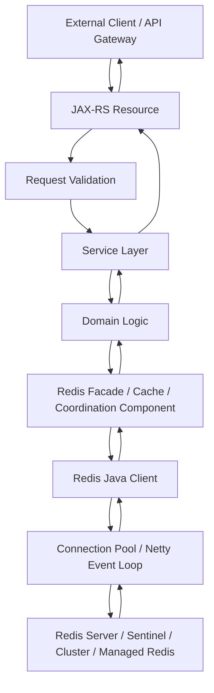
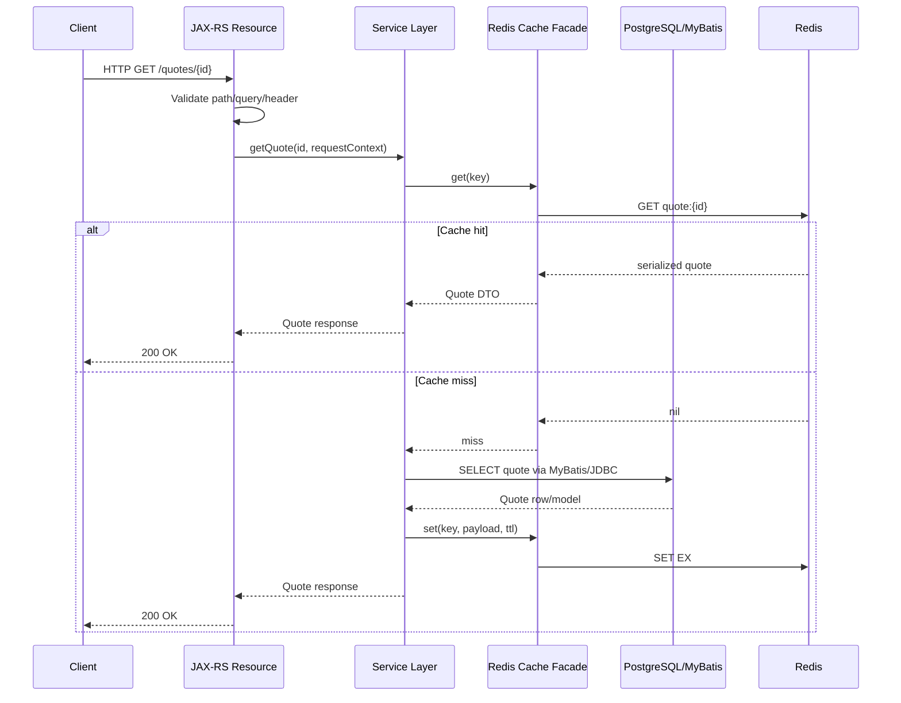
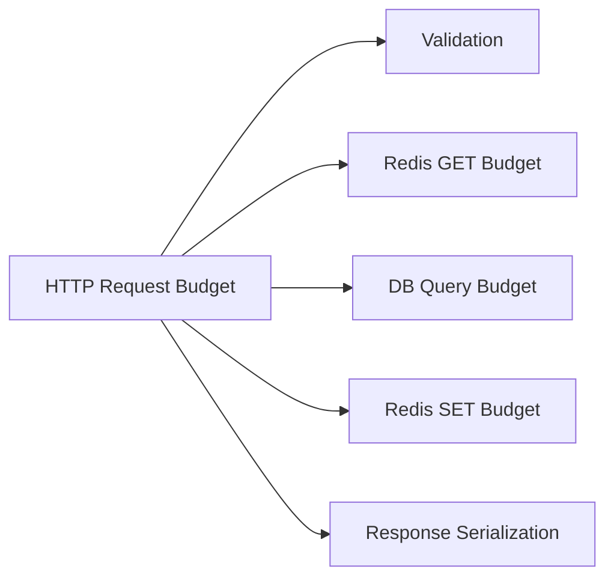

# Part 007 — Redis with Java/JAX-RS Service Lifecycle

> Redis access is not just a library call. In a production Java/JAX-RS service, every Redis command participates in HTTP latency, request cancellation, thread usage, failure propagation, fallback behavior, observability, and customer-facing correctness.

This part connects Redis to the lifecycle of a Java/JAX-RS request. The goal is to make Redis usage reviewable as part of service architecture, not hidden inside utility classes.

---

## 1. Core Idea

A Java/JAX-RS service does not use Redis in isolation.

A Redis command is usually executed inside this path:



Each boundary can change the behavior of Redis access:

- the gateway may already have a timeout;
- JAX-RS may run on a limited worker thread pool;
- the service layer may need fallback behavior;
- the domain layer may require correctness guarantees;
- Redis facade may decide key, TTL, serialization, and metric tags;
- Redis client may block, retry, reconnect, or route to cluster slots;
- Redis server may be slow, unavailable, failing over, evicting, or returning stale replica reads.

Senior review rule:

> A Redis call must be reviewed as a distributed dependency inside the request lifecycle, not as an in-memory map lookup.

---

## 2. Redis Is a Remote Dependency

Redis is fast, but it is still remote infrastructure.

That means every Redis command has:

- network latency;
- connection acquisition latency;
- command queueing latency;
- server processing time;
- response serialization/deserialization cost;
- timeout behavior;
- retry behavior;
- authentication/TLS overhead if enabled;
- failure modes.

Bad mental model:

```java
// Looks harmless, but this is a remote call.
String cached = redis.get(key);
```

Better mental model:

```text
This line may block a request thread, wait for a connection, cross the network,
execute on Redis, deserialize a response, and fail due to timeout, failover,
cluster redirection, authentication, TLS, or memory pressure.
```

The code shape hides the distributed systems reality.

---

## 3. Request Lifecycle View

A simplified JAX-RS request using Redis cache may look like this:



This diagram looks simple. The production reality has additional questions:

- What if Redis GET times out?
- What if Redis SET fails after DB load?
- What if DB query succeeds but cache fill fails?
- What if the HTTP client disconnects while Redis command is still in flight?
- What if Redis is in failover and the client retries?
- What if connection pool is exhausted?
- What if stale cache returns a deleted quote?
- What if key serialization changes during rolling deployment?

Every Redis path needs explicit answers.

---

## 4. Boundary Responsibilities

### 4.1 JAX-RS Resource Boundary

The JAX-RS resource should handle HTTP concerns:

- route mapping;
- path/query/header parsing;
- authentication/authorization result consumption;
- input validation;
- request correlation ID extraction;
- response status mapping;
- error response shape.

It should not usually contain raw Redis commands.

Avoid:

```java
@Path("/quotes")
public class QuoteResource {
    @Inject RedisClient redis;

    @GET
    @Path("/{id}")
    public Response getQuote(@PathParam("id") String id) {
        String raw = redis.get("quote:" + id);
        // business logic, deserialization, fallback, metrics mixed here
    }
}
```

Prefer:

```java
@Path("/quotes")
public class QuoteResource {
    @Inject QuoteService quoteService;

    @GET
    @Path("/{id}")
    public Response getQuote(@PathParam("id") String id,
                             @Context ContainerRequestContext requestContext) {
        QuoteResponse response = quoteService.getQuote(id, RequestContext.from(requestContext));
        return Response.ok(response).build();
    }
}
```

The resource should call a service method that expresses the business operation, not the cache operation.

### 4.2 Service Layer Boundary

The service layer owns business behavior:

- whether cache miss should load from PostgreSQL;
- whether stale data is acceptable;
- whether Redis failure should fail open or fail closed;
- whether idempotency failure should block request processing;
- whether rate limiter denial returns HTTP 429;
- whether lock acquisition failure returns 409, 423, 429, 503, or queues work;
- whether a fallback is safe.

Redis should not decide business policy by accident.

Example:

```java
public QuoteDetails getQuote(String quoteId, RequestContext ctx) {
    return quoteCache.getOrLoad(
        QuoteCacheKey.byId(quoteId),
        () -> quoteRepository.findById(quoteId),
        ctx
    );
}
```

The cache facade executes Redis mechanics. The service layer owns whether cache usage is appropriate.

### 4.3 Redis Facade Boundary

A Redis facade/cache component should own Redis-specific concerns:

- key naming;
- TTL selection;
- serialization/deserialization;
- command selection;
- fallback mechanics;
- metrics;
- logging;
- exception translation;
- cache hit/miss recording;
- production-safe debug hooks.

Example responsibilities:

```text
QuoteCache
- build key: quote:v1:{tenantId}:{quoteId}
- get key
- deserialize QuoteCachePayloadV1
- treat deserialization failure as cache miss or hard error based on policy
- load from DB on miss
- set key with TTL + jitter
- emit hit/miss/latency/error metrics
```

A Redis facade prevents Redis logic from being scattered across resources and services.

---

## 5. Redis Client Injection

Redis clients should usually be application-scoped, not request-scoped.

Bad pattern:

```java
public QuoteService() {
    this.redis = new RedisClient(...); // creates client per service instance or manually
}
```

Risk:

- inconsistent config;
- connection leaks;
- no centralized metrics;
- difficult lifecycle management;
- inconsistent TLS/auth/topology;
- duplicate pools;
- no standard timeout.

Better pattern:

```java
@ApplicationScoped
public class RedisClientProvider {
    private StatefulRedisConnection<String, String> connection;

    @PostConstruct
    void start() {
        // Initialize client, connection, metrics, topology, timeout config.
    }

    public RedisCommands<String, String> sync() {
        return connection.sync();
    }

    @PreDestroy
    void stop() {
        // Close connection/client cleanly.
    }
}
```

The exact annotation model depends on framework: Jakarta CDI, Spring, Quarkus, Micronaut, Dropwizard, or internal platform.

Review question:

> Is Redis client lifecycle owned centrally, or does every feature create its own connection behavior?

---

## 6. Request Context Propagation

Redis access should preserve request context for observability and policy.

Useful context includes:

- correlation ID;
- tenant ID;
- user/customer/account ID if safe to log;
- endpoint name;
- operation name;
- request deadline;
- auth scope;
- feature flag state;
- deployment environment;
- service version.

However, not all context should enter key names or logs.

Do not put raw PII or secrets into Redis keys:

```text
bad: session:john.smith@example.com
bad: token:eyJhbGciOi...
bad: customer:passport-number:...
```

Prefer stable opaque identifiers:

```text
session:{sessionIdHash}
user-rate-limit:{tenantId}:{userIdHash}:{endpoint}
quote:v1:{tenantId}:{quoteId}
```

Context should be used for:

- metric tags with controlled cardinality;
- log correlation;
- timeout budget;
- tenant-aware key construction;
- security enforcement;
- fallback decision.

---

## 7. Timeout Propagation

Timeouts are one of the most important Redis integration details.

A common production failure:

```text
HTTP gateway timeout: 3 seconds
JAX-RS request timeout: 5 seconds
Redis command timeout: 10 seconds
Database timeout: 30 seconds
Retry policy: 3 attempts
```

This is broken because lower-level dependencies can outlive the request budget.

Better:

```text
HTTP gateway timeout: 3 seconds
Application request budget: 2.5 seconds
Redis cache GET budget: 30-80 ms
Database query budget: 500-1500 ms depending on endpoint
Redis cache SET budget: best-effort / short timeout
No retry on latency-sensitive cache GET unless explicitly justified
```

### 7.1 Timeout Budget Shape



The Redis timeout must fit inside the HTTP budget.

For cache reads:

- short timeout;
- fail open if cache is optional;
- fallback to DB if safe;
- avoid retry storms.

For rate limiter:

- timeout may fail open or fail closed depending on security/business risk;
- policy must be explicit.

For idempotency:

- timeout may be ambiguous;
- failing open may create duplicates;
- failing closed may block legitimate requests.

For distributed lock:

- timeout may mean lock state is unknown;
- critical section must not assume lock was not acquired unless command outcome is known.

---

## 8. Redis Failure Behavior by Use Case

Not all Redis failures should behave the same.

| Redis Use Case | Redis Failure Default | Why |
|---|---|---|
| Optional read cache | Usually fail open and load from DB | Cache is performance optimization |
| Cache fill after DB read | Usually best effort | Response can succeed without cache fill |
| Rate limiter | Depends: fail open or fail closed | Business/security policy decision |
| Idempotency store | Usually fail closed or degrade carefully | Duplicate side effects risk |
| Distributed lock | Usually fail closed | Unsafe to enter critical section without lock certainty |
| Session store | Often fail closed or degraded auth state | Security/session correctness risk |
| Token blacklist | Usually fail closed for sensitive operations | Revoked token acceptance risk |
| Feature flag cache | Use safe default | Avoid unsafe feature enablement |
| Stream/job queue | Depends on durability requirement | Work loss/duplicate processing risk |
| Pub/Sub notification | Often tolerated if non-critical | Pub/Sub is not durable |

Senior review question:

> Does the code treat all Redis errors the same, or does behavior depend on the Redis use case?

---

## 9. Error Mapping

Redis client exceptions should not leak directly to HTTP responses.

Common Redis-related error categories:

- connection failure;
- command timeout;
- pool exhaustion;
- authentication failure;
- TLS/certificate failure;
- MOVED/ASK cluster redirection problem;
- READONLY after failover;
- serialization/deserialization failure;
- script error;
- command rejected by ACL;
- Redis OOM / maxmemory noeviction;
- BUSY script;
- loading state during restart.

Map errors by use case.

### 9.1 Optional Cache Error

```text
Redis GET timeout
→ record cache error metric
→ log sampled warning with correlation ID
→ load from PostgreSQL if DB budget remains
→ response may still be 200
```

### 9.2 Rate Limiter Error

```text
Redis limiter script timeout
→ apply configured fail-open/fail-closed policy
→ if fail-closed: return 503 or 429 depending semantics
→ if fail-open: allow request but emit high-severity metric
```

### 9.3 Idempotency Error

```text
Redis SET NX timeout
→ state unknown
→ do not blindly execute side effect if duplicate risk is unacceptable
→ return retryable error or use PostgreSQL-backed idempotency fallback if designed
```

### 9.4 Lock Error

```text
Redis lock acquisition timeout
→ lock state unknown
→ do not enter critical section
→ return retryable response or reschedule work
```

---

## 10. Fallback Design

Fallback is not always safe.

Bad fallback:

```text
Redis failed, so continue without Redis.
```

Better fallback:

```text
Redis failed for optional product catalog cache read.
The source of truth is PostgreSQL.
The endpoint can tolerate higher latency.
The DB has enough protection.
Load from DB and skip cache fill if Redis remains unavailable.
```

Fallback must answer:

- Is Redis only an optimization?
- Is fallback source available?
- Will fallback overload PostgreSQL?
- Will fallback violate idempotency?
- Will fallback bypass security state?
- Will fallback cause duplicate jobs?
- Will fallback return stale or unsafe data?
- Should fallback be disabled under database pressure?

### 10.1 Cache Fallback

Cache fallback usually means database load.

But if Redis outage causes all traffic to hit PostgreSQL, fallback can become an outage amplifier.

Mitigation:

- circuit breaker around Redis;
- database bulkhead;
- request coalescing;
- stale fallback if available;
- rate-limited reload;
- load shedding;
- partial response if business allows.

### 10.2 Security Fallback

Security fallback must be conservative.

If Redis stores token revocation or login attempt counters, blindly ignoring Redis failure can weaken security.

Possible policies:

- fail closed for high-risk operations;
- allow read-only low-risk operations;
- require re-authentication;
- use short-lived local cache with strict TTL;
- degrade only for internal service-to-service paths if explicitly approved.

---

## 11. Circuit Breaker and Bulkhead

Redis failures should not consume all JAX-RS worker threads.

### 11.1 Circuit Breaker

A circuit breaker prevents repeated calls to a failing Redis dependency.

Useful for:

- Redis unavailable;
- sustained timeout;
- failover window;
- authentication outage;
- network partition.

For optional cache:

```text
circuit open → skip Redis → load from DB with protection
```

For lock/idempotency/rate limiter:

```text
circuit open → apply explicit fail policy
```

### 11.2 Bulkhead

A bulkhead limits how much of the application can be consumed by Redis work.

Examples:

- separate thread pool for blocking Redis operations;
- connection pool limit;
- semaphore around expensive cache reload;
- per-endpoint Redis call budget;
- local queue limit for async commands.

Without bulkheads, Redis slowness can cause:

- request thread exhaustion;
- connection pool exhaustion;
- pending command growth;
- GC pressure;
- cascading timeout;
- database overload due to cache fallback.

---

## 12. Redis Slow Scenario

Redis does not need to be fully down to cause an incident.

Slow Redis can be worse because every request waits.

Symptoms:

- increased p95/p99 HTTP latency;
- increased Redis command latency;
- increased connection pool wait time;
- growing in-flight commands;
- JAX-RS worker thread saturation;
- database load spike from cache timeout fallback;
- slowlog entries;
- CPU or memory pressure on Redis;
- hot key/big key symptoms;
- cluster redirection spikes.

Response pattern:

```text
1. Confirm endpoint latency.
2. Confirm Redis client latency by command/use case.
3. Check pool wait time and pending commands.
4. Check Redis server latency/slowlog/memory/CPU.
5. Check hot/big key indicators.
6. Check fallback path DB load.
7. Open circuit for optional cache if needed.
8. Protect source of truth.
```

---

## 13. Redis Unavailable Scenario

Unavailable Redis can show up as:

- connection refused;
- DNS failure;
- TLS handshake failure;
- auth failure;
- timeout;
- failover in progress;
- cluster slots unavailable;
- managed service maintenance;
- network policy/security group change;
- Kubernetes service endpoint issue.

The service should not discover its Redis failure policy during an incident.

For each Redis use case, define:

```text
Redis unavailable behavior:
- fail open?
- fail closed?
- use stale local cache?
- fallback to PostgreSQL?
- return 503?
- queue retry?
- disable feature?
- trigger alert?
```

---

## 14. Request Cancellation

HTTP clients can disconnect before Redis commands finish.

Risks:

- work continues after caller is gone;
- async Redis future still consumes resources;
- cache fill continues unnecessarily;
- idempotency state may be left in processing;
- locks may be acquired but business work aborted;
- background callbacks may log confusing errors.

Review questions:

- Does the framework expose request cancellation?
- Are async Redis operations cancelled when request is cancelled?
- Are cache fills allowed to continue after request cancellation?
- Are locks released in `finally` blocks?
- Is idempotency state updated on cancellation/timeout?

Important distinction:

> Client cancellation does not necessarily mean server-side business operation did not happen.

This matters for idempotency and retry semantics.

---

## 15. Graceful Shutdown

During Kubernetes rolling update or application shutdown, Redis clients need graceful cleanup.

Bad shutdown behavior:

- pod receives SIGTERM;
- application stops accepting HTTP too late;
- in-flight requests still use Redis;
- Redis connection closes abruptly;
- locks are not released;
- stream consumer stops without ack discipline;
- job worker leaves pending entries;
- client reconnects during shutdown.

Better shutdown sequence:

```text
1. Stop accepting new traffic.
2. Mark readiness false.
3. Wait for load balancer drain.
4. Stop background Redis consumers/workers.
5. Finish or cancel in-flight requests safely.
6. Release owned locks if safe and still owned.
7. Close Redis connections/client.
8. Exit process.
```

For cache-only Redis, abrupt shutdown is often tolerable.

For locks, streams, queues, and idempotency, shutdown behavior is correctness-sensitive.

---

## 16. Connection Cleanup

Redis clients should be closed cleanly.

Potential issues:

- leaked connections during redeploy;
- duplicate connection pools;
- connection storm after restart;
- stale connections after failover;
- unmanaged event loop threads;
- pod does not terminate because client threads are non-daemon;
- metrics still reporting old client instances.

Review checklist:

- Is client created once per application instance?
- Is connection pool closed on shutdown?
- Are async event loops shut down?
- Are background consumers stopped first?
- Are retries disabled during shutdown?
- Is readiness flipped before closing connections?

---

## 17. Observability in the Request Lifecycle

Redis observability must be attached to application operations, not just Redis server metrics.

Useful application-side metrics:

- Redis command latency by operation name;
- cache hit/miss ratio by cache name;
- Redis error count by error category;
- timeout count;
- fallback count;
- circuit breaker state;
- pool wait time;
- active/idle connections;
- pending commands;
- serialization/deserialization failure count;
- lock acquisition latency;
- lock acquisition failure count;
- idempotency duplicate/replay count;
- rate limiter allow/deny/error count;
- stream pending entries and consumer lag.

Avoid uncontrolled metric cardinality:

```text
bad tag: key=quote:v1:tenant-123:quote-987654321
bad tag: userEmail=john@example.com
bad tag: rawEndpoint=/quotes/987654321/items/123
```

Prefer bounded tags:

```text
cache=quoteDetails
operation=redis.get
endpoint=GET /quotes/{id}
outcome=hit|miss|timeout|error
redis_use_case=cache|lock|rate_limiter|idempotency
```

---

## 18. Logging Strategy

Redis logs should help debug without leaking sensitive data.

Good Redis log fields:

- correlation ID;
- endpoint template;
- operation name;
- cache name/use case;
- Redis command category, not always raw command;
- sanitized key pattern;
- timeout budget;
- elapsed time;
- outcome;
- fallback action;
- exception category.

Avoid:

- raw key if it may contain PII;
- raw value;
- token/session contents;
- full serialized payload;
- excessive logs on every cache miss;
- logging every Redis command at info level.

Example safe log:

```text
WARN redis.cache.timeout correlationId=abc123 cache=quoteDetails keyPattern=quote:v1:{tenant}:{quoteId} elapsedMs=82 timeoutMs=80 fallback=db-load
```

---

## 19. PostgreSQL/MyBatis Interaction

Redis integration often changes PostgreSQL behavior.

Cache hit:

```text
HTTP request → Redis hit → no PostgreSQL query
```

Cache miss:

```text
HTTP request → Redis miss → PostgreSQL query → Redis set
```

Redis timeout:

```text
HTTP request → Redis timeout → PostgreSQL query if fallback allowed
```

Redis outage:

```text
All cacheable traffic may hit PostgreSQL
```

Questions for PostgreSQL/MyBatis:

- Can PostgreSQL handle worst-case cache miss traffic?
- Are MyBatis queries optimized enough for miss path?
- Are DB connection pools protected from cache outage?
- Does cache miss create N+1 DB queries?
- Does transaction commit happen before cache invalidation?
- Are stale cache entries possible after DB update?
- Does fallback bypass read model consistency assumptions?

Redis can reduce DB load during normal operation but amplify DB load during failure.

---

## 20. Kafka/RabbitMQ Interaction

Redis may interact with messaging in several ways:

- event-driven cache invalidation;
- consumer updates Redis projection;
- Redis stores idempotency for message consumer;
- Redis lock prevents duplicate scheduled job execution;
- Redis rate limiter protects downstream broker publishing;
- Redis Streams is used instead of or alongside broker queue;
- Redis Pub/Sub sends non-durable local notification.

Lifecycle concern:

```text
HTTP request commits DB transaction
→ event published to Kafka/RabbitMQ
→ consumer invalidates Redis key
→ another request observes fresh data
```

Failure windows:

- DB commit succeeds but event publish fails;
- event publish succeeds but consumer fails;
- consumer receives duplicate event;
- events arrive out of order;
- Redis invalidation fails;
- cache remains stale until TTL;
- Redis projection rebuild is needed.

Do not assume Redis and Kafka/RabbitMQ create automatic consistency.

---

## 21. Kubernetes Runtime Concerns

In Kubernetes, Redis lifecycle is affected by pod behavior.

Important issues:

- every Java pod may create its own Redis connection pool;
- scaling replicas multiplies Redis connections;
- rolling deployment can create connection churn;
- startup probes may pass before Redis client is ready;
- readiness should reflect critical Redis dependency only when appropriate;
- liveness should not restart pods just because optional cache is down;
- DNS behavior can affect Redis discovery;
- network policy may block Redis suddenly;
- CPU throttling can increase client-side latency;
- memory pressure can slow serialization/deserialization;
- secret rotation must update Redis credentials safely.

Readiness rule:

> Do not mark the whole service unready for optional cache Redis unless that is an intentional availability policy.

For critical Redis use cases such as session store, idempotency, or security state, readiness may need stricter behavior.

---

## 22. Cloud and On-Prem Runtime Concerns

Redis behavior can differ by deployment:

| Deployment | Lifecycle Concern |
|---|---|
| Self-managed Redis | OS tuning, persistence, failover, backup, patching, monitoring ownership |
| Redis Sentinel | failover discovery and client Sentinel config |
| Redis Cluster | hash slot routing, MOVED/ASK, multi-key limitations |
| AWS managed Redis-compatible service | maintenance windows, Multi-AZ failover, parameter groups, CloudWatch |
| Azure managed Redis-compatible service | tier limits, private endpoint, access key/TLS, Azure Monitor |
| On-prem/hybrid | network latency, firewall, TLS certificates, operational boundary |

The Java service should not hard-code assumptions that only work in one topology.

Examples:

- multi-key command may fail in Redis Cluster;
- long timeouts may hide managed failover events;
- connection storm may hit managed service connection limits;
- TLS may change latency and certificate failure modes;
- private endpoint/network policy changes can look like Redis outage.

---

## 23. Production Failure Modes

### 23.1 Optional Cache Failure Amplifies DB Load

```text
Redis cache down
→ all requests miss/fallback
→ PostgreSQL/MyBatis load spikes
→ DB pool saturates
→ endpoint latency spikes
→ customer-facing outage
```

Mitigations:

- circuit breaker;
- DB bulkhead;
- stale fallback;
- local cache;
- request coalescing;
- load shedding;
- cache warmup after recovery.

### 23.2 Connection Pool Exhaustion

```text
Redis slow
→ connections held longer
→ pool exhausted
→ request threads wait
→ HTTP latency increases
→ retries make it worse
```

Mitigations:

- short command timeout;
- bounded pool wait;
- no unbounded retries;
- metrics on pool wait;
- per-use-case clients/pools only when justified.

### 23.3 Failover Causes Unknown Outcomes

```text
Redis primary failover
→ command timeout / READONLY / reconnect
→ application retries
→ duplicate side effect possible if Redis was used for idempotency/lock
```

Mitigations:

- use case-specific retry policy;
- idempotent business operation;
- fencing token for locks;
- database constraints for final correctness;
- explicit unknown-state handling.

### 23.4 Serialization Error Becomes Runtime Incident

```text
Rolling deployment changes Java model
→ old cache payload cannot deserialize
→ endpoint fails instead of treating cache as miss
```

Mitigations:

- versioned payload;
- tolerant deserialization;
- cache-aside miss on incompatible payload when safe;
- deployment compatibility test;
- cache namespace version bump.

### 23.5 Redis Used as Hidden Source of Truth

```text
Feature stores important state only in Redis
→ Redis eviction/restart/data loss
→ business state lost
```

Mitigations:

- define source of truth;
- configure persistence if Redis state must survive;
- use PostgreSQL for durable state;
- treat Redis as derived/ephemeral unless explicitly designed otherwise.

---

## 24. Design Patterns for Safer Integration

### 24.1 Redis Facade per Use Case

Instead of generic `RedisUtil`, prefer specific components:

```text
QuoteCache
CatalogCache
TenantRateLimiter
RequestIdempotencyStore
SchedulerLockService
SessionStateStore
StreamJobConsumer
```

Benefits:

- clearer ownership;
- use-case-specific TTL;
- safer metrics;
- explicit fallback;
- easier PR review;
- less accidental key collision.

### 24.2 Centralized Redis Policy

Centralize:

- client config;
- timeout defaults;
- serialization registry;
- key naming helpers;
- safe logging helpers;
- metrics wrapper;
- circuit breaker config;
- dangerous command restrictions.

But do not centralize business semantics into a generic abstraction that hides correctness boundaries.

### 24.3 Explicit Operation Names

Every Redis call should have a logical operation name:

```text
cache.quote.get
cache.quote.set
rateLimit.tenant.check
idempotency.payment.reserve
lock.scheduler.acquire
stream.order.consume
```

This improves metrics, logs, tracing, and incident diagnosis.

---

## 25. Anti-Patterns

### 25.1 Raw Redis Commands in Resource Classes

Problem:

- mixes HTTP and infrastructure logic;
- hard to test;
- inconsistent TTL/key/serialization;
- poor fallback behavior.

### 25.2 Generic Redis Utility Everywhere

Problem:

- no ownership;
- no use-case semantics;
- every caller invents policy;
- key lifecycle undocumented.

### 25.3 Long Redis Timeouts Inside Short HTTP Requests

Problem:

- request threads outlive user budget;
- cascading latency;
- retry amplification.

### 25.4 Same Failure Behavior for Cache, Lock, Limiter, and Idempotency

Problem:

- optional cache failure should not behave like idempotency failure;
- lock timeout should not silently continue;
- rate limiter failure policy must be explicit.

### 25.5 Logging Raw Keys and Values

Problem:

- PII leak;
- token leak;
- compliance risk;
- high-cardinality logs.

### 25.6 Treating Redis GET as Free

Problem:

- too many Redis commands per request;
- network round-trip overhead;
- connection pressure;
- serialization cost;
- hot key pressure.

---

## 26. Review Questions for Java/JAX-RS Redis Integration

Ask these during PR or design review:

1. What Redis use case is this: cache, limiter, idempotency, lock, stream, Pub/Sub, session, config, or queue?
2. Is Redis optional or critical for this endpoint?
3. What is the timeout budget?
4. What happens if Redis is slow?
5. What happens if Redis is unavailable?
6. What happens if Redis command outcome is unknown?
7. Is fallback safe?
8. Could fallback overload PostgreSQL?
9. Is key construction centralized and tenant-aware?
10. Is TTL explicit?
11. Is serialization versioned?
12. Are metrics emitted with bounded cardinality?
13. Are logs safe and useful?
14. Is Redis client lifecycle managed centrally?
15. Is connection pool sizing compatible with pod replica count?
16. Is Kubernetes readiness/liveness policy appropriate?
17. Is security/privacy impact reviewed?
18. Is this compatible with Redis Cluster/Sentinel/managed service topology?
19. Are retries bounded and use-case appropriate?
20. Is there an operational runbook for failure?

---

## 27. Internal Verification Checklist

Use this checklist against the actual internal CSG/team implementation.

### 27.1 Codebase

- Identify all Redis client dependencies.
- Identify Redis wrapper/facade classes.
- Identify raw Redis calls outside approved abstractions.
- Identify use cases: cache, limiter, idempotency, lock, stream, Pub/Sub, session, config, queue.
- Check whether Redis logic is inside JAX-RS resources.
- Check whether key construction is centralized.
- Check whether TTL is explicit per key family.

### 27.2 Client Configuration

- Verify client library: Jedis, Lettuce, Redisson, framework abstraction, or internal wrapper.
- Verify connection pool size.
- Verify command timeout.
- Verify socket/connect timeout.
- Verify retry policy.
- Verify reconnect behavior.
- Verify cluster/sentinel awareness.
- Verify TLS/auth configuration.
- Verify metrics integration.

### 27.3 Request Lifecycle

- Verify timeout propagation from HTTP request to Redis command.
- Verify fallback behavior per Redis use case.
- Verify circuit breaker/bulkhead usage.
- Verify request cancellation behavior.
- Verify graceful shutdown.
- Verify readiness/liveness behavior in Kubernetes.

### 27.4 PostgreSQL/MyBatis Interaction

- Verify cache miss query path.
- Verify DB pool protection during Redis outage.
- Verify transaction boundary for cache invalidation.
- Verify stale data risk.
- Verify cache warming strategy after deployment/restart.

### 27.5 Messaging Interaction

- Verify Kafka/RabbitMQ invalidation events if used.
- Verify duplicate/out-of-order handling.
- Verify Redis projection rebuild strategy if Redis stores derived read model.
- Verify idempotency for consumers updating Redis.

### 27.6 Observability and Operations

- Verify cache hit/miss metrics.
- Verify Redis latency metrics by operation.
- Verify timeout/error metrics.
- Verify fallback metrics.
- Verify pool wait metrics.
- Verify logs include correlation ID and sanitized key pattern.
- Verify alerting and runbook.

### 27.7 Security and Privacy

- Verify no PII/secrets in key names.
- Verify no sensitive values logged.
- Verify Redis ACL/TLS/network isolation.
- Verify secret rotation behavior.
- Verify token/session state behavior under Redis failure.

---

## 28. Practical Implementation Checklist

Before merging a Redis integration into a Java/JAX-RS endpoint:

- [ ] Redis use case is explicitly named.
- [ ] Redis is accessed through a purpose-specific facade.
- [ ] Key pattern is documented.
- [ ] TTL is documented.
- [ ] Serialization format is documented.
- [ ] Timeout budget is shorter than HTTP request budget.
- [ ] Fallback behavior is explicit.
- [ ] Redis slow/unavailable behavior is tested.
- [ ] PostgreSQL fallback load is considered.
- [ ] Metrics are emitted.
- [ ] Logs are sanitized.
- [ ] Circuit breaker/bulkhead is considered.
- [ ] Kubernetes shutdown behavior is safe.
- [ ] Cluster/Sentinel/managed Redis compatibility is considered.
- [ ] Security/privacy review is complete.

---

## 29. Key Takeaways

Redis integration in Java/JAX-RS is a lifecycle problem.

The essential lessons:

- Redis is remote infrastructure, not a local map.
- Redis access should be behind use-case-specific facades.
- JAX-RS resources should not own Redis mechanics.
- Timeout and fallback must be designed per use case.
- Optional cache failure is different from lock/idempotency/session failure.
- Redis slowness can exhaust request threads and connection pools.
- Cache fallback can overload PostgreSQL.
- Kubernetes scaling multiplies Redis client connections.
- Observability must connect Redis commands to business operations.
- Graceful shutdown matters for locks, streams, queues, and idempotency.

If Part 006 explained the Redis Java client ecosystem, this part explains where that client sits inside a real service lifecycle.

The next part focuses on the data that passes through this lifecycle: serialization and compatibility.
