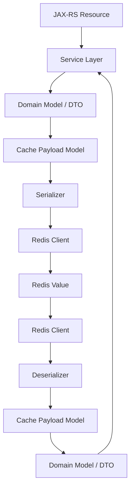

# Part 008 — Serialization and Data Compatibility

> Redis stores bytes, strings, and structured values. Your Java service gives those bytes meaning. Most Redis cache incidents are not caused by `GET` and `SET`; they are caused by unclear payload contracts, schema drift, unsafe deserialization, rolling deployment incompatibility, and bad assumptions about time, nulls, enums, money, and versioning.

This part explains how to design Redis payloads that survive real enterprise backend evolution.

---

## 1. Core Idea

A Redis value is not just data.

It is a contract between:

- the writer service version;
- the reader service version;
- the Redis key naming scheme;
- the TTL policy;
- the serialization library;
- the deployment strategy;
- the fallback behavior;
- the source of truth;
- the debugging tools;
- the security/privacy model.

Bad mental model:

```text
We just cache the Java object as JSON.
```

Better mental model:

```text
We store a versioned cache payload with stable field names, explicit date/money format,
tolerant readers, bounded size, safe deserialization behavior, defined TTL, and a clear
fallback policy when the payload is missing, stale, incompatible, or corrupt.
```

Senior review rule:

> Redis serialization must be reviewed like an external API contract, because rolling deployments create multiple readers and writers at the same time.

---

## 2. Where Serialization Happens



Important boundaries:

- Domain model should not always be stored directly.
- API response DTO should not always be stored directly.
- Cache payload should often be a separate stable contract.
- Serializer config must be consistent across service versions.
- Deserializer behavior must be safe for older/newer payloads.

---

## 3. Redis Value Shapes

Common Redis value shapes:

| Shape | Example | Strength | Risk |
|---|---|---|---|
| Plain string | `"ACTIVE"` | Simple, debuggable | Limited structure |
| JSON string | `{ "id": "q1", "status": "DRAFT" }` | Human-readable, flexible | Schema drift, size, parsing cost |
| Binary payload | Protobuf/Avro/custom bytes | Compact, faster for large payloads | Harder debugging, compatibility discipline required |
| Redis Hash | `HSET quote:q1 status DRAFT total 100.00` | Partial field access | Field TTL limitation, schema spread |
| Compressed JSON | gzip/zstd bytes | Lower memory/network for large payloads | CPU cost, harder inspection |
| Numeric string | `42` | Atomic counters | Type confusion risk |
| Delimited string | `tenant|quote|status` | Compact | Fragile and hard to evolve |

No format is universally correct.

Choose based on:

- read/write pattern;
- payload size;
- compatibility needs;
- debugging needs;
- partial update needs;
- latency budget;
- memory budget;
- security/privacy risk;
- rolling deployment behavior.

---

## 4. Do Not Cache Arbitrary Java Objects Blindly

Avoid storing Java-native serialized objects unless there is a very strong reason.

Problematic examples:

- Java built-in serialization;
- framework-specific binary session serialization;
- class-name-dependent serialization;
- object graphs with lazy proxies;
- ORM entities;
- MyBatis result objects with incidental fields;
- polymorphic JSON with unsafe type metadata.

Risks:

- class rename breaks deserialization;
- package move breaks payload compatibility;
- serialVersionUID mismatch;
- security vulnerabilities from unsafe deserialization;
- large object graphs;
- hidden fields leak into Redis;
- rolling deployment failure;
- impossible manual debugging.

Prefer stable cache payload types:

```java
public record QuoteCachePayloadV1(
    String quoteId,
    String tenantId,
    String status,
    String currency,
    String totalAmount,
    String updatedAtIso,
    long version
) {}
```

The cache payload is intentionally smaller and more stable than the domain object.

---

## 5. JSON Serialization

JSON is common for Redis cache payloads because it is:

- human-readable;
- easy to inspect;
- language-neutral enough;
- supported by Jackson/JSON-B;
- flexible for optional fields;
- reasonable for moderate payload sizes.

But JSON is not automatically safe.

### 5.1 JSON Risks

- unknown fields may fail strict readers;
- missing fields may break assumptions;
- enum values may be unknown;
- numeric precision may be lost;
- dates may be inconsistent;
- null handling may differ;
- field rename breaks old readers;
- polymorphic typing may be unsafe;
- payload size may grow silently;
- compressed JSON may hide debugging signals.

### 5.2 JSON Reader Strategy

For cache payloads, readers should usually be tolerant:

- ignore unknown fields;
- support missing optional fields;
- default carefully;
- validate required fields;
- reject corrupt payloads safely;
- treat incompatible cache payload as miss when safe;
- emit metric for deserialization failure.

Example policy:

```text
If cache payload cannot deserialize:
- record metric cache_deserialization_error
- delete key or allow TTL expiry depending risk
- load from PostgreSQL if fallback allowed
- do not return HTTP 500 for optional read cache unless data cannot be recovered
```

For security/session/idempotency data, deserialization failure may need fail-closed behavior.

---

## 6. Jackson / JSON-B Integration

### 6.1 Jackson Considerations

Review Jackson configuration:

- unknown property handling;
- null inclusion;
- date/time module;
- BigDecimal handling;
- enum handling;
- polymorphic typing;
- visibility rules;
- property naming strategy;
- custom serializers/deserializers;
- default typing restrictions;
- ObjectMapper reuse/thread safety.

Dangerous pattern:

```java
objectMapper.activateDefaultTyping(...);
```

Default polymorphic typing can introduce security and compatibility risks if not tightly controlled.

Safer pattern:

- avoid polymorphic payloads for Redis cache;
- use explicit payload type/version;
- serialize stable DTO/record;
- restrict allowed types if polymorphism is unavoidable.

### 6.2 JSON-B Considerations

If using JSON-B/Jakarta JSON Binding:

- verify date/time behavior;
- verify null field behavior;
- verify custom adapters;
- verify property naming;
- verify compatibility between versions;
- verify framework defaults in runtime.

Internal verification matters because framework defaults differ.

---

## 7. Binary Serialization

Binary formats may be useful when:

- payloads are large;
- latency is tight;
- network bandwidth matters;
- data model is stable and well-defined;
- cross-language consumers exist;
- schema evolution is managed.

Common examples:

- Protobuf;
- Avro;
- MessagePack;
- CBOR;
- custom binary format.

### 7.1 Protobuf

Strengths:

- compact;
- fast;
- schema-driven;
- supports backward/forward compatibility if field numbers are managed;
- good for cross-language systems.

Risks:

- less human-readable in Redis CLI;
- schema discipline required;
- field number reuse is dangerous;
- default values can hide missing data;
- operational debugging needs decoding tools.

### 7.2 Avro Awareness

Avro may appear in Kafka-centric ecosystems.

If Redis stores Avro payloads:

- verify schema registry assumptions;
- verify reader/writer schema compatibility;
- verify whether schema ID is embedded;
- verify operational decode tooling;
- verify rolling deployment behavior.

### 7.3 Custom Binary

Custom binary formats require strong justification.

Review:

- version header;
- byte order;
- compatibility plan;
- decoder safety;
- observability tooling;
- fallback behavior;
- corruption handling.

---

## 8. Versioned Payloads

Versioning is a core Redis cache design tool.

There are two main versioning strategies:

### 8.1 Version in Key

```text
quote:v1:{tenantId}:{quoteId}
quote:v2:{tenantId}:{quoteId}
```

Benefits:

- clean separation;
- old and new payloads do not conflict;
- easy rollback if both versions supported;
- avoids deserializing incompatible data.

Costs:

- duplicate cache entries during migration;
- cache warmup required for new version;
- invalidation must know active versions;
- memory temporarily increases.

### 8.2 Version in Payload

```json
{
  "schemaVersion": 2,
  "quoteId": "Q-123",
  "status": "APPROVED"
}
```

Benefits:

- one key can contain evolving payload;
- readers can branch by version;
- useful for long-lived state.

Costs:

- reader complexity;
- old readers may fail on new payload;
- migrations may be needed;
- corrupt/missing version must be handled.

### 8.3 Combined Strategy

For critical or complex payloads, combine both:

```text
key: quote:v2:{tenantId}:{quoteId}
payload: { "schemaVersion": 2, ... }
```

This improves debugging and safety.

---

## 9. Backward and Forward Compatibility

### 9.1 Backward Compatibility

New code can read old payloads.

Required during rolling deployments because old cache entries may exist.

Example:

```json
// old payload
{
  "quoteId": "Q-123",
  "status": "DRAFT"
}
```

New code adds `pricingModel`:

```json
// new payload
{
  "quoteId": "Q-123",
  "status": "DRAFT",
  "pricingModel": "STANDARD"
}
```

New reader must handle missing `pricingModel`.

### 9.2 Forward Compatibility

Old code can tolerate new payloads.

Required during rollback or partial deployment.

Old reader should ignore unknown fields where safe.

### 9.3 Compatibility Rule

During rolling deployment:

```text
old writer + old reader
old writer + new reader
new writer + old reader
new writer + new reader
```

All combinations may happen unless deployment order prevents it.

Redis caches make this more likely because old payloads can outlive old pods.

---

## 10. Schema Drift

Schema drift happens when cached payload no longer matches code assumptions.

Causes:

- field rename;
- type change;
- enum change;
- date format change;
- money format change;
- nested structure change;
- class/package rename;
- serializer config change;
- library upgrade;
- different services sharing key with different payload assumptions.

Symptoms:

- deserialization exceptions;
- cache miss spikes;
- HTTP 500s;
- stale data;
- incorrect business decisions;
- rollback failure;
- difficult incident debugging.

Mitigation:

- version key/payload;
- use stable cache DTO;
- avoid storing domain entities;
- add compatibility tests;
- treat incompatible optional cache as miss;
- invalidate/warm cache during migration;
- document payload contracts.

---

## 11. Class Rename and Package Move Risk

This is especially dangerous with serializers that include Java class metadata.

Bad payload dependency:

```text
com.company.quote.domain.QuoteDetails
```

If the class moves:

```text
com.company.quote.model.QuoteDetails
```

Old cache entries may be unreadable.

Avoid class-name-dependent payloads for Redis unless:

- TTL is very short;
- failure is safely treated as miss;
- deployment compatibility is tested;
- security review approves the deserialization model.

Better:

```json
{
  "schemaVersion": 1,
  "quoteId": "Q-123",
  "status": "DRAFT"
}
```

The payload does not depend on Java package names.

---

## 12. Enum Evolution

Enums are common in CPQ/order systems:

- quote status;
- order status;
- product status;
- pricing mode;
- approval state;
- billing action;
- workflow state.

Risks:

- new enum value added;
- old reader cannot parse it;
- enum renamed;
- enum ordinal stored instead of name;
- external system uses different enum vocabulary;
- cache stores display label instead of stable code.

Never store enum ordinal in Redis payloads.

Bad:

```json
{ "status": 3 }
```

Better:

```json
{ "status": "APPROVED" }
```

Even better for long-lived contracts:

```json
{ "statusCode": "QUOTE_APPROVED" }
```

Reader policy:

- known value → map normally;
- unknown value → map to `UNKNOWN` or fail safely depending use case;
- never silently map unknown critical state to default approved/active behavior.

---

## 13. Null Handling

Nulls cause subtle bugs.

Questions:

- Does missing field mean unknown, false, empty, or not applicable?
- Does explicit null mean different from missing?
- Should null fields be serialized?
- Does deserializer default primitives to zero/false?
- Does old payload lack newly required fields?
- Does negative cache store null result?

Example risk:

```json
{
  "discountEligible": null
}
```

If Java maps this to primitive boolean `false`, behavior may change silently.

Prefer explicit modeling:

```java
public record QuoteEligibilityCachePayloadV1(
    String quoteId,
    EligibilityState eligibilityState
) {}

enum EligibilityState {
    ELIGIBLE,
    NOT_ELIGIBLE,
    UNKNOWN,
    NOT_EVALUATED
}
```

For negative cache, do not confuse:

```text
key missing → cache miss
key exists with negative payload → source says not found / no result
key exists with null due to bug → corrupt payload
```

---

## 14. Date and Time Format

Date/time bugs are common in Redis payloads.

Risks:

- local timezone stored accidentally;
- inconsistent format between services;
- epoch seconds vs milliseconds confusion;
- daylight saving assumptions;
- string parsing incompatibility;
- loss of precision;
- business date vs instant confusion.

Preferred formats:

- `Instant` as ISO-8601 UTC string for event/update timestamps;
- epoch milliseconds only if explicitly documented;
- local business dates as `YYYY-MM-DD` with business timezone context;
- avoid ambiguous local datetime without timezone.

Example:

```json
{
  "updatedAt": "2026-07-11T02:45:00Z",
  "effectiveDate": "2026-07-11",
  "businessTimezone": "Asia/Jakarta"
}
```

Review question:

> Is this timestamp an instant, a local business date, a deadline, a TTL input, or a display value?

TTL should usually be controlled by Redis expiry, not only by timestamp inside payload.

---

## 15. BigDecimal, Currency, and Precision

CPQ/order systems often involve money.

Never casually serialize money as floating-point numbers.

Bad:

```json
{
  "totalAmount": 1234.56
}
```

This may be parsed as floating point depending language/library.

Better:

```json
{
  "currency": "USD",
  "totalAmount": "1234.56"
}
```

Or integer minor units if business rules allow:

```json
{
  "currency": "USD",
  "totalMinorUnits": 123456
}
```

Review:

- currency included;
- scale defined;
- rounding mode defined;
- tax/discount precision preserved;
- no binary floating point for money;
- BigDecimal serialization consistent;
- source of truth remains PostgreSQL or pricing engine if Redis is cache.

---

## 16. Compression

Compression may reduce Redis memory and network transfer.

Useful when:

- payloads are large;
- repeated structures compress well;
- Redis memory is expensive;
- network bandwidth is bottleneck;
- CPU budget is available.

Risks:

- CPU overhead;
- harder debugging;
- harder CLI inspection;
- compressed tiny payloads can be larger;
- compression library/version compatibility;
- decompression bomb risk if untrusted input ever enters path;
- metrics may hide original payload size.

Recommended practice:

- compress only above size threshold;
- include encoding marker/version;
- measure CPU and latency;
- emit compressed and uncompressed size metrics;
- provide safe decode tooling for operations.

Example payload envelope:

```json
{
  "schemaVersion": 2,
  "encoding": "json+gzip",
  "payload": "<base64 or binary depending storage convention>"
}
```

For Redis string binary value, metadata may be in key version or a compact header.

---

## 17. Redis Hash vs JSON String

A common design question:

> Should this object be stored as a Redis Hash or a JSON string?

### 17.1 JSON String

Good when:

- object is read/written as a whole;
- payload versioning is important;
- debugging via JSON is useful;
- field-level atomic update is not needed;
- TTL applies to whole object;
- compatibility is managed in one DTO.

Risks:

- whole payload rewrite for one field;
- larger network transfer;
- parsing cost;
- no field-level server operations.

### 17.2 Redis Hash

Good when:

- fields are accessed independently;
- counters exist inside object;
- partial update matters;
- memory encoding is efficient for small hashes;
- operational inspection field-by-field is useful.

Risks:

- no simple native TTL per field;
- schema spread across fields;
- large hash risk;
- harder payload versioning;
- `HGETALL` on large hashes is dangerous;
- field names become long-lived contract.

### 17.3 Review Rule

If you always read/write the full object, prefer JSON string unless there is a strong reason for hash.

If you need atomic field operations, hash may be justified.

---

## 18. Payload Size Discipline

Large payloads create Redis problems:

- memory pressure;
- network amplification;
- serialization CPU cost;
- latency spikes;
- big key risk;
- failover/rewrite overhead;
- backup/snapshot cost;
- cluster slot hotspot.

Define payload size budgets.

Example:

```text
quote summary cache payload: < 10 KB target
catalog rule cache payload: < 100 KB target unless explicitly approved
session state payload: < 5 KB target
idempotency response cache: size limit required
```

For large data:

- cache summary, not full graph;
- split key by entity/subresource;
- store derived read model carefully;
- use PostgreSQL/object storage as source of truth;
- consider local cache for hot small data;
- avoid Redis for huge documents unless intentionally designed.

---

## 19. Deserialization Failure Policy

Every Redis reader needs a deserialization failure policy.

Possible policies:

| Use Case | Deserialization Failure Policy |
|---|---|
| Optional read cache | Treat as miss, record metric, optionally delete key |
| Negative cache | Treat carefully; corrupt negative cache can hide real data |
| Rate limiter | Usually fail according to limiter failure policy |
| Idempotency | Fail closed or recover from durable source if available |
| Session store | Fail closed or force re-authentication |
| Token blacklist | Fail closed for sensitive operation |
| Feature flag cache | Use safe default |
| Job queue payload | Move to poison/DLQ-like handling if possible |
| Stream event | Do not ack until policy is applied |

Bad pattern:

```java
catch (Exception e) {
    return null;
}
```

Better:

```text
catch deserialization error
→ classify use case
→ emit metric
→ log sanitized key pattern and schema version if available
→ apply policy: miss, delete, fail closed, DLQ, or safe default
```

---

## 20. Serialization and Cache Correctness

Serialization bugs can become correctness bugs.

Examples:

### 20.1 Missing Field Defaults to Unsafe Value

```text
old payload lacks approvalRequired
new code defaults approvalRequired=false
→ approval may be skipped incorrectly
```

Mitigation:

- required fields validated;
- missing critical field causes cache miss or fail-safe;
- default values reviewed.

### 20.2 Unknown Enum Treated as Active

```text
new status SUSPENDED introduced
old code maps unknown to ACTIVE
→ invalid operation allowed
```

Mitigation:

- unknown maps to UNKNOWN;
- fail-safe for security/workflow states.

### 20.3 Date Parsed in Local Time

```text
expiry timestamp parsed in server local timezone
→ token/session/config valid longer or shorter than intended
```

Mitigation:

- UTC instant;
- explicit timezone;
- tests across timezone.

### 20.4 Money Rounded Differently

```text
cached quote total rounded differently from source calculation
→ customer sees inconsistent price
```

Mitigation:

- store money as string or minor units;
- include currency;
- source-of-truth recalculation for final commit.

---

## 21. Serialization and PostgreSQL/MyBatis

Redis cache payload often originates from PostgreSQL rows loaded through MyBatis/JDBC.

Risks:

- MyBatis result map changes but cache payload version does not;
- DB column type changes;
- nullable column becomes non-null or vice versa;
- enum mapping changes;
- timestamp type changes;
- BigDecimal scale changes;
- migration changes semantics but old cache survives;
- read model cache not invalidated after migration.

Review questions:

- Is cache payload derived from DB schema directly or mapped through stable DTO?
- Does DB migration require cache namespace bump?
- Is cache invalidated after data migration?
- Does rolling deployment read both old and new DB/cache shapes?
- Is MyBatis mapping tested with cache serialization?

Recommended pattern:

```text
PostgreSQL row / MyBatis model
→ domain mapping
→ explicit cache payload Vn
→ serializer
→ Redis
```

Do not let DB row shape leak directly into Redis without an intentional contract.

---

## 22. Serialization and Kafka/RabbitMQ

Redis payloads may be related to messaging payloads.

Patterns:

- Kafka event updates Redis projection;
- RabbitMQ job payload contains key to cached data;
- Redis stores idempotency result for message consumer;
- Redis Stream entry uses JSON/binary event payload;
- Pub/Sub message contains lightweight invalidation notification.

Compatibility issues:

- event schema evolves but Redis projection schema does not;
- consumer writes new cache shape before all readers are upgraded;
- replayed old event overwrites new cache shape;
- duplicate/out-of-order event causes stale payload;
- DLQ replay uses obsolete serializer;
- Redis Stream pending entry survives deployment and is consumed by newer code.

Mitigation:

- version event schema and cache schema separately;
- include event version and projection version;
- use monotonic source version/update timestamp;
- ignore stale events;
- test replay compatibility;
- document projection rebuild strategy.

---

## 23. Kubernetes and Rolling Deployment Compatibility

Kubernetes rolling deployments create mixed versions.

Example:

```text
Pod A: old version writes quote:v1 payload
Pod B: new version writes quote:v1 payload with changed field semantics
Pod C: old version reads new payload
Pod D: new version reads old payload
```

This can happen for minutes or longer.

Rules:

- never change cache payload incompatibly without version bump;
- ensure new readers can read old payloads;
- ensure old readers can tolerate new payloads if using same key version;
- coordinate cache invalidation when necessary;
- prefer additive changes;
- avoid deleting fields that old code needs until old pods are gone and old cache expires;
- consider TTL duration when planning rollout.

TTL matters:

```text
If TTL is 24 hours, old payloads can survive long after deployment finishes.
```

Deployment compatibility must consider cache lifetime, not only pod rollout time.

---

## 24. Security and Privacy in Serialization

Redis values may contain sensitive data.

Risks:

- PII stored unnecessarily;
- secrets/tokens stored in plaintext;
- serialized object includes hidden sensitive fields;
- debug logs print payload;
- dump/snapshot contains sensitive data;
- broad ACL allows many services to read sensitive keys;
- payload compression/encryption not understood by operators;
- retention exceeds privacy requirement.

Review:

- Does payload contain PII?
- Is the data necessary for the use case?
- Is TTL aligned with retention requirement?
- Should value be encrypted at application layer?
- Are logs redacted?
- Are Redis ACL key patterns restricted?
- Are backup/snapshot controls adequate?
- Can support tooling decode payload safely without leaking secrets?

Avoid storing full API responses if they include fields not needed for cache use.

---

## 25. Serialization Performance

Serialization cost can dominate Redis latency for large or complex payloads.

Measure:

- serialization time;
- deserialization time;
- payload size;
- compressed size;
- allocation rate;
- GC pressure;
- Redis command latency;
- network transfer time;
- end-to-end request latency.

Common performance problems:

- serializing huge object graphs;
- repeated ObjectMapper creation;
- reflection-heavy serialization under high QPS;
- compression for tiny payloads;
- deserializing payload only to use one field;
- storing large collections in one key;
- unnecessary cache set on every read;
- double serialization between layers.

Optimization options:

- reuse serializer instances;
- use stable DTOs;
- reduce payload fields;
- split large payloads;
- use Redis hash for field-level access if justified;
- use binary format for hot/large payloads;
- batch/pipeline when appropriate;
- apply compression threshold.

Do not optimize serialization format before defining correctness and compatibility.

---

## 26. Payload Envelope Pattern

For complex payloads, use an envelope.

Example JSON envelope:

```json
{
  "schemaVersion": 1,
  "payloadType": "QuoteSummary",
  "createdAt": "2026-07-11T02:45:00Z",
  "sourceVersion": 817263,
  "encoding": "json",
  "data": {
    "quoteId": "Q-123",
    "tenantId": "T-9",
    "status": "DRAFT",
    "currency": "USD",
    "totalAmount": "1234.56"
  }
}
```

Benefits:

- easier debugging;
- schema version visible;
- source version supports stale event protection;
- encoding can evolve;
- createdAt helps incident investigation;
- payload type helps detect wrong-key/wrong-reader bugs.

Costs:

- larger payload;
- more boilerplate;
- may be overkill for simple counters/tokens.

Use envelope where compatibility and operations matter.

---

## 27. Corrupt Payload Handling

Corrupt payloads happen.

Causes:

- partial manual write;
- bug in serializer;
- wrong service writes wrong value to key;
- deployment mismatch;
- compression/decompression issue;
- binary format mismatch;
- operator debugging command;
- test data leaked into shared environment.

Response policy:

```text
1. Detect deserialization failure.
2. Emit metric with cache/use-case name.
3. Log sanitized key pattern, schema version if readable, and exception category.
4. Decide: treat as miss, delete key, quarantine, fail closed, or DLQ.
5. Protect source of truth and customer correctness.
6. Investigate writer identity and deployment version.
```

For optional cache, deleting corrupt key may be acceptable.

For idempotency/session/security/job payloads, deletion may be dangerous.

---

## 28. Version Migration Strategies

### 28.1 Lazy Migration

Reader reads old payload and writes new version on access.

Good when:

- data is frequently accessed;
- migration can happen gradually;
- old payload can be interpreted safely.

Risk:

- rarely accessed keys remain old;
- concurrent migration races;
- reader complexity.

### 28.2 Namespace Bump

Change key prefix/version.

```text
old: quote:v1:{tenant}:{id}
new: quote:v2:{tenant}:{id}
```

Good when:

- old payload incompatible;
- cache can be rebuilt on demand;
- duplicate memory is acceptable temporarily.

Risk:

- cold cache after deployment;
- DB load spike;
- invalidation must handle both versions during transition.

### 28.3 Bulk Invalidation

Delete old key family.

Good when:

- payload is invalid after migration;
- cache can be safely rebuilt;
- production-safe key deletion tooling exists.

Risk:

- Redis/DB load spike;
- accidental deletion;
- unsafe `KEYS` usage;
- tenant-wide customer impact.

### 28.4 Offline Rebuild

Background job rebuilds cache.

Good when:

- cold cache is expensive;
- data set is known;
- rebuild can be throttled.

Risk:

- stale source data;
- job failure;
- memory pressure;
- coordination with deployment.

---

## 29. Testing Serialization Compatibility

Minimum tests:

- serialize current payload and deserialize it;
- deserialize old fixture payloads;
- deserialize payload with unknown fields;
- deserialize payload with missing optional fields;
- fail safely on missing required fields;
- handle unknown enum values safely;
- verify date/time format;
- verify BigDecimal/currency precision;
- verify compressed payload threshold;
- verify corrupt payload policy;
- verify rolling deployment compatibility.

Fixture strategy:

```text
src/test/resources/redis-payloads/quote-summary-v1.json
src/test/resources/redis-payloads/quote-summary-v2.json
src/test/resources/redis-payloads/quote-summary-v1-unknown-field.json
src/test/resources/redis-payloads/quote-summary-corrupt.json
```

Do not rely only on generated current-code roundtrip tests.

Roundtrip tests prove current writer and current reader agree. They do not prove compatibility with old data.

---

## 30. Review Checklist

Before approving Redis serialization changes:

- [ ] Payload type is explicit.
- [ ] Source of truth is clear.
- [ ] Cache payload is separate from domain entity when needed.
- [ ] Key version and/or payload version exists.
- [ ] Unknown fields behavior is defined.
- [ ] Missing fields behavior is defined.
- [ ] Required fields are validated.
- [ ] Enum evolution is safe.
- [ ] Date/time format is explicit.
- [ ] Money/currency precision is safe.
- [ ] Null semantics are explicit.
- [ ] Payload size is bounded or monitored.
- [ ] Compression is justified and measured if used.
- [ ] Deserialization failure policy is use-case-specific.
- [ ] Rolling deployment compatibility is tested.
- [ ] DB migration/cache compatibility is reviewed.
- [ ] Kafka/RabbitMQ event compatibility is reviewed if relevant.
- [ ] Security/privacy review is complete.
- [ ] Debugging/decode tooling exists for non-human-readable payloads.

---

## 31. Internal Verification Checklist

Use this checklist against the internal CSG/team codebase and runtime.

### 31.1 Serializer Configuration

- Identify serializer library: Jackson, JSON-B, Protobuf, Avro, custom, framework abstraction.
- Check ObjectMapper/serializer centralization.
- Check unknown field behavior.
- Check null behavior.
- Check date/time module/config.
- Check BigDecimal handling.
- Check enum handling.
- Check polymorphic typing usage.
- Check binary/compression usage.

### 31.2 Payload Contracts

- Identify Redis payload DTOs.
- Check whether domain entities are cached directly.
- Check whether payloads are versioned.
- Check whether key namespace version matches payload version.
- Check schema documentation.
- Check compatibility fixtures.
- Check payload size budgets.

### 31.3 Cache Correctness

- Check deserialization failure behavior per cache.
- Check whether corrupt optional cache is treated as miss.
- Check whether security/session/idempotency payload failure is fail-safe.
- Check negative cache payload representation.
- Check stale payload handling.

### 31.4 PostgreSQL/MyBatis

- Check DB-to-cache mapping layer.
- Check impact of DB migrations on Redis cache.
- Check MyBatis result map changes.
- Check invalidation after migration.
- Check BigDecimal/date mapping consistency.

### 31.5 Kafka/RabbitMQ/Streams

- Check whether event consumers write Redis payloads.
- Check event schema vs cache schema versioning.
- Check duplicate/out-of-order event handling.
- Check replay compatibility.
- Check Redis Stream payload compatibility across deployments.

### 31.6 Operations

- Check whether operators can inspect/decode payloads safely.
- Check logs for raw payload leaks.
- Check metrics for serialization/deserialization errors.
- Check alerts for deserialization error spike.
- Check runbook for corrupt cache payload.

### 31.7 Security and Privacy

- Check PII in Redis values.
- Check token/session payload protection.
- Check backup/snapshot sensitivity.
- Check ACL key pattern isolation.
- Check payload retention vs TTL.
- Check redaction in logs and debugging tools.

---

## 32. Anti-Patterns

### 32.1 Caching ORM/MyBatis Entities Directly

Problem:

- persistence model leaks into cache contract;
- schema changes break Redis;
- lazy fields/proxies may serialize unexpectedly;
- payload too large.

### 32.2 No Versioning

Problem:

- incompatible deployments collide;
- old cache survives longer than expected;
- rollback breaks.

### 32.3 Enum Ordinals

Problem:

- enum reorder changes meaning;
- impossible to debug safely.

### 32.4 Floating Point Money

Problem:

- precision loss;
- inconsistent quote/order totals.

### 32.5 Silent Deserialization Failure

Problem:

- hides corruption;
- causes confusing misses;
- masks deployment incompatibility.

### 32.6 Raw PII in Payload Without Review

Problem:

- privacy/compliance exposure;
- backup/snapshot risk;
- broader blast radius.

### 32.7 Compression Everywhere

Problem:

- CPU overhead;
- unreadable values;
- worse performance for small payloads.

---

## 33. Practical Design Template

For each Redis payload, document:

```text
Payload name:
Redis key pattern:
Redis data type:
Source of truth:
Writer service(s):
Reader service(s):
Schema version:
Serialization format:
Compression:
TTL:
Max expected size:
Required fields:
Optional fields:
Enum handling:
Date/time format:
Money format:
Null handling:
Deserialization failure policy:
Backward compatibility rule:
Forward compatibility rule:
Migration strategy:
Security/privacy classification:
Operational decode method:
Metrics:
Owner:
```

This template prevents Redis payloads from becoming undocumented distributed contracts.

---

## 34. Key Takeaways

Serialization is part of Redis architecture.

The essential lessons:

- Redis values are distributed contracts.
- Do not cache arbitrary Java objects blindly.
- Stable cache payload DTOs are safer than domain entities.
- JSON is debuggable but still needs schema discipline.
- Binary formats need decode tooling and compatibility management.
- Version keys or payloads before incompatible changes.
- Rolling deployments require old/new reader/writer compatibility.
- Enum, null, date/time, and money handling must be explicit.
- Deserialization failure policy depends on Redis use case.
- Serialization bugs can become correctness, security, or production incidents.

The next part moves from payload contracts into Redis cache fundamentals: hit/miss lifecycle, invalidation, stale data, local vs distributed cache, negative cache, and cache correctness.
