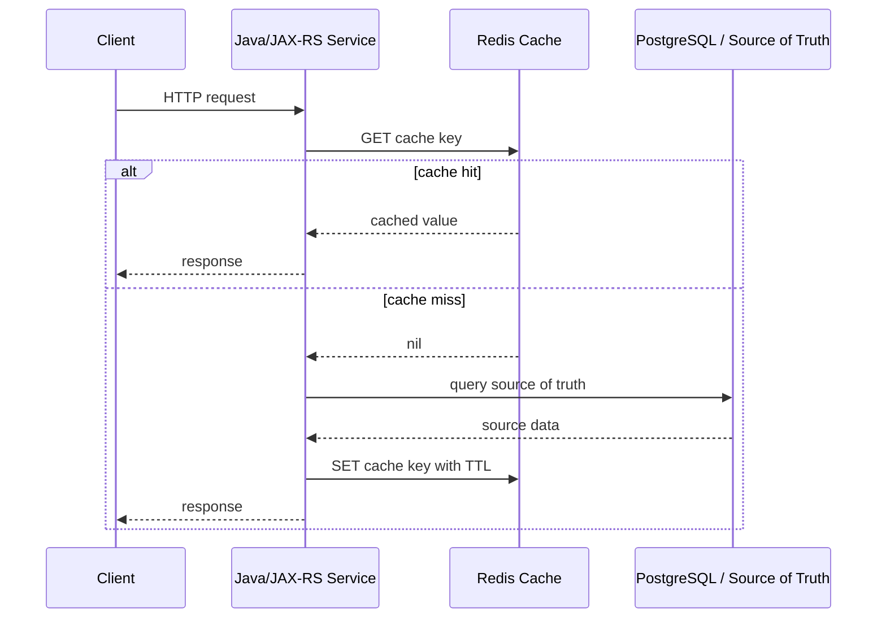
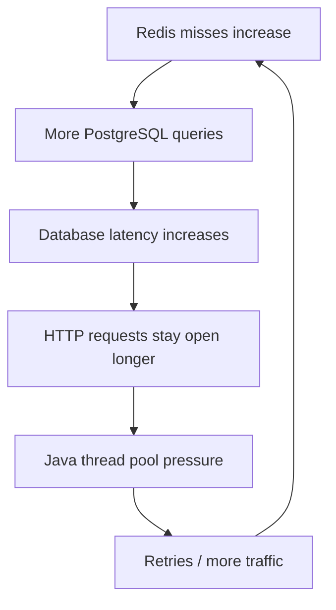
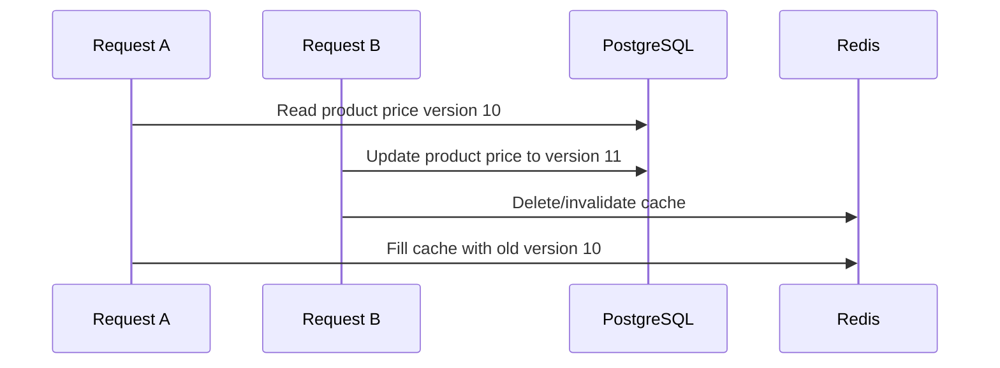
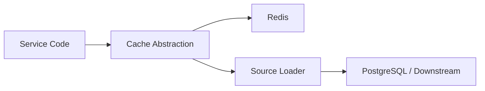
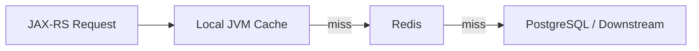
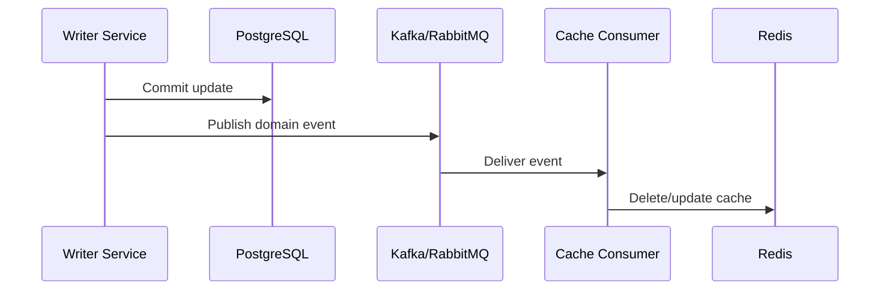

# Part 009 — Cache Fundamentals

> A cache is not a smaller database. A cache is a performance optimization that deliberately allows another copy of data to exist outside the source of truth. That second copy improves latency and protects downstream systems, but it also creates correctness, invalidation, observability, and operational risk.

This part builds the core mental model for Redis as a cache in enterprise Java/JAX-RS systems. The goal is not to memorize cache pattern names. The goal is to reason about lifecycle, freshness, ownership, failure behavior, and production review questions.

---

## 1. Core Idea

A cache exists because the system has a mismatch between demand and the cost of producing data.

Typical reasons:

- PostgreSQL query is expensive;
- MyBatis/JDBC query joins too many tables;
- catalog/rule/config lookup is repeated frequently;
- downstream service call is slow;
- derived read model is expensive to calculate;
- repeated quote/order validation uses stable input;
- authorization/session/security state needs fast lookup;
- external dependency needs protection from traffic spikes.

But every cache introduces a second question:

> What happens when the cached value is wrong, stale, missing, duplicated, partially updated, evicted, serialized with an old schema, or refreshed concurrently by many requests?

A senior engineer reviews cache design by asking two things at the same time:

1. Does this cache reduce latency or load enough to justify its existence?
2. Can the system tolerate the correctness and failure behavior introduced by this cache?

---

## 2. Basic Cache Lifecycle

The simplest cache lifecycle is:



This lifecycle contains several hidden design decisions:

| Decision | Why it matters |
|---|---|
| Key design | Controls ownership, tenant isolation, cardinality, and invalidation. |
| TTL | Defines maximum stale window if invalidation does not happen. |
| Serialization | Controls compatibility during deployment and rollback. |
| Miss behavior | Determines database load during cold start or Redis eviction. |
| Fill behavior | Determines race conditions and cache stampede risk. |
| Error handling | Determines whether Redis failure breaks the API or is bypassed. |
| Observability | Determines whether the team can see hit ratio, miss spikes, stale data, and Redis latency. |

The dangerous assumption is treating Redis cache access as equivalent to reading a Java `Map`.

It is not.

Redis cache access is a distributed dependency with network, timeout, failure, concurrency, and security behavior.

---

## 3. Cache Hit

A cache hit means the requested key exists and the service accepts the cached payload as valid.

Example:

```text
GET quote:tenant:t-001:quote:q-789:v3
```

A hit is useful only if the value is still semantically acceptable.

A technically successful Redis `GET` may still be wrong if:

- the value belongs to the wrong tenant;
- the payload was serialized by an incompatible version;
- the underlying PostgreSQL row has changed;
- the cache key omitted a relevant version/dimension;
- the key was reused for a different meaning;
- the value contains sensitive data that should have expired;
- the cache was populated before a database transaction committed;
- the cache was not invalidated after a catalog/rule update.

Senior review rule:

> Cache hit is not equal to correctness. Cache hit only means Redis returned something.

### Hit Path Review Questions

- Is the key unique enough for tenant, entity, version, locale, price list, currency, and authorization context if relevant?
- Is the cached value safe to return for the requester?
- Is the TTL aligned with business freshness requirements?
- Is there a way to detect stale or incompatible payloads?
- Is the hit counted in metrics with useful dimensions?

---

## 4. Cache Miss

A cache miss means Redis does not have the value or the service intentionally treats the value as unusable.

Common causes:

- key never existed;
- key expired;
- key was evicted due to memory pressure;
- key was manually invalidated;
- key changed because key version changed;
- Redis failover lost recent writes;
- cache was flushed;
- service constructed the wrong key;
- tenant/environment prefix changed;
- serialization/version guard rejected the value.

A cache miss is not always bad. Misses are necessary for freshness and recovery.

The risk is uncontrolled miss amplification:



Cache miss behavior must be designed as a load-bearing path, not as an exception.

### Miss Path Review Questions

- How expensive is the source-of-truth load?
- Can many requests miss the same key concurrently?
- Is there single-flight or request coalescing?
- Is there database backpressure?
- Is negative caching needed for not-found results?
- Is miss rate observable per key family/use case?

---

## 5. Cache Fill

Cache fill is the operation that writes data into Redis after a miss or refresh.

Example:

```text
SET quote:tenant:t-001:quote:q-789:v3 <payload> EX 300
```

Cache fill has correctness concerns:

- was the source data committed before fill?
- does the payload match current schema?
- is the TTL correct?
- should the value be compressed?
- should the fill be skipped if another request already filled it?
- should a stale value remain if fill fails?
- can a slower request overwrite fresher data?

Bad fill behavior can create stale cache even when invalidation logic is correct.

Example race:



Mitigations include:

- versioned cache keys;
- payload version field;
- compare version before fill;
- write-through strategy for selected cases;
- short TTL;
- event-driven invalidation after write commit;
- avoiding long source loads before fill.

---

## 6. Cache Expiry

Expiry is time-based removal from Redis.

TTL answers:

> How long may this cached value exist without being refreshed?

Expiry does not answer:

> Is the value still correct right now?

TTL is a maximum stale window when invalidation is absent or fails. It is not a complete consistency mechanism.

### TTL Design Dimensions

| Dimension | Question |
|---|---|
| Business freshness | How stale may this value be? |
| Recompute cost | How expensive is reload? |
| Data volatility | How often does source data change? |
| Failure tolerance | What if invalidation fails? |
| Security/privacy | How long may sensitive data remain? |
| Stampede risk | Will many keys expire together? |
| Memory pressure | Can the key family grow unbounded? |

### TTL Examples

| Use case | Possible TTL shape | Reasoning |
|---|---:|---|
| Product/catalog metadata | minutes to hours | Often read-heavy; invalidation may also exist. |
| Quote calculation result | short minutes | Business rules/pricing may change; correctness matters. |
| Idempotency result | hours to days | Must cover retry window. |
| Login attempt counter | minutes | Security window. |
| Negative cache for missing entity | seconds to minutes | Prevent DB hammering but avoid hiding newly-created data. |
| Feature flag/config cache | seconds to minutes | Must balance availability and config freshness. |

Do not copy these values blindly. TTL must be verified against business behavior, data volatility, and internal production requirements.

---

## 7. Cache Invalidation

Invalidation removes or makes cached data obsolete before TTL expiry.

Invalidation exists because TTL alone is usually too blunt for mutable business data.

Common invalidation triggers:

- database write completes;
- domain event is published;
- Kafka/RabbitMQ event is consumed;
- admin changes catalog/config/rules;
- deployment changes serialization/schema/version;
- tenant-level reset is requested;
- manual operation during incident;
- data migration completes.

Invalidation strategies:

| Strategy | Description | Risk |
|---|---|---|
| TTL-only | Let data expire naturally. | Stale window may be too long. |
| Write-path delete | Delete cache after DB commit. | Delete can fail after commit. |
| Write-path update | Update cache after DB commit. | Cache may become source-of-truth-like. |
| Event-driven invalidation | Broker event triggers cache delete/update. | Duplicate, out-of-order, lag, consumer failure. |
| Versioned key | New version produces new key. | Old keys consume memory until expiry. |
| Manual flush | Operator deletes key family. | Dangerous if too broad. |

Senior review rule:

> Invalidation is not a single Redis command. It is a distributed consistency workflow.

---

## 8. Cache Aside

Cache-aside is the most common application-managed pattern.

Read path:

1. Application checks Redis.
2. On hit, return cached value.
3. On miss, query PostgreSQL/downstream.
4. Store result in Redis with TTL.
5. Return response.

Write path usually does one of these:

- update DB, then delete cache;
- update DB, then update cache;
- update DB, then publish invalidation event;
- update DB, use versioned key so old cache is naturally ignored.

Cache-aside is simple, but the application owns all edge cases.

Main risks:

- stale data after write;
- race between DB commit and cache fill;
- stampede on miss;
- Redis failure during fill/delete;
- inconsistent invalidation across services;
- duplicated cache logic in many code paths.

Part 010 focuses entirely on cache-aside.

---

## 9. Read-Through Cache

In read-through, application asks a cache abstraction for data. The cache abstraction loads from source on miss.

Conceptual flow:



Benefits:

- service code is cleaner;
- miss/fill behavior can be standardized;
- metrics/fallback can be centralized;
- cache key construction can be isolated.

Risks:

- hidden source-of-truth call inside cache abstraction;
- difficult transaction boundary reasoning;
- loader may be called under unexpected concurrency;
- generic abstraction may hide business-specific correctness concerns;
- difficult to express invalidation rules.

Senior review rule:

> Read-through abstraction is useful only if it does not hide correctness decisions that should be explicit.

---

## 10. Write-Through Cache

In write-through, application writes data to the cache as part of the write flow.

Typical shape:

```text
Update PostgreSQL -> update Redis cache -> return success
```

or through an abstraction:

```text
Write cache abstraction -> writes DB and cache
```

Benefits:

- cache may remain warm after writes;
- reads after write can be fast;
- fewer misses after updates.

Risks:

- transaction mismatch between DB and Redis;
- DB write succeeds but Redis write fails;
- Redis write succeeds but DB commit fails;
- cache payload may not exactly match source-of-truth state;
- multi-service writers may update cache inconsistently.

Write-through is dangerous when treated as transactional with PostgreSQL. Redis and PostgreSQL do not share a normal ACID transaction boundary.

Use write-through only when the failure behavior is explicitly designed.

---

## 11. Write-Behind Cache

Write-behind means the application writes to cache first, and the source of truth is updated asynchronously later.

This is usually not appropriate for critical enterprise order/quote state unless there is a carefully designed durable write-behind system.

Why it is risky:

- Redis may lose data depending on persistence/failover;
- async writer may fail;
- ordering can break;
- retries can duplicate writes;
- data may be acknowledged before it is durable in PostgreSQL;
- compliance/audit may require DB-first persistence.

Write-behind can be useful for telemetry-like or derived data where loss is acceptable. It should not be casually used for order lifecycle, financial, billing, entitlement, or customer-impacting source-of-truth changes.

Senior review rule:

> If Redis write-behind acknowledges business success before PostgreSQL commit, treat it as an architecture decision requiring explicit durability and recovery design.

---

## 12. Refresh-Ahead Cache

Refresh-ahead reloads data before it expires.

Goal:

- avoid cold miss latency;
- avoid stampede at expiry;
- keep hot data warm;
- protect PostgreSQL from burst reload.

Common mechanisms:

- background scheduler refreshes hot keys;
- probabilistic early refresh near TTL expiry;
- async refresh triggered by read path;
- stale-while-revalidate pattern.

Risk:

- refreshing unused keys wastes capacity;
- refresh job can overload DB;
- refresh failure may silently increase stale risk;
- refresh logic may race with invalidation;
- refresh scheduler may need distributed lock/leader election.

Refresh-ahead is useful for predictable hot key families, such as frequently read configuration, catalog metadata, or tenant feature config.

---

## 13. Local Cache vs Distributed Cache

Local cache exists inside the Java process. Distributed cache exists outside the process, usually Redis.

| Aspect | Local Cache | Redis Distributed Cache |
|---|---|---|
| Latency | Very low | Low but networked |
| Scope | Single JVM/pod | Shared across services/pods |
| Consistency | Hard across replicas | Easier shared state, still stale risk |
| Failure | Dies with process | External dependency |
| Memory | Per pod duplication | Centralized memory |
| Invalidation | Hard cross-pod | Centralized but still needs design |
| Operational risk | App memory pressure | Redis memory/latency/failover |

Local cache is useful for extremely hot, small, low-risk data. Redis is useful when shared cache state is required.

Combining both creates multi-level cache.

---

## 14. Multi-Level Cache

Multi-level cache often looks like:



Benefits:

- avoids network call for hot data;
- reduces Redis load;
- improves p99 latency.

Risks:

- local cache can be stale even after Redis invalidation;
- local cache duplicates memory per pod;
- rolling deployments may run multiple serialization versions;
- invalidation must handle local and Redis layers;
- debugging becomes harder because value may come from multiple places.

Multi-level cache is powerful but should be reserved for hot, stable data with clear invalidation strategy.

### Multi-Level Cache Review Questions

- Which layer owns TTL?
- Is local TTL shorter than Redis TTL?
- How is local cache invalidated across pods?
- Can stale local values violate business correctness?
- Are metrics separated by local hit, Redis hit, and source load?

---

## 15. Negative Caching

Negative caching stores a not-found or invalid result.

Example:

```text
quote:tenant:t-001:quote:q-404:not-found -> true, TTL 30 seconds
```

Benefits:

- protects DB from repeated lookup for missing data;
- reduces repeated validation cost;
- helps during brute-force or bad-client behavior.

Risks:

- newly created data may remain hidden until negative cache expires;
- not-found response may depend on authorization context;
- negative result may leak existence semantics;
- long TTL can create confusing stale behavior;
- must distinguish between not-found, forbidden, and source failure.

Senior review rule:

> Never cache an error response as if it were a true not-found result unless the failure semantics are explicit.

Do not negative-cache transient PostgreSQL or downstream errors unless intentionally implementing backoff/circuit-break behavior.

---

## 16. Stale Cache

A stale cache value is a value that was once valid but no longer reflects source-of-truth state.

Staleness is not always a bug. Some systems intentionally tolerate staleness for performance or availability.

The important question is:

> Is stale data bounded, visible, and acceptable for this use case?

Examples:

| Data | Stale tolerance |
|---|---|
| Static reference label | Often high |
| Tenant configuration | Low to medium depending on config |
| Product catalog | Depends on business rule and pricing sensitivity |
| Quote price | Often low |
| Order state | Very low |
| Security token revocation | Very low |
| Rate limit counter | Approximation may be acceptable |

Stale cache becomes dangerous when the business assumes fresh data but the system silently serves old data.

---

## 17. Cache Consistency Models

Cache consistency is usually weaker than database consistency.

Common models:

| Model | Meaning |
|---|---|
| Best-effort cache | Cache may be stale or missing; source is authoritative. |
| TTL-bounded staleness | Cache can be stale until TTL expires. |
| Eventual invalidation | Events eventually delete/update stale entries. |
| Versioned cache | Reads select cache based on source version. |
| Read-your-write | Same user/session should see own update quickly. |
| Strong consistency | Usually not realistic with Redis cache + PostgreSQL without special design. |

Do not claim strong consistency unless the design proves it under:

- concurrent requests;
- DB commit/rollback;
- Redis write/delete failure;
- event loss/duplication/out-of-order delivery;
- failover;
- retry;
- rolling deployment;
- clock skew;
- process crash.

---

## 18. Cache and PostgreSQL/MyBatis/JDBC

Redis cache usually sits above PostgreSQL.

The critical boundary is the database transaction.

Bad pattern:

```text
Delete cache -> update DB -> commit DB
```

Risk: another request can read old DB state and repopulate cache before commit.

Often safer pattern:

```text
Update DB -> commit DB -> delete cache
```

Risk: DB commit succeeds, cache delete fails. TTL/eventual invalidation must bound the stale window.

With MyBatis/JDBC, review:

- where transaction starts and commits;
- whether cache update/delete happens inside or after transaction;
- whether exception handling rolls back DB but still writes cache;
- whether multiple tables contribute to one cached view;
- whether query parameters are fully represented in the cache key;
- whether migration changes require key versioning or invalidation.

---

## 19. Cache and Kafka/RabbitMQ

Messaging is often used for event-driven invalidation or projection updates.

Example:



This introduces messaging failure modes:

- event published before DB commit;
- event publish fails after DB commit;
- consumer lags;
- duplicate event;
- out-of-order event;
- poison event;
- Redis unavailable during invalidation;
- consumer updates wrong key version;
- replay rebuilds stale data.

Use version fields, idempotent event handlers, and observable lag where possible.

---

## 20. Cache Failure Behavior

Redis can fail in many ways:

- unavailable;
- slow;
- timeout;
- connection pool exhausted;
- authentication failure;
- TLS error;
- failover in progress;
- cluster redirection issue;
- memory pressure;
- eviction spike;
- serialization failure;
- command rejected;
- network partition.

For each cache use case, define behavior:

| Use case | Redis failure behavior |
|---|---|
| Optional read cache | Bypass Redis and load from DB if DB can tolerate load. |
| Expensive DB protection cache | Fail open may overload DB; need backpressure. |
| Security token blacklist | Fail open may be unsafe; fail closed may cause outage. |
| Rate limiter | Fail open improves availability; fail closed protects backend but hurts users. |
| Idempotency store | Failure may allow duplicate processing. |
| Distributed lock | Failure may break coordination. |

Senior review rule:

> "Redis is only cache" is not a sufficient failure policy. Some Redis-backed features are correctness or security critical.

---

## 21. Cache Observability

At minimum, observe cache behavior by key family/use case.

Important metrics:

- hit count;
- miss count;
- hit ratio;
- load latency from source;
- Redis command latency;
- Redis timeout count;
- Redis error count;
- serialization/deserialization error count;
- cache fill count;
- cache delete/invalidation count;
- negative cache hit count;
- stale fallback count;
- Redis evicted keys;
- Redis expired keys;
- memory usage;
- slowlog;
- key cardinality if safely measured.

Bad metric:

```text
redis_get_total
```

Better metric:

```text
cache_requests_total{cache="quote-summary", result="hit"}
cache_requests_total{cache="quote-summary", result="miss"}
cache_load_duration_ms{cache="quote-summary", source="postgresql"}
cache_errors_total{cache="quote-summary", operation="deserialize"}
```

Avoid high-cardinality labels such as raw tenant ID, raw key, quote ID, order ID, or user ID.

---

## 22. Cache Correctness Checklist

For every cache, answer:

- What is the source of truth?
- What exact data is cached?
- What query/input dimensions are represented in the key?
- What tenant/security dimensions are represented?
- What is the TTL?
- What is the invalidation trigger?
- What is the maximum stale window?
- Can stale data cause business harm?
- What happens if Redis is unavailable?
- What happens if Redis is slow?
- What happens if DB is slow during cache miss?
- What happens during deployment when payload schema changes?
- What happens during failover?
- Is negative caching used?
- Is cache fill concurrency-safe enough?
- Is stampede protection needed?
- Are metrics and alerts present?

---

## 23. Java/JAX-RS Implementation Boundary

A clean Java/JAX-RS service should avoid spreading raw Redis commands across resource classes.

Weak structure:

```java
@Path("/quotes")
public class QuoteResource {
    @Inject RedisClient redis;

    @GET
    @Path("/{id}")
    public Response getQuote(@PathParam("id") String id) {
        String raw = redis.get("quote:" + id);
        // cache, serialization, source load, and fallback mixed here
        return Response.ok(raw).build();
    }
}
```

Better structure:

```java
@Path("/quotes")
public class QuoteResource {
    private final QuoteQueryService quoteQueryService;

    @GET
    @Path("/{id}")
    public Response getQuote(@PathParam("id") String id) {
        QuoteView view = quoteQueryService.getQuoteView(id);
        return Response.ok(view).build();
    }
}
```

Then isolate Redis in a cache component:

```java
public interface QuoteViewCache {
    Optional<QuoteView> get(QuoteCacheKey key);
    void put(QuoteCacheKey key, QuoteView value, Duration ttl);
    void invalidate(QuoteCacheKey key);
}
```

Benefits:

- key construction is centralized;
- TTL policy is reviewable;
- serialization is isolated;
- metrics are standardized;
- Redis fallback is explicit;
- tests can target cache behavior.

---

## 24. Cache Anti-Patterns

### Anti-Pattern 1: Cache Key Missing Business Dimensions

Example:

```text
price:product:123
```

But price depends on:

- tenant;
- currency;
- price list;
- contract;
- effective date;
- region;
- product version;
- promotion rule.

Missing dimensions create wrong cache hits.

### Anti-Pattern 2: No TTL

A cache key without TTL can become permanent stale data or memory leak.

### Anti-Pattern 3: Cache-as-Truth

If Redis is treated as the authoritative state without durability, audit, backup, and recovery design, correctness risk increases sharply.

### Anti-Pattern 4: Caching Authorization-Sensitive Response Without Security Context

If cached response depends on user permissions, the key must include the relevant authorization dimension or the cached object must be filtered after retrieval.

### Anti-Pattern 5: Catch-All Redis Exception and Return Empty Data

Returning empty result on Redis failure hides infrastructure incidents as business data.

### Anti-Pattern 6: `KEYS` for Invalidation

Using `KEYS prefix:*` in production can block Redis and create outage. Use explicit key tracking, versioned keys, sets/indexes with caution, or safe scan tooling.

---

## 25. CPQ / Quote & Order Context

In CPQ and quote/order systems, cache correctness can directly affect business outcomes.

Typical cache candidates:

- catalog metadata;
- product compatibility rules;
- pricing configuration;
- tenant configuration;
- feature flags;
- reference data;
- quote summary read model;
- rate limiter state;
- idempotency result;
- session/security token state.

High-risk cache candidates:

- final price calculation result without versioned inputs;
- order lifecycle state;
- entitlement/permission decision;
- token revocation state;
- inventory/availability if freshness matters;
- data involved in audit or billing.

Review cache decisions against:

- correctness impact;
- stale data tolerance;
- regulatory/audit requirement;
- replay/rebuild ability;
- source-of-truth boundary;
- tenant isolation;
- failure behavior.

---

## 26. Internal Verification Checklist

Use this checklist in the internal CSG/team environment. Do not assume any internal detail without verification.

### Codebase

- Identify Redis wrapper/facade classes.
- List cache key families.
- Find raw Redis calls outside cache components.
- Check if key naming is centralized.
- Check if TTL constants are centralized and documented.
- Check if cache serialization is versioned.
- Check if Redis exceptions are mapped correctly.

### Cache Policy

- For each cache, identify source of truth.
- Verify TTL and stale tolerance.
- Verify invalidation trigger.
- Verify negative caching usage.
- Verify stampede protection.
- Verify cache warmup strategy if any.

### PostgreSQL/MyBatis/JDBC

- Verify transaction boundary around cache updates/deletes.
- Check whether cache fill occurs after committed read.
- Check whether write paths invalidate cache after commit.
- Check whether migrations require cache version bump.
- Check whether query parameters map fully to cache key.

### Kafka/RabbitMQ

- Verify event-driven invalidation consumers.
- Check duplicate and out-of-order event handling.
- Check invalidation lag metrics.
- Check replay/rebuild behavior.
- Check failure handling when Redis is down during event processing.

### Kubernetes / Cloud / On-Prem

- Verify Redis endpoint and deployment mode.
- Check client timeout and connection pool per pod.
- Check network policy/security group/firewall.
- Check observability dashboard and alerting.
- Check failover/runbook ownership.

### Security / Privacy

- Check PII in keys and values.
- Check sensitive response caching.
- Check token/session cache TTL.
- Check ACL/TLS/network isolation.
- Check snapshot/backup privacy if Redis persists data.

---

## 27. PR Review Checklist

When reviewing a PR that introduces or changes cache usage, ask:

### Design

- What is being cached?
- Why is Redis needed?
- What is the source of truth?
- What is the allowed stale window?
- Is Redis optional or correctness-critical?

### Key

- Is the key deterministic?
- Does it include tenant/environment/service/entity/version?
- Does it include all relevant query dimensions?
- Does it avoid PII?
- Is cardinality bounded?

### TTL / Invalidation

- Does every ephemeral cache key have TTL?
- Is TTL justified?
- Is invalidation explicit?
- What happens if invalidation fails?
- Is TTL jitter needed?

### Correctness

- Can stale data cause wrong pricing, quote, order, permission, or security decision?
- Can concurrent misses overwrite fresher data?
- Is negative caching safe?
- Is serialization compatible across versions?

### Failure

- What happens when Redis is unavailable?
- What happens when Redis is slow?
- What happens when source DB is slow during miss?
- Are timeouts bounded?
- Are retries controlled?

### Observability

- Are hit/miss/error metrics present?
- Are source load latency metrics present?
- Are invalidation failures visible?
- Are logs safe and non-sensitive?
- Are alerts needed?

---

## 28. Mental Model Summary

A cache is a controlled duplicate of source data.

Good Redis cache design requires:

- clear source-of-truth boundary;
- precise key design;
- explicit TTL;
- explicit invalidation;
- safe serialization;
- bounded stale window;
- safe miss behavior;
- stampede protection when needed;
- clear Redis failure policy;
- production observability;
- privacy/security review;
- PR checklist discipline.

The simplest cache implementation may be only five lines of code. The production behavior is not simple.

Senior engineer framing:

> Cache improves performance by weakening the immediate relationship between read and source of truth. Your job is to make that weakening explicit, bounded, observable, and acceptable.
