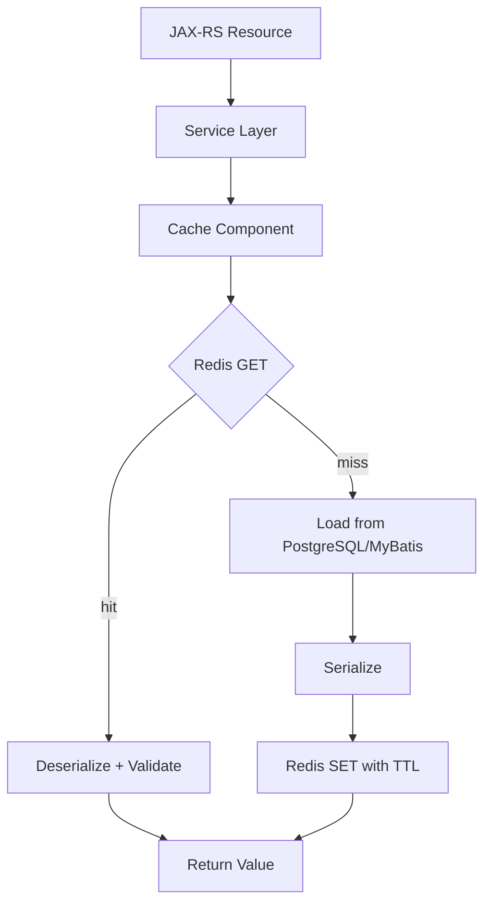
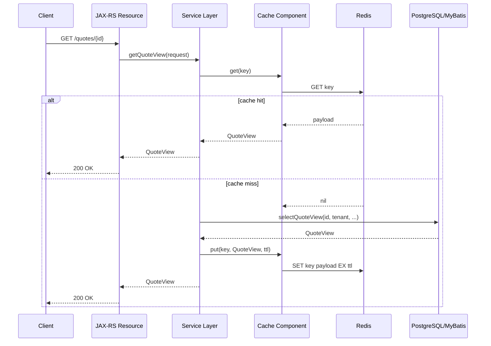
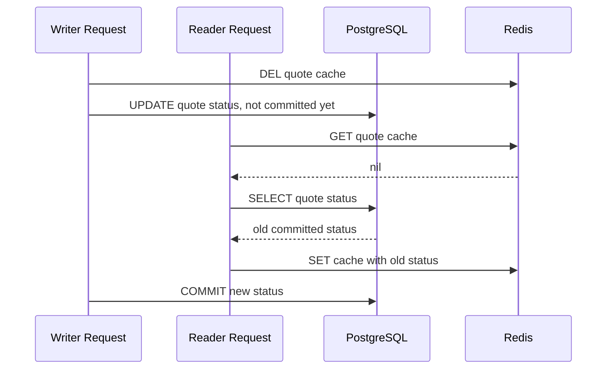
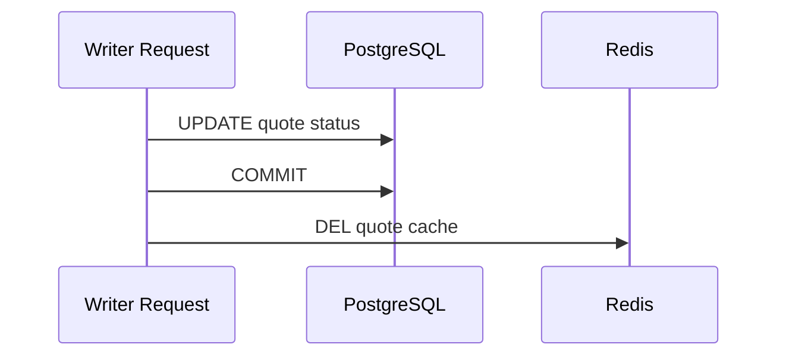
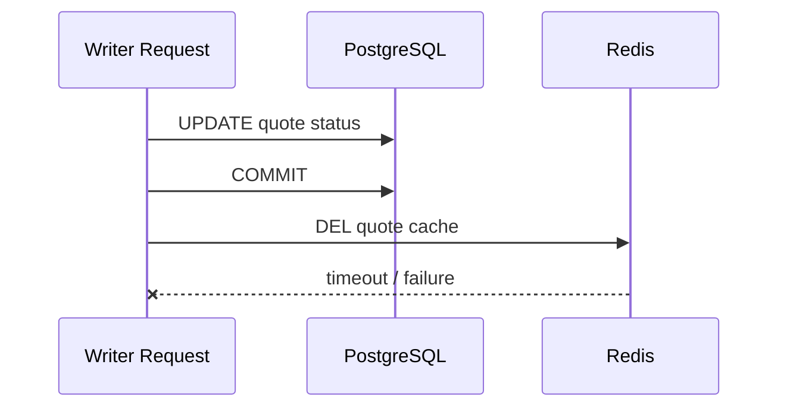
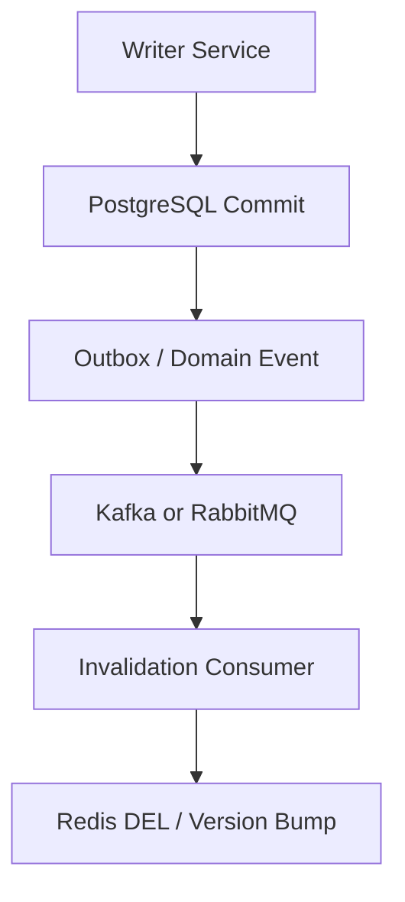
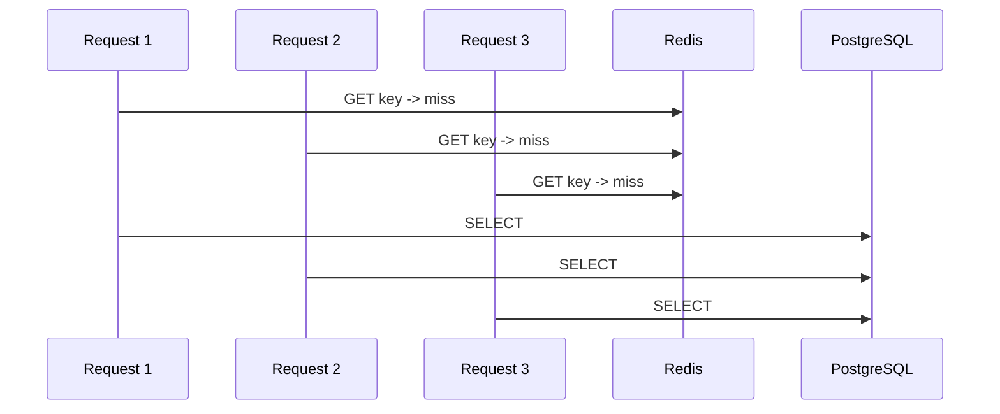
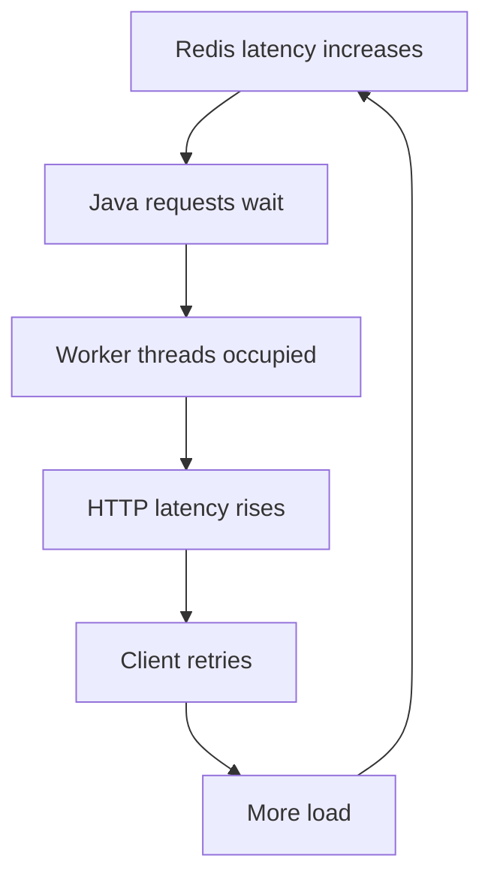

# Part 010 — Cache-Aside Pattern

> Cache-aside is simple enough to implement in one method and dangerous enough to create stale data, database overload, tenant leaks, cache stampede, and deployment incompatibility if the lifecycle is not explicit.

This part focuses on cache-aside in enterprise Java/JAX-RS systems backed by PostgreSQL/MyBatis/JDBC and Redis. Cache-aside is usually the first Redis caching pattern engineers implement, so it deserves a precise production mental model.

---

## 1. Core Idea

Cache-aside means the application is responsible for reading from Redis, loading from the source of truth on miss, filling Redis, and invalidating Redis when source data changes.

Redis does not automatically know where the data came from. PostgreSQL does not automatically know Redis contains a copy. Kafka/RabbitMQ does not automatically guarantee cache invalidation correctness.

The application owns the workflow.



Senior review rule:

> In cache-aside, correctness is not provided by Redis. Correctness is provided by application discipline around key design, transaction boundary, TTL, invalidation, and failure behavior.

---

## 2. Cache-Aside Read Lifecycle

A good cache-aside read path has these steps:

1. Build cache key from complete input dimensions.
2. Try Redis `GET` or structure-specific read.
3. If hit, deserialize and validate payload.
4. If payload is valid, return cached value.
5. If miss or invalid payload, load from source of truth.
6. Serialize result.
7. Write to Redis with TTL.
8. Return result.
9. Emit metrics for hit/miss/fill/error/source latency.

Mermaid view:



The read path must be designed for both hit and miss. A cache miss is a normal condition, not an exception.

---

## 3. Cache Key Construction

Cache-aside is only correct when the key represents the real identity of the cached value.

Weak key:

```text
quote:123
```

Better key shape:

```text
prod:quote-service:tenant:t-001:quote-view:v3:quote:q-123:currency:USD
```

The right dimensions depend on the use case, but common dimensions include:

- environment;
- service;
- tenant;
- entity type;
- entity ID;
- projection/view name;
- schema version;
- locale;
- currency;
- effective date;
- catalog version;
- price list;
- user/security scope if response differs by authorization.

A missing key dimension creates a false hit.

False hit means Redis returns a value for the key, but the value belongs to a different logical request.

That is often worse than a miss.

---

## 4. Java/JAX-RS Boundary

Avoid putting cache-aside directly in the JAX-RS resource.

Bad shape:

```java
@GET
@Path("/{quoteId}")
public Response getQuote(@PathParam("quoteId") String quoteId) {
    String key = "quote:" + quoteId;
    String cached = redis.get(key);
    if (cached != null) {
        return Response.ok(cached).build();
    }

    QuoteView view = mapper.selectQuoteView(quoteId);
    redis.setex(key, 300, objectMapper.writeValueAsString(view));
    return Response.ok(view).build();
}
```

Problems:

- key is incomplete;
- tenant/security context is missing;
- serialization is mixed into resource;
- TTL is magic number;
- Redis errors are not handled;
- PostgreSQL load path is not instrumented;
- response type may differ between hit and miss;
- cache policy is not reusable or reviewable.

Better shape:

```java
@Path("/quotes")
public class QuoteResource {
    private final QuoteQueryService quoteQueryService;

    @GET
    @Path("/{quoteId}")
    public Response getQuote(
            @PathParam("quoteId") String quoteId,
            @HeaderParam("X-Tenant-Id") String tenantId) {

        QuoteView view = quoteQueryService.getQuoteView(
                new QuoteViewRequest(tenantId, quoteId));

        return Response.ok(view).build();
    }
}
```

Cache-aside belongs below the resource boundary:

```java
public final class QuoteQueryService {
    private final QuoteViewCache cache;
    private final QuoteMapper quoteMapper;

    public QuoteView getQuoteView(QuoteViewRequest request) {
        QuoteCacheKey key = QuoteCacheKey.from(request);

        return cache.get(key)
                .orElseGet(() -> loadAndCache(key, request));
    }

    private QuoteView loadAndCache(QuoteCacheKey key, QuoteViewRequest request) {
        QuoteView view = quoteMapper.selectQuoteView(
                request.tenantId(),
                request.quoteId());

        cache.put(key, view);
        return view;
    }
}
```

This is still simplified. Production code must handle Redis failure, DB failure, negative caching, metrics, and concurrency.

---

## 5. Cache Component Contract

A cache component should make policy explicit.

Example interface:

```java
public interface CacheAsideStore<K, V> {
    Optional<V> get(K key);
    void put(K key, V value, Duration ttl);
    void invalidate(K key);
}
```

Better domain-specific interface:

```java
public interface QuoteViewCache {
    Optional<QuoteView> get(QuoteCacheKey key);
    void put(QuoteCacheKey key, QuoteView view);
    void invalidate(QuoteCacheKey key);
}
```

Domain-specific cache interface is often better because:

- TTL can be encoded per use case;
- serialization format is known;
- metrics can use cache name;
- key type prevents raw string mistakes;
- validation can be use-case specific;
- security/privacy review is easier.

Generic cache wrappers are useful for infrastructure reuse, but domain cache components are useful for correctness.

---

## 6. Cache Miss Load

The source load is usually PostgreSQL through MyBatis/JDBC.

Example:

```java
private QuoteView loadFromSource(QuoteViewRequest request) {
    return quoteMapper.selectQuoteView(
            request.tenantId(),
            request.quoteId(),
            request.currency());
}
```

Review source load carefully:

- Is the query indexed?
- Does it include tenant filter?
- Does it match cache key dimensions?
- Does it depend on current time?
- Does it depend on user permissions?
- Does it join tables that update independently?
- Does it return deterministic data for the same key?
- What happens if source returns not-found?
- What happens if source times out?

If source load is expensive, cache miss can become a production risk.

Cache-aside must protect the source of truth from miss storms.

---

## 7. Cache Fill

Cache fill writes the source result to Redis.

Example:

```java
public void put(QuoteCacheKey key, QuoteView view) {
    String redisKey = key.toRedisKey();
    String payload = serializer.serialize(view);
    redis.setex(redisKey, ttlSeconds, payload);
}
```

Production fill considerations:

- always use TTL unless explicitly persistent;
- include schema/payload version;
- avoid caching partial or unauthorized response;
- avoid caching transient failure response as normal result;
- avoid filling cache before DB transaction commits;
- consider compression only when payload size justifies CPU cost;
- handle Redis write failure without hiding source response incorrectly;
- emit fill metrics.

Important distinction:

- Redis write failure after DB read usually should not fail read-only API if cache is optional.
- Redis write failure for idempotency/session/security state may be critical.

Cache-aside read cache is often optional. Redis-backed correctness features are not.

---

## 8. TTL in Cache-Aside

TTL is the safety net for missed invalidation.

Without TTL, stale data can persist indefinitely.

Cache-aside TTL must align with:

- data volatility;
- business freshness requirement;
- invalidation reliability;
- cache stampede risk;
- Redis memory pressure;
- privacy retention;
- deployment compatibility.

Example TTL configuration style:

```java
public final class CacheTtlPolicy {
    public static final Duration QUOTE_VIEW = Duration.ofMinutes(5);
    public static final Duration CATALOG_RULE = Duration.ofMinutes(15);
    public static final Duration NEGATIVE_QUOTE_LOOKUP = Duration.ofSeconds(30);

    private CacheTtlPolicy() {}
}
```

Avoid scattering TTL magic numbers across the codebase.

Bad:

```java
redis.setex(key, 300, payload);
```

Better:

```java
redis.setex(key, CacheTtlPolicy.QUOTE_VIEW.toSeconds(), payload);
```

Even better: make TTL part of the cache component and document why it exists.

---

## 9. Cache Invalidation in Cache-Aside

The common write path is:

```text
Update PostgreSQL -> commit -> delete Redis key
```

Why delete instead of update?

Because delete forces the next read to reload from source of truth. This is usually simpler and safer than attempting to reconstruct the exact cached projection on the write path.

Example:

```java
@Transactional
public void updateQuoteStatus(UpdateQuoteStatusCommand command) {
    quoteMapper.updateStatus(
            command.tenantId(),
            command.quoteId(),
            command.newStatus());

    // This exact placement depends on transaction framework.
    // The safer intent is: invalidate after successful commit.
    afterCommit(() -> quoteViewCache.invalidate(
            QuoteCacheKey.forQuote(command.tenantId(), command.quoteId())));
}
```

The important part is `afterCommit`.

If cache is deleted before DB commit, another request can repopulate Redis with old DB state.

---

## 10. The Dangerous Delete-Before-Commit Race

Bad sequence:



Result: Redis now contains old status after the database has new status.

TTL may eventually fix it, but users may see stale data until then.

Safer sequence:



This is not perfect either. Cache delete can fail after commit. But it avoids repopulating old data before commit.

---

## 11. Delete-After-Commit Failure

Safer does not mean perfect.

Failure sequence:



Result: PostgreSQL has new state, Redis may still have old state.

Mitigations:

- short enough TTL;
- retry invalidation;
- publish invalidation event after commit;
- versioned cache key;
- outbox pattern for invalidation event;
- manual runbook for targeted invalidation;
- alert on invalidation failure;
- make stale window explicit.

Do not pretend cache-aside delete-after-commit gives strong consistency.

It gives a practical eventual consistency model with bounded stale risk if TTL and invalidation are designed well.

---

## 12. Cache Update vs Cache Delete

After DB write, you can update or delete Redis.

| Strategy | Pros | Cons |
|---|---|---|
| Delete cache | Simple; next read reloads canonical state. | Next read pays miss cost; delete can fail. |
| Update cache | Keeps cache warm; read-after-write can be fast. | Easy to write wrong projection; transaction mismatch. |
| Versioned key | Avoids deleting old keys immediately. | More memory; version propagation needed. |
| Event invalidation | Decouples writer from cache. | Lag, duplicates, out-of-order, consumer failure. |

In enterprise systems, delete-after-commit is often the safest default for mutable read models.

Use update-cache when:

- the write path has the full canonical new projection;
- failure behavior is understood;
- partial updates cannot corrupt the cached view;
- multiple writers are coordinated;
- metrics and retries exist.

---

## 13. Cache-Aside with MyBatis/JDBC Transaction Boundary

With MyBatis/JDBC, transaction management may be handled by:

- container-managed transaction;
- Spring `@Transactional` if used;
- manual JDBC transaction;
- framework-specific unit of work;
- application service transaction wrapper.

The Redis invalidation timing must be aligned with commit.

Bad pattern:

```java
public void updateQuote(UpdateQuoteCommand command) {
    sqlSession.update("updateQuote", command);
    quoteCache.invalidate(key); // may happen before commit
    sqlSession.commit();
}
```

Better intent:

```java
public void updateQuote(UpdateQuoteCommand command) {
    try {
        sqlSession.update("updateQuote", command);
        sqlSession.commit();
        quoteCache.invalidate(key);
    } catch (Exception e) {
        sqlSession.rollback();
        throw e;
    }
}
```

But even this is simplified because:

- commit can succeed and process can crash before invalidation;
- invalidation can fail after commit;
- multiple cache keys may depend on the same write;
- event/outbox may be better for reliable invalidation.

For important invalidation, consider transactional outbox:

```text
DB transaction:
  update business row
  insert cache invalidation event into outbox table
commit

Outbox publisher:
  publish invalidation event to Kafka/RabbitMQ

Consumer:
  delete/update Redis key
```

This makes invalidation retryable and observable.

---

## 14. Cache-Aside with Event-Driven Invalidation

Event-driven invalidation extends cache-aside with messaging.



Benefits:

- writer does not need to know every cache key in every service;
- invalidation can be retried;
- consumers can rebuild projections;
- cross-service cache coherence improves.

Risks:

- invalidation lag;
- duplicate events;
- out-of-order events;
- consumer failure;
- poison messages;
- incorrect key derivation;
- event published without complete dimensions;
- Redis unavailable during event handling.

Event-driven invalidation needs idempotent consumers.

Example event handler logic:

```java
public void onQuoteUpdated(QuoteUpdatedEvent event) {
    QuoteCacheKey key = QuoteCacheKey.forQuote(
            event.tenantId(),
            event.quoteId(),
            event.projectionVersion());

    quoteViewCache.invalidate(key);
}
```

For out-of-order risk, consider versioned payloads or versioned keys.

---

## 15. Versioned Cache Keys

Versioned keys avoid some invalidation complexity by making new reads use a different key.

Example:

```text
catalog:tenant:t-001:rules:v42
catalog:tenant:t-001:rules:v43
```

When catalog version changes, service reads `v43`. Old `v42` eventually expires.

Benefits:

- no need to delete every old key immediately;
- avoids stale hits if version selection is correct;
- useful for catalog/rules/config.

Risks:

- version source must be reliable;
- old keys consume memory until TTL;
- version must be included everywhere;
- multi-entity dependencies can be complex;
- version lookup itself may need caching.

Versioned keys are especially useful when invalidating broad key families would require unsafe scanning.

---

## 16. Double Load Problem

When many requests miss the same key at the same time, each request may load from PostgreSQL.



This is the double-load or many-load problem.

Mitigations:

- local in-process single-flight;
- distributed lock around reload;
- stale-while-revalidate;
- probabilistic early refresh;
- request coalescing;
- rate-limited reload;
- DB query timeout and bulkhead.

Do not use distributed lock blindly. For many cache cases, duplicate load is acceptable. For expensive hot keys, duplicate load can become a database incident.

---

## 17. Single-Flight Cache Load

Single-flight means only one request loads a missing key while others wait or use stale value.

Local single-flight works inside one JVM/pod:

```java
public QuoteView getQuoteView(QuoteViewRequest request) {
    QuoteCacheKey key = QuoteCacheKey.from(request);

    Optional<QuoteView> cached = cache.get(key);
    if (cached.isPresent()) {
        return cached.get();
    }

    return singleFlight.execute(key.toRedisKey(), () -> {
        Optional<QuoteView> secondCheck = cache.get(key);
        if (secondCheck.isPresent()) {
            return secondCheck.get();
        }

        QuoteView loaded = loadFromSource(request);
        cache.put(key, loaded);
        return loaded;
    });
}
```

The second cache check matters. Another request may have filled the cache while this request waited.

Distributed single-flight can use Redis lock, but then lock correctness, lease expiry, and fallback behavior must be reviewed.

---

## 18. Stale-While-Revalidate

Stale-while-revalidate allows serving a stale value while refreshing asynchronously.

Concept:

- cached payload has soft expiry and hard expiry;
- before soft expiry: serve normally;
- after soft expiry but before hard expiry: serve stale and trigger refresh;
- after hard expiry: force reload or fail depending on policy.

Payload shape:

```json
{
  "schemaVersion": 3,
  "loadedAt": "2026-07-11T02:00:00Z",
  "softExpiresAt": "2026-07-11T02:05:00Z",
  "hardExpiresAt": "2026-07-11T02:15:00Z",
  "data": { }
}
```

Benefits:

- reduces user-facing latency;
- protects DB during refresh;
- smooths hot key expiry.

Risks:

- stale data is intentionally served;
- background refresh needs observability;
- hard expiry must be enforced;
- async refresh must not overload DB;
- not suitable for low-staleness business data.

---

## 19. Negative Cache in Cache-Aside

Cache-aside often needs negative caching for not-found results.

Example:

```java
Optional<QuoteView> view = quoteMapper.findQuoteView(tenantId, quoteId);
if (view.isEmpty()) {
    negativeCache.put(key, NegativeCacheValue.NOT_FOUND, Duration.ofSeconds(30));
    throw new NotFoundException();
}
```

Rules:

- keep TTL short;
- distinguish not-found from DB failure;
- include tenant/security context;
- avoid caching authorization failure unless semantics are clear;
- invalidate negative cache when entity is created;
- track negative hit metrics.

Bad behavior:

```text
DB timeout -> cache NOT_FOUND -> users see fake 404 for 5 minutes
```

Never convert source failure into negative cache unless intentionally implementing a protective failure policy.

---

## 20. Serialization Compatibility

Cache-aside makes serialization part of read path correctness.

During rolling deployment:

- version A writes payload;
- version B reads payload;
- version B may fail deserialization;
- version B may interpret missing fields incorrectly;
- rollback may reintroduce old reader.

Mitigations:

- include schema version;
- use tolerant readers;
- avoid Java native serialization;
- avoid class-name-dependent payloads;
- handle unknown enum values;
- use explicit date/time format;
- preserve BigDecimal/currency precision;
- delete or ignore incompatible payloads;
- version key when schema changes significantly.

Example defensive get:

```java
public Optional<QuoteView> get(QuoteCacheKey key) {
    try {
        return redis.get(key.toRedisKey())
                .flatMap(serializer::deserializeQuoteView);
    } catch (CacheDeserializationException e) {
        metrics.increment("cache.deserialize.error", key.cacheName());
        redis.del(key.toRedisKey());
        return Optional.empty();
    }
}
```

Deleting incompatible payload can be acceptable if the source load path is safe.

---

## 21. Redis Failure During Cache-Aside Read

If Redis `GET` fails on optional read cache, common behavior is bypass:

```java
public QuoteView getQuoteView(QuoteViewRequest request) {
    QuoteCacheKey key = QuoteCacheKey.from(request);

    try {
        Optional<QuoteView> cached = cache.get(key);
        if (cached.isPresent()) {
            return cached.get();
        }
    } catch (RedisUnavailableException e) {
        metrics.increment("cache.bypass", key.cacheName());
        // Continue to source if safe.
    }

    QuoteView loaded = loadFromSource(request);

    try {
        cache.put(key, loaded);
    } catch (RedisUnavailableException e) {
        metrics.increment("cache.fill.failed", key.cacheName());
        // Usually do not fail read-only response for optional cache.
    }

    return loaded;
}
```

But bypass is not always safe.

If Redis protects PostgreSQL from huge traffic, bypass can overload DB.

Possible policies:

| Policy | Behavior | Use when |
|---|---|---|
| Fail open | Ignore Redis failure and load DB. | DB can tolerate traffic. |
| Fail closed | Return error when Redis unavailable. | Cache is correctness/security critical. |
| Degrade | Return partial/stale/default response. | Business accepts degraded data. |
| Backpressure | Limit DB load during Redis outage. | Miss storm could harm DB. |
| Circuit break | Temporarily stop Redis attempts. | Redis is slow/unavailable and causing latency. |

---

## 22. Redis Slow Scenario

Redis slow is often worse than Redis down.

When Redis is down, failures may happen quickly. When Redis is slow, request threads can pile up.

Failure chain:



Mitigations:

- strict Redis command timeout;
- small bounded connection pool;
- circuit breaker;
- bulkhead for Redis calls;
- fallback policy;
- avoid unbounded retries;
- separate timeout from HTTP request deadline;
- monitor Redis latency and client-side wait time.

Do not configure Redis timeout longer than the useful remaining HTTP request time.

---

## 23. Cache-Aside and Authorization

Never cache a response that depends on user permission unless the permission dimension is handled.

Example risky cache:

```text
quote-view:tenant:t-001:quote:q-123
```

If user A can see fields that user B cannot, and both use the same key, user B may receive unauthorized data.

Options:

1. Cache only authorization-neutral data and filter per request.
2. Include permission scope/role/view variant in key.
3. Avoid caching personalized response.
4. Cache per-user only if cardinality and privacy are acceptable.

Authorization-sensitive caches require security review.

---

## 24. Cache-Aside and Multi-Tenancy

Tenant must usually be part of key design.

Bad:

```text
catalog:product:p-100
```

Better:

```text
catalog:tenant:t-001:product:p-100:v5
```

Multi-tenant concerns:

- key must include tenant if data differs by tenant;
- avoid tenant leakage in logs if tenant ID is sensitive;
- avoid PII in key;
- define tenant-wide invalidation strategy;
- ensure admin/global data is intentionally global;
- separate environment prefix to avoid cross-environment mistakes;
- review backup/snapshot access for multi-tenant data.

A tenant leak through cache is a severe correctness and security failure.

---

## 25. Cache-Aside and Deployment

Deployment changes can break cache-aside.

Examples:

- new version expects new field;
- old version cannot read new enum;
- key format changes;
- TTL policy changes;
- invalidation event schema changes;
- cache projection changes;
- new service version and old service version run simultaneously.

Deployment-safe strategies:

- version keys;
- version payload schema;
- support old and new payload temporarily;
- deploy reader compatibility before writer change;
- avoid destructive key migration during peak traffic;
- add temporary dual-read/dual-write only with cleanup plan;
- monitor deserialization errors;
- use targeted invalidation after deployment if needed.

Rolling deployment means both old and new code may interact with the same Redis keyspace.

---

## 26. Cache Warming

Cache warming pre-populates Redis before traffic hits.

Use cases:

- hot catalog/config data;
- tenant metadata;
- reference data;
- expensive read models;
- post-deployment cold-start protection.

Risks:

- warms unused data;
- overloads PostgreSQL during startup;
- duplicates work across pods;
- loads stale data before migrations complete;
- missing tenant/version dimensions;
- hides normal cache miss behavior until incident.

If warming is used, coordinate it:

- run once per deployment/environment;
- rate limit source loads;
- include versioned keys;
- emit metrics;
- fail safely;
- avoid every pod warming the same keys simultaneously.

---

## 27. Cache-Aside Observability

Minimum metrics:

```text
cache_requests_total{cache="quote-view", result="hit"}
cache_requests_total{cache="quote-view", result="miss"}
cache_requests_total{cache="quote-view", result="deserialize_error"}
cache_fill_total{cache="quote-view", result="success"}
cache_fill_total{cache="quote-view", result="failure"}
cache_invalidation_total{cache="quote-view", result="success"}
cache_invalidation_total{cache="quote-view", result="failure"}
cache_source_load_duration_ms{cache="quote-view", source="postgresql"}
cache_redis_duration_ms{cache="quote-view", operation="get"}
```

Useful logs:

- cache deserialization failure with cache name, schema version, not raw payload;
- invalidation failure with key family, not PII;
- Redis timeout with operation and cache name;
- source load failure separately from Redis failure.

Avoid logging raw Redis key if it contains sensitive IDs. Avoid logging cached value.

---

## 28. Production Failure Modes

### Failure Mode 1: Stale Read After Update

Cause:

- cache invalidation failed;
- delete happened before DB commit;
- event invalidation lagged;
- version key not updated.

Detection:

- user reports old data;
- DB value differs from Redis payload;
- invalidation failure metric;
- event lag.

Mitigation:

- after-commit invalidation;
- TTL bound;
- event retry/outbox;
- targeted key delete;
- versioned key.

### Failure Mode 2: Database Spike After Cache Flush

Cause:

- broad cache flush;
- Redis restart;
- eviction spike;
- deployment changed key prefix;
- cache warming absent.

Detection:

- hit ratio drops;
- DB CPU/query latency increases;
- Redis miss metrics spike.

Mitigation:

- gradual warming;
- stampede protection;
- DB backpressure;
- avoid broad flush;
- TTL jitter.

### Failure Mode 3: Wrong Tenant Data

Cause:

- tenant missing from key;
- reused key prefix;
- bad request context propagation;
- serialization object contains cross-tenant data.

Detection:

- severe user report;
- audit/security finding;
- cache key review.

Mitigation:

- include tenant in key;
- centralize key builder;
- add tests;
- avoid caching authorization-sensitive response.

### Failure Mode 4: Deserialization Errors After Deployment

Cause:

- schema incompatible;
- enum changed;
- class renamed;
- old payload still in Redis.

Detection:

- deserialize error metrics;
- spike in cache misses;
- logs from cache component.

Mitigation:

- version payload/key;
- tolerant reader;
- targeted invalidation;
- compatibility tests.

### Failure Mode 5: Redis Slow Causes API Latency

Cause:

- Redis memory pressure;
- network issue;
- hot key;
- big key;
- connection pool exhaustion;
- slow command.

Detection:

- Redis latency metrics;
- client-side command duration;
- slowlog;
- API p95/p99 latency.

Mitigation:

- timeout;
- circuit breaker;
- bulkhead;
- hot/big key remediation;
- fallback policy.

---

## 29. Testing Cache-Aside

Test cases should cover more than hit/miss.

### Unit Tests

- key builder includes tenant/entity/version/dimensions;
- TTL policy is correct;
- serializer handles expected payload;
- invalid payload returns miss;
- Redis error maps to bypass or failure policy.

### Integration Tests

Use Testcontainers or equivalent to test real Redis behavior:

- miss then fill;
- hit after fill;
- TTL expiry;
- invalidation delete;
- negative cache expiry;
- deserialization failure cleanup;
- Redis unavailable behavior;
- concurrent miss behavior.

### Concurrency Tests

- multiple threads miss same key;
- write invalidates while read fills;
- stale fill after update;
- single-flight behavior;
- lock lease expiry if distributed lock is used.

### Deployment Compatibility Tests

- old payload read by new code;
- new payload read by old code if rollback is possible;
- key version bump behavior;
- unknown enum handling.

---

## 30. Production-Safe Debugging

When debugging cache-aside, avoid unsafe Redis commands.

Prefer:

```text
GET exact-key
TTL exact-key
TYPE exact-key
MEMORY USAGE exact-key
OBJECT ENCODING exact-key
```

Use `SCAN` only with care and small count through approved tooling.

Avoid in production:

```text
KEYS prefix:*
MONITOR
SMEMBERS huge-set
HGETALL huge-hash
LRANGE huge-list 0 -1
ZRANGE huge-zset 0 -1
```

Debug sequence for stale cache:

1. Identify exact request dimensions.
2. Reconstruct expected cache key using code, not guesswork.
3. Check Redis value and TTL.
4. Compare payload version to application version.
5. Compare cached value to PostgreSQL source.
6. Check recent write/invalidation logs.
7. Check Kafka/RabbitMQ invalidation lag if used.
8. Check Redis failover/timeout around write time.
9. Delete exact key only if approved and safe.
10. Record root cause and add test/metric.

---

## 31. Cache-Aside PR Review Checklist

### Purpose

- What data is cached?
- Why is cache-aside needed?
- What is the source of truth?
- What latency/load problem does this solve?
- What is the stale tolerance?

### Key

- Is key construction centralized?
- Does key include environment/service/tenant/entity/version?
- Does key include all query dimensions?
- Does key avoid PII?
- Is cardinality bounded?

### Read Path

- Is cache hit deserialized safely?
- Is invalid payload handled?
- Is miss path normal and observable?
- Is source load bounded by timeout?
- Is duplicate load acceptable?

### Fill

- Is TTL set?
- Is payload versioned?
- Can slow reader overwrite fresher data?
- What if Redis fill fails?
- Are fill metrics emitted?

### Write / Invalidation

- Is invalidation after DB commit?
- What if invalidation fails?
- Are all dependent keys invalidated?
- Is event-driven invalidation needed?
- Are duplicate/out-of-order events handled?

### Failure

- What if Redis is down?
- What if Redis is slow?
- What if PostgreSQL is slow during miss?
- Is there circuit breaker/bulkhead?
- Is Redis failure policy correct for business criticality?

### Security / Privacy

- Is cached data sensitive?
- Does response depend on authorization?
- Is tenant isolation guaranteed?
- Is TTL aligned with retention?
- Are logs redacted?

### Observability

- Are hit/miss metrics present?
- Are Redis latency/error metrics present?
- Are source load metrics present?
- Are invalidation failures visible?
- Are dashboard/alerts updated?

---

## 32. Internal Verification Checklist

Use this against the internal codebase/team environment.

### Code Search

Search for:

```text
RedisClient
Jedis
Lettuce
Redisson
setex
setnx
get(
del(
expire
cache
invalidate
```

Verify:

- where cache-aside is implemented;
- whether raw Redis calls exist in resource classes;
- whether key builder is centralized;
- whether TTL constants are documented;
- whether cache names are mapped to owners.

### PostgreSQL/MyBatis

Verify:

- cache fill query matches key dimensions;
- tenant filter is present;
- transaction commit occurs before invalidation;
- multi-table updates invalidate all affected projections;
- migrations include cache invalidation/versioning plan.

### Messaging

Verify:

- Kafka/RabbitMQ invalidation events exist if required;
- consumers are idempotent;
- lag is observable;
- out-of-order event handling is defined;
- Redis failure during event handling is retried or surfaced.

### Redis Configuration

Verify:

- TTL behavior;
- eviction policy;
- maxmemory;
- persistence/failover behavior;
- cluster mode impact on multi-key invalidation;
- client timeout and pool configuration.

### Production Operations

Verify:

- dashboard for hit/miss/source load;
- alert on hit ratio drop;
- alert on Redis latency/error;
- runbook for stale cache;
- runbook for cache flush/cold start;
- safe key deletion procedure.

---

## 33. Minimal Cache-Aside Design Template

Use this as a design note template for each cache-aside use case.

```md
## Cache Name

## Purpose
What performance/load problem does this cache solve?

## Source of Truth
Which table/service is authoritative?

## Cached Value
What exact projection/value is cached?

## Key Format
Include environment, service, tenant, entity, version, and query dimensions.

## TTL
State TTL and rationale.

## Invalidation
State trigger, timing, after-commit behavior, event usage, and fallback.

## Stale Tolerance
Maximum acceptable stale window and business impact.

## Redis Failure Policy
Fail open, fail closed, degrade, backpressure, or circuit break.

## Source Failure Policy
What happens if DB/downstream fails on miss?

## Stampede Protection
Required or not? Why?

## Serialization
Format, schema version, compatibility strategy.

## Security/Privacy
Sensitive data, tenant isolation, authorization dimension, logging.

## Observability
Metrics, logs, alerts, dashboard.

## Operational Runbook
How to debug stale/missing/wrong cache.
```

---

## 34. Mental Model Summary

Cache-aside is application-managed caching.

The read path is:

```text
Redis get -> hit return -> miss load source -> Redis set with TTL -> return
```

The write path is usually:

```text
PostgreSQL update -> commit -> Redis delete/invalidate
```

The hard parts are not `GET`, `SET`, or `DEL`.

The hard parts are:

- complete key dimensions;
- source-of-truth boundary;
- DB transaction timing;
- stale window;
- invalidation failure;
- concurrent miss;
- cache stampede;
- serialization compatibility;
- Redis slow/unavailable behavior;
- tenant/security correctness;
- observability;
- production runbook.

Senior engineer framing:

> Cache-aside is safe only when the application owns and documents the lifecycle from key construction to invalidation failure. Without that lifecycle, cache-aside becomes accidental distributed state.
