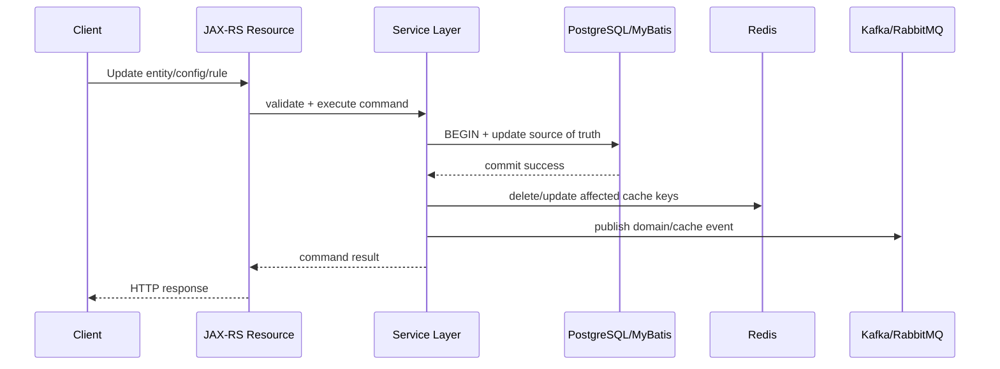
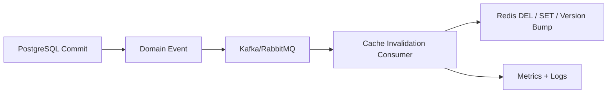

# Part 011 — Cache Invalidation

> Cache invalidation is not a cleanup problem. It is a correctness problem disguised as a performance optimization.

This part focuses on invalidating Redis cache in enterprise Java/JAX-RS systems backed by PostgreSQL/MyBatis/JDBC and integrated with Kafka/RabbitMQ. The goal is not to memorize invalidation patterns, but to reason about stale data windows, transaction boundaries, event ordering, duplicate events, tenant isolation, and operational visibility.

---

## 1. Core Idea

A cache is a copy of data whose authoritative state lives somewhere else, usually PostgreSQL, another service, a catalog system, a pricing engine, or an external platform.

Invalidation is the act of making cached data no longer trusted after the source of truth changes.

The hard part is not deleting a Redis key. The hard part is knowing:

- which key represents the changed data;
- when the source of truth change is safely committed;
- whether all derived cache entries are affected;
- whether consumers see old data during a transition;
- whether invalidation events can be duplicated, delayed, lost, or reordered;
- whether Redis failure creates stale cache or availability degradation;
- whether stale data is acceptable for the business operation.

Senior review rule:

> Every cache invalidation design must explicitly name its source of truth, invalidation trigger, key coverage, stale window, retry behavior, and observability signal.

---

## 2. Why Cache Invalidation Exists

Redis is used because source reads may be expensive. Examples in enterprise quote/order systems:

- catalog lookup;
- product eligibility calculation;
- tenant configuration read;
- pricing rule read model;
- user/session/security state;
- quote summary projection;
- reference data;
- external system response cache.

The moment source data changes, cached data may become stale. TTL reduces the duration of staleness but does not make the cache correct by itself.

A low TTL lowers stale risk but increases source load. A high TTL improves performance but increases correctness risk. Event-driven invalidation reduces stale duration but introduces distributed-system failure modes.

The design problem is not "how do we delete a key?" It is "what stale data can the system tolerate, for how long, under which failure mode?"

---

## 3. Invalidation Lifecycle

A typical write-path invalidation flow:



This diagram is simplified. In real systems, the order between database commit, Redis invalidation, and message publication is where correctness bugs appear.

A safer conceptual lifecycle:

1. Receive command.
2. Validate request and authorization.
3. Change source of truth inside a transaction.
4. Commit transaction.
5. Invalidate cache entries that are no longer trustworthy.
6. Publish durable event if other services must invalidate/update their own caches.
7. Emit metrics and logs.
8. Return response.

Important boundary:

> Invalidation before database commit is usually wrong. If the transaction rolls back, the cache may be deleted unnecessarily and repopulated with old data. Invalidation after commit is safer but creates a post-commit failure window.

---

## 4. Main Invalidation Strategies

### 4.1 TTL-Based Invalidation

The cache is allowed to expire naturally.

Useful when:

- data is read-heavy and changes rarely;
- stale data is acceptable for a bounded period;
- exact invalidation coverage is hard;
- source load can tolerate periodic refreshes.

Risk:

- stale data is guaranteed until TTL expires;
- many keys expiring together can cause stampede;
- too-low TTL may erase the benefit of caching;
- too-high TTL may violate business expectations.

Example:

```text
catalog:tenant:{tenantId}:product:{productId}:v1 -> TTL 15 minutes
```

This may be acceptable for reference data but dangerous for payment/security/eligibility decisions unless business explicitly accepts the stale window.

---

### 4.2 Manual Invalidation

Application code explicitly deletes or updates Redis when source data changes.

Useful when:

- write path is owned by the same service that owns the cache;
- affected keys are known;
- cache dependency graph is simple.

Risk:

- missing one key creates stale data;
- failure after DB commit but before Redis delete creates stale data;
- code paths outside the service may update the same source data;
- bulk updates/migrations may bypass invalidation.

Example:

```java
@Transactional
public void updateTenantConfig(UpdateTenantConfigCommand command) {
    tenantConfigRepository.update(command);      // PostgreSQL source of truth
    transactionSynchronization.afterCommit(() -> {
        redis.del("cfg:tenant:" + command.tenantId() + ":v1");
    });
}
```

The exact API depends on the framework. The important idea is: invalidate after commit, not inside an uncommitted transaction.

---

### 4.3 Event-Driven Invalidation

A source-of-truth change emits an event. One or more consumers invalidate or refresh Redis.

Useful when:

- multiple services maintain their own caches;
- changes happen in another bounded context;
- cache entries are projections from domain events;
- invalidation must propagate across service boundaries.

Risk:

- event publication failure;
- duplicate events;
- out-of-order events;
- consumer lag;
- consumer crash;
- event schema drift;
- Redis failure in the consumer;
- replay causing unexpected cache updates.



Senior review rule:

> If invalidation crosses service boundaries, the invalidation event must be treated as distributed consistency infrastructure, not as a best-effort side effect hidden inside business code.

---

### 4.4 Versioned Key Invalidation

Instead of deleting every affected key, the system changes a version component in the key.

Example:

```text
catalog:tenant:{tenantId}:version -> 42
catalog:tenant:{tenantId}:product:{productId}:v42 -> payload
```

When tenant catalog changes, increment or set the tenant catalog version. Readers build keys using the latest version.

Useful when:

- many keys depend on the same versioned source;
- bulk invalidation by deletion is expensive;
- old keys can expire naturally;
- readers can cheaply fetch version first.

Risk:

- version lookup becomes hot key;
- old version keys consume memory until TTL;
- every read may need an extra Redis command unless cached locally;
- version read failure needs fallback behavior;
- versioning must be included in all relevant keys.

---

### 4.5 Write-Through / Update Instead of Delete

Instead of deleting cache, write path updates Redis with new value.

Useful when:

- new cache value is known after write;
- update is simple and deterministic;
- cache should stay warm.

Risk:

- Redis update may succeed while DB commit fails if ordering is wrong;
- derived cache entries may still be missed;
- partial cache update may create mixed-version state;
- serialization compatibility matters during rolling deploy.

Default recommendation:

> Prefer delete-on-commit for complex read models unless there is a strong reason to write-through. Recompute-on-read is often simpler than maintaining derived cache writes on every mutation.

---

## 5. Invalidation and PostgreSQL/MyBatis/JDBC

PostgreSQL/MyBatis/JDBC integration introduces transaction boundaries.

Dangerous pattern:

```java
public void updateQuote(QuoteUpdate command) {
    redis.del(cacheKey(command.quoteId()));
    quoteMapper.update(command);
}
```

Why dangerous:

- Redis key is deleted before DB update commits.
- Another request can miss cache and reload old DB value.
- DB update may fail, but cache has already been invalidated.
- Concurrent readers may repopulate stale value.

Safer pattern:

```java
public void updateQuote(QuoteUpdate command) {
    tx.execute(() -> {
        quoteMapper.update(command);
        afterCommit(() -> redis.del(cacheKey(command.quoteId())));
    });
}
```

Even safer when invalidation must be reliable across services:

```text
DB transaction writes:
- business change
- outbox event

Outbox publisher sends event after commit.
Invalidation consumer deletes/refreshes Redis.
```

This is the outbox pattern applied to cache invalidation events.

---

## 6. Invalidation and Kafka/RabbitMQ

Kafka and RabbitMQ can transport invalidation events, but they do not automatically make cache correct.

You still need:

- idempotent consumer;
- event version or timestamp;
- duplicate handling;
- out-of-order handling;
- replay safety;
- poison event strategy;
- consumer lag dashboard;
- Redis failure retry;
- DLQ or parking strategy where appropriate.

### 6.1 Kafka-Based Invalidation

Kafka is often suitable when:

- events are durable;
- replay matters;
- order per key matters;
- multiple services need the same event stream;
- cache can be rebuilt from events.

Common pattern:

```text
Topic: catalog-events
Key: tenantId or productId
Value: ProductUpdated / CatalogVersionChanged
Consumer: cache-invalidation-service
Action: DEL keys or bump version
```

Kafka ordering is typically per partition key. If product update events must be ordered per product, the event key must be stable for that product.

### 6.2 RabbitMQ-Based Invalidation

RabbitMQ is often suitable when:

- event routing/topology matters;
- work distribution matters;
- invalidation commands are task-like;
- ack/retry/DLQ behavior is needed at queue level.

Common pattern:

```text
Exchange: cache.events
Routing key: tenant.config.updated
Queue: quote-order-cache-invalidator
Action: DEL tenant config cache
```

RabbitMQ does not give Kafka-style replay by default. The invalidation design must account for that.

---

## 7. Entity, Tenant, Catalog, and Rule Invalidation

Different data shapes require different invalidation coverage.

### 7.1 Entity Invalidation

One source entity maps to one or a small number of keys.

Example:

```text
quote:{quoteId}:summary:v1
customer:{customerId}:eligibility:v1
```

Delete specific keys after entity mutation.

### 7.2 Tenant-Wide Invalidation

One tenant-level change affects many keys.

Example:

```text
tenant:{tenantId}:config:v1
catalog:tenant:{tenantId}:product:{productId}:v1
pricing:tenant:{tenantId}:rule:{ruleId}:v1
```

Options:

- delete known keys if index exists;
- bump tenant version;
- use short TTL;
- warm selected keys after invalidation;
- publish tenant-wide invalidation event.

Risk:

- deleting many keys can be expensive;
- `KEYS tenant:123:*` is unsafe in production;
- `SCAN` must be used carefully and asynchronously;
- version bump leaves old keys until TTL.

### 7.3 Catalog/Rules Invalidation

Catalog and rule changes are often high-impact because one change may affect quote validation, price calculation, eligibility, and order transformation.

For these cases, always ask:

- Which read models depend on this catalog/rule?
- Is stale data acceptable?
- Can old quotes use old rules while new quotes use new rules?
- Is rule version part of the cache key?
- Is there a migration/warming step?
- Does invalidation need to be coordinated with deployment?

---

## 8. Stale Data Window

Every invalidation design has a stale data window.

Examples:

| Strategy | Stale window |
|---|---:|
| TTL only | Up to TTL |
| Manual delete after commit | Between commit and successful delete |
| Event-driven invalidation | Commit to event consumption + Redis action |
| Versioned key | Until readers observe new version |
| Write-through | Usually small, but can create mixed state under failure |

A stale window is not automatically bad. It becomes bad when the business assumes stronger freshness than the system provides.

Questions to ask:

- Can users see old catalog data?
- Can an order be submitted using stale price/rule data?
- Can authorization/security state be stale?
- Can stale tenant config cause wrong downstream integration behavior?
- Is stale data acceptable for read-only UI but not for write command validation?

Senior design rule:

> Cache freshness requirement must be different for read display, command validation, billing, security, and external side effects.

---

## 9. Invalidation Failure Modes

### 9.1 DB Commit Succeeds, Redis Delete Fails

Impact:

- source of truth is updated;
- Redis still contains old value;
- readers may see stale data until TTL;
- if TTL is long, impact can be severe.

Mitigations:

- retry invalidation;
- short TTL for high-risk data;
- event/outbox invalidation;
- versioned keys;
- admin/manual invalidation tooling;
- alert on invalidation failure.

### 9.2 Redis Delete Succeeds, DB Commit Fails

Impact:

- cache is unnecessarily deleted;
- next read reloads old DB value;
- usually availability/performance issue, not correctness issue;
- can trigger stampede under high traffic.

Mitigations:

- invalidate after commit;
- use after-commit callback;
- avoid deleting inside uncommitted transaction.

### 9.3 Invalidation Event Lost

Impact:

- downstream cache remains stale;
- TTL may eventually repair it;
- if no TTL, stale data may persist indefinitely.

Mitigations:

- durable broker;
- outbox pattern;
- consumer retry;
- TTL safety net;
- reconciliation job;
- versioned cache keys.

### 9.4 Duplicate Invalidation Event

Usually safe if the operation is `DEL` or version set to a deterministic value.

Risk appears when:

- event increments version multiple times;
- consumer performs non-idempotent cache mutation;
- event triggers expensive reload repeatedly.

Mitigation:

- idempotent consumer;
- event ID deduplication;
- deterministic version from source version;
- rate-limited refresh.

### 9.5 Out-of-Order Events

Example:

```text
Event A: Product version 10
Event B: Product version 11
Consumer processes B first, then A
```

If event A overwrites cache after B, the cache regresses.

Mitigations:

- include source version;
- compare version before write;
- prefer delete over overwrite where appropriate;
- partition events by entity key;
- use monotonic version in cache payload.

### 9.6 Bulk Update or Migration Bypasses Invalidation

Impact:

- many cache entries stale;
- difficult to detect;
- may only appear after customer reports wrong data.

Mitigations:

- migration playbook includes cache invalidation;
- version bump for affected domain;
- scheduled cache warming/rebuild;
- cache audit queries;
- explicit release checklist.

---

## 10. Invalidation Pattern Decision Matrix

| Use case | Recommended default | Watch out for |
|---|---|---|
| Rarely changing reference data | TTL + optional manual invalidation | TTL too long |
| Entity read model owned by same service | Delete after DB commit | transaction mismatch |
| Cross-service read model | Durable event-driven invalidation | duplicate/out-of-order/lag |
| Tenant-wide config | versioned key or tenant version bump | hot version key, old key memory |
| Security/token state | short TTL + explicit delete/revoke | stale auth state |
| Catalog/rules | versioned cache + event invalidation | stale validation/pricing |
| Derived projection | event-driven rebuild/update | replay and ordering |
| Expensive recomputation | refresh-ahead or controlled reload | stampede |

---

## 11. Java/JAX-RS Implementation Boundary

Do not scatter Redis invalidation calls inside random resource methods. Prefer clear layers:

```text
JAX-RS Resource
  -> Application Service / Command Handler
      -> PostgreSQL/MyBatis repository
      -> Transaction boundary
      -> Domain event / invalidation request
      -> Cache invalidation component
```

A dedicated invalidation component should own:

- key construction;
- deletion/update strategy;
- version bump logic;
- metrics;
- error handling;
- logging fields;
- retry classification;
- production-safe bulk invalidation.

Example shape:

```java
public interface QuoteCacheInvalidator {
    void invalidateQuoteSummary(QuoteId quoteId);
    void invalidateTenantCatalog(TenantId tenantId, CatalogVersion version);
    void invalidatePricingRules(TenantId tenantId, RuleSetVersion version);
}
```

This is better than letting every service method manually assemble Redis keys.

---

## 12. Production-Safe Bulk Invalidation

Avoid:

```text
KEYS tenant:123:*
DEL all returned keys synchronously in request path
```

Problems:

- `KEYS` can block Redis;
- deleting huge numbers of keys can spike latency;
- request path becomes operational job;
- cluster mode complicates scanning;
- key pattern might delete unintended keys.

Safer options:

1. Use versioned keys.
2. Maintain explicit key index if truly needed.
3. Use background worker with `SCAN` and bounded batch delete.
4. Use `UNLINK` instead of `DEL` for large values where available and appropriate.
5. Rate limit bulk invalidation.
6. Emit progress metrics.
7. Require operator confirmation for broad patterns.

Production-safe bulk invalidation must have:

- dry-run count or sample;
- max keys per batch;
- max runtime;
- abort mechanism;
- audit log;
- metric dashboard;
- owner approval for sensitive keyspace.

---

## 13. Observability for Cache Invalidation

Minimum metrics:

- invalidation request count by type;
- invalidation success/failure count;
- Redis delete/update latency;
- event invalidation lag;
- consumer retry count;
- DLQ count where applicable;
- stale read detection count if payload version can be checked;
- cache hit/miss after invalidation;
- bulk invalidation progress;
- version bump count.

Useful log fields:

```json
{
  "event": "cache_invalidation",
  "domain": "quote",
  "tenantId": "...",
  "entityId": "...",
  "keyPattern": "quote:{id}:summary:v1",
  "strategy": "delete-after-commit",
  "sourceVersion": 42,
  "correlationId": "...",
  "result": "success"
}
```

Do not log full key names if they contain sensitive identifiers. Better: use hashed identifiers or redacted fields where required.

---

## 14. Debugging Cache Invalidation Failures

Symptom: user sees old data.

Debugging path:

1. Identify the source of truth record and current version.
2. Identify cache key used by the read path.
3. Check whether cached payload contains version/timestamp.
4. Check TTL remaining.
5. Check write path logs around commit time.
6. Check invalidation logs.
7. Check Redis command errors/timeouts.
8. Check Kafka/RabbitMQ event publication.
9. Check consumer lag/retry/DLQ.
10. Check whether a migration/bulk update bypassed invalidation.
11. Check whether cache key dimensions are incomplete.
12. Check whether another reader repopulated stale value after delete.

Production-safe principle:

> Do not start with broad key scans. Start from one affected entity, one key, one timeline, and one source-of-truth version.

---

## 15. Correctness Concerns

Invalidation correctness is affected by:

- missing key dimensions;
- wrong transaction boundary;
- non-idempotent invalidation event;
- stale event overwriting fresh cache;
- TTL longer than business stale tolerance;
- cache entry not carrying source version;
- invalidation failure without retry/alert;
- bulk update bypassing normal write path;
- local cache not invalidated when distributed cache changes;
- tenant prefix missing from key.

For high-risk data, cache payload should often include:

```json
{
  "sourceVersion": 42,
  "generatedAt": "2026-07-11T03:00:00Z",
  "schemaVersion": 1,
  "payload": {}
}
```

This makes debugging and stale detection much easier.

---

## 16. Concurrency Concerns

Common race:

```text
T1 updates DB and deletes cache
T2 reads cache miss
T2 loads DB old value because T1 has not committed yet
T2 writes old value to cache
T1 commits DB
Cache now contains stale value
```

This happens when invalidation occurs before commit or when transaction isolation/timing is misunderstood.

Another race:

```text
T1 deletes cache after update
T2 reads miss and reloads new value
T3 receives older invalidation event and deletes fresh cache
```

This may be acceptable if next read reloads, but if the old event writes data instead of deleting it, it can regress the cache.

Mitigations:

- after-commit invalidation;
- source version in payload;
- compare version before write;
- idempotent delete;
- controlled reload/single-flight;
- short TTL safety net.

---

## 17. Performance Concerns

Invalidation can hurt performance when:

- too many keys are deleted at once;
- high-value cache is invalidated too frequently;
- invalidation triggers synchronized reload;
- event consumer aggressively refreshes cache;
- version key becomes hot;
- local cache and Redis cache are invalidated independently;
- Redis is used for broad key scans.

Performance-safe invalidation often means:

- delete instead of eager refresh;
- use TTL jitter;
- rate limit refresh;
- batch invalidation in background;
- pre-warm only critical keys;
- avoid broad wildcard deletion in request path;
- measure source load after invalidation.

---

## 18. Security and Privacy Concerns

Invalidation logic may expose sensitive data if key names include:

- email;
- phone number;
- customer name;
- account number;
- token;
- session ID;
- raw quote/order identifiers where policy forbids logging.

Rules:

- Do not log sensitive Redis keys.
- Avoid PII in key names.
- Redact or hash identifiers in logs where required.
- Ensure invalidation tooling has access control.
- Audit broad/bulk invalidation operations.
- Treat cache dumps/snapshots as sensitive if values contain PII.

---

## 19. Internal Verification Checklist

Use this checklist against the actual CSG/team codebase and platform. Do not assume details without verification.

### Codebase

- Which services own Redis cache entries?
- Where are cache keys constructed?
- Is key construction centralized?
- Are invalidation methods explicit and named by domain use case?
- Are Redis calls inside transaction boundaries or after commit?
- Are there bulk update paths that bypass invalidation?

### PostgreSQL/MyBatis/JDBC

- Which DB tables feed Redis cache?
- Is invalidation after DB commit?
- Are MyBatis transactions coordinated with cache invalidation?
- Are migrations required to invalidate or bump cache versions?
- Is there an outbox table for invalidation/domain events?

### Kafka/RabbitMQ

- Which topics/queues carry invalidation events?
- Are invalidation consumers idempotent?
- Is event ordering required?
- Is source version included?
- Is consumer lag monitored?
- Is there DLQ/retry handling?

### Redis

- Which invalidation strategy is used: TTL, delete, write-through, version bump, event-driven?
- Are invalidated keys guaranteed to have TTL?
- Is `SCAN` used safely if bulk invalidation exists?
- Is `UNLINK` used for large keys where appropriate?
- Are old versioned keys bounded by TTL?

### Observability

- Are invalidation failures logged and alerted?
- Can engineers trace a stale value to source version and cache version?
- Are hit/miss changes visible after invalidation?
- Is stale read detection possible?
- Are dashboards linked from runbooks?

### Security/Privacy

- Do invalidation logs expose PII?
- Can broad invalidation be executed by any service/user?
- Are sensitive keyspaces protected by ACL or access boundaries?
- Are audit logs available for manual invalidation?

---

## 20. PR Review Checklist

Ask these questions in PR review:

1. What is the source of truth?
2. What cache keys can contain copies or projections of that source?
3. What triggers invalidation?
4. Is invalidation after DB commit?
5. Is TTL a safety net?
6. What stale data window is acceptable?
7. What happens if Redis invalidation fails?
8. What happens if the event is duplicated?
9. What happens if the event is delayed or out of order?
10. Does the payload include source version or generated timestamp?
11. Is the invalidation operation idempotent?
12. Does this support tenant isolation?
13. Is broad invalidation production-safe?
14. Are metrics/logs/alerts included?
15. Is sensitive data kept out of key names and logs?
16. Is there a test for stale cache after update?
17. Is there a test for concurrent read/write?
18. Is there a test for invalidation failure?

---

## 21. Practical Design Heuristics

Use these defaults unless a stronger internal standard exists:

- Prefer after-commit invalidation over in-transaction invalidation.
- Prefer `DEL` for derived cache unless write-through is clearly safe.
- Use TTL as a safety net even with event-driven invalidation.
- Use versioned keys for broad tenant/catalog/rule invalidation.
- Include source version/timestamp in complex cache payloads.
- Treat event-driven invalidation as distributed consistency infrastructure.
- Avoid wildcard invalidation in request path.
- Make invalidation observable before it becomes an incident.
- Do not cache data whose stale window is unacceptable unless validation re-checks source of truth.

---

## 22. Summary

Cache invalidation is where Redis changes from a performance tool into a distributed correctness concern.

The key engineering questions are:

- What changed?
- Which cached views are now untrusted?
- When did the source commit?
- How is invalidation delivered?
- How long can stale data survive?
- How do we know invalidation failed?
- How do we debug one stale customer/entity/tenant case safely?

A senior engineer does not approve Redis caching because the happy path is fast. A senior engineer approves it when the invalidation path is explicit, bounded, observable, testable, and operationally recoverable.
