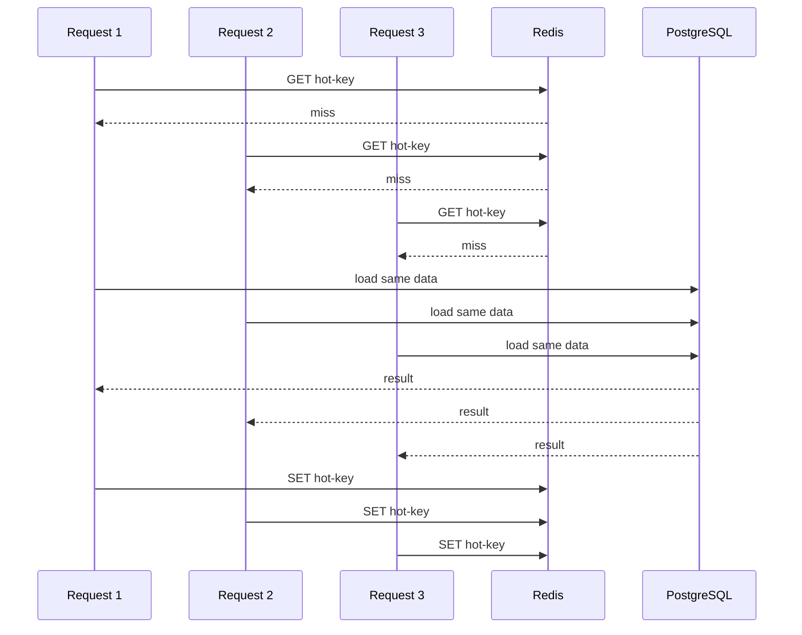
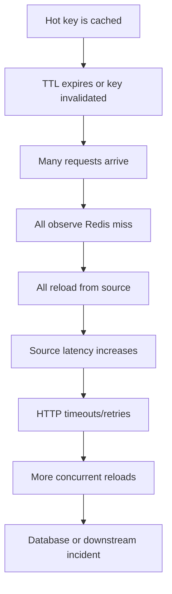
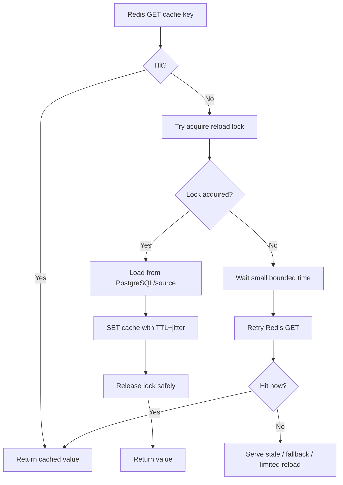
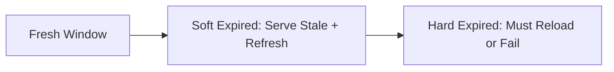

# Part 012 — Cache Stampede and Thundering Herd

> A cache miss is not always cheap. Under load, one expired hot key can become a database incident.

This part focuses on cache stampede, dogpile effect, and thundering herd in Redis-backed Java/JAX-RS systems. The goal is to understand why caches fail under concurrency, how Redis interacts with PostgreSQL/MyBatis and service replicas, and how to design reload protection that preserves correctness, latency, and database safety.

---

## 1. Core Idea

A cache stampede happens when many requests observe the same cache miss or expired key and all reload the same data from the source of truth at roughly the same time.

A thundering herd is the broader effect: many workers/threads/pods wake up or retry simultaneously and overwhelm a shared dependency.

A dogpile effect is a common cache-specific version: one popular cached object expires, then every request tries to regenerate it.



The problem is not that Redis is slow. The problem is that Redis is doing exactly what it was asked to do: return miss after expiry. The application failed to coordinate reload.

Senior review rule:

> For hot or expensive cache entries, the miss path must be designed as carefully as the hit path.

---

## 2. Why Stampede Happens

Stampede usually requires several conditions:

1. A key is frequently accessed.
2. The key expires or is invalidated.
3. The reload operation is expensive.
4. Many service replicas/threads observe the miss at the same time.
5. There is no single-flight, lock, stale fallback, or backpressure.
6. The source of truth has limited capacity.

In Java/JAX-RS systems, the fan-out is amplified by:

- multiple Kubernetes pods;
- each pod having many HTTP worker threads;
- retrying clients;
- API gateway retries;
- connection pool concurrency;
- background jobs warming the same cache;
- Kafka/RabbitMQ consumers refreshing projections;
- load balancer spreading identical requests across pods.

One hot key can create hundreds or thousands of concurrent reloads.

---

## 3. Example Enterprise Scenario

Imagine a quote validation API reads tenant catalog rules from Redis:

```text
catalog:tenant:acme:rules:v42
```

The key has a 10-minute TTL. At minute 10, it expires. At the same time, many users submit quote validation requests.

Without protection:

```text
500 requests -> Redis miss -> 500 PostgreSQL/catalog loads -> DB latency spike -> API timeout -> client retries -> even more load
```

The cache was meant to protect PostgreSQL. Under stampede, it becomes a synchronized load amplifier.

---

## 4. Stampede Lifecycle



A prevention design must break this cycle at one or more points:

- avoid synchronized expiry;
- reduce concurrent reloaders;
- serve stale value temporarily;
- rate limit reload;
- apply backpressure;
- pre-refresh before expiry;
- protect database connection pool;
- fail gracefully.

---

## 5. Pattern 1 — TTL Jitter

TTL jitter means adding randomness to TTL so many keys do not expire at exactly the same time.

Instead of:

```text
TTL = 600 seconds
```

Use:

```text
TTL = 600 seconds ± random(0..120 seconds)
```

Example Java-style helper:

```java
Duration ttlWithJitter(Duration base, Duration maxJitter) {
    long jitterMillis = ThreadLocalRandom.current().nextLong(maxJitter.toMillis() + 1);
    return base.plusMillis(jitterMillis);
}
```

Useful for:

- many keys created at deployment/startup;
- tenant config caches;
- reference data caches;
- catalog/rule caches;
- negative cache entries;
- local + distributed cache layers.

Limitations:

- jitter spreads expiry across time but does not prevent stampede for one very hot key;
- jitter does not coordinate concurrent reload after invalidation;
- jitter does not help if manual invalidation deletes many hot keys at once.

Senior review rule:

> TTL jitter is a baseline hygiene practice, not a complete stampede solution.

---

## 6. Pattern 2 — Single-Flight Reload

Single-flight means only one execution reloads a missing key while others wait, reuse, or serve stale.

There are two levels:

1. Local single-flight inside one JVM/pod.
2. Distributed single-flight across pods using Redis lock or another coordination mechanism.

### 6.1 Local Single-Flight

Local single-flight prevents duplicate reloads inside the same JVM.

Conceptual shape:

```java
class LocalSingleFlight<K, V> {
    private final ConcurrentHashMap<K, CompletableFuture<V>> inflight = new ConcurrentHashMap<>();

    CompletableFuture<V> execute(K key, Supplier<CompletableFuture<V>> loader) {
        return inflight.computeIfAbsent(key, ignored ->
            loader.get().whenComplete((value, error) -> inflight.remove(key))
        );
    }
}
```

Useful when:

- one pod receives many identical requests;
- reload is expensive;
- cache key can be represented safely;
- waiting callers can share one result.

Limitations:

- does not coordinate across pods;
- if there are 20 pods, there can still be 20 reloads;
- if loader hangs, waiting requests can pile up;
- must include timeout and cancellation behavior.

### 6.2 Distributed Single-Flight

Distributed single-flight coordinates reload across pods. Often implemented with a Redis lock:

```text
SET reload-lock:{cacheKeyHash} {ownerId} NX PX 5000
```

Flow:

1. Request sees cache miss.
2. Try to acquire reload lock.
3. If acquired, reload from source and set cache.
4. If not acquired, wait briefly and retry cache read, or serve stale, or return controlled fallback.
5. Release lock safely with owner value check.



Important:

- lock TTL must be bounded;
- unlock must verify owner;
- loader timeout must be shorter than or aligned with lock lease;
- waiting callers need max wait;
- lock failure must not create unbounded request pileup.

---

## 7. Pattern 3 — Stale-While-Revalidate

Stale-while-revalidate allows serving a slightly stale value while one worker refreshes the cache in the background.

The cache payload carries two timestamps:

```json
{
  "softExpiresAt": "2026-07-11T03:10:00Z",
  "hardExpiresAt": "2026-07-11T03:20:00Z",
  "sourceVersion": 42,
  "payload": {}
}
```

Behavior:

- Before `softExpiresAt`: return fresh value.
- Between `softExpiresAt` and `hardExpiresAt`: return stale value and trigger refresh.
- After `hardExpiresAt`: do not trust value; reload or fail according to policy.



Useful when:

- read display can tolerate bounded staleness;
- reload is expensive;
- availability is more important than perfect freshness;
- source system sometimes slows down;
- cache key is hot.

Dangerous when:

- stale data affects authorization;
- stale data affects billing/price commitment;
- stale data affects irreversible order submission;
- business expects immediate consistency.

Senior review rule:

> Stale-while-revalidate must be a business-approved freshness policy, not a hidden engineering shortcut.

---

## 8. Pattern 4 — Probabilistic Early Refresh

Probabilistic early refresh refreshes a key before it expires, with probability increasing as expiry approaches.

Purpose:

- avoid many clients hitting exact expiry;
- refresh hot keys gradually;
- keep hot cache warm without scheduled jobs.

Simplified concept:

```text
remaining TTL high  -> low refresh probability
remaining TTL low   -> higher refresh probability
```

Example mental model:

```java
boolean shouldRefreshEarly(long ttlRemainingMillis, long baseTtlMillis) {
    double ageRatio = 1.0 - ((double) ttlRemainingMillis / baseTtlMillis);
    double probability = Math.pow(ageRatio, 3); // low early, higher near expiry
    return ThreadLocalRandom.current().nextDouble() < probability;
}
```

This must still be combined with single-flight; otherwise many requests may early-refresh simultaneously.

Useful when:

- hot key should rarely hard-expire;
- scheduled refresh is too rigid;
- traffic itself can drive refresh.

Limitations:

- more complex to reason about;
- hard to test deterministically unless randomness is injectable;
- can increase source load if probability is too aggressive;
- must include metrics.

---

## 9. Pattern 5 — Request Coalescing

Request coalescing combines equivalent requests before they hit Redis or PostgreSQL.

Examples:

- same tenant config requested by many resource methods;
- same catalog rules requested multiple times during one quote calculation;
- same customer eligibility check triggered by multiple validators;
- same reference data loaded by multiple service components.

Coalescing can happen:

- within a single request context;
- within a JVM for concurrent requests;
- across pods using distributed single-flight.

Request-scope coalescing:

```text
JAX-RS Request Context
  cache tenant config lookup result
  reuse within validators/pricing/order checks
```

This reduces duplicate Redis reads and duplicate fallback loads.

Warning:

> Request-scope coalescing must not leak data across tenants or users. It is per-request only, not static global state.

---

## 10. Pattern 6 — Rate-Limited Reload

Rate-limited reload protects the source of truth when cache misses surge.

Possible policies:

- allow only N reloads per key per second;
- allow only N global cache reloads per service instance;
- allow only N reloads per tenant;
- queue reload attempts;
- serve stale when reload budget is exhausted;
- return controlled degraded response.

This is especially useful for:

- high-cardinality misses after deployment;
- broad invalidation;
- cold cache start;
- Redis flush/restart;
- catalog version change;
- downstream source degradation.

A reload limiter can itself use Redis or local token bucket. Be careful not to create circular dependency: if Redis is unavailable, a Redis-backed reload limiter may also fail.

---

## 11. Pattern 7 — Backpressure and Bulkhead

Backpressure means the service refuses or slows work before dependencies collapse.

For cache reload:

- limit concurrent DB reloads;
- use separate executor for cache fills;
- cap pending waiting requests;
- set DB connection pool limits;
- set Redis command timeout;
- fail fast when reload queue is saturated;
- return stale where business permits.

Bulkhead example:

```text
HTTP worker threads
  -> cache component
      -> small bounded reload executor
          -> PostgreSQL/MyBatis
```

Do not let cache misses consume every HTTP thread and every DB connection.

Senior review rule:

> Cache miss paths must have concurrency limits. Otherwise the cache can become an unbounded multiplier against PostgreSQL.

---

## 12. Pattern 8 — Cache Warming

Cache warming loads selected keys before user traffic needs them.

Useful after:

- deployment;
- Redis restart;
- planned invalidation;
- catalog/rules publish;
- tenant onboarding;
- data migration;
- failover/recovery.

Types:

- eager warming during deployment;
- scheduled warming;
- event-driven warming;
- lazy warming with single-flight;
- priority warming for top tenants/hot keys.

Risks:

- warming too much data overloads Redis/source;
- warmed data may be stale immediately if versioning is wrong;
- warming every tenant equally wastes resources;
- warming job can compete with production traffic;
- warming can hide missing fallback behavior.

Good warming design includes:

- bounded concurrency;
- priority list;
- metrics;
- abort switch;
- source load budget;
- key version awareness.

---

## 13. Negative Cache Stampede

Negative caching stores "not found" or "not eligible" results to prevent repeated expensive misses.

Stampede can also happen for negative results:

```text
unknown product ID -> Redis miss -> DB lookup not found -> many repeated DB lookups
```

Negative cache entry:

```json
{
  "type": "NEGATIVE",
  "reason": "NOT_FOUND",
  "generatedAt": "2026-07-11T03:00:00Z"
}
```

Rules:

- negative TTL should usually be shorter than positive TTL;
- invalidation must remove negative cache when entity is created;
- do not cache authorization denial too long unless policy allows it;
- include enough metadata to debug why negative result exists.

Negative cache can protect DB, but stale negative results can block newly created data from being visible.

---

## 14. Local Cache + Redis Stampede

Many enterprise Java services use two layers:

```text
Caffeine/local memory cache -> Redis distributed cache -> PostgreSQL/source
```

This improves latency but complicates stampede behavior.

Possible failure:

1. Local caches across all pods expire at same time.
2. All pods hit Redis.
3. Redis key also expires.
4. All pods reload from PostgreSQL.

Mitigations:

- TTL jitter at both local and Redis layers;
- local stale-while-revalidate;
- distributed single-flight at Redis layer;
- per-pod reload bulkhead;
- versioned payload;
- metrics per cache layer.

Important:

> Local cache invalidation must not be forgotten when Redis invalidation happens. Otherwise Redis is correct but JVM-local cache still serves stale values.

---

## 15. Interaction with PostgreSQL/MyBatis/JDBC

Stampede often shows up as database symptoms:

- sudden spike in identical SELECT queries;
- DB CPU spike;
- connection pool exhaustion;
- slow query increase;
- lock contention if reload includes writes/temp tables;
- timeout cascade to Java service;
- MyBatis mapper latency increase.

Protection points:

- ensure cache reload query is indexed;
- keep reload query narrow;
- use read replica only if staleness is acceptable;
- limit concurrent reloads;
- use query timeout;
- use DB pool isolation where possible;
- avoid reloading broad tenant/catalog data per request if precomputed read model exists.

Debugging tip:

> During a cache incident, look for a shape change: the same DB query suddenly executed many times with the same parameters.

---

## 16. Interaction with Kafka/RabbitMQ

Event-driven invalidation can trigger stampede.

Example:

```text
CatalogUpdated event -> invalidate tenant catalog cache -> all quote requests reload catalog rules
```

If many consumers receive invalidation events and refresh eagerly, the broker can amplify reload:

```text
N consumers x M tenants x K cache keys -> source load spike
```

Safer event-driven behavior:

- invalidate/delete first, do not always eager-refresh;
- rate-limit refresh consumers;
- warm only top keys;
- use versioned keys;
- use single-flight on read path;
- monitor consumer lag and refresh latency;
- avoid every service independently rebuilding the same projection at once.

---

## 17. Kubernetes Amplification

Kubernetes increases concurrency quickly:

```text
30 pods x 50 request threads = 1500 possible concurrent cache misses
```

A Redis cache stampede may appear only after horizontal scaling.

Kubernetes-specific triggers:

- rolling restart clears local caches;
- autoscaling adds cold pods;
- readiness sends traffic before warmup;
- pod CPU throttling delays reload completion;
- DNS/reconnect issue causes Redis miss/error fallback to DB;
- Redis failover causes client retries;
- deployment invalidates many keys at once.

Mitigations:

- staggered rollout;
- readiness that considers critical warmup only where appropriate;
- local cache warmup with budget;
- connection and reload bulkheads;
- pod-level metrics for hit/miss/reload;
- max concurrency per pod.

---

## 18. Detection Signals

Cache stampede detection should combine Redis, application, and database signals.

### Redis Signals

- sudden drop in hit ratio;
- spike in misses;
- spike in expired keys;
- spike in evicted keys;
- high command rate on hot key pattern;
- latency spike;
- slowlog entries for large operations;
- increased network throughput.

### Java Service Signals

- cache reload count spike;
- reload latency spike;
- fallback-to-source count spike;
- waiting-on-single-flight count;
- reload lock contention;
- stale served count;
- HTTP p95/p99 latency increase;
- 5xx/timeout increase;
- thread pool saturation.

### PostgreSQL Signals

- repeated identical SELECTs;
- DB CPU spike;
- connection pool exhaustion;
- query latency increase;
- read replica lag;
- lock wait increase if write path involved.

### Kafka/RabbitMQ Signals

- invalidation event burst;
- consumer lag;
- retry/DLQ spike;
- refresh worker backlog.

---

## 19. Production Debugging Playbook

Symptom: latency spike after cache expiry/invalidation.

Steps:

1. Identify affected endpoint and tenant/entity/key pattern.
2. Check cache hit/miss metrics around incident time.
3. Check expired/evicted key metrics.
4. Check whether a deployment, migration, or invalidation event happened.
5. Check DB query repetition with same parameters.
6. Check reload concurrency per pod.
7. Check Redis slowlog/latency.
8. Check lock/single-flight contention metrics.
9. Check whether stale fallback was available and used.
10. Check client retries and gateway retries.
11. Check Kubernetes rollout/autoscaling events.
12. Verify whether the key was hot or big.

Production-safe principle:

> During stampede debugging, the first goal is to stop amplification. Root cause analysis comes after load is stabilized.

Immediate stabilizers may include:

- temporarily increase TTL for affected key class;
- enable/adjust stale fallback;
- reduce reload concurrency;
- warm critical keys with bounded concurrency;
- disable aggressive refresh;
- rate limit affected endpoint;
- scale DB read capacity only if safe and necessary;
- pause non-critical consumers that refresh cache.

---

## 20. Correctness Concerns

Stampede protection can accidentally damage correctness.

Examples:

- serving stale data after hard business freshness boundary;
- one failed reload writing partial/invalid data to cache;
- lock holder timing out but still writing old data after another holder wrote fresh data;
- negative cache hiding newly created entity;
- refresh-ahead overwriting newer payload with older source version;
- local cache serving stale after Redis invalidation;
- fallback returning stale security/auth data.

Mitigations:

- include source version in cache payload;
- compare version before overwrite where needed;
- separate soft TTL and hard TTL;
- define stale eligibility per use case;
- avoid stale fallback for security-critical decisions unless explicitly allowed;
- test concurrent reload and invalidation.

---

## 21. Concurrency Concerns

Common concurrency bugs:

### 21.1 Lock Holder Overruns Lease

```text
T1 acquires reload lock for 5s
T1 source load takes 8s
T2 acquires lock after lease expiry
T2 writes fresh value
T1 finishes and writes stale/older value
```

Mitigations:

- loader timeout shorter than lease;
- source version check;
- lock renewal only if safe;
- compare-and-set payload version;
- avoid long critical sections.

### 21.2 Waiters Pile Up

If 1000 requests wait for the same reload future, one slow reload can exhaust HTTP workers.

Mitigations:

- max wait time;
- stale fallback;
- bounded waiter count;
- fail fast with controlled error;
- async/non-blocking architecture where appropriate.

### 21.3 Multiple Cache Layers Race

Redis refresh completes, but local cache still holds old value.

Mitigations:

- local TTL shorter than Redis soft TTL;
- local version check;
- event-driven local invalidation where safe;
- request-scope validation for critical commands.

---

## 22. Performance Concerns

Stampede protection itself has cost.

| Technique | Cost | Risk |
|---|---|---|
| TTL jitter | minimal | incomplete for single hot key |
| local single-flight | memory/inflight tracking | per-pod only |
| Redis lock | extra Redis commands | lock contention/failure |
| stale-while-revalidate | payload complexity | stale correctness risk |
| early refresh | extra refreshes | source load if tuned badly |
| cache warming | background load | can compete with traffic |
| reload rate limit | lower source pressure | more stale/error responses |

There is no universal best option. Choose based on:

- read traffic;
- reload cost;
- freshness requirement;
- source capacity;
- number of pods;
- acceptable stale window;
- operational maturity.

---

## 23. Security and Privacy Concerns

Stampede controls often add logging and coordination keys. Be careful:

- do not put PII in reload lock keys;
- do not log full sensitive cache keys;
- stale fallback must not expose revoked auth/security state;
- negative cache must not reveal existence of sensitive entities;
- cache warming jobs must respect tenant access boundaries;
- metrics labels must avoid high-cardinality sensitive identifiers.

Example safer lock key:

```text
lock:reload:sha256(cacheKey)
```

rather than logging raw key:

```text
lock:reload:customer-email:alice@example.com
```

---

## 24. Testing Strategy

Test more than hit/miss.

### Unit Tests

- TTL jitter range.
- soft/hard expiry decision.
- stale eligibility logic.
- source version comparison.
- negative cache behavior.

### Integration Tests

- many concurrent requests for same missing key.
- only one reload occurs per JVM.
- distributed lock prevents multi-pod reload simulation.
- waiting requests return cached value after reload.
- stale value served during source slowness where allowed.
- hard-expired value is not served.

### Failure Tests

- loader timeout.
- Redis lock acquisition failure.
- Redis unavailable.
- DB unavailable.
- lock holder crash.
- stale payload version lower than source version.
- invalidation event burst.

### Load Tests

- hot key expiry under high QPS.
- cold cache start after deployment.
- broad tenant invalidation.
- Redis restart/failover impact.
- local cache clear across all pods.

---

## 25. Internal Verification Checklist

Use this against the actual CSG/team implementation. Do not assume topology, client, or cache policy without verification.

### Cache Design

- Which keys are hot?
- Which keys are expensive to reload?
- Which keys expire at the same time?
- Are TTLs jittered?
- Are soft TTL/hard TTL used anywhere?
- Are negative cache entries used?

### Java/JAX-RS Service

- Does the cache component implement local single-flight?
- Is reload concurrency bounded?
- Are reloads executed on request threads or isolated executor?
- Are source load timeouts configured?
- Are fallback/stale policies explicit per endpoint?
- Are hit/miss/reload metrics emitted?

### Redis

- Are reload locks used?
- Are lock keys safe and non-sensitive?
- Is unlock owner-safe?
- Are lock TTLs aligned with loader timeout?
- Are hot key metrics available?

### PostgreSQL/MyBatis/JDBC

- Which queries run on cache miss?
- Are reload queries indexed?
- Can cache miss exhaust DB connection pool?
- Is source load bounded by timeout?
- Are repeated identical queries visible in DB monitoring?

### Kafka/RabbitMQ

- Can invalidation event bursts trigger reload bursts?
- Do consumers delete or eagerly refresh?
- Is refresh rate-limited?
- Is consumer lag visible?
- Is replay safe?

### Kubernetes/Cloud/On-Prem

- Does rolling restart clear local cache and cause reload surge?
- Does autoscaling add many cold pods?
- Are readiness/warmup policies defined?
- Are Redis failovers tested against cache miss behavior?
- Are platform/SRE runbooks available?

---

## 26. PR Review Checklist

Ask these questions when reviewing a Redis cache PR:

1. What happens when this key expires under peak traffic?
2. Is the key hot or expensive to reload?
3. Is TTL jitter applied?
4. Is there local or distributed single-flight?
5. Is stale-while-revalidate allowed by business semantics?
6. Is there a hard TTL after which stale data is forbidden?
7. Is reload concurrency bounded?
8. Can reload exhaust PostgreSQL/MyBatis connection pool?
9. What happens if Redis lock acquisition fails?
10. What happens if the lock holder crashes?
11. Can an old reload overwrite newer data?
12. Is source version included in payload?
13. Are negative cache entries safe and short-lived?
14. Are metrics emitted for miss, reload, wait, stale, and failure?
15. Has concurrent miss behavior been tested?
16. Has broad invalidation/cold start been load tested?
17. Are sensitive keys redacted in logs/metrics?
18. Is there an operational switch to reduce reload pressure during incident?

---

## 27. Practical Design Defaults

Good defaults for enterprise Java services:

- Add TTL jitter to most expiring cache entries.
- For hot/expensive keys, use local single-flight at minimum.
- For multi-pod hot keys, consider distributed single-flight or stale-while-revalidate.
- Keep cache reload queries narrow and indexed.
- Bound reload concurrency separately from HTTP worker capacity.
- Use soft TTL/hard TTL when stale reads are acceptable.
- Never serve stale blindly for security, billing, or irreversible command decisions.
- Include source version/timestamp in complex payloads.
- Monitor reload count, reload latency, stale served, and reload failures.
- Treat broad invalidation as a production event.

---

## 28. Summary

Cache stampede is a concurrency failure, not just a caching failure.

The dangerous path is:

```text
hot key expires -> many Redis misses -> many source reloads -> source latency -> retries -> more reloads -> incident
```

A mature Redis caching design controls this path with:

- TTL jitter;
- single-flight;
- stale-while-revalidate;
- bounded reload concurrency;
- rate-limited refresh;
- cache warming with budget;
- source version checks;
- observability;
- incident runbooks.

A senior engineer reviews not only whether Redis makes the happy path fast, but whether the miss path remains safe under peak concurrency, deployment, failover, invalidation, and partial outage.
