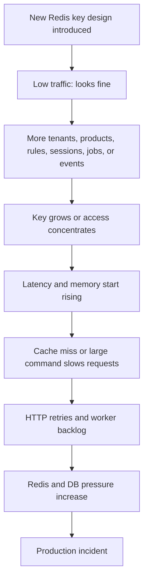
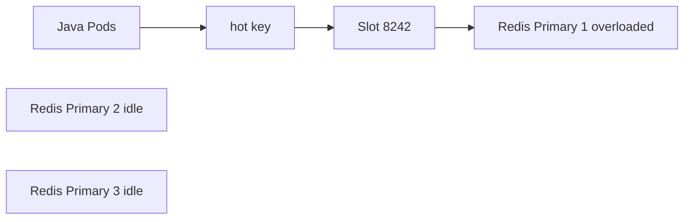
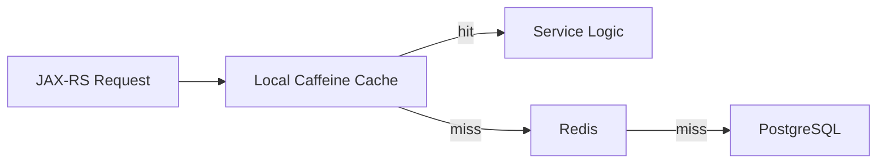
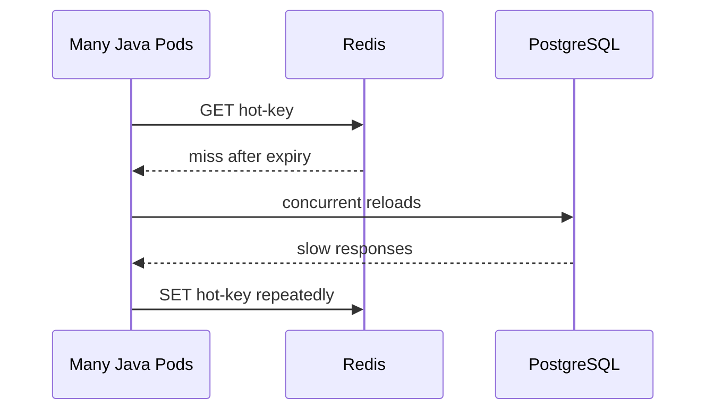
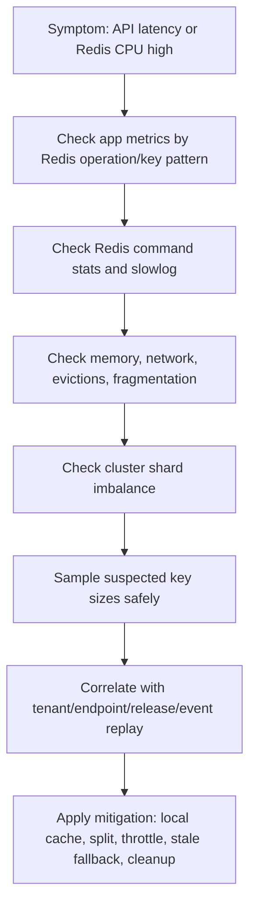
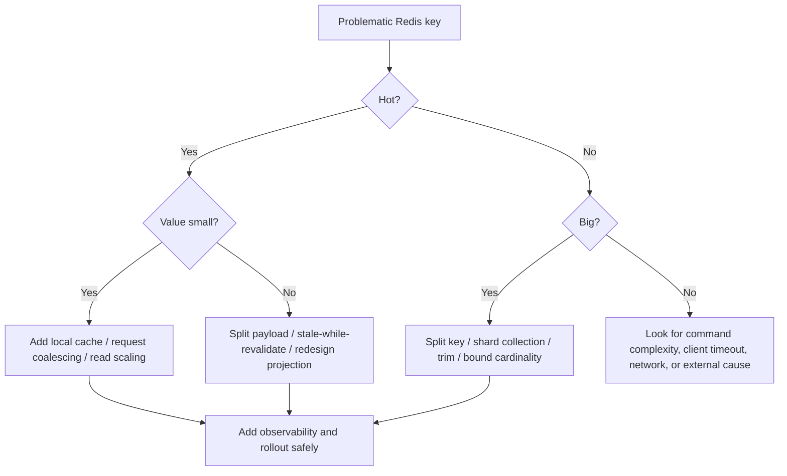

# Part 013 — Hot Key and Big Key Management

> Most Redis incidents are not caused by Redis being mysterious. They are caused by a few keys becoming too hot, too large, too expensive, or too important.

This part focuses on **hot key** and **big key** management in Redis-backed Java/JAX-RS systems. The goal is to recognize dangerous key shapes early, understand why they hurt Redis, PostgreSQL, Kafka/RabbitMQ-driven projections, Kubernetes workloads, and cloud/on-prem deployments, and build a safe remediation playbook.

This is a production-oriented topic. A design that works perfectly in a developer environment can fail badly when one tenant, catalog, product bundle, entitlement set, pricing rule, quote summary, or stream key becomes disproportionately large or popular.

---

## 1. Core Idea

A **hot key** is a key that receives a disproportionate amount of traffic.

A **big key** is a key whose value or internal collection is large enough to create latency, memory, network, persistence, failover, eviction, or cluster imbalance risk.

They are different problems, but they often appear together.

```text
Hot key:
  small value, huge request rate
  Example: tenant:global-config:v12 read by every request

Big key:
  huge value or huge collection, maybe not frequently accessed
  Example: tenant:acme:all-products containing 500k IDs

Hot + big key:
  huge value read often
  Example: catalog:tenant:acme:rules:v42 read by every quote validation request
```

Senior review rule:

> A Redis key is not just a name. It is a unit of memory ownership, access concentration, network payload, cluster placement, TTL lifecycle, and incident blast radius.

---

## 2. Why Hot Keys Are Dangerous

Redis command execution is fast, but a hot key can still overload the system because it concentrates work.

A hot key can cause:

- high Redis CPU usage;
- elevated p99/p999 latency;
- network saturation from repeated value transfer;
- Java client connection pool pressure;
- Netty event loop pressure for async clients;
- local pod CPU pressure due to repeated deserialization;
- cache stampede when the key expires;
- single hash slot hotspot in Redis Cluster;
- poor horizontal scaling because the hot key lives on one primary shard.

In a JAX-RS service, the hot key is often invisible at first because the code looks harmless:

```java
CatalogRules rules = cache.get("catalog:tenant:" + tenantId + ":rules:v42");
```

But if that key is read on every request, across dozens of pods, under gateway retries, it becomes a shared bottleneck.

---

## 3. Why Big Keys Are Dangerous

A big key is dangerous because Redis operations are single-key operations from the application perspective, but they can hide a large amount of work.

Big keys can cause:

- large memory allocation;
- memory fragmentation;
- long copy/free time;
- slow serialization/deserialization;
- large network payload;
- Redis event loop blockage during large operations;
- replication backlog pressure;
- AOF/RDB persistence cost;
- failover recovery delay;
- eviction side effects;
- cluster migration pain;
- slow backup/restore;
- production debugging risk.

Examples:

```text
String big key:
  cache:quote:summary:Q123 -> 8 MB JSON blob

Hash big key:
  tenant:acme:product-config -> 300k fields

List big key:
  queue:legacy:jobs -> 2 million elements

Set big key:
  tenant:acme:eligible-product-ids -> 800k members

Sorted set big key:
  limiter:tenant:acme:events -> millions of timestamp entries

Stream big key:
  stream:order-events -> retained indefinitely without trimming
```

Senior review rule:

> A command that looks O(1) at the API layer can still move megabytes across the network and deserialize megabytes in the JVM.

---

## 4. Hot Key vs Big Key Matrix

| Key shape | Redis symptom | Java symptom | Common root cause | Primary mitigation |
|---|---|---|---|---|
| Small hot key | high command rate, CPU, slot hotspot | elevated latency, pool pressure | global config/session/catalog key read too often | local cache, request coalescing, replication/read scaling where safe |
| Large cold key | memory pressure, slow operations | occasional timeout | oversized object/cache entry | split key, compress carefully, change data model |
| Large hot key | CPU + network + memory pressure | high p99, GC/deserialization pressure | huge catalog/rule/tenant blob read often | split, local cache, projection redesign |
| Growing collection key | memory growth, slow scan/range | timeouts, stale cleanup | no retention/cleanup | TTL, trimming, partition by time/tenant |
| Hot cluster slot | one Redis node overloaded | uneven latency | hash tag or key design concentrates slot | key distribution, manual sharding |

---

## 5. Lifecycle of a Hot/Big Key Incident



The common failure is not one bad command. It is the absence of explicit assumptions:

- expected key size;
- expected cardinality;
- expected request rate;
- expected TTL;
- expected value size;
- expected per-tenant growth;
- expected cleanup mechanism;
- expected cluster distribution;
- expected fallback behavior.

---

## 6. Hot Key Sources in Enterprise Java/JAX-RS Systems

Hot keys often appear in predictable places:

### 6.1 Tenant-level configuration

```text
tenant:{tenantId}:config:current
```

Used on every request to evaluate behavior, authorization, pricing, quote rules, or feature flags.

### 6.2 Global feature flags

```text
feature-flags:global:current
```

Small, but read by every request across all pods.

### 6.3 Catalog or rule cache

```text
catalog:tenant:{tenantId}:rules:v{version}
```

Can become both hot and big.

### 6.4 Token/session lookup

```text
session:{sessionId}
token:blacklist:{tokenHash}
```

May become hot if gateway or app performs repeated validation.

### 6.5 Rate limiter counters

```text
rate:{tenantId}:{endpoint}:{window}
```

Can be hot during burst or attack traffic.

### 6.6 Idempotency records

```text
idempotency:{tenantId}:{key}
```

Can be hot under client retry loops.

### 6.7 Queue or stream keys

```text
queue:quote-reprice
stream:order-events
```

One queue/stream key can concentrate all worker traffic.

---

## 7. Big Key Sources

Big keys often come from convenient modeling decisions.

### 7.1 Large JSON object cache

```text
quote:{quoteId}:summary -> large JSON with all lines, attributes, pricing, metadata
```

Problem:

- every read retrieves the whole object;
- every update rewrites the whole object;
- deserialization cost grows;
- rolling deployment compatibility risk increases.

### 7.2 Tenant-wide set

```text
tenant:{tenantId}:eligible-products -> set of all product IDs
```

Problem:

- `SMEMBERS` is dangerous;
- memory grows with tenant size;
- large set operations can block;
- one tenant can dominate Redis memory.

### 7.3 Wide hash

```text
tenant:{tenantId}:product-config -> hash field per product
```

Problem:

- large hash is still one key;
- no native field-level TTL in classic Redis hash usage;
- `HGETALL` becomes dangerous;
- cluster placement remains one slot.

### 7.4 Large sorted set

```text
limiter:{tenantId}:{endpoint}:events -> zset of request timestamps
```

Problem:

- cleanup must be explicit;
- high traffic tenants create many entries;
- range removals and counts can become expensive;
- memory grows if cleanup is skipped.

### 7.5 Untrimmed stream

```text
stream:quote-events
```

Problem:

- stream grows indefinitely;
- pending entries accumulate;
- replay requirement unclear;
- stream memory and persistence cost rise.

---

## 8. Network Amplification

Big keys are not only a Redis memory issue. They amplify network traffic.

Example:

```text
Value size: 2 MB
Requests per second: 500
Redis response traffic: ~1 GB/s before protocol/client overhead
```

Even if Redis can serve the command, the application may suffer from:

- network saturation;
- increased TLS cost;
- Java heap allocation spikes;
- garbage collection pressure;
- JSON parsing CPU;
- request latency spikes.

In Kubernetes, the amplification may also hit:

- node network bandwidth;
- service mesh sidecar CPU;
- network policy overhead;
- cross-zone traffic cost;
- cloud-managed Redis bandwidth limits.

Senior review question:

> How many bytes does this Redis command move per request at p95 traffic?

---

## 9. CPU Amplification

A small command count can still cause CPU amplification if each command performs expensive internal work or client-side processing.

Redis-side CPU risk:

- large range reads;
- large collection deletion;
- set intersection/union/diff over large sets;
- sorted set range by score over large windows;
- Lua scripts iterating over many elements;
- `SCAN` patterns executed too aggressively;
- stream pending scans with large PEL.

Java-side CPU risk:

- repeated JSON deserialization;
- decompression;
- object graph allocation;
- validation/mapping after cache read;
- copying large buffers;
- logging large payload snippets accidentally.

Do not only ask, “Is Redis fast?” Ask:

> What does this Redis call force the JVM to do after the response arrives?

---

## 10. Memory Fragmentation and Freeing Cost

Big keys can hurt even when deleted.

Deleting a huge key may require Redis to free a large object graph. Depending on Redis version/configuration and command used, large deletion can create latency spikes.

Prefer asynchronous deletion where appropriate:

```text
UNLINK key
```

instead of:

```text
DEL key
```

But this is not a universal fix. `UNLINK` shifts freeing work to background threads, but memory pressure, fragmentation, and lifecycle mistakes still remain.

Review checklist:

- Is key size bounded?
- Is deletion frequent?
- Is asynchronous deletion supported/allowed in the environment?
- Does the application depend on immediate memory release?
- Are big keys prevented rather than merely deleted better?

---

## 11. Redis Cluster Slot Hotspot

In Redis Cluster, each key maps to one hash slot. A hot key therefore maps to one shard primary.

Even if the cluster has many shards, one hot key cannot be automatically spread across all shards.



This also applies to key hash tags:

```text
cart:{tenantA}:item:1
cart:{tenantA}:item:2
cart:{tenantA}:item:3
```

The hash tag `{tenantA}` intentionally colocates keys in one slot. Useful for multi-key operations, dangerous if the tenant is large/hot.

Senior review rule:

> Hash tags solve cross-slot problems by creating a possible hotspot. Use them only when the co-location requirement is stronger than the distribution requirement.

---

## 12. Big Key Detection

Detection must be production-safe.

Avoid dangerous commands in production:

```text
KEYS *
HGETALL huge-hash
SMEMBERS huge-set
LRANGE huge-list 0 -1
ZRANGE huge-zset 0 -1
XRANGE huge-stream - +
```

Safer approaches:

- use Redis-provided big key scanning tools in controlled windows;
- use `SCAN` with small count and rate limiting;
- use type-specific cardinality commands;
- use sampling;
- use metrics/exporters;
- use offline RDB analysis if available;
- inspect memory usage for specific known keys;
- add application-side instrumentation for payload sizes.

Useful command categories:

```text
TYPE key
STRLEN key
HLEN key
LLEN key
SCARD key
ZCARD key
XLEN key
MEMORY USAGE key
```

Production caution:

- `MEMORY USAGE` itself has cost;
- sampling is safer than exhaustive scanning;
- scans should be rate-limited;
- coordinate with SRE/platform;
- prefer replica/offline analysis when possible.

---

## 13. Hot Key Detection

Hot key detection is more difficult than big key detection because Redis does not always expose perfect per-key frequency metrics in every environment.

Possible signals:

- Redis CPU high while command count is concentrated;
- one application endpoint dominates Redis traffic;
- one tenant dominates Redis calls;
- one cluster shard has much higher CPU/ops/latency;
- slowlog shows repeated access to related keys;
- client metrics show repeated cache hits for same logical key;
- application tracing shows same Redis key pattern in many spans;
- cache hit ratio is high but latency is still high;
- network egress from Redis is high.

Instrumentation options:

```text
application metric:
  redis.cache.read.count{cache="tenant-config", tenant_class="large"}
  redis.cache.payload.bytes{cache="catalog-rules"}
  redis.key_pattern.hit.count{pattern="catalog:tenant:*:rules:*"}
```

Do not export full raw keys if they contain tenant IDs, user IDs, tokens, PII, or sensitive identifiers. Prefer normalized key patterns.

---

## 14. Application-Side Key Pattern Metrics

A practical enterprise approach is to instrument Redis access wrappers, not raw Redis commands scattered across code.

Example normalized metric idea:

```java
public Optional<byte[]> get(CacheKey key) {
    long start = clock.nanoTime();
    try {
        byte[] value = redis.get(key.render());
        metrics.counter("redis.get.count", "pattern", key.pattern()).increment();
        if (value != null) {
            metrics.summary("redis.value.bytes", "pattern", key.pattern()).record(value.length);
        }
        return Optional.ofNullable(value);
    } finally {
        metrics.timer("redis.get.latency", "pattern", key.pattern())
               .record(clock.nanoTime() - start, TimeUnit.NANOSECONDS);
    }
}
```

Key object:

```java
record CacheKey(String rendered, String pattern) {
    static CacheKey tenantConfig(String tenantId) {
        return new CacheKey(
            "tenant:" + tenantId + ":config:current",
            "tenant:{tenant}:config:current"
        );
    }
}
```

This allows you to track key families without leaking sensitive raw key values.

---

## 15. Remediation Strategy: Split the Key

If a key is too large, split by access pattern.

Bad:

```text
catalog:tenant:acme:all-data -> massive JSON blob
```

Better:

```text
catalog:tenant:acme:rule-set:v42
catalog:tenant:acme:product:P1001:v42
catalog:tenant:acme:price-plan:PLAN9:v42
catalog:tenant:acme:eligibility:segment:enterprise:v42
```

But splitting is not free. It introduces:

- more keys;
- more round trips unless pipelined;
- version management;
- partial invalidation complexity;
- possible consistency windows;
- more cache fill logic;
- need for key ownership documentation.

Decision rule:

> Split by independent read path, invalidation lifecycle, and ownership boundary — not randomly.

---

## 16. Remediation Strategy: Manual Sharding

Manual sharding means dividing one logical key into multiple physical keys.

Example for a large set:

```text
tenant:acme:eligible-products:bucket:00
tenant:acme:eligible-products:bucket:01
tenant:acme:eligible-products:bucket:02
...
tenant:acme:eligible-products:bucket:63
```

Bucket selection:

```java
int bucket = Math.floorMod(productId.hashCode(), 64);
String key = "tenant:" + tenantId + ":eligible-products:bucket:" + String.format("%02d", bucket);
```

Benefits:

- smaller physical keys;
- better cluster distribution if key tags do not force same slot;
- more manageable cleanup;
- reduced single-key blast radius.

Costs:

- more complex reads/writes;
- multi-bucket queries become expensive;
- correctness depends on deterministic bucket function;
- migration requires careful dual-read/dual-write or rebuild.

Use manual sharding when cardinality is high and access can be partitioned.

---

## 17. Remediation Strategy: Local Cache for Hot Keys

For small hot values, a local in-process cache can reduce Redis traffic.



Good candidates:

- tenant config;
- feature flags;
- small reference data;
- endpoint policy metadata;
- public key/JWK-like validation material;
- low-sensitivity static catalog fragments.

Risks:

- stale local copy;
- invalidation fan-out;
- per-pod memory growth;
- inconsistent behavior across pods;
- difficult emergency rollback if TTL too long.

Use small TTLs and safe defaults. For sensitive or correctness-critical data, be explicit about the stale window.

---

## 18. Remediation Strategy: Stale-While-Revalidate

For hot keys that are expensive to reload, stale-while-revalidate can reduce incident risk.

Store logical expiry inside the value and Redis TTL longer than freshness TTL.

```json
{
  "payload": { "...": "..." },
  "freshUntilEpochMs": 1730000000000,
  "staleUntilEpochMs": 1730000300000,
  "version": 42
}
```

Read behavior:

```text
fresh -> serve immediately
stale but allowed -> serve stale + trigger async refresh/single-flight
expired beyond stale window -> force reload or fail safely
```

This pattern is useful when stale data is safer than outage.

Do not use it when:

- stale data violates financial/regulatory correctness;
- security state must be immediately revoked;
- pricing/rules cannot tolerate old versions;
- user-visible state must reflect confirmed write.

---

## 19. Remediation Strategy: Approximate Data Structures

Sometimes big keys exist because the system stores exact data when approximate data would be sufficient.

Examples:

| Requirement | Possible Redis structure | Trade-off |
|---|---|---|
| approximate unique visitors | HyperLogLog | approximate count, not membership |
| compact daily activity flags | bitmap | offset mapping complexity |
| ranking/time index | sorted set | explicit cleanup needed |
| membership check | set | exact but memory grows |

Do not use approximate structures just to look clever. Use them when the business requirement accepts approximation and maintainability remains reasonable.

---

## 20. Remediation Strategy: Projection Redesign

Sometimes the correct answer is not a Redis tweak. The Redis key is big because the projection is wrong.

Bad design:

```text
One Redis key contains complete tenant catalog because it is convenient.
```

Better questions:

- What does the request actually need?
- Can the service cache smaller read models?
- Can PostgreSQL serve indexed queries fast enough?
- Should Kafka/RabbitMQ build a materialized projection?
- Should Redis cache only IDs and fetch details elsewhere?
- Should the catalog be versioned and content-addressed?
- Should large immutable blobs be stored in object storage/CDN-like infrastructure instead?

Redis should accelerate an access pattern. It should not compensate indefinitely for unclear read model boundaries.

---

## 21. Deleting Big Keys Safely

When a big key must be removed:

1. Confirm key type and approximate size.
2. Confirm business owner and source of truth.
3. Confirm whether deletion causes cache stampede.
4. Prefer controlled invalidation window.
5. Use async deletion if appropriate.
6. Monitor latency, memory, cache miss, DB load.
7. Have rollback/rebuild plan.

Example operational plan:

```text
1. Identify key pattern from dashboard/tracing.
2. Sample size using safe commands.
3. Confirm no PII/logging issue.
4. Warm replacement key if possible.
5. Switch readers to replacement key version.
6. Stop writers to old key.
7. UNLINK old key during low-traffic window.
8. Monitor Redis, DB, and API latency.
```

Never casually run mass deletion in production without knowing cache miss blast radius.

---

## 22. Hot Key and Cache Stampede Interaction

A hot key becomes most dangerous when it expires.



Mitigations:

- TTL jitter for many related keys;
- single-flight reload;
- lock-based reload;
- stale-while-revalidate;
- refresh-ahead;
- local cache;
- rate-limited reload;
- DB bulkhead.

Hot key review should always include stampede review.

---

## 23. Java/JAX-RS Failure Modes

Hot/big keys surface in Java services as application symptoms:

### 23.1 Increased p99 latency

Cause:

- Redis command itself slow;
- network payload large;
- deserialization slow;
- connection pool waiting.

### 23.2 Timeout despite high Redis hit ratio

Cause:

- cache hit returns large value;
- hit path is CPU-heavy;
- hot key overloads Redis shard.

### 23.3 GC pressure

Cause:

- repeated large payload allocation;
- JSON object graph allocation;
- decompression buffers.

### 23.4 Connection pool exhaustion

Cause:

- slow Redis responses hold connections longer;
- high concurrency repeatedly reads same key;
- retry storm after timeouts.

### 23.5 Thread pool saturation

Cause:

- blocking Redis client calls under slow command;
- JAX-RS workers wait on Redis;
- no bulkhead.

---

## 24. PostgreSQL/MyBatis Impact

Hot/big key issues often spill into PostgreSQL.

Scenarios:

- hot key expires and many requests reload from DB;
- big key invalidation causes broad cache miss;
- cache split introduces N+1 DB loads;
- failed Redis write after DB commit causes repeated misses;
- versioned cache migration invalidates too much at once;
- event-driven invalidation lags and creates stale reads.

MyBatis/JDBC review questions:

- Is the cache fill query indexed?
- Is the query bounded by tenant/entity?
- Does cache fill happen inside or outside transaction?
- Can many pods execute the same fill query concurrently?
- Is DB connection pool protected from cache miss bursts?
- Is there a single-flight strategy around expensive DB loads?

---

## 25. Kafka/RabbitMQ Impact

Event-driven systems can create hot/big key behavior too.

Examples:

- Kafka consumer updates one tenant-wide Redis hash for every product event;
- RabbitMQ worker appends all failed jobs to one list;
- cache invalidation event deletes a large key and triggers reload storm;
- projection rebuild writes huge values to Redis;
- duplicate/out-of-order events repeatedly rewrite same key.

Review questions:

- Are updates distributed across keys?
- Is the projection bounded?
- Is retention/trimming explicit?
- Are events idempotent?
- Can rebuild be throttled?
- Does replay create Redis write storm?

---

## 26. Kubernetes and Cloud Deployment Concerns

In Kubernetes, hot/big key effects are multiplied by scale.

### 26.1 Pod replica count

More pods mean more Redis connections and more concurrent reads of the same key.

### 26.2 Rolling update

New pods may warm the same keys at the same time.

### 26.3 HPA scale-out

Traffic spike causes more pods, which can cause more Redis load.

### 26.4 CPU throttling

Client-side deserialization and compression can become slower under CPU limits, holding Redis connections longer.

### 26.5 Cross-zone traffic

Managed Redis across zones can increase latency and cost for large payloads.

### 26.6 Service mesh overhead

Large Redis traffic over sidecars can increase CPU and latency.

Internal verification checklist:

- total Redis connections = pods × pool size;
- warmup behavior during rollout;
- payload sizes under service mesh;
- cross-zone placement;
- Redis shard/node metrics;
- HPA behavior during Redis slowness.

---

## 27. Production-Safe Debugging Flow

When latency increases and Redis is suspected:



Do not start with `KEYS *`. Start from metrics, traces, key patterns, and safe sampling.

---

## 28. Safe Key Size Budgeting

A practical review practice is to define budgets.

Example budget table:

| Key family | Max value size | Max cardinality | TTL | Owner | Notes |
|---|---:|---:|---|---|---|
| tenant config | 32 KB | 1 per tenant/version | 5 min + jitter | platform/backend | local cache allowed |
| quote summary | 256 KB | 1 per quote | 30 min | quote service | avoid full quote object |
| rate limiter zset | 10k entries/window | per tenant/endpoint | window cleanup | API gateway/service | cleanup mandatory |
| stream job queue | retention by time/count | bounded | trim policy | worker team | DLQ needed |
| idempotency record | 16 KB | per request key | 24h | API service | no PII in key |

The numbers above are examples, not universal limits. The important practice is having explicit budgets.

---

## 29. Remediation Decision Tree



---

## 30. PR Review Checklist

Use this checklist whenever a PR introduces or modifies a Redis key.

### Key shape

- What is the key pattern?
- Who owns it?
- Is it tenant-scoped?
- Does it contain PII or sensitive identifiers?
- Is it versioned?
- Is it scan-safe?

### Size and cardinality

- What is expected value size?
- What is maximum value size?
- What is expected collection cardinality?
- What is maximum cardinality?
- What happens for the largest tenant/customer?

### Access pattern

- How often is the key read/written?
- Is it read on every request?
- Is it updated by event consumers?
- Is it accessed during startup or rollout?
- Can it become hot during incident/retry traffic?

### TTL and lifecycle

- Does it have TTL?
- Is TTL jitter needed?
- Is cleanup explicit?
- What happens when it expires?
- Is there stampede protection?

### Performance

- How many bytes are transferred per read?
- Is deserialization expensive?
- Is pipelining needed?
- Are range commands bounded?
- Is cluster slot distribution safe?

### Operations

- How is this key detected in metrics?
- How is big key/hot key diagnosed?
- How is it deleted safely?
- What dashboard shows it?
- What runbook covers it?

---

## 31. Internal Verification Checklist

Use this against the actual codebase and platform environment.

### Codebase

- Search Redis wrapper usage.
- Identify key patterns and owners.
- Find calls that fetch full collections.
- Find unbounded range/list/set/hash reads.
- Find cache fills that load large DB result sets.
- Find event consumers that update large keys.

### Redis client configuration

- Check command timeout.
- Check connection pool size per pod.
- Check retry behavior.
- Check payload metrics.
- Check compression/serialization strategy.

### Key naming and lifecycle

- Confirm environment/service/tenant/entity/version prefixes.
- Confirm TTL for ephemeral keys.
- Confirm retention for streams/lists/zsets.
- Confirm cleanup jobs.
- Confirm documentation of key ownership.

### Observability

- Check dashboards for memory, CPU, network, latency, slowlog.
- Check key pattern metrics from application.
- Check cluster shard imbalance.
- Check cache hit/miss by cache family.
- Check payload size distribution if available.

### Platform/SRE/backend/security discussion

- Ask for known hot/big key incidents.
- Ask which Redis commands are restricted in production.
- Ask how big keys are detected safely.
- Ask how Redis Cluster slots are monitored.
- Ask whether key names may contain sensitive data.

---

## 32. Anti-Patterns

### Anti-pattern 1 — Tenant-wide everything key

```text
tenant:{tenantId}:everything
```

This creates poor ownership, large payloads, broad invalidation, and huge blast radius.

### Anti-pattern 2 — One global queue forever

```text
queue:all-jobs
```

This concentrates all worker traffic and makes retention/priority/tenant isolation hard.

### Anti-pattern 3 — Large set with `SMEMBERS`

```text
SMEMBERS tenant:acme:all-products
```

This can block Redis and transfer a large payload. Prefer bounded reads, `SSCAN`, or different data modeling.

### Anti-pattern 4 — Hash tag everything by tenant

```text
{tenant:acme}:config
{tenant:acme}:products
{tenant:acme}:rules
```

This may help multi-key operations but can create a tenant-level slot hotspot.

### Anti-pattern 5 — No maximum size assumption

A key with no size budget is an incident waiting for data growth.

---

## 33. Senior Engineer Mental Model

For every Redis key, ask:

```text
What is the maximum size?
What is the maximum request rate?
What is the maximum tenant skew?
What is the TTL and cleanup path?
What happens during expiry?
What happens during failover?
What happens during deployment?
What happens during replay/rebuild?
What happens if Redis is slow?
What dashboard proves it is healthy?
```

Hot key and big key management is not a separate Redis specialty. It is part of data modeling, API resilience, database protection, cluster design, and production readiness.

---

## 34. Part Summary

Hot keys and big keys are among the most important Redis production risks.

Key takeaways:

- hot keys concentrate traffic;
- big keys concentrate memory and payload cost;
- hot + big keys are especially dangerous;
- Redis Cluster does not automatically split one hot key;
- Java services can suffer from deserialization, GC, pool, and timeout pressure;
- PostgreSQL can be overloaded when hot keys expire;
- Kafka/RabbitMQ consumers can create hot/big projections;
- Kubernetes scale can amplify Redis load;
- safe detection requires metrics, sampling, and production-safe commands;
- remediation may require local cache, splitting, manual sharding, stale fallback, trimming, or projection redesign.

The next part focuses on **Redis Strings**, the most common Redis value type and the foundation for simple cache entries, counters, idempotency markers, tokens, and distributed lock primitives.
