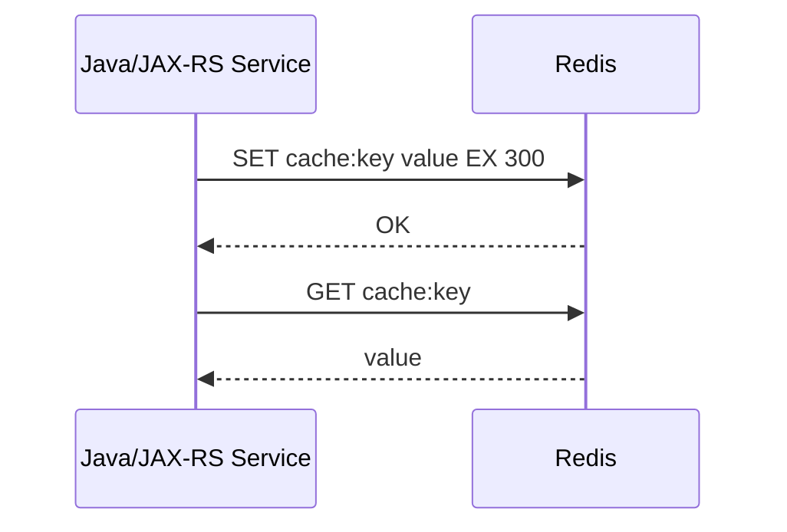
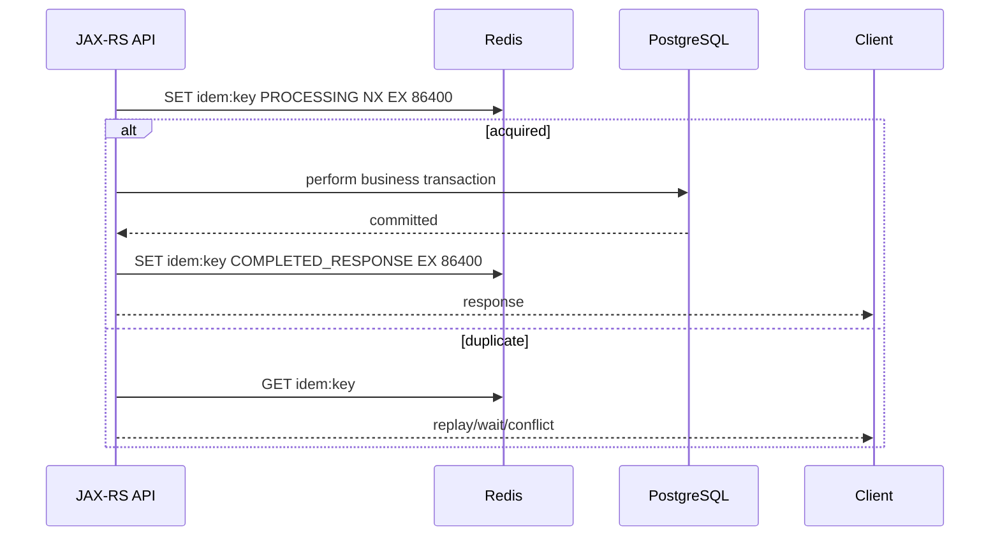
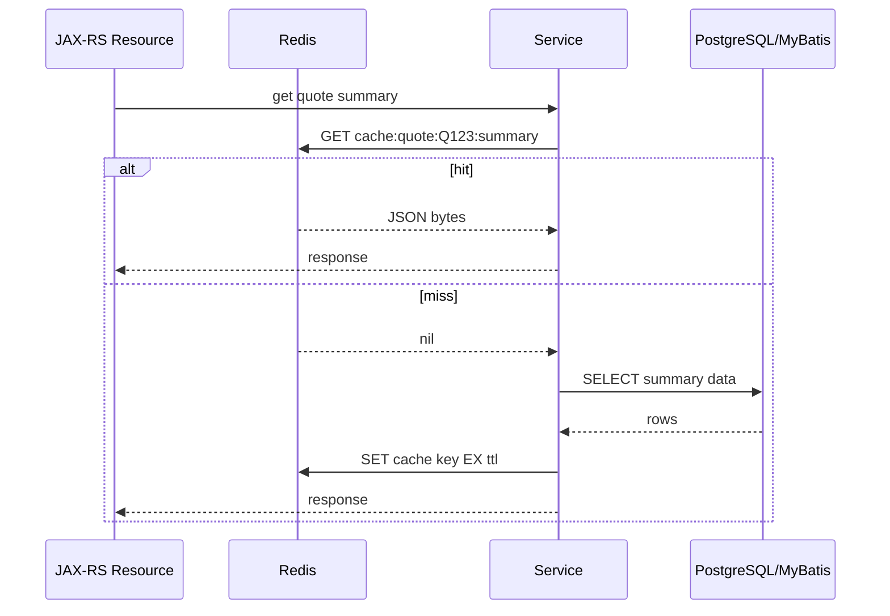

# Part 014 — Redis Strings

> Redis strings are simple only at the command level. In production systems, they often carry cache entries, counters, idempotency state, tokens, locks, and correctness boundaries.

This part focuses on Redis **strings** in enterprise Java/JAX-RS systems. Strings are the most common Redis value type and the foundation for many higher-level patterns: simple cache entry, atomic counter, rate limiter primitive, idempotency marker, token/session value, distributed lock value, and compact binary payload.

The goal is not to memorize every command. The goal is to understand when a Redis string is the right primitive, what correctness assumptions it creates, and how to review it safely in production code.

---

## 1. Core Idea

A Redis string is a binary-safe value stored at a key.

Despite the name, it can hold:

- text;
- JSON;
- numbers represented as strings;
- binary data;
- serialized Java objects;
- compressed payloads;
- tokens;
- lock values;
- small state-machine records.

Basic shape:

```text
key -> value
```

Examples:

```text
cache:quote:Q123:summary:v7 -> JSON payload
counter:tenant:acme:login-attempts:2026-07-11T10:15 -> "42"
idempotency:tenant:acme:key:abc123 -> JSON state record
lock:catalog:tenant:acme:refresh -> random owner token
session:S789 -> encrypted/serialized session payload
```

Senior review rule:

> Redis strings are excellent for one-key, one-value atomic operations. They become risky when the value grows, the lifecycle is unclear, or the value represents state that needs stronger durability than Redis provides.

---

## 2. Redis String Is Binary-Safe

Redis does not require the value to be human-readable text.

This means all of these are possible:

```text
SET key "hello"
SET key "{\"quoteId\":\"Q123\",\"status\":\"DRAFT\"}"
SET key <protobuf-bytes>
SET key <compressed-json-bytes>
```

For Java systems, this matters because the Redis client may expose values as:

- `String`;
- `byte[]`;
- `ByteBuffer`;
- codec-managed object;
- JSON-mapped DTO;
- framework cache abstraction value.

String design must include serialization decisions:

- encoding: UTF-8 or binary;
- serializer: Jackson, JSON-B, Protobuf, custom;
- compression: yes/no;
- versioning: explicit/implicit;
- null representation;
- compatibility across rolling deployments.

---

## 3. Basic GET and SET Lifecycle

The simplest lifecycle:



In application terms:

```java
Optional<QuoteSummary> getQuoteSummary(String quoteId) {
    String key = "cache:quote:" + quoteId + ":summary";
    byte[] bytes = redis.get(key);
    if (bytes == null) {
        return Optional.empty();
    }
    return Optional.of(serializer.deserialize(bytes, QuoteSummary.class));
}
```

Important production concerns:

- command timeout;
- payload size;
- deserialization failure;
- stale data;
- TTL;
- cache miss fallback;
- correlation ID in logs/traces;
- no sensitive value logging.

---

## 4. SET Options: NX, XX, EX, PX

`SET` is one of the most important Redis commands because modern `SET` can express conditional write and TTL behavior.

Common options:

```text
SET key value
SET key value EX seconds
SET key value PX milliseconds
SET key value NX
SET key value XX
SET key value NX EX seconds
SET key value NX PX milliseconds
```

Meaning:

| Option | Meaning | Common use |
|---|---|---|
| `EX` | TTL in seconds | cache entry, token, marker |
| `PX` | TTL in milliseconds | lock lease, precise short TTL |
| `NX` | only set if key does not exist | lock acquisition, idempotency marker |
| `XX` | only set if key already exists | conditional refresh/update |

Production review rule:

> For ephemeral state, value and TTL should usually be set in the same atomic command.

Avoid this pattern when atomic TTL is required:

```text
SET key value
EXPIRE key 300
```

If the process crashes between the two commands, the key may persist without TTL.

Prefer:

```text
SET key value EX 300
```

---

## 5. Redis String as Simple Cache Entry

A string is often the right choice for a complete cached object.

Example:

```text
cache:quote:Q123:summary:v3 -> JSON QuoteSummary
```

Good when:

- the object is small or moderate;
- the object is usually read as a whole;
- updates can replace the whole value;
- TTL applies to the whole object;
- serialization compatibility is managed;
- stale window is acceptable.

Risky when:

- object becomes large;
- partial updates are frequent;
- different fields have different TTLs;
- many consumers depend on different slices;
- rolling deployment changes payload schema;
- value contains PII without policy.

Decision question:

> Does the service need the whole object most of the time, or are we moving a large object because it is convenient?

---

## 6. Cache Entry Envelope

For production systems, storing raw domain JSON directly is often too weak. A cache envelope makes lifecycle and compatibility explicit.

Example:

```json
{
  "schemaVersion": 3,
  "payloadVersion": "catalog-v42",
  "createdAtEpochMs": 1783740000000,
  "freshUntilEpochMs": 1783740300000,
  "source": "quote-service",
  "payload": {
    "quoteId": "Q123",
    "status": "DRAFT"
  }
}
```

Benefits:

- schema version visible;
- stale-while-revalidate possible;
- payload version tied to domain version;
- debugging easier;
- source ownership clearer;
- migration safer.

Costs:

- more bytes;
- more serialization complexity;
- envelope compatibility must also be maintained.

Use envelopes where correctness, debugging, or compatibility matters.

---

## 7. Redis String as Counter

Redis strings can hold integer values and support atomic increment/decrement.

Commands:

```text
INCR key
DECR key
INCRBY key amount
DECRBY key amount
```

Example uses:

- login attempt counter;
- rate limiter fixed window counter;
- retry counter;
- failure count;
- sequence-like number where Redis durability is acceptable;
- lightweight per-tenant metric.

Example:

```text
INCR login:attempts:user:U123:window:202607111015
EXPIRE login:attempts:user:U123:window:202607111015 900
```

Better atomicity pattern may require Lua if `INCR` and `EXPIRE` must be bound only on first creation.

Problem pattern:

```text
INCR key
EXPIRE key 60
```

If every request resets expiry, the window may slide accidentally. If `EXPIRE` fails after first increment, the key may leak.

A fixed-window limiter typically needs:

```text
if INCR result == 1:
    EXPIRE key window
```

This is often implemented via Lua for atomicity.

---

## 8. Counter Correctness Concerns

Atomic `INCR` makes the increment itself safe, but it does not solve the whole design.

Questions:

- What is the counter scope?
- What is the time window?
- Does TTL start at first event or calendar boundary?
- What happens if Redis fails after increment?
- Is overcount acceptable?
- Is undercount acceptable?
- Does the counter need auditability?
- Does the value need to survive Redis restart?
- Can one tenant create unbounded counter keys?

For billing, compliance, or financial audit, Redis counters are usually not enough as the only source of truth.

For rate limiting, throttling, login attempt defense, and temporary counters, Redis strings are often appropriate.

---

## 9. Redis String as Token Store

String keys are common for expiring tokens.

Examples:

```text
password-reset:{tokenHash} -> userId or JSON metadata
csrf:{sessionId}:{tokenHash} -> marker
otp:{userId}:{purpose} -> hashed OTP metadata
refresh-token:{tokenHash} -> token state
```

Rules:

- never put raw secret token in key if avoidable;
- store token hash, not token plaintext;
- always use TTL;
- avoid logging full key if it contains token-like material;
- consider encryption or signing depending on sensitivity;
- define revocation semantics;
- define Redis outage behavior.

Example safer shape:

```text
password-reset:sha256:<tokenHash> -> {"userId":"U123","createdAt":...,"attempts":0}
TTL: 15 minutes
```

Security review question:

> If someone can see Redis keys, logs, metrics, backups, or crash dumps, what token/session information can they infer?

---

## 10. Redis String as Idempotency Primitive

Idempotency often starts with a string key and `SET NX`.

Example lifecycle:



String value can store:

```json
{
  "state": "PROCESSING",
  "requestHash": "...",
  "createdAtEpochMs": 1783740000000
}
```

or:

```json
{
  "state": "COMPLETED",
  "requestHash": "...",
  "httpStatus": 201,
  "responseBody": { "orderId": "O123" }
}
```

Correctness concerns:

- concurrent same idempotency key;
- same key with different request body;
- process crash after DB commit but before Redis completed state;
- Redis TTL expires while client retries;
- Redis unavailable during idempotency check;
- response payload too large;
- sensitive data in cached response.

This will be explored deeper in the idempotency parts, but strings are the base primitive.

---

## 11. Redis String as Lock Primitive

A Redis lock is often a string value with `SET NX PX`.

Acquire:

```text
SET lock:catalog:tenant:acme:refresh <unique-owner-token> NX PX 30000
```

Release must verify ownership:

```lua
if redis.call("GET", KEYS[1]) == ARGV[1] then
  return redis.call("DEL", KEYS[1])
else
  return 0
end
```

Do not release with plain `DEL` unless ownership does not matter.

Why unique value matters:

```text
1. Worker A acquires lock with value A, lease 30s.
2. Worker A pauses for 40s.
3. Lock expires.
4. Worker B acquires lock with value B.
5. Worker A resumes and calls DEL lock.
6. Without value check, A deletes B's lock.
```

Lock correctness requires more than `SET NX PX`:

- lease duration;
- critical section duration;
- GC pause;
- network partition;
- lock renewal;
- fencing token if protecting external state;
- safe unlock;
- failure behavior if lock cannot be acquired.

Strings provide the primitive. They do not provide the full correctness proof.

---

## 12. Redis String as Processing Marker

A processing marker is a temporary string that says “someone is working on this.”

Examples:

```text
processing:quote:Q123:reprice -> workerId
processing:tenant:acme:catalog-refresh -> jobId
singleflight:catalog:tenant:acme:rules:v42 -> pod/request id
```

Use cases:

- avoid duplicate expensive refresh;
- coordinate background job;
- implement single-flight cache reload;
- prevent duplicate event processing temporarily.

Risks:

- marker expires too early;
- marker TTL too long blocks recovery;
- process crashes and marker remains until TTL;
- marker is mistaken for durable state;
- no fencing token.

Marker design should include:

- owner value;
- TTL;
- reason/purpose;
- correlation/job ID;
- safe cleanup behavior;
- monitoring for stuck markers if relevant.

---

## 13. MGET and MSET

`MGET` and `MSET` reduce round trips for multiple string keys.

```text
MGET key1 key2 key3
MSET key1 value1 key2 value2 key3 value3
```

Useful when:

- fetching several independent cache entries;
- reducing network overhead;
- batch loading small values;
- warming cache.

Risks:

- large aggregate response;
- partial misses need careful handling;
- in Redis Cluster, multi-key commands require same slot unless client decomposes them;
- error behavior differs across clients;
- `MSET` has no per-key TTL in the basic command.

For cache fills with TTL, prefer pipelined `SET EX` or client-specific batch APIs when TTL differs per key.

Cluster concern:

```text
MGET user:1 user:2
```

May fail with cross-slot error in Redis Cluster unless keys are colocated or the client splits the command.

---

## 14. GETSET, GETDEL, and Atomic Read-Modify Patterns

Some Redis commands combine read and write.

Examples:

```text
GETSET key newValue
GETDEL key
GETEX key EX 300
```

Use cases:

- consume one-time token with `GETDEL`;
- rotate marker value;
- read old value while replacing;
- extend TTL while reading with `GETEX`.

Security-sensitive example:

```text
GETDEL password-reset:sha256:<tokenHash>
```

This can help ensure a token is consumed once.

Review concerns:

- Is command supported by the Redis version/managed service?
- Is behavior correct under retries?
- Does consuming on read create bad UX if downstream fails?
- Should consume happen before or after DB transaction?
- Does the command preserve or replace TTL as expected?

---

## 15. String Value Size Consideration

Redis strings can technically be large, but production systems should define much smaller practical limits.

Ask:

- How large is the p50/p95/p99 value?
- How large can it become for the largest tenant/customer?
- How often is it read?
- How expensive is deserialization?
- Does it cross network zones?
- Does it increase JVM GC pressure?
- Does it create big key risk?

Example risk:

```text
500 KB value × 200 requests/sec = 100 MB/sec response payload
```

Even with a 99% hit ratio, this may be a performance problem.

Good practice:

- record serialized payload size metrics by cache family;
- reject or avoid caching oversized values;
- split large objects;
- use compression only with measured trade-offs;
- avoid caching full domain aggregates if read path only needs a subset.

---

## 16. Compression Trade-Off

Compression can reduce Redis memory and network usage, but adds CPU and operational complexity.

Good candidates:

- large read-heavy payloads;
- payloads with repetitive JSON structure;
- cross-zone Redis traffic;
- memory-constrained environments.

Bad candidates:

- tiny values;
- hot values read extremely frequently by CPU-constrained pods;
- latency-sensitive paths where decompression p99 matters;
- data that is already compressed or encrypted;
- values requiring easy manual inspection.

Review questions:

- What compression algorithm is used?
- Is compression threshold defined?
- Is payload versioned with compression metadata?
- Can old and new deployments read both compressed/uncompressed values?
- Is decompression failure handled as cache miss?
- Are metrics split by compressed vs uncompressed size?

---

## 17. Null and Negative Cache Values

A string can represent “not found” to avoid repeated DB lookups.

Example:

```text
cache:customer:C404 -> {"state":"NEGATIVE","createdAt":...}
TTL: 30 seconds
```

Do not confuse:

```text
Redis miss
```

with:

```text
cached negative result
```

Why this matters:

- Redis miss may require DB lookup;
- negative cache hit should return not found quickly;
- negative cache TTL should usually be short;
- invalidation after create must delete negative cache;
- negative cache can hide newly created data if TTL too long.

Java wrapper should model this explicitly:

```java
sealed interface CacheLookup<T> {
    record Hit<T>(T value) implements CacheLookup<T> {}
    record Negative<T>() implements CacheLookup<T> {}
    record Miss<T>() implements CacheLookup<T> {}
}
```

---

## 18. String TTL Discipline

Most string use cases should have explicit TTL.

| Use case | TTL expectation |
|---|---|
| cache entry | yes, based on freshness/staleness requirement |
| token | yes, security-driven |
| idempotency record | yes, retry-window-driven |
| lock | yes, lease-driven |
| processing marker | yes, recovery-driven |
| rate limiter counter | yes, window-driven |
| permanent config pointer | maybe no, but must be documented |

No-expiry strings are dangerous when they represent temporary state.

Production smell:

```text
idempotency:* keys with no TTL
lock:* keys with no TTL
rate:* keys with no TTL
processing:* keys with no TTL
password-reset:* keys with no TTL
```

---

## 19. Java Client Patterns

A good Redis string wrapper should make unsafe behavior hard.

Example interface:

```java
public interface RedisStringStore {
    Optional<byte[]> get(String key);

    void set(String key, byte[] value, Duration ttl);

    boolean setIfAbsent(String key, byte[] value, Duration ttl);

    boolean setIfPresent(String key, byte[] value, Duration ttl);

    long increment(String key, Duration ttlIfNew);

    Optional<byte[]> getAndDelete(String key);
}
```

Design choices:

- require TTL for ephemeral methods;
- separate persistent set method and make it rare;
- centralize serialization;
- centralize metrics;
- normalize key pattern tags;
- apply timeout and circuit breaker;
- prevent raw key logging.

Avoid scattering raw Redis command calls throughout resource/service classes.

---

## 20. Error Handling in JAX-RS Request Flow

Redis string operations can fail in several ways:

- timeout;
- connection refused;
- MOVED/ASK cluster redirection issue;
- authentication failure;
- serialization failure;
- deserialization failure;
- value too large;
- command rejected by ACL;
- Redis unavailable;
- partial failure around DB transaction.

Handling depends on use case:

| Use case | Redis failure behavior |
|---|---|
| optional cache | bypass Redis and load DB if safe |
| rate limiter | fail open or fail closed by policy |
| idempotency | usually fail safely, avoid duplicate side effect |
| lock | do not enter critical section if lock cannot be acquired |
| token/session | likely fail closed or degrade carefully |
| feature flag cache | safe default required |

Do not apply one global Redis fallback rule to all string keys.

---

## 21. PostgreSQL/MyBatis Interaction

String cache entries often wrap PostgreSQL data.

Common flow:



Review concerns:

- cache fill query must be bounded and indexed;
- cache miss path must not overload DB;
- DB transaction and Redis write are not atomic together;
- cache value schema must follow DB schema evolution;
- invalidation after DB write must be explicit;
- stale string cache may serve old DB state.

---

## 22. Kafka/RabbitMQ Interaction

String keys can be updated or invalidated by messaging consumers.

Examples:

```text
Kafka event: ProductUpdated
Consumer: DEL cache:product:P123:v42 or SET cache projection

RabbitMQ event: QuoteRepriced
Consumer: SET cache:quote:Q123:summary EX 1800
```

Failure modes:

- duplicate event rewrites value;
- out-of-order event overwrites newer value;
- consumer lag causes stale cache;
- invalidation message lost if using non-durable Pub/Sub;
- projection rebuild writes oversized string values;
- event replay creates Redis write storm.

Mitigations:

- version field inside value;
- compare event version before update;
- idempotent consumer;
- bounded payload size;
- rebuild throttling;
- metrics for projection lag.

---

## 23. Kubernetes and Cloud Concerns

Redis string access from Kubernetes workloads has operational implications.

### 23.1 Connection pool per pod

If each pod has a pool of 50 connections and there are 40 pods:

```text
2,000 possible Redis connections
```

Hot string keys can make all pods hammer the same Redis shard.

### 23.2 Large value and pod CPU

Large string values can increase:

- application CPU;
- deserialization time;
- GC pressure;
- sidecar overhead;
- p99 latency.

### 23.3 Rollout warmup

New pods may fetch the same config/cache string at startup. Without jitter or pre-warming control, rollout can create a mini stampede.

### 23.4 Cloud-managed Redis limits

Managed Redis may enforce limits around:

- max connections;
- bandwidth;
- command latency;
- TLS overhead;
- node size;
- cluster mode behavior;
- failover semantics.

Internal verification must check the actual service tier and topology.

---

## 24. Security and Privacy Concerns

Strings often contain the most sensitive Redis values.

Potential sensitive content:

- session state;
- refresh token state;
- password reset metadata;
- idempotent response body;
- quote/customer data;
- pricing data;
- tenant configuration;
- user identifiers;
- entitlement decisions.

Rules:

- avoid PII in key names;
- avoid raw secrets in values;
- apply TTL to sensitive temporary data;
- encrypt/sign highly sensitive payloads if required by policy;
- restrict ACL by key pattern and command category;
- redact logs;
- understand backup/snapshot exposure;
- define deletion/retention behavior.

A Redis string is not automatically safe because it is “just cache.”

---

## 25. Observability for String Usage

Useful metrics:

```text
redis.string.get.count{pattern}
redis.string.set.count{pattern}
redis.string.hit.count{cache}
redis.string.miss.count{cache}
redis.string.value.bytes{pattern}
redis.string.deserialize.error.count{pattern}
redis.string.timeout.count{operation,pattern}
redis.string.set_if_absent.success.count{pattern}
redis.string.set_if_absent.conflict.count{pattern}
redis.string.increment.count{pattern}
```

Useful logs should include:

- normalized key pattern;
- operation;
- duration;
- payload size bucket;
- result: hit/miss/conflict/error;
- correlation ID;
- exception type.

Avoid logging:

- raw keys with PII/token material;
- raw values;
- serialized payloads;
- secrets;
- full idempotent response bodies.

---

## 26. Production Debugging

Common symptoms and likely causes:

| Symptom | Possible cause | Check |
|---|---|---|
| key missing unexpectedly | TTL too short, eviction, wrong key version | TTL, eviction metrics, key builder |
| key never expires | SET then EXPIRE race, missing TTL | TTL sampling, code path |
| duplicate processing | SET NX not used, TTL expired, non-atomic state update | idempotency/lock flow |
| lock stuck | no TTL or renewal bug | lock key TTL, owner value |
| lock released by wrong worker | plain DEL without value check | unlock script |
| high latency on hit | large value/deserialization | payload size metrics |
| rate limiter memory growth | counter keys no TTL | key scan sample, TTL |
| token still valid too long | TTL or revocation bug | token key TTL, auth flow |
| MOVED/ASK errors | client not cluster-aware | client config |

Safe debugging flow:

```text
1. Identify key pattern from application logs/metrics.
2. Confirm operation type: GET, SET, SET NX, INCR, MGET.
3. Check Redis latency/slowlog/command stats.
4. Sample TTL and memory usage for known non-sensitive key.
5. Check application serializer errors.
6. Check deployment/release/event timeline.
7. Check fallback behavior and customer impact.
```

---

## 27. String Usage Decision Checklist

Use Redis string when:

- one key maps naturally to one value;
- whole value is read/written together;
- TTL applies to the whole value;
- value size is bounded;
- atomic `SET NX`, `INCR`, or `GETDEL` is useful;
- Redis durability is sufficient for the use case;
- serialization compatibility is controlled.

Consider hash when:

- fields are accessed independently;
- partial updates matter;
- value is object-like but still bounded;
- field-level TTL is not required or is handled differently.

Consider sorted set when:

- ordering by score/time matters;
- sliding windows or delayed jobs are needed.

Consider stream when:

- durable-ish queue/event log semantics are needed;
- consumer groups and acknowledgments matter.

Consider PostgreSQL/Kafka/RabbitMQ when:

- strong durability/audit/replay/transactional guarantees are required;
- Redis would become source of truth accidentally.

---

## 28. PR Review Checklist

### Key and lifecycle

- What is the key pattern?
- Is it tenant/entity/version scoped?
- Does it contain PII or secrets?
- Does it have TTL?
- Is no-TTL intentional and documented?

### Value

- What is serialized format?
- Is schema version included?
- What is expected and max value size?
- Can old and new deployments read it?
- Is compression used? If yes, is it measured?

### Command correctness

- Is `SET EX/PX` used atomically with TTL?
- Is `SET NX` used for lock/idempotency acquisition?
- Is unlock protected by value check?
- Are `INCR` and TTL bound correctly?
- Are `MGET/MSET` safe in Cluster mode?

### Failure behavior

- What happens if Redis is unavailable?
- What happens if Redis is slow?
- What happens if deserialization fails?
- What happens if DB commit succeeds but Redis write fails?
- What happens if TTL expires during retry?

### Observability

- Are hit/miss/error/timeout metrics present?
- Is payload size measured?
- Are raw values excluded from logs?
- Is key pattern normalized?
- Are conflicts for `SET NX` tracked?

---

## 29. Internal Verification Checklist

Use this against the actual CSG/team codebase and runtime environment.

### Codebase

- Find string key patterns in Redis wrapper/client usage.
- Identify raw `SET`, `GET`, `INCR`, `MGET`, `SETNX`, `GETDEL` usage.
- Confirm TTL is set atomically for ephemeral keys.
- Confirm lock/idempotency keys use unique owner/request values.
- Confirm serializers are explicit and version-aware.

### Redis client configuration

- Check sync vs async usage for string commands.
- Check command timeout.
- Check pool size and total connection count.
- Check cluster/sentinel support.
- Check metrics exported by operation and key pattern.

### Cache and correctness

- Confirm cache miss fallback.
- Confirm invalidation path.
- Confirm negative cache representation.
- Confirm stale value behavior.
- Confirm DB transaction boundary around cache writes.

### Security/privacy

- Check token/session/idempotency values for sensitive data.
- Check key names for PII or secrets.
- Check TTL on sensitive state.
- Check log redaction.
- Check ACL key pattern restrictions if available.

### Operations

- Check payload size dashboards.
- Check timeout/error dashboards.
- Check big key detection for string values.
- Check runbook for missing/stale/oversized string keys.
- Ask SRE/platform about production-safe commands.

---

## 30. Anti-Patterns

### Anti-pattern 1 — SET then EXPIRE for required TTL

```text
SET lock:key value
EXPIRE lock:key 30
```

If the app crashes between commands, the lock may never expire.

Prefer:

```text
SET lock:key value NX PX 30000
```

### Anti-pattern 2 — Plain DEL unlock

```text
DEL lock:key
```

This can delete another owner’s lock after lease expiry/reacquire.

Prefer value-check Lua unlock.

### Anti-pattern 3 — Huge JSON aggregate

```text
SET tenant:acme:catalog:all <50MB JSON>
```

This creates big key, network, deserialization, and invalidation risk.

### Anti-pattern 4 — Counter without TTL

```text
INCR rate:user:U123:endpoint:quote
```

This leaks keys and creates unbounded memory growth.

### Anti-pattern 5 — Raw token in key

```text
password-reset:raw-token-value
```

Keys appear in logs, metrics, scans, backups, and operational tooling. Use hashes and redaction.

### Anti-pattern 6 — Treating Redis string as durable workflow state

Redis can be configured with persistence, but string values should not silently become the only record of business-critical workflow state unless durability, backup, recovery, and audit requirements are explicitly accepted.

---

## 31. Senior Engineer Mental Model

When reviewing a Redis string, classify it first:

```text
Is this string a cache entry?
Is it a counter?
Is it a token/security value?
Is it an idempotency record?
Is it a lock/lease?
Is it a processing marker?
Is it a config pointer?
Is it accidental source of truth?
```

Then ask:

```text
What is the TTL?
What is the value size?
What is the serialization contract?
What is the failure behavior?
What is the concurrency behavior?
What is the security/privacy impact?
What is the observability signal?
What happens during rolling deployment?
What happens during Redis failover?
```

The same Redis type can represent very different correctness requirements. A cache string and a lock string must not be reviewed with the same mental model.

---

## 32. Part Summary

Redis strings are the most common and most versatile Redis primitive.

Key takeaways:

- strings are binary-safe one-key/one-value records;
- `SET` options are essential for TTL, conditional writes, locks, and idempotency;
- `INCR/DECR` are atomic counters but require lifecycle design;
- `MGET/MSET` reduce round trips but have cluster and payload concerns;
- strings are good for simple cache entries, tokens, markers, counters, locks, and idempotency records;
- value size, serialization, TTL, and failure behavior must be explicit;
- sensitive values require security/privacy review;
- Redis strings can accidentally become source-of-truth state if durability boundaries are not defined.

The next part focuses on **Redis Hashes**, which are useful for object-like data, sparse maps, tenant config, and partial field access, but come with their own TTL, large hash, and serialization trade-offs.
