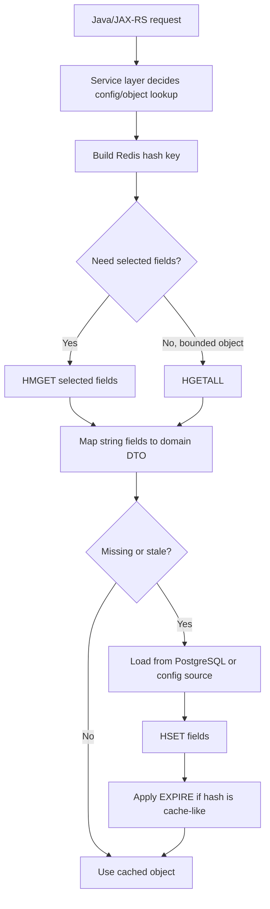
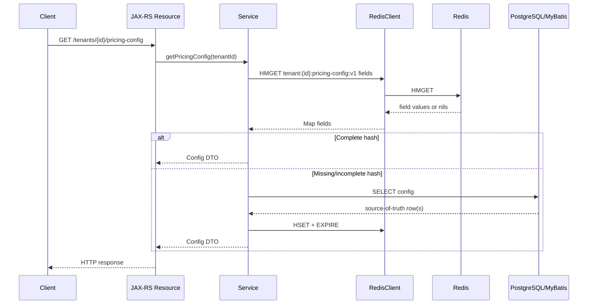

# Part 015 — Redis Hashes

Redis Hashes are often the first Redis structure that feels natural to Java engineers because they resemble a `Map<String, String>` or a partial object document. That intuition is useful, but incomplete.

A Redis Hash is not a relational row, not a JSON document with schema validation, and not a free replacement for PostgreSQL. It is a compact field-value container stored under one Redis key.

Use Hashes when you need **field-level access**, **small object-like data**, **sparse maps**, or **configuration-like data** where the entire object belongs to one lifecycle.

Avoid Hashes when the object grows unbounded, when each field needs independent TTL, when you need complex querying, or when PostgreSQL should remain the authoritative model.

---

## 1. Core Mental Model

A Redis Hash is:

```text
redis key -> hash container -> field -> value
```

Example:

```text
tenant:acme:config
  currency        -> USD
  pricingMode     -> RULE_BASED
  quoteExpiryDays -> 30
  enabled         -> true
```

Conceptually:

```java
Map<String, String> tenantConfig = Map.of(
    "currency", "USD",
    "pricingMode", "RULE_BASED",
    "quoteExpiryDays", "30",
    "enabled", "true"
);
```

But in production Redis thinking, the important unit is still the **Redis key**, not the field.

The key has:

- ownership
- namespace
- TTL behavior
- memory footprint
- eviction risk
- access pattern
- operational visibility

The fields are only internal members of that key.

---

## 2. Why Hashes Exist

Hashes exist to solve a specific problem:

> Store multiple related small values under one Redis key while allowing partial read/write access.

They are useful when you do not want to serialize/deserialize a full object for every small update.

For example, if a tenant configuration has 20 fields but the service frequently reads only 3 fields, a Hash can avoid loading the entire serialized JSON object.

However, this benefit only matters if:

- field-level access is actually used
- the hash remains bounded
- field names are stable
- all fields share the same lifecycle
- serialization remains simple

If every read always fetches the whole object and every write replaces the whole object, a JSON string may be simpler.

---

## 3. Basic Commands

### 3.1 HSET

Set one or more fields:

```redis
HSET tenant:acme:config currency USD pricingMode RULE_BASED quoteExpiryDays 30
```

In modern Redis, `HSET` can set multiple fields. Older `HMSET` exists historically but is generally treated as legacy-style awareness.

### 3.2 HGET

Get one field:

```redis
HGET tenant:acme:config currency
```

### 3.3 HMGET

Get selected fields:

```redis
HMGET tenant:acme:config currency pricingMode quoteExpiryDays
```

### 3.4 HGETALL

Get all fields:

```redis
HGETALL tenant:acme:config
```

`HGETALL` is safe only when the hash is known to be small and bounded. For large hashes, it can cause latency spikes and network amplification.

### 3.5 HDEL

Delete one or more fields:

```redis
HDEL tenant:acme:config deprecatedField legacyFlag
```

### 3.6 HEXISTS

Check whether a field exists:

```redis
HEXISTS tenant:acme:config pricingMode
```

### 3.7 HINCRBY

Increment an integer field:

```redis
HINCRBY tenant:acme:usage quoteCreatedCount 1
```

### 3.8 HSCAN

Iterate fields safely:

```redis
HSCAN tenant:acme:config 0 COUNT 100
```

`HSCAN` is preferred over `HGETALL` when the hash can become large.

---

## 4. Hash Lifecycle

A typical Hash lifecycle looks like this:



The correctness questions are:

- Who owns the key?
- What is the source of truth?
- Does the hash need TTL?
- Are all fields refreshed together?
- Can partial updates produce mixed-version objects?
- Can old fields remain forever after schema evolution?

---

## 5. Hash as Object Cache

A common pattern is caching a small object as a Hash.

Example domain object:

```java
public record TenantPricingConfig(
    String tenantId,
    String currency,
    String pricingMode,
    int quoteExpiryDays,
    boolean discountEnabled
) {}
```

Possible Redis representation:

```text
key: tenant:{tenantId}:pricing-config:v1
fields:
  currency -> USD
  pricingMode -> RULE_BASED
  quoteExpiryDays -> 30
  discountEnabled -> true
```

Useful when:

- fields are simple scalars
- partial reads are common
- partial updates are safe
- object size is small
- all fields share one TTL/lifecycle

Risky when:

- nested object graphs appear
- field count grows without bound
- different fields come from different source-of-truth systems
- partial updates can create inconsistent object versions
- field-level TTL is required

---

## 6. Hash as Sparse Map

Hashes are good for sparse maps where not every possible field exists.

Example:

```text
quote:{quoteId}:calculation-flags
  taxCalculated        -> true
  discountEvaluated    -> true
  eligibilityChecked   -> false
```

This can be useful for short-lived workflow state, but be careful: if workflow state is business-critical, Redis may not be durable enough unless persistence and recovery are explicitly designed.

Good sparse-map use cases:

- temporary calculation flags
- short-lived request/session metadata
- cached config attributes
- transient worker progress markers
- small per-tenant feature capability map

Bad sparse-map use cases:

- authoritative order state
- regulatory/audit lifecycle state
- long-lived workflow state with compliance value
- unbounded per-user/per-event maps

---

## 7. Hash as Tenant Configuration Cache

Tenant configuration is a common fit for Redis Hashes.

Example:

```text
tenant:acme:config:v3
  currency             -> USD
  billingTimezone      -> America/New_York
  quoteExpiryDays      -> 30
  maxQuoteLineItems    -> 500
  discountApprovalMode -> MANAGER_REQUIRED
```

Why Hash can fit:

- tenant config is read frequently
- fields are usually scalar
- source of truth is elsewhere
- TTL can protect against stale config
- selected fields can be read without loading everything

Correctness concerns:

- stale config may affect quote/order behavior
- config versioning must be explicit
- default values must be safe
- config invalidation must be observable
- partial updates must not mix old and new config versions

A safer pattern is to include a version field:

```text
tenant:acme:config:v3
  _schemaVersion -> 3
  _sourceVersion -> 2026-07-11T10:00:00Z
  currency -> USD
  quoteExpiryDays -> 30
```

The Java mapper can reject unsupported schema versions.

---

## 8. Field TTL Limitation

Redis Hashes do not generally behave like independent TTL containers per field. The TTL belongs to the Redis key.

This matters a lot.

If you store this:

```text
user:123:security-state
  passwordResetToken -> abc
  mfaChallenge       -> def
  loginAttemptCount  -> 3
```

You may want different expirations:

- password reset token: 15 minutes
- MFA challenge: 5 minutes
- login attempt counter: 1 hour

A single Hash key TTL cannot model these independently.

Better options:

```text
user:123:password-reset-token -> abc   TTL 15m
user:123:mfa-challenge        -> def   TTL 5m
user:123:login-attempt-count  -> 3     TTL 1h
```

Or use separate keys with explicit TTL discipline.

Use Hashes only when fields share the same lifecycle.

---

## 9. Partial Update Risk

Hashes make partial updates easy:

```redis
HSET tenant:acme:config quoteExpiryDays 45
```

This can be good for operational efficiency.

It can also be dangerous.

Potential issue:

```text
field A updated from config version 10
field B still from config version 9
field C deleted in source but still present in Redis
```

The Java service may now construct a logically impossible object.

For config-like data, safer approaches include:

1. Write all fields together.
2. Include `_sourceVersion`.
3. Delete old hash before writing new hash, if safe.
4. Use versioned keys.
5. Treat cache update as replace, not patch, unless patch semantics are proven safe.

Example versioned key:

```text
tenant:acme:config:v10
```

Then update a pointer key:

```text
tenant:acme:config:current -> v10
```

This adds complexity but reduces mixed-version reads.

---

## 10. Hash vs JSON String

A frequent design decision:

> Should this object be stored as a Redis Hash or as a serialized JSON string?

### Prefer Hash when

- fields are simple scalars
- partial reads/writes matter
- field-level counters are useful
- object size is bounded
- fields share one TTL
- schema evolution is controlled

### Prefer JSON String when

- object is naturally nested
- object is always read/written as a whole
- versioned payload compatibility matters
- you want one serialization boundary
- you want to avoid leftover old fields
- you want the cached value to mirror API/DTO shape

### Prefer PostgreSQL when

- this is source-of-truth data
- you need queryability
- you need transactions
- you need auditability
- you need referential integrity
- you need long-term retention

---

## 11. Java Mapping Pattern

A Redis Hash returns strings or bytes depending on the client/serializer.

A disciplined Java mapper should:

- treat missing required fields as cache miss or error
- validate schema version
- parse numeric fields explicitly
- parse booleans explicitly
- handle enum evolution
- avoid silent defaulting for correctness-sensitive fields
- avoid leaking Redis field names into domain logic everywhere

Example sketch:

```java
public final class TenantConfigRedisMapper {

    public TenantPricingConfig fromHash(String tenantId, Map<String, String> fields) {
        requireField(fields, "_schemaVersion");
        requireField(fields, "currency");
        requireField(fields, "pricingMode");
        requireField(fields, "quoteExpiryDays");

        int schemaVersion = parseInt(fields.get("_schemaVersion"), "_schemaVersion");
        if (schemaVersion != 1) {
            throw new UnsupportedCachedPayloadException("Unsupported tenant config schema: " + schemaVersion);
        }

        return new TenantPricingConfig(
            tenantId,
            fields.get("currency"),
            fields.get("pricingMode"),
            parseInt(fields.get("quoteExpiryDays"), "quoteExpiryDays"),
            parseBoolean(fields.getOrDefault("discountEnabled", "false"), "discountEnabled")
        );
    }

    private static void requireField(Map<String, String> fields, String name) {
        if (!fields.containsKey(name)) {
            throw new CachePayloadIncompleteException("Missing Redis hash field: " + name);
        }
    }

    private static int parseInt(String value, String fieldName) {
        try {
            return Integer.parseInt(value);
        } catch (RuntimeException ex) {
            throw new CachePayloadInvalidException("Invalid integer Redis hash field: " + fieldName, ex);
        }
    }

    private static boolean parseBoolean(String value, String fieldName) {
        if ("true".equalsIgnoreCase(value)) return true;
        if ("false".equalsIgnoreCase(value)) return false;
        throw new CachePayloadInvalidException("Invalid boolean Redis hash field: " + fieldName);
    }
}
```

The exact exception names are illustrative. In production, map these to fallback/cache-miss behavior where appropriate.

---

## 12. Java/JAX-RS Lifecycle Impact

A Redis Hash read inside a JAX-RS request should respect the same engineering rules as any remote call.

Request path:



Important concerns:

- Redis timeout must be lower than request timeout.
- Cache failure should not always become HTTP 500.
- Incomplete hash may mean partial write, eviction, schema drift, or deployment mismatch.
- Cache fill should not overload PostgreSQL during mass expiry.
- Observability must include cache miss reason when possible.

---

## 13. PostgreSQL/MyBatis/JDBC Interaction

A Hash is often a cache over PostgreSQL data.

The source-of-truth decision must be explicit:

```text
PostgreSQL: authoritative tenant_config table
Redis Hash: derived cache
Java service: validates and maps cached fields
```

Common anti-pattern:

```text
Update Redis Hash field first
Then update PostgreSQL
Assume both are consistent
```

Safer write path:

1. Start DB transaction.
2. Update PostgreSQL source-of-truth.
3. Commit transaction.
4. Invalidate or refresh Redis Hash.
5. If Redis update fails, rely on TTL/eventual refresh and emit observability signal.

For MyBatis/JDBC, pay attention to transaction boundary. A cache update before DB commit can expose data that later rolls back.

---

## 14. Kafka/RabbitMQ Interaction

Hashes are often refreshed through messaging.

Example:

```text
TenantConfigUpdated event -> consumer -> HSET tenant config hash
```

Failure modes:

- duplicate events reapply old fields
- out-of-order events overwrite newer config with older config
- partial event updates create mixed-version hash
- Redis write succeeds but consumer crashes before ack
- broker ack succeeds but Redis write fails
- missing invalidation causes stale config

Safer event-driven hash update:

- include source version in event
- compare version before applying update
- prefer full object replacement when possible
- make update idempotent
- log update failures with tenant/key/version
- expose projection lag metric

---

## 15. Kubernetes, Cloud, and On-Prem Impact

Hashes are not operationally isolated from deployment topology.

### Kubernetes concerns

- many pods may read the same hash and create hot key behavior
- rolling deployment may mix old/new field expectations
- connection pool per pod affects Redis load
- cache warming may occur during restart storms
- CPU throttling in Java pods may amplify Redis timeouts

### Cloud Redis concerns

- maxmemory/eviction policy may delete hash keys
- failover can produce brief timeouts
- cluster mode affects multi-key operations but single Hash key remains slot-local
- managed service metrics must include memory, command latency, and evictions

### On-prem concerns

- persistence and backup choices affect whether hash-backed state survives restart
- network latency and firewall rules affect client behavior
- operational ownership must be clear

---

## 16. Failure Modes

### 16.1 Missing Hash

Possible causes:

- expired key
- evicted key
- never filled
- wrong namespace/environment prefix
- deployment changed key version
- Redis failover lost recent write

Treatment:

- if cache-like: load from source of truth
- if state-like: evaluate whether data loss is acceptable
- log with key pattern, not sensitive full key if it contains PII

### 16.2 Missing Field

Possible causes:

- partial write
- schema evolution
- old producer version
- field deleted in source but still expected by reader
- wrong mapper version

Treatment:

- treat required field missing as invalid payload
- fallback to DB/config source where safe
- increment metric for invalid cached hash

### 16.3 Stale Field

Possible causes:

- invalidation failure
- out-of-order event
- partial update
- missing version check
- TTL too long

Treatment:

- include source version
- invalidate on write
- use versioned keys for critical config

### 16.4 Large Hash

Possible causes:

- unbounded field creation
- per-user/per-event data placed under one key
- missing cleanup
- misuse as mini-database

Treatment:

- redesign key model
- split by tenant/entity/time bucket
- use PostgreSQL if queryability/source-of-truth is needed
- use `HSCAN` for operational inspection

### 16.5 Hot Hash

Possible causes:

- global config key read by every request
- tenant config for very large tenant
- feature flag hash hit on every request

Treatment:

- add local cache with short TTL
- shard if appropriate
- use stale-while-revalidate
- reduce per-request Redis dependency

---

## 17. Debugging Checklist

When a Redis Hash behaves incorrectly, ask:

1. Is the key correct?
2. Is the environment/service/tenant prefix correct?
3. Does the key exist?
4. Does the key have TTL?
5. What is the key type?
6. Are required fields present?
7. Are field values parseable by the current Java version?
8. Is `_schemaVersion` or source version present?
9. Is the hash stale compared to PostgreSQL/source system?
10. Was there a recent deployment or schema change?
11. Was there a Redis eviction/failover/restart?
12. Are Kafka/RabbitMQ invalidation events delayed or failing?
13. Is the hash too large?
14. Is the hash a hot key?
15. Are errors mapped to fallback or user-visible failure?

Production-safe commands, used carefully:

```redis
TYPE tenant:acme:config:v1
TTL tenant:acme:config:v1
HLEN tenant:acme:config:v1
HMGET tenant:acme:config:v1 _schemaVersion _sourceVersion currency pricingMode
HSCAN tenant:acme:config:v1 0 COUNT 20
```

Avoid blind `HGETALL` on unknown large hashes in production.

---

## 18. Performance Concerns

Hashes can be efficient, but only under bounded design.

Watch for:

- large field count
- large field values
- frequent `HGETALL`
- hash used as an unbounded per-tenant bucket
- repeated per-request `HMGET` without local cache
- serialization/parsing cost in Java
- network payload size
- hash hot key in Redis Cluster

Good practice:

- read only needed fields
- keep hash bounded
- document expected max field count
- use local cache for ultra-hot config
- measure hit rate and latency
- avoid field names with unbounded dynamic cardinality unless intentionally designed

---

## 19. Correctness Concerns

Hash correctness questions:

- Are all fields from the same source version?
- Can partial updates create impossible state?
- What happens if Redis write fails after DB commit?
- What happens if DB commit fails after Redis write?
- Is stale data acceptable?
- Is missing field treated safely?
- Is schema evolution backward compatible?
- Does TTL match business freshness requirement?
- Are old fields cleaned up?

For CPQ/order systems, stale or mixed-version config can affect pricing, eligibility, quote expiry, discount behavior, or order validation. That can become business-visible, not merely technical.

---

## 20. Security and Privacy Concerns

Hashes may contain sensitive values.

Avoid:

```text
user:john.doe@example.com:profile
```

Prefer opaque identifiers:

```text
user:8f2a...:profile
```

Security checklist:

- no PII in key names
- sensitive fields encrypted or avoided where required
- TTL for sensitive transient data
- ACL limits key patterns by service
- logs do not print full sensitive hash values
- backup/snapshot access is controlled
- operational commands are restricted

If a hash contains token/session/security state, treat it as high sensitivity.

---

## 21. Observability Concerns

Useful metrics:

- hash cache hit/miss
- invalid cached payload count
- missing required field count
- parse failure count
- cache fill latency
- PostgreSQL fallback count
- hash key cardinality by pattern
- Redis command latency for `HGET/HMGET/HSET/HSCAN`
- evicted keys
- expired keys
- hot key indicators

Useful log fields:

```text
redis.operation=HMGET
redis.keyPattern=tenant:{tenantId}:config:v1
redis.hit=false
redis.missReason=missing_required_field
redis.schemaVersion=unknown
correlationId=...
```

Avoid logging raw values when they may contain sensitive data.

---

## 22. Hash Usage Decision Table

| Use case | Hash fit? | Notes |
|---|---:|---|
| Small tenant config cache | Good | Add schema/source version and TTL. |
| Object cache always read as whole | Maybe | JSON string may be simpler. |
| Partial counters per entity | Good | Use `HINCRBY`, keep bounded. |
| Independent expiring fields | Poor | Use separate keys. |
| Large dynamic user map | Risky | Can become big key. |
| Source-of-truth business state | Poor | Prefer PostgreSQL. |
| Security token collection | Risky | TTL and field lifecycle mismatch. |
| Feature capability map | Good if bounded | Watch stale config and invalidation. |

---

## 23. PR Review Checklist

When reviewing Redis Hash usage, ask:

### Data model

- Is Hash the right structure vs JSON string or PostgreSQL?
- Is the hash bounded?
- Are fields stable and documented?
- Do all fields share the same lifecycle?

### Key design

- Is the key namespace clear?
- Does the key include service/tenant/entity/version where needed?
- Does the key avoid PII?
- Is ownership documented?

### TTL and invalidation

- Does the key need TTL?
- Is TTL applied after `HSET`?
- Is TTL refreshed intentionally or accidentally?
- Is invalidation explicit?

### Compatibility

- Is schema version stored?
- Are missing fields handled safely?
- Is enum/date/decimal parsing safe?
- Is rolling deployment safe?

### Performance

- Is `HGETALL` avoided for large/unknown hashes?
- Is field count bounded?
- Is hot key risk considered?
- Are Redis metrics available?

### Correctness

- Can partial update create mixed-version data?
- Is PostgreSQL/source-of-truth boundary clear?
- Are event-driven updates idempotent and versioned?
- What happens on Redis write failure?

### Security/privacy

- Are sensitive fields avoided or protected?
- Are raw hash values logged?
- Are ACL patterns appropriate?

---

## 24. Internal Verification Checklist

Use this checklist in the actual codebase/team context.

### Codebase

- Search for `HGET`, `HMGET`, `HGETALL`, `HSET`, `HDEL`, `HSCAN`, `HINCRBY`.
- Identify every Redis Hash key pattern.
- Map each key pattern to owning service/team.
- Check whether hashes are accessed through a wrapper or directly.
- Check whether mappers validate required fields.

### Redis client configuration

- Confirm serializer for hash keys, fields, and values.
- Confirm timeout for hash commands.
- Confirm pipeline/batch usage if many hash fields are fetched.
- Confirm metrics capture hash command latency.

### Key naming and lifecycle

- Confirm environment/service/tenant/entity/version prefix.
- Confirm TTL policy.
- Confirm no PII in key or field name.
- Confirm expected max field count.

### Cache invalidation

- Confirm invalidation trigger.
- Confirm whether Kafka/RabbitMQ events update hash.
- Confirm duplicate/out-of-order event handling.
- Confirm source version checks.

### Production operations

- Confirm dashboard can detect big hash/hot hash.
- Confirm safe debugging commands are documented.
- Confirm incident notes mention hash-related failures.
- Confirm platform/SRE understands whether hash data is disposable cache or important state.

---

## 25. Summary

Redis Hashes are useful when you need bounded, field-addressable, object-like data under one Redis key.

They are dangerous when they become:

- unbounded maps
- source-of-truth records
- mixed-version object containers
- independent TTL collections
- silent schema compatibility traps
- big keys or hot keys

For enterprise Java/JAX-RS systems, use Hashes deliberately:

```text
small + bounded + same lifecycle + field-level access + clear source of truth = good Hash candidate
```

If those conditions are not true, reconsider the structure.
