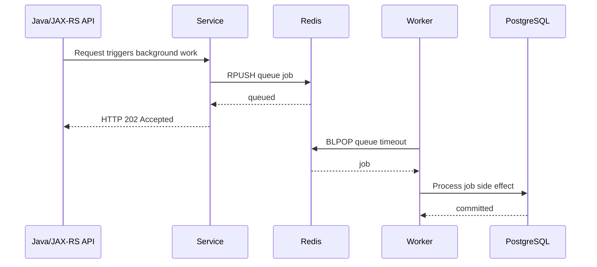
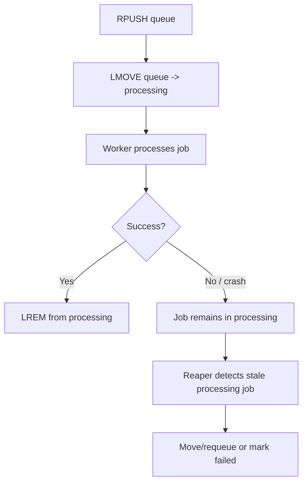

# Part 016 — Redis Lists

Redis Lists are ordered collections of string values. They are simple, fast, and useful for stack/queue-like patterns.

For backend engineers, the most important List use case is usually some form of **queue**:

- push work into a list
- pop work from a list
- optionally block until work exists
- process the work in a worker

But Redis Lists are not Kafka. They are not RabbitMQ. They do not naturally provide consumer groups, replay, offset management, dead-letter queues, or durable broker semantics.

Use Lists for **simple, bounded, operationally understood queues**. Use Redis Streams, RabbitMQ, Kafka, or a database-backed queue when you need stronger delivery semantics, replay, fan-out, routing, consumer groups, auditability, or operational tooling.

---

## 1. Core Mental Model

A Redis List is:

```text
redis key -> ordered sequence of values
```

Example:

```text
quote:reprice:queue
  [job-001, job-002, job-003]
```

You can push from left or right and pop from left or right.

Common queue convention:

```text
Producer: RPUSH queue job
Consumer: BLPOP queue timeout
```

This gives FIFO behavior:

```text
left/front                      right/back
oldest job <------------------- newest job
BLPOP reads oldest              RPUSH adds newest
```

---

## 2. Why Lists Exist

Lists exist for simple ordered collections where operations at the ends are efficient.

They are useful for:

- simple queues
- stacks
- recent items
- bounded history
- lightweight work dispatch
- buffering small amounts of transient work

They are not ideal for:

- replayable event streams
- multi-consumer group processing
- complex routing
- long-term durable jobs
- audit-grade processing
- high-scale delayed retry orchestration
- workflows that require strong recovery semantics

---

## 3. Basic Commands

### 3.1 LPUSH

Push to the left side:

```redis
LPUSH quote:reprice:queue job-123
```

### 3.2 RPUSH

Push to the right side:

```redis
RPUSH quote:reprice:queue job-123
```

### 3.3 LPOP

Pop from the left side:

```redis
LPOP quote:reprice:queue
```

### 3.4 RPOP

Pop from the right side:

```redis
RPOP quote:reprice:queue
```

### 3.5 BLPOP

Block until an item is available or timeout occurs:

```redis
BLPOP quote:reprice:queue 5
```

### 3.6 BRPOP

Block from the right side:

```redis
BRPOP quote:reprice:queue 5
```

### 3.7 LMOVE

Atomically move an item from one list to another:

```redis
LMOVE quote:reprice:queue quote:reprice:processing LEFT RIGHT
```

### 3.8 BLMOVE

Blocking variant of `LMOVE`:

```redis
BLMOVE quote:reprice:queue quote:reprice:processing LEFT RIGHT 5
```

### 3.9 LLEN

Get list length:

```redis
LLEN quote:reprice:queue
```

### 3.10 LTRIM

Trim list to a bounded range:

```redis
LTRIM quote:recent-events 0 999
```

---

## 4. Queue Lifecycle

Simple queue lifecycle:



This looks simple, but the failure mode is important:

```text
If worker pops a job and crashes before processing completes, the job may be lost.
```

That is the central reliability limitation of naive List queues.

---

## 5. Simple Queue Pattern

Producer:

```redis
RPUSH quote:reprice:queue '{"quoteId":"Q-123","reason":"CATALOG_CHANGED"}'
```

Consumer:

```redis
BLPOP quote:reprice:queue 5
```

This is acceptable when:

- job loss is acceptable or recoverable
- job is derived from source-of-truth data
- queue is short-lived
- workload is low/medium complexity
- no replay is required
- no multi-consumer group semantics are needed

Example acceptable use cases:

- best-effort cache warmup
- non-critical notification fan-in
- low-value cleanup task
- transient recalculation that can be re-triggered

Example risky use cases:

- order submission
- payment state transition
- regulatory/audit workflow
- quote-to-order irreversible command
- integration message requiring guaranteed delivery

---

## 6. Work Queue with Blocking Consumer

A blocking consumer avoids polling Redis aggressively.

Pseudo-code:

```java
while (running) {
    Optional<Job> job = redis.blpop("quote:reprice:queue", Duration.ofSeconds(5));
    if (job.isEmpty()) {
        continue;
    }

    try {
        process(job.get());
    } catch (Exception ex) {
        log.error("Failed to process job", ex);
        // Decide retry, DLQ, or drop.
    }
}
```

Important Java concerns:

- blocking command must not run on request thread
- blocking command must not block Netty/event-loop thread if client is async/reactive
- worker shutdown must interrupt/block timeout safely
- Redis command timeout must be compatible with blocking timeout
- connection used for blocking command may be occupied while waiting

In Java services, use dedicated worker threads or a worker service, not JAX-RS request threads.

---

## 7. Reliable Queue Pattern with Processing List

A safer List pattern uses two lists:

```text
queue list      -> pending work
processing list -> work claimed by workers
```

Worker atomically moves job from queue to processing:

```redis
LMOVE quote:reprice:queue quote:reprice:processing LEFT RIGHT
```

Then after successful processing:

```redis
LREM quote:reprice:processing 1 <job-payload-or-id>
```

Lifecycle:



This reduces immediate job loss, but it creates new complexity:

- how to identify stale jobs?
- where is claimed timestamp stored?
- how to avoid duplicate processing?
- how to handle worker crash after DB commit but before `LREM`?
- how to avoid scanning huge processing lists?

Redis Lists do not attach metadata to list entries. If you need pending entry tracking, Redis Streams may be a better fit.

---

## 8. Visibility Timeout-Like Pattern Limitation

Message brokers often provide visibility timeout-like behavior:

```text
worker claims message -> message hidden temporarily -> if not acked, message becomes visible again
```

Redis Lists do not provide this natively.

You can approximate it with:

- processing list
- timestamp inside job payload
- separate sorted set of claimed jobs by timestamp
- reaper process
- idempotent job processing

But at that point, you are building a queue system.

Before doing that, ask:

> Should this be Redis Streams, RabbitMQ, Kafka, or a database queue instead?

---

## 9. List vs Stream

| Requirement | Redis List | Redis Stream |
|---|---:|---:|
| Simple FIFO queue | Good | Good |
| Blocking pop | Good | Good |
| Consumer groups | Poor | Native |
| Pending message tracking | Manual | Native PEL |
| Ack discipline | Manual | Native `XACK` |
| Replay | Poor | Better |
| Multiple consumers sharing work | Basic | Stronger |
| Message IDs | Manual | Native |
| Retention/trimming | Basic | Native stream trimming |
| Operational introspection | Limited | Better |
| Simplicity | Very simple | More complex |

Use List when the queue is simple and loss/retry semantics are not demanding.

Use Stream when you need worker groups, pending tracking, retry, replay-like behavior, or better observability.

---

## 10. List vs RabbitMQ

RabbitMQ is usually better when you need:

- durable queues
- acknowledgments
- routing exchanges
- dead-letter exchanges
- delayed/retry patterns
- consumer prefetch control
- operational broker tooling
- strong queue semantics

Redis List may be enough when:

- the queue is small
- job loss is tolerable
- processing is best-effort
- Redis is already operationally available
- you want minimal infrastructure for simple transient work

For enterprise quote/order systems, RabbitMQ is often more appropriate for business-critical asynchronous commands.

---

## 11. List vs Kafka

Kafka is usually better when you need:

- durable event log
- replay
- ordered partitions
- many independent consumers
- event sourcing-like patterns
- integration event distribution
- retention by time/size
- consumer offsets

Redis List is not an event log.

If a job represents a domain event that multiple services need to consume independently, Redis List is usually the wrong abstraction.

---

## 12. List as Recent Items Buffer

Lists are also useful for bounded recent history.

Example:

```redis
LPUSH tenant:acme:recent-quote-ids Q-101
LTRIM tenant:acme:recent-quote-ids 0 99
```

This keeps the 100 most recent quote IDs.

Use only for derived/non-authoritative views.

Correctness boundary:

- PostgreSQL remains source of truth
- Redis list is a convenience cache
- missing/evicted list is acceptable
- order may not be audit-grade

---

## 13. Large List Risk

Lists can become dangerous when they grow without bound.

Symptoms:

- `LLEN` keeps increasing
- workers cannot keep up
- memory usage rises
- queue latency grows
- job age increases
- Redis eviction starts
- failover/restart recovery becomes slower
- `LRANGE` debugging becomes dangerous

Avoid unbounded lists.

Every production list queue should have:

- expected max length
- alert threshold
- producer rate metric
- consumer rate metric
- oldest job age metric if possible
- failure/retry policy
- drain/runbook procedure

---

## 14. Job Payload Design

Do not put huge serialized objects in Redis queue items.

Prefer payloads like:

```json
{
  "jobId": "job-20260711-0001",
  "jobType": "REPRICE_QUOTE",
  "quoteId": "Q-123",
  "tenantId": "acme",
  "reason": "CATALOG_CHANGED",
  "createdAt": "2026-07-11T10:00:00Z",
  "attempt": 1,
  "schemaVersion": 1
}
```

Avoid payloads like:

```json
{
  "entireQuoteObject": { "...": "thousands of lines" },
  "allLineItems": [ "..." ],
  "customerPii": "..."
}
```

Good job payload principles:

- include job ID
- include schema version
- include entity ID, not entire entity
- include tenant ID if needed
- include creation timestamp
- include attempt count if retrying
- avoid PII
- keep payload small
- make worker reload authoritative state from PostgreSQL if correctness matters

---

## 15. Idempotent Worker Requirement

Redis List workers may process duplicate jobs if you implement retries or recovery.

Therefore workers should be idempotent.

Example duplicate scenario:

```text
Worker processes job
DB commit succeeds
Worker crashes before removing job from processing list
Reaper requeues job
Another worker processes same job again
```

If the job is not idempotent, duplicate side effects can occur.

Safer processing:

- use job ID
- store processing result in PostgreSQL or Redis idempotency store
- check current entity state before applying command
- make external calls idempotent where possible
- use unique constraints for business idempotency
- treat Redis queue delivery as at-least-once if retries exist

---

## 16. Retry Pattern

Basic retry can be modeled by pushing failed jobs back into the queue with incremented attempt count.

Pseudo-flow:

```text
BLPOP queue
process job
if transient failure and attempt < max:
    RPUSH queue job(attempt + 1)
else if permanent failure:
    RPUSH failed queue job
```

Problems:

- immediate retry can create hot failure loops
- no natural delay
- poison jobs can dominate queue
- ordering is affected
- failure reason may be lost

For delayed retry, combine with Sorted Set or use Streams/RabbitMQ.

---

## 17. Delayed Job with Sorted Set + List

A common pattern:

```text
delayed zset -> score is execution timestamp
ready list   -> jobs ready for workers
```

Scheduler:

```text
ZRANGEBYSCORE delayed -inf now LIMIT 0 N
ZREM delayed job
RPUSH ready job
```

This works, but concurrency requires atomicity. Lua is usually needed to avoid multiple schedulers moving the same job.

If this grows complex, use a proper queue/broker.

---

## 18. Java/JAX-RS Integration Pattern

For API-triggered async work, the JAX-RS resource should not perform long work synchronously.

Example flow:

```mermaid
flowchart TD
    A[HTTP POST /quotes/{id}/reprice] --> B[JAX-RS resource validates request]
    B --> C[Service creates job payload]
    C --> D[Persist command/request if required]
    D --> E[RPUSH Redis list]
    E --> F[Return 202 Accepted]
    F --> G[Worker consumes job]
    G --> H[Reload quote from PostgreSQL]
    H --> I[Apply idempotent processing]
    I --> J[Update DB / emit Kafka or RabbitMQ event]
```

Critical distinction:

- If the job is business-critical, persisting only in Redis List may be insufficient.
- If the API returns `202 Accepted`, the system must define how the client checks job status.
- If job enqueue fails, the API must decide whether to fail the request or process synchronously/fallback.

---

## 19. PostgreSQL Interaction

Redis List jobs should usually carry references to PostgreSQL entities, not full authoritative state.

Good:

```json
{
  "jobId": "job-1",
  "quoteId": "Q-123",
  "tenantId": "acme"
}
```

Worker reloads:

```sql
SELECT * FROM quote WHERE quote_id = ? AND tenant_id = ?
```

This avoids processing stale embedded payloads.

Common failure windows:

### DB commit succeeds, Redis enqueue fails

The job is never queued.

Mitigation:

- transactional outbox in PostgreSQL
- retry enqueue
- reconciliation job
- broker integration

### Redis enqueue succeeds, DB commit rolls back

Worker may process a job referencing data that does not exist or is not committed.

Mitigation:

- enqueue only after commit
- use outbox pattern
- worker validates entity state

### Worker DB commit succeeds, Redis cleanup fails

Duplicate processing may happen.

Mitigation:

- idempotent worker
- DB unique constraints/status checks
- job result table

---

## 20. Kafka/RabbitMQ Interaction

Redis List queues may coexist with Kafka/RabbitMQ, but responsibilities must be clear.

Acceptable:

```text
Kafka event -> local service consumes -> Redis List for local best-effort cache warm tasks
```

Risky:

```text
Redis List replaces RabbitMQ for critical cross-service command delivery without ack/retry/DLQ design
```

Questions to ask:

- Is this local internal work or cross-service integration?
- Does another service need to consume the same event?
- Is replay required?
- Is message loss acceptable?
- Is ordering important?
- Is there a DLQ requirement?
- Does ops already monitor RabbitMQ/Kafka but not Redis queues?

---

## 21. Kubernetes Impact

List queues behave differently under Kubernetes scaling.

### More workers

Increasing pod replicas increases consumers.

Potential effects:

- faster drain
- more DB load
- more Redis connections
- more duplicate processing if recovery is weak
- more external API calls

### Rolling update

Workers may shut down while blocking on `BLPOP`.

Need:

- graceful shutdown flag
- finite blocking timeout
- stop polling on SIGTERM
- finish or safely abandon current job
- readiness/liveness designed for worker role

### Connection management

Blocking consumers may require dedicated Redis connections. Do not starve request-path Redis operations by sharing a small pool with blocking workers.

---

## 22. Cloud and On-Prem Operational Impact

### Managed Redis

Managed Redis failover can interrupt blocking commands. Workers must reconnect and resume.

Watch:

- failover events
- connection reset
- command timeout
- duplicate worker behavior
- queue backlog after failover

### Redis Cluster

A single queue key lives in one hash slot. This means one queue can become a single-slot hotspot.

For high throughput, consider sharded queues:

```text
quote:reprice:queue:{0}
quote:reprice:queue:{1}
quote:reprice:queue:{2}
```

But sharding complicates ordering and worker logic.

### On-prem

Self-managed Redis requires explicit backup, persistence, monitoring, patching, and restart behavior. If lists contain important jobs, persistence settings become critical.

---

## 23. Failure Modes

### 23.1 Job Lost After Pop

Cause:

```text
LPOP/BLPOP removes job
worker crashes before processing
```

Mitigation:

- use `LMOVE` to processing list
- use Streams
- use RabbitMQ/Kafka
- make work reconstructable from DB

### 23.2 Queue Backlog Growth

Causes:

- producer rate > consumer rate
- workers down
- downstream DB slow
- poison jobs blocking capacity
- Redis/network latency

Detection:

- `LLEN queue`
- oldest job age
- worker success/error rate
- consumer lag equivalent

### 23.3 Poison Job Loop

Cause:

- same job fails repeatedly and is requeued immediately

Mitigation:

- max attempt count
- failed queue
- delayed retry
- classify permanent vs transient errors

### 23.4 Duplicate Processing

Cause:

- retry/reaper requeues already-processed job
- worker times out after side effect
- crash after commit before cleanup

Mitigation:

- idempotency key
- DB uniqueness/status guard
- external idempotency key

### 23.5 Blocking Connection Exhaustion

Cause:

- blocking commands consume Redis connections
- same pool used for request path and workers

Mitigation:

- dedicated worker Redis client/pool
- bounded worker count
- pool metrics

### 23.6 Large Payload Memory Pressure

Cause:

- queue values contain full objects
- backlog grows
- Redis stores many large strings

Mitigation:

- store IDs not full objects
- cap payload size
- use PostgreSQL as source of truth

---

## 24. Debugging Playbook

When a Redis List queue misbehaves, ask:

1. What is the queue key?
2. What is the list length?
3. Is the queue growing or draining?
4. Are workers running?
5. Are workers blocked on Redis, DB, or external systems?
6. Are jobs failing repeatedly?
7. Is there a processing list?
8. How are stuck processing jobs recovered?
9. Is the job payload schema compatible with current workers?
10. Was there a deployment or Redis failover?
11. Are Redis connections exhausted?
12. Is the queue key hot?
13. Is payload size too large?
14. Is duplicate processing possible?
15. Is job loss acceptable?

Production-safe commands:

```redis
TYPE quote:reprice:queue
LLEN quote:reprice:queue
LRANGE quote:reprice:queue 0 4
LLEN quote:reprice:processing
```

Be careful with `LRANGE` on large lists. Inspect a small range only.

---

## 25. Observability

Queue metrics:

- queue length
- processing list length
- enqueue rate
- dequeue rate
- success rate
- failure rate
- retry rate
- failed queue length
- oldest job age
- processing duration
- Redis command latency
- worker count
- worker shutdown count
- duplicate job detection count

Logs should include:

```text
job.id
job.type
tenant.id if safe
entity.id
attempt
queue.name
worker.id
processing.duration
failure.classification
correlation.id
```

Avoid logging sensitive payload values.

---

## 26. Performance Concerns

Redis Lists are fast at the ends, but performance can degrade through misuse.

Watch for:

- very large lists
- large payloads
- too many blocking consumers
- connection pool starvation
- Redis Cluster single-slot hotspot
- frequent `LRANGE` on large ranges
- slow downstream systems causing backlog
- excessive retry loops

Good practice:

- keep payload small
- bound queue length operationally
- use dedicated worker connections
- measure enqueue/dequeue rates
- use backpressure when downstream is slow
- shard only if necessary and understood

---

## 27. Correctness Concerns

For each Redis List queue, define:

- Is job loss acceptable?
- Is duplicate processing acceptable?
- Is ordering required?
- Is replay required?
- Is job status visible to users?
- Is Redis the only store of pending work?
- Is the worker idempotent?
- What happens after Redis failover?
- What happens after worker crash?
- What happens if PostgreSQL is down?
- What happens if Kafka/RabbitMQ publish fails after job processing?

If the answer is unclear, the queue design is incomplete.

---

## 28. Security and Privacy Concerns

Queue payloads are often overlooked as sensitive data stores.

Avoid putting:

- PII
- access tokens
- refresh tokens
- passwords/secrets
- full customer profiles
- full quote/order payloads if not necessary
- regulated data without retention controls

If sensitive data is unavoidable:

- enforce TTL/retention
- restrict ACL key access
- ensure encryption in transit
- validate backup/snapshot access
- redact logs
- document compliance rationale

---

## 29. List Usage Decision Table

| Use case | List fit? | Notes |
|---|---:|---|
| Best-effort cache warmup | Good | Job loss usually acceptable. |
| Simple internal background work | Maybe | Needs retry/failure policy. |
| Business-critical command queue | Poor | Prefer RabbitMQ/Kafka/outbox. |
| Durable event stream | Poor | Prefer Kafka or Redis Streams. |
| Worker group with ack/retry | Maybe | Streams usually better. |
| Recent items buffer | Good | Use `LPUSH` + `LTRIM`. |
| Delayed jobs | Limited | Requires sorted set/Lua or better queue. |
| Audit workflow | Poor | Prefer PostgreSQL/broker. |

---

## 30. PR Review Checklist

### Queue semantics

- Is this a queue, stack, recent buffer, or something else?
- Is Redis List the right structure?
- Is message loss acceptable?
- Is duplicate processing acceptable?
- Is ordering required?

### Payload

- Is payload small?
- Does payload include `jobId` and `schemaVersion`?
- Does payload avoid PII/secrets?
- Does worker reload authoritative state if needed?

### Reliability

- Is naive `BLPOP` enough?
- Is there a processing list?
- Is there retry policy?
- Is there failed/poison queue?
- Are workers idempotent?

### PostgreSQL/MyBatis/JDBC

- Is enqueue after DB commit?
- Is outbox needed?
- Can worker safely handle missing/stale DB state?
- Are DB side effects idempotent?

### Kafka/RabbitMQ

- Should this be RabbitMQ/Kafka instead?
- Is Redis List only local/internal work?
- Is cross-service delivery involved?
- Is replay required?

### Kubernetes/operations

- Are worker pods graceful on shutdown?
- Are blocking Redis connections isolated?
- Are queue length and job age monitored?
- Is backlog runbook defined?

### Security/privacy

- Does payload contain sensitive data?
- Are logs redacted?
- Is key ACL restricted?

---

## 31. Internal Verification Checklist

Use this checklist against the real codebase and platform.

### Codebase

- Search for `LPUSH`, `RPUSH`, `LPOP`, `RPOP`, `BLPOP`, `BRPOP`, `LMOVE`, `BLMOVE`, `LTRIM`, `LLEN`, `LRANGE`.
- Identify every list key pattern.
- Classify each list as queue, stack, buffer, recent-history, or internal mechanism.
- Identify producer and consumer code paths.
- Check whether consumers run in request path or worker path.

### Queue design

- Confirm job loss tolerance.
- Confirm duplicate processing tolerance.
- Confirm retry and failed-job policy.
- Confirm whether processing list exists.
- Confirm whether Redis Streams/RabbitMQ/Kafka would be more appropriate.

### Java client configuration

- Confirm blocking commands use dedicated connections/pools.
- Confirm command timeout vs blocking timeout.
- Confirm worker shutdown behavior.
- Confirm connection metrics.

### Payload and compatibility

- Confirm payload schema version.
- Confirm payload size limits.
- Confirm no sensitive data in payload.
- Confirm rolling deployment compatibility.

### PostgreSQL/messaging interaction

- Confirm enqueue relative to DB transaction commit.
- Confirm outbox need.
- Confirm worker idempotency.
- Confirm downstream event publish behavior.

### Operations

- Confirm dashboard for queue length, processing length, failure rate, and oldest job age.
- Confirm alert thresholds.
- Confirm backlog drain procedure.
- Confirm incident notes for lost/duplicate/stuck jobs.

---

## 32. Summary

Redis Lists are excellent for simple ordered structures and lightweight queue-like behavior.

They become risky when used as a serious broker without acknowledging their limitations.

A good Redis List use case is:

```text
simple + bounded + local/internal + loss-tolerant or recoverable + idempotent worker
```

A dangerous Redis List use case is:

```text
business-critical + durable delivery required + replay required + weak retry/ack design
```

For senior backend engineering, the key skill is not knowing `LPUSH` and `BLPOP`. The key skill is knowing when those commands are enough, when to add processing/retry/idempotency, and when to reject Redis List in favor of Streams, RabbitMQ, Kafka, or PostgreSQL-backed workflow state.
