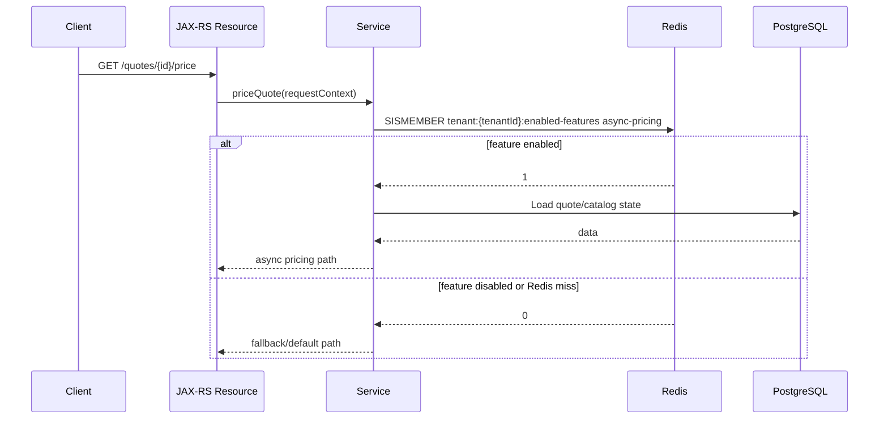
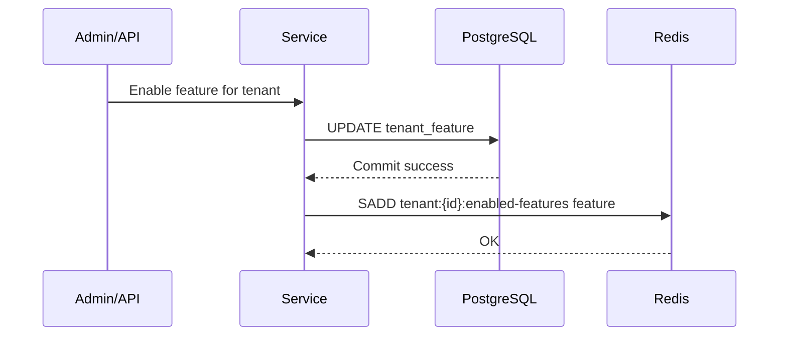

# Part 017 — Redis Sets

Redis Sets are unordered collections of unique string values.

For backend engineers, the most important Redis Set use cases are:

- membership checks
- deduplication
- feature membership
- tenant capability lists
- temporary suppression lists
- lightweight idempotency markers
- set algebra across groups

The key idea is simple:

```text
A Redis Set answers: "is this member present?"
```

That sounds small, but it is extremely powerful in enterprise systems.

A Set can represent:

```text
tenant:T-123:enabled-features -> { quote-v2, bulk-order, async-pricing }
user:U-123:permissions       -> { quote.read, quote.approve, order.submit }
quote:Q-123:seen-event-ids   -> { evt-001, evt-002, evt-003 }
```

But Sets also become dangerous when they grow without bounds, are read with `SMEMBERS`, or are treated as authoritative permission/source-of-truth state without lifecycle discipline.

---

## 1. Core Mental Model

A Redis Set is:

```text
redis key -> unordered unique collection of members
```

Example:

```text
tenant:T-123:enabled-features
  { "quote-approval", "bulk-amend", "catalog-cache-v2" }
```

Set properties:

- members are unique
- ordering is not guaranteed
- membership lookup is efficient
- adding an existing member is harmless
- set algebra is available
- large unbounded sets can hurt memory and latency

Redis Set is usually the right primitive when the business question is:

```text
Has X already been seen?
Is X part of group Y?
Which members are common between A and B?
```

---

## 2. Why Sets Exist

Sets exist because many backend problems are membership problems.

Examples:

| Problem | Set interpretation |
|---|---|
| Has this event already been processed? | event ID exists in processed-event set |
| Is this tenant enabled for a feature? | feature name exists in tenant feature set |
| Has this request fingerprint already been submitted? | fingerprint exists in recent-request set |
| Is this user in a temporary suppression list? | user ID exists in suppression set |
| Which permissions overlap? | intersection between role permission sets |

Sets provide a compact and direct way to model these problems without scanning relational tables on every request.

But Redis Set should not automatically replace PostgreSQL.

In most enterprise systems:

```text
PostgreSQL owns durable truth.
Redis accelerates membership checks or transient deduplication.
```

---

## 3. Basic Commands

### 3.1 SADD

Add one or more members:

```redis
SADD tenant:T-123:enabled-features quote-v2 bulk-order async-pricing
```

`SADD` returns the number of newly added members.

Adding the same member twice is safe:

```redis
SADD processed-events evt-001
SADD processed-events evt-001
```

The second call does not duplicate the member.

---

### 3.2 SREM

Remove a member:

```redis
SREM tenant:T-123:enabled-features async-pricing
```

Useful for feature disablement, cleanup, invalidation, and lifecycle management.

---

### 3.3 SISMEMBER

Check membership:

```redis
SISMEMBER tenant:T-123:enabled-features quote-v2
```

Typical result:

```text
1 -> member exists
0 -> member does not exist
```

This is one of the most important Set operations for request-path logic.

---

### 3.4 SMISMEMBER

Check multiple members in one call:

```redis
SMISMEMBER tenant:T-123:enabled-features quote-v2 bulk-order unsupported-feature
```

This reduces network round trips compared to repeated `SISMEMBER` calls.

Use it when a JAX-RS endpoint needs to check several features/permissions at once.

---

### 3.5 SCARD

Get number of members:

```redis
SCARD tenant:T-123:enabled-features
```

Useful for cardinality monitoring.

Be careful: knowing that a set has 5 members is safe. Fetching all 5 million members is not.

---

### 3.6 SMEMBERS

Return all members:

```redis
SMEMBERS tenant:T-123:enabled-features
```

This is safe only for small bounded sets.

For large or unbounded sets, `SMEMBERS` can cause:

- large response payload
- Redis event loop blocking
- Java heap pressure
- network amplification
- latency spikes

In production PR review, `SMEMBERS` should trigger the question:

```text
What is the maximum cardinality of this set?
```

---

### 3.7 SSCAN

Incrementally scan members:

```redis
SSCAN tenant:T-123:enabled-features 0 COUNT 100
```

Use `SSCAN` when a set may be large and the operation is administrative, background, or batch-oriented.

Do not casually use `SSCAN` in a latency-sensitive request path unless the set is bounded and the iteration cost is controlled.

---

### 3.8 SINTER

Intersection:

```redis
SINTER role:approver:permissions role:quote-manager:permissions
```

Returns members common to all sets.

---

### 3.9 SUNION

Union:

```redis
SUNION role:base-user:permissions role:quote-manager:permissions
```

Returns all unique members across sets.

---

### 3.10 SDIFF

Difference:

```redis
SDIFF expected:event-ids processed:event-ids
```

Returns members in the first set that do not exist in the others.

---

## 4. Set Lifecycle in a Java/JAX-RS Request

Example: checking whether a tenant has a feature enabled.



The critical design question:

```text
If Redis returns 0 because data is stale, missing, or unavailable, what behavior is safe?
```

For feature flags, the safe default may be disabled.

For permissions, blindly defaulting to allowed is usually dangerous.

---

## 5. Membership Pattern

Membership is the cleanest Set use case.

Example:

```redis
SADD tenant:T-123:enabled-features quote-v2 bulk-order
SISMEMBER tenant:T-123:enabled-features quote-v2
```

In Java service logic:

```text
if tenant feature set contains feature:
    allow enhanced path
else:
    use default path
```

Good membership sets are:

- bounded
- owned by a clear source of truth
- refreshable
- observable
- not filled with PII
- protected by TTL or explicit lifecycle when temporary

Bad membership sets are:

- unbounded
- never cleaned
- loaded with sensitive data
- treated as permission truth without audit
- read with `SMEMBERS` on every request

---

## 6. Deduplication Pattern

Sets are commonly used to remember whether an ID has already been seen.

Example:

```redis
SADD consumer:quote-events:seen evt-123
```

If `SADD` returns `1`, the event is new.

If `SADD` returns `0`, the event was already seen.

Pseudo-flow:

```text
added = SADD seen-events eventId
if added == 1:
    process event
else:
    skip duplicate
```

This is attractive because `SADD` is atomic for the single key.

But the failure window matters.

```text
SADD succeeds -> service crashes before DB commit
```

Now Redis says the event was seen, but the durable side effect may not exist.

For business-critical event processing, PostgreSQL idempotency table or transactional outbox/inbox may be safer.

Redis Set deduplication is best for:

- short-lived duplicate suppression
- non-critical duplicate avoidance
- performance optimization
- duplicate filtering before a durable idempotency check

---

## 7. Idempotency Set Pattern

A simple idempotency Set might look like this:

```redis
SADD quote:submit:idempotency-keys idem-abc-123
EXPIRE quote:submit:idempotency-keys 86400
```

But this pattern has limitations.

It only records presence. It does not record:

- processing state
- request fingerprint
- response body
- failure state
- owner
- timestamps
- retry metadata

For serious idempotency, a String or Hash with a state machine is usually better.

Use Set-based idempotency only when the question is simply:

```text
Have we seen this token recently?
```

Do not use it when the question is:

```text
What was the result of the original request?
Is this duplicate request equivalent to the original request?
Is the original request still processing?
```

Those require richer state.

---

## 8. Permission Set Pattern

Sets map naturally to permissions:

```redis
SADD role:quote-manager:permissions quote.read quote.update quote.approve
SADD role:order-submitter:permissions order.create order.submit
```

To check permission:

```redis
SISMEMBER role:quote-manager:permissions quote.approve
```

But permission cache has serious security implications.

Important constraints:

- source of truth should remain durable and auditable
- cache must have invalidation on role/permission changes
- stale permission grants are high risk
- stale permission denials may cause availability/support issues
- PII should not appear in key names unnecessarily
- tenant isolation must be explicit

Better key shape:

```text
authz:{env}:{service}:tenant:{tenantId}:role:{roleId}:permissions:v1
```

But only if internal key naming convention supports this style.

---

## 9. Tenant Feature Set Pattern

Feature enablement is another common Set use case.

Example:

```redis
SADD feature:tenant:T-123 quote-v2 async-pricing catalog-cache-v2
```

Then:

```redis
SISMEMBER feature:tenant:T-123 async-pricing
```

Design questions:

- What is the source of truth for feature flags?
- How is Redis populated?
- How is Redis invalidated?
- What is the safe default if Redis fails?
- Is stale enablement dangerous?
- Is stale disablement acceptable?
- Are changes audited?

For enterprise systems, feature/config state should usually be audit-backed outside Redis.

Redis can accelerate reads, not replace governance.

---

## 10. Suppression List Pattern

Temporary suppression lists are well-suited to Redis Sets.

Example:

```redis
SADD notification:suppressed-users U-123 U-456
EXPIRE notification:suppressed-users 3600
```

Use cases:

- suppress duplicate notification
- suppress repeated retry for temporarily failing target
- suppress repeated validation warning
- block repeated expensive call for a short window

The TTL matters.

A suppression Set without expiry can accidentally become a permanent blacklist.

---

## 11. Cardinality Management

Every Redis Set must have a cardinality expectation.

Ask:

```text
How many members can this set have in normal operation?
How many during incidents?
How many after one month?
How many after one year?
```

Use `SCARD` to monitor:

```redis
SCARD consumer:quote-events:seen
```

Typical risk categories:

| Set type | Cardinality risk |
|---|---|
| tenant features | low, bounded |
| role permissions | low/medium, bounded |
| processed event IDs | high, time-growing |
| request fingerprints | high, time-growing |
| user sessions | medium/high |
| suppression list | depends on TTL |
| cache tags | can become very high |

Unbounded sets need one of these controls:

- TTL on the whole set
- time-bucketed keys
- periodic cleanup
- size cap
- approximate data structure
- durable DB table instead

---

## 12. Time-Bucketed Sets

Instead of one forever-growing Set:

```text
processed-events
```

Use time buckets:

```text
processed-events:2026-07-11-09
processed-events:2026-07-11-10
processed-events:2026-07-11-11
```

Each bucket can have TTL:

```redis
SADD processed-events:2026-07-11-09 evt-123
EXPIRE processed-events:2026-07-11-09 172800
```

This bounds memory and simplifies cleanup.

Trade-off:

```text
You must check the relevant buckets during deduplication.
```

For example, if the dedup window is 24 hours, the service may need to check current and previous buckets.

---

## 13. Large Set Risk

Large Sets can create operational problems.

Risky commands:

```redis
SMEMBERS huge:set
SINTER huge:set another:huge:set
SUNION huge:set another:huge:set
SDIFF huge:set another:huge:set
```

Large Set risks:

- high memory consumption
- high CPU during set algebra
- large network response
- Redis latency spike
- Java heap pressure
- GC pressure in service
- slow debugging commands

A large Set is not automatically wrong, but it must be designed intentionally.

Required controls:

- max cardinality estimate
- cleanup/TTL strategy
- no request-path full read
- observability
- fallback behavior
- production-safe inspection procedure

---

## 14. SMEMBERS Risk

`SMEMBERS` is tempting because it is simple.

```redis
SMEMBERS tenant:T-123:enabled-features
```

For a bounded set of 20 feature flags, this is fine.

For a set of millions of processed event IDs, this is dangerous.

In Java, `SMEMBERS` may produce:

```text
Redis memory copy -> network payload -> client buffer -> Java object allocation -> GC pressure
```

PR review rule:

```text
SMEMBERS is acceptable only when maximum set size is bounded and documented.
```

If not bounded, use:

- `SISMEMBER`
- `SMISMEMBER`
- `SCARD`
- `SSCAN` in background/admin path
- a different model

---

## 15. SSCAN Discipline

`SSCAN` is safer than `SMEMBERS`, but it is not free.

Example:

```redis
SSCAN huge:set 0 COUNT 500
```

Important points:

- cursor iteration is incremental
- `COUNT` is a hint, not a guarantee
- duplicates may appear during mutation
- results are not a consistent snapshot
- iteration may miss/duplicate members if set changes concurrently

Use `SSCAN` for:

- admin tooling
- background cleanup
- offline analysis
- migration jobs

Avoid `SSCAN` for:

- strict business correctness
- per-request authorization on huge sets
- precise audit reports

For audit-grade reporting, use PostgreSQL or analytics storage.

---

## 16. Set Algebra

Redis supports set algebra:

```text
intersection -> common members
union        -> all members
difference   -> members only in first set
```

Examples:

```redis
SINTER role:A:permissions role:B:permissions
SUNION role:A:permissions role:B:permissions
SDIFF expected:event-ids processed:event-ids
```

This is useful but can be expensive.

Set algebra on large sets can block Redis long enough to affect unrelated requests.

Safer patterns:

- keep sets small and bounded
- precompute common combinations
- use `SINTERCARD` if only cardinality is needed
- perform heavy analysis outside Redis
- run background jobs with limits

---

## 17. Redis Sets vs PostgreSQL Tables

Redis Sets are good for fast membership checks.

PostgreSQL tables are better for durable, queryable, audited truth.

| Requirement | Redis Set | PostgreSQL |
|---|---:|---:|
| Fast membership | Strong | Good with index |
| Durability | Depends on Redis config | Strong |
| Audit trail | Weak | Strong |
| Rich querying | Weak | Strong |
| Transactions with business state | Weak | Strong |
| TTL/transient data | Strong | Possible but heavier |
| Access governance | Limited | Stronger |

A common good architecture:

```text
PostgreSQL: durable permission/feature/event truth
Redis Set: fast transient membership cache
```

---

## 18. Redis Sets vs Local Cache

Local cache can also answer membership quickly.

But local cache is per JVM/pod.

Redis Set is shared across pods.

Use local cache when:

- data is small
- update frequency is low
- eventual consistency is acceptable
- each pod can tolerate stale state

Use Redis Set when:

- membership must be shared across pods
- updates should be visible cross-instance
- memory should not be duplicated across many pods
- operations team needs centralized visibility

A common pattern:

```text
PostgreSQL -> Redis Set -> short-lived local cache
```

This gives speed but increases invalidation complexity.

---

## 19. Redis Sets vs Bloom Filter

Redis Sets store exact members.

A Bloom filter stores approximate membership with false positives.

Sets answer:

```text
This member definitely exists or definitely does not exist.
```

Bloom filter answers:

```text
This member may exist, or definitely does not exist.
```

Bloom filters are useful for huge membership tests where memory matters and false positives are acceptable.

Redis OSS does not include Bloom filters as a core data type; they are typically provided by modules or compatible services. Verify module/service support internally before assuming availability.

For most enterprise Java services, start with Set if cardinality is bounded. Consider approximate structures only when memory pressure is real and correctness allows it.

---

## 20. TTL Strategy for Sets

TTL applies to the whole Set key, not individual members.

Example:

```redis
SADD suppression:tenant:T-123 quote:Q-123
EXPIRE suppression:tenant:T-123 3600
```

This means all members share the same key-level lifecycle.

If individual member expiry is needed, a plain Set may be the wrong structure.

Alternatives:

- one key per member with TTL
- sorted set with timestamp score
- hash with cleanup metadata
- PostgreSQL table with expiry column

Do not assume Redis Set has per-member TTL.

---

## 21. Member-Level Expiry Alternatives

Problem:

```text
Need each dedup/member marker to expire independently.
```

Option 1: one string key per member:

```redis
SET dedup:event:evt-123 1 EX 86400 NX
```

Pros:

- native TTL per member
- simple lookup

Cons:

- many keys
- key cardinality grows
- scan/namespace management needed

Option 2: sorted set with timestamp:

```redis
ZADD dedup:events 1720681200 evt-123
ZREMRANGEBYSCORE dedup:events -inf 1720594800
```

Pros:

- cleanup by time
- compact group key

Cons:

- cleanup must be explicit
- lookup is slightly different
- large zset risk

Option 3: durable DB table:

```text
processed_event(id, processed_at, expires_at)
```

Pros:

- durable
- auditable
- transactional

Cons:

- higher latency
- cleanup job required

---

## 22. Java/JAX-RS Integration Pattern

A clean service should hide raw Redis commands behind domain-specific interfaces.

Poor abstraction:

```java
redis.sismember("tenant:" + tenantId + ":enabled-features", feature);
```

Better abstraction:

```java
boolean enabled = tenantFeatureCache.isEnabled(tenantId, Feature.ASYNC_PRICING);
```

The wrapper should own:

- key naming
- serialization
- timeout policy
- fallback behavior
- metrics
- tracing attributes
- error mapping
- safe defaults

JAX-RS resources should not know Redis key shapes.

The service layer may know the business capability, not the Redis implementation detail.

---

## 23. PostgreSQL/MyBatis/JDBC Interaction

Sets often cache PostgreSQL-derived membership.

Example:

```text
PostgreSQL table: tenant_feature(tenant_id, feature_code, enabled)
Redis Set: tenant:{tenantId}:enabled-features
```

Refresh flow:



Failure case:

```text
DB commit succeeds, Redis update fails.
```

Now Redis may be stale.

Mitigations:

- TTL on feature set
- event-driven invalidation/update
- background reconciliation
- fallback DB read for critical decisions
- versioned cache key
- admin-triggered refresh

---

## 24. Kafka/RabbitMQ Interaction

Sets are often updated by consumers.

Example:

```text
TenantFeatureChanged event -> consumer updates Redis Set
```

Consumer logic:

```text
if event.enabled:
    SADD tenant:{id}:enabled-features feature
else:
    SREM tenant:{id}:enabled-features feature
```

Failure modes:

- duplicate events
- out-of-order events
- missed events
- consumer lag
- Redis unavailable
- stale feature state

Out-of-order events are especially dangerous.

If event version is available, use version-aware updates. A Set alone cannot store version per member. You may need:

- Hash storing feature -> version/state
- separate version key
- PostgreSQL source-of-truth reload
- event projection table

---

## 25. Kubernetes and Scaling Concerns

Redis Set commands are usually lightweight, but usage can still break under scale.

Example risk:

```text
100 pods * 200 requests/sec * 5 SISMEMBER calls/request = 100,000 Redis commands/sec
```

Mitigations:

- use `SMISMEMBER` for batched checks
- local short TTL cache for low-risk membership
- reduce repeated checks per request
- cache authorization/feature decision in request context
- monitor command rate
- use circuit breaker/bulkhead

Kubernetes-specific checks:

- connection pool per pod
- total Redis connections after scaling
- CPU throttling on app pods
- network policy and DNS stability
- graceful shutdown for background refreshers

---

## 26. Security and Privacy Concerns

Sets often contain IDs.

Be careful with:

- user IDs
- account IDs
- tenant IDs
- email addresses
- tokens
- permissions
- session references
- security suppression state

Do not put raw sensitive values in Set members unless policy allows it.

Risk examples:

```text
bad: password-reset:suppressed -> { alice@example.com }
bad: token:blacklist -> { raw-jwt-token }
```

Safer options:

- store opaque internal IDs
- store hashes of sensitive tokens
- avoid PII in key names
- enforce TTL
- restrict ACL by key pattern
- redact logs

---

## 27. Observability

Useful Set metrics depend on use case.

For membership cache:

- cache hit/miss if wrapper supports it
- Redis command latency
- `SISMEMBER` command volume
- fallback DB reads
- invalidation lag

For deduplication:

- new vs duplicate count
- set cardinality
- TTL remaining on bucket keys
- duplicate suppression rate
- processing skip rate

For permission/feature cache:

- stale reload count
- admin update propagation time
- fallback to safe default
- authorization denied due to cache miss

Redis-level signals:

- commandstats for Set commands
- memory growth
- slowlog
- network egress
- hot key detection

---

## 28. Common Failure Modes

### 28.1 Set grows forever

Cause:

```text
No TTL, no cleanup, unbounded member addition.
```

Impact:

- memory pressure
- eviction
- Redis cost increase
- slow operations

Detection:

- rising `SCARD`
- memory growth
- big key scan

---

### 28.2 Full set read on request path

Cause:

```text
SMEMBERS used for large set.
```

Impact:

- latency spike
- Java heap/GC pressure
- Redis event loop delay

Detection:

- slowlog
- commandstats
- app memory spike

---

### 28.3 Stale membership

Cause:

```text
DB update succeeded, Redis update/invalidation failed.
```

Impact:

- wrong feature behavior
- wrong permission behavior
- duplicate processing error

Detection:

- DB vs Redis reconciliation
- support tickets
- audit mismatch

---

### 28.4 Set used as durable truth

Cause:

```text
No PostgreSQL/audit source behind Redis Set.
```

Impact:

- data loss after Redis flush/restore
- inability to explain state
- compliance risk

Detection:

- architecture review
- absence of DB table/source-of-truth

---

### 28.5 Member-level expiry assumed

Cause:

```text
Developer assumes SADD member expires individually.
```

Impact:

- stale members never disappear
- dedup window becomes permanent

Detection:

- code review
- cardinality growth
- missing cleanup job

---

## 29. Production-Safe Debugging

Safe commands:

```redis
TYPE key
SCARD key
SISMEMBER key member
TTL key
SSCAN key cursor COUNT 100
```

Be careful with:

```redis
SMEMBERS huge:key
SINTER huge:a huge:b
SUNION huge:a huge:b
SDIFF huge:a huge:b
```

Debug flow:

```text
1. Identify key pattern.
2. Confirm owner service.
3. Check TYPE.
4. Check TTL.
5. Check SCARD.
6. Check sample members with SSCAN.
7. Compare against source of truth.
8. Check recent invalidation/update events.
9. Check app logs and Redis command latency.
```

Never run full-read commands on unknown production sets without size confirmation.

---

## 30. PR Review Checklist

### Data model

- Is Set the right Redis structure?
- Is the question truly membership/deduplication?
- Is ordering required? If yes, Set is wrong.
- Is per-member expiry required? If yes, Set may be wrong.

### Cardinality

- What is expected cardinality?
- What is worst-case cardinality?
- Is the set bounded?
- Is cleanup/TTL defined?
- Is `SCARD` monitored?

### Commands

- Is `SMEMBERS` used only on bounded sets?
- Is `SSCAN` used for large/admin paths?
- Is set algebra used on bounded sets only?
- Is `SMISMEMBER` considered for batch checks?

### Correctness

- What is the source of truth?
- What happens if Redis is stale?
- What happens if Redis update fails after DB commit?
- Is duplicate/out-of-order event handling needed?

### Java/JAX-RS

- Is Redis hidden behind a domain abstraction?
- Are timeout/fallback/metrics handled?
- Is safe default explicit?
- Are repeated per-request membership calls batched or cached?

### Security/privacy

- Are key names free from PII?
- Are members free from raw secrets/tokens?
- Is TTL enforced for sensitive transient sets?
- Are ACL patterns appropriate?

---

## 31. Internal Verification Checklist

Use this checklist against the real codebase and runtime environment.

### Codebase

- Search for `SADD`, `SREM`, `SISMEMBER`, `SMISMEMBER`, `SMEMBERS`, `SSCAN`, `SCARD`, `SINTER`, `SUNION`, `SDIFF`.
- Identify every Set key pattern.
- Classify each Set use case: membership, deduplication, permissions, feature flags, suppression, idempotency, or other.
- Identify the owner service and source of truth.

### Lifecycle

- Check whether each Set has TTL, cleanup, or bounded cardinality.
- Check whether members expire individually or only as whole key.
- Check whether time-bucketed keys are used where needed.
- Check whether cleanup jobs exist.

### Correctness

- Check stale membership behavior.
- Check DB commit + Redis update failure handling.
- Check event-driven update ordering.
- Check duplicate event behavior.
- Check safe default on Redis outage.

### Operations

- Check cardinality dashboards.
- Check big key detection.
- Check commandstats for Set commands.
- Check slowlog for Set algebra/full reads.
- Check incident notes involving stale feature/permission/dedup state.

### Security

- Check PII in Set key names or members.
- Check token/session/security state in Sets.
- Check ACL and TLS configuration.
- Check backup/snapshot privacy implications.

---

## 32. Summary

Redis Sets are excellent when the core question is membership:

```text
Is this thing part of this group?
Have we seen this thing before?
```

They are simple, atomic for single-key operations, and powerful for deduplication, feature flags, permission caches, and transient suppression lists.

They become dangerous when:

- cardinality is unbounded
- `SMEMBERS` is used on large sets
- per-member expiry is assumed
- Redis is treated as durable truth
- stale membership has security or business correctness impact

For senior backend engineers, the important skill is not memorizing `SADD` and `SISMEMBER`. The important skill is understanding the lifecycle of membership state: source of truth, TTL, invalidation, stale behavior, cardinality growth, security exposure, and production-safe debugging.
